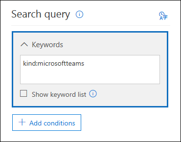
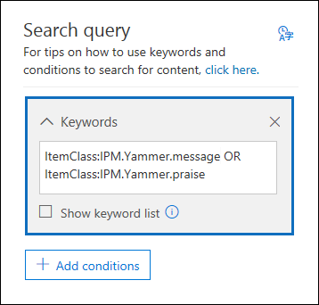

# <a name="feature-reference-for-content-search"></a>Referência de recurso para pesquisa de Conteúdo

Este artigo descreve os recursos e a funcionalidade da pesquisa de Conteúdo.

## <a name="content-search-limits"></a>Limites da pesquisa de conteúdo

Para obter uma descrição dos limites aplicados as Pesquisas de conteúdo, confira [Limites da Pesquisa de conteúdo](limits-for-content-search.md).
  
## <a name="building-a-search-query"></a>Criar uma consulta de pesquisa

Para obter informações detalhadas sobre como criar uma consulta de pesquisa usando operadores de pesquisa booleanos e condições de pesquisa, como também ao pesquisar tipos de informações confidenciais e conteúdo compartilhado com usuários de fora da organização, confira [Consultas de palavras-chave e condições de pesquisa para Pesquisa de conteúdo ](keyword-queries-and-search-conditions.md).
  
Lembre-se do seguinte ao usar a lista de palavras-chave para criar uma consulta de pesquisa.
  
- É necessário selecionar a caixa de seleção **Mostrar lista de palavras-chave** e digitar cada palavra-chave em uma linha separada para criar uma consulta de pesquisa em que as palavras-chave (ou frases de palavras-chave) de cada linha sejam conectadas pelo operador **OU**. Caso cole uma lista de palavras-chave na caixa de palavras-chave ou pressione a tecla **Enter** depois de digitar uma palavra-chave, elas não serão conectadas pelo operador **OU**. Veja a seguir uma maneira correta e outra incorreta de como adicionar uma lista de palavras-chave.
    
    **Incorreto**
    
    
  
    **Correto**
    
    
  
- Você também pode preparar uma lista de palavras-chave ou frases de palavra-chave em um arquivo do Excel ou em um arquivo de texto simples e, em seguida, copiar e colar a lista na lista de palavras-chave. Para fazer isso, é preciso selecionar a caixa de seleção **Mostrar lista de palavras-chave**. Em seguida, clique na primeira linha da lista de palavras-chave e cole a sua lista. Cada linha do Excel ou do arquivo de texto é colada em uma linha separada na lista de palavras-chave. 
    
- Depois de criar uma consulta usando a lista de palavras-chave, é uma boa ideia verificar a sintaxe da consulta de pesquisa para que a consulta de pesquisa seja a desejada. Na consulta de pesquisa exibida em **Consulta** no painel de detalhes, as palavras-chave são separadas pelo texto **(c:s)**. Isso indica que as palavras-chave estão conectadas por um operador lógico semelhante em funcionalidade ao operador **OU**. Da mesma forma, se a consulta de pesquisa incluir condições, as palavras-chave e as condições serão separadas pelo texto **(c:c)**. Isso indica que as palavras-chave estão conectadas por um operador lógico semelhante em funcionalidade ao operador **E**. Veja um exemplo de consulta de pesquisa (exibido no painel de Detalhes) que resulta ao usar a lista de palavras-chave e uma condição. 
    
    
  
- Ao executar uma pesquisa de conteúdo, o Microsoft 365 verifica automaticamente a consulta de pesquisa para caracteres sem suporte e para operadores booleanos que podem não estar em maiúsculas. Os caracteres sem suporte geralmente estão ocultos e costumam causar um erro de pesquisa ou retornam resultados inesperados. Para obter mais informações sobre os caracteres sem suporte que estão marcados, confira [Verifique se há erros na consulta da Pesquisa de Conteúdo](check-your-content-search-query-for-errors.md).
    
- Se você tiver uma consulta de pesquisa que contenha palavras-chave para caracteres que não estão em inglês (como caracteres chineses), clique em **Idioma/país de consulta** e selecione um valor de código cultural de idioma/país para a pesquisa. O padrão idioma/região é neutro. Como saber se é preciso alterar a configuração de idioma para uma pesquisa de conteúdo? Se você tiver certeza de que os locais de conteúdo contêm os caracteres que não estão em inglês que você está procurando, mas a pesquisa não retorna nenhum resultado, a configuração de idioma pode ser a causa.
  
## <a name="partially-indexed-items"></a>Itens parcialmente indexados

- Os itens parcialmente indexados na caixa de correio são incluídos nos resultados estimados da pesquisa. Itens parcialmente indexados do SharePoint e do OneDrive não são incluídos nos resultados estimados da pesquisa. Para obter mais informações, consulte [Itens parcialmente indexados na Descoberta eletrônica](partially-indexed-items-in-content-search.md).

## <a name="searching-onedrive-accounts"></a>Pesquisar contas do OneDrive

- Para coletar uma lista das URLs dos sites do OneDrive na organização, confira [Criar uma lista de todos os locais do OneDrive na organização](/onedrive/list-onedrive-urls). Esse script neste artigo cria um arquivo de texto que contém uma lista de todos os sites do OneDrive. Para executar esse script, é necessário instalar e usar o Shell de Gerenciamento Online do SharePoint. Não se esqueça de acrescentar a URL do domínio MySite da organização para cada site do OneDrive que você deseja pesquisar. Este é o domínio que contém todos os seus OneDrive; por exemplo, `https://contoso-my.sharepoint.com`. Veja um exemplo de URL para o site do OneDrive de um usuário: `https://contoso-my.sharepoint.com/personal/sarad_contoso_onmicrosoft.com`.
    
    No caso raro de acontecer do nome principal do usuário (UPN) ser alterado, a URL do local do OneDrive dessa pessoa é alterada para incorporar o novo UPN. Se isso acontecer, será preciso modificar uma pesquisa de conteúdo adicionando a nova URL do OneDrive do usuário e remover a antiga. Para saber mais, confira [Como as alterações de UPN afetam a URL do OneDrive](/onedrive/upn-changes).
  
## <a name="searching-microsoft-teams-and-microsoft-365-groups"></a>Pesquisar por Microsoft Teams e Grupos do Microsoft 365

Você pode pesquisar na caixa de correio associada a um Grupo do Microsoft 365 ou ao Microsoft Teams. Como o Microsoft Teams se baseia nos Grupos do Microsoft 365, a pesquisa é semelhante. Em ambos os casos, apenas a caixa de correio do grupo ou da equipe são pesquisadas. As caixas de correio do grupo ou membros da equipe não são pesquisadas. Para pesquisá-los, você precisa adicioná-los especificamente à pesquisa.
  
Lembre-se do seguinte ao pesquisar o conteúdo do Microsoft Teams e dos grupos do Microsoft 365.
  
- Para pesquisar conteúdo localizado no Teams e em Grupos do Microsoft 365, é necessário especificar a caixa de correio e o site do SharePoint associados a uma equipe ou grupo.

- O conteúdo dos canais privados é armazenado na caixa de correio de cada usuário, não na caixa de correio da equipe. Para pesquisar conteúdo em canais privados, confira [Descoberta eletrônica de canais privados](/microsoftteams/ediscovery-investigation#ediscovery-of-private-channels).
    
- Execute o cmdlet **Get-UnifiedGroup** no Exchange Online para exibir as propriedades de uma equipe ou Grupo Microsoft 365. Essa é uma boa maneira de obter o URL do site que está associado a uma equipe ou grupo. Por exemplo, o seguinte comando exibe as propriedades selecionadas para um Grupo Microsoft 365 denominado Equipe de Liderança Sênior: 
    
  ```text
  Get-UnifiedGroup "Senior Leadership Team" | FL DisplayName,Alias,PrimarySmtpAddress,SharePointSiteUrl
  DisplayName            : Senior Leadership Team
  Alias                  : seniorleadershipteam
  PrimarySmtpAddress     : seniorleadershipteam@contoso.onmicrosoft.com
  SharePointSiteUrl      : https://contoso.sharepoint.com/sites/seniorleadershipteam
  ```

    > [!NOTE]
    > Para executar o cmdlet **Get-UnifiedGroup**, é preciso ter atribuído a função de Destinatários Somente Leitura no Exchange Online ou ser membro de um grupo de funções atribuído à função de Destinatários Somente Leitura. 
  
- Quando uma caixa de correio de usuário é pesquisada, qualquer equipe ou Grupo do Microsoft 365 do qual o usuário seja membro não serão pesquisados. Da mesma forma, quando você pesquisa uma equipe ou um Grupo do Microsoft 365, apenas a caixa de correio do grupo e o site do grupo que você especifica são pesquisados. As caixas de correio e contas do OneDrive for Business dos membros do grupo não são pesquisadas, a menos que você os adicione explicitamente à pesquisa.

- Para obter uma lista dos membros de uma equipe ou Grupo do Microsoft 365, você pode exibir as propriedades na **Pagina Inicial\>Grupos** no Centro de administração do Microsoft 365. Como alternativa, execute o comando a seguir no PowerShell do Exchange Online: 

  ```powershell
  Get-UnifiedGroupLinks <group or team name> -LinkType Members | FL DisplayName,PrimarySmtpAddress
  ```

    > [!NOTE]
    > Para executar o cmdlet **Get-UnifiedGroupLinks**, é preciso ter atribuído a função de Destinatários Somente Leitura no Exchange Online ou ser um membro de um grupo de funções atribuído à função Destinatários Somente Leitura. 
  
- As conversas que fazem parte de um canal do Teams são armazenadas na caixa de correio associada à equipe. Da mesma forma, os arquivos que os membros da equipe compartilham em um canal são armazenados no site do SharePoint da equipe. Portanto, é preciso adicionar a caixa de correio da equipe e o site do SharePoint como um local de conteúdo para pesquisar conversas e arquivos em um canal.
    
- Como alternativa, as conversas que fazem parte da Lista de chat no Teams são armazenadas na caixa de correio do Exchange Online dos usuários que participam do chat. E os arquivos que um usuário compartilha nas conversas do Chat são armazenados na conta do OneDrive for Business do usuário que compartilha o arquivo. Portanto, é preciso adicionar as caixas de correio do usuário individual e as contas do OneDrive for Business como locais de conteúdo para pesquisar conversas e arquivos na Lista de chat.
    
    > [!NOTE]
    > Em uma implantação híbrida do Exchange, os usuários com uma caixa de correio local podem participar de conversas que fazem parte da Lista de chat no Teams. Nesse caso, o conteúdo dessas conversas também pode ser pesquisado porque é salvo em uma área de armazenamento baseada na nuvem (chamada de *caixa de correio baseada na nuvem para usuários locais*) para usuários que possuem uma caixa de correio local. Para obter mais informações, confira [Pesquisar dados de bate-papo do Teams para usuários locais](search-cloud-based-mailboxes-for-on-premises-users.md).
  
- Todas as equipes ou canal de equipe contêm um Wiki para anotações e colaboração. O conteúdo Wiki é salvo automaticamente em um arquivo com um formato .mht. Esse arquivo é armazenado na biblioteca de documentos de Dados do Wiki do Teams no site do SharePoint da equipe. Você pode usar a ferramenta de Pesquisa de Conteúdo para pesquisar o Wiki ao especificar o site do SharePoint da equipe como o local de conteúdo a ser pesquisado.

    > [!NOTE]
    > O recurso de pesquisar o Wiki de uma equipe ou canal (quando você pesquisa o site do SharePoint da equipe) foi lançado em 22 de junho de 2017. As páginas Wiki que foram salvas ou atualizadas nesta data ou após estarão disponíveis para serem pesquisadas. As páginas Wiki salvas pela última vez ou atualizadas antes dessa data não estarão disponíveis para a pesquisa.

- As informações resumidas para reuniões e chamadas em um canal do Teams também são armazenadas nas caixas de correio de usuários que discam para a reunião ou chamada. Isso significa que você pode usar a Pesquisa de Conteúdo para pesquisar esses registros de resumo. Essas informações de resumo incluem:
  
  - Data, hora de início, hora de término e duração de uma reunião ou chamada

  - A data e a hora em que cada participante ingressou na reunião ou chamada.

  - Chamadas enviadas para caixa postal

  - Chamadas perdidas ou não respondidas

  - Transferências de chamadas, que são representadas como duas chamadas separadas

  Pode levar até 8 horas para que os registros de reunião e de chamada estejam disponíveis para pesquisa.

  Nos resultados da pesquisa, os resumos de reuniões são identificados como **Reunião** no **Campo de tipo** e os resumos de chamadas são identificados como **Chamada**. Além disso, as conversas que fazem parte de um canal do Teams e chats 1xN são identificadas como **Mensagens instantâneas** no campo de **Tipo**.
  
  

   Para saber mais, confira [o Microsoft Teams lança a Descoberta eletrônica para chamadas e reuniões](https://techcommunity.microsoft.com/t5/microsoft-teams-blog/microsoft-teams-launches-ediscovery-for-calling-and-meetings/ba-p/210947).

- O conteúdo do cartão gerado por aplicativos em canais Teams, chats 1: 1 e chats 1xN é armazenado em caixas de correio e pode ser pesquisado. Um *cartão* é um contêiner de interface de usuário para pequenos pedaços de conteúdo. Os cartões podem ter várias propriedades e anexos e podem incluir botões que podem acionar ações do cartão. Para obter mais informações, confira [Cartões](/microsoftteams/platform/task-modules-and-cards/what-are-cards)

  Como outros conteúdos de equipes, onde o conteúdo do cartão é armazenado é baseado em onde o cartão foi usado. O conteúdo dos cartões usados em um canal Teams é armazenado na caixa de correio do grupo Teams. O conteúdo do cartão para bate-papos individuais e 1xN é armazenado nas caixas de correio dos participantes do bate-papo.

  Para pesquisar o conteúdo do cartão, você pode usar as condições de pesquisa `kind:microsoftteams` ou `itemclass:IPM.SkypeTeams.Message`. Ao revisar os resultados da pesquisa, o conteúdo do cartão gerado por bots em um canal Teams tem a propriedade de e-mail **Remetente/Autor** como `<appname>@teams.microsoft.com`, onde `appname` é o nome do aplicativo que gerou o conteúdo do cartão. Se o conteúdo do cartão foi gerado por um usuário, o valor de **Remetente/Autor** identifica o usuário.

  Ao exibir o conteúdo do cartão nos resultados da pesquisa de conteúdo, o conteúdo aparece como um anexo da mensagem. O anexo é denominado `appname.html`, onde `appname` é o nome do aplicativo que gerou o conteúdo do cartão. As capturas de tela a seguir mostram como o conteúdo do cartão (para um aplicativo chamado Asana) aparece no Teams e nos resultados de uma pesquisa.

  **Conteúdo do cartão no Teams**

  

  **Conteúdo do cartão nos resultados de pesquisa**
  
  

  > [!NOTE]
  > Para exibir imagens do conteúdo do cartão nos resultados da pesquisa neste momento (como as marcas de seleção na captura de tela anterior), você deve estar conectado ao Teams (em https://teams.microsoft.com) em uma guia diferente na mesma sessão do navegador que você usa para exibir os resultados da pesquisa. Caso contrário, serão exibidos espaços reservados para imagens.

- Você pode usar a propriedade de email **Tipo** ou a condição de pesquisa **Tipo de mensagem** para pesquisar especificamente por conteúdo no Teams.
  
  - Para usar a propriedade **Tipo** como parte da consulta de pesquisa de palavras-chave, na caixa **Palavras-chave** de uma consulta de pesquisa, digite `kind:microsoftteams`.

    
  
  - Para utilizar uma condição de pesquisa, adicione a condição de **Tipo de mensagem** e use o valor `microsoftteams`.

    

   Observe que as condições estão logicamente associadas à consulta de palavra-chave pelo operador **E (AND)**. Isso significa que um item deve corresponder à consulta da palavra-chave e à condição da pesquisa para aparecer nos resultados da pesquisa. Para saber mais, consulte a seção “Diretrizes de condições de uso” em [Consultas de palavra-chave e condições de pesquisa para Pesquisa de Conteúdo](keyword-queries-and-search-conditions.md#guidelines-for-using-conditions).
  
## <a name="searching-yammer-groups"></a>Pesquisar grupos do Yammer

Você pode usar a propriedade de e-mail **ItemClass** ou o critério de pesquisa **Tipo** para pesquisar itens de conversa especificamente nos grupos do Yammer.

  - Para usar a propriedade **ItemClass** como parte da consulta de pesquisa de palavra-chave, na caixa **palavras-chave** de uma consulta de pesquisa, você pode digitar uma (ou todas) as seguintes propriedades: pares de valores:

     - ItemClass:IPM.Yammer.message
     - ItemClass:IPM.Yammer.poll
     - ItemClass:IPM.Yammer.praise
     - ItemClass:IPM.Yammer.question
  
    Por exemplo, você pode usar a seguinte consulta de pesquisa para retornar mensagens do Yammer e itens de elogio do Yammer:

    
  
  - Como alternativa, você pode usar a condição de e-mail **Tipo** e selecionar **mensagens do Yammer** para retornar itens do Yammer. Por exemplo, a seguinte consulta de pesquisa retornará todos os itens de conversa do Yammer que contenham a palavra-chave "confidencial". 

    

## <a name="searching-inactive-mailboxes"></a>Pesquisar caixas de correio inativas

Você pode pesquisar por caixas de correio inativas em uma pesquisa de conteúdo. Para ver uma lista das caixas de correio inativas na sua organização, execute o comando  `Get-Mailbox -InactiveMailboxOnly`no PowerShell do Exchange Online. Como alternativa, vá para **Governança de informações** \> **Retenção** no Centro de Conformidade e Segurança, e em seguida, clique em **Mais** \> **Caixas de correio inativas**.
  
Eis alguns pontos a serem levados em consideração durante a pesquisa de caixas de correio inativas.

- Se uma pesquisa de conteúdo incluir uma caixa de correio de usuário e essa caixa de correio depois for desativada, a pesquisa de conteúdo continuará a pesquisar a caixa de correio inativa ao executar a pesquisa novamente.

- Em alguns casos, um usuário pode ter uma caixa de correio ativa e uma inativa com o mesmo endereço SMTP. Nesse caso, apenas a caixa de correio específica que você selecionar como local para uma pesquisa de conteúdo será pesquisada. Em outras palavras, se você adicionar a caixa de correio de um usuário a uma pesquisa, não será possível supor que as caixas de correio ativas e inativas sejam pesquisadas. Somente a caixa de correio que você adicionar explicitamente à pesquisa será pesquisada.

- Você pode usar o Centro de Conformidade & Segurança do PowerShell para criar uma pesquisa de conteúdo para pesquisar uma caixa de correio inativa. Para fazer isso, você precisa acrescentar um ponto (. ) ao endereço de email da caixa de correio inativa. Por exemplo, o comando a seguir cria uma pesquisa de conteúdo que pesquisa uma caixa de correio inativa com o endereço de email pavelb@contoso.onmicrosoft.com:

   ```powershell
   New-ComplianceSearch -Name InactiveMailboxSearch -ExchangeLocation .pavelb@contoso.onmicrosoft.com -AllowNotFoundExchangeLocationsEnabled $true
   ```

- Não é recomendável de forma alguma que você tenha uma caixa de correio ativa e uma inativa com o mesmo endereço SMTP. Se você precisar reutilizar o endereço SMTP atribuído atualmente a uma caixa de correio inativa, é recomendável recuperar a caixa de correio inativa ou restaurar o conteúdo de uma caixa de correio inativa para uma ativa (ou o arquivo de uma caixa de correio ativa) e excluir a caixa de correio inativa. Para obter mais informações, consulte um dos seguintes tópicos:

  - [Recuperar uma caixa de correio inativa no Office 365](recover-an-inactive-mailbox.md)

  - [Restaurar uma caixa de correio inativa no Office 365](restore-an-inactive-mailbox.md)

  - [Excluir uma caixa de correio inativa no Office 365](delete-an-inactive-mailbox.md)

## <a name="searching-disconnected-or-de-licensed-mailboxes"></a>Pesquisar caixas de correio desconectadas ou que tiveram a licença removida

Se a licença do Exchange Online (ou a licença inteira do Microsoft 365) for removida de uma conta de usuário no Azure Active Directory, a caixa de correio do usuário se tornará uma caixa de correio *desconectada*. Isso significa que a caixa de correio não está mais associada à conta de usuário. Veja o que acontece ao pesquisar caixas de correio desconectadas:

- Se a licença for removida de uma caixa de correio, esta não será mais pesquisável. 

- Se uma pesquisa de conteúdo existente incluir uma caixa de correio em que a licença for removida, nenhum resultado da pesquisa da caixa de correio desconectada será retornado se você executar novamente a pesquisa de conteúdo.

- Se você usar o cmdlet **New-ComplianceSearch** para criar uma pesquisa de conteúdo e especificar um caixa de correio desconectada como o local de conteúdo do Exchange para pesquisar, a pesquisa de conteúdo não retornará resultados de pesquisa da caixa de correio desconectada.

Se você precisar preservar os dados em uma caixa de correio desconectada para que possam ser pesquisados, você deve colocar a caixa de correio em retenção antes de remover a licença. Isso preserva os dados e mantém a caixa de correio desconectada pesquisável até que a retenção seja removida. Para saber mais sobre retenções, confira [Como identificar o tipo de retenção de uma caixa de correio do Exchange Online](identify-a-hold-on-an-exchange-online-mailbox.md).

## <a name="searching-for-content-in-a-sharepoint-multi-geo-environment"></a>Pesquisa de conteúdo em um ambiente Multi-Geo do SharePoint (englobando diferente áreas geográficas)

Se for necessário que um gerente de Descoberta Eletrônica pesquise conteúdo no SharePoint e no OneDrive em um [ambiente multi-geo do SharePoint](../enterprise/multi-geo-capabilities-in-onedrive-and-sharepoint-online-in-microsoft-365.md), você precisará fazer o seguinte:

1. Crie uma conta de usuário separada para cada área geográfica satélite que o gerenciador de Descoberta Eletrônica precisa pesquisar. Para pesquisar conteúdo nos sites dessa área geográfica, o gerenciador de Descoberta Eletrônica deve entrar na conta que você criou para aquela área e executar uma pesquisa de conteúdo.

2. Crie um filtro de permissões de pesquisa para cada área geográfica satélite que o gerenciador de Descoberta Eletrônica precise pesquisar. Cada um desses filtros de permissões de pesquisa limita o escopo da pesquisa de conteúdo a uma área geográfica específica quando o gerenciador de Descoberta Eletrônica está conectado à conta de usuário associada à essa área.

> [!TIP]
> Você não precisa usar essa estratégia ao usar a ferramenta de pesquisa na[Descoberta Eletrônica Avançada](overview-ediscovery-20.md). Isso ocorre porque todos os data centers são pesquisados quando você pesquisa sites do SharePoint e contas do OneDrive em Descoberta Eletrônica Avançada. Você deve usar essa estratégia de contas de usuário específicas de região e esses filtros de permissões de pesquisa somente quando usar a ferramenta Pesquisa de Conteúdo e executar pesquisas associadas a [casos de Descoberta Eletrônica](./get-started-core-ediscovery.md).

Por exemplo, digamos que um gerenciador de Descoberta Eletrônica precise pesquisar o conteúdo do SharePoint e do OneDrive em áreas satélite na América do Norte, Europa e Pacífico Asiático. A primeira etapa é criar três contas de usuários, uma para cada área. A próxima etapa é criar três filtros de permissões de pesquisa, um para cada área *e* conta de usuário correspondente. Aqui estão exemplos de três filtros de permissões de pesquisa para esse cenário. Em cada um desses exemplos, o parâmetro **Região** especifica o local do data center do SharePoint para aquela região geográfica enquanto o parâmetro **Usuários** especifica a conta do usuário correspondente.

**América do Norte**

```powershell
New-ComplianceSecurityFilter -FilterName "SPMultiGeo-NAM" -Users ediscovery-nam@contoso.com -Region NAM -Action ALL
```

**Europa**

```powershell
New-ComplianceSecurityFilter -FilterName "SPMultiGeo-EUR" -Users ediscovery-eur@contoso.com -Region EUR -Action ALL
```

**Pacífico Asiático**

```powershell
New-ComplianceSecurityFilter -FilterName "SPMultiGeo-APC" -Users ediscovery-apc@contoso.com -Region APC -Action ALL
```

Lembre-se do seguinte ao usar filtros de permissão de pesquisa para pesquisar conteúdo em ambientes de regiões diversas:

- O parâmetro **Região** direciona as pesquisas para a área de satélite especificada. Se um gerente de Descoberta Eletrônica só pesquisa sites do SharePoint e do OneDrive fora da região especificada no filtro permissões de pesquisa, nenhum resultado de pesquisa será mostrado. 

- O parâmetro **Região** não controla as pesquisas de caixas de correio do Exchange. Todos os datacenters são pesquisados quando se pesquisa caixas de correio.

Para obter mais informações sobre como usar filtros de permissões de pesquisa em um ambiente de várias regiões, confira a seção "Pesquisa e exportação de conteúdo em ambientes Multi-Geo" em[Configurar limites de conformidade para investigações de Descoberta Eletrônica](set-up-compliance-boundaries.md#searching-and-exporting-content-in-multi-geo-environments).
