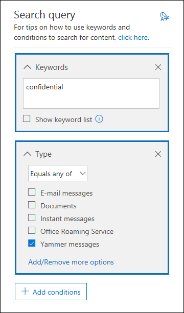

# <a name="feature-reference-for-content-search"></a><span data-ttu-id="2ed92-103">Referência de recurso para pesquisa de Conteúdo</span><span class="sxs-lookup"><span data-stu-id="2ed92-103">Feature reference for Content search</span></span>

<span data-ttu-id="2ed92-104">Este artigo descreve os recursos e a funcionalidade da pesquisa de Conteúdo.</span><span class="sxs-lookup"><span data-stu-id="2ed92-104">This article describes features and functionality of Content search.</span></span>

## <a name="content-search-limits"></a><span data-ttu-id="2ed92-105">Limites da pesquisa de conteúdo</span><span class="sxs-lookup"><span data-stu-id="2ed92-105">Content search limits</span></span>

<span data-ttu-id="2ed92-106">Para obter uma descrição dos limites aplicados as Pesquisas de conteúdo, confira [Limites da Pesquisa de conteúdo](limits-for-content-search.md).</span><span class="sxs-lookup"><span data-stu-id="2ed92-106">For a description of the limits that are applied to Content searches, see [Limits for Content search](limits-for-content-search.md).</span></span>
  
## <a name="building-a-search-query"></a><span data-ttu-id="2ed92-107">Criar uma consulta de pesquisa</span><span class="sxs-lookup"><span data-stu-id="2ed92-107">Building a search query</span></span>

<span data-ttu-id="2ed92-108">Para obter informações detalhadas sobre como criar uma consulta de pesquisa usando operadores de pesquisa booleanos e condições de pesquisa, como também ao pesquisar tipos de informações confidenciais e conteúdo compartilhado com usuários de fora da organização, confira [Consultas de palavras-chave e condições de pesquisa para Pesquisa de conteúdo ](keyword-queries-and-search-conditions.md).</span><span class="sxs-lookup"><span data-stu-id="2ed92-108">For detailed information about creating a search query, using Boolean search operators and search conditions, and searching for sensitive information types and content shared with users outside your organization, see [Keyword queries and search conditions for Content Search ](keyword-queries-and-search-conditions.md).</span></span>
  
<span data-ttu-id="2ed92-109">Lembre-se do seguinte ao usar a lista de palavras-chave para criar uma consulta de pesquisa.</span><span class="sxs-lookup"><span data-stu-id="2ed92-109">Keep the following things in mind when using the keyword list to create a search query.</span></span>
  
- <span data-ttu-id="2ed92-110">É necessário selecionar a caixa de seleção **Mostrar lista de palavras-chave** e digitar cada palavra-chave em uma linha separada para criar uma consulta de pesquisa em que as palavras-chave (ou frases de palavras-chave) de cada linha sejam conectadas pelo operador **OU**.</span><span class="sxs-lookup"><span data-stu-id="2ed92-110">You have to select the **Show keyword list** checkbox and then type each keyword in a separate row to create a search query where the keywords (or keyword phrases) in each row are connected by the **OR** operator.</span></span> <span data-ttu-id="2ed92-111">Caso cole uma lista de palavras-chave na caixa de palavras-chave ou pressione a tecla **Enter** depois de digitar uma palavra-chave, elas não serão conectadas pelo operador **OU**.</span><span class="sxs-lookup"><span data-stu-id="2ed92-111">If you paste a list of keywords in the keyword box or press the **Enter** key after typing a keyword, they won't be connected by the **OR** operator.</span></span> <span data-ttu-id="2ed92-112">Veja a seguir uma maneira correta e outra incorreta de como adicionar uma lista de palavras-chave.</span><span class="sxs-lookup"><span data-stu-id="2ed92-112">Here are incorrect and correct examples of how to add a list of keywords.</span></span>
    
    <span data-ttu-id="2ed92-113">**Incorreto**</span><span class="sxs-lookup"><span data-stu-id="2ed92-113">**Incorrect**</span></span>
    
    
  
    <span data-ttu-id="2ed92-115">**Correto**</span><span class="sxs-lookup"><span data-stu-id="2ed92-115">**Correct**</span></span>
    
    
  
- <span data-ttu-id="2ed92-117">Você também pode preparar uma lista de palavras-chave ou frases de palavra-chave em um arquivo do Excel ou em um arquivo de texto simples e, em seguida, copiar e colar a lista na lista de palavras-chave.</span><span class="sxs-lookup"><span data-stu-id="2ed92-117">You can also prepare a list of keywords or keyword phrases in an Excel file or a plain text file, and then copy and paste your list into the keyword list.</span></span> <span data-ttu-id="2ed92-118">Para fazer isso, é preciso selecionar a caixa de seleção **Mostrar lista de palavras-chave**.</span><span class="sxs-lookup"><span data-stu-id="2ed92-118">To do this, you have to select the **Show keyword list** check box.</span></span> <span data-ttu-id="2ed92-119">Em seguida, clique na primeira linha da lista de palavras-chave e cole a sua lista.</span><span class="sxs-lookup"><span data-stu-id="2ed92-119">Then, click the first row in the keyword list and paste your list.</span></span> <span data-ttu-id="2ed92-120">Cada linha do Excel ou do arquivo de texto é colada em uma linha separada na lista de palavras-chave.</span><span class="sxs-lookup"><span data-stu-id="2ed92-120">Each line from the Excel or text file is pasted into separate row in the keyword list.</span></span> 
    
- <span data-ttu-id="2ed92-121">Depois de criar uma consulta usando a lista de palavras-chave, é uma boa ideia verificar a sintaxe da consulta de pesquisa para que a consulta de pesquisa seja a desejada.</span><span class="sxs-lookup"><span data-stu-id="2ed92-121">After you create a query using the keyword list, it's a good idea to verify the search query syntax to make the search query is what you intended.</span></span> <span data-ttu-id="2ed92-122">Na consulta de pesquisa exibida em **Consulta** no painel de detalhes, as palavras-chave são separadas pelo texto **(c:s)**.</span><span class="sxs-lookup"><span data-stu-id="2ed92-122">In the search query that's displayed under **Query** in the details pane, the keywords are separated by the text **(c:s)**.</span></span> <span data-ttu-id="2ed92-123">Isso indica que as palavras-chave estão conectadas por um operador lógico semelhante em funcionalidade ao operador **OU**.</span><span class="sxs-lookup"><span data-stu-id="2ed92-123">This indicates that the keywords are connected by a logical operator similar in functionality to the **OR** operator.</span></span> <span data-ttu-id="2ed92-124">Da mesma forma, se a consulta de pesquisa incluir condições, as palavras-chave e as condições serão separadas pelo texto **(c:c)**.</span><span class="sxs-lookup"><span data-stu-id="2ed92-124">Similarly, if your search query includes conditions, the keywords and the conditions are separated by the text **(c:c)**.</span></span> <span data-ttu-id="2ed92-125">Isso indica que as palavras-chave estão conectadas por um operador lógico semelhante em funcionalidade ao operador **E**.</span><span class="sxs-lookup"><span data-stu-id="2ed92-125">This indicates that the keywords are connected to the conditions with a logical operator similar in functionality to the **AND** operator.</span></span> <span data-ttu-id="2ed92-126">Veja um exemplo de consulta de pesquisa (exibido no painel de Detalhes) que resulta ao usar a lista de palavras-chave e uma condição.</span><span class="sxs-lookup"><span data-stu-id="2ed92-126">Here's an example of the search query (displayed in the Details pane) that results when using the keyword list and a condition.</span></span> 
    
    
  
- <span data-ttu-id="2ed92-128">Ao executar uma pesquisa de conteúdo, o Microsoft 365 verifica automaticamente a consulta de pesquisa para caracteres sem suporte e para operadores booleanos que podem não estar em maiúsculas.</span><span class="sxs-lookup"><span data-stu-id="2ed92-128">When you run a content search, Microsoft 365 automatically checks your search query for unsupported characters and for Boolean operators that may not be capitalized.</span></span> <span data-ttu-id="2ed92-129">Os caracteres sem suporte geralmente estão ocultos e costumam causar um erro de pesquisa ou retornam resultados inesperados.</span><span class="sxs-lookup"><span data-stu-id="2ed92-129">Unsupported characters are often hidden and typically cause a search error or return unintended results.</span></span> <span data-ttu-id="2ed92-130">Para obter mais informações sobre os caracteres sem suporte que estão marcados, confira [Verifique se há erros na consulta da Pesquisa de Conteúdo](check-your-content-search-query-for-errors.md).</span><span class="sxs-lookup"><span data-stu-id="2ed92-130">For more information about the unsupported characters that are checked, see [Check your Content Search query for errors](check-your-content-search-query-for-errors.md).</span></span>
    
- <span data-ttu-id="2ed92-131">Se você tiver uma consulta de pesquisa que contenha palavras-chave para caracteres que não estão em inglês (como caracteres chineses), clique em **Idioma/país de consulta** e selecione um valor de código cultural de idioma/país para a pesquisa.</span><span class="sxs-lookup"><span data-stu-id="2ed92-131">If you have a search query that contains keywords for non-English characters (such as Chinese characters), you can click **Query language-country/region** and select a language-country culture code value for the search.</span></span> <span data-ttu-id="2ed92-132">O padrão idioma/região é neutro.</span><span class="sxs-lookup"><span data-stu-id="2ed92-132">The default language/region is neutral.</span></span> <span data-ttu-id="2ed92-133">Como saber se é preciso alterar a configuração de idioma para uma pesquisa de conteúdo?</span><span class="sxs-lookup"><span data-stu-id="2ed92-133">How can you tell if you need to change the language setting for a content search?</span></span> <span data-ttu-id="2ed92-134">Se você tiver certeza de que os locais de conteúdo contêm os caracteres que não estão em inglês que você está procurando, mas a pesquisa não retorna nenhum resultado, a configuração de idioma pode ser a causa.</span><span class="sxs-lookup"><span data-stu-id="2ed92-134">If you're certain content locations contain the non-English characters you're searching for, but the search returns no results, the language setting may be the cause.</span></span>
  
## <a name="partially-indexed-items"></a><span data-ttu-id="2ed92-135">Itens parcialmente indexados</span><span class="sxs-lookup"><span data-stu-id="2ed92-135">Partially indexed items</span></span>

- <span data-ttu-id="2ed92-136">Os itens parcialmente indexados na caixa de correio são incluídos nos resultados estimados da pesquisa.</span><span class="sxs-lookup"><span data-stu-id="2ed92-136">Partially indexed items in mailboxes are included in the estimated search results.</span></span> <span data-ttu-id="2ed92-137">Itens parcialmente indexados do SharePoint e do OneDrive não são incluídos nos resultados estimados da pesquisa.</span><span class="sxs-lookup"><span data-stu-id="2ed92-137">Partially indexed items from SharePoint and OneDrive aren't included in the estimated search results.</span></span> <span data-ttu-id="2ed92-138">Para obter mais informações, consulte [Itens parcialmente indexados na Descoberta eletrônica](partially-indexed-items-in-content-search.md).</span><span class="sxs-lookup"><span data-stu-id="2ed92-138">For more information, see [Partially indexed items in eDiscovery](partially-indexed-items-in-content-search.md).</span></span>

## <a name="searching-onedrive-accounts"></a><span data-ttu-id="2ed92-139">Pesquisar contas do OneDrive</span><span class="sxs-lookup"><span data-stu-id="2ed92-139">Searching OneDrive accounts</span></span>

- <span data-ttu-id="2ed92-140">Para coletar uma lista das URLs dos sites do OneDrive na organização, confira [Criar uma lista de todos os locais do OneDrive na organização](/onedrive/list-onedrive-urls).</span><span class="sxs-lookup"><span data-stu-id="2ed92-140">To collect a list of the URLs for the OneDrive sites in your organization, see [Create a list of all OneDrive locations in your organization](/onedrive/list-onedrive-urls).</span></span> <span data-ttu-id="2ed92-141">Esse script neste artigo cria um arquivo de texto que contém uma lista de todos os sites do OneDrive.</span><span class="sxs-lookup"><span data-stu-id="2ed92-141">This script in this article creates a text file that contains a list of all OneDrive sites.</span></span> <span data-ttu-id="2ed92-142">Para executar esse script, é necessário instalar e usar o Shell de Gerenciamento Online do SharePoint.</span><span class="sxs-lookup"><span data-stu-id="2ed92-142">To run this script, you have to install and use the SharePoint Online Management Shell.</span></span> <span data-ttu-id="2ed92-143">Não se esqueça de acrescentar a URL do domínio MySite da organização para cada site do OneDrive que você deseja pesquisar.</span><span class="sxs-lookup"><span data-stu-id="2ed92-143">Be sure to append the URL for your organization's MySite domain to each OneDrive site that you want to search.</span></span> <span data-ttu-id="2ed92-144">Este é o domínio que contém todos os seus OneDrive; por exemplo, `https://contoso-my.sharepoint.com`.</span><span class="sxs-lookup"><span data-stu-id="2ed92-144">This is the domain that contains all your OneDrive; for example,  `https://contoso-my.sharepoint.com`.</span></span> <span data-ttu-id="2ed92-145">Veja um exemplo de URL para o site do OneDrive de um usuário: `https://contoso-my.sharepoint.com/personal/sarad_contoso_onmicrosoft.com`.</span><span class="sxs-lookup"><span data-stu-id="2ed92-145">Here's an example of a URL for a user's OneDrive site:  `https://contoso-my.sharepoint.com/personal/sarad_contoso_onmicrosoft.com`.</span></span>
    
    <span data-ttu-id="2ed92-146">No caso raro de acontecer do nome principal do usuário (UPN) ser alterado, a URL do local do OneDrive dessa pessoa é alterada para incorporar o novo UPN.</span><span class="sxs-lookup"><span data-stu-id="2ed92-146">In the rare case of a person's user principal name (UPN) being changed, the URL for their OneDrive location is changed to incorporate the new UPN.</span></span> <span data-ttu-id="2ed92-147">Se isso acontecer, será preciso modificar uma pesquisa de conteúdo adicionando a nova URL do OneDrive do usuário e remover a antiga.</span><span class="sxs-lookup"><span data-stu-id="2ed92-147">If this happens, you have to modify a content search by adding the user's new OneDrive URL and removing the old one.</span></span> <span data-ttu-id="2ed92-148">Para saber mais, confira [Como as alterações de UPN afetam a URL do OneDrive](/onedrive/upn-changes).</span><span class="sxs-lookup"><span data-stu-id="2ed92-148">For more information, see [How UPN changes affect the OneDrive URL](/onedrive/upn-changes).</span></span>
  
## <a name="searching-microsoft-teams-and-microsoft-365-groups"></a><span data-ttu-id="2ed92-149">Pesquisar por Microsoft Teams e Grupos do Microsoft 365</span><span class="sxs-lookup"><span data-stu-id="2ed92-149">Searching Microsoft Teams and Microsoft 365 Groups</span></span>

<span data-ttu-id="2ed92-150">Você pode pesquisar na caixa de correio associada a um Grupo do Microsoft 365 ou ao Microsoft Teams.</span><span class="sxs-lookup"><span data-stu-id="2ed92-150">You can search the mailbox that's associated with a Microsoft Team or Microsoft 365 Group.</span></span> <span data-ttu-id="2ed92-151">Como o Microsoft Teams se baseia nos Grupos do Microsoft 365, a pesquisa é semelhante.</span><span class="sxs-lookup"><span data-stu-id="2ed92-151">Because Microsoft Teams is built on Microsoft 365 Groups, searching them is similar.</span></span> <span data-ttu-id="2ed92-152">Em ambos os casos, apenas a caixa de correio do grupo ou da equipe são pesquisadas.</span><span class="sxs-lookup"><span data-stu-id="2ed92-152">In both cases, only the group or team mailbox is searched.</span></span> <span data-ttu-id="2ed92-153">As caixas de correio do grupo ou membros da equipe não são pesquisadas.</span><span class="sxs-lookup"><span data-stu-id="2ed92-153">The mailboxes of the group or team members aren't searched.</span></span> <span data-ttu-id="2ed92-154">Para pesquisá-los, você precisa adicioná-los especificamente à pesquisa.</span><span class="sxs-lookup"><span data-stu-id="2ed92-154">To search them, you have to specifically add them to the search.</span></span>
  
<span data-ttu-id="2ed92-155">Lembre-se do seguinte ao pesquisar o conteúdo do Microsoft Teams e dos grupos do Microsoft 365.</span><span class="sxs-lookup"><span data-stu-id="2ed92-155">Keep the following things in mind when searching for content in Microsoft Teams and Microsoft 365 Groups.</span></span>
  
- <span data-ttu-id="2ed92-156">Para pesquisar conteúdo localizado no Teams e em Grupos do Microsoft 365, é necessário especificar a caixa de correio e o site do SharePoint associados a uma equipe ou grupo.</span><span class="sxs-lookup"><span data-stu-id="2ed92-156">To search for content located in Teams and Microsoft 365 Groups, you have to specify the mailbox and SharePoint site that are associated with a team or group.</span></span>

- <span data-ttu-id="2ed92-157">O conteúdo dos canais privados é armazenado na caixa de correio de cada usuário, não na caixa de correio da equipe.</span><span class="sxs-lookup"><span data-stu-id="2ed92-157">Content from private channels is stored in each user's mailbox, not the team mailbox.</span></span> <span data-ttu-id="2ed92-158">Para pesquisar conteúdo em canais privados, confira [Descoberta eletrônica de canais privados](/microsoftteams/ediscovery-investigation#ediscovery-of-private-channels).</span><span class="sxs-lookup"><span data-stu-id="2ed92-158">To search for content in private channels, see [eDiscovery of private channels](/microsoftteams/ediscovery-investigation#ediscovery-of-private-channels).</span></span>
    
- <span data-ttu-id="2ed92-159">Execute o cmdlet **Get-UnifiedGroup** no Exchange Online para exibir as propriedades de uma equipe ou Grupo Microsoft 365.</span><span class="sxs-lookup"><span data-stu-id="2ed92-159">Run the **Get-UnifiedGroup** cmdlet in Exchange Online to view properties for a team or a Microsoft 365 Group.</span></span> <span data-ttu-id="2ed92-160">Essa é uma boa maneira de obter o URL do site que está associado a uma equipe ou grupo.</span><span class="sxs-lookup"><span data-stu-id="2ed92-160">This is a good way to get the URL for the site that's associated with a team or a group.</span></span> <span data-ttu-id="2ed92-161">Por exemplo, o seguinte comando exibe as propriedades selecionadas para um Grupo Microsoft 365 denominado Equipe de Liderança Sênior:</span><span class="sxs-lookup"><span data-stu-id="2ed92-161">For example, the following command displays selected properties for a Microsoft 365 Group named Senior Leadership Team:</span></span> 
    
  ```text
  Get-UnifiedGroup "Senior Leadership Team" | FL DisplayName,Alias,PrimarySmtpAddress,SharePointSiteUrl
  DisplayName            : Senior Leadership Team
  Alias                  : seniorleadershipteam
  PrimarySmtpAddress     : seniorleadershipteam@contoso.onmicrosoft.com
  SharePointSiteUrl      : https://contoso.sharepoint.com/sites/seniorleadershipteam
  ```

    > [!NOTE]
    > <span data-ttu-id="2ed92-162">Para executar o cmdlet **Get-UnifiedGroup**, é preciso ter atribuído a função de Destinatários Somente Leitura no Exchange Online ou ser membro de um grupo de funções atribuído à função de Destinatários Somente Leitura.</span><span class="sxs-lookup"><span data-stu-id="2ed92-162">To run the **Get-UnifiedGroup** cmdlet, you have to be assigned the View-Only Recipients role in Exchange Online or be a member of a role group that's assigned the View-Only Recipients role.</span></span> 
  
- <span data-ttu-id="2ed92-163">Quando uma caixa de correio de usuário é pesquisada, qualquer equipe ou Grupo do Microsoft 365 do qual o usuário seja membro não serão pesquisados.</span><span class="sxs-lookup"><span data-stu-id="2ed92-163">When a user's mailbox is searched, any team or Microsoft 365 Group that the user is a member of won't be searched.</span></span> <span data-ttu-id="2ed92-164">Da mesma forma, quando você pesquisa uma equipe ou um Grupo do Microsoft 365, apenas a caixa de correio do grupo e o site do grupo que você especifica são pesquisados.</span><span class="sxs-lookup"><span data-stu-id="2ed92-164">Similarly, when you search a team or a Microsoft 365 Group, only the group mailbox and group site that you specify is searched.</span></span> <span data-ttu-id="2ed92-165">As caixas de correio e contas do OneDrive for Business dos membros do grupo não são pesquisadas, a menos que você os adicione explicitamente à pesquisa.</span><span class="sxs-lookup"><span data-stu-id="2ed92-165">The mailboxes and OneDrive for Business accounts of group members aren't searched unless you explicitly add them to the search.</span></span>

- <span data-ttu-id="2ed92-166">Para obter uma lista dos membros de uma equipe ou Grupo do Microsoft 365, você pode exibir as propriedades na **Pagina Inicial\>Grupos** no Centro de administração do Microsoft 365.</span><span class="sxs-lookup"><span data-stu-id="2ed92-166">To get a list of the members of a team or a Microsoft 365 Group, you can view the properties on the **Home \> Groups** page in the Microsoft 365 admin center.</span></span> <span data-ttu-id="2ed92-167">Como alternativa, execute o comando a seguir no PowerShell do Exchange Online:</span><span class="sxs-lookup"><span data-stu-id="2ed92-167">Alternatively, you can run the following command in Exchange Online PowerShell:</span></span> 

  ```powershell
  Get-UnifiedGroupLinks <group or team name> -LinkType Members | FL DisplayName,PrimarySmtpAddress
  ```

    > [!NOTE]
    > <span data-ttu-id="2ed92-168">Para executar o cmdlet **Get-UnifiedGroupLinks**, é preciso ter atribuído a função de Destinatários Somente Leitura no Exchange Online ou ser um membro de um grupo de funções atribuído à função Destinatários Somente Leitura.</span><span class="sxs-lookup"><span data-stu-id="2ed92-168">To run the **Get-UnifiedGroupLinks** cmdlet, you have to be assigned the View-Only Recipients role in Exchange Online or be a member of a role group that's assigned the View-Only Recipients role.</span></span> 
  
- <span data-ttu-id="2ed92-169">As conversas que fazem parte de um canal do Teams são armazenadas na caixa de correio associada à equipe.</span><span class="sxs-lookup"><span data-stu-id="2ed92-169">Conversations that are part of a Teams channel are stored in the mailbox that's associated with the team.</span></span> <span data-ttu-id="2ed92-170">Da mesma forma, os arquivos que os membros da equipe compartilham em um canal são armazenados no site do SharePoint da equipe.</span><span class="sxs-lookup"><span data-stu-id="2ed92-170">Similarly, files that team members share in a channel are stored on the team's SharePoint site.</span></span> <span data-ttu-id="2ed92-171">Portanto, é preciso adicionar a caixa de correio da equipe e o site do SharePoint como um local de conteúdo para pesquisar conversas e arquivos em um canal.</span><span class="sxs-lookup"><span data-stu-id="2ed92-171">Therefore, you have to add the team mailbox and SharePoint site as a content location to search conversations and files in a channel.</span></span>
    
- <span data-ttu-id="2ed92-172">Como alternativa, as conversas que fazem parte da Lista de chat no Teams são armazenadas na caixa de correio do Exchange Online dos usuários que participam do chat.</span><span class="sxs-lookup"><span data-stu-id="2ed92-172">Alternatively, conversations that are part of the Chat list in Teams are stored in the Exchange Online mailbox of the users who participate in the chat.</span></span> <span data-ttu-id="2ed92-173">E os arquivos que um usuário compartilha nas conversas do Chat são armazenados na conta do OneDrive for Business do usuário que compartilha o arquivo.</span><span class="sxs-lookup"><span data-stu-id="2ed92-173">And files that a user shares in Chat conversations are stored in the OneDrive for Business account of the user who shares the file.</span></span> <span data-ttu-id="2ed92-174">Portanto, é preciso adicionar as caixas de correio do usuário individual e as contas do OneDrive for Business como locais de conteúdo para pesquisar conversas e arquivos na Lista de chat.</span><span class="sxs-lookup"><span data-stu-id="2ed92-174">Therefore, you have to add the individual user mailboxes and OneDrive for Business accounts as content locations to search conversations and files in the Chat list.</span></span>
    
    > [!NOTE]
    > <span data-ttu-id="2ed92-175">Em uma implantação híbrida do Exchange, os usuários com uma caixa de correio local podem participar de conversas que fazem parte da Lista de chat no Teams.</span><span class="sxs-lookup"><span data-stu-id="2ed92-175">In an Exchange hybrid deployment, users with an on-premises mailbox might participate in conversations that are part of the Chat list in Teams.</span></span> <span data-ttu-id="2ed92-176">Nesse caso, o conteúdo dessas conversas também pode ser pesquisado porque é salvo em uma área de armazenamento baseada na nuvem (chamada de *caixa de correio baseada na nuvem para usuários locais*) para usuários que possuem uma caixa de correio local.</span><span class="sxs-lookup"><span data-stu-id="2ed92-176">In this case, content from these conversations is also searchable because it's saved to a cloud-based storage area (called a *cloud-based mailbox for on-premises users*) for users who have an on-premises mailbox.</span></span> <span data-ttu-id="2ed92-177">Para obter mais informações, confira [Pesquisar dados de bate-papo do Teams para usuários locais](search-cloud-based-mailboxes-for-on-premises-users.md).</span><span class="sxs-lookup"><span data-stu-id="2ed92-177">For more information, see [Search for Teams chat data for on-premises users](search-cloud-based-mailboxes-for-on-premises-users.md).</span></span>
  
- <span data-ttu-id="2ed92-178">Todas as equipes ou canal de equipe contêm um Wiki para anotações e colaboração.</span><span class="sxs-lookup"><span data-stu-id="2ed92-178">Every team or team channel contains a Wiki for note-taking and collaboration.</span></span> <span data-ttu-id="2ed92-179">O conteúdo Wiki é salvo automaticamente em um arquivo com um formato .mht.</span><span class="sxs-lookup"><span data-stu-id="2ed92-179">The Wiki content is automatically saved to a file with a .mht format.</span></span> <span data-ttu-id="2ed92-180">Esse arquivo é armazenado na biblioteca de documentos de Dados do Wiki do Teams no site do SharePoint da equipe.</span><span class="sxs-lookup"><span data-stu-id="2ed92-180">This file is stored in the Teams Wiki Data document library on the team's SharePoint site.</span></span> <span data-ttu-id="2ed92-181">Você pode usar a ferramenta de Pesquisa de Conteúdo para pesquisar o Wiki ao especificar o site do SharePoint da equipe como o local de conteúdo a ser pesquisado.</span><span class="sxs-lookup"><span data-stu-id="2ed92-181">You can use the Content Search tool to search the Wiki by specifying the team's SharePoint site as the content location to search.</span></span>

    > [!NOTE]
    > <span data-ttu-id="2ed92-182">O recurso de pesquisar o Wiki de uma equipe ou canal (quando você pesquisa o site do SharePoint da equipe) foi lançado em 22 de junho de 2017.</span><span class="sxs-lookup"><span data-stu-id="2ed92-182">The capability to search the Wiki for a team or channel (when you search the team's SharePoint site) was released on June 22, 2017.</span></span> <span data-ttu-id="2ed92-183">As páginas Wiki que foram salvas ou atualizadas nesta data ou após estarão disponíveis para serem pesquisadas.</span><span class="sxs-lookup"><span data-stu-id="2ed92-183">Wiki pages that were saved or updated on that date or after are available to be searched.</span></span> <span data-ttu-id="2ed92-184">As páginas Wiki salvas pela última vez ou atualizadas antes dessa data não estarão disponíveis para a pesquisa.</span><span class="sxs-lookup"><span data-stu-id="2ed92-184">Wiki pages last saved or updated before that date aren't available for search.</span></span>

- <span data-ttu-id="2ed92-185">As informações resumidas para reuniões e chamadas em um canal do Teams também são armazenadas nas caixas de correio de usuários que discam para a reunião ou chamada.</span><span class="sxs-lookup"><span data-stu-id="2ed92-185">Summary information for meetings and calls in a Teams channel are also stored in the mailboxes of users who dialed into the meeting or call.</span></span> <span data-ttu-id="2ed92-186">Isso significa que você pode usar a Pesquisa de Conteúdo para pesquisar esses registros de resumo.</span><span class="sxs-lookup"><span data-stu-id="2ed92-186">This means you can use Content Search to search these summary records.</span></span> <span data-ttu-id="2ed92-187">Essas informações de resumo incluem:</span><span class="sxs-lookup"><span data-stu-id="2ed92-187">Summary information includes:</span></span>
  
  - <span data-ttu-id="2ed92-188">Data, hora de início, hora de término e duração de uma reunião ou chamada</span><span class="sxs-lookup"><span data-stu-id="2ed92-188">Date, start time, end time, and duration of a meeting or call</span></span>

  - <span data-ttu-id="2ed92-189">A data e a hora em que cada participante ingressou na reunião ou chamada.</span><span class="sxs-lookup"><span data-stu-id="2ed92-189">The date and time when each participant joined or left the meeting or call</span></span>

  - <span data-ttu-id="2ed92-190">Chamadas enviadas para caixa postal</span><span class="sxs-lookup"><span data-stu-id="2ed92-190">Calls sent to voice mail</span></span>

  - <span data-ttu-id="2ed92-191">Chamadas perdidas ou não respondidas</span><span class="sxs-lookup"><span data-stu-id="2ed92-191">Missed or unanswered calls</span></span>

  - <span data-ttu-id="2ed92-192">Transferências de chamadas, que são representadas como duas chamadas separadas</span><span class="sxs-lookup"><span data-stu-id="2ed92-192">Call transfers, which are represented as two separate calls</span></span>

  <span data-ttu-id="2ed92-193">Pode levar até 8 horas para que os registros de reunião e de chamada estejam disponíveis para pesquisa.</span><span class="sxs-lookup"><span data-stu-id="2ed92-193">It can take up to 8 hours for meeting and call summary records to be available to be searched.</span></span>

  <span data-ttu-id="2ed92-194">Nos resultados da pesquisa, os resumos de reuniões são identificados como **Reunião** no **Campo de tipo** e os resumos de chamadas são identificados como **Chamada**.</span><span class="sxs-lookup"><span data-stu-id="2ed92-194">In the search results, meeting summaries are identified as **Meeting** in the **Type field**, and call summaries are identified as **Call**.</span></span> <span data-ttu-id="2ed92-195">Além disso, as conversas que fazem parte de um canal do Teams e chats 1xN são identificadas como **Mensagens instantâneas** no campo de **Tipo**.</span><span class="sxs-lookup"><span data-stu-id="2ed92-195">Also, conversations that are part of a Teams channel and 1xN chats are identified as **IM** in the **Type** field.</span></span>
  
  

   <span data-ttu-id="2ed92-197">Para saber mais, confira [o Microsoft Teams lança a Descoberta eletrônica para chamadas e reuniões](https://techcommunity.microsoft.com/t5/microsoft-teams-blog/microsoft-teams-launches-ediscovery-for-calling-and-meetings/ba-p/210947).</span><span class="sxs-lookup"><span data-stu-id="2ed92-197">For more information, see [Microsoft Teams launches eDiscovery for calls and meetings](https://techcommunity.microsoft.com/t5/microsoft-teams-blog/microsoft-teams-launches-ediscovery-for-calling-and-meetings/ba-p/210947).</span></span>

- <span data-ttu-id="2ed92-198">O conteúdo do cartão gerado por aplicativos em canais Teams, chats 1: 1 e chats 1xN é armazenado em caixas de correio e pode ser pesquisado.</span><span class="sxs-lookup"><span data-stu-id="2ed92-198">Card content generated by apps in Teams channels, 1:1 chats, and 1xN chats is stored in mailboxes and can be searched.</span></span> <span data-ttu-id="2ed92-199">Um *cartão* é um contêiner de interface de usuário para pequenos pedaços de conteúdo.</span><span class="sxs-lookup"><span data-stu-id="2ed92-199">A *card* is a UI container for short pieces of content.</span></span> <span data-ttu-id="2ed92-200">Os cartões podem ter várias propriedades e anexos e podem incluir botões que podem acionar ações do cartão.</span><span class="sxs-lookup"><span data-stu-id="2ed92-200">Cards can have multiple properties and attachments, and can include buttons that can trigger card actions.</span></span> <span data-ttu-id="2ed92-201">Para obter mais informações, confira [Cartões](/microsoftteams/platform/task-modules-and-cards/what-are-cards)</span><span class="sxs-lookup"><span data-stu-id="2ed92-201">For more information, see [Cards](/microsoftteams/platform/task-modules-and-cards/what-are-cards)</span></span>

  <span data-ttu-id="2ed92-202">Como outros conteúdos de equipes, onde o conteúdo do cartão é armazenado é baseado em onde o cartão foi usado.</span><span class="sxs-lookup"><span data-stu-id="2ed92-202">Like other Teams content, where card content is stored is based on where the card was used.</span></span> <span data-ttu-id="2ed92-203">O conteúdo dos cartões usados em um canal Teams é armazenado na caixa de correio do grupo Teams.</span><span class="sxs-lookup"><span data-stu-id="2ed92-203">Content for cards used in a Teams channel is stored in the Teams group mailbox.</span></span> <span data-ttu-id="2ed92-204">O conteúdo do cartão para bate-papos individuais e 1xN é armazenado nas caixas de correio dos participantes do bate-papo.</span><span class="sxs-lookup"><span data-stu-id="2ed92-204">Card content for 1:1 and 1xN chats are stored in the mailboxes of the chat participants.</span></span>

  <span data-ttu-id="2ed92-205">Para pesquisar o conteúdo do cartão, você pode usar as condições de pesquisa `kind:microsoftteams` ou `itemclass:IPM.SkypeTeams.Message`.</span><span class="sxs-lookup"><span data-stu-id="2ed92-205">To search for card content, you can use the `kind:microsoftteams` or `itemclass:IPM.SkypeTeams.Message` search conditions.</span></span> <span data-ttu-id="2ed92-206">Ao revisar os resultados da pesquisa, o conteúdo do cartão gerado por bots em um canal Teams tem a propriedade de e-mail **Remetente/Autor** como `<appname>@teams.microsoft.com`, onde `appname` é o nome do aplicativo que gerou o conteúdo do cartão.</span><span class="sxs-lookup"><span data-stu-id="2ed92-206">When reviewing search results, card content generated by bots in a Teams channel have the **Sender/Author** email property as `<appname>@teams.microsoft.com`, where `appname` is the name of the app that generated the card content.</span></span> <span data-ttu-id="2ed92-207">Se o conteúdo do cartão foi gerado por um usuário, o valor de **Remetente/Autor** identifica o usuário.</span><span class="sxs-lookup"><span data-stu-id="2ed92-207">If card content was generated by a user, the value of **Sender/Author** identifies the user.</span></span>

  <span data-ttu-id="2ed92-208">Ao exibir o conteúdo do cartão nos resultados da pesquisa de conteúdo, o conteúdo aparece como um anexo da mensagem.</span><span class="sxs-lookup"><span data-stu-id="2ed92-208">When viewing card content in Content search results, the content appears as an attachment to the message.</span></span> <span data-ttu-id="2ed92-209">O anexo é denominado `appname.html`, onde `appname` é o nome do aplicativo que gerou o conteúdo do cartão.</span><span class="sxs-lookup"><span data-stu-id="2ed92-209">The attachment is named `appname.html`, where `appname` is the name of the app that generated the card content.</span></span> <span data-ttu-id="2ed92-210">As capturas de tela a seguir mostram como o conteúdo do cartão (para um aplicativo chamado Asana) aparece no Teams e nos resultados de uma pesquisa.</span><span class="sxs-lookup"><span data-stu-id="2ed92-210">The following screenshots show how card content (for an app named Asana) appears in Teams and in the results of a search.</span></span>

  <span data-ttu-id="2ed92-211">**Conteúdo do cartão no Teams**</span><span class="sxs-lookup"><span data-stu-id="2ed92-211">**Card content in Teams**</span></span>

  

  <span data-ttu-id="2ed92-213">**Conteúdo do cartão nos resultados de pesquisa**</span><span class="sxs-lookup"><span data-stu-id="2ed92-213">**Card content in search results**</span></span>
  
  

  > [!NOTE]
  > <span data-ttu-id="2ed92-215">Para exibir imagens do conteúdo do cartão nos resultados da pesquisa neste momento (como as marcas de seleção na captura de tela anterior), você deve estar conectado ao Teams (em https://teams.microsoft.com) em uma guia diferente na mesma sessão do navegador que você usa para exibir os resultados da pesquisa.</span><span class="sxs-lookup"><span data-stu-id="2ed92-215">To display images from card content in search results at this time (such as the checkmarks in the previous screenshot), you have to be signed into Teams (at https://teams.microsoft.com) in a different tab in the same browser session that you use to view the search results.</span></span> <span data-ttu-id="2ed92-216">Caso contrário, serão exibidos espaços reservados para imagens.</span><span class="sxs-lookup"><span data-stu-id="2ed92-216">Otherwise, image placeholders are displayed.</span></span>

- <span data-ttu-id="2ed92-217">Você pode usar a propriedade de email **Tipo** ou a condição de pesquisa **Tipo de mensagem** para pesquisar especificamente por conteúdo no Teams.</span><span class="sxs-lookup"><span data-stu-id="2ed92-217">You can use the **Kind** email property or the **Message kind** search condition to search specifically for content in Teams.</span></span>
  
  - <span data-ttu-id="2ed92-218">Para usar a propriedade **Tipo** como parte da consulta de pesquisa de palavras-chave, na caixa **Palavras-chave** de uma consulta de pesquisa, digite `kind:microsoftteams`.</span><span class="sxs-lookup"><span data-stu-id="2ed92-218">To use the **Kind** property as part of the keyword search query, in the **Keywords** box of a search query, type `kind:microsoftteams`.</span></span>

    
  
  - <span data-ttu-id="2ed92-220">Para utilizar uma condição de pesquisa, adicione a condição de **Tipo de mensagem** e use o valor `microsoftteams`.</span><span class="sxs-lookup"><span data-stu-id="2ed92-220">To use a search condition, add the **Message kind** condition and use the value `microsoftteams`.</span></span>

    

   <span data-ttu-id="2ed92-222">Observe que as condições estão logicamente associadas à consulta de palavra-chave pelo operador **E (AND)**.</span><span class="sxs-lookup"><span data-stu-id="2ed92-222">Conditions are logically connected to the keyword query by the **AND** operator.</span></span> <span data-ttu-id="2ed92-223">Isso significa que um item deve corresponder à consulta da palavra-chave e à condição da pesquisa para aparecer nos resultados da pesquisa.</span><span class="sxs-lookup"><span data-stu-id="2ed92-223">That means an item must match both the keyword query and the search condition to be returned in the search results.</span></span> <span data-ttu-id="2ed92-224">Para saber mais, consulte a seção “Diretrizes de condições de uso” em [Consultas de palavra-chave e condições de pesquisa para Pesquisa de Conteúdo](keyword-queries-and-search-conditions.md#guidelines-for-using-conditions).</span><span class="sxs-lookup"><span data-stu-id="2ed92-224">For more information, see the "Guidelines for using conditions" section in [Keyword queries and search conditions for Content Search.](keyword-queries-and-search-conditions.md#guidelines-for-using-conditions)</span></span>
  
## <a name="searching-yammer-groups"></a><span data-ttu-id="2ed92-225">Pesquisar grupos do Yammer</span><span class="sxs-lookup"><span data-stu-id="2ed92-225">Searching Yammer Groups</span></span>

<span data-ttu-id="2ed92-226">Você pode usar a propriedade de e-mail **ItemClass** ou o critério de pesquisa **Tipo** para pesquisar itens de conversa especificamente nos grupos do Yammer.</span><span class="sxs-lookup"><span data-stu-id="2ed92-226">You can use the **ItemClass** email property or the **Type** search condition to search specifically for conversation items in Yammer Groups.</span></span>

  - <span data-ttu-id="2ed92-227">Para usar a propriedade **ItemClass** como parte da consulta de pesquisa de palavra-chave, na caixa **palavras-chave** de uma consulta de pesquisa, você pode digitar uma (ou todas) as seguintes propriedades: pares de valores:</span><span class="sxs-lookup"><span data-stu-id="2ed92-227">To use the **ItemClass** property as part of the keyword search query, in the **Keywords** box of a search query, you can type one (or all) of the following property:value pairs:</span></span>

     - <span data-ttu-id="2ed92-228">ItemClass:IPM.Yammer.message</span><span class="sxs-lookup"><span data-stu-id="2ed92-228">ItemClass:IPM.Yammer.message</span></span>
     - <span data-ttu-id="2ed92-229">ItemClass:IPM.Yammer.poll</span><span class="sxs-lookup"><span data-stu-id="2ed92-229">ItemClass:IPM.Yammer.poll</span></span>
     - <span data-ttu-id="2ed92-230">ItemClass:IPM.Yammer.praise</span><span class="sxs-lookup"><span data-stu-id="2ed92-230">ItemClass:IPM.Yammer.praise</span></span>
     - <span data-ttu-id="2ed92-231">ItemClass:IPM.Yammer.question</span><span class="sxs-lookup"><span data-stu-id="2ed92-231">ItemClass:IPM.Yammer.question</span></span>
  
    <span data-ttu-id="2ed92-232">Por exemplo, você pode usar a seguinte consulta de pesquisa para retornar mensagens do Yammer e itens de elogio do Yammer:</span><span class="sxs-lookup"><span data-stu-id="2ed92-232">For example, you can use the following search query to return Yammer messages and Yammer praise items:</span></span>

    
  
  - <span data-ttu-id="2ed92-234">Como alternativa, você pode usar a condição de e-mail **Tipo** e selecionar **mensagens do Yammer** para retornar itens do Yammer.</span><span class="sxs-lookup"><span data-stu-id="2ed92-234">Alternatively, you can use the **Type** email condition and select **Yammer messages** to return Yammer items.</span></span> <span data-ttu-id="2ed92-235">Por exemplo, a seguinte consulta de pesquisa retornará todos os itens de conversa do Yammer que contenham a palavra-chave "confidencial".</span><span class="sxs-lookup"><span data-stu-id="2ed92-235">For example, the following search query will return all Yammer conversation items that contain the keyword "confidential".</span></span> 

    

## <a name="searching-inactive-mailboxes"></a><span data-ttu-id="2ed92-237">Pesquisar caixas de correio inativas</span><span class="sxs-lookup"><span data-stu-id="2ed92-237">Searching inactive mailboxes</span></span>

<span data-ttu-id="2ed92-238">Você pode pesquisar por caixas de correio inativas em uma pesquisa de conteúdo.</span><span class="sxs-lookup"><span data-stu-id="2ed92-238">You can search inactive mailboxes in a content search.</span></span> <span data-ttu-id="2ed92-239">Para ver uma lista das caixas de correio inativas na sua organização, execute o comando  `Get-Mailbox -InactiveMailboxOnly`no PowerShell do Exchange Online.</span><span class="sxs-lookup"><span data-stu-id="2ed92-239">To get a list of the inactive mailboxes in your organization, run the command  `Get-Mailbox -InactiveMailboxOnly` in Exchange Online PowerShell.</span></span> <span data-ttu-id="2ed92-240">Como alternativa, vá para **Governança de informações** \> **Retenção** no Centro de Conformidade e Segurança, e em seguida, clique em **Mais** \> **Caixas de correio inativas**.</span><span class="sxs-lookup"><span data-stu-id="2ed92-240">Alternatively, you can go to **Information governance** \> **Retention** in the Security & Compliance Center, and then click **More** \> **Inactive mailboxes**.</span></span>
  
<span data-ttu-id="2ed92-241">Eis alguns pontos a serem levados em consideração durante a pesquisa de caixas de correio inativas.</span><span class="sxs-lookup"><span data-stu-id="2ed92-241">Here are a few things to keep in mind when searching inactive mailboxes.</span></span>

- <span data-ttu-id="2ed92-242">Se uma pesquisa de conteúdo incluir uma caixa de correio de usuário e essa caixa de correio depois for desativada, a pesquisa de conteúdo continuará a pesquisar a caixa de correio inativa ao executar a pesquisa novamente.</span><span class="sxs-lookup"><span data-stu-id="2ed92-242">If an existing content search includes a user mailbox and that mailbox is made inactive, the content search will continue to search the inactive mailbox when you rerun the search after it becomes inactive.</span></span>

- <span data-ttu-id="2ed92-243">Em alguns casos, um usuário pode ter uma caixa de correio ativa e uma inativa com o mesmo endereço SMTP.</span><span class="sxs-lookup"><span data-stu-id="2ed92-243">Sometimes a user may have an active mailbox and an inactive mailbox that have the same SMTP address.</span></span> <span data-ttu-id="2ed92-244">Nesse caso, apenas a caixa de correio específica que você selecionar como local para uma pesquisa de conteúdo será pesquisada.</span><span class="sxs-lookup"><span data-stu-id="2ed92-244">In this case, only the specific mailbox that you select as a location for a content search is searched.</span></span> <span data-ttu-id="2ed92-245">Em outras palavras, se você adicionar a caixa de correio de um usuário a uma pesquisa, não será possível supor que as caixas de correio ativas e inativas sejam pesquisadas.</span><span class="sxs-lookup"><span data-stu-id="2ed92-245">In other words, if you add a user's mailbox to a search, you can't assume that both their active and inactive mailboxes are searched.</span></span> <span data-ttu-id="2ed92-246">Somente a caixa de correio que você adicionar explicitamente à pesquisa será pesquisada.</span><span class="sxs-lookup"><span data-stu-id="2ed92-246">Only the mailbox that you explicitly add to the search is searched.</span></span>

- <span data-ttu-id="2ed92-247">Você pode usar o Centro de Conformidade & Segurança do PowerShell para criar uma pesquisa de conteúdo para pesquisar uma caixa de correio inativa.</span><span class="sxs-lookup"><span data-stu-id="2ed92-247">You can use Security & Compliance Center PowerShell to create a content search to search an inactive mailbox.</span></span> <span data-ttu-id="2ed92-248">Para fazer isso, você precisa acrescentar um ponto (.</span><span class="sxs-lookup"><span data-stu-id="2ed92-248">To do this, you have to pre-append a period ( .</span></span> <span data-ttu-id="2ed92-249">) ao endereço de email da caixa de correio inativa.</span><span class="sxs-lookup"><span data-stu-id="2ed92-249">) to the email address of the inactive mailbox.</span></span> <span data-ttu-id="2ed92-250">Por exemplo, o comando a seguir cria uma pesquisa de conteúdo que pesquisa uma caixa de correio inativa com o endereço de email pavelb@contoso.onmicrosoft.com:</span><span class="sxs-lookup"><span data-stu-id="2ed92-250">For example, the following command creates a content search that searches an inactive mailbox with the email address pavelb@contoso.onmicrosoft.com:</span></span>

   ```powershell
   New-ComplianceSearch -Name InactiveMailboxSearch -ExchangeLocation .pavelb@contoso.onmicrosoft.com -AllowNotFoundExchangeLocationsEnabled $true
   ```

- <span data-ttu-id="2ed92-251">Não é recomendável de forma alguma que você tenha uma caixa de correio ativa e uma inativa com o mesmo endereço SMTP.</span><span class="sxs-lookup"><span data-stu-id="2ed92-251">We strongly recommend that you avoid having an active mailbox and inactive mailbox with the same SMTP address.</span></span> <span data-ttu-id="2ed92-252">Se você precisar reutilizar o endereço SMTP atribuído atualmente a uma caixa de correio inativa, é recomendável recuperar a caixa de correio inativa ou restaurar o conteúdo de uma caixa de correio inativa para uma ativa (ou o arquivo de uma caixa de correio ativa) e excluir a caixa de correio inativa.</span><span class="sxs-lookup"><span data-stu-id="2ed92-252">If you need to reuse the SMTP address that is assigned to an inactive mailbox, we recommend that you recover the inactive mailbox or restore the contents of an inactive mailbox to an active mailbox (or the archive of an active mailbox), and then delete the inactive mailbox.</span></span> <span data-ttu-id="2ed92-253">Para obter mais informações, consulte um dos seguintes tópicos:</span><span class="sxs-lookup"><span data-stu-id="2ed92-253">For more information, see one of the following topics:</span></span>

  - [<span data-ttu-id="2ed92-254">Recuperar uma caixa de correio inativa no Office 365</span><span class="sxs-lookup"><span data-stu-id="2ed92-254">Recover an inactive mailbox in Office 365</span></span>](recover-an-inactive-mailbox.md)

  - [<span data-ttu-id="2ed92-255">Restaurar uma caixa de correio inativa no Office 365</span><span class="sxs-lookup"><span data-stu-id="2ed92-255">Restore an inactive mailbox in Office 365</span></span>](restore-an-inactive-mailbox.md)

  - [<span data-ttu-id="2ed92-256">Excluir uma caixa de correio inativa no Office 365</span><span class="sxs-lookup"><span data-stu-id="2ed92-256">Delete an inactive mailbox in Office 365</span></span>](delete-an-inactive-mailbox.md)

## <a name="searching-disconnected-or-de-licensed-mailboxes"></a><span data-ttu-id="2ed92-257">Pesquisar caixas de correio desconectadas ou que tiveram a licença removida</span><span class="sxs-lookup"><span data-stu-id="2ed92-257">Searching disconnected or de-licensed mailboxes</span></span>

<span data-ttu-id="2ed92-258">Se a licença do Exchange Online (ou a licença inteira do Microsoft 365) for removida de uma conta de usuário no Azure Active Directory, a caixa de correio do usuário se tornará uma caixa de correio *desconectada*.</span><span class="sxs-lookup"><span data-stu-id="2ed92-258">If the Exchange Online license (or the entire Microsoft 365 license) is removed from a user account or in Azure Active Directory, the user's mailbox becomes a *disconnected* mailbox.</span></span> <span data-ttu-id="2ed92-259">Isso significa que a caixa de correio não está mais associada à conta de usuário.</span><span class="sxs-lookup"><span data-stu-id="2ed92-259">This means that the mailbox is no longer associated with the user account.</span></span> <span data-ttu-id="2ed92-260">Veja o que acontece ao pesquisar caixas de correio desconectadas:</span><span class="sxs-lookup"><span data-stu-id="2ed92-260">Here's what happens when searching disconnected mailboxes:</span></span>

- <span data-ttu-id="2ed92-261">Se a licença for removida de uma caixa de correio, esta não será mais pesquisável.</span><span class="sxs-lookup"><span data-stu-id="2ed92-261">If the license is removed from a mailbox, the mailbox is no longer searchable.</span></span> 

- <span data-ttu-id="2ed92-262">Se uma pesquisa de conteúdo existente incluir uma caixa de correio em que a licença for removida, nenhum resultado da pesquisa da caixa de correio desconectada será retornado se você executar novamente a pesquisa de conteúdo.</span><span class="sxs-lookup"><span data-stu-id="2ed92-262">If an existing content search includes a mailbox in which the license is removed, no search results from the disconnected mailbox will be returned if you rerun the content search.</span></span>

- <span data-ttu-id="2ed92-263">Se você usar o cmdlet **New-ComplianceSearch** para criar uma pesquisa de conteúdo e especificar um caixa de correio desconectada como o local de conteúdo do Exchange para pesquisar, a pesquisa de conteúdo não retornará resultados de pesquisa da caixa de correio desconectada.</span><span class="sxs-lookup"><span data-stu-id="2ed92-263">If you use the **New-ComplianceSearch** cmdlet to create a content search and specify a disconnected mailbox as the Exchange content location to search, the content search won't return any search results from the disconnected mailbox.</span></span>

<span data-ttu-id="2ed92-264">Se você precisar preservar os dados em uma caixa de correio desconectada para que possam ser pesquisados, você deve colocar a caixa de correio em retenção antes de remover a licença.</span><span class="sxs-lookup"><span data-stu-id="2ed92-264">If you need to preserve the data in a disconnected mailbox so that it's searchable, you must place a hold on the mailbox before removing the license.</span></span> <span data-ttu-id="2ed92-265">Isso preserva os dados e mantém a caixa de correio desconectada pesquisável até que a retenção seja removida.</span><span class="sxs-lookup"><span data-stu-id="2ed92-265">This preserves the data and keeps the disconnected mailbox searchable until the hold is removed.</span></span> <span data-ttu-id="2ed92-266">Para saber mais sobre retenções, confira [Como identificar o tipo de retenção de uma caixa de correio do Exchange Online](identify-a-hold-on-an-exchange-online-mailbox.md).</span><span class="sxs-lookup"><span data-stu-id="2ed92-266">For more information about holds, see [How to identify the type of hold placed on an Exchange Online mailbox](identify-a-hold-on-an-exchange-online-mailbox.md).</span></span>

## <a name="searching-for-content-in-a-sharepoint-multi-geo-environment"></a><span data-ttu-id="2ed92-267">Pesquisa de conteúdo em um ambiente Multi-Geo do SharePoint (englobando diferente áreas geográficas)</span><span class="sxs-lookup"><span data-stu-id="2ed92-267">Searching for content in a SharePoint Multi-Geo environment</span></span>

<span data-ttu-id="2ed92-268">Se for necessário que um gerente de Descoberta Eletrônica pesquise conteúdo no SharePoint e no OneDrive em um [ambiente multi-geo do SharePoint](../enterprise/multi-geo-capabilities-in-onedrive-and-sharepoint-online-in-microsoft-365.md), você precisará fazer o seguinte:</span><span class="sxs-lookup"><span data-stu-id="2ed92-268">If it's necessary for an eDiscovery manager to search for content in SharePoint and OneDrive in different regions in a [SharePoint multi-geo environment](../enterprise/multi-geo-capabilities-in-onedrive-and-sharepoint-online-in-microsoft-365.md), then you need to do the following things to make that happen:</span></span>

1. <span data-ttu-id="2ed92-269">Crie uma conta de usuário separada para cada área geográfica satélite que o gerenciador de Descoberta Eletrônica precisa pesquisar.</span><span class="sxs-lookup"><span data-stu-id="2ed92-269">Create a separate user account for each satellite geo location that the eDiscovery manager needs to search.</span></span> <span data-ttu-id="2ed92-270">Para pesquisar conteúdo nos sites dessa área geográfica, o gerenciador de Descoberta Eletrônica deve entrar na conta que você criou para aquela área e executar uma pesquisa de conteúdo.</span><span class="sxs-lookup"><span data-stu-id="2ed92-270">To search for content in sites in that geo location, the eDiscovery manager must sign in to the account you created for that location and then run a content search.</span></span>

2. <span data-ttu-id="2ed92-271">Crie um filtro de permissões de pesquisa para cada área geográfica satélite que o gerenciador de Descoberta Eletrônica precise pesquisar.</span><span class="sxs-lookup"><span data-stu-id="2ed92-271">Create a search permissions filter for each satellite geo location (and corresponding user account) the eDiscovery manager needs to search.</span></span> <span data-ttu-id="2ed92-272">Cada um desses filtros de permissões de pesquisa limita o escopo da pesquisa de conteúdo a uma área geográfica específica quando o gerenciador de Descoberta Eletrônica está conectado à conta de usuário associada à essa área.</span><span class="sxs-lookup"><span data-stu-id="2ed92-272">Each of these search permissions filters limits the scope of the content search to a specific geo location when the eDiscovery manager is signed in to the user account associated with that location.</span></span>

> [!TIP]
> <span data-ttu-id="2ed92-273">Você não precisa usar essa estratégia ao usar a ferramenta de pesquisa na[Descoberta Eletrônica Avançada](overview-ediscovery-20.md).</span><span class="sxs-lookup"><span data-stu-id="2ed92-273">You don't have to use this strategy when using the search tool in [Advanced eDiscovery](overview-ediscovery-20.md).</span></span> <span data-ttu-id="2ed92-274">Isso ocorre porque todos os data centers são pesquisados quando você pesquisa sites do SharePoint e contas do OneDrive em Descoberta Eletrônica Avançada.</span><span class="sxs-lookup"><span data-stu-id="2ed92-274">That's because all datacenters are searched when you search SharePoint sites and OneDrive accounts in Advanced eDiscovery.</span></span> <span data-ttu-id="2ed92-275">Você deve usar essa estratégia de contas de usuário específicas de região e esses filtros de permissões de pesquisa somente quando usar a ferramenta Pesquisa de Conteúdo e executar pesquisas associadas a [casos de Descoberta Eletrônica](./get-started-core-ediscovery.md).</span><span class="sxs-lookup"><span data-stu-id="2ed92-275">You have to use this strategy of region-specific user accounts and search permissions filters only when using the Content Search tool and running searches associated with [eDiscovery cases](./get-started-core-ediscovery.md).</span></span>

<span data-ttu-id="2ed92-276">Por exemplo, digamos que um gerenciador de Descoberta Eletrônica precise pesquisar o conteúdo do SharePoint e do OneDrive em áreas satélite na América do Norte, Europa e Pacífico Asiático.</span><span class="sxs-lookup"><span data-stu-id="2ed92-276">For example, let's say that an eDiscovery manager needs to search for SharePoint and OneDrive content in satellite locations in North American, Europe, and Asia Pacific.</span></span> <span data-ttu-id="2ed92-277">A primeira etapa é criar três contas de usuários, uma para cada área.</span><span class="sxs-lookup"><span data-stu-id="2ed92-277">The first step is to create three users accounts, one for each location.</span></span> <span data-ttu-id="2ed92-278">A próxima etapa é criar três filtros de permissões de pesquisa, um para cada área *e* conta de usuário correspondente.</span><span class="sxs-lookup"><span data-stu-id="2ed92-278">The next step is to create three search permissions filters, one for each location *and* corresponding user account.</span></span> <span data-ttu-id="2ed92-279">Aqui estão exemplos de três filtros de permissões de pesquisa para esse cenário.</span><span class="sxs-lookup"><span data-stu-id="2ed92-279">Here are examples of the three search permissions filters for this scenario.</span></span> <span data-ttu-id="2ed92-280">Em cada um desses exemplos, o parâmetro **Região** especifica o local do data center do SharePoint para aquela região geográfica enquanto o parâmetro **Usuários** especifica a conta do usuário correspondente.</span><span class="sxs-lookup"><span data-stu-id="2ed92-280">In each of these examples, the **Region** specifies the SharePoint datacenter location for that geo and the **Users** parameter specifies the corresponding user account.</span></span>

<span data-ttu-id="2ed92-281">**América do Norte**</span><span class="sxs-lookup"><span data-stu-id="2ed92-281">**North America**</span></span>

```powershell
New-ComplianceSecurityFilter -FilterName "SPMultiGeo-NAM" -Users ediscovery-nam@contoso.com -Region NAM -Action ALL
```

<span data-ttu-id="2ed92-282">**Europa**</span><span class="sxs-lookup"><span data-stu-id="2ed92-282">**Europe**</span></span>

```powershell
New-ComplianceSecurityFilter -FilterName "SPMultiGeo-EUR" -Users ediscovery-eur@contoso.com -Region EUR -Action ALL
```

<span data-ttu-id="2ed92-283">**Pacífico Asiático**</span><span class="sxs-lookup"><span data-stu-id="2ed92-283">**Asia Pacific**</span></span>

```powershell
New-ComplianceSecurityFilter -FilterName "SPMultiGeo-APC" -Users ediscovery-apc@contoso.com -Region APC -Action ALL
```

<span data-ttu-id="2ed92-284">Lembre-se do seguinte ao usar filtros de permissão de pesquisa para pesquisar conteúdo em ambientes de regiões diversas:</span><span class="sxs-lookup"><span data-stu-id="2ed92-284">Keep the following things in mind when using search permissions filters to search for content in multi-geo environments:</span></span>

- <span data-ttu-id="2ed92-285">O parâmetro **Região** direciona as pesquisas para a área de satélite especificada.</span><span class="sxs-lookup"><span data-stu-id="2ed92-285">The **Region** parameter directs searches to the specified satellite location.</span></span> <span data-ttu-id="2ed92-286">Se um gerente de Descoberta Eletrônica só pesquisa sites do SharePoint e do OneDrive fora da região especificada no filtro permissões de pesquisa, nenhum resultado de pesquisa será mostrado.</span><span class="sxs-lookup"><span data-stu-id="2ed92-286">If an eDiscovery manager only searches SharePoint and OneDrive sites outside of the region specified in the search permissions filter, no search results are returned.</span></span> 

- <span data-ttu-id="2ed92-287">O parâmetro **Região** não controla as pesquisas de caixas de correio do Exchange.</span><span class="sxs-lookup"><span data-stu-id="2ed92-287">The **Region** parameter doesn't control searches of Exchange mailboxes.</span></span> <span data-ttu-id="2ed92-288">Todos os datacenters são pesquisados quando se pesquisa caixas de correio.</span><span class="sxs-lookup"><span data-stu-id="2ed92-288">All datacenters are searched when you search mailboxes.</span></span>

<span data-ttu-id="2ed92-289">Para obter mais informações sobre como usar filtros de permissões de pesquisa em um ambiente de várias regiões, confira a seção "Pesquisa e exportação de conteúdo em ambientes Multi-Geo" em[Configurar limites de conformidade para investigações de Descoberta Eletrônica](set-up-compliance-boundaries.md#searching-and-exporting-content-in-multi-geo-environments).</span><span class="sxs-lookup"><span data-stu-id="2ed92-289">For more information about using search permissions filters in a multi-geo environment, see the "Searching and exporting content in Multi-Geo environments" section in [Set up compliance boundaries for eDiscovery investigations](set-up-compliance-boundaries.md#searching-and-exporting-content-in-multi-geo-environments).</span></span>
