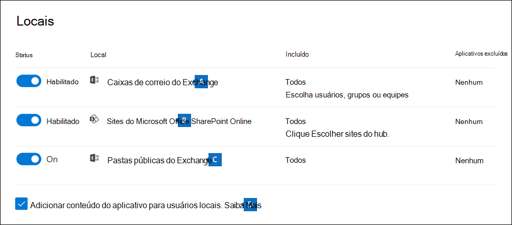
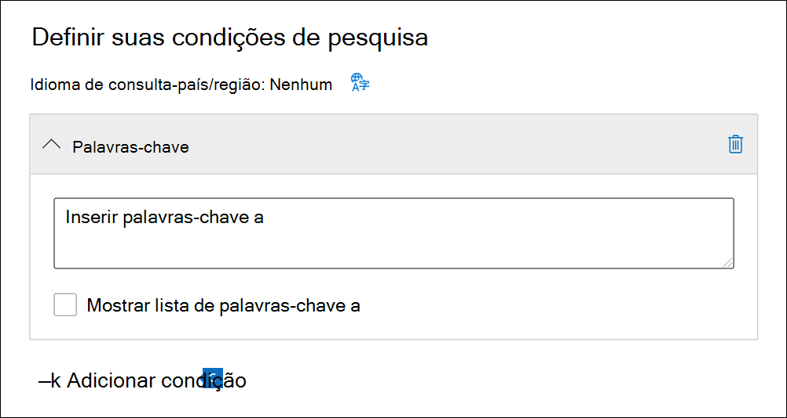

# Criar uma pesquisa de conteúdoCreate a content search

Você pode usar a ferramenta de Descoberta eletrônica de Pesquisa de Conteúdo no Centro de conformidade do Microsoft 365 para pesquisar conteúdos in-loco como e-mails, documentos e conversas de mensagens instantâneas em sua organização.You can use the Content search eDiscovery tool in the Microsoft 365 compliance center to search for in-place content such as email, documents, and instant messaging conversations in your organization. Use esta ferramenta para pesquisar conteúdo nestas fontes de dados do Microsoft 365:Use this tool to search for content in these Microsoft 365 data sources:
  
- Caixas de correio do Exchange Online.Exchange Online mailboxes

- Sites do SharePoint Online e contas do OneDrive for BusinessSharePoint Online sites and OneDrive for Business accounts

- Microsoft TeamsMicrosoft Teams

- Grupos do Microsoft 365Microsoft 365 Groups

- Grupos do YammerYammer Groups

Após a execução de uma Pesquisa de Conteúdo, o número de locais de conteúdo e um número estimado de resultados de pesquisa serão exibidos no perfil de pesquisa.After you run a search, the number of content locations and an estimated number of search results are displayed on the search flyout page. As estatísticas podem ser visualizadas prontamente, como os locais de conteúdo que têm mais itens que correspondem à consulta de pesquisa.You can quickly view statistics, such as the content locations that have the most items that match the search query. Ao executar uma pesquisa, elas poderão ser visualizadas ou exportadas para um computador local.After you run a search, you can preview the results or export them to a local computer.

## Criar e executar uma pesquisaCreate and run a search

Para ter acesso à página da **Pesquisa de conteúdo** no Centro de conformidade do Microsoft 365 e poder executar pesquisas, visualizar e exportar resultados de pesquisa, um administrador, um responsável pela conformidade ou um gerente de descoberta eletrônica deve ser membro do grupo de função gerente de Descoberta eletrônica do Centro de Conformidade e Segurança.To access to the **Content search** page in the Microsoft 365 compliance center (to run searches and preview results and export results), an administrator, compliance officer, or eDiscovery manager must be a member of the eDiscovery Manager role group in Security & Compliance Center. Para obter mais informações, confira [Atribuir permissões de Descoberta eletrônica](assign-ediscovery-permissions.md).For more information, see [Assign eDiscovery permissions](assign-ediscovery-permissions.md).
  
1. Vá para <https://compliance.microsoft.com> e entre usando as credenciais de uma conta que tenha sido atribuída às permissões apropriadas.Go to <https://compliance.microsoft.com> and sign in using the credentials of an account that's been assigned the appropriate permissions.

2. No painel de navegação esquerdo do Centro de Conformidade do Microsoft 365, clique em **Mostrar tudo** e, a seguir, clique em **Pesquisa de conteúdo**.In the left navigation pane of the Microsoft 365 compliance center, click **Show all**, and then click **Content search**.

3. Na página **Pesquisa de conteúdo**, clique em **Nova pesquisa**.On the **Content search** page, click **New search**.

   > [!NOTE]
   > A opção **Pesquisar por lista de IDs** permite que você pesquise mensagens de e-mail específicas e outros itens de caixa de correio usando uma lista de IDs do Exchange.The **Search by ID list** option lets you search for specific email messages and other mailbox items using a list of Exchange IDs. Para criar uma pesquisa de lista de IDs, você envia um arquivo de valores separados por vírgula (CSV) que identifica os itens específicos da caixa de correio a serem pesquisados.To create an ID list search, you submit a comma-separated value (CSV) file that identifies the specific mailbox items to search for. Para obter instruções, confira [Preparar um arquivo CSV para uma pesquisa de lista de IDs](csv-file-for-an-id-list-content-search.md).For instructions, see [Prepare a CSV file for an ID list search](csv-file-for-an-id-list-content-search.md).

4. Digite um nome para a pesquisa, uma descrição opcional que ajude a identificar a pesquisa.Type a name for the search, an optional description that helps identify the search. O nome da pesquisa deve ser exclusivo na organização.The name of the search must be unique in your organization.

5. Na página **Locais**, escolha os locais de conteúdo que você deseja pesquisar.On the **Locations** page, choose the content locations that you want to search. Você pode pesquisar em caixas de correio, sites e pastas públicas.You can search mailboxes, sites, and public folders.

    
  
   1. **Caixas de correio do Exchange**: configure o botão de alternância como **Ativado** e, em seguida, clique em **Escolher usuários, grupos ou equipes** para especificar as caixas de correio a colocar em espera.**Exchange mailboxes**: Set the toggle to **On** and then click **Choose users, groups, or teams** to specify the mailboxes to place on hold. Use a caixa de pesquisa para localizar caixas de correio de usuário e grupos de distribuição (para colocar em retenção as caixas de correio de membros do grupo) e colocar em espera.Use the search box to find user mailboxes and distribution groups (to place a hold on the mailboxes of group members) to place on hold. Você também pode pesquisar a caixa de correio associada a uma Equipe da Microsoft (para mensagens de canal), um grupo do Office 365 e um Grupo do Yammer.You can also search the mailbox associated with a Microsoft Team (for channel messages), Office 365 Group, and Yammer Group. Para saber mais sobre os dados do aplicativo armazenados em caixas de correio, consulte [Conteúdo armazenado nas caixas de correio para Descoberta eletrônica](what-is-stored-in-exo-mailbox.md).For more information about the application data stored in mailboxes, see [Content stored in mailboxes for eDiscovery](what-is-stored-in-exo-mailbox.md).

   2. **Sites do SharePoint**: configure o botão de alternância como **Ativado** e, em seguida, clique em **Escolher sites** para especificar sites do SharePoint e contas do OneDrive para colocar em espera.**SharePoint sites**: Set the toggle to **On** and then click **Choose sites** to specify SharePoint sites and OneDrive accounts to place on hold. Digite a URL de cada site que você deseja colocar em espera.Type the URL for each site that you want to place on hold. Você também pode adicionar a URL do site do SharePoint para uma Equipe da Microsoft, grupo do Office 365 ou grupo do Yammer.You can also add the URL for the SharePoint site for a Microsoft Team, Office 365 Group, or Yammer Group.
  
   3. **Pastas públicas do Exchange**: configure o botão de alternância como **Ativado** para colocar todas as pastas públicas em sua organização do Exchange Online em espera.**Exchange public folders**: Set the toggle to **On** to put all public folders in your Exchange Online organization on hold. Você não pode escolher pastas públicas específicas para colocar em espera.You can't choose specific public folders to put on hold. Deixe o botão de alternância desligado se você não quiser colocar pastas públicas em espera.Leave the toggle switch off if you don't want to put a hold on public folders.
  
   4. Mantenha esta caixa de seleção marcada para procurar conteúdo do Teams para usuários locais.Keep this checkbox selected to search for Teams content for on-premises users. Por exemplo, se você pesquisar todas as caixas de correio do Exchange na organização e também selecionar esta caixa de seleção, o armazenamento baseado em nuvem usado para armazenar os dados de bate-papo do Teams para usuários locais será incluído no escopo da pesquisa.For example, if you search all Exchange mailboxes in the organization and this checkbox is selected, the cloud-based storage used to store Teams chat data for on-premises users will be included in the scope of the search. Para obter mais informações, confira [Pesquisar dados de bate-papo do Teams para usuários locais](search-cloud-based-mailboxes-for-on-premises-users.md).For more information, see [Search for Teams chat data for on-premises users](search-cloud-based-mailboxes-for-on-premises-users.md).

6. Na página **Definir as condições da pesquisa**, digite uma consulta de palavra-chave e adicione condições à consulta de pesquisa, se necessário.On the **Define your search conditions** page, type a keyword query and add conditions to the search query if necessary.

   

   1. Você pode especificar palavras-chave, propriedades de mensagem como datas enviadas e recebidas, ou ainda, propriedades do documento como nomes de arquivos ou a data em que um documento foi alterado pela última vez.Specify keywords, message properties such as sent and received dates, or document properties such as file names or the date that a document was last changed. Faça consultas mais complexas que usam um operador Booleano, como **E**, **OU**, **NÃO** e **PRÓXIMO**.You can use more complex queries that use a Boolean operator, such as **AND**, **OR**, **NOT**, and **NEAR**. Se você deixar a caixa de palavra-chave vazia, todo o conteúdo localizado nos locais de conteúdo especificado será incluído nos resultados da pesquisa.If you leave the keyword box empty, all content located in the specified content locations is included in the search results. Para saber mais, veja [Consultas de palavra-chave e condições de pesquisa para Descoberta eletrônica](keyword-queries-and-search-conditions.md).For more information, see [Keyword queries and search conditions for eDiscovery](keyword-queries-and-search-conditions.md).

   2. Como alternativa, você pode clicar na caixa de seleção **Mostrar lista de palavras-chave** e digitar uma palavra-chave em cada linha.Alternatively, you can click the **Show keyword list** checkbox and the type a keyword in each row. Ao fazer isso, as palavras-chave em cada linha serão conectadas por um operador lógico (**c:s**) com funcionalidade semelhante ao operador **OU** na consulta de pesquisa criada.If you do this, the keywords on each row are connected by a logical operator (**c:s**) that is similar in functionality to the **OR** operator in the search query that's created.

      Por que usar a lista de palavras-chave?Why use the keyword list? Para obter estatísticas que mostram quantos itens correspondem a cada palavra-chave.You can get statistics that show how many items match each keyword. Isso ajudará a identificar rapidamente quais palavras-chave são as mais recentes.This can help you quickly identify which keywords are the most (and least) effective. Também poderá usar uma frase de palavra-chave (entre parênteses) em uma linha.You can also use a keyword phrase (surrounded by parentheses) in a row. Para saber mais sobre a lista de palavras-chave e as estatísticas de pesquisa, confira [Obter estatísticas de palavra-chave para pesquisas](view-keyword-statistics-for-content-search.md#get-keyword-statistics-for-searches).For more information about the keyword list and search statistics, see [Get keyword statistics for searches](view-keyword-statistics-for-content-search.md#get-keyword-statistics-for-searches).

      > [!NOTE]
      > Para ajudar a reduzir problemas causados por listas de palavras-chave muito extensas, agora você está limitado a um máximo de 20 linhas na lista de palavras-chave.To help reduce issues caused by large keyword lists, you're limited to a maximum of 20 rows in the keyword list.

   3. Você pode adicionar condições a uma consulta de pesquisa para restringir a pesquisa e produzir um conjunto de resultados mais refinado.You can add search conditions to narrow a search and return a more refined set of results. Cada condição adiciona uma cláusula à consulta de pesquisa que é criada e executada quando você inicia a pesquisa.Each condition adds a clause to the search query that is created and run when you start the search. Uma condição é logicamente conectada à consulta de palavra-chave (especificada na caixa de palavra-chave) por um operador lógico (**c:c**) parecido com a funcionalidade do operador **E**.A condition is logically connected to the keyword query (specified in the keyword box) by a logical operator (**c:c**) that is similar in functionality to the **AND** operator. Isso significa que os itens precisam atender à consulta de palavras-chave e uma ou mais condições para serem incluídas nos resultados.That means that items have to satisfy both the keyword query and one or more conditions to be included in the results. É assim que as condições ajudam a restringir os resultados.This is how conditions help to narrow your results. Para obter uma lista e uma descrição das condições que podem ser usadas em uma consulta de pesquisa, confira a seção [Condições de pesquisa](keyword-queries-and-search-conditions.md#search-conditions).For a list and description of conditions that you can use in a search query, see [Search conditions](keyword-queries-and-search-conditions.md#search-conditions).

7. Revise as configurações de pesquisa (e edite, se necessário) e envie a pesquisa para iniciá-la.Review the search settings (and edit if necessary), and then submit the search to start it.
  
Para acessar a pesquisa de conteúdo novamente ou acessar outras pesquisas de conteúdo listadas na página **Pesquisa de conteúdo**, selecione a pesquisa e clique em **Abrir**.To access this content search again or access other content searches listed on the **Content search** page, select the search and then click **Open**.
  
## Próximas etapasNext steps

Aqui está uma lista das próximas etapas a serem seguidas por você criar e executar uma Pesquisa de conteúdo.Here's a list of next steps to perform after you create and run a Content search.

- [Visualização de resultados de pesquisaPreview search results](preview-ediscovery-search-results.md)

- [Exibir as estatísticas para resultados da pesquisaView statistics for search results](view-keyword-statistics-for-content-search.md)

- [Exportar resultados de pesquisaExport search results](export-search-results.md)

- [Exportar um relatório de pesquisaExport a search report](export-a-content-search-report.md)
