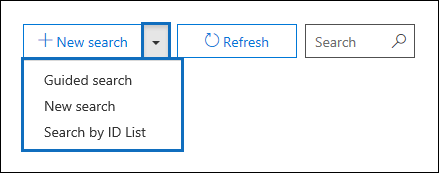
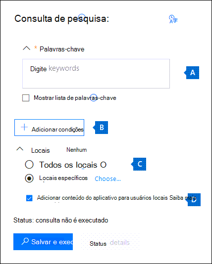

# <a name="content-search-in-office-365"></a><span data-ttu-id="d4c84-106">Pesquisa de Conteúdo no Office 365</span><span class="sxs-lookup"><span data-stu-id="d4c84-106">Content Search in Office 365</span></span>

<span data-ttu-id="d4c84-107">Use a ferramenta de Descoberta Eletrônica de Pesquisa de Conteúdo no centro de conformidade do Office 365 ou Microsoft 365 para pesquisar itens no local, como email, documentos e conversas de mensagens instantâneas na organização do Office 365.</span><span class="sxs-lookup"><span data-stu-id="d4c84-107">You can use the Content Search eDiscovery tool in the compliance center in Office 365 or Microsoft 365 to search for in-place items such as email, documents, and instant messaging conversations in your Office 365 organization.</span></span> <span data-ttu-id="d4c84-108">Use esta ferramenta para pesquisar itens nos seguintes serviços do Office 365:</span><span class="sxs-lookup"><span data-stu-id="d4c84-108">Use this tool to search for items in these Office 365 services:</span></span>
  
- <span data-ttu-id="d4c84-109">Pastas públicas e caixas de correio do Exchange Online.</span><span class="sxs-lookup"><span data-stu-id="d4c84-109">Exchange Online mailboxes and public folders</span></span>
    
- <span data-ttu-id="d4c84-110">Sites do SharePoint Online e contas do OneDrive for Business</span><span class="sxs-lookup"><span data-stu-id="d4c84-110">SharePoint Online sites and OneDrive for Business accounts</span></span>
    
- <span data-ttu-id="d4c84-111">Conversas do Skype for Business</span><span class="sxs-lookup"><span data-stu-id="d4c84-111">Skype for Business conversations</span></span>
    
- <span data-ttu-id="d4c84-112">Microsoft Teams</span><span class="sxs-lookup"><span data-stu-id="d4c84-112">Microsoft Teams</span></span> 

- <span data-ttu-id="d4c84-113">Grupos do Office 365</span><span class="sxs-lookup"><span data-stu-id="d4c84-113">Office 365 Groups</span></span>

- <span data-ttu-id="d4c84-114">Grupos do Yammer</span><span class="sxs-lookup"><span data-stu-id="d4c84-114">Yammer Groups</span></span> 
    
<span data-ttu-id="d4c84-115">Após a execução de uma Pesquisa de Conteúdo, o número de locais de conteúdo e um número estimado de resultados de pesquisa serão exibidos nas estatísticas de pesquisa.</span><span class="sxs-lookup"><span data-stu-id="d4c84-115">After you run a Content Search, the number of content locations and an estimated number of search results are displayed in the search statistics.</span></span> <span data-ttu-id="d4c84-116">As estatísticas podem ser visualizadas prontamente, como os locais de conteúdo que têm mais itens que correspondem à consulta de pesquisa.</span><span class="sxs-lookup"><span data-stu-id="d4c84-116">You can also quickly view statistics, such as the content locations that have the most items that match the search query.</span></span> <span data-ttu-id="d4c84-117">Ao executar uma pesquisa, elas poderão ser visualizadas ou exportadas para um computador local.</span><span class="sxs-lookup"><span data-stu-id="d4c84-117">After you run a search, you can preview the results or export them to a local computer.</span></span>

## <a name="create-a-search"></a><span data-ttu-id="d4c84-118">Criar uma pesquisa</span><span class="sxs-lookup"><span data-stu-id="d4c84-118">Create a search</span></span>

<span data-ttu-id="d4c84-119">Para ter acesso à página da **Pesquisa de conteúdo** e poder executar pesquisas, visualizar e exportar resultados de pesquisa, um administrador, um responsável pela conformidade ou um gerente de descoberta eletrônica deve ser membro do grupo da função de gerente de descoberta eletrônica do Centro de Conformidade e Segurança.</span><span class="sxs-lookup"><span data-stu-id="d4c84-119">To have access to the **Content search** page to run searches and preview and export search results, an administrator, compliance officer, or eDiscovery manager must be a member of the eDiscovery Manager role group in the Security & Compliance Center.</span></span> <span data-ttu-id="d4c84-120">Para obter mais informações, confira [Atribuir permissões de descoberta eletrônica](assign-ediscovery-permissions.md).</span><span class="sxs-lookup"><span data-stu-id="d4c84-120">For more information, see [Assign eDiscovery permissions](assign-ediscovery-permissions.md).</span></span>
  
1. <span data-ttu-id="d4c84-121">Vá para [https://protection.office.com](https://protection.office.com) e entre usando o email e a senha do Office 365.</span><span class="sxs-lookup"><span data-stu-id="d4c84-121">Go to [https://protection.office.com](https://protection.office.com) and sign in using your Office 365 email address and password.</span></span>
    
2. <span data-ttu-id="d4c84-122">Clique em **Pesquisar** \> **Pesquisa de conteúdo**.</span><span class="sxs-lookup"><span data-stu-id="d4c84-122">Click **Search** \> **Content search**.</span></span>
    
3. <span data-ttu-id="d4c84-123">Na página de **Pesquisa**, clique na seta ao lado do  **Nova pesquisa**.</span><span class="sxs-lookup"><span data-stu-id="d4c84-123">On the **Search** page, click the arrow next to  **New search**.</span></span> 
    
    
  
    <span data-ttu-id="d4c84-125">Você pode escolher uma das seguintes opções:</span><span class="sxs-lookup"><span data-stu-id="d4c84-125">You can choose one of the following options:</span></span>
    
    - <span data-ttu-id="d4c84-126">**Pesquisa dirigida:** Essa opção inicia um assistente que o orientará durante a criação da pesquisa.</span><span class="sxs-lookup"><span data-stu-id="d4c84-126">**Guided search:** This option starts a wizard that guides you through the creating the search.</span></span> <span data-ttu-id="d4c84-127">A interface do usuário usada para selecionar locais de conteúdo e criar a consulta de pesquisa é igual à opção **Nova pesquisa**.</span><span class="sxs-lookup"><span data-stu-id="d4c84-127">The user interface to select content locations and build the search query are the same as the **New search** option.</span></span> 
    
    - <span data-ttu-id="d4c84-128">**Nova pesquisa:** Essa opção exibe uma interface do usuário atualizada para criar uma pesquisa.</span><span class="sxs-lookup"><span data-stu-id="d4c84-128">**New search:** This option displays an updated user interface to create a search.</span></span> <span data-ttu-id="d4c84-129">Essa é a opção padrão se você clicar em **Nova pesquisa**.</span><span class="sxs-lookup"><span data-stu-id="d4c84-129">This is the default option if you click **New search**.</span></span>
    
    - <span data-ttu-id="d4c84-130">**Pesquisar por Lista de IDs** – Essa opção permite pesquisar mensagens de email específicas e outros itens da caixa de correio usando uma lista de IDs do Exchange.</span><span class="sxs-lookup"><span data-stu-id="d4c84-130">**Search by ID List:** This option lets you search for specific email messages and other mailbox items using a list of Exchange IDs.</span></span> <span data-ttu-id="d4c84-131">Para criar uma pesquisa de lista de IDs (chamada formalmente de pesquisa direcionada), envie um arquivo de valores separados por vírgula (CSV) que identifique os itens específicos da caixa de correio a serem pesquisados.</span><span class="sxs-lookup"><span data-stu-id="d4c84-131">To create an ID list search (formally called a targeted search), you submit a comma-separated value (CSV) file that identifies the specific mailbox items to search for.</span></span> <span data-ttu-id="d4c84-132">Para obter instruções, confira [Preparar um arquivo CSV para uma lista de IDs de Pesquisa de Conteúdo no Office 365](csv-file-for-an-id-list-content-search.md).</span><span class="sxs-lookup"><span data-stu-id="d4c84-132">For instructions, see [Prepare a CSV file for an ID list Content Search in Office 365](csv-file-for-an-id-list-content-search.md).</span></span>
    
    <span data-ttu-id="d4c84-133">O restante das etapas desse procedimento segue o novo fluxo de trabalho de pesquisa padrão.</span><span class="sxs-lookup"><span data-stu-id="d4c84-133">The remainder of the steps in this procedure follows the default new search workflow.</span></span>
    
4. <span data-ttu-id="d4c84-134">Clique em **Nova pesquisa** na lista suspensa.</span><span class="sxs-lookup"><span data-stu-id="d4c84-134">Click **New search** in the drop-down list.</span></span> 
    
5. <span data-ttu-id="d4c84-135">Em **Consulta de pesquisa**, especifique o seguinte:</span><span class="sxs-lookup"><span data-stu-id="d4c84-135">Under **Search query**, specify the following things:</span></span>
    
    
  
   - <span data-ttu-id="d4c84-137">**Palavras-chave a pesquisar:** Digite uma consulta de pesquisa na caixa de **Palavras-chave**.</span><span class="sxs-lookup"><span data-stu-id="d4c84-137">**Keywords to search for:** Type a search query in **Keywords** box.</span></span> <span data-ttu-id="d4c84-138">Você pode especificar palavras-chave, propriedades de mensagem como datas enviadas e recebidas, ou ainda, propriedades do documento como nomes de arquivos ou a data em que um documento foi alterado pela última vez.</span><span class="sxs-lookup"><span data-stu-id="d4c84-138">You can specify keywords, message properties such as sent and received dates, or document properties such as file names or the date that a document was last changed.</span></span> <span data-ttu-id="d4c84-139">Faça consultas mais complexas que usam um operador Booleano, **E**, **OU**, **NÃO** e **PRÓXIMO**.</span><span class="sxs-lookup"><span data-stu-id="d4c84-139">You can use more complex queries that use a Boolean operator, such as **AND**, **OR**, **NOT**, and **NEAR**.</span></span> <span data-ttu-id="d4c84-140">Você também pode procurar informações confidenciais (por exemplo, números de seguridade social) em documentos ou pesquisar documentos que foram compartilhados externamente.</span><span class="sxs-lookup"><span data-stu-id="d4c84-140">You can also search for sensitive information (such as social security numbers) in documents, or search for documents that have been shared externally.</span></span> <span data-ttu-id="d4c84-141">Se você deixar a caixa de palavra-chave vazia, todo o conteúdo localizado nos locais de conteúdo especificado será incluído nos resultados da pesquisa.</span><span class="sxs-lookup"><span data-stu-id="d4c84-141">If you leave the keyword box empty, all content located in the specified content locations is included in the search results.</span></span>
    
      <span data-ttu-id="d4c84-142">Como alternativa, você pode clicar na caixa de seleção **Mostrar lista de palavras-chave** e digitar uma palavra-chave em cada linha.</span><span class="sxs-lookup"><span data-stu-id="d4c84-142">Alternatively, you can click the **Show keyword list** checkbox and the type a keyword in each row.</span></span> <span data-ttu-id="d4c84-143">Ao fazer isso, as palavras-chave em cada linha serão conectadas por um operador lógico (**c:s**) com funcionalidade semelhante ao operador **OU** na consulta de pesquisa criada.</span><span class="sxs-lookup"><span data-stu-id="d4c84-143">If you do this, the keywords on each row are connected by a logical operator (**c:s**) that is similar in functionality to the **OR** operator in the search query that's created.</span></span> 
    
      <span data-ttu-id="d4c84-144">Por que usar a lista de palavras-chave?</span><span class="sxs-lookup"><span data-stu-id="d4c84-144">Why use the keyword list?</span></span> <span data-ttu-id="d4c84-145">Para obter estatísticas que mostram quantos itens correspondem a cada palavra-chave.</span><span class="sxs-lookup"><span data-stu-id="d4c84-145">You can get statistics that show how many items match each keyword.</span></span> <span data-ttu-id="d4c84-146">Isso ajudará a identificar rapidamente quais palavras-chave são as mais recentes.</span><span class="sxs-lookup"><span data-stu-id="d4c84-146">This can help you quickly identify which keywords are the most (and least) effective.</span></span> <span data-ttu-id="d4c84-147">Também poderá usar uma frase de palavra-chave (entre parênteses) em uma linha.</span><span class="sxs-lookup"><span data-stu-id="d4c84-147">You can also use a keyword phrase (surrounded by parentheses) in a row.</span></span> <span data-ttu-id="d4c84-148">Para obter mais informações sobre as estatísticas de pesquisa, confira [Exibir estatísticas da palavra-chave para Resultados de Pesquisa de Conteúdo](view-keyword-statistics-for-content-search.md).</span><span class="sxs-lookup"><span data-stu-id="d4c84-148">For more information about search statistics, see [View keyword statistics for Content Search results](view-keyword-statistics-for-content-search.md).</span></span>

     > [!NOTE]
     > <span data-ttu-id="d4c84-149">Para ajudar a reduzir problemas causados por listas de palavras-chave muito extensas, agora você está limitado a um máximo de 20 linhas na lista de palavras-chave.</span><span class="sxs-lookup"><span data-stu-id="d4c84-149">To help reduce issues caused by large keyword lists, you're now limited to a maximum of 20 rows in the keyword list.</span></span>
    
    - <span data-ttu-id="d4c84-150">**Condições:** Você também pode adicionar condições a uma consulta de pesquisa para restringir a pesquisa e produzir um conjunto de resultados mais refinado.</span><span class="sxs-lookup"><span data-stu-id="d4c84-150">**Conditions:** You can add search conditions to narrow a search and return a more refined set of results.</span></span> <span data-ttu-id="d4c84-151">Cada condição adiciona uma cláusula à consulta de pesquisa que é criada e executada quando você inicia a pesquisa.</span><span class="sxs-lookup"><span data-stu-id="d4c84-151">Each condition adds a clause to the search query that is created and run when you start the search.</span></span> <span data-ttu-id="d4c84-152">Uma condição é logicamente conectada à consulta de palavra-chave (especificada na caixa de palavra-chave) por um operador lógico (**c:c**) parecido com a funcionalidade do operador **E**.</span><span class="sxs-lookup"><span data-stu-id="d4c84-152">A condition is logically connected to the keyword query (specified in the keyword box) by a logical operator (**c:c**) that is similar in functionality to the **AND** operator.</span></span> <span data-ttu-id="d4c84-153">Isso significa que os itens precisam atender à consulta de palavras-chave e uma ou mais condições para serem incluídas nos resultados.</span><span class="sxs-lookup"><span data-stu-id="d4c84-153">That means that items have to satisfy both the keyword query and one or more conditions to be included in the results.</span></span> <span data-ttu-id="d4c84-154">É assim que as condições ajudam a restringir os resultados.</span><span class="sxs-lookup"><span data-stu-id="d4c84-154">This is how conditions help to narrow your results.</span></span> <span data-ttu-id="d4c84-155">Para obter uma lista e uma descrição das condições que podem ser usadas em uma consulta de pesquisa, confira a seção "Condições de pesquisa" em [Consultas de palavra-chave e condições ou critérios de pesquisa para a Pesquisa de Conteúdo](keyword-queries-and-search-conditions.md#search-conditions).</span><span class="sxs-lookup"><span data-stu-id="d4c84-155">For a list and description of conditions that you can use in a search query, see the "Search conditions" section in [Keyword queries and search conditions for Content Search](keyword-queries-and-search-conditions.md#search-conditions).</span></span>
    
       - <span data-ttu-id="d4c84-156">**Locais:** Escolha os locais de conteúdo a serem pesquisados.</span><span class="sxs-lookup"><span data-stu-id="d4c84-156">**Locations:** Choose the content locations to search.</span></span>
    
      - <span data-ttu-id="d4c84-157">**Todos os locais:** Use essa opção para pesquisar todos os locais de conteúdo em sua organização.</span><span class="sxs-lookup"><span data-stu-id="d4c84-157">**All locations:** Use this option to search all content locations in your organization.</span></span> <span data-ttu-id="d4c84-158">Isso inclui e-mails em todas as caixas de correio do Exchange (incluindo todas as caixas de correio inativas e caixas de correio de todas as equipes da Microsoft, do Yammer e do Office 365), todas as conversas do Skype for Business, todos os sites do SharePoint e do OneDrive for Business (incluindo o sites para todos os grupos do Microsoft Teams, do Yammer e do Office 365), e itens em todas as pastas públicas do Exchange.</span><span class="sxs-lookup"><span data-stu-id="d4c84-158">This includes email in all Exchange mailboxes (including all inactive mailboxes, and mailboxes for all Microsoft Teams, Yammer Groups, and Office 365 Groups), all Skype for Business conversations, all SharePoint and OneDrive for Business sites (including the sites for all Microsoft Teams, Yammer Groups, and Office 365 Groups), and items in all Exchange public folders.</span></span>
    
      - <span data-ttu-id="d4c84-159">**Locais específicos:** Use essa opção para pesquisar locais de conteúdo específicos.</span><span class="sxs-lookup"><span data-stu-id="d4c84-159">**Specific locations:** Use this option to search specific content locations.</span></span> <span data-ttu-id="d4c84-160">Você poderá pesquisar todos os locais de conteúdo de um serviço específico do Office 365 (por exemplo, pesquisar em todas as caixas de correio do Exchange ou pesquisar conteúdo em todos os sites do SharePoint) ou pesquisar locais específicos em qualquer um dos serviços do Office 365 exibidos.</span><span class="sxs-lookup"><span data-stu-id="d4c84-160">You can search all content locations for a specific Office 365 service (such as searching all Exchange mailboxes or search all SharePoint sites) or you can search for content in specific locations of any of the Office 365 services that are displayed.</span></span> 
    
        
  
         <span data-ttu-id="d4c84-162">Também é possível adicionar grupos de distribuição à lista de caixas de correio do Exchange para pesquisar.</span><span class="sxs-lookup"><span data-stu-id="d4c84-162">You can also add distribution groups to the list of Exchange mailboxes to search.</span></span> <span data-ttu-id="d4c84-163">Para grupos de distribuição, as caixas de correio dos membros do grupo são pesquisadas.</span><span class="sxs-lookup"><span data-stu-id="d4c84-163">For distribution groups, the mailboxes of group members are searched.</span></span> <span data-ttu-id="d4c84-164">Não há suporte para grupos dinâmicos de distribuição.</span><span class="sxs-lookup"><span data-stu-id="d4c84-164">Dynamic distribution groups aren't supported.</span></span>
    
       > [!NOTE]
       > <span data-ttu-id="d4c84-165">Quando você pesquisa todos os locais de caixa de correio ou apenas caixas de correio específicas, os dados de outros aplicativos do Office 365 salvos nas caixas de correio do usuário são incluídos quando você exporta os resultados de uma pesquisa de conteúdo.</span><span class="sxs-lookup"><span data-stu-id="d4c84-165">When you search all mailbox locations or just specific mailboxes, data from other Office 365 applications that's saved to user mailboxes is included when you export the results of a Content Search.</span></span> <span data-ttu-id="d4c84-166">Esses dados não serão incluídos nos resultados de pesquisa estimados e não estarão disponíveis para visualização.</span><span class="sxs-lookup"><span data-stu-id="d4c84-166">This data won't be included in the estimated search results and isn't available for preview.</span></span> <span data-ttu-id="d4c84-167">Eles serão incluídos na exportação e no download dos resultados da pesquisa.</span><span class="sxs-lookup"><span data-stu-id="d4c84-167">It is included when you export and download the search results.</span></span> <span data-ttu-id="d4c84-168">Para obter mais informações, confira [Conteúdo armazenado nas caixas de correio do Exchange Online](what-is-stored-in-exo-mailbox.md).</span><span class="sxs-lookup"><span data-stu-id="d4c84-168">For more information, see [Content stored in Exchange Online mailboxes](what-is-stored-in-exo-mailbox.md).</span></span>
   
6. <span data-ttu-id="d4c84-169">Depois de configurar a consulta de pesquisa, clique em **Salvar e executar**.</span><span class="sxs-lookup"><span data-stu-id="d4c84-169">After you've set up your search query, click **Save & run**.</span></span>
    
7. <span data-ttu-id="d4c84-170">Na página **Salvar pesquisa**, digite um nome para a pesquisa e uma descrição opcional que ajude a identificar a pesquisa.</span><span class="sxs-lookup"><span data-stu-id="d4c84-170">On the **Save search** page, type a name for the search, and an optional description that helps identify the search.</span></span> <span data-ttu-id="d4c84-171">O nome da pesquisa deve ser exclusivo na organização.</span><span class="sxs-lookup"><span data-stu-id="d4c84-171">The name of the search has to be unique in your organization.</span></span> 
    
8. <span data-ttu-id="d4c84-172">Clique em **Salvar** para iniciar a pesquisa.</span><span class="sxs-lookup"><span data-stu-id="d4c84-172">Click **Save** to start the search.</span></span> 
    
    <span data-ttu-id="d4c84-173">Depois de salvar e executar a pesquisa, todos os resultados retornados pela pesquisa serão exibidos no painel de resultados.</span><span class="sxs-lookup"><span data-stu-id="d4c84-173">After you save and run the search, any results returned by the search are displayed in the results pane.</span></span> <span data-ttu-id="d4c84-174">Dependendo de como a configuração de visualização foi definida, os resultados da pesquisa serão exibidos ou você precisará clicar em **Visualizar resultados** para visualizá-los.</span><span class="sxs-lookup"><span data-stu-id="d4c84-174">Depending on how you have the preview setting configured, the search results are display or you have to click **Preview results** to view them.</span></span> <span data-ttu-id="d4c84-175">Veja mais detalhes na próxima seção.</span><span class="sxs-lookup"><span data-stu-id="d4c84-175">See the next section for details.</span></span> 
    
<span data-ttu-id="d4c84-176">Para acessar a pesquisa de conteúdo novamente ou acessar outras pesquisas de conteúdo listadas na página **Pesquisa de conteúdo**, selecione a pesquisa e clique em **Abrir**.</span><span class="sxs-lookup"><span data-stu-id="d4c84-176">To access this content search again or access other content searches listed on the **Content search** page, select the search and then click **Open**.</span></span> 
  
<span data-ttu-id="d4c84-177">Para limpar os resultados ou criar outra pesquisa, clique em  **Nova pesquisa**.</span><span class="sxs-lookup"><span data-stu-id="d4c84-177">To clear the results or create another search, click  **New search**.</span></span> 
  
## <a name="preview-search-results"></a><span data-ttu-id="d4c84-178">Visualização de resultados de pesquisa</span><span class="sxs-lookup"><span data-stu-id="d4c84-178">Preview search results</span></span>

<span data-ttu-id="d4c84-179">Há dois parâmetros de configuração para visualizar os resultados de pesquisa.</span><span class="sxs-lookup"><span data-stu-id="d4c84-179">There are two configuration settings for previewing search results.</span></span> <span data-ttu-id="d4c84-180">Após executar uma nova pesquisa ou abrir uma pesquisa existente, clique em **Resultados individuais** para exibir as seguintes configurações de visualização:</span><span class="sxs-lookup"><span data-stu-id="d4c84-180">After you run a new search or open an existing search, click **Individual results** to view the following preview settings:</span></span> 
  

  
1. <span data-ttu-id="d4c84-182">**Visualizar resultados automaticamente:** Essa configuração exibe os resultados após a execução de uma pesquisa.</span><span class="sxs-lookup"><span data-stu-id="d4c84-182">**Preview results automatically:** This setting displays the search results after you a run a search.</span></span>
    
2. <span data-ttu-id="d4c84-183">**Visualizar resultados manualmente:** Essa configuração exibe espaços reservados no painel de resultados da pesquisa e exibe o botão **Visualizar resultados** que você deve clicar para exibir os resultados da pesquisa.</span><span class="sxs-lookup"><span data-stu-id="d4c84-183">**Preview results manually:** This setting displays placeholders in the search results pane, and displays the **Preview results** button that you have to click to display the search results.</span></span> <span data-ttu-id="d4c84-184">Esta é a configuração padrão.</span><span class="sxs-lookup"><span data-stu-id="d4c84-184">This is the default setting.</span></span> <span data-ttu-id="d4c84-185">Ela ajuda a melhorar o desempenho da pesquisa ao não exibir automaticamente os resultados quando uma pesquisa existente é aberta.</span><span class="sxs-lookup"><span data-stu-id="d4c84-185">It helps enhance search performance by not automatically displaying the search results when you open an existing search.</span></span> 
    
<span data-ttu-id="d4c84-186">Existem limites relacionados à quantidade de itens disponíveis para visualização.</span><span class="sxs-lookup"><span data-stu-id="d4c84-186">There are limits related to how many items are available to be previewed.</span></span> <span data-ttu-id="d4c84-187">Para obter mais informações, confira [Limites de Pesquisa de Conteúdo](limits-for-content-search.md).</span><span class="sxs-lookup"><span data-stu-id="d4c84-187">For more information, see [Limits for Content Search](limits-for-content-search.md).</span></span> 
  
<span data-ttu-id="d4c84-188">Para obter uma lista dos tipos de arquivos compatíveis que podem ser visualizados, confira [Visualização de resultados da pesquisa](#previewing-search-results) na seção "Mais informações sobre pesquisa de conteúdo".</span><span class="sxs-lookup"><span data-stu-id="d4c84-188">For a list of supported file types that can be previewed, see [Previewing search results](#previewing-search-results) in the "More information about content search" section.</span></span> <span data-ttu-id="d4c84-189">Se um tipo de arquivo não for compatível com a visualização ou não puder baixar uma cópia de um documento, clique em **Baixar arquivo original** para baixá-lo em seu computador local.</span><span class="sxs-lookup"><span data-stu-id="d4c84-189">If a file type isn't supported for preview or to download a copy of a document, you can click **Download original file** to download it to your local computer.</span></span> <span data-ttu-id="d4c84-190">Para páginas da Web .aspx, a URL da página está incluída, mas pode ser que não haja permissões para acessar a página.</span><span class="sxs-lookup"><span data-stu-id="d4c84-190">For .aspx Web pages, the URL for the page is included though you might not have permissions to access the page.</span></span> 
  
<span data-ttu-id="d4c84-191">Observe que itens não indexados não estão disponíveis para visualização.</span><span class="sxs-lookup"><span data-stu-id="d4c84-191">Also note that unindexed items aren't available for previewing.</span></span>
  
## <a name="view-information-and-statistics-about-a-search"></a><span data-ttu-id="d4c84-192">Exibir informações e estatísticas sobre uma pesquisa</span><span class="sxs-lookup"><span data-stu-id="d4c84-192">View information and statistics about a search</span></span>

<span data-ttu-id="d4c84-193">Após criar e executar uma pesquisa de conteúdo, será possível ver estatísticas sobre os resultados estimados da pesquisa.</span><span class="sxs-lookup"><span data-stu-id="d4c84-193">After you create and run a content search, you can view statistics about the estimated search results.</span></span> <span data-ttu-id="d4c84-194">Ela incluirá um resumo dos resultados da pesquisa, as estatísticas da consulta, como o número de locais de conteúdo com os itens que correspondem à consulta da pesquisa e o nome dos locais de conteúdo que têm mais itens correspondentes.</span><span class="sxs-lookup"><span data-stu-id="d4c84-194">This includes a summary of the search results, the query statistics such as the number of content locations with items that match the search query, and the name of content locations that have the most matching items.</span></span> <span data-ttu-id="d4c84-195">Você poderá exibir as estatísticas de uma ou mais pesquisas de conteúdo.</span><span class="sxs-lookup"><span data-stu-id="d4c84-195">You can display statistics for one or more content searches.</span></span> <span data-ttu-id="d4c84-196">O que permite comparar rapidamente os resultados para várias pesquisas e tomar decisões sobre a eficácia das consultas de pesquisa.</span><span class="sxs-lookup"><span data-stu-id="d4c84-196">This lets you quickly compare the results for multiple searches and make decisions about the effectiveness of your search queries.</span></span>
  
<span data-ttu-id="d4c84-197">Você também poderá baixar as estatísticas da pesquisa e as estatísticas da palavra-chave para um arquivo CSV.</span><span class="sxs-lookup"><span data-stu-id="d4c84-197">You can also download the search statistics and keyword statistics to a CSV file.</span></span> <span data-ttu-id="d4c84-198">Isso permite usar os recursos de filtragem e classificação no Excel para comparar resultados e preparar relatórios para os resultados da pesquisa.</span><span class="sxs-lookup"><span data-stu-id="d4c84-198">This lets you use the filtering and sorting features in Excel to compare results, and prepare reports for your search results.</span></span>
  
<span data-ttu-id="d4c84-199">Para visualizar as estatísticas de pesquisa:</span><span class="sxs-lookup"><span data-stu-id="d4c84-199">To view search statistics:</span></span>
  
1. <span data-ttu-id="d4c84-200">Na página **Pesquisa de conteúdo**, clique em **Abrir** e depois, clique na pesquisa para a qual você deseja exibir as estatísticas.</span><span class="sxs-lookup"><span data-stu-id="d4c84-200">On the **Content search** page, click **Open** and then click the search that you want to view the statistic for.</span></span> 
    
2. <span data-ttu-id="d4c84-201">Na página do submenu, clique em **Abrir consulta**.</span><span class="sxs-lookup"><span data-stu-id="d4c84-201">On the flyout page, click **Open query**.</span></span> 
    
3. <span data-ttu-id="d4c84-202">Na lista suspensa **Resultados individuais**, clique em **Estatísticas de pesquisa**.</span><span class="sxs-lookup"><span data-stu-id="d4c84-202">In the **Individual results** drop down list, click **Search statistics**.</span></span>
    
4. <span data-ttu-id="d4c84-203">Na lista suspensa **Tipo**, clique em uma das seguintes opções, dependendo das estatísticas de pesquisa que você deseja visualizar.</span><span class="sxs-lookup"><span data-stu-id="d4c84-203">In the **Type** drop down list, click one of the following options depending on the search statistics you want to view.</span></span> 
    
  - <span data-ttu-id="d4c84-204">**Resumo**: Exibe as estatísticas de cada tipo de locais de conteúdo pesquisado.</span><span class="sxs-lookup"><span data-stu-id="d4c84-204">**Summary:** Displays statistics for each type of content locations searched.</span></span> <span data-ttu-id="d4c84-205">Tal resumo contém o número de locais de conteúdo com os itens correspondentes à consulta de pesquisa, o número total e o tamanho dos itens de resultado da pesquisa.</span><span class="sxs-lookup"><span data-stu-id="d4c84-205">This contents the number of content locations that contained items that matched the search query, and the total number and size of search result items.</span></span> <span data-ttu-id="d4c84-206">Esta é a configuração padrão.</span><span class="sxs-lookup"><span data-stu-id="d4c84-206">This is the default setting.</span></span>
    
  - <span data-ttu-id="d4c84-207">**Consultas:** Exibe estatísticas sobre a consulta de pesquisa.</span><span class="sxs-lookup"><span data-stu-id="d4c84-207">**Queries:** Displays statistics about the search query.</span></span> <span data-ttu-id="d4c84-208">Já esse inclui o tipo de local de conteúdo ao qual as estatísticas de consulta são aplicáveis, parte da consulta de pesquisa à qual as estatísticas são aplicáveis (observe que **Primário** indica toda a consulta de pesquisa), o número de locais de conteúdo que contêm itens correspondentes à consulta de pesquisa, o número total, tamanho e os itens que foram encontrados (no local de conteúdo especificado) correspondentes à consulta de pesquisa.</span><span class="sxs-lookup"><span data-stu-id="d4c84-208">This includes the type of content location the query statistics are applicable to, part of the search query the statistics are applicable to (note that **Primary** indicates the entire search query), the number of the content locations that contain items that match the search query, and the total number and size and items that were found (in the specified content location) that match the search query.</span></span> <span data-ttu-id="d4c84-209">As estatísticas para itens não indexados (também chamados de *itens parcialmente indexados*) também são exibidas.</span><span class="sxs-lookup"><span data-stu-id="d4c84-209">Statistics for unindexed items (also called *partially indexed items*) are also displayed.</span></span> <span data-ttu-id="d4c84-210">No entanto, apenas itens parcialmente indexados de caixas de correio estão inclusos nas estatísticas.</span><span class="sxs-lookup"><span data-stu-id="d4c84-210">However, only partially indexed items from mailboxes are included in the statistics.</span></span> <span data-ttu-id="d4c84-211">Itens parcialmente indexados do SharePoint e do OneDrive não são incluídos nas estatísticas.</span><span class="sxs-lookup"><span data-stu-id="d4c84-211">Partially indexed items from SharePoint and OneDrive are not included in the statistics.</span></span>
    
  - <span data-ttu-id="d4c84-212">**Principais locais:** Exibe estatísticas sobre o número de itens que correspondem à consulta de pesquisa em cada local de conteúdo.</span><span class="sxs-lookup"><span data-stu-id="d4c84-212">**Top locations:** Displays statistics about the number of items that match the search query in each content location.</span></span> <span data-ttu-id="d4c84-213">Os primeiros 1.000 locais são exibidos.</span><span class="sxs-lookup"><span data-stu-id="d4c84-213">The top 1,000 locations are displayed.</span></span>
    
<span data-ttu-id="d4c84-214">Para obter mais informações sobre as estatísticas de pesquisa, confira [Exibir estatísticas da palavra-chave para resultados de Pesquisa de Conteúdo](view-keyword-statistics-for-content-search.md).</span><span class="sxs-lookup"><span data-stu-id="d4c84-214">For more detailed information about search statistics, see [View keyword statistics for Content Search results](view-keyword-statistics-for-content-search.md).</span></span>
  
  
## <a name="export-search-results"></a><span data-ttu-id="d4c84-215">Exportar resultados de pesquisa</span><span class="sxs-lookup"><span data-stu-id="d4c84-215">Export search results</span></span>

<span data-ttu-id="d4c84-216">Depois que uma pesquisa é executada com êxito, você pode exportar os resultados para um computador local.</span><span class="sxs-lookup"><span data-stu-id="d4c84-216">After a search is successfully run, you can export the search results to a local computer.</span></span> <span data-ttu-id="d4c84-217">Quando você exporta os resultados de email, eles são baixados para o computador como arquivos PST ou como mensagens individuais (arquivos .msg).</span><span class="sxs-lookup"><span data-stu-id="d4c84-217">When you export email results, they can be downloaded to your computer as PST files or as individual messages (.msg files).</span></span> <span data-ttu-id="d4c84-218">Quando você exporta o conteúdo de sites do SharePoint e do OneDrive, cópias dos documentos nativos do Office são exportadas.</span><span class="sxs-lookup"><span data-stu-id="d4c84-218">When you export content from SharePoint and OneDrive sites, copies of native Office documents are exported.</span></span> <span data-ttu-id="d4c84-219">Também há outros documentos e relatórios que são incluídos com os resultados da pesquisa exportados.</span><span class="sxs-lookup"><span data-stu-id="d4c84-219">There are also other documents and reports that are included with the exported search results.</span></span> <span data-ttu-id="d4c84-220">Você também pode exportar o relatório de resultados da pesquisa e não os itens reais.</span><span class="sxs-lookup"><span data-stu-id="d4c84-220">You can also export the search results report and not the actual items.</span></span>
  
<span data-ttu-id="d4c84-221">Exportar resultados de pesquisa:</span><span class="sxs-lookup"><span data-stu-id="d4c84-221">To export search results:</span></span>
  
1. <span data-ttu-id="d4c84-222">Na página **Pesquisa de conteúdo**, clique na pesquisa para a qual você deseja atualizar os resultados.</span><span class="sxs-lookup"><span data-stu-id="d4c84-222">On the **Content search** page, click the search that you want to export the search results for.</span></span> 
    
2. <span data-ttu-id="d4c84-223">Na página do submenu, clique em  **Mais** e em seguida, clique em **Exportar resultados**.</span><span class="sxs-lookup"><span data-stu-id="d4c84-223">On the flyout page, click  **More**, and then click **Export results**.</span></span> <span data-ttu-id="d4c84-224">Também é possível exportar um relatório de resultados de pesquisa.</span><span class="sxs-lookup"><span data-stu-id="d4c84-224">You can also export a search results report.</span></span>
    
3. <span data-ttu-id="d4c84-225">Complete as seções na página do submenu **Exportar resultados**.</span><span class="sxs-lookup"><span data-stu-id="d4c84-225">Complete the sections on the **Export results** fly out page.</span></span> <span data-ttu-id="d4c84-226">Use a barra de rolagem para exibir todas as opções de exportação.</span><span class="sxs-lookup"><span data-stu-id="d4c84-226">Be sure to use the scroll bar to view all export options.</span></span> 
    
<span data-ttu-id="d4c84-227">Para obter instruções mais detalhadas e dicas de solução de problemas, confira:</span><span class="sxs-lookup"><span data-stu-id="d4c84-227">For more detailed instructions and troubleshooting tips, see:</span></span>
  
- [<span data-ttu-id="d4c84-228">Exportar resultados de Pesquisa de Conteúdo</span><span class="sxs-lookup"><span data-stu-id="d4c84-228">Export Content Search results</span></span>](export-search-results.md)
    
- [<span data-ttu-id="d4c84-229">Exportar um relatório da Pesquisa de Conteúdo</span><span class="sxs-lookup"><span data-stu-id="d4c84-229">Export a Content Search report</span></span>](export-a-content-search-report.md)
    
  
## <a name="more-information-about-content-search"></a><span data-ttu-id="d4c84-230">Para obter mais informações sobre pesquisa de conteúdo</span><span class="sxs-lookup"><span data-stu-id="d4c84-230">More information about content search</span></span>

<span data-ttu-id="d4c84-231">Consulte as seções a seguir para obter mais informações sobre pesquisas de conteúdo.</span><span class="sxs-lookup"><span data-stu-id="d4c84-231">See the following sections for more information about content searches.</span></span>
  
[<span data-ttu-id="d4c84-232">Limites da pesquisa de conteúdo</span><span class="sxs-lookup"><span data-stu-id="d4c84-232">Content search limits</span></span>](#content-search-limits)
  
[<span data-ttu-id="d4c84-233">Criar uma consulta de pesquisa</span><span class="sxs-lookup"><span data-stu-id="d4c84-233">Building a search query</span></span>](#building-a-search-query)
  
[<span data-ttu-id="d4c84-234">Pesquisar contas do OneDrive</span><span class="sxs-lookup"><span data-stu-id="d4c84-234">Searching OneDrive accounts</span></span>](#searching-onedrive-accounts)
  
[<span data-ttu-id="d4c84-235">Pesquisar por Microsoft Teams e Grupos do Office 365 </span><span class="sxs-lookup"><span data-stu-id="d4c84-235">Searching Microsoft Teams and Office 365 Groups</span></span>](#searching-microsoft-teams-and-office-365-groups)

[<span data-ttu-id="d4c84-236">Pesquisar grupos do Yammer</span><span class="sxs-lookup"><span data-stu-id="d4c84-236">Searching Yammer Groups</span></span>](#searching-yammer-groups)
  
[<span data-ttu-id="d4c84-237">Pesquisar caixas de correio inativas</span><span class="sxs-lookup"><span data-stu-id="d4c84-237">Searching inactive mailboxes</span></span>](#searching-inactive-mailboxes)
  
[<span data-ttu-id="d4c84-238">Pesquisar caixas de correio desconectadas ou que tiveram a licença removida</span><span class="sxs-lookup"><span data-stu-id="d4c84-238">Searching disconnected or de-licensed mailboxes</span></span>](#searching-disconnected-or-de-licensed-mailboxes)

[<span data-ttu-id="d4c84-239">Visualizar os resultados de pesquisa</span><span class="sxs-lookup"><span data-stu-id="d4c84-239">Previewing search results</span></span>](#previewing-search-results)
  
[<span data-ttu-id="d4c84-240">Itens parcialmente indexados</span><span class="sxs-lookup"><span data-stu-id="d4c84-240">Partially indexed items</span></span>](#partially-indexed-items)

[<span data-ttu-id="d4c84-241">Pesquisa de conteúdo em um ambiente Multi-Geo do SharePoint (englobando diferente áreas geográficas)</span><span class="sxs-lookup"><span data-stu-id="d4c84-241">Searching for content in a SharePoint Multi-Geo environment</span></span>](#searching-for-content-in-a-sharepoint-multi-geo-environment)
  
### <a name="content-search-limits"></a><span data-ttu-id="d4c84-242">Limites da pesquisa de conteúdo</span><span class="sxs-lookup"><span data-stu-id="d4c84-242">Content search limits</span></span>

- <span data-ttu-id="d4c84-243">Para obter uma descrição dos limites que são aplicados ao recurso de Pesquisa de Conteúdo, confira [Limites de Pesquisa de Conteúdo](limits-for-content-search.md).</span><span class="sxs-lookup"><span data-stu-id="d4c84-243">For a description of the limits that are applied to the Content Search feature, see [Limits for Content Search](limits-for-content-search.md).</span></span>
    
- <span data-ttu-id="d4c84-244">A Microsoft coleta informações sobre o desempenho das Pesquisas de Conteúdo executadas por todas as organizações do Office 365.</span><span class="sxs-lookup"><span data-stu-id="d4c84-244">Microsoft collects performance information for Content Searches run by all Office 365 organizations.</span></span> <span data-ttu-id="d4c84-245">Embora a complexidade da consulta de pesquisa possa afetar os tempos de pesquisa, o maior fator que afeta o tempo de duração das pesquisas é o número de caixas de correio pesquisadas.</span><span class="sxs-lookup"><span data-stu-id="d4c84-245">While the complexity of the search query can impact search times, the biggest factor that affects how long searches take is the number of mailboxes searched.</span></span> <span data-ttu-id="d4c84-246">Embora a Microsoft não forneça um Contrato de Nível de Serviço para os tempos de pesquisa, a tabela a seguir lista os tempos médios de pesquisa para uma Pesquisa de Conteúdo com base no número de caixas de correio incluídas na pesquisa.</span><span class="sxs-lookup"><span data-stu-id="d4c84-246">Although Microsoft doesn't provide a Service Level Agreement for search times, the following table lists average search times for a Content Search based on the number of mailboxes included in the search.</span></span>
    
|<span data-ttu-id="d4c84-247">**Número de caixas de correio**</span><span class="sxs-lookup"><span data-stu-id="d4c84-247">**Number of mailboxes**</span></span>|<span data-ttu-id="d4c84-248">**Tempo médio de pesquisa**</span><span class="sxs-lookup"><span data-stu-id="d4c84-248">**Average search time**</span></span>|
|:-----|:-----|
|<span data-ttu-id="d4c84-249">100</span><span class="sxs-lookup"><span data-stu-id="d4c84-249">100</span></span>  <br/> |<span data-ttu-id="d4c84-250">30 segundos</span><span class="sxs-lookup"><span data-stu-id="d4c84-250">30 seconds</span></span>  <br/> |
|<span data-ttu-id="d4c84-251">1.000</span><span class="sxs-lookup"><span data-stu-id="d4c84-251">1,000</span></span>  <br/> |<span data-ttu-id="d4c84-252">45 segundos</span><span class="sxs-lookup"><span data-stu-id="d4c84-252">45 seconds</span></span>  <br/> |
|<span data-ttu-id="d4c84-253">10.000</span><span class="sxs-lookup"><span data-stu-id="d4c84-253">10,000</span></span>  <br/> |<span data-ttu-id="d4c84-254">4 minutos</span><span class="sxs-lookup"><span data-stu-id="d4c84-254">4 minutes</span></span>  <br/> |
|<span data-ttu-id="d4c84-255">25.000</span><span class="sxs-lookup"><span data-stu-id="d4c84-255">25,000</span></span>  <br/> |<span data-ttu-id="d4c84-256">10 minutos</span><span class="sxs-lookup"><span data-stu-id="d4c84-256">10 minutes</span></span>  <br/> |
|<span data-ttu-id="d4c84-257">50.000</span><span class="sxs-lookup"><span data-stu-id="d4c84-257">50,000</span></span>  <br/> |<span data-ttu-id="d4c84-258">20 minutos</span><span class="sxs-lookup"><span data-stu-id="d4c84-258">20 minutes</span></span>  <br/> |
|<span data-ttu-id="d4c84-259">100.000</span><span class="sxs-lookup"><span data-stu-id="d4c84-259">100,000</span></span>  <br/> |<span data-ttu-id="d4c84-260">25 minutos</span><span class="sxs-lookup"><span data-stu-id="d4c84-260">25 minutes</span></span>  <br/> |
  
### <a name="building-a-search-query"></a><span data-ttu-id="d4c84-261">Criar uma consulta de pesquisa</span><span class="sxs-lookup"><span data-stu-id="d4c84-261">Building a search query</span></span>

<span data-ttu-id="d4c84-262">Para obter informações detalhadas sobre como criar uma consulta de pesquisa usando operadores de pesquisa booleanos e condições de pesquisa, como também ao pesquisar tipos de informações confidenciais e conteúdo compartilhado com usuários de fora da organização, confira [Consultas de palavras-chave e condições de pesquisa para Pesquisa de conteúdo ](keyword-queries-and-search-conditions.md).</span><span class="sxs-lookup"><span data-stu-id="d4c84-262">For detailed information about creating a search query, using Boolean search operators and search conditions, and searching for sensitive information types and content shared with users outside your organization, see [Keyword queries and search conditions for Content Search ](keyword-queries-and-search-conditions.md).</span></span>
  
<span data-ttu-id="d4c84-263">Lembre-se do seguinte ao usar a lista de palavras-chave para criar uma consulta de pesquisa.</span><span class="sxs-lookup"><span data-stu-id="d4c84-263">Keep the following things in mind when using the keyword list to create a search query.</span></span>
  
- <span data-ttu-id="d4c84-264">É necessário selecionar a caixa de seleção **Mostrar lista de palavras-chave** e digitar cada palavra-chave em uma linha separada para criar uma consulta de pesquisa em que as palavras-chave (ou frases de palavras-chave) de cada linha sejam conectadas pelo operador **OU**.</span><span class="sxs-lookup"><span data-stu-id="d4c84-264">You have to select the **Show keyword list** checkbox and then type each keyword in a separate row to create a search query where the keywords (or keyword phrases) in each row are connected by the **OR** operator.</span></span> <span data-ttu-id="d4c84-265">Caso cole uma lista de palavras-chave na caixa de palavras-chave ou pressione a tecla **Enter** depois de digitar uma palavra-chave, elas não serão conectadas pelo operador **OU**.</span><span class="sxs-lookup"><span data-stu-id="d4c84-265">If you paste a list of keywords in the keyword box or press the **Enter** key after typing a keyword, they won't be connected by the **OR** operator.</span></span> <span data-ttu-id="d4c84-266">Veja a seguir uma maneira correta e outra incorreta de como adicionar uma lista de palavras-chave.</span><span class="sxs-lookup"><span data-stu-id="d4c84-266">Here are incorrect and correct examples of how to add a list of keywords.</span></span> 
    
    <span data-ttu-id="d4c84-267">**Incorreto**</span><span class="sxs-lookup"><span data-stu-id="d4c84-267">**Incorrect**</span></span>
    
    
  
    <span data-ttu-id="d4c84-269">**Correto**</span><span class="sxs-lookup"><span data-stu-id="d4c84-269">**Correct**</span></span>
    
    
  
- <span data-ttu-id="d4c84-271">Você também pode preparar uma lista de palavras-chave ou frases de palavra-chave em um arquivo do Excel ou em um arquivo de texto simples e, em seguida, copiar e colar a lista na lista de palavras-chave.</span><span class="sxs-lookup"><span data-stu-id="d4c84-271">You can also prepare a list of keywords or keyword phrases in an Excel file or a plain text file, and then copy and paste your list into the keyword list.</span></span> <span data-ttu-id="d4c84-272">Para fazer isso, é preciso selecionar a caixa de seleção **Mostrar lista de palavras-chave**.</span><span class="sxs-lookup"><span data-stu-id="d4c84-272">To do this, you have to select the **Show keyword list** check box.</span></span> <span data-ttu-id="d4c84-273">Em seguida, clique na primeira linha da lista de palavras-chave e cole a sua lista.</span><span class="sxs-lookup"><span data-stu-id="d4c84-273">Then, click the first row in the keyword list and paste your list.</span></span> <span data-ttu-id="d4c84-274">Cada linha do Excel ou do arquivo de texto é colada em uma linha separada na lista de palavras-chave.</span><span class="sxs-lookup"><span data-stu-id="d4c84-274">Each line from the Excel or text file is pasted into separate row in the keyword list.</span></span> 
    
- <span data-ttu-id="d4c84-275">Depois de criar uma consulta usando a lista de palavras-chave, é uma boa ideia verificar a sintaxe da consulta de pesquisa para que a consulta de pesquisa seja a desejada.</span><span class="sxs-lookup"><span data-stu-id="d4c84-275">After you create a query using the keyword list, it's a good idea to verify the search query syntax to make the search query is what you intended.</span></span> <span data-ttu-id="d4c84-276">Na consulta de pesquisa exibida em **Consulta** no painel de detalhes, as palavras-chave são separadas pelo texto **(c:s)**.</span><span class="sxs-lookup"><span data-stu-id="d4c84-276">In the search query that's displayed under **Query** in the details pane, the keywords are separated by the text **(c:s)**.</span></span> <span data-ttu-id="d4c84-277">Isso indica que as palavras-chave estão conectadas por um operador lógico semelhante em funcionalidade ao operador **OU**.</span><span class="sxs-lookup"><span data-stu-id="d4c84-277">This indicates that the keywords are connected by a logical operator similar in functionality to the **OR** operator.</span></span> <span data-ttu-id="d4c84-278">Da mesma forma, se a consulta de pesquisa incluir condições, as palavras-chave e as condições serão separadas pelo texto **(c:c)**.</span><span class="sxs-lookup"><span data-stu-id="d4c84-278">Similarly, if your search query includes conditions, the keywords and the conditions are separated by the text **(c:c)**.</span></span> <span data-ttu-id="d4c84-279">Isso indica que as palavras-chave estão conectadas por um operador lógico semelhante em funcionalidade ao operador **E**.</span><span class="sxs-lookup"><span data-stu-id="d4c84-279">This indicates that the keywords are connected to the conditions with a logical operator similar in functionality to the **AND** operator.</span></span> <span data-ttu-id="d4c84-280">Veja um exemplo de consulta de pesquisa (exibido no painel de Detalhes) que resulta ao usar a lista de palavras-chave e uma condição.</span><span class="sxs-lookup"><span data-stu-id="d4c84-280">Here's an example of the search query (displayed in the Details pane) that results when using the keyword list and a condition.</span></span> 
    
    
  
- <span data-ttu-id="d4c84-282">Ao executar uma pesquisa de conteúdo, o Office 365 verifica automaticamente a consulta de pesquisa para caracteres sem suporte e para operadores booleanos que podem não estar em maiúsculas.</span><span class="sxs-lookup"><span data-stu-id="d4c84-282">When you run a content search, Office 365 automatically checks your search query for unsupported characters and for Boolean operators that may not be capitalized.</span></span> <span data-ttu-id="d4c84-283">Os caracteres sem suporte geralmente estão ocultos e costumam causar um erro de pesquisa ou retornam resultados inesperados.</span><span class="sxs-lookup"><span data-stu-id="d4c84-283">Unsupported characters are often hidden and typically cause a search error or return unintended results.</span></span> <span data-ttu-id="d4c84-284">Para obter mais informações sobre os caracteres sem suporte que estão marcados, confira [Verifique se há erros na consulta da Pesquisa de Conteúdo](check-your-content-search-query-for-errors.md).</span><span class="sxs-lookup"><span data-stu-id="d4c84-284">For more information about the unsupported characters that are checked, see [Check your Content Search query for errors](check-your-content-search-query-for-errors.md).</span></span>
    
- <span data-ttu-id="d4c84-285">Se você tiver uma consulta de pesquisa que contenha palavras-chave para caracteres que não estão em inglês (como caracteres chineses), clique em **Idioma/país de consulta** e selecione um valor de código cultural de idioma/país para a pesquisa.</span><span class="sxs-lookup"><span data-stu-id="d4c84-285">If you have a search query that contains keywords for non-English characters (such as Chinese characters), you can click **Query language-country/region** and select a language-country culture code value for the search.</span></span> <span data-ttu-id="d4c84-286">O padrão idioma/região é neutro.</span><span class="sxs-lookup"><span data-stu-id="d4c84-286">The default language/region is neutral.</span></span> <span data-ttu-id="d4c84-287">Como saber se é preciso alterar a configuração de idioma para uma pesquisa de conteúdo?</span><span class="sxs-lookup"><span data-stu-id="d4c84-287">How can you tell if you need to change the language setting for a content search?</span></span> <span data-ttu-id="d4c84-288">Se você tiver certeza de que os locais de conteúdo contêm os caracteres que não estão em inglês que você está procurando, mas a pesquisa não retorna nenhum resultado, a configuração de idioma pode ser a causa.</span><span class="sxs-lookup"><span data-stu-id="d4c84-288">If you're certain content locations contain the non-English characters you're searching for, but the search returns no results, the language setting may be the cause.</span></span> 
  
### <a name="searching-onedrive-accounts"></a><span data-ttu-id="d4c84-289">Pesquisar contas do OneDrive</span><span class="sxs-lookup"><span data-stu-id="d4c84-289">Searching OneDrive accounts</span></span>

- <span data-ttu-id="d4c84-290">Para coletar uma lista das URLs dos sites do OneDrive na organização, confira [Criar uma lista de todos os locais do OneDrive na organização](https://support.office.com/article/8e200cb2-c768-49cb-88ec-53493e8ad80a).</span><span class="sxs-lookup"><span data-stu-id="d4c84-290">To collect a list of the URLs for the OneDrive sites in your organization, see [Create a list of all OneDrive locations in your organization](https://support.office.com/article/8e200cb2-c768-49cb-88ec-53493e8ad80a).</span></span> <span data-ttu-id="d4c84-291">Esse script neste artigo cria um arquivo de texto que contém uma lista de todos os sites do OneDrive.</span><span class="sxs-lookup"><span data-stu-id="d4c84-291">This script in this article creates a text file that contains a list of all OneDrive sites.</span></span> <span data-ttu-id="d4c84-292">Para executar esse script, é necessário instalar e usar o Shell de Gerenciamento Online do SharePoint.</span><span class="sxs-lookup"><span data-stu-id="d4c84-292">To run this script, you have to install and use the SharePoint Online Management Shell.</span></span> <span data-ttu-id="d4c84-293">Não se esqueça de acrescentar a URL do domínio MySite da organização para cada site do OneDrive que você deseja pesquisar.</span><span class="sxs-lookup"><span data-stu-id="d4c84-293">Be sure to append the URL for your organization's MySite domain to each OneDrive site that you want to search.</span></span> <span data-ttu-id="d4c84-294">Este é o domínio que contém todos os seus OneDrive; por exemplo, `https://contoso-my.sharepoint.com`.</span><span class="sxs-lookup"><span data-stu-id="d4c84-294">This is the domain that contains all your OneDrive; for example,  `https://contoso-my.sharepoint.com`.</span></span> <span data-ttu-id="d4c84-295">Veja um exemplo de URL para o site do OneDrive de um usuário: `https://contoso-my.sharepoint.com/personal/sarad_contoso_onmicrosoft.com`.</span><span class="sxs-lookup"><span data-stu-id="d4c84-295">Here's an example of a URL for a user's OneDrive site:  `https://contoso-my.sharepoint.com/personal/sarad_contoso_onmicrosoft.com`.</span></span>
    
    <span data-ttu-id="d4c84-296">No caso raro de acontecer do nome principal do usuário (UPN) ser alterado, a URL do local do OneDrive dessa pessoa é alterada para incorporar o novo UPN.</span><span class="sxs-lookup"><span data-stu-id="d4c84-296">In the rare case of a person's user principal name (UPN) being changed, the URL for their OneDrive location is changed to incorporate the new UPN.</span></span> <span data-ttu-id="d4c84-297">Se isso acontecer, será preciso modificar uma pesquisa de conteúdo adicionando a nova URL do OneDrive do usuário e remover a antiga.</span><span class="sxs-lookup"><span data-stu-id="d4c84-297">If this happens, you have to modify a content search by adding the user's new OneDrive URL and removing the old one.</span></span>
  
### <a name="searching-microsoft-teams-and-office-365-groups"></a><span data-ttu-id="d4c84-298">Pesquisar por Microsoft Teams e Grupos do Office 365</span><span class="sxs-lookup"><span data-stu-id="d4c84-298">Searching Microsoft Teams and Office 365 Groups</span></span>

<span data-ttu-id="d4c84-299">Você pode pesquisar na caixa de correio associada a um Grupo do Office 365 ou ao Microsoft Teams.</span><span class="sxs-lookup"><span data-stu-id="d4c84-299">You can search the mailbox that's associated with an Office 365 Group or a Microsoft Team.</span></span> <span data-ttu-id="d4c84-300">Como o Microsoft Teams se baseia nos Grupos do Office 365, a pesquisa é semelhante.</span><span class="sxs-lookup"><span data-stu-id="d4c84-300">Because Microsoft Teams is built on Office 365 Groups, searching them is similar.</span></span> <span data-ttu-id="d4c84-301">Em ambos os casos, apenas a caixa de correio do grupo ou da equipe são pesquisadas.</span><span class="sxs-lookup"><span data-stu-id="d4c84-301">In both cases, only the group or team mailbox is searched.</span></span> <span data-ttu-id="d4c84-302">As caixas de correio do grupo ou membros da equipe não são pesquisadas.</span><span class="sxs-lookup"><span data-stu-id="d4c84-302">The mailboxes of the group or team members aren't searched.</span></span> <span data-ttu-id="d4c84-303">Para pesquisá-los, você precisa adicioná-los especificamente à pesquisa.</span><span class="sxs-lookup"><span data-stu-id="d4c84-303">To search them, you have to specifically add them to the search.</span></span>
  
<span data-ttu-id="d4c84-304">Lembre-se do seguinte ao pesquisar o conteúdo do Microsoft Teams e dos grupos do Office 365.</span><span class="sxs-lookup"><span data-stu-id="d4c84-304">Keep the following things in mind when searching for content in Microsoft Teams and Office 365 Groups.</span></span>
  
- <span data-ttu-id="d4c84-305">Para pesquisar conteúdo localizado no Teams e em Grupos do Office 365, é necessário especificar a caixa de correio e o site do SharePoint associados a uma equipe ou grupo.</span><span class="sxs-lookup"><span data-stu-id="d4c84-305">To search for content located in Teams and Office 365 Groups, you have to specify the mailbox and SharePoint site that are associated with a team or group.</span></span>
    
- <span data-ttu-id="d4c84-306">Execute o cmdlet **Get-UnifiedGroup** no Exchange Online para exibir as propriedades de uma equipe ou de um grupo do Office 365.</span><span class="sxs-lookup"><span data-stu-id="d4c84-306">Run the **Get-UnifiedGroup** cmdlet in Exchange Online to view properties for a team or an Office 365 Group.</span></span> <span data-ttu-id="d4c84-307">Esta é uma boa maneira de obter a URL do site associado a uma equipe ou a um grupo.</span><span class="sxs-lookup"><span data-stu-id="d4c84-307">This is a good way to get the URL for the site that's associated with a team or a group.</span></span> <span data-ttu-id="d4c84-308">Por exemplo, o comando abaixo exibe as propriedades selecionadas para um grupo do Office365 chamado de Equipe de Liderança Sênior:</span><span class="sxs-lookup"><span data-stu-id="d4c84-308">For example, the following command displays selected properties for an Office 365 Group named Senior Leadership Team:</span></span> 
    
  ```text
  Get-UnifiedGroup "Senior Leadership Team" | FL DisplayName,Alias,PrimarySmtpAddress,SharePointSiteUrl
  DisplayName            : Senior Leadership Team
  Alias                  : seniorleadershipteam
  PrimarySmtpAddress     : seniorleadershipteam@contoso.onmicrosoft.com
  SharePointSiteUrl      : https://contoso.sharepoint.com/sites/seniorleadershipteam
  ```

    > [!NOTE]
    > <span data-ttu-id="d4c84-309">Para executar o cmdlet **Get-UnifiedGroup**, é preciso ter atribuído a função de Destinatários Somente Leitura no Exchange Online ou ser membro de um grupo de funções atribuído à função de Destinatários Somente Leitura.</span><span class="sxs-lookup"><span data-stu-id="d4c84-309">To run the **Get-UnifiedGroup** cmdlet, you have to be assigned the View-Only Recipients role in Exchange Online or be a member of a role group that's assigned the View-Only Recipients role.</span></span> 
  
- <span data-ttu-id="d4c84-310">Quando uma caixa de correio de usuário é pesquisada, qualquer equipe ou Grupo do Office 365 do qual o usuário seja membro não serão pesquisados.</span><span class="sxs-lookup"><span data-stu-id="d4c84-310">When a user's mailbox is searched, any team or Office 365 Group that the user is a member of won't be searched.</span></span> <span data-ttu-id="d4c84-311">Da mesma forma, quando você pesquisa uma equipe ou um Grupo do Office 365, somente a caixa de correio e o site do grupo especificados são pesquisados.</span><span class="sxs-lookup"><span data-stu-id="d4c84-311">Similarly, when you search a team or an Office 365 Group, only the group mailbox and group site that you specify is searched.</span></span> <span data-ttu-id="d4c84-312">As caixas de correio e as contas do OneDrive for Business dos membros do grupo não são pesquisadas, a menos que você as adicione explicitamente à pesquisa.</span><span class="sxs-lookup"><span data-stu-id="d4c84-312">The mailboxes and OneDrive for Business accounts of group members aren't searched unless you explicitly add them to the search.</span></span>
    
- <span data-ttu-id="d4c84-313">Para obter uma lista dos membros de uma equipe ou um Grupo do Office 365, você pode exibir as propriedades na página **Início \> Grupos** no centro de administração do Microsoft 365.</span><span class="sxs-lookup"><span data-stu-id="d4c84-313">To get a list of the members of a team or an Office 365 Group, you can view the properties on the **Home \> Groups** page in the Microsoft 365 admin center.</span></span> <span data-ttu-id="d4c84-314">Como alternativa, execute o comando a seguir no PowerShell do Exchange Online:</span><span class="sxs-lookup"><span data-stu-id="d4c84-314">Alternatively, you can run the following command in Exchange Online PowerShell:</span></span> 
    
  ```powershell
  Get-UnifiedGroupLinks <group or team name> -LinkType Members | FL DisplayName,PrimarySmtpAddress 
  ```

    > [!NOTE]
    > <span data-ttu-id="d4c84-315">Para executar o cmdlet **Get-UnifiedGroupLinks**, é preciso ter atribuído a função de Destinatários Somente Leitura no Exchange Online ou ser um membro de um grupo de funções atribuído à função Destinatários Somente Leitura.</span><span class="sxs-lookup"><span data-stu-id="d4c84-315">To run the **Get-UnifiedGroupLinks** cmdlet, you have to be assigned the View-Only Recipients role in Exchange Online or be a member of a role group that's assigned the View-Only Recipients role.</span></span> 
  
- <span data-ttu-id="d4c84-316">As conversas que fazem parte de um canal do Teams são armazenadas na caixa de correio associada à equipe.</span><span class="sxs-lookup"><span data-stu-id="d4c84-316">Conversations that are part of a Teams channel are stored in the mailbox that's associated with the team.</span></span> <span data-ttu-id="d4c84-317">Da mesma forma, os arquivos que os membros da equipe compartilham em um canal são armazenados no site do SharePoint da equipe.</span><span class="sxs-lookup"><span data-stu-id="d4c84-317">Similarly, files that team members share in a channel are stored on the team's SharePoint site.</span></span> <span data-ttu-id="d4c84-318">Portanto, é preciso adicionar a caixa de correio da equipe e o site do SharePoint como um local de conteúdo para pesquisar conversas e arquivos em um canal.</span><span class="sxs-lookup"><span data-stu-id="d4c84-318">Therefore, you have to add the team mailbox and SharePoint site as a content location to search conversations and files in a channel.</span></span>
    
- <span data-ttu-id="d4c84-319">Como alternativa, as conversas que fazem parte da Lista de chat no Teams são armazenadas na caixa de correio do Exchange Online dos usuários que participam do chat.</span><span class="sxs-lookup"><span data-stu-id="d4c84-319">Alternatively, conversations that are part of the Chat list in Teams are stored in the Exchange Online mailbox of the users who participate in the chat.</span></span> <span data-ttu-id="d4c84-320">E os arquivos que um usuário compartilha nas conversas do Chat são armazenados na conta do OneDrive for Business do usuário que compartilha o arquivo.</span><span class="sxs-lookup"><span data-stu-id="d4c84-320">And files that a user shares in Chat conversations are stored in the OneDrive for Business account of the user who shares the file.</span></span> <span data-ttu-id="d4c84-321">Portanto, é preciso adicionar as caixas de correio do usuário individual e as contas do OneDrive for Business como locais de conteúdo para pesquisar conversas e arquivos na Lista de chat.</span><span class="sxs-lookup"><span data-stu-id="d4c84-321">Therefore, you have to add the individual user mailboxes and OneDrive for Business accounts as content locations to search conversations and files in the Chat list.</span></span>
    
    > [!NOTE]
    > <span data-ttu-id="d4c84-322">Em uma implantação híbrida do Exchange, os usuários com uma caixa de correio local podem participar de conversas que fazem parte da Lista de chat no Teams.</span><span class="sxs-lookup"><span data-stu-id="d4c84-322">In an Exchange hybrid deployment, users with an on-premises mailbox might participate in conversations that are part of the Chat list in Teams.</span></span> <span data-ttu-id="d4c84-323">Nesse caso, o conteúdo dessas conversas também pode ser pesquisado porque é salvo em uma área de armazenamento baseada na nuvem (chamada de *caixa de correio baseada na nuvem para usuários locais*) para usuários que possuem uma caixa de correio local.</span><span class="sxs-lookup"><span data-stu-id="d4c84-323">In this case, content from these conversations is also searchable because it's saved to a cloud-based storage area (called a *cloud-based mailbox for on-premises users*) for users who have an on-premises mailbox.</span></span> <span data-ttu-id="d4c84-324">Para obter mais informações, consulte [Pesquisar caixas de correio baseadas na nuvem para usuários locais no Office 365](search-cloud-based-mailboxes-for-on-premises-users.md).</span><span class="sxs-lookup"><span data-stu-id="d4c84-324">For more information, see [Searching cloud-based mailboxes for on-premises users in Office 365](search-cloud-based-mailboxes-for-on-premises-users.md).</span></span>
  
- <span data-ttu-id="d4c84-325">Todas as equipes ou canal de equipe contêm um Wiki para anotações e colaboração.</span><span class="sxs-lookup"><span data-stu-id="d4c84-325">Every team or team channel contains a Wiki for note-taking and collaboration.</span></span> <span data-ttu-id="d4c84-326">O conteúdo Wiki é salvo automaticamente em um arquivo com um formato .mht.</span><span class="sxs-lookup"><span data-stu-id="d4c84-326">The Wiki content is automatically saved to a file with a .mht format.</span></span> <span data-ttu-id="d4c84-327">Esse arquivo é armazenado na biblioteca de documentos de Dados do Wiki do Teams no site do SharePoint da equipe.</span><span class="sxs-lookup"><span data-stu-id="d4c84-327">This file is stored in the Teams Wiki Data document library on the team's SharePoint site.</span></span> <span data-ttu-id="d4c84-328">Você pode usar a ferramenta de Pesquisa de Conteúdo para pesquisar o Wiki ao especificar o site do SharePoint da equipe como o local de conteúdo a ser pesquisado.</span><span class="sxs-lookup"><span data-stu-id="d4c84-328">You can use the Content Search tool to search the Wiki by specifying the team's SharePoint site as the content location to search.</span></span> 
    
    > [!NOTE]
    > <span data-ttu-id="d4c84-329">O recurso de pesquisar o Wiki de uma equipe ou canal (quando você pesquisa o site do SharePoint da equipe) foi lançado em 22 de junho de 2017.</span><span class="sxs-lookup"><span data-stu-id="d4c84-329">The capability to search the Wiki for a team or channel (when you search the team's SharePoint site) was released on June 22, 2017.</span></span> <span data-ttu-id="d4c84-330">As páginas Wiki que foram salvas ou atualizadas nesta data ou após estarão disponíveis para serem pesquisadas.</span><span class="sxs-lookup"><span data-stu-id="d4c84-330">Wiki pages that were saved or updated on that date or after are available to be searched.</span></span> <span data-ttu-id="d4c84-331">As páginas Wiki salvas pela última vez ou atualizadas antes dessa data não estarão disponíveis para a pesquisa.</span><span class="sxs-lookup"><span data-stu-id="d4c84-331">Wiki pages last saved or updated before that date aren't available for search.</span></span> 
 
- <span data-ttu-id="d4c84-332">As informações resumidas para reuniões e chamadas em um canal do Teams também são armazenadas nas caixas de correio de usuários que discam para a reunião ou chamada.</span><span class="sxs-lookup"><span data-stu-id="d4c84-332">Summary information for meetings and calls in a Teams channel are also stored in the mailboxes of users who dialed into the meeting or call.</span></span> <span data-ttu-id="d4c84-333">Isso significa que você pode usar a Pesquisa de Conteúdo para pesquisar esses registros de resumo.</span><span class="sxs-lookup"><span data-stu-id="d4c84-333">This means you can use Content Search to search these summary records.</span></span> <span data-ttu-id="d4c84-334">Essas informações de resumo incluem:</span><span class="sxs-lookup"><span data-stu-id="d4c84-334">Summary information includes:</span></span> 
  
  - <span data-ttu-id="d4c84-335">Data, hora de início, hora de término e duração de uma reunião ou chamada</span><span class="sxs-lookup"><span data-stu-id="d4c84-335">Date, start time, end time, and duration of a meeting or call</span></span>

  - <span data-ttu-id="d4c84-336">A data e a hora em que cada participante ingressou na reunião ou chamada.</span><span class="sxs-lookup"><span data-stu-id="d4c84-336">The date and time when each participant joined or left the meeting or call</span></span>

  - <span data-ttu-id="d4c84-337">Chamadas enviadas para caixa postal</span><span class="sxs-lookup"><span data-stu-id="d4c84-337">Calls sent to voice mail</span></span>

  - <span data-ttu-id="d4c84-338">Chamadas perdidas ou não respondidas</span><span class="sxs-lookup"><span data-stu-id="d4c84-338">Missed or unanswered calls</span></span>

  - <span data-ttu-id="d4c84-339">Transferências de chamadas, que são representadas como duas chamadas separadas</span><span class="sxs-lookup"><span data-stu-id="d4c84-339">Call transfers, which are represented as two separate calls</span></span>

  <span data-ttu-id="d4c84-340">Pode levar até 8 horas para que os registros de reunião e de chamada estejam disponíveis para pesquisa.</span><span class="sxs-lookup"><span data-stu-id="d4c84-340">It can take up to 8 hours for meeting and call summary records to be available to be searched.</span></span>

  <span data-ttu-id="d4c84-341">Nos resultados da pesquisa, os resumos de reuniões são identificados como **Reunião** no **Campo de tipo** e os resumos de chamadas são identificados como **Chamada**.</span><span class="sxs-lookup"><span data-stu-id="d4c84-341">In the search results, meeting summaries are identified as **Meeting** in the **Type field**, and call summaries are identified as **Call**.</span></span> <span data-ttu-id="d4c84-342">Além disso, as conversas que fazem parte de um canal do Teams e chats 1xN são identificadas como \*\*Mensagens instantâneas \*\* no campo de **Tipo**.</span><span class="sxs-lookup"><span data-stu-id="d4c84-342">Also, conversations that are part of a Teams channel and 1xN chats are identified as **IM** in the **Type** field.</span></span>
  
  

- <span data-ttu-id="d4c84-344">Você pode usar a propriedade de email **Tipo**ou a condição de pesquisa **Tipo de mensagem** para pesquisar especificamente por conteúdo no Teams.</span><span class="sxs-lookup"><span data-stu-id="d4c84-344">You can use the **Kind** email property or the **Message kind** search condition to search specifically for content in Teams.</span></span> 
  
  - <span data-ttu-id="d4c84-345">Para usar a propriedade **Tipo** como parte da consulta de pesquisa de palavras-chave, na caixa **Palavras-chave** de uma consulta de pesquisa, digite `kind:microsoftteams`.</span><span class="sxs-lookup"><span data-stu-id="d4c84-345">To use the **Kind** property as part of the keyword search query, in the **Keywords** box of a search query, type `kind:microsoftteams`.</span></span>

    
  
  - <span data-ttu-id="d4c84-347">Para utilizar uma condição de pesquisa, adicione a condição de **Tipo de mensagem** e use o valor `microsoftteams`.</span><span class="sxs-lookup"><span data-stu-id="d4c84-347">To use a search condition, add the **Message kind** condition and use the value `microsoftteams`.</span></span> 

    

<span data-ttu-id="d4c84-349">Observe que as condições estão logicamente associadas à consulta de palavra-chave pelo operador **E (AND)**.</span><span class="sxs-lookup"><span data-stu-id="d4c84-349">Conditions are logically connected to the keyword query by the **AND** operator.</span></span> <span data-ttu-id="d4c84-350">Isso significa que um item deve corresponder à consulta da palavra-chave e à condição da pesquisa para aparecer nos resultados da pesquisa.</span><span class="sxs-lookup"><span data-stu-id="d4c84-350">That means an item must match both the keyword query and the search condition to be returned in the search results.</span></span> <span data-ttu-id="d4c84-351">Para saber mais, consulte a seção “Diretrizes de condições de uso” em [Consultas de palavra-chave e condições de pesquisa para Pesquisa de Conteúdo](keyword-queries-and-search-conditions.md#guidelines-for-using-conditions).</span><span class="sxs-lookup"><span data-stu-id="d4c84-351">For more information, see the "Guidelines for using conditions" section in [Keyword queries and search conditions for Content Search.](keyword-queries-and-search-conditions.md#guidelines-for-using-conditions)</span></span>
  
### <a name="searching-yammer-groups"></a><span data-ttu-id="d4c84-352">Pesquisar grupos do Yammer</span><span class="sxs-lookup"><span data-stu-id="d4c84-352">Searching Yammer Groups</span></span>

<span data-ttu-id="d4c84-353">Você pode usar a propriedade de e-mail **ItemClass** ou o critério de pesquisa **Tipo** para pesquisar itens de conversa especificamente nos grupos do Yammer.</span><span class="sxs-lookup"><span data-stu-id="d4c84-353">You can use the **ItemClass** email property or the **Type** search condition to search specifically for conversation items in Yammer Groups.</span></span>

  - <span data-ttu-id="d4c84-354">Para usar a propriedade **ItemClass** como parte da consulta de pesquisa de palavra-chave, na caixa **palavras-chave** de uma consulta de pesquisa, você pode digitar uma (ou todas) as seguintes propriedades: pares de valores:</span><span class="sxs-lookup"><span data-stu-id="d4c84-354">To use the **ItemClass** property as part of the keyword search query, in the **Keywords** box of a search query, you can type one (or all) of the following property:value pairs:</span></span>

     - <span data-ttu-id="d4c84-355">ItemClass:IPM.Yammer.message</span><span class="sxs-lookup"><span data-stu-id="d4c84-355">ItemClass:IPM.Yammer.message</span></span>
     - <span data-ttu-id="d4c84-356">ItemClass:IPM.Yammer.poll</span><span class="sxs-lookup"><span data-stu-id="d4c84-356">ItemClass:IPM.Yammer.poll</span></span>
     - <span data-ttu-id="d4c84-357">ItemClass:IPM.Yammer.praise</span><span class="sxs-lookup"><span data-stu-id="d4c84-357">ItemClass:IPM.Yammer.praise</span></span>
     - <span data-ttu-id="d4c84-358">ItemClass:IPM.Yammer.question</span><span class="sxs-lookup"><span data-stu-id="d4c84-358">ItemClass:IPM.Yammer.question</span></span>
  
    <span data-ttu-id="d4c84-359">Por exemplo, você pode usar a seguinte consulta de pesquisa para retornar mensagens do Yammer e itens de elogio do Yammer:</span><span class="sxs-lookup"><span data-stu-id="d4c84-359">For example, you can use the following search query to return Yammer messages and Yammer praise items:</span></span>

    
  
  - <span data-ttu-id="d4c84-361">Como alternativa, você pode usar a condição de e-mail**Tipo** e selecionar **mensagens do Yammer** para retornar itens do Yammer.</span><span class="sxs-lookup"><span data-stu-id="d4c84-361">Alternatively, you can use the **Type** email condition and select **Yammer messages** to return Yammer items.</span></span> <span data-ttu-id="d4c84-362">Por exemplo, a seguinte consulta de pesquisa retornará todos os itens de conversa do Yammer que contenham a palavra-chave "confidencial".</span><span class="sxs-lookup"><span data-stu-id="d4c84-362">For example, the following search query will return all Yammer conversation items that contain the keyword "confidential".</span></span> 

    

### <a name="searching-inactive-mailboxes"></a><span data-ttu-id="d4c84-364">Pesquisar caixas de correio inativas</span><span class="sxs-lookup"><span data-stu-id="d4c84-364">Searching inactive mailboxes</span></span>

<span data-ttu-id="d4c84-365">Você pode pesquisar por caixas de correio inativas em uma pesquisa de conteúdo.</span><span class="sxs-lookup"><span data-stu-id="d4c84-365">You can search inactive mailboxes in a content search.</span></span> <span data-ttu-id="d4c84-366">Para ver uma lista das caixas de correio inativas na sua organização, execute o comando  `Get-Mailbox -InactiveMailboxOnly`no PowerShell do Exchange Online.</span><span class="sxs-lookup"><span data-stu-id="d4c84-366">To get a list of the inactive mailboxes in your organization, run the command  `Get-Mailbox -InactiveMailboxOnly` in Exchange Online PowerShell.</span></span> <span data-ttu-id="d4c84-367">Como alternativa, vá para **Governança de informações** \> **Retenção** no Centro de Conformidade e Segurança, e em seguida, clique em **Mais** \> **Caixas de correio inativas**.</span><span class="sxs-lookup"><span data-stu-id="d4c84-367">Alternatively, you can go to **Information governance** \> **Retention** in the Security & Compliance Center, and then click **More** \> **Inactive mailboxes**.</span></span>
  
<span data-ttu-id="d4c84-368">Eis alguns pontos a serem levados em consideração durante a pesquisa de caixas de correio inativas.</span><span class="sxs-lookup"><span data-stu-id="d4c84-368">Here are a few things to keep in mind when searching inactive mailboxes.</span></span>

- <span data-ttu-id="d4c84-369">Se uma pesquisa de conteúdo incluir uma caixa de correio de usuário e essa caixa de correio depois for desativada, a pesquisa de conteúdo continuará a pesquisar a caixa de correio inativa ao executar a pesquisa novamente.</span><span class="sxs-lookup"><span data-stu-id="d4c84-369">If an existing content search includes a user mailbox and that mailbox is made inactive, the content search will continue to search the inactive mailbox when you rerun the search after it becomes inactive.</span></span>
    
- <span data-ttu-id="d4c84-370">Em alguns casos, um usuário pode ter uma caixa de correio ativa e uma inativa com o mesmo endereço SMTP.</span><span class="sxs-lookup"><span data-stu-id="d4c84-370">Sometimes a user may have an active mailbox and an inactive mailbox that have the same SMTP address.</span></span> <span data-ttu-id="d4c84-371">Nesse caso, apenas a caixa de correio específica que você selecionar como local para uma pesquisa de conteúdo será pesquisada.</span><span class="sxs-lookup"><span data-stu-id="d4c84-371">In this case, only the specific mailbox that you select as a location for a content search is searched.</span></span> <span data-ttu-id="d4c84-372">Em outras palavras, se você adicionar a caixa de correio de um usuário a uma pesquisa, não será possível supor que as caixas de correio ativas e inativas sejam pesquisadas.</span><span class="sxs-lookup"><span data-stu-id="d4c84-372">In other words, if you add a user's mailbox to a search, you can't assume that both their active and inactive mailboxes are searched.</span></span> <span data-ttu-id="d4c84-373">Somente a caixa de correio que você adicionar explicitamente à pesquisa será pesquisada.</span><span class="sxs-lookup"><span data-stu-id="d4c84-373">Only the mailbox that you explicitly add to the search is searched.</span></span>
    
- <span data-ttu-id="d4c84-374">Você pode usar o Centro de Conformidade & Segurança do PowerShell para criar uma pesquisa de conteúdo para pesquisar uma caixa de correio inativa.</span><span class="sxs-lookup"><span data-stu-id="d4c84-374">You can use Security & Compliance Center PowerShell to create a content search to search an inactive mailbox.</span></span> <span data-ttu-id="d4c84-375">Para fazer isso, você precisa acrescentar um ponto (.</span><span class="sxs-lookup"><span data-stu-id="d4c84-375">To do this, you have to pre-append a period ( .</span></span> <span data-ttu-id="d4c84-376">) ao endereço de email da caixa de correio inativa.</span><span class="sxs-lookup"><span data-stu-id="d4c84-376">) to the email address of the inactive mailbox.</span></span> <span data-ttu-id="d4c84-377">Por exemplo, o comando a seguir cria uma pesquisa de conteúdo que pesquisa uma caixa de correio inativa com o endereço de email pavelb@contoso.onmicrosoft.com:</span><span class="sxs-lookup"><span data-stu-id="d4c84-377">For example, the following command creates a content search that searches an inactive mailbox with the email address pavelb@contoso.onmicrosoft.com:</span></span>

   ``` 
   New-ComplianceSearch -Name InactiveMailboxSearch -ExchangeLocation .pavelb@contoso.onmicrosoft.com -AllowNotFoundExchangeLocationsEnabled $true
   ```

- <span data-ttu-id="d4c84-378">Não é recomendável de forma alguma que você tenha uma caixa de correio ativa e uma inativa com o mesmo endereço SMTP.</span><span class="sxs-lookup"><span data-stu-id="d4c84-378">We strongly recommend that you avoid having an active mailbox and inactive mailbox with the same SMTP address.</span></span> <span data-ttu-id="d4c84-379">Se você precisar reutilizar o endereço SMTP atribuído atualmente a uma caixa de correio inativa, é recomendável recuperar a caixa de correio inativa ou restaurar o conteúdo de uma caixa de correio inativa para uma ativa (ou o arquivo de uma caixa de correio ativa) e excluir a caixa de correio inativa.</span><span class="sxs-lookup"><span data-stu-id="d4c84-379">If you need to reuse the SMTP address that is assigned to an inactive mailbox, we recommend that you recover the inactive mailbox or restore the contents of an inactive mailbox to an active mailbox (or the archive of an active mailbox), and then delete the inactive mailbox.</span></span> <span data-ttu-id="d4c84-380">Para obter mais informações, consulte um dos seguintes tópicos:</span><span class="sxs-lookup"><span data-stu-id="d4c84-380">For more information, see one of the following topics:</span></span>
    
  - [<span data-ttu-id="d4c84-381">Recuperar uma caixa de correio inativa no Office 365</span><span class="sxs-lookup"><span data-stu-id="d4c84-381">Recover an inactive mailbox in Office 365</span></span>](recover-an-inactive-mailbox.md)
    
  - [<span data-ttu-id="d4c84-382">Restaurar uma caixa de correio inativa no Office 365</span><span class="sxs-lookup"><span data-stu-id="d4c84-382">Restore an inactive mailbox in Office 365</span></span>](restore-an-inactive-mailbox.md)
    
  - [<span data-ttu-id="d4c84-383">Excluir uma caixa de correio inativa no Office 365</span><span class="sxs-lookup"><span data-stu-id="d4c84-383">Delete an inactive mailbox in Office 365</span></span>](delete-an-inactive-mailbox.md)

### <a name="searching-disconnected-or-de-licensed-mailboxes"></a><span data-ttu-id="d4c84-384">Pesquisar caixas de correio desconectadas ou que tiveram a licença removida</span><span class="sxs-lookup"><span data-stu-id="d4c84-384">Searching disconnected or de-licensed mailboxes</span></span>

<span data-ttu-id="d4c84-385">Se a licença do Exchange Online ( ou a licença inteira do Office 365) for removida de uma conta de usuário no Office 365 ou no Azure Active Directory, a caixa de correio do usuário se tornará uma caixa de correio *desconectada*.</span><span class="sxs-lookup"><span data-stu-id="d4c84-385">If the Exchange Online license (or the entire Office 365 license) is removed from a user account in Office 365 or in Azure Active Directory, the user's mailbox becomes a *disconnected* mailbox.</span></span> <span data-ttu-id="d4c84-386">Isso significa que a caixa de correio não está mais associada à conta de usuário.</span><span class="sxs-lookup"><span data-stu-id="d4c84-386">This means that the mailbox is no longer associated with the user account.</span></span> <span data-ttu-id="d4c84-387">Veja o que acontece ao pesquisar caixas de correio desconectadas:</span><span class="sxs-lookup"><span data-stu-id="d4c84-387">Here's what happens when searching disconnected mailboxes:</span></span>

- <span data-ttu-id="d4c84-388">Se a licença for removida de uma caixa de correio, esta não será mais pesquisável.</span><span class="sxs-lookup"><span data-stu-id="d4c84-388">If the license is removed from a mailbox, the mailbox is no longer searchable.</span></span> 

- <span data-ttu-id="d4c84-389">Se uma pesquisa de conteúdo existente incluir uma caixa de correio em que a licença for removida, nenhum resultado da pesquisa da caixa de correio desconectada será retornado se você executar novamente a pesquisa de conteúdo.</span><span class="sxs-lookup"><span data-stu-id="d4c84-389">If an existing content search includes a mailbox in which the license is removed, no search results from the disconnected mailbox will be returned if you rerun the content search.</span></span>

- <span data-ttu-id="d4c84-390">Se você usar o cmdlet **New-ComplianceSearch** para criar uma pesquisa de conteúdo e especificar um caixa de correio desconectada como o local de conteúdo do Exchange para pesquisar, a pesquisa de conteúdo não retornará resultados de pesquisa da caixa de correio desconectada.</span><span class="sxs-lookup"><span data-stu-id="d4c84-390">If you use the **New-ComplianceSearch** cmdlet to create a content search and specify a disconnected mailbox as the Exchange content location to search, the content search won't return any search results from the disconnected mailbox.</span></span>

<span data-ttu-id="d4c84-391">Se você precisar preservar os dados em uma caixa de correio desconectada para que possam ser pesquisados, você deve colocar a caixa de correio em retenção antes de remover a licença.</span><span class="sxs-lookup"><span data-stu-id="d4c84-391">If you need to preserve the data in a disconnected mailbox so that it's searchable, you must place a hold on the mailbox before removing the license.</span></span> <span data-ttu-id="d4c84-392">Isso preserva os dados e mantém a caixa de correio desconectada pesquisável até que a retenção seja removida.</span><span class="sxs-lookup"><span data-stu-id="d4c84-392">This preserves the data and keeps the disconnected mailbox searchable until the hold is removed.</span></span> <span data-ttu-id="d4c84-393">Para saber mais sobre retenções, confira [Como identificar o tipo de retenção de uma caixa de correio do Exchange Online](identify-a-hold-on-an-exchange-online-mailbox.md).</span><span class="sxs-lookup"><span data-stu-id="d4c84-393">For more information about holds, see [How to identify the type of hold placed on an Exchange Online mailbox](identify-a-hold-on-an-exchange-online-mailbox.md).</span></span>

### <a name="previewing-search-results"></a><span data-ttu-id="d4c84-394">Visualizar os resultados de pesquisa</span><span class="sxs-lookup"><span data-stu-id="d4c84-394">Previewing search results</span></span>

<span data-ttu-id="d4c84-395">É possível visualizar os tipos de arquivo com suporte no painel de visualização.</span><span class="sxs-lookup"><span data-stu-id="d4c84-395">You can preview supported file types in the preview pane.</span></span> <span data-ttu-id="d4c84-396">Se não houver suporte para um tipo de arquivo, será necessário baixar uma cópia do arquivo no computador local para visualizá-lo.</span><span class="sxs-lookup"><span data-stu-id="d4c84-396">If a file type isn't supported, you have to download a copy of the file to your local computer to view it.</span></span> <span data-ttu-id="d4c84-397">Os seguintes tipos de arquivo têm suporte e podem ser visualizados no painel de resultados da pesquisa.</span><span class="sxs-lookup"><span data-stu-id="d4c84-397">The following file types are supported and can be previewed in the search results pane.</span></span>
  
- <span data-ttu-id="d4c84-398">.txt, .html, .mhtml</span><span class="sxs-lookup"><span data-stu-id="d4c84-398">.txt, .html, .mhtml</span></span>
    
- <span data-ttu-id="d4c84-399">.eml</span><span class="sxs-lookup"><span data-stu-id="d4c84-399">.eml</span></span>
    
- <span data-ttu-id="d4c84-400">.doc, .docx, .docm</span><span class="sxs-lookup"><span data-stu-id="d4c84-400">.doc, .docx, .docm</span></span>
    
- <span data-ttu-id="d4c84-401">.pptm, .pptx</span><span class="sxs-lookup"><span data-stu-id="d4c84-401">.pptm, .pptx</span></span>
    
- <span data-ttu-id="d4c84-402">.pdf</span><span class="sxs-lookup"><span data-stu-id="d4c84-402">.pdf</span></span>
    
<span data-ttu-id="d4c84-403">Além disso, os seguintes tipos de contêiner de arquivos possuem suporte.</span><span class="sxs-lookup"><span data-stu-id="d4c84-403">Also, the following file container types are supported.</span></span> <span data-ttu-id="d4c84-404">Você pode exibir a lista de arquivos no contêiner no painel de visualização.</span><span class="sxs-lookup"><span data-stu-id="d4c84-404">You can view the list of files in the container in the preview pane.</span></span>
  
- <span data-ttu-id="d4c84-405">.zip</span><span class="sxs-lookup"><span data-stu-id="d4c84-405">.zip</span></span>
    
- <span data-ttu-id="d4c84-406">.gzip</span><span class="sxs-lookup"><span data-stu-id="d4c84-406">.gzip</span></span>
    
### <a name="partially-indexed-items"></a><span data-ttu-id="d4c84-407">Itens parcialmente indexados</span><span class="sxs-lookup"><span data-stu-id="d4c84-407">Partially indexed items</span></span>

- <span data-ttu-id="d4c84-408">Como explicado anteriormente, os itens parcialmente indexados na caixa de correio são incluídos nos resultados estimados da pesquisa.</span><span class="sxs-lookup"><span data-stu-id="d4c84-408">As previously explained, partially indexed items in mailboxes are included in the estimated search results.</span></span> <span data-ttu-id="d4c84-409">Itens parcialmente indexados do SharePoint e do OneDrive não são incluídos nos resultados estimados da pesquisa.</span><span class="sxs-lookup"><span data-stu-id="d4c84-409">Partially indexed items from SharePoint and OneDrive aren't included in the estimated search results.</span></span> 
    
- <span data-ttu-id="d4c84-410">Se um item parcialmente indexado corresponder à consulta de pesquisa (porque outras propriedades do documento ou mensagem atendem aos critérios de pesquisa), não será incluído no número estimado de itens não indexados.</span><span class="sxs-lookup"><span data-stu-id="d4c84-410">If a partially indexed item matches the search query (because other message or document properties meet the search criteria), it isn't included in the estimated number of unindexed items.</span></span> <span data-ttu-id="d4c84-411">Se um item parcialmente indexado for excluído pelos critérios de pesquisa, ele não será incluído no número estimado de itens não indexados.</span><span class="sxs-lookup"><span data-stu-id="d4c84-411">If a partially indexed item is excluded by the search criteria, it isn't included in the estimated number of unindexed items.</span></span> <span data-ttu-id="d4c84-412">Para obter mais informações, consulte [Itens parcialmente indexados na Pesquisa de Conteúdo do Office 365](partially-indexed-items-in-content-search.md).</span><span class="sxs-lookup"><span data-stu-id="d4c84-412">For more information, see [Partially indexed items in Content Search in Office 365](partially-indexed-items-in-content-search.md).</span></span>

### <a name="searching-for-content-in-a-sharepoint-multi-geo-environment"></a><span data-ttu-id="d4c84-413">Pesquisa de conteúdo em um ambiente Multi-Geo do SharePoint (englobando diferente áreas geográficas)</span><span class="sxs-lookup"><span data-stu-id="d4c84-413">Searching for content in a SharePoint Multi-Geo environment</span></span>

<span data-ttu-id="d4c84-414">Se for necessário que um gerente de Descoberta Eletrônica pesquise conteúdo no SharePoint e no OneDrive em um [ambiente multi-geo do SharePoint](https://go.microsoft.com/fwlink/?linkid=860840), você precisará fazer o seguinte:</span><span class="sxs-lookup"><span data-stu-id="d4c84-414">If it's necessary for an eDiscovery manager to search for content in SharePoint and OneDrive in different regions in a [SharePoint multi-geo environment](https://go.microsoft.com/fwlink/?linkid=860840), then you need to do the following things to make that happen:</span></span>
   
1. <span data-ttu-id="d4c84-415">Crie uma conta de usuário separada para cada área geográfica satélite que o gerenciador de Descoberta Eletrônica precisa pesquisar.</span><span class="sxs-lookup"><span data-stu-id="d4c84-415">Create a separate user account for each satellite geo location that the eDiscovery manager needs to search.</span></span> <span data-ttu-id="d4c84-416">Para pesquisar conteúdo nos sites dessa área geográfica, o gerenciador de Descoberta Eletrônica deve entrar na conta que você criou para aquela área e executar uma pesquisa de conteúdo.</span><span class="sxs-lookup"><span data-stu-id="d4c84-416">To search for content in sites in that geo location, the eDiscovery manager must sign in to the account you created for that location and then run a content search.</span></span>

2. <span data-ttu-id="d4c84-417">Crie um filtro de permissões de pesquisa para cada área geográfica satélite que o gerenciador de Descoberta Eletrônica precise pesquisar.</span><span class="sxs-lookup"><span data-stu-id="d4c84-417">Create a search permissions filter for each satellite geo location (and corresponding user account) the eDiscovery manager needs to search.</span></span> <span data-ttu-id="d4c84-418">Cada um desses filtros de permissões de pesquisa limita o escopo da pesquisa de conteúdo a uma área geográfica específica quando o gerenciador de Descoberta Eletrônica está conectado à conta de usuário associada à essa área.</span><span class="sxs-lookup"><span data-stu-id="d4c84-418">Each of these search permissions filters limits the scope of the content search to a specific geo location when the eDiscovery manager is signed in to the user account associated with that location.</span></span>
 
> [!TIP]
> <span data-ttu-id="d4c84-419">Você não precisa usar essa estratégia ao usar a ferramenta de pesquisa na[Descoberta Eletrônica Avançada](overview-ediscovery-20.md).</span><span class="sxs-lookup"><span data-stu-id="d4c84-419">You don't have to use this strategy when using the search tool in [Advanced eDiscovery](overview-ediscovery-20.md).</span></span> <span data-ttu-id="d4c84-420">Isso ocorre porque todos os data centers são pesquisados quando você pesquisa sites do SharePoint e contas do OneDrive em Descoberta Eletrônica Avançada.</span><span class="sxs-lookup"><span data-stu-id="d4c84-420">That's because all datacenters are searched when you search SharePoint sites and OneDrive accounts in Advanced eDiscovery.</span></span> <span data-ttu-id="d4c84-421">Você deve usar essa estratégia de contas de usuário específicas de região e esses filtros de permissões de pesquisa somente quando usar a ferramenta Pesquisa de Conteúdo e executar pesquisas associadas a [casos de Descoberta Eletrônica](ediscovery-cases.md).</span><span class="sxs-lookup"><span data-stu-id="d4c84-421">You have to use this strategy of region-specific user accounts and search permissions filters only when using the Content Search tool and running searches associated with [eDiscovery cases](ediscovery-cases.md).</span></span> 


<span data-ttu-id="d4c84-422">Por exemplo, digamos que um gerenciador de Descoberta Eletrônica precise pesquisar o conteúdo do SharePoint e do OneDrive em áreas satélite na América do Norte, Europa e Pacífico Asiático.</span><span class="sxs-lookup"><span data-stu-id="d4c84-422">For example, let's say that an eDiscovery manager needs to search for SharePoint and OneDrive content in satellite locations in North American, Europe, and Asia Pacific.</span></span> <span data-ttu-id="d4c84-423">A primeira etapa é criar três contas de usuários, uma para cada área.</span><span class="sxs-lookup"><span data-stu-id="d4c84-423">The first step is to create three users accounts, one for each location.</span></span> <span data-ttu-id="d4c84-424">A próxima etapa é criar três filtros de permissões de pesquisa, um para cada área *e* conta de usuário correspondente.</span><span class="sxs-lookup"><span data-stu-id="d4c84-424">The next step is to create three search permissions filters, one for each location *and* corresponding user account.</span></span> <span data-ttu-id="d4c84-425">Aqui estão exemplos de três filtros de permissões de pesquisa para esse cenário.</span><span class="sxs-lookup"><span data-stu-id="d4c84-425">Here are examples of the three search permissions filters for this scenario.</span></span> <span data-ttu-id="d4c84-426">Em cada um desses exemplos, o parâmetro **Região** especifica o local do data center do SharePoint para aquela região geográfica enquanto o parâmetro **Usuários** especifica a conta do usuário correspondente.</span><span class="sxs-lookup"><span data-stu-id="d4c84-426">In each of these examples, the **Region** specifies the SharePoint datacenter location for that geo and the **Users** parameter specifies the corresponding user account.</span></span> 

<span data-ttu-id="d4c84-427">**América do Norte**</span><span class="sxs-lookup"><span data-stu-id="d4c84-427">**North America**</span></span>

```powershell
New-ComplianceSecurityFilter -FilterName "SPMultiGeo-NAM" -Users ediscovery-nam@contoso.com -Region NAM -Action ALL
```

<span data-ttu-id="d4c84-428">**Europa**</span><span class="sxs-lookup"><span data-stu-id="d4c84-428">**Europe**</span></span>

```powershell
New-ComplianceSecurityFilter -FilterName "SPMultiGeo-EUR" -Users ediscovery-eur@contoso.com -Region EUR -Action ALL
```

<span data-ttu-id="d4c84-429">**Pacífico Asiático**</span><span class="sxs-lookup"><span data-stu-id="d4c84-429">**Asia Pacific**</span></span>

```powershell
New-ComplianceSecurityFilter -FilterName "SPMultiGeo-APC" -Users ediscovery-apc@contoso.com -Region APC -Action ALL
```

<span data-ttu-id="d4c84-430">Lembre-se do seguinte ao usar filtros de permissão de pesquisa para pesquisar conteúdo em ambientes de regiões diversas:</span><span class="sxs-lookup"><span data-stu-id="d4c84-430">Keep the following things in mind when using search permissions filters to search for content in multi-geo environments:</span></span>

- <span data-ttu-id="d4c84-431">O parâmetro **Região**direciona as pesquisas para a área de satélite especificada.</span><span class="sxs-lookup"><span data-stu-id="d4c84-431">The **Region** parameter directs searches to the specified satellite location.</span></span> <span data-ttu-id="d4c84-432">Se um gerente de Descoberta Eletrônica só pesquisa sites do SharePoint e do OneDrive fora da região especificada no filtro permissões de pesquisa, nenhum resultado de pesquisa será mostrado.</span><span class="sxs-lookup"><span data-stu-id="d4c84-432">If an eDiscovery manager only searches SharePoint and OneDrive sites outside of the region specified in the search permissions filter, no search results are returned.</span></span> 

- <span data-ttu-id="d4c84-433">O parâmetro **Região** não controla as pesquisas de caixas de correio do Exchange.</span><span class="sxs-lookup"><span data-stu-id="d4c84-433">The **Region** parameter doesn't control searches of Exchange mailboxes.</span></span> <span data-ttu-id="d4c84-434">Todos os datacenters são pesquisados quando se pesquisa caixas de correio.</span><span class="sxs-lookup"><span data-stu-id="d4c84-434">All datacenters are searched when you search mailboxes.</span></span> 
    
<span data-ttu-id="d4c84-435">Para obter mais informações sobre como usar filtros de permissões de pesquisa em um ambiente de várias regiões, confira a seção "Pesquisa e exportação de conteúdo em ambientes Multi-Geo" em[Configurar limites de conformidade para investigações de Descoberta Eletrônica](set-up-compliance-boundaries.md#searching-and-exporting-content-in-multi-geo-environments).</span><span class="sxs-lookup"><span data-stu-id="d4c84-435">For more information about using search permissions filters in a multi-geo environment, see the "Searching and exporting content in Multi-Geo environments" section in [Set up compliance boundaries for eDiscovery investigations](set-up-compliance-boundaries.md#searching-and-exporting-content-in-multi-geo-environments).</span></span>
