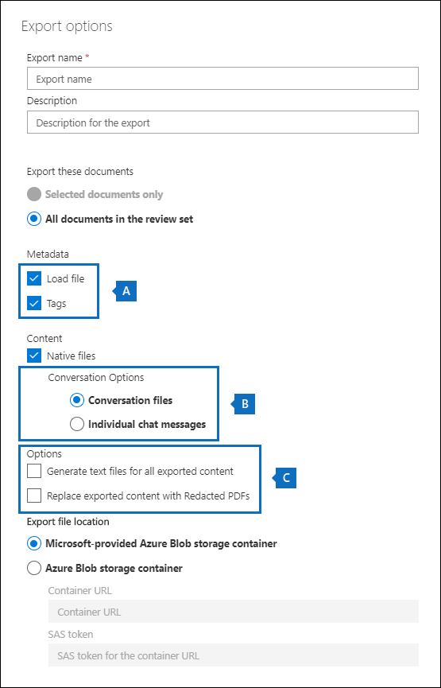

# Threading de conversa em Advanced eDiscovery

A mensagem instantânea é uma maneira conveniente de fazer perguntas, compartilhar ideias ou comunicar-se rapidamente entre grandes públicos. À medida que as plataformas de mensagens instantâneas, como grupos Microsoft Teams e Yammer, se tornam fundamentais para a colaboração corporativa, as organizações devem avaliar como seu fluxo de trabalho de Descoberta Eletrônico aborda essas novas formas de comunicação e colaboração.

O recurso de Reconstrução de Conversa no Advanced eDiscovery foi projetado para ajudá-lo a identificar conteúdo contextual e produzir exibições de conversa distintas. Esse recurso permite que você revise de forma eficiente e rápida conversas de mensagens instantâneas completas (também chamadas de conversas encadeadas *)* geradas em plataformas como Microsoft Teams.

Com a Reconstrução de Conversa, você pode usar recursos integrados para reconstruir, revisar e exportar conversas encadeadas. Use Advanced eDiscovery reconstrução de conversa para:

- Preservar metadados exclusivos no nível de mensagem em todas as mensagens em uma conversa.

- Colete mensagens contextuais em torno dos resultados da pesquisa.

- Revisar, anotar e reencenar conversas encadeadas.

- Exportar mensagens individuais ou conversas encadeadas

## Terminologia

Aqui estão algumas definições para ajudá-lo a começar a usar a Reconstrução de Conversa.

- **Mensagens:** Representa a menor unidade de uma conversa. As mensagens podem variar em tamanho, estrutura e metadados. 

- **Conversa:** Representa um grupo de uma ou mais mensagens. Em diferentes aplicativos, as conversas podem ser representadas de maneiras diferentes. Em alguns aplicativos, há uma ação explícita que resulta da resposta a uma mensagem existente. As conversas são formadas explicitamente como resultado dessa ação do usuário. Por exemplo, aqui está uma captura de tela de uma conversa de canal em Microsoft Teams.

   

   Em outros aplicativos (como mensagens de chat 1xN no Teams), não há uma cadeia de resposta formal e, em vez disso, as mensagens aparecem como um "rio plano de mensagens" dentro de um único thread. Nesses tipos de aplicativos, as conversas são inferidos de um grupo de mensagens que ocorrem em um determinado momento. Esse "grupo suave" de mensagens (em vez de uma cadeia de resposta) representa a conversa "ir e vir" sobre um tópico específico de interesse.

## Etapa 1: Criar uma coleção de rascunhos

Depois de identificar os custodiantes relevantes e os locais de conteúdo, você pode criar uma pesquisa para encontrar conteúdo potencialmente relevante. Na guia **Coleções** no caso Advanced eDiscovery, você pode criar uma coleção clicando em **Nova coleção** e seguindo o assistente. Para obter informações sobre como você pode criar uma coleção, criar uma consulta de pesquisa e visualizar os resultados da pesquisa, consulte [Create a draft collection](create-draft-collection.md).

## Etapa 2: Comprometer um conjunto de rascunhos em um conjunto de revisão

Depois de revisar e finalizar a consulta de pesquisa em uma coleção, você pode adicionar os resultados da pesquisa a um conjunto de revisão. Quando você adiciona seus resultados de pesquisa a um conjunto de revisão, os dados originais são copiados para uma área de Armazenamento do Azure para facilitar o processo de revisão e análise. Para obter mais informações sobre como adicionar resultados de pesquisa a um conjunto de revisão, consulte [Commit a draft collection to a review set](commit-draft-collection.md).

Ao adicionar itens de conversas a um conjunto de revisão, você pode usar a opção de conversas encadeadas para coletar mensagens contextuais de conversas que contenham itens que corresponderem aos critérios de pesquisa da coleção. Depois de selecionar a opção de conversas de thread, as seguintes coisas podem acontecer:

  
  
1. Usando uma palavra-chave e uma consulta de intervalo de datas, a pesquisa retornou um acerto *na Mensagem 3*. Esta mensagem fazia parte de uma conversa maior, ilustrada por *CRC1*.
  
2. Quando você adiciona os dados a um conjunto de revisão e habilita as opções de recuperação de conversa, Advanced eDiscovery retornará e coletará outros itens no *CRC1*.
  
3. Depois que os itens foram adicionados ao conjunto de revisão, você pode revisar todas as mensagens individuais de *CRC1*.

Para habilitar a opção conversas encadeadas, consulte [Commit a draft collection to a review set](commit-draft-collection.md#commit-a-draft-collection-to-a-review-set).
  
## Etapa 3: Revisar e exportar conversas encadeadas

Depois que o conteúdo tiver sido processado e adicionado ao conjunto de revisão, você poderá começar a revisar os dados no conjunto de revisão. Os recursos de revisão são diferentes, dependendo se o conteúdo foi adicionado a um conjunto de revisão padrão ou a um conjunto de revisão de conversa.

### Revisão de conversas em um conjunto de revisão padrão

Em um conjunto de revisão padrão, as mensagens são processadas e exibidas como itens individuais, semelhantes à forma como são armazenadas em uma pasta de caixa de correio. Nesse fluxo de trabalho, cada mensagem é processada como um item separado. Como resultado, as opções de resumo e exportação threaded não estão disponíveis em um conjunto de revisão padrão.

  

### Revisão de conversas em um conjunto de revisão de conversa

Em um conjunto de revisão de conversa, as mensagens individuais são encadeadas e apresentadas como conversas. Isso permite que você revise e exporte conversas contextuais. 

  

As seções a seguir descrevem a revisão e exportação de conversas em um conjunto de revisão de conversa.

#### Revisão de conversas

Em um conjunto de revisão de conversa, você pode usar as seguintes opções para facilitar o processo de revisão.

- **Grupo por conversa:** Reúne mensagens na mesma conversa para ajudar os usuários a simplificar e acelerar o processo de revisão.

- **Exibição de resumo:** Exibe a conversa encadeada. Nesta exibição, você pode ver a conversa inteira e também acessar os metadados de cada mensagem individual.  
  
   - Exibir metadados para mensagens individuais
   
   - Baixar mensagens individuais

- **Exibição de texto:** Fornece o texto extraído para toda a conversa.

- **Exibição de anotações:** Permite marcar uma exibição encadeada da conversa. Todas as mensagens na conversa compartilham o mesmo documento anotado.

- **Marcação:** Ao exibir conversas em um conjunto de revisão, você pode exibir e aplicar marcas clicando em Painel de **Marcação** no painel Codificação.

- **Conversão de conversa de repetição:** Quando as mensagens são adicionadas a um conjunto de revisão de conversa, um trabalho de conversão é executado automaticamente para criar o resumo encadeado e anotar exibições. Se o trabalho de Reconstrução de Conversa falhar, você poderá reprisar esse trabalho clicando em **Ação > Criar PDFs** de conversa no conjunto de revisão.

#### Exportando conversas

Em um conjunto de revisão de conversa, você pode definir as seguintes opções para exportar conversas:

a. Opções de metadados

   - **Arquivo de carga:** Os metadados são incluídos para cada mensagem, email e documento individuais. Há uma linha para cada mensagem em uma conversa. 

   - **Tags:** As marcas do processo de revisão são incluídas no arquivo de metadados. As mensagens em uma conversa compartilham as mesmas marcas. 

b. Opções de conversa
  
   - **Arquivos de conversa:** Quando você exporta arquivos de conversa, o exibição anotado é convertido em um arquivo PDF e baixado para a pasta de exportação. As mensagens em um arquivo de conversa apontam para a versão PDF do mesmo arquivo de conversa.  
  
   - **Mensagens de chat individuais:** Quando você exporta mensagens individuais, cada mensagem exclusiva na conversa é exportada como um item autônomo. O arquivo é exportado no mesmo formato que foi salvo na caixa de correio. Para uma conversa específica, você recebe vários arquivos .msg.

     >[!NOTE]
     > Se você aplicou anotações ao arquivo de conversa, essas anotações não serão transferidas para as mensagens individuais.

c. Outras opções

   - **Gerar arquivos de texto para todo o conteúdo exportado:** Gera um arquivo de texto para cada conversa exportada do conjunto de revisão.

   - **Substitua o conteúdo exportado por PDFs redacionados:** Se os arquivos de conversa redacted são gerados durante o processo de revisão, esses arquivos estarão disponíveis durante a exportação. Você pode decidir se deve exportar somente os arquivos nativos (não selecionando essa opção) ou substituir os arquivos nativos pelas versões redacted dos arquivos nativos (selecionando essa opção), que são exportados como arquivos PDF.

## Mais informações

Para saber mais sobre como revisar dados de caso Advanced eDiscovery, consulte os seguintes artigos:

- [Exibir dados de caso](view-documents-in-review-set.md)

- [Analisar dados de ocorrência](analyzing-data-in-review-set.md)

- [Exportar dados de ocorrência](exporting-data-ediscover20.md)
