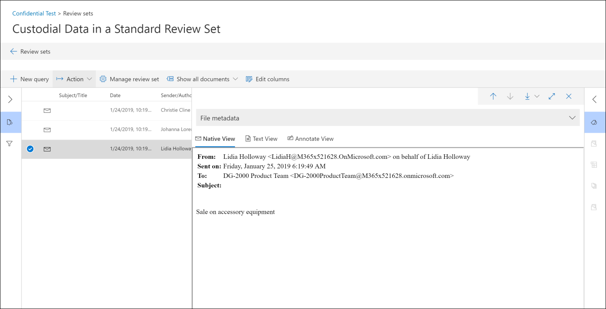

# Analisar conversas na descoberta eletrônica avançadaReview conversations in Advanced eDiscovery 

O sistema de mensagens instantâneas é uma maneira conveniente de fazer perguntas, compartilhar ideias ou se comunicar rapidamente entre grandes audiências.Instant messaging is a convenient way to ask questions, share ideas, or quickly communicate across large audiences. Como as plataformas de mensagens instantâneas, como o Microsoft Teams, se tornarem essenciais para a colaboração corporativa, as organizações devem avaliar como o fluxo de trabalho de descoberta eletrônica resolve essas novas formas de comunicação e colaboração.As instant messaging platforms, like Microsoft Teams, become core to enterprise collaboration, organizations must evaluate how their eDiscovery workflow addresses these new forms of communication and collaboration. 

O recurso de reconstrução de conversa na descoberta eletrônica avançada foi projetado para ajudá-lo a identificar o conteúdo contextual e produzir modos de exibição de conversa distintos.The Conversation Reconstruction feature in Advanced eDiscovery is designed to help you identify contextual content and produce distinct conversation views. Esse recurso permite que você examine de forma eficiente e rápida as conversas de mensagens instantâneas completas (também chamadas de *conversações encadeadas*) geradas em plataformas como o Microsoft Teams.This capability allows you to efficiently and rapidly review complete instant message conversations (also called *threaded conversations*) that are generated in platforms like Microsoft Teams.

Com a reconstrução de conversas, você pode usar recursos internos para reconstruir, revisar e exportar conversas encadeadas.With Conversation Reconstruction, you can use built-in capabilities to reconstruct, review, and export threaded conversations. Use a reconstrução de conversa de descoberta eletrônica avançada para:Use Advanced eDiscovery Conversation Reconstruction to:

- Preservar metadados únicos em nível de mensagem em todas as mensagens de uma conversa.Preserve unique message-level metadata across all messages within a conversation.

- Coletar mensagens contextuais em torno dos resultados da pesquisa.Collect contextual messages around your search results.

- Revisar, anotar e redigir conversas encadeadas.Review, annotate, and redact threaded conversations.

- Exportar mensagens individuais ou conversas encadeadasExport individual messages or threaded conversations

## TerminologiaTerminology

Aqui estão algumas definições para ajudá-lo a começar a usar a reconstrução de conversa.Here are few definitions to help you get start using Conversation Reconstruction.

- **Mensagens:** Representa a menor unidade de uma conversa.**Messages:** Represent the smallest unit of a conversation. As mensagens podem variar de tamanho, estrutura e metadados.Messages may vary in size, structure, and metadata. 

- **Conversa:** Representa um agrupamento de uma ou mais mensagens.**Conversation:** Represents a grouping of one or more messages. Em diferentes aplicativos, as conversas podem ser representadas de diferentes maneiras.Across different applications, conversations may be represented in different ways. Em alguns aplicativos, há uma ação explícita que resulta da resposta a uma mensagem existente.In some applications, there is an explicit action that results from replying to an existing message. As conversas são formadas explicitamente como resultado dessa ação do usuário.Conversations are formed explicitly as a result of this user action. Por exemplo, aqui está uma captura de tela de uma conversa de canal no Microsoft Teams.For example, here is a screenshot of a channel conversation in Microsoft Teams.

   

   Em outros aplicativos (como mensagens de chat do 1xN no Microsoft Teams), não há uma cadeia de resposta formal e, em vez disso, as mensagens aparecem como "Rio simples de mensagens" em um único thread.In other apps (such as 1xN chat messages in Teams), there is not a formal reply chain and instead messages appear as a "flat river of messages" within a single thread. Nesses tipos de aplicativos, as conversas são inferidas de um grupo de mensagens que ocorrem dentro de um determinado momento.In these types apps, conversations are inferred from a group of messages that occur within a certain time. Esse "Agrupamento de mensagens" (em vez de uma cadeia de resposta) representa a conversa "frente e para trás" sobre um tópico específico de interesse.This "soft-grouping" of messages (as opposed to a reply chain) represent the "back and forth" conversation about a specific topic of interest. 

## Etapa 1: executar uma pesquisaStep 1: Run a search

Após identificar os responsáveis e locais de conteúdo relevantes, você poderá criar uma pesquisa para localizar conteúdo potencialmente relevante.After you have identified relevant custodians and content locations, you can create a search to find potentially relevant content. Na guia **pesquisas** da caixa de descoberta eletrônica avançada, você pode criar uma pesquisa clicando em **nova pesquisa** e seguindo o assistente.On the **Searches** tab in the Advanced eDiscovery case, you can create a search by clicking **New search** and following the wizard. Para obter informações sobre como você pode criar uma pesquisa, criar uma consulta de pesquisa e exibir os resultados da pesquisa, consulte [coletar dados por um caso](create-search-to-collect-data.md).For information about how you can create a search, build a search query, and view the search results, see [Collect data for a case](create-search-to-collect-data.md).

## Etapa 2: criar um conjunto de revisão de conversaStep 2: Create a conversation review set

Em um conjunto de revisão, você pode pesquisar, marcar, anotar e redigir documentos, mensagens de email e conversas de chat.In a review set, you can search, tag, annotate, and redact documents, email messages, and chat conversations. Na descoberta eletrônica avançada, você pode personalizar a revisão de conversas, com base em mensagens individuais ou conversas encadeadas.In Advanced eDiscovery, you can customize your review of conversations, based in individual messages or threaded conversations. Isso é determinado pelo tipo de conjunto de revisão que você adiciona os resultados da pesquisa criada na etapa 1 para.This is determined by the type of review set that you add the results of the search created in Step 1 to. Há dois tipos diferentes de conjuntos de revisão:There are two different types of review sets: 
  
  - **Conjuntos de revisão padrão:** As mensagens em conversas são processadas e exibidas como itens individuais.**Standard review sets:** Messages in conversations are processed and displayed as individual items. 
  
  -  **Conjuntos de revisão de conversa:** As mensagens em conversas são processadas individualmente, mas exibidas em um modo de exibição de conversa.**Conversation review sets:** Messages in conversations are processed individually but displayed in a conversation view. Em um conjunto de revisão de conversa, você pode anotar, marcar e redigir mensagens em um modo de exibição de conversa encadeado.In a conversation review set, you can annotate, tag, and redact messages in a threaded conversation view. 

Para obter mais informações sobre como revisar e gerenciar o conteúdo em um conjunto de revisão, consulte [Manage Review sets](managing-review-sets.md).For more information about how to review and manage content in a review set, see [Manage review sets](managing-review-sets.md). 

## Etapa 3: habilitar as opções de recuperação de conversaStep 3: Enable conversation retrieval options

Depois de revisar e finalizar a consulta de pesquisa, você pode adicionar os resultados da pesquisa a um conjunto de revisão.After you have reviewed and finalized your search query, you can add the search results to a review set. Quando você adiciona os resultados da pesquisa em um conjunto de revisão, os dados originais são copiados para uma área de armazenamento do Azure para facilitar o processo de revisão e análise.When you add your search results into a review set, the original data is copied to an Azure Storage area to facilitate the review and analysis process. Para obter mais informações sobre como adicionar resultados de pesquisa a um conjunto de revisão, consulte [Add Search Results to a Review Set](add-data-to-review-set.md).For more information about adding search results to a review set, see [Add search results to a review set](add-data-to-review-set.md). 

Ao adicionar dados de conversas a um conjunto de revisão, você pode usar as opções de recuperação de conversa para expandir sua pesquisa e incluir mensagens contextuais.When you add data from conversations to a review set, you can use the conversation retrieval options to expand your search and include contextual messages. Após definir as opções de recuperação de conversa, as seguintes coisas podem ocorrer:After you set the conversation retrieval options, the following things can happen:

  
  
1. Usando uma consulta de intervalo de datas e palavras-chave, a pesquisa retornou uma ocorrência na *mensagem 3*.Using a keyword and date range query, the search returned a hit on *Message 3*. Esta mensagem faz parte de uma conversa maior, ilustrada por *CRC1*.This message was part of a larger conversation, illustrated by *CRC1*. 
  
2. Quando você adiciona os dados em um conjunto de revisão e habilita as opções de recuperação de conversa, a descoberta eletrônica avançada volta e coleta outros itens no *CRC1*.When you add the data into a review set and enable the conversation retrieval options, Advanced eDiscovery will go back and collect other items in *CRC1*. 
  
3. Depois que os itens tiverem sido adicionados ao conjunto de revisão, você poderá revisar todas as mensagens individuais do *CRC1*.After the items have been added to the review set, you can review all the individual messages from *CRC1*. 

Para habilitar a recuperação de conversas:To enable conversation retrieval:
  
1. Na guia **pesquisas** da caixa de descoberta eletrônica avançada, selecione uma pesquisa e, em seguida, clique em **Adicionar a revisão definida** na página do menu suspenso.On the **Searches** tab in the Advanced eDiscovery case, select a search, and then click **Add to review set** on the flyout page.
  
2. Selecione um conjunto de revisão existente ou crie um conjunto de revisão.Select an existing review set or create a review set. Você pode configurar opções de recuperação ao adicionar resultados de pesquisa a um conjunto de análise de conversa padrão ou padrão.You can configure retrieval options when adding search results to a standard or a conversation review set.
  
3. Em **Opções de coleta**, configure as opções de recuperação de conversa para as fontes de conteúdo que você deseja expandir em sua pesquisa e clique em **Adicionar** para iniciar o processo.Under **Collection options**, configure the conversation retrieval options for the content sources that you want to expand in your search, and then click **Add** to start the process.  
  
4. Após a conclusão do trabalho de **adição à revisão** do trabalho na guia **trabalhos** , você poderá começar a revisar as conversas.After the **Add to review set** job on the **Jobs** tab has finished, you can start reviewing the conversations.

## Etapa 4: revisar e exportar conversas em um conjunto de revisãoStep 4: Review and export conversations in a review set

Após o conteúdo ter sido processado e adicionado ao conjunto de revisão, você pode começar a revisar os dados no conjunto de revisão.After the content has been processed and added to the review set, you can start reviewing the data in the review set. Os recursos de revisão são diferentes dependendo se o conteúdo foi adicionado a um conjunto de revisão padrão ou um conjunto de revisão de conversa.The review capabilities are different depending on whether the content was added to a standard review set or a conversation review set. 

### Revisando conversas em um conjunto de análise padrãoReviewing conversations in a standard review set

Em um conjunto de revisão padrão, as mensagens são processadas e exibidas como itens individuais, semelhante à forma como estão armazenadas em uma pasta de caixa de correio.In a standard review set, messages are processed and displayed as individual items, similar to how they're stored in a mailbox folder. Neste fluxo de trabalho, cada mensagem é processada como um item separado.In this workflow, each message is processed as a separate item. Como resultado, o resumo segmentado e as opções de exportação não estão disponíveis em um conjunto de análise padrão.As a result, the threaded summary and export options aren't available in a standard review set. 

  

### Analisar conversas em um conjunto de revisão de conversaReviewing conversations in a conversation review set

Em um conjunto de revisão de conversa, as mensagens individuais são encadeadas e apresentadas como conversas.In a conversation review set, individual messages are threaded together and presented as conversations. Isso permite que você revise e exporte conversas contextuais.This lets you review and export contextual conversations. 

  

As seções a seguir descrevem a revisão e exportação de conversas em um conjunto de análise de conversa.The following sections describe reviewing and exporting conversations in a conversation review set.

#### Revisando conversasReviewing conversations

Em um conjunto de revisão de conversa, você pode usar as seguintes opções para facilitar o processo de revisão.In a conversation review set, you can use the following options to facilitate the review process.

- **Agrupar por conversa:** Agrupa as mensagens dentro da mesma conversa para ajudar os usuários a simplificar e agilizar o processo de revisão.**Group by conversation:** Groups messages within the same conversation together to help users simplify and expedite their review process. 

- **Exibição de Resumo:** Exibe a conversa encadeada.**Summary view:** Displays the threaded conversation. Nesse modo de exibição, você pode ver toda a conversa e também acessar os metadados de cada mensagem individual.In this view, you can see the entire conversation and also access the metadata for each individual message.  
  
   - Exibir metadados para mensagens individuaisView metadata for individual messages
   
   - Baixar mensagens individuaisDownload individual messages

- **Exibição de texto:** Fornece o texto extraído da conversa inteira.**Text view:** Provides the extracted text for the entire conversation. 

- **Modo de anotações:** Permite marcar um modo de exibição segmentado da conversa.**Annotate view:** Lets you markup a threaded view of the conversation. Todas as mensagens na conversa compartilham o mesmo documento anotado.All messages in the conversation share the same annotated document.

- **Marcação:** Ao exibir conversas em um conjunto de revisão, você pode exibir e aplicar marcas clicando em **painel de marcação** no painel de codificação.**Tagging:** When viewing conversations in a review set, you can view and apply tags by clicking **Tagging panel** in the Coding panel.

- **Executar a conversão de conversa novamente:** Quando as mensagens são adicionadas a um conjunto de revisão de conversa, um trabalho de conversão é executado automaticamente para criar os modos de exibição de resumo e anotações encadeados.**Rerun conversation conversion:** When messages are added to a conversation review set, a conversion job is automatically run to create the threaded summary and annotate views. Se o trabalho de reconstrução da conversa falhar, você poderá executar novamente esse trabalho clicando em **ação > criar PDFs de conversa** no conjunto de revisão.If the Conversation Reconstruction job fails, you can rerun this job by clicking **Action > Create conversation PDFs** in the review set.

#### Exportando conversasExporting conversations

Em um conjunto de revisão de conversa, você pode definir as seguintes opções para exportar conversas:In a conversation review set, you can set the following options to export conversations:

a.a. Opções de metadadosMetadata options

   - **Carregar arquivo:** Os metadados são incluídos para cada mensagem, email e documento individual.**Load file:** Metadata is included for each individual message, email, and document. Há uma linha para cada mensagem em uma conversa.There is one row for each message in a conversation. 

   - **Marcas:** As marcas do processo de revisão são incluídas no arquivo de metadados.**Tags:** Tags from your review process are included in the metadata file. As mensagens em uma conversa compartilham as mesmas marcas.Messages in a conversation share the same tags. 

b.b. Opções de conversaConversation options
  
   - **Arquivos de conversa:** Quando você exporta arquivos de conversa, o modo de exibição anotado é convertido em um arquivo PDF e baixado para a pasta de exportação.**Conversation files:** When you export conversation files, the annotated view is converted to a PDF file and downloaded to the export folder. As mensagens em um arquivo de conversa apontam para a versão do PDF do mesmo arquivo de conversa.Messages in one conversation file point to the PDF version of the same conversation file.  
  
   - **Mensagens de chat individuais:** Quando você exporta mensagens individuais, cada mensagem exclusiva na conversa é exportada como um item autônomo.**Individual chat messages:** When you export individual messages, each unique message in the conversation is exported as a standalone item. O arquivo é exportado no mesmo formato em que foi salvo na caixa de correio.The file is exported in the same format that it was saved as in the mailbox. Para uma conversa específica, você recebe vários arquivos. msg.For a specific conversation, you receive multiple .msg files. 

     >[!NOTE]
     > Se você aplicou anotações ao arquivo de conversa, essas anotações não serão transferidas para as mensagens individuais.If you applied annotations to the conversation file, these annotations won't be transferred to the individual messages. 

c.c. Outras opçõesOther options

   - **Gerar arquivos de texto para todo o conteúdo exportado:** Gera um arquivo de texto para cada conversa exportada do conjunto de revisão.**Generate text files for all exported content:** Generates a text file for each conversation exported from the review set. 

   - **Substitua o conteúdo exportado por PDFs redigidos:** Se os arquivos de conversa redigidos forem gerados durante o processo de revisão, esses arquivos estarão disponíveis durante a exportação.**Replace exported content with redacted PDFs:** If redacted conversation files are generated during the review process, then these files are available during export. Você pode decidir se deseja exportar somente os arquivos nativos (sem selecionar essa opção) ou substituir os arquivos nativos pelas versões redigidas dos arquivos nativos (selecionando essa opção), que são exportadas como arquivos PDF.You can decided whether to export only the native files (by not selecting this option) or to replace the native files with the redacted versions of the native files (by selecting this option), which are exported as PDF files.

## Mais informaçõesMore information

Para saber mais sobre como revisar os dados do caso na descoberta eletrônica avançada, consulte os seguintes artigos:To learn more about how to review case data in Advanced eDiscovery, see the following articles:

- [Exibir dados de casoView case data](view-documents-in-review-set.md)

- [Analisar dados de ocorrênciaAnalyze case data](analyzing-data-in-review-set.md)

- [Exportar dados de ocorrênciaExport case data](exporting-data-ediscover20.md)
