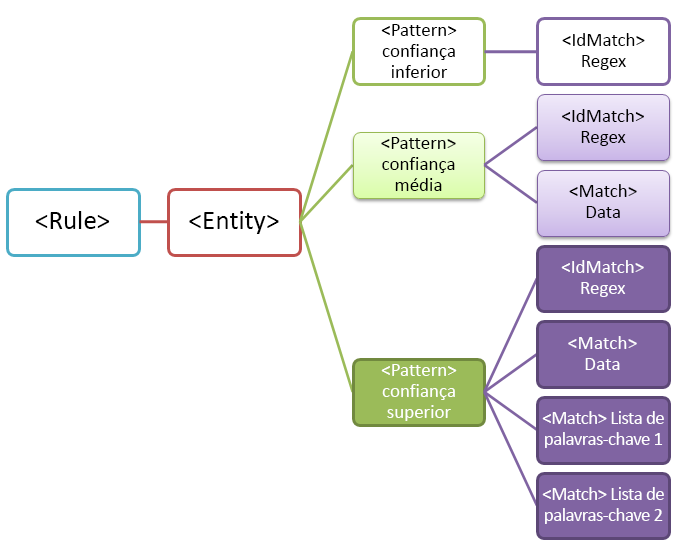
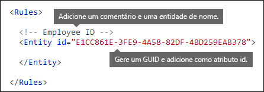
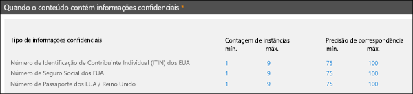
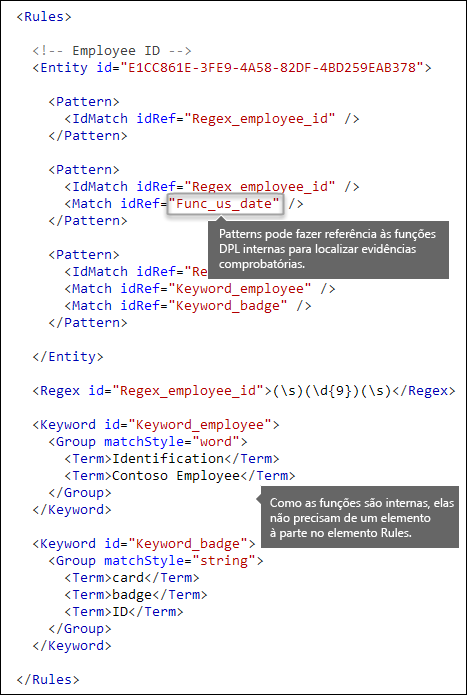
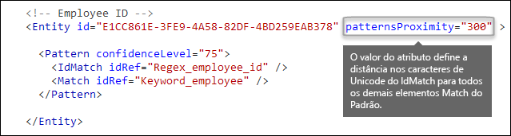

# <a name="create-a-custom-sensitive-information-type-in-security--compliance-center-powershell"></a><span data-ttu-id="ef5d2-103">Crie um tipo de informações confidenciais personalizado no PowerShell do Centro de Conformidade e Segurança</span><span class="sxs-lookup"><span data-stu-id="ef5d2-103">Create a custom sensitive information type in Security & Compliance Center PowerShell</span></span>

<span data-ttu-id="ef5d2-104">Data loss prevention (DLP) in Microsoft 365 includes many built-in [Sensitive information type entity definitions](sensitive-information-type-entity-definitions.md) that are ready for you to use in your DLP policies.</span><span class="sxs-lookup"><span data-stu-id="ef5d2-104">Data loss prevention (DLP) in Microsoft 365 includes many built-in [Sensitive information type entity definitions](sensitive-information-type-entity-definitions.md) that are ready for you to use in your DLP policies.</span></span> <span data-ttu-id="ef5d2-105">These built-in types can help identify and protect credit card numbers, bank account numbers, passport numbers, and more.</span><span class="sxs-lookup"><span data-stu-id="ef5d2-105">These built-in types can help identify and protect credit card numbers, bank account numbers, passport numbers, and more.</span></span>
  
<span data-ttu-id="ef5d2-106">But what if you need to identify and protect a different type of sensitive information (for example, an employee ID that uses a format specific to your organization)?</span><span class="sxs-lookup"><span data-stu-id="ef5d2-106">But what if you need to identify and protect a different type of sensitive information (for example, an employee ID that uses a format specific to your organization)?</span></span> <span data-ttu-id="ef5d2-107">To do this, you can create a custom sensitive information type that is defined in an XML file called a *rule package*.</span><span class="sxs-lookup"><span data-stu-id="ef5d2-107">To do this, you can create a custom sensitive information type that is defined in an XML file called a *rule package*.</span></span>
  
<span data-ttu-id="ef5d2-108">This topic shows you how to create an XML file that defines your own custom sensitive information type.</span><span class="sxs-lookup"><span data-stu-id="ef5d2-108">This topic shows you how to create an XML file that defines your own custom sensitive information type.</span></span> <span data-ttu-id="ef5d2-109">You need to know how to create a regular expression.</span><span class="sxs-lookup"><span data-stu-id="ef5d2-109">You need to know how to create a regular expression.</span></span> <span data-ttu-id="ef5d2-110">As an example, this topic creates a custom sensitive information type that identifies an employee ID.</span><span class="sxs-lookup"><span data-stu-id="ef5d2-110">As an example, this topic creates a custom sensitive information type that identifies an employee ID.</span></span> <span data-ttu-id="ef5d2-111">You can use this example XML as a starting point for your own XML file.</span><span class="sxs-lookup"><span data-stu-id="ef5d2-111">You can use this example XML as a starting point for your own XML file.</span></span>
  
<span data-ttu-id="ef5d2-112">After you've created a well-formed XML file, you can upload it to Microsoft 365 by using Microsoft 365 PowerShell.</span><span class="sxs-lookup"><span data-stu-id="ef5d2-112">After you've created a well-formed XML file, you can upload it to Microsoft 365 by using Microsoft 365 PowerShell.</span></span> <span data-ttu-id="ef5d2-113">Then you're ready to use your custom sensitive information type in your DLP policies and test that it's detecting the sensitive information as you intended.</span><span class="sxs-lookup"><span data-stu-id="ef5d2-113">Then you're ready to use your custom sensitive information type in your DLP policies and test that it's detecting the sensitive information as you intended.</span></span>

> [!NOTE]
> <span data-ttu-id="ef5d2-114">You can also create less complex custom sensitive information types in the Security & Compliance Center UI.</span><span class="sxs-lookup"><span data-stu-id="ef5d2-114">You can also create less complex custom sensitive information types in the Security & Compliance Center UI.</span></span> <span data-ttu-id="ef5d2-115">For more information, see [Create a custom sensitive information type](create-a-custom-sensitive-information-type.md).</span><span class="sxs-lookup"><span data-stu-id="ef5d2-115">For more information, see [Create a custom sensitive information type](create-a-custom-sensitive-information-type.md).</span></span>

## <a name="important-disclaimer"></a><span data-ttu-id="ef5d2-116">Aviso de isenção de responsabilidade importante</span><span class="sxs-lookup"><span data-stu-id="ef5d2-116">Important disclaimer</span></span>
<!-- this is worded much better than the previous one is -->
<span data-ttu-id="ef5d2-117">Due to the variances in customer environments and content match requirements, Microsoft Support cannot assist in providing custom content-matching definitions; e.g., defining custom classifications or regular expression (also known as RegEx) patterns.</span><span class="sxs-lookup"><span data-stu-id="ef5d2-117">Due to the variances in customer environments and content match requirements, Microsoft Support cannot assist in providing custom content-matching definitions; e.g., defining custom classifications or regular expression (also known as RegEx) patterns.</span></span> <span data-ttu-id="ef5d2-118">For custom content-matching development, testing, and debugging, Microsoft 365 customers will need to rely upon internal IT resources, or use an external consulting resource such as Microsoft Consulting Services (MCS).</span><span class="sxs-lookup"><span data-stu-id="ef5d2-118">For custom content-matching development, testing, and debugging, Microsoft 365 customers will need to rely upon internal IT resources, or use an external consulting resource such as Microsoft Consulting Services (MCS).</span></span> <span data-ttu-id="ef5d2-119">Support engineers can provide limited support for the feature, but cannot provide assurances that any custom content-matching development will fulfill the customer's requirements or obligations.</span><span class="sxs-lookup"><span data-stu-id="ef5d2-119">Support engineers can provide limited support for the feature, but cannot provide assurances that any custom content-matching development will fulfill the customer's requirements or obligations.</span></span>  <span data-ttu-id="ef5d2-120">As an example of the type of support that can be provided, sample regular expression patterns may be provided for testing purposes.</span><span class="sxs-lookup"><span data-stu-id="ef5d2-120">As an example of the type of support that can be provided, sample regular expression patterns may be provided for testing purposes.</span></span> <span data-ttu-id="ef5d2-121">Or, support can assist with troubleshooting an existing RegEx pattern which is not triggering as expected with a single specific content example.</span><span class="sxs-lookup"><span data-stu-id="ef5d2-121">Or, support can assist with troubleshooting an existing RegEx pattern which is not triggering as expected with a single specific content example.</span></span>

<span data-ttu-id="ef5d2-122">Confira os [Possíveis problemas de validação para se lembrar](#potential-validation-issues-to-be-aware-of) neste tópico.</span><span class="sxs-lookup"><span data-stu-id="ef5d2-122">See, [Potential validation issues to be aware of](#potential-validation-issues-to-be-aware-of) in this topic.</span></span>

<span data-ttu-id="ef5d2-123">Para saber mais sobre o mecanismo de Boost.RegEx (conhecido anteriormente como RegEx + +) é usado para processar o texto, confira [Boost.Regex 5.1.3](https://www.boost.org/doc/libs/1_68_0/libs/regex/doc/html/).</span><span class="sxs-lookup"><span data-stu-id="ef5d2-123">For more information about the Boost.RegEx (formerly known as RegEx++) engine that's used for processing the text, see [Boost.Regex 5.1.3](https://www.boost.org/doc/libs/1_68_0/libs/regex/doc/html/).</span></span>

## <a name="sample-xml-of-a-rule-package"></a><span data-ttu-id="ef5d2-124">XML de exemplo de um pacote de regras</span><span class="sxs-lookup"><span data-stu-id="ef5d2-124">Sample XML of a rule package</span></span>

<span data-ttu-id="ef5d2-125">Here's the sample XML of the rule package that we'll create in this topic.</span><span class="sxs-lookup"><span data-stu-id="ef5d2-125">Here's the sample XML of the rule package that we'll create in this topic.</span></span> <span data-ttu-id="ef5d2-126">Elements and attributes are explained in the sections below.</span><span class="sxs-lookup"><span data-stu-id="ef5d2-126">Elements and attributes are explained in the sections below.</span></span>
  
```xml
<?xml version="1.0" encoding="UTF-16"?>
<RulePackage xmlns="https://schemas.microsoft.com/office/2011/mce">
<RulePack id="DAD86A92-AB18-43BB-AB35-96F7C594ADAA">
    <Version build="0" major="1" minor="0" revision="0"/>
    <Publisher id="619DD8C3-7B80-4998-A312-4DF0402BAC04"/>
    <Details defaultLangCode="en-us">
        <LocalizedDetails langcode="en-us">
            <PublisherName>Contoso</PublisherName>
            <Name>Employee ID Custom Rule Pack</Name>
            <Description>
            This rule package contains the custom Employee ID entity.
            </Description>
        </LocalizedDetails>
    </Details>
</RulePack>
<Rules>
<!-- Employee ID -->
    <Entity id="E1CC861E-3FE9-4A58-82DF-4BD259EAB378" patternsProximity="300" recommendedConfidence="70">
        <Pattern confidenceLevel="60">
            <IdMatch idRef="Regex_employee_id"/>
        </Pattern>
        <Pattern confidenceLevel="70">
            <IdMatch idRef="Regex_employee_id"/>
            <Match idRef="Func_us_date"/>
        </Pattern>
        <Pattern confidenceLevel="80">
            <IdMatch idRef="Regex_employee_id"/>
            <Match idRef="Func_us_date"/>
            <Any minMatches="1">
                <Match idRef="Keyword_badge" minCount="2"/>
                <Match idRef="Keyword_employee"/>
            </Any>
            <Any minMatches="0" maxMatches="0">
                <Match idRef="Keyword_false_positives_local"/>
                <Match idRef="Keyword_false_positives_intl"/>
            </Any>
        </Pattern>
    </Entity>
    <Regex id="Regex_employee_id">(\s)(\d{9})(\s)</Regex>
    <Keyword id="Keyword_employee">
        <Group matchStyle="word">
            <Term>Identification</Term>
            <Term>Contoso Employee</Term>
        </Group>
    </Keyword>
    <Keyword id="Keyword_badge">
        <Group matchStyle="string">
            <Term>card</Term>
            <Term>badge</Term>
            <Term caseSensitive="true">ID</Term>
        </Group>
    </Keyword>
    <Keyword id="Keyword_false_positives_local">
        <Group matchStyle="word">
            <Term>credit card</Term>
            <Term>national ID</Term>
        </Group>
    </Keyword>
    <Keyword id="Keyword_false_positives_intl">
        <Group matchStyle="word">
            <Term>identity card</Term>
            <Term>national ID</Term>
            <Term>EU debit card</Term>
        </Group>
    </Keyword>
    <LocalizedStrings>
        <Resource idRef="E1CC861E-3FE9-4A58-82DF-4BD259EAB378">
            <Name default="true" langcode="en-us">Employee ID</Name>
            <Description default="true" langcode="en-us">
            A custom classification for detecting Employee IDs.
            </Description>
            <Description default="false" langcode="de-de">
            Description for German locale.
            </Description>
        </Resource>
    </LocalizedStrings>
</Rules>
</RulePackage>
```

## <a name="what-are-your-key-requirements-rule-entity-pattern-elements"></a><span data-ttu-id="ef5d2-127">What are your key requirements?</span><span class="sxs-lookup"><span data-stu-id="ef5d2-127">What are your key requirements?</span></span> <span data-ttu-id="ef5d2-128">[Rule, Entity, Pattern elements]</span><span class="sxs-lookup"><span data-stu-id="ef5d2-128">[Rule, Entity, Pattern elements]</span></span>

<span data-ttu-id="ef5d2-129">Antes de começar, é importante compreender a estrutura básica do esquema XML para uma regra e como você pode usar essa estrutura para definir seu tipo personalizado de informações confidenciais para que ele identifique o conteúdo certo.</span><span class="sxs-lookup"><span data-stu-id="ef5d2-129">Before you get started, it's helpful to understand the basic structure of the XML schema for a rule, and how you can use this structure to define your custom sensitive information type so that it will identify the right content.</span></span>
  
<span data-ttu-id="ef5d2-130">A rule defines one or more entities (sensitive information types), and each entity defines one or more patterns.</span><span class="sxs-lookup"><span data-stu-id="ef5d2-130">A rule defines one or more entities (sensitive information types), and each entity defines one or more patterns.</span></span> <span data-ttu-id="ef5d2-131">A pattern is what DLP looks for when it evaluates content such as email and documents.</span><span class="sxs-lookup"><span data-stu-id="ef5d2-131">A pattern is what DLP looks for when it evaluates content such as email and documents.</span></span>
  <!-- ok then this is going to be really confusing since the terminology changes.... -->
<span data-ttu-id="ef5d2-132">(A quick note on terminology - if you're familiar with DLP policies, you know that a policy contains one or more rules comprised of conditions and actions.</span><span class="sxs-lookup"><span data-stu-id="ef5d2-132">(A quick note on terminology - if you're familiar with DLP policies, you know that a policy contains one or more rules comprised of conditions and actions.</span></span> <span data-ttu-id="ef5d2-133">However, in this topic, the XML markup uses rule to mean the patterns that define an entity, also known as a sensitive information type.</span><span class="sxs-lookup"><span data-stu-id="ef5d2-133">However, in this topic, the XML markup uses rule to mean the patterns that define an entity, also known as a sensitive information type.</span></span> <span data-ttu-id="ef5d2-134">So in this topic, when you see rule, think entity or sensitive information type, not conditions and actions.)</span><span class="sxs-lookup"><span data-stu-id="ef5d2-134">So in this topic, when you see rule, think entity or sensitive information type, not conditions and actions.)</span></span>
  
### <a name="simplest-scenario-entity-with-one-pattern"></a><span data-ttu-id="ef5d2-135">Cenário mais simples: entidade com um padrão</span><span class="sxs-lookup"><span data-stu-id="ef5d2-135">Simplest scenario: entity with one pattern</span></span>

<span data-ttu-id="ef5d2-136">Here's the simplest scenario.</span><span class="sxs-lookup"><span data-stu-id="ef5d2-136">Here's the simplest scenario.</span></span> <span data-ttu-id="ef5d2-137">You want your DLP policy to identify content that contains your organization's employee ID, which is formatted as a nine-digit number.</span><span class="sxs-lookup"><span data-stu-id="ef5d2-137">You want your DLP policy to identify content that contains your organization's employee ID, which is formatted as a nine-digit number.</span></span> <span data-ttu-id="ef5d2-138">So the pattern refers to a regular expression contained in the rule that identifies nine-digit numbers.</span><span class="sxs-lookup"><span data-stu-id="ef5d2-138">So the pattern refers to a regular expression contained in the rule that identifies nine-digit numbers.</span></span> <span data-ttu-id="ef5d2-139">Any content containing a nine-digit number satisfies the pattern.</span><span class="sxs-lookup"><span data-stu-id="ef5d2-139">Any content containing a nine-digit number satisfies the pattern.</span></span>
  

  
<span data-ttu-id="ef5d2-141">No entanto, embora seja simples, esse padrão poderá identificar muitos falsos positivos combinando conteúdo que contém qualquer número de nove dígitos que não seja necessariamente uma ID de funcionário.</span><span class="sxs-lookup"><span data-stu-id="ef5d2-141">However, while simple, this pattern may identify many false positives by matching content that contains any nine-digit number that is not necessarily an employee ID.</span></span>
  
### <a name="more-common-scenario-entity-with-multiple-patterns"></a><span data-ttu-id="ef5d2-142">Cenário mais comum: entidade com vários padrões</span><span class="sxs-lookup"><span data-stu-id="ef5d2-142">More common scenario: entity with multiple patterns</span></span>

<span data-ttu-id="ef5d2-143">Por esse motivo, é mais comum definir uma entidade usando mais de um padrão, em que os padrões identificam evidências de suporte (como uma palavra-chave ou data) além da entidade (como um número de nove dígitos).</span><span class="sxs-lookup"><span data-stu-id="ef5d2-143">For this reason, it's more common to define an entity by using more than one pattern, where the patterns identify supporting evidence (such as a keyword or date) in addition to the entity (such as a nine-digit number).</span></span>
  
<span data-ttu-id="ef5d2-144">Por exemplo, para aumentar as chances de identificar o conteúdo com uma ID de funcionário, você poderá definir outro padrão que também identifica a data de contratação ou definir outro padrão que identifica a data de contratação e uma palavra-chave (como "ID do funcionário"), além do número de nove dígitos.</span><span class="sxs-lookup"><span data-stu-id="ef5d2-144">For example, to increase the likelihood of identifying content that contains an employee ID, you can define another pattern that also identifies a hire date, and define yet another pattern that identifies both a hire date and a keyword (such as "employee ID"), in addition to the nine-digit number.</span></span>
  

  
<span data-ttu-id="ef5d2-146">Observe alguns aspectos importantes dessa estrutura:</span><span class="sxs-lookup"><span data-stu-id="ef5d2-146">Note a couple of important aspects of this structure:</span></span>
  
- <span data-ttu-id="ef5d2-147">Patterns that require more evidence have a higher confidence level.</span><span class="sxs-lookup"><span data-stu-id="ef5d2-147">Patterns that require more evidence have a higher confidence level.</span></span> <span data-ttu-id="ef5d2-148">This is useful because when you later use this sensitive information type in a DLP policy, you can use more restrictive actions (such as block content) with only the higher-confidence matches, and you can use less restrictive actions (such as send notification) with the lower-confidence matches.</span><span class="sxs-lookup"><span data-stu-id="ef5d2-148">This is useful because when you later use this sensitive information type in a DLP policy, you can use more restrictive actions (such as block content) with only the higher-confidence matches, and you can use less restrictive actions (such as send notification) with the lower-confidence matches.</span></span>

- <span data-ttu-id="ef5d2-149">The supporting IdMatch and Match elements reference regexes and keywords that are actually children of the Rule element, not the Pattern.</span><span class="sxs-lookup"><span data-stu-id="ef5d2-149">The supporting IdMatch and Match elements reference regexes and keywords that are actually children of the Rule element, not the Pattern.</span></span> <span data-ttu-id="ef5d2-150">These supporting elements are referenced by the Pattern but included in the Rule.</span><span class="sxs-lookup"><span data-stu-id="ef5d2-150">These supporting elements are referenced by the Pattern but included in the Rule.</span></span> <span data-ttu-id="ef5d2-151">This means that a single definition of a supporting element, like a regular expression or a keyword list, can be referenced by multiple entities and patterns.</span><span class="sxs-lookup"><span data-stu-id="ef5d2-151">This means that a single definition of a supporting element, like a regular expression or a keyword list, can be referenced by multiple entities and patterns.</span></span>

## <a name="what-entity-do-you-need-to-identify-entity-element-id-attribute"></a><span data-ttu-id="ef5d2-152">What entity do you need to identify?</span><span class="sxs-lookup"><span data-stu-id="ef5d2-152">What entity do you need to identify?</span></span> <span data-ttu-id="ef5d2-153">[Entity element, id attribute]</span><span class="sxs-lookup"><span data-stu-id="ef5d2-153">[Entity element, id attribute]</span></span>

<span data-ttu-id="ef5d2-154">An entity is a sensitive information type, such as a credit card number, that has a well-defined pattern.</span><span class="sxs-lookup"><span data-stu-id="ef5d2-154">An entity is a sensitive information type, such as a credit card number, that has a well-defined pattern.</span></span> <span data-ttu-id="ef5d2-155">Each entity has a unique GUID as its ID.</span><span class="sxs-lookup"><span data-stu-id="ef5d2-155">Each entity has a unique GUID as its ID.</span></span>
  
### <a name="name-the-entity-and-generate-its-guid"></a><span data-ttu-id="ef5d2-156">Nomear a entidade e gerar seu GUID</span><span class="sxs-lookup"><span data-stu-id="ef5d2-156">Name the entity and generate its GUID</span></span>
<!-- why isn't the following in procedure format? -->
<span data-ttu-id="ef5d2-157">Add the Rules and Entity elements.</span><span class="sxs-lookup"><span data-stu-id="ef5d2-157">Add the Rules and Entity elements.</span></span> <span data-ttu-id="ef5d2-158">Then add a comment that contains the name of your custom entity - in this example, Employee ID.</span><span class="sxs-lookup"><span data-stu-id="ef5d2-158">Then add a comment that contains the name of your custom entity - in this example, Employee ID.</span></span> <span data-ttu-id="ef5d2-159">Later, you'll add the entity name to the localized strings section, and that name is what appears in the UI when you create a DLP policy.</span><span class="sxs-lookup"><span data-stu-id="ef5d2-159">Later, you'll add the entity name to the localized strings section, and that name is what appears in the UI when you create a DLP policy.</span></span>
  
<span data-ttu-id="ef5d2-160">Next, generate a GUID for your entity.</span><span class="sxs-lookup"><span data-stu-id="ef5d2-160">Next, generate a GUID for your entity.</span></span> <span data-ttu-id="ef5d2-161">There are several ways to generate GUIDs, but you can do it easily in PowerShell by typing [guid]::NewGuid().</span><span class="sxs-lookup"><span data-stu-id="ef5d2-161">There are several ways to generate GUIDs, but you can do it easily in PowerShell by typing [guid]::NewGuid().</span></span> <span data-ttu-id="ef5d2-162">Later, you'll also add the entity GUID to the localized strings section.</span><span class="sxs-lookup"><span data-stu-id="ef5d2-162">Later, you'll also add the entity GUID to the localized strings section.</span></span>
  

  
## <a name="what-pattern-do-you-want-to-match-pattern-element-idmatch-element-regex-element"></a><span data-ttu-id="ef5d2-164">What pattern do you want to match?</span><span class="sxs-lookup"><span data-stu-id="ef5d2-164">What pattern do you want to match?</span></span> <span data-ttu-id="ef5d2-165">[Pattern element, IdMatch element, Regex element]</span><span class="sxs-lookup"><span data-stu-id="ef5d2-165">[Pattern element, IdMatch element, Regex element]</span></span>

<span data-ttu-id="ef5d2-166">The pattern contains the list of what the sensitive information type is looking for.</span><span class="sxs-lookup"><span data-stu-id="ef5d2-166">The pattern contains the list of what the sensitive information type is looking for.</span></span> <span data-ttu-id="ef5d2-167">This can include regexes, keywords, and built-in functions (which perform tasks like running regexes to find dates or addresses).</span><span class="sxs-lookup"><span data-stu-id="ef5d2-167">This can include regexes, keywords, and built-in functions (which perform tasks like running regexes to find dates or addresses).</span></span> <span data-ttu-id="ef5d2-168">Sensitive information types can have multiple patterns with unique confidences.</span><span class="sxs-lookup"><span data-stu-id="ef5d2-168">Sensitive information types can have multiple patterns with unique confidences.</span></span>
  
<span data-ttu-id="ef5d2-169">What all of the below patterns have in common is that they all reference the same regular expression, which looks for a nine-digit number (\d{9}) surrounded by white space (\s) …</span><span class="sxs-lookup"><span data-stu-id="ef5d2-169">What all of the below patterns have in common is that they all reference the same regular expression, which looks for a nine-digit number (\d{9}) surrounded by white space (\s) …</span></span> <span data-ttu-id="ef5d2-170">(\s).</span><span class="sxs-lookup"><span data-stu-id="ef5d2-170">(\s).</span></span> <span data-ttu-id="ef5d2-171">This regular expression is referenced by the IdMatch element and is the common requirement for all patterns that look for the Employee ID entity.</span><span class="sxs-lookup"><span data-stu-id="ef5d2-171">This regular expression is referenced by the IdMatch element and is the common requirement for all patterns that look for the Employee ID entity.</span></span> <span data-ttu-id="ef5d2-172">IdMatch is the identifier that the pattern is to trying to match, such as Employee ID or credit card number or social security number.</span><span class="sxs-lookup"><span data-stu-id="ef5d2-172">IdMatch is the identifier that the pattern is to trying to match, such as Employee ID or credit card number or social security number.</span></span> <span data-ttu-id="ef5d2-173">A Pattern element must have exactly one IdMatch element.</span><span class="sxs-lookup"><span data-stu-id="ef5d2-173">A Pattern element must have exactly one IdMatch element.</span></span>
  

  
<span data-ttu-id="ef5d2-175">When satisfied, a pattern returns a count and confidence level, which you can use in the conditions in your DLP policy.</span><span class="sxs-lookup"><span data-stu-id="ef5d2-175">When satisfied, a pattern returns a count and confidence level, which you can use in the conditions in your DLP policy.</span></span> <span data-ttu-id="ef5d2-176">When you add a condition for detecting a sensitive information type to a DLP policy, you can edit the count and confidence level as shown here.</span><span class="sxs-lookup"><span data-stu-id="ef5d2-176">When you add a condition for detecting a sensitive information type to a DLP policy, you can edit the count and confidence level as shown here.</span></span> <span data-ttu-id="ef5d2-177">Confidence level (also called match accuracy) is explained later in this topic.</span><span class="sxs-lookup"><span data-stu-id="ef5d2-177">Confidence level (also called match accuracy) is explained later in this topic.</span></span>
  

  
<span data-ttu-id="ef5d2-179">When you create your regular expression, keep in mind that there are potential issues to be aware of.</span><span class="sxs-lookup"><span data-stu-id="ef5d2-179">When you create your regular expression, keep in mind that there are potential issues to be aware of.</span></span> <span data-ttu-id="ef5d2-180">For example, if you write and upload a regex that identifies too much content, this can impact performance.</span><span class="sxs-lookup"><span data-stu-id="ef5d2-180">For example, if you write and upload a regex that identifies too much content, this can impact performance.</span></span> <span data-ttu-id="ef5d2-181">To learn more about these potential issues, see the later section [Potential validation issues to be aware of](#potential-validation-issues-to-be-aware-of).</span><span class="sxs-lookup"><span data-stu-id="ef5d2-181">To learn more about these potential issues, see the later section [Potential validation issues to be aware of](#potential-validation-issues-to-be-aware-of).</span></span>
  
## <a name="do-you-want-to-require-additional-evidence-match-element-mincount-attribute"></a><span data-ttu-id="ef5d2-182">Do you want to require additional evidence?</span><span class="sxs-lookup"><span data-stu-id="ef5d2-182">Do you want to require additional evidence?</span></span> <span data-ttu-id="ef5d2-183">[Match element, minCount attribute]</span><span class="sxs-lookup"><span data-stu-id="ef5d2-183">[Match element, minCount attribute]</span></span>

<span data-ttu-id="ef5d2-184">Além de IdMatch, um padrão pode usar o elemento Match para exigir evidências adicionais, como uma palavra-chave, expressão regular, data ou endereço.</span><span class="sxs-lookup"><span data-stu-id="ef5d2-184">In addition to the IdMatch, a pattern can use the Match element to require additional supporting evidence, such as a keyword, regex, date, or address.</span></span>
  
<span data-ttu-id="ef5d2-185">A Pattern can include multiple Match elements; they can be included directly in the Pattern element or combined by using the Any element.</span><span class="sxs-lookup"><span data-stu-id="ef5d2-185">A Pattern can include multiple Match elements; they can be included directly in the Pattern element or combined by using the Any element.</span></span> <span data-ttu-id="ef5d2-186">Match elements are joined by an implicit AND operator; all Match elements must be satisfied for the pattern to be matched.</span><span class="sxs-lookup"><span data-stu-id="ef5d2-186">Match elements are joined by an implicit AND operator; all Match elements must be satisfied for the pattern to be matched.</span></span> <span data-ttu-id="ef5d2-187">You can use the Any element to introduce AND or OR operators (more on that in a later section).</span><span class="sxs-lookup"><span data-stu-id="ef5d2-187">You can use the Any element to introduce AND or OR operators (more on that in a later section).</span></span>
  
<span data-ttu-id="ef5d2-188">You can use the optional minCount attribute to specify how many instances of a match need to be found for each of the Match elements.</span><span class="sxs-lookup"><span data-stu-id="ef5d2-188">You can use the optional minCount attribute to specify how many instances of a match need to be found for each of the Match elements.</span></span> <span data-ttu-id="ef5d2-189">For example, you can specify that a pattern is satisfied only when at least two keywords from a keyword list are found.</span><span class="sxs-lookup"><span data-stu-id="ef5d2-189">For example, you can specify that a pattern is satisfied only when at least two keywords from a keyword list are found.</span></span>
  

  
### <a name="keywords-keyword-group-and-term-elements-matchstyle-and-casesensitive-attributes"></a><span data-ttu-id="ef5d2-191">Palavras-chave [elementos Keyword, Group e Term, atributos matchStyle e caseSensitive]</span><span class="sxs-lookup"><span data-stu-id="ef5d2-191">Keywords [Keyword, Group, and Term elements, matchStyle and caseSensitive attributes]</span></span>

<span data-ttu-id="ef5d2-192">When you identify sensitive information, like an employee ID, you often want to require keywords as corroborative evidence.</span><span class="sxs-lookup"><span data-stu-id="ef5d2-192">When you identify sensitive information, like an employee ID, you often want to require keywords as corroborative evidence.</span></span> <span data-ttu-id="ef5d2-193">For example, in addition to matching a nine-digit number, you may want to look for words like "card", "badge", or "ID".</span><span class="sxs-lookup"><span data-stu-id="ef5d2-193">For example, in addition to matching a nine-digit number, you may want to look for words like "card", "badge", or "ID".</span></span> <span data-ttu-id="ef5d2-194">To do this, you use the Keyword element.</span><span class="sxs-lookup"><span data-stu-id="ef5d2-194">To do this, you use the Keyword element.</span></span> <span data-ttu-id="ef5d2-195">The Keyword element has an id attribute that can be referenced by multiple Match elements in multiple patterns or entities.</span><span class="sxs-lookup"><span data-stu-id="ef5d2-195">The Keyword element has an id attribute that can be referenced by multiple Match elements in multiple patterns or entities.</span></span>
  
<span data-ttu-id="ef5d2-196">Keywords are included as a list of Term elements in a Group element.</span><span class="sxs-lookup"><span data-stu-id="ef5d2-196">Keywords are included as a list of Term elements in a Group element.</span></span> <span data-ttu-id="ef5d2-197">The Group element has a matchStyle attribute with two possible values:</span><span class="sxs-lookup"><span data-stu-id="ef5d2-197">The Group element has a matchStyle attribute with two possible values:</span></span>
  
- <span data-ttu-id="ef5d2-198">**matchStyle="word"** Word match identifies whole words surrounded by white space or other delimiters.</span><span class="sxs-lookup"><span data-stu-id="ef5d2-198">**matchStyle="word"** Word match identifies whole words surrounded by white space or other delimiters.</span></span> <span data-ttu-id="ef5d2-199">You should always use word unless you need to match parts of words or match words in Asian languages.</span><span class="sxs-lookup"><span data-stu-id="ef5d2-199">You should always use word unless you need to match parts of words or match words in Asian languages.</span></span> 
    
- <span data-ttu-id="ef5d2-200">**matchStyle="string"** String match identifies strings no matter what they're surrounded by.</span><span class="sxs-lookup"><span data-stu-id="ef5d2-200">**matchStyle="string"** String match identifies strings no matter what they're surrounded by.</span></span> <span data-ttu-id="ef5d2-201">For example, "id" will match "bid" and "idea".</span><span class="sxs-lookup"><span data-stu-id="ef5d2-201">For example, "id" will match "bid" and "idea".</span></span> <span data-ttu-id="ef5d2-202">Use string only when you need to match Asian words or if your keyword may be included as part of other strings.</span><span class="sxs-lookup"><span data-stu-id="ef5d2-202">Use string only when you need to match Asian words or if your keyword may be included as part of other strings.</span></span> 
    
<span data-ttu-id="ef5d2-203">Por fim, você pode usar o atributo caseSensitive do elemento Term para especificar que o conteúdo deve corresponder à palavra-chave exatamente, incluindo letras minúsculas e maiúsculas.</span><span class="sxs-lookup"><span data-stu-id="ef5d2-203">Finally, you can use the caseSensitive attribute of the Term element to specify that the content must match the keyword exactly, including lower- and upper-case letters.</span></span>
  

  
### <a name="regular-expressions-regex-element"></a><span data-ttu-id="ef5d2-205">Expressões regulares [elemento Regex]</span><span class="sxs-lookup"><span data-stu-id="ef5d2-205">Regular expressions [Regex element]</span></span>

<span data-ttu-id="ef5d2-206">In this example, the employee ID entity already uses the IdMatch element to reference a regex for the pattern - a nine-digit number surrounded by whitespace.</span><span class="sxs-lookup"><span data-stu-id="ef5d2-206">In this example, the employee ID entity already uses the IdMatch element to reference a regex for the pattern - a nine-digit number surrounded by whitespace.</span></span> <span data-ttu-id="ef5d2-207">In addition, a pattern can use a Match element to reference an additional Regex element to identify corroborative evidence, such as a five- or nine-digit number in the format of a US zip code.</span><span class="sxs-lookup"><span data-stu-id="ef5d2-207">In addition, a pattern can use a Match element to reference an additional Regex element to identify corroborative evidence, such as a five- or nine-digit number in the format of a US zip code.</span></span>
  
### <a name="additional-patterns-such-as-dates-or-addresses-built-in-functions"></a><span data-ttu-id="ef5d2-208">Padrões adicionais, como datas ou endereços [funções internas]</span><span class="sxs-lookup"><span data-stu-id="ef5d2-208">Additional patterns such as dates or addresses [built-in functions]</span></span>

<span data-ttu-id="ef5d2-209">In addition to the built-in sensitive information types, DLP also includes built-in functions that can identify corroborative evidence such as a US date, EU date, expiration date, or US address.</span><span class="sxs-lookup"><span data-stu-id="ef5d2-209">In addition to the built-in sensitive information types, DLP also includes built-in functions that can identify corroborative evidence such as a US date, EU date, expiration date, or US address.</span></span> <span data-ttu-id="ef5d2-210">DLP does not support uploading your own custom functions, but when you create a custom sensitive information type, your entity can reference the built-in functions.</span><span class="sxs-lookup"><span data-stu-id="ef5d2-210">DLP does not support uploading your own custom functions, but when you create a custom sensitive information type, your entity can reference the built-in functions.</span></span>
  
<span data-ttu-id="ef5d2-211">Por exemplo, um crachá de ID do funcionário tem uma data de contratação; portanto, essa entidade personalizada pode usar a função interna `Func_us_date` para identificar uma data no formato comumente utilizado nos EUA.</span><span class="sxs-lookup"><span data-stu-id="ef5d2-211">For example, an employee ID badge has a hire date on it, so this custom entity can use the built-in function  `Func_us_date` to identify a date in the format commonly used in the US.</span></span> 
  
<span data-ttu-id="ef5d2-212">Para saber mais, confira [O que as funções DLP procuram](what-the-dlp-functions-look-for.md).</span><span class="sxs-lookup"><span data-stu-id="ef5d2-212">For more information, see [What the DLP functions look for](what-the-dlp-functions-look-for.md).</span></span>
  

  
## <a name="different-combinations-of-evidence-any-element-minmatches-and-maxmatches-attributes"></a><span data-ttu-id="ef5d2-214">Diferentes combinações de evidências [elemento Any, atributos minMatches e maxMatches]</span><span class="sxs-lookup"><span data-stu-id="ef5d2-214">Different combinations of evidence [Any element, minMatches and maxMatches attributes]</span></span>

<span data-ttu-id="ef5d2-215">In a Pattern element, all IdMatch and Match elements are joined by an implicit AND operator - all of the matches must be satisfied before the pattern can be satisfied.</span><span class="sxs-lookup"><span data-stu-id="ef5d2-215">In a Pattern element, all IdMatch and Match elements are joined by an implicit AND operator - all of the matches must be satisfied before the pattern can be satisfied.</span></span> <span data-ttu-id="ef5d2-216">However, you can create more flexible matching logic by using the Any element to group Match elements.</span><span class="sxs-lookup"><span data-stu-id="ef5d2-216">However, you can create more flexible matching logic by using the Any element to group Match elements.</span></span> <span data-ttu-id="ef5d2-217">For example, you can use the Any element to match all, none, or an exact subset of its children Match elements.</span><span class="sxs-lookup"><span data-stu-id="ef5d2-217">For example, you can use the Any element to match all, none, or an exact subset of its children Match elements.</span></span>
  
<span data-ttu-id="ef5d2-218">The Any element has optional minMatches and maxMatches attributes that you can use to define how many of the children Match elements must be satisfied before the pattern is matched.</span><span class="sxs-lookup"><span data-stu-id="ef5d2-218">The Any element has optional minMatches and maxMatches attributes that you can use to define how many of the children Match elements must be satisfied before the pattern is matched.</span></span> <span data-ttu-id="ef5d2-219">Note that these attributes define the number of Match elements that must be satisfied, not the number of instances of evidence found for the matches.</span><span class="sxs-lookup"><span data-stu-id="ef5d2-219">Note that these attributes define the number of Match elements that must be satisfied, not the number of instances of evidence found for the matches.</span></span> <span data-ttu-id="ef5d2-220">To define a minimum number of instances for a specific match, such as two keywords from a list, use the minCount attribute for a Match element (see above).</span><span class="sxs-lookup"><span data-stu-id="ef5d2-220">To define a minimum number of instances for a specific match, such as two keywords from a list, use the minCount attribute for a Match element (see above).</span></span>
  
### <a name="match-at-least-one-child-match-element"></a><span data-ttu-id="ef5d2-221">Corresponder pelo menos um elemento Match filho</span><span class="sxs-lookup"><span data-stu-id="ef5d2-221">Match at least one child Match element</span></span>

<span data-ttu-id="ef5d2-222">If you want to require that only a minimum number of Match elements must be met, you can use the minMatches attribute.</span><span class="sxs-lookup"><span data-stu-id="ef5d2-222">If you want to require that only a minimum number of Match elements must be met, you can use the minMatches attribute.</span></span> <span data-ttu-id="ef5d2-223">In effect, these Match elements are joined by an implicit OR operator.</span><span class="sxs-lookup"><span data-stu-id="ef5d2-223">In effect, these Match elements are joined by an implicit OR operator.</span></span> <span data-ttu-id="ef5d2-224">This Any element is satisfied if a US-formatted date or a keyword from either list is found.</span><span class="sxs-lookup"><span data-stu-id="ef5d2-224">This Any element is satisfied if a US-formatted date or a keyword from either list is found.</span></span>

```xml
<Any minMatches="1" >
     <Match idRef="Func_us_date" />
     <Match idRef="Keyword_employee" />
     <Match idRef="Keyword_badge" />
</Any>
```
    
### <a name="match-an-exact-subset-of-any-children-match-elements"></a><span data-ttu-id="ef5d2-225">Corresponder um subconjunto exato dos elementos filhos de Match</span><span class="sxs-lookup"><span data-stu-id="ef5d2-225">Match an exact subset of any children Match elements</span></span>

<span data-ttu-id="ef5d2-226">If you want to require that an exact number of Match elements must be met, you can set minMatches and maxMatches to the same value.</span><span class="sxs-lookup"><span data-stu-id="ef5d2-226">If you want to require that an exact number of Match elements must be met, you can set minMatches and maxMatches to the same value.</span></span> <span data-ttu-id="ef5d2-227">This Any element is satisfied only if exactly one date or keyword is found - any more than that, and the pattern won't be matched.</span><span class="sxs-lookup"><span data-stu-id="ef5d2-227">This Any element is satisfied only if exactly one date or keyword is found - any more than that, and the pattern won't be matched.</span></span>

```xml
<Any minMatches="1" maxMatches="1" >
     <Match idRef="Func_us_date" />
     <Match idRef="Keyword_employee" />
     <Match idRef="Keyword_badge" />
</Any>
```
  
### <a name="match-none-of-children-match-elements"></a><span data-ttu-id="ef5d2-228">Corresponder nenhum dos elementos filhos de Match</span><span class="sxs-lookup"><span data-stu-id="ef5d2-228">Match none of children Match elements</span></span>

<span data-ttu-id="ef5d2-229">If you want to require the absence of specific evidence for a pattern to be satisfied, you can set both minMatches and maxMatches to 0.</span><span class="sxs-lookup"><span data-stu-id="ef5d2-229">If you want to require the absence of specific evidence for a pattern to be satisfied, you can set both minMatches and maxMatches to 0.</span></span> <span data-ttu-id="ef5d2-230">This can be useful if you have a keyword list or other evidence that are likely to indicate a false positive.</span><span class="sxs-lookup"><span data-stu-id="ef5d2-230">This can be useful if you have a keyword list or other evidence that are likely to indicate a false positive.</span></span>
  
<span data-ttu-id="ef5d2-231">For example, the employee ID entity looks for the keyword "card" because it might refer to an "ID card".</span><span class="sxs-lookup"><span data-stu-id="ef5d2-231">For example, the employee ID entity looks for the keyword "card" because it might refer to an "ID card".</span></span> <span data-ttu-id="ef5d2-232">However, if card appears only in the phrase "credit card", "card" in this content is unlikely to mean "ID card".</span><span class="sxs-lookup"><span data-stu-id="ef5d2-232">However, if card appears only in the phrase "credit card", "card" in this content is unlikely to mean "ID card".</span></span> <span data-ttu-id="ef5d2-233">So you can add "credit card" as a keyword to a list of terms that you want to exclude from satisfying the pattern.</span><span class="sxs-lookup"><span data-stu-id="ef5d2-233">So you can add "credit card" as a keyword to a list of terms that you want to exclude from satisfying the pattern.</span></span>
  
```xml
<Any minMatches="0" maxMatches="0" >
    <Match idRef="Keyword_false_positives_local" />
    <Match idRef="Keyword_false_positives_intl" />
</Any>
```

### <a name="match-a-number-of-unique-terms"></a><span data-ttu-id="ef5d2-234">Corresponder a um número de termos exclusivos</span><span class="sxs-lookup"><span data-stu-id="ef5d2-234">Match a number of unique terms</span></span>

<span data-ttu-id="ef5d2-235">Se você quiser corresponder vários termos exclusivos, use o parâmetro *uniqueResults*, definido como *true*, conforme mostrado no exemplo a seguir:</span><span class="sxs-lookup"><span data-stu-id="ef5d2-235">If you want to match a number of unique terms, use the *uniqueResults* parameter, set to *true*, as shown in the following example:</span></span>

```xml
<Pattern confidenceLevel="75">
    <IdMatch idRef="Salary_Revision_terms" />
    <Match idRef=" Salary_Revision_ID " minCount="3" uniqueResults="true" />
</Pattern>
```

<span data-ttu-id="ef5d2-236">Neste exemplo, um padrão é definido para revisão salarial usando pelo menos três correspondências exclusivas.</span><span class="sxs-lookup"><span data-stu-id="ef5d2-236">In this example, a pattern is defined for salary revision using at least three unique matches.</span></span> 
  
## <a name="how-close-to-the-entity-must-the-other-evidence-be-patternsproximity-attribute"></a><span data-ttu-id="ef5d2-237">How close to the entity must the other evidence be?</span><span class="sxs-lookup"><span data-stu-id="ef5d2-237">How close to the entity must the other evidence be?</span></span> <span data-ttu-id="ef5d2-238">[patternsProximity attribute]</span><span class="sxs-lookup"><span data-stu-id="ef5d2-238">[patternsProximity attribute]</span></span>

<span data-ttu-id="ef5d2-239">Your sensitive information type is looking for a pattern that represents an employee ID, and as part of that pattern it's also looking for corroborative evidence like a keyword such as "ID".</span><span class="sxs-lookup"><span data-stu-id="ef5d2-239">Your sensitive information type is looking for a pattern that represents an employee ID, and as part of that pattern it's also looking for corroborative evidence like a keyword such as "ID".</span></span> <span data-ttu-id="ef5d2-240">It makes sense that the closer together this evidence is, the more likely the pattern is to be an actual employee ID.</span><span class="sxs-lookup"><span data-stu-id="ef5d2-240">It makes sense that the closer together this evidence is, the more likely the pattern is to be an actual employee ID.</span></span> <span data-ttu-id="ef5d2-241">You can determine how close other evidence in the pattern must be to the entity by using the required patternsProximity attribute of the Entity element.</span><span class="sxs-lookup"><span data-stu-id="ef5d2-241">You can determine how close other evidence in the pattern must be to the entity by using the required patternsProximity attribute of the Entity element.</span></span>
  

  
<span data-ttu-id="ef5d2-243">For each pattern in the entity, the patternsProximity attribute value defines the distance (in Unicode characters) from the IdMatch location for all other Matches specified for that Pattern.</span><span class="sxs-lookup"><span data-stu-id="ef5d2-243">For each pattern in the entity, the patternsProximity attribute value defines the distance (in Unicode characters) from the IdMatch location for all other Matches specified for that Pattern.</span></span> <span data-ttu-id="ef5d2-244">The proximity window is anchored by the IdMatch location, with the window extending to the left and right of the IdMatch.</span><span class="sxs-lookup"><span data-stu-id="ef5d2-244">The proximity window is anchored by the IdMatch location, with the window extending to the left and right of the IdMatch.</span></span>
  

  
<span data-ttu-id="ef5d2-246">The example below illustrates how the proximity window affects the pattern matching where IdMatch element for the employee ID custom entity requires at least one corroborating match of keyword or date.</span><span class="sxs-lookup"><span data-stu-id="ef5d2-246">The example below illustrates how the proximity window affects the pattern matching where IdMatch element for the employee ID custom entity requires at least one corroborating match of keyword or date.</span></span> <span data-ttu-id="ef5d2-247">Only ID1 matches because for ID2 and ID3, either no or only partial corroborating evidence is found within the proximity window.</span><span class="sxs-lookup"><span data-stu-id="ef5d2-247">Only ID1 matches because for ID2 and ID3, either no or only partial corroborating evidence is found within the proximity window.</span></span>
  

  
<span data-ttu-id="ef5d2-249">Note that for email, the message body and each attachment are treated as separate items.</span><span class="sxs-lookup"><span data-stu-id="ef5d2-249">Note that for email, the message body and each attachment are treated as separate items.</span></span> <span data-ttu-id="ef5d2-250">This means that the proximity window does not extend beyond the end of each of these items.</span><span class="sxs-lookup"><span data-stu-id="ef5d2-250">This means that the proximity window does not extend beyond the end of each of these items.</span></span> <span data-ttu-id="ef5d2-251">For each item (attachment or body), both the idMatch and corroborative evidence needs to reside in that item.</span><span class="sxs-lookup"><span data-stu-id="ef5d2-251">For each item (attachment or body), both the idMatch and corroborative evidence needs to reside in that item.</span></span>
  
## <a name="what-are-the-right-confidence-levels-for-different-patterns-confidencelevel-attribute-recommendedconfidence-attribute"></a><span data-ttu-id="ef5d2-252">What are the right confidence levels for different patterns?</span><span class="sxs-lookup"><span data-stu-id="ef5d2-252">What are the right confidence levels for different patterns?</span></span> <span data-ttu-id="ef5d2-253">[confidenceLevel attribute, recommendedConfidence attribute]</span><span class="sxs-lookup"><span data-stu-id="ef5d2-253">[confidenceLevel attribute, recommendedConfidence attribute]</span></span>

<span data-ttu-id="ef5d2-254">The more evidence that a pattern requires, the more confidence you have that an actual entity (such as employee ID) has been identified when the pattern is matched.</span><span class="sxs-lookup"><span data-stu-id="ef5d2-254">The more evidence that a pattern requires, the more confidence you have that an actual entity (such as employee ID) has been identified when the pattern is matched.</span></span> <span data-ttu-id="ef5d2-255">For example, you have more confidence in a pattern that requires a nine-digit ID number, hire date, and keyword in close proximity, than you do in a pattern that requires only a nine-digit ID number.</span><span class="sxs-lookup"><span data-stu-id="ef5d2-255">For example, you have more confidence in a pattern that requires a nine-digit ID number, hire date, and keyword in close proximity, than you do in a pattern that requires only a nine-digit ID number.</span></span>
  
<span data-ttu-id="ef5d2-256">The Pattern element has a required confidenceLevel attribute.</span><span class="sxs-lookup"><span data-stu-id="ef5d2-256">The Pattern element has a required confidenceLevel attribute.</span></span> <span data-ttu-id="ef5d2-257">You can think of the value of confidenceLevel (an integer between 1 and 100) as a unique ID for each pattern in an entity - the patterns in an entity must have different confidence levels that you assign.</span><span class="sxs-lookup"><span data-stu-id="ef5d2-257">You can think of the value of confidenceLevel (an integer between 1 and 100) as a unique ID for each pattern in an entity - the patterns in an entity must have different confidence levels that you assign.</span></span> <span data-ttu-id="ef5d2-258">The precise value of the integer doesn't matter - simply pick numbers that make sense to your compliance team.</span><span class="sxs-lookup"><span data-stu-id="ef5d2-258">The precise value of the integer doesn't matter - simply pick numbers that make sense to your compliance team.</span></span> <span data-ttu-id="ef5d2-259">After you upload your custom sensitive information type and then create a DLP policy, you can reference these confidence levels in the conditions of the rules that you create.</span><span class="sxs-lookup"><span data-stu-id="ef5d2-259">After you upload your custom sensitive information type and then create a DLP policy, you can reference these confidence levels in the conditions of the rules that you create.</span></span>
  

  
<span data-ttu-id="ef5d2-261">In addition to confidenceLevel for each Pattern, the Entity has a recommendedConfidence attribute.</span><span class="sxs-lookup"><span data-stu-id="ef5d2-261">In addition to confidenceLevel for each Pattern, the Entity has a recommendedConfidence attribute.</span></span> <span data-ttu-id="ef5d2-262">The recommended confidence attribute can be thought of as the default confidence level for the rule.</span><span class="sxs-lookup"><span data-stu-id="ef5d2-262">The recommended confidence attribute can be thought of as the default confidence level for the rule.</span></span> <span data-ttu-id="ef5d2-263">When you create a rule in a DLP policy, if you don't specify a confidence level for the rule to use, that rule will match based on the recommended confidence level for the entity.</span><span class="sxs-lookup"><span data-stu-id="ef5d2-263">When you create a rule in a DLP policy, if you don't specify a confidence level for the rule to use, that rule will match based on the recommended confidence level for the entity.</span></span>
  
## <a name="do-you-want-to-support-other-languages-in-the-ui-of-the-security-amp-compliance-center-localizedstrings-element"></a><span data-ttu-id="ef5d2-264">Do you want to support other languages in the UI of the Security &amp; Compliance Center?</span><span class="sxs-lookup"><span data-stu-id="ef5d2-264">Do you want to support other languages in the UI of the Security &amp; Compliance Center?</span></span> <span data-ttu-id="ef5d2-265">[LocalizedStrings element]</span><span class="sxs-lookup"><span data-stu-id="ef5d2-265">[LocalizedStrings element]</span></span>

<span data-ttu-id="ef5d2-266">If your compliance team uses the Microsoft 365 Security &amp; Compliance Center to create DLP policies in different locales and in different languages, you can provide localized versions of the name and description of your custom sensitive information type.</span><span class="sxs-lookup"><span data-stu-id="ef5d2-266">If your compliance team uses the Microsoft 365 Security &amp; Compliance Center to create DLP policies in different locales and in different languages, you can provide localized versions of the name and description of your custom sensitive information type.</span></span> <span data-ttu-id="ef5d2-267">When your compliance team uses Microsoft 365 in a language that you support, they'll see the localized name in the UI.</span><span class="sxs-lookup"><span data-stu-id="ef5d2-267">When your compliance team uses Microsoft 365 in a language that you support, they'll see the localized name in the UI.</span></span>
  

  
<span data-ttu-id="ef5d2-269">The Rules element must contain a LocalizedStrings element, which contains a Resource element that references the GUID of your custom entity.</span><span class="sxs-lookup"><span data-stu-id="ef5d2-269">The Rules element must contain a LocalizedStrings element, which contains a Resource element that references the GUID of your custom entity.</span></span> <span data-ttu-id="ef5d2-270">In turn, each Resource element contains one or more Name and Description elements that each use the langcode attribute to provide a localized string for a specific language.</span><span class="sxs-lookup"><span data-stu-id="ef5d2-270">In turn, each Resource element contains one or more Name and Description elements that each use the langcode attribute to provide a localized string for a specific language.</span></span>
  

  
<span data-ttu-id="ef5d2-272">Note that you use localized strings only for how your custom sensitive information type appears in the UI of the Security &amp; Compliance Center.</span><span class="sxs-lookup"><span data-stu-id="ef5d2-272">Note that you use localized strings only for how your custom sensitive information type appears in the UI of the Security &amp; Compliance Center.</span></span> <span data-ttu-id="ef5d2-273">You can't use localized strings to provide different localized versions of a keyword list or regular expression.</span><span class="sxs-lookup"><span data-stu-id="ef5d2-273">You can't use localized strings to provide different localized versions of a keyword list or regular expression.</span></span>
  
## <a name="other-rule-package-markup-rulepack-guid"></a><span data-ttu-id="ef5d2-274">Outra marcação de pacote de regras [GUID RulePack]</span><span class="sxs-lookup"><span data-stu-id="ef5d2-274">Other rule package markup [RulePack GUID]</span></span>

<span data-ttu-id="ef5d2-275">Finally, the beginning of each RulePackage contains some general information that you need to fill in.</span><span class="sxs-lookup"><span data-stu-id="ef5d2-275">Finally, the beginning of each RulePackage contains some general information that you need to fill in.</span></span> <span data-ttu-id="ef5d2-276">You can use the following markup as a template and replace the ".</span><span class="sxs-lookup"><span data-stu-id="ef5d2-276">You can use the following markup as a template and replace the ".</span></span> <span data-ttu-id="ef5d2-277">.</span><span class="sxs-lookup"><span data-stu-id="ef5d2-277">.</span></span> <span data-ttu-id="ef5d2-278">."</span><span class="sxs-lookup"><span data-stu-id="ef5d2-278">."</span></span> <span data-ttu-id="ef5d2-279">placeholders with your own info.</span><span class="sxs-lookup"><span data-stu-id="ef5d2-279">placeholders with your own info.</span></span>
  
<span data-ttu-id="ef5d2-280">Most importantly, you'll need to generate a GUID for the RulePack.</span><span class="sxs-lookup"><span data-stu-id="ef5d2-280">Most importantly, you'll need to generate a GUID for the RulePack.</span></span> <span data-ttu-id="ef5d2-281">Above, you generated a GUID for the entity; this is a second GUID for the RulePack.</span><span class="sxs-lookup"><span data-stu-id="ef5d2-281">Above, you generated a GUID for the entity; this is a second GUID for the RulePack.</span></span> <span data-ttu-id="ef5d2-282">There are several ways to generate GUIDs, but you can do it easily in PowerShell by typing [guid]::NewGuid().</span><span class="sxs-lookup"><span data-stu-id="ef5d2-282">There are several ways to generate GUIDs, but you can do it easily in PowerShell by typing [guid]::NewGuid().</span></span>
  
<span data-ttu-id="ef5d2-283">The Version element is also important.</span><span class="sxs-lookup"><span data-stu-id="ef5d2-283">The Version element is also important.</span></span> <span data-ttu-id="ef5d2-284">When you upload your rule package for the first time, Microsoft 365 notes the version number.</span><span class="sxs-lookup"><span data-stu-id="ef5d2-284">When you upload your rule package for the first time, Microsoft 365 notes the version number.</span></span> <span data-ttu-id="ef5d2-285">Later, if you update the rule package and upload a new version, make sure to update the version number or Microsoft 365 won't deploy the rule package.</span><span class="sxs-lookup"><span data-stu-id="ef5d2-285">Later, if you update the rule package and upload a new version, make sure to update the version number or Microsoft 365 won't deploy the rule package.</span></span>
  
```xml
<?xml version="1.0" encoding="utf-16"?>
<RulePackage xmlns="https://schemas.microsoft.com/office/2011/mce">
  <RulePack id=". . .">
    <Version major="1" minor="0" build="0" revision="0" />
    <Publisher id=". . ." /> 
    <Details defaultLangCode=". . .">
      <LocalizedDetails langcode=" . . . ">
         <PublisherName>. . .</PublisherName>
         <Name>. . .</Name>
         <Description>. . .</Description>
      </LocalizedDetails>
    </Details>
  </RulePack>
  
 <Rules>
    . . .
 </Rules>
</RulePackage>

```

<span data-ttu-id="ef5d2-286">Ao concluir, seu elemento RulePack deve ter esta aparência.</span><span class="sxs-lookup"><span data-stu-id="ef5d2-286">When complete, your RulePack element should look like this.</span></span>
  

  
## <a name="changes-for-exchange-online"></a><span data-ttu-id="ef5d2-288">Mudanças para o Exchange Online</span><span class="sxs-lookup"><span data-stu-id="ef5d2-288">Changes for Exchange Online</span></span>

<span data-ttu-id="ef5d2-289">Previously, you might have used Exchange Online PowerShell to import your custom sensitive information types for DLP.</span><span class="sxs-lookup"><span data-stu-id="ef5d2-289">Previously, you might have used Exchange Online PowerShell to import your custom sensitive information types for DLP.</span></span> <span data-ttu-id="ef5d2-290">Now your custom sensitive information types can be used in both the Exchange admin center and the Security &amp; Compliance Center.</span><span class="sxs-lookup"><span data-stu-id="ef5d2-290">Now your custom sensitive information types can be used in both the Exchange admin center and the Security &amp; Compliance Center.</span></span> <span data-ttu-id="ef5d2-291">As part of this improvement, you should use Security &amp; Compliance Center PowerShell to import your custom sensitive information types - you can't import them from the Exchange PowerShell anymore.</span><span class="sxs-lookup"><span data-stu-id="ef5d2-291">As part of this improvement, you should use Security &amp; Compliance Center PowerShell to import your custom sensitive information types - you can't import them from the Exchange PowerShell anymore.</span></span> <span data-ttu-id="ef5d2-292">Your custom sensitive information types will continue to work just like before; however, it may take up to one hour for changes made to custom sensitive information types in the Security &amp; Compliance Center to appear in the Exchange admin center.</span><span class="sxs-lookup"><span data-stu-id="ef5d2-292">Your custom sensitive information types will continue to work just like before; however, it may take up to one hour for changes made to custom sensitive information types in the Security &amp; Compliance Center to appear in the Exchange admin center.</span></span>
  
<span data-ttu-id="ef5d2-293">Note that in the Security &amp; Compliance Center, you use the **[New-DlpSensitiveInformationTypeRulePackage](https://docs.microsoft.com/powershell/module/exchange/new-dlpsensitiveinformationtyperulepackage?view=exchange-ps)** cmdlet to upload a rule package.</span><span class="sxs-lookup"><span data-stu-id="ef5d2-293">Note that in the Security &amp; Compliance Center, you use the **[New-DlpSensitiveInformationTypeRulePackage](https://docs.microsoft.com/powershell/module/exchange/new-dlpsensitiveinformationtyperulepackage?view=exchange-ps)** cmdlet to upload a rule package.</span></span> <span data-ttu-id="ef5d2-294">(Previously, in the Exchange admin center, you used the  **ClassificationRuleCollection**\` cmdlet.)</span><span class="sxs-lookup"><span data-stu-id="ef5d2-294">(Previously, in the Exchange admin center, you used the  **ClassificationRuleCollection**\` cmdlet.)</span></span> 
  
## <a name="upload-your-rule-package"></a><span data-ttu-id="ef5d2-295">Carregar o pacote de regras</span><span class="sxs-lookup"><span data-stu-id="ef5d2-295">Upload your rule package</span></span>


<span data-ttu-id="ef5d2-296">Para carregar o pacote de regras, siga as etapas:</span><span class="sxs-lookup"><span data-stu-id="ef5d2-296">To upload your rule package, do the following steps:</span></span>
  
1. <span data-ttu-id="ef5d2-297">Salve-o como um arquivo .xml com codificação Unicode.</span><span class="sxs-lookup"><span data-stu-id="ef5d2-297">Save it as an .xml file with Unicode encoding.</span></span>
    
2. [<span data-ttu-id="ef5d2-298">Conecte-se ao PowerShell do Centro de Conformidade e Segurança</span><span class="sxs-lookup"><span data-stu-id="ef5d2-298">Connect to Security & Compliance Center PowerShell</span></span>](https://go.microsoft.com/fwlink/p/?LinkID=799771)
    
3. <span data-ttu-id="ef5d2-299">Use a seguinte sintaxe:</span><span class="sxs-lookup"><span data-stu-id="ef5d2-299">Use the following syntax:</span></span>

```powershell
New-DlpSensitiveInformationTypeRulePackage -FileData (Get-Content -Path "PathToUnicodeXMLFile" -Encoding Byte) -ReadCount 0
```

    This example uploads the Unicode XML file named MyNewRulePack.xml from C:\My Documents.

```powershell
New-DlpSensitiveInformationTypeRulePackage -FileData (Get-Content -Path "C:\My Documents\MyNewRulePack.xml" -Encoding Byte) -ReadCount 0
```

    For detailed syntax and parameter information, see [New-DlpSensitiveInformationTypeRulePackage](https://docs.microsoft.com/powershell/module/exchange/new-dlpsensitiveinformationtyperulepackage).

> [!NOTE]
> <span data-ttu-id="ef5d2-300">O limite para coleções de tipo personalizado de informações confidenciais é de 10.</span><span class="sxs-lookup"><span data-stu-id="ef5d2-300">The limit for custom sensitive information type collections is 10.</span></span>

4. <span data-ttu-id="ef5d2-301">Para confirmar que você criou um novo tipo de informação confidencial com êxito, execute uma destas etapas:</span><span class="sxs-lookup"><span data-stu-id="ef5d2-301">To verify that you've successfully created a new sensitive information type, do any of the following steps:</span></span>

  - <span data-ttu-id="ef5d2-302">Execute o cmdlet [Get-DlpSensitiveInformationTypeRulePackage](https://docs.microsoft.com/powershell/module/exchange/get-dlpsensitiveinformationtyperulepackage?view=exchange-ps) para verificar se o novo pacote de regras está listado:</span><span class="sxs-lookup"><span data-stu-id="ef5d2-302">Run the [Get-DlpSensitiveInformationTypeRulePackage](https://docs.microsoft.com/powershell/module/exchange/get-dlpsensitiveinformationtyperulepackage?view=exchange-ps) cmdlet to verify the new rule package is listed:</span></span>

```powershell
Get-DlpSensitiveInformationTypeRulePackage
``` 

  - <span data-ttu-id="ef5d2-303">Execute o cmdlet [Get-DlpSensitiveInformationType](https://docs.microsoft.com/powershell/module/exchange/get-dlpsensitiveinformationtype?view=exchange-ps) para verificar se o tipo de informação confidencial está listado:</span><span class="sxs-lookup"><span data-stu-id="ef5d2-303">Run the [Get-DlpSensitiveInformationType](https://docs.microsoft.com/powershell/module/exchange/get-dlpsensitiveinformationtype?view=exchange-ps) cmdlet to verify the sensitive information type is listed:</span></span>

```powershell
Get-DlpSensitiveInformationType
``` 

    For custom sensitive information types, the Publisher property value will be something other than Microsoft Corporation.

  - <span data-ttu-id="ef5d2-304">Substitua \<Name\>com o valor Name do tipo de informação sensível (exemplo: ID do Funcionário) e execute o cmdlet [Get-DlpSensitiveInformationType](https://docs.microsoft.com/powershell/module/exchange/get-dlpsensitiveinformationtype?view=exchange-ps):</span><span class="sxs-lookup"><span data-stu-id="ef5d2-304">Replace \<Name\> with the Name value of the sensitive information type (example: Employee ID) and run the [Get-DlpSensitiveInformationType](https://docs.microsoft.com/powershell/module/exchange/get-dlpsensitiveinformationtype?view=exchange-ps) cmdlet:</span></span>

```powershell
Get-DlpSensitiveInformationType -Identity "<Name>"
```
    
## <a name="potential-validation-issues-to-be-aware-of"></a><span data-ttu-id="ef5d2-305">Possíveis problemas de validação a serem considerados</span><span class="sxs-lookup"><span data-stu-id="ef5d2-305">Potential validation issues to be aware of</span></span>

<span data-ttu-id="ef5d2-306">When you upload your rule package XML file, the system validates the XML and checks for known bad patterns and obvious performance issues.</span><span class="sxs-lookup"><span data-stu-id="ef5d2-306">When you upload your rule package XML file, the system validates the XML and checks for known bad patterns and obvious performance issues.</span></span> <span data-ttu-id="ef5d2-307">Here are some known issues that the validation checks for — a regular expression:</span><span class="sxs-lookup"><span data-stu-id="ef5d2-307">Here are some known issues that the validation checks for — a regular expression:</span></span>
  
- <span data-ttu-id="ef5d2-308">Não comece ou termine com um alternador "|", que corresponde tudo por ser considerado uma correspondência vazia.</span><span class="sxs-lookup"><span data-stu-id="ef5d2-308">Cannot begin or end with alternator "|", which matches everything because it's considered an empty match.</span></span>
    
    <span data-ttu-id="ef5d2-309">Por exemplo, "| a" ou "b |" não passará na validação.</span><span class="sxs-lookup"><span data-stu-id="ef5d2-309">For example, "|a" or "b|" will not pass validation.</span></span>
    
- <span data-ttu-id="ef5d2-310">Não comece ou termine com um padrão ".{0,m}", que não tem finalidade funcional e apenas prejudica o desempenho.</span><span class="sxs-lookup"><span data-stu-id="ef5d2-310">Cannot begin or end with a ".{0,m}" pattern, which has no functional purpose and only impairs performance.</span></span>
    
    <span data-ttu-id="ef5d2-311">Por exemplo, ".{0,50}ASDF" ou "ASDF.{0,50}" não passará na validação.</span><span class="sxs-lookup"><span data-stu-id="ef5d2-311">For example, ".{0,50}ASDF" or "ASDF.{0,50}" will not pass validation.</span></span>
    
- <span data-ttu-id="ef5d2-312">Não é possível instalar ".{0,m}" ou ".{1,m}" em grupos e não pode ter".\*" ou ". + "em grupos.</span><span class="sxs-lookup"><span data-stu-id="ef5d2-312">Cannot have ".{0,m}" or ".{1,m}" in groups, and cannot have ".\*" or ".+" in groups.</span></span>
    
    <span data-ttu-id="ef5d2-313">Por exemplo, "(.{0,50000})" não passará na validação.</span><span class="sxs-lookup"><span data-stu-id="ef5d2-313">For example, "(.{0,50000})" will not pass validation.</span></span>
    
- <span data-ttu-id="ef5d2-314">Não é possível ter caracteres com "{0,m}" ou os repetidores "{1,m}" em grupos.</span><span class="sxs-lookup"><span data-stu-id="ef5d2-314">Cannot have any character with "{0,m}" or "{1,m}" repeaters in groups.</span></span>
    
    <span data-ttu-id="ef5d2-315">Por exemplo, "(a\*)" não passará na validação.</span><span class="sxs-lookup"><span data-stu-id="ef5d2-315">For example, "(a\*)" will not pass validation.</span></span>
    
- <span data-ttu-id="ef5d2-316">Não comece ou termine com ".{1,m}"; em vez disso, use simplesmente "."</span><span class="sxs-lookup"><span data-stu-id="ef5d2-316">Cannot begin or end with ".{1,m}"; instead, use just "."</span></span>
    
    <span data-ttu-id="ef5d2-317">Por exemplo, ".{1,m}asdf "não passará na validação; use apenas ".asdf".</span><span class="sxs-lookup"><span data-stu-id="ef5d2-317">For example, ".{1,m}asdf" will not pass validation; instead, use just ".asdf".</span></span>
    
- <span data-ttu-id="ef5d2-318">Não pode ter um repetidor não vinculado (como "\*" ou "+") em um grupo.</span><span class="sxs-lookup"><span data-stu-id="ef5d2-318">Cannot have an unbounded repeater (such as "\*" or "+") on a group.</span></span>
    
    <span data-ttu-id="ef5d2-319">Por exemplo, "(xx)\*" e "(xx)+" não passarão na validação.</span><span class="sxs-lookup"><span data-stu-id="ef5d2-319">For example, "(xx)\*" and "(xx)+" will not pass validation.</span></span>
    
<span data-ttu-id="ef5d2-320">Se um tipo personalizado de informações confidenciais contiver um problema que pode afetar o desempenho, ele não será carregado e você poderá ver uma dessas mensagens de erro:</span><span class="sxs-lookup"><span data-stu-id="ef5d2-320">If a custom sensitive information type contains an issue that may affect performance, it won't be uploaded and you may see one of these error messages:</span></span>
  
- <span data-ttu-id="ef5d2-321">**Quantificadores genéricos que correspondem a mais conteúdo do que o esperado (por exemplo, "+", "\*")**</span><span class="sxs-lookup"><span data-stu-id="ef5d2-321">**Generic quantifiers which match more content than expected (e.g., '+', '\*')**</span></span>
    
- <span data-ttu-id="ef5d2-322">**Declarações de pesquisa**</span><span class="sxs-lookup"><span data-stu-id="ef5d2-322">**Lookaround assertions**</span></span>
    
- <span data-ttu-id="ef5d2-323">**Agrupamento complexo em conjunção com quantificadores genéricos**</span><span class="sxs-lookup"><span data-stu-id="ef5d2-323">**Complex grouping in conjunction with general quantifiers**</span></span>
    
## <a name="recrawl-your-content-to-identify-the-sensitive-information"></a><span data-ttu-id="ef5d2-324">Repetir o rastreamento de seu conteúdo para identificar informações confidenciais</span><span class="sxs-lookup"><span data-stu-id="ef5d2-324">Recrawl your content to identify the sensitive information</span></span>

<span data-ttu-id="ef5d2-325">DLP uses the search crawler to identify and classify sensitive information in site content.</span><span class="sxs-lookup"><span data-stu-id="ef5d2-325">DLP uses the search crawler to identify and classify sensitive information in site content.</span></span> <span data-ttu-id="ef5d2-326">Content in SharePoint Online and OneDrive for Business sites is recrawled automatically whenever it's updated.</span><span class="sxs-lookup"><span data-stu-id="ef5d2-326">Content in SharePoint Online and OneDrive for Business sites is recrawled automatically whenever it's updated.</span></span> <span data-ttu-id="ef5d2-327">But to identify your new custom type of sensitive information in all existing content, that content must be recrawled.</span><span class="sxs-lookup"><span data-stu-id="ef5d2-327">But to identify your new custom type of sensitive information in all existing content, that content must be recrawled.</span></span>
  
<span data-ttu-id="ef5d2-328">No Microsoft 365, não é possível solicitar manualmente um novo rastreamento de um locatário inteiro, mas você pode fazer isso para um conjunto de sites, lista ou biblioteca. Confira [Solicitar manualmente o rastreamento e a reindexação de um site, biblioteca ou lista](https://docs.microsoft.com/sharepoint/crawl-site-content).</span><span class="sxs-lookup"><span data-stu-id="ef5d2-328">In Microsoft 365, you can't manually request a recrawl of an entire tenant, but you can do this for a site collection, list, or library - see [Manually request crawling and re-indexing of a site, a library or a list](https://docs.microsoft.com/sharepoint/crawl-site-content).</span></span>
  
## <a name="remove-a-custom-sensitive-information-type"></a><span data-ttu-id="ef5d2-329">Remover um tipo personalizado de informação confidencial</span><span class="sxs-lookup"><span data-stu-id="ef5d2-329">Remove a custom sensitive information type</span></span>

> [!NOTE]
> <span data-ttu-id="ef5d2-330">Antes de remover um tipo personalizado de informação confidencial, verifique se nenhuma política de DLP ou regras de fluxo de emails do Exchange (também conhecidas como regras de transporte) ainda fazem referência ao tipo de informação confidencial.</span><span class="sxs-lookup"><span data-stu-id="ef5d2-330">Before your remove a custom sensitive information type, verify that no DLP policies or Exchange mail flow rules (also known as transport rules) still reference the sensitive information type.</span></span>

<span data-ttu-id="ef5d2-331">No PowerShell do Centro de Conformidade e Segurança, há dois métodos para remover os tipos personalizados de informação confidencial:</span><span class="sxs-lookup"><span data-stu-id="ef5d2-331">In Security & Compliance Center PowerShell, there are two methods to remove custom sensitive information types:</span></span>

- <span data-ttu-id="ef5d2-332">**Remove individual custom sensitive information types**: Use the method documented in [Modify a custom sensitive information type](#modify-a-custom-sensitive-information-type).</span><span class="sxs-lookup"><span data-stu-id="ef5d2-332">**Remove individual custom sensitive information types**: Use the method documented in [Modify a custom sensitive information type](#modify-a-custom-sensitive-information-type).</span></span> <span data-ttu-id="ef5d2-333">You export the custom rule package that contains the custom sensitive information type, remove the sensitive information type from the XML file, and import the updated XML file back into the existing custom rule package.</span><span class="sxs-lookup"><span data-stu-id="ef5d2-333">You export the custom rule package that contains the custom sensitive information type, remove the sensitive information type from the XML file, and import the updated XML file back into the existing custom rule package.</span></span>

- <span data-ttu-id="ef5d2-334">**Remover todos os pacotes de regras personalizados e todos os tipos personalizados de informação confidencial que eles contêm**: este método está documentado nesta seção.</span><span class="sxs-lookup"><span data-stu-id="ef5d2-334">**Remove a custom rule package and all custom sensitive information types that it contains**: This method is documented in this section.</span></span>

1. [<span data-ttu-id="ef5d2-335">Conecte-se ao PowerShell do Centro de Conformidade e Segurança</span><span class="sxs-lookup"><span data-stu-id="ef5d2-335">Connect to Security & Compliance Center PowerShell</span></span>](https://go.microsoft.com/fwlink/p/?LinkID=799771)

2. <span data-ttu-id="ef5d2-336">Para remover um pacote de regras personalizado, use o cmdlet [Remove-DlpSensitiveInformationTypeRulePackage](https://docs.microsoft.com/powershell/module/exchange/remove-dlpsensitiveinformationtyperulepackage?view=exchange-ps):</span><span class="sxs-lookup"><span data-stu-id="ef5d2-336">To remove a custom rule package, use the [Remove-DlpSensitiveInformationTypeRulePackage](https://docs.microsoft.com/powershell/module/exchange/remove-dlpsensitiveinformationtyperulepackage?view=exchange-ps) cmdlet:</span></span>

```powershell
Remove-DlpSensitiveInformationTypeRulePackage -Identity "RulePackageIdentity"
```

    You can use the Name value (for any language) or the `RulePack id` (GUID) value to identify the rule package.

    This example removes the rule package named "Employee ID Custom Rule Pack".

```powershell
Remove-DlpSensitiveInformationTypeRulePackage -Identity "Employee ID Custom Rule Pack"
```

    For detailed syntax and parameter information, see [Remove-DlpSensitiveInformationTypeRulePackage](https://docs.microsoft.com/powershell/module/exchange/remove-dlpsensitiveinformationtyperulepackage).

3. <span data-ttu-id="ef5d2-337">Para confirmar se você removeu um novo tipo de informação confidencial com êxito, execute uma destas etapas:</span><span class="sxs-lookup"><span data-stu-id="ef5d2-337">To verify that you've successfully removed a custom sensitive information type, do any of the following steps:</span></span>

  - <span data-ttu-id="ef5d2-338">Execute o cmdlet [Get-DlpSensitiveInformationTypeRulePackage](https://docs.microsoft.com/powershell/module/exchange/get-dlpsensitiveinformationtyperulepackage?view=exchange-ps) e verifique se o pacote de regras não está mais listado:</span><span class="sxs-lookup"><span data-stu-id="ef5d2-338">Run the [Get-DlpSensitiveInformationTypeRulePackage](https://docs.microsoft.com/powershell/module/exchange/get-dlpsensitiveinformationtyperulepackage?view=exchange-ps) cmdlet and verify the rule package is no longer listed:</span></span>

```powershell
Get-DlpSensitiveInformationTypeRulePackage
```

- <span data-ttu-id="ef5d2-339">Execute o cmdlet [Get-DlpSensitiveInformationType](https://docs.microsoft.com/powershell/module/exchange/get-dlpsensitiveinformationtype?view=exchange-ps) para verificar se os tipos de informações confidenciais no pacote de regras removido não estão mais listados:</span><span class="sxs-lookup"><span data-stu-id="ef5d2-339">Run the [Get-DlpSensitiveInformationType](https://docs.microsoft.com/powershell/module/exchange/get-dlpsensitiveinformationtype?view=exchange-ps) cmdlet to verify the sensitive information types in the removed rule package are no longer listed:</span></span>

```powershell
Get-DlpSensitiveInformationType
```

<span data-ttu-id="ef5d2-340">Para tipos personalizados de informação confidencial, o valor da propriedade Publisher será diferente do Microsoft Corporation.</span><span class="sxs-lookup"><span data-stu-id="ef5d2-340">For custom sensitive information types, the Publisher property value will be something other than Microsoft Corporation.</span></span>

- <span data-ttu-id="ef5d2-341">Substitua \<Name\>com o valor Name do tipo de informação confidencial (por exemplo, ID do funcionário) e execute o cmdlet [Get-DlpSensitiveInformationType](https://docs.microsoft.com/powershell/module/exchange/get-dlpsensitiveinformationtype?view=exchange-ps) para verificar se o tipo de informação confidencial não está mais listado:</span><span class="sxs-lookup"><span data-stu-id="ef5d2-341">Replace \<Name\> with the Name value of the sensitive information type (for example, Employee ID) and run the [Get-DlpSensitiveInformationType](https://docs.microsoft.com/powershell/module/exchange/get-dlpsensitiveinformationtype?view=exchange-ps) cmdlet to verify the sensitive information type is no longer listed:</span></span>

```powershell
Get-DlpSensitiveInformationType -Identity "<Name>"
```

## <a name="modify-a-custom-sensitive-information-type"></a><span data-ttu-id="ef5d2-342">Modificar um tipo personalizado de informação confidencial</span><span class="sxs-lookup"><span data-stu-id="ef5d2-342">Modify a custom sensitive information type</span></span>

<span data-ttu-id="ef5d2-343">No PowerShell do Centro de Conformidade e Segurança, a modificação de um tipo personalizado de informação confidencial requer que você:</span><span class="sxs-lookup"><span data-stu-id="ef5d2-343">In Security & Compliance Center PowerShell, modifying a custom sensitive information type requires you to:</span></span>

1. <span data-ttu-id="ef5d2-344">Exporte um pacote de regras existente que contém o tipo personalizado de informação confidencial para um arquivo XML (ou use o arquivo XML existente, se você o tiver).</span><span class="sxs-lookup"><span data-stu-id="ef5d2-344">Export the existing rule package that contains the custom sensitive information type to an XML file (or use the existing XML file if you have it).</span></span>

2. <span data-ttu-id="ef5d2-345">Modifique um tipo personalizado de informação confidencial no arquivo XML exportado.</span><span class="sxs-lookup"><span data-stu-id="ef5d2-345">Modify the custom sensitive information type in the exported XML file.</span></span>

3. <span data-ttu-id="ef5d2-346">Importe o arquivo XML atualizado de volta para o pacote de regras existente.</span><span class="sxs-lookup"><span data-stu-id="ef5d2-346">Import the updated XML file back into the existing rule package.</span></span>

<span data-ttu-id="ef5d2-347">Para conectar-se ao PowerShell do Centro de Conformidade e Segurança, consulte [Conectar-se ao Centro de Conformidade e Segurança do PowerShell](https://go.microsoft.com/fwlink/p/?LinkID=799771).</span><span class="sxs-lookup"><span data-stu-id="ef5d2-347">To connect to Security & Compliance Center PowerShell, see [Connect to Security & Compliance Center PowerShell](https://go.microsoft.com/fwlink/p/?LinkID=799771).</span></span>

### <a name="step-1-export-the-existing-rule-package-to-an-xml-file"></a><span data-ttu-id="ef5d2-348">Etapa 1: Exportar o pacote de regras existente para um arquivo XML</span><span class="sxs-lookup"><span data-stu-id="ef5d2-348">Step 1: Export the existing rule package to an XML file</span></span>

> [!NOTE]
> <span data-ttu-id="ef5d2-349">Se você tiver uma cópia do arquivo XML (por exemplo, você acabou de criá-lo e importá-lo), poderá pular para a próxima etapa para modificar o arquivo XML.</span><span class="sxs-lookup"><span data-stu-id="ef5d2-349">If you have a copy of the XML file (for example, you just created and imported it), you can skip to the next step to modify the XML file.</span></span>

1. <span data-ttu-id="ef5d2-350">Se você ainda não sabe, execute o cmdlet [Get-DlpSensitiveInformationTypeRulePackage](https://docs.microsoft.com/powershell/module/exchange/get-dlpsensitiveinformationtype?view=exchange-ps) para encontrar o nome do pacote de regras personalizado:</span><span class="sxs-lookup"><span data-stu-id="ef5d2-350">If you don't already know it, run the [Get-DlpSensitiveInformationTypeRulePackage](https://docs.microsoft.com/powershell/module/exchange/get-dlpsensitiveinformationtype?view=exchange-ps) cmdlet to find the name of the custom rule package:</span></span>

```powershell
Get-DlpSensitiveInformationTypeRulePackage
```

> [!NOTE]
> <span data-ttu-id="ef5d2-351">O pacote de regras interno que contém os tipos internos de informação confidencial é chamado Pacote de Regras da Microsoft.</span><span class="sxs-lookup"><span data-stu-id="ef5d2-351">The built-in rule package that contains the built-in sensitive information types is named Microsoft Rule Package.</span></span> <span data-ttu-id="ef5d2-352">O pacote de regras que contém os tipos personalizados de informações confidenciais que você criou na interface do usuário do Centro de Conformidade e Segurança é denominado Microsoft.SCCManaged.CustomRulePack.</span><span class="sxs-lookup"><span data-stu-id="ef5d2-352">The rule package that contains the custom sensitive information types that you created in the Security & Compliance Center UI is named Microsoft.SCCManaged.CustomRulePack.</span></span>

2. <span data-ttu-id="ef5d2-353">Use o cmdlet [Get-DlpSensitiveInformationTypeRulePackage](https://docs.microsoft.com/powershell/module/exchange/get-dlpsensitiveinformationtyperulepackage?view=exchange-ps) para armazenar o pacote de regras personalizadas em uma variável:</span><span class="sxs-lookup"><span data-stu-id="ef5d2-353">Use the [Get-DlpSensitiveInformationTypeRulePackage](https://docs.microsoft.com/powershell/module/exchange/get-dlpsensitiveinformationtyperulepackage?view=exchange-ps) cmdlet to store the custom rule package to a variable:</span></span>

```powershell
$rulepak = Get-DlpSensitiveInformationTypeRulePackage -Identity "RulePackageName"
```

   <span data-ttu-id="ef5d2-354">Por exemplo, se o nome do pacote de regras for "Pacote de regras personalizadas do ID do funcionário", execute o seguinte cmdlet:</span><span class="sxs-lookup"><span data-stu-id="ef5d2-354">For example, if the name of the rule package is "Employee ID Custom Rule Pack", run the following cmdlet:</span></span>

```powershell
$rulepak = Get-DlpSensitiveInformationTypeRulePackage -Identity "Employee ID Custom Rule Pack"
```

3. <span data-ttu-id="ef5d2-355">Use o cmdlet [Set-Content](https://docs.microsoft.com/powershell/module/microsoft.powershell.management/set-content?view=powershell-6) para exportar o pacote de regras personalizadas para um arquivo XML:</span><span class="sxs-lookup"><span data-stu-id="ef5d2-355">Use the [Set-Content](https://docs.microsoft.com/powershell/module/microsoft.powershell.management/set-content?view=powershell-6) cmdlet to export the custom rule package to an XML file:</span></span>

```powershell
Set-Content -Path "XMLFileAndPath" -Encoding Byte -Value $rulepak.SerializedClassificationRuleCollection
```

<span data-ttu-id="ef5d2-356">Este exemplo exporta o pacote de regras para o arquivo chamado ExportedRulePackage.xml na pasta C:\Meus documentos.</span><span class="sxs-lookup"><span data-stu-id="ef5d2-356">This example export the rule package to the file named ExportedRulePackage.xml in the C:\My Documents folder.</span></span>

```powershell
Set-Content -Path "C:\My Documents\ExportedRulePackage.xml" -Encoding Byte -Value $rulepak.SerializedClassificationRuleCollection
```

#### <a name="step-2-modify-the-sensitive-information-type-in-the-exported-xml-file"></a><span data-ttu-id="ef5d2-357">Etapa 2: Modificar um tipo personalizado de informação confidencial no arquivo XML exportado</span><span class="sxs-lookup"><span data-stu-id="ef5d2-357">Step 2: Modify the sensitive information type in the exported XML file</span></span>

<span data-ttu-id="ef5d2-358">Os tipos de informação confidencial no arquivo XML e outros elementos no arquivo são descritos anteriormente neste tópico.</span><span class="sxs-lookup"><span data-stu-id="ef5d2-358">Sensitive information types in the XML file and other elements in the file are described earlier in this topic.</span></span>

#### <a name="step-3-import-the-updated-xml-file-back-into-the-existing-rule-package"></a><span data-ttu-id="ef5d2-359">Etapa 3: Importar o arquivo XML atualizado de volta para o pacote de regras existente</span><span class="sxs-lookup"><span data-stu-id="ef5d2-359">Step 3: Import the updated XML file back into the existing rule package</span></span>

<span data-ttu-id="ef5d2-360">Para importar o XML atualizado de volta para o pacote de regras existente, use o cmdlet [Set-DlpSensitiveInformationTypeRulePackage](https://docs.microsoft.com/powershell/module/exchange/set-dlpsensitiveinformationtyperulepackage?view=exchange-ps):</span><span class="sxs-lookup"><span data-stu-id="ef5d2-360">To import the updated XML back into the existing rule package, use the [Set-DlpSensitiveInformationTypeRulePackage](https://docs.microsoft.com/powershell/module/exchange/set-dlpsensitiveinformationtyperulepackage?view=exchange-ps) cmdlet:</span></span>

```powershell
Set-DlpSensitiveInformationTypeRulePackage -FileData ([Byte[]]$(Get-Content -Path "C:\My Documents\External Sensitive Info Type Rule Collection.xml" -Encoding Byte -ReadCount 0))
```

<span data-ttu-id="ef5d2-361">Para informações detalhadas sobre sintaxe e parâmetros, confira [Set-DlpSensitiveInformationTypeRulePackage](https://docs.microsoft.com/powershell/module/exchange/set-dlpsensitiveinformationtyperulepackage).</span><span class="sxs-lookup"><span data-stu-id="ef5d2-361">For detailed syntax and parameter information, see [Set-DlpSensitiveInformationTypeRulePackage](https://docs.microsoft.com/powershell/module/exchange/set-dlpsensitiveinformationtyperulepackage).</span></span>

## <a name="reference-rule-package-xml-schema-definition"></a><span data-ttu-id="ef5d2-362">Referência: Definição do esquema XML do pacote de regras</span><span class="sxs-lookup"><span data-stu-id="ef5d2-362">Reference: Rule package XML schema definition</span></span>

<span data-ttu-id="ef5d2-363">Você pode copiar essa marcação, salvá-la como um arquivo XSD e usá-la para validar o arquivo XML do seu pacote de regras.</span><span class="sxs-lookup"><span data-stu-id="ef5d2-363">You can copy this markup, save it as an XSD file, and use it to validate your rule package XML file.</span></span>
  
```xml
<?xml version="1.0" encoding="utf-8"?>
<xs:schema xmlns:mce="https://schemas.microsoft.com/office/2011/mce"
           targetNamespace="https://schemas.microsoft.com/office/2011/mce"
           xmlns:xs="https://www.w3.org/2001/XMLSchema"
           elementFormDefault="qualified"
           attributeFormDefault="unqualified"
           id="RulePackageSchema">
  <!-- Use include if this schema has the same target namespace as the schema being referenced, otherwise use import -->
  <xs:element name="RulePackage" type="mce:RulePackageType"/>
  <xs:simpleType name="LangType">
    <xs:union memberTypes="xs:language">
      <xs:simpleType>
        <xs:restriction base="xs:string">
          <xs:enumeration value=""/>
        </xs:restriction>
      </xs:simpleType>
    </xs:union>
  </xs:simpleType>
  <xs:simpleType name="GuidType" final="#all">
    <xs:restriction base="xs:token">
      <xs:pattern value="[0-9a-fA-F]{8}\-([0-9a-fA-F]{4}\-){3}[0-9a-fA-F]{12}"/>
    </xs:restriction>
  </xs:simpleType>
  <xs:complexType name="RulePackageType">
    <xs:sequence>
      <xs:element name="RulePack" type="mce:RulePackType"/>
      <xs:element name="Rules" type="mce:RulesType">
        <xs:key name="UniqueRuleId">
          <xs:selector xpath="mce:Entity|mce:Affinity|mce:Version/mce:Entity|mce:Version/mce:Affinity"/>
          <xs:field xpath="@id"/>
        </xs:key>
        <xs:key name="UniqueProcessorId">
          <xs:selector xpath="mce:Regex|mce:Keyword|mce:Fingerprint"></xs:selector>
          <xs:field xpath="@id"/>
        </xs:key>
        <xs:key name="UniqueResourceIdRef">
          <xs:selector xpath="mce:LocalizedStrings/mce:Resource"/>
          <xs:field xpath="@idRef"/>
        </xs:key>
        <xs:keyref name="ReferencedRuleMustExist" refer="mce:UniqueRuleId">
          <xs:selector xpath="mce:LocalizedStrings/mce:Resource"/>
          <xs:field xpath="@idRef"/>
        </xs:keyref>
        <xs:keyref name="RuleMustHaveResource" refer="mce:UniqueResourceIdRef">
          <xs:selector xpath="mce:Entity|mce:Affinity|mce:Version/mce:Entity|mce:Version/mce:Affinity"/>
          <xs:field xpath="@id"/>
        </xs:keyref>
      </xs:element>
    </xs:sequence>
  </xs:complexType>
  <xs:complexType name="RulePackType">
    <xs:sequence>
      <xs:element name="Version" type="mce:VersionType"/>
      <xs:element name="Publisher" type="mce:PublisherType"/>
      <xs:element name="Details" type="mce:DetailsType">
        <xs:key name="UniqueLangCodeInLocalizedDetails">
          <xs:selector xpath="mce:LocalizedDetails"/>
          <xs:field xpath="@langcode"/>
        </xs:key>
        <xs:keyref name="DefaultLangCodeMustExist" refer="mce:UniqueLangCodeInLocalizedDetails">
          <xs:selector xpath="."/>
          <xs:field xpath="@defaultLangCode"/>
        </xs:keyref>
      </xs:element>
      <xs:element name="Encryption" type="mce:EncryptionType" minOccurs="0" maxOccurs="1"/>
    </xs:sequence>
    <xs:attribute name="id" type="mce:GuidType" use="required"/>
  </xs:complexType>
  <xs:complexType name="VersionType">
    <xs:attribute name="major" type="xs:unsignedShort" use="required"/>
    <xs:attribute name="minor" type="xs:unsignedShort" use="required"/>
    <xs:attribute name="build" type="xs:unsignedShort" use="required"/>
    <xs:attribute name="revision" type="xs:unsignedShort" use="required"/>
  </xs:complexType>
  <xs:complexType name="PublisherType">
    <xs:attribute name="id" type="mce:GuidType" use="required"/>
  </xs:complexType>
  <xs:complexType name="LocalizedDetailsType">
    <xs:sequence>
      <xs:element name="PublisherName" type="mce:NameType"/>
      <xs:element name="Name" type="mce:RulePackNameType"/>
      <xs:element name="Description" type="mce:OptionalNameType"/>
    </xs:sequence>
    <xs:attribute name="langcode" type="mce:LangType" use="required"/>
  </xs:complexType>
  <xs:complexType name="DetailsType">
    <xs:sequence>
      <xs:element name="LocalizedDetails" type="mce:LocalizedDetailsType" maxOccurs="unbounded"/>
    </xs:sequence>
    <xs:attribute name="defaultLangCode" type="mce:LangType" use="required"/>
  </xs:complexType>
  <xs:complexType name="EncryptionType">
    <xs:sequence>
      <xs:element name="Key" type="xs:normalizedString"/>
      <xs:element name="IV" type="xs:normalizedString"/>
    </xs:sequence>
  </xs:complexType>
  <xs:simpleType name="RulePackNameType">
    <xs:restriction base="xs:token">
      <xs:minLength value="1"/>
      <xs:maxLength value="64"/>
    </xs:restriction>
  </xs:simpleType>
  <xs:simpleType name="NameType">
    <xs:restriction base="xs:normalizedString">
      <xs:minLength value="1"/>
      <xs:maxLength value="256"/>
    </xs:restriction>
  </xs:simpleType>
  <xs:simpleType name="OptionalNameType">
    <xs:restriction base="xs:normalizedString">
      <xs:minLength value="0"/>
      <xs:maxLength value="256"/>
    </xs:restriction>
  </xs:simpleType>
  <xs:simpleType name="RestrictedTermType">
    <xs:restriction base="xs:string">
      <xs:minLength value="1"/>
      <xs:maxLength value="100"/>
    </xs:restriction>
  </xs:simpleType>
  <xs:complexType name="RulesType">
    <xs:sequence>
      <xs:choice maxOccurs="unbounded">
        <xs:element name="Entity" type="mce:EntityType"/>
        <xs:element name="Affinity" type="mce:AffinityType"/>
        <xs:element name="Version" type="mce:VersionedRuleType"/>
      </xs:choice>
      <xs:choice minOccurs="0" maxOccurs="unbounded">
        <xs:element name="Regex" type="mce:RegexType"/>
        <xs:element name="Keyword" type="mce:KeywordType"/>
        <xs:element name="Fingerprint" type="mce:FingerprintType"/>
        <xs:element name="ExtendedKeyword" type="mce:ExtendedKeywordType"/>
      </xs:choice>
      <xs:element name="LocalizedStrings" type="mce:LocalizedStringsType"/>
    </xs:sequence>
  </xs:complexType>
  <xs:complexType name="EntityType">
    <xs:sequence>
      <xs:element name="Pattern" type="mce:PatternType" maxOccurs="unbounded"/>
      <xs:element name="Version" type="mce:VersionedPatternType" minOccurs="0" maxOccurs="unbounded" />
    </xs:sequence>
    <xs:attribute name="id" type="mce:GuidType" use="required"/>
    <xs:attribute name="patternsProximity" type="mce:ProximityType" use="required"/>
    <xs:attribute name="recommendedConfidence" type="mce:ProbabilityType"/>
    <xs:attribute name="workload" type="mce:WorkloadType"/>
  </xs:complexType>
  <xs:complexType name="PatternType">
    <xs:sequence>
      <xs:element name="IdMatch" type="mce:IdMatchType"/>
      <xs:choice minOccurs="0" maxOccurs="unbounded">
        <xs:element name="Match" type="mce:MatchType"/>
        <xs:element name="Any" type="mce:AnyType"/>
      </xs:choice>
    </xs:sequence>
    <xs:attribute name="confidenceLevel" type="mce:ProbabilityType" use="required"/>
  </xs:complexType>
  <xs:complexType name="AffinityType">
    <xs:sequence>
      <xs:element name="Evidence" type="mce:EvidenceType" maxOccurs="unbounded"/>
      <xs:element name="Version" type="mce:VersionedEvidenceType" minOccurs="0" maxOccurs="unbounded" />
    </xs:sequence>
    <xs:attribute name="id" type="mce:GuidType" use="required"/>
    <xs:attribute name="evidencesProximity" type="mce:ProximityType" use="required"/>
    <xs:attribute name="thresholdConfidenceLevel" type="mce:ProbabilityType" use="required"/>
    <xs:attribute name="workload" type="mce:WorkloadType"/>
  </xs:complexType>
  <xs:complexType name="EvidenceType">
    <xs:sequence>
      <xs:choice maxOccurs="unbounded">
        <xs:element name="Match" type="mce:MatchType"/>
        <xs:element name="Any" type="mce:AnyType"/>
      </xs:choice>
    </xs:sequence>
    <xs:attribute name="confidenceLevel" type="mce:ProbabilityType" use="required"/>
  </xs:complexType>
  <xs:complexType name="IdMatchType">
    <xs:attribute name="idRef" type="xs:string" use="required"/>
  </xs:complexType>
  <xs:complexType name="MatchType">
    <xs:attribute name="idRef" type="xs:string" use="required"/>
    <xs:attribute name="minCount" type="xs:positiveInteger" use="optional"/>
    <xs:attribute name="uniqueResults" type="xs:boolean" use="optional"/>
  </xs:complexType>
  <xs:complexType name="AnyType">
    <xs:sequence>
      <xs:choice maxOccurs="unbounded">
        <xs:element name="Match" type="mce:MatchType"/>
        <xs:element name="Any" type="mce:AnyType"/>
      </xs:choice>
    </xs:sequence>
    <xs:attribute name="minMatches" type="xs:nonNegativeInteger" default="1"/>
    <xs:attribute name="maxMatches" type="xs:nonNegativeInteger" use="optional"/>
  </xs:complexType>
  <xs:simpleType name="ProximityType">
    <xs:union>
      <xs:simpleType>
        <xs:restriction base='xs:string'>
          <xs:enumeration value="unlimited"/>
        </xs:restriction>
      </xs:simpleType>
      <xs:simpleType>
        <xs:restriction base="xs:positiveInteger">
          <xs:minInclusive value="1"/>
        </xs:restriction>
      </xs:simpleType>
    </xs:union>
  </xs:simpleType>
  <xs:simpleType name="ProbabilityType">
    <xs:restriction base="xs:integer">
      <xs:minInclusive value="1"/>
      <xs:maxInclusive value="100"/>
    </xs:restriction>
  </xs:simpleType>
  <xs:simpleType name="WorkloadType">
    <xs:restriction base="xs:string">
      <xs:enumeration value="Exchange"/>
      <xs:enumeration value="Outlook"/>
    </xs:restriction>
  </xs:simpleType>
  <xs:simpleType name="EngineVersionType">
    <xs:restriction base="xs:token">
      <xs:pattern value="^\d{2}\.01?\.\d{3,4}\.\d{1,3}$"/>
    </xs:restriction>
  </xs:simpleType>
  <xs:complexType name="VersionedRuleType">
    <xs:choice maxOccurs="unbounded">
      <xs:element name="Entity" type="mce:EntityType"/>
      <xs:element name="Affinity" type="mce:AffinityType"/>
    </xs:choice>
    <xs:attribute name="minEngineVersion" type="mce:EngineVersionType" use="required" />
  </xs:complexType>
  <xs:complexType name="VersionedPatternType">
    <xs:sequence>
      <xs:element name="Pattern" type="mce:PatternType" maxOccurs="unbounded"/>
    </xs:sequence>
    <xs:attribute name="minEngineVersion" type="mce:EngineVersionType" use="required" />
  </xs:complexType>
  <xs:complexType name="VersionedEvidenceType">
    <xs:sequence>
      <xs:element name="Evidence" type="mce:EvidenceType" maxOccurs="unbounded"/>
    </xs:sequence>
    <xs:attribute name="minEngineVersion" type="mce:EngineVersionType" use="required" />
  </xs:complexType>
  <xs:simpleType name="FingerprintValueType">
    <xs:restriction base="xs:string">
      <xs:minLength value="2732"/>
      <xs:maxLength value="2732"/>
    </xs:restriction>
  </xs:simpleType>
  <xs:complexType name="FingerprintType">
    <xs:simpleContent>
      <xs:extension base="mce:FingerprintValueType">
        <xs:attribute name="id" type="xs:token" use="required"/>
        <xs:attribute name="threshold" type="mce:ProbabilityType" use="required"/>
        <xs:attribute name="shingleCount" type="xs:positiveInteger" use="required"/>
        <xs:attribute name="description" type="xs:string" use="optional"/>
      </xs:extension>
    </xs:simpleContent>
  </xs:complexType>
  <xs:complexType name="RegexType">
    <xs:simpleContent>
      <xs:extension base="xs:string">
        <xs:attribute name="id" type="xs:token" use="required"/>
      </xs:extension>
    </xs:simpleContent>
  </xs:complexType>
  <xs:complexType name="KeywordType">
    <xs:sequence>
      <xs:element name="Group" type="mce:GroupType" maxOccurs="unbounded"/>
    </xs:sequence>
    <xs:attribute name="id" type="xs:token" use="required"/>
  </xs:complexType>
  <xs:complexType name="GroupType">
    <xs:sequence>
      <xs:choice>
        <xs:element name="Term" type="mce:TermType" maxOccurs="unbounded"/>
      </xs:choice>
    </xs:sequence>
    <xs:attribute name="matchStyle" default="word">
      <xs:simpleType>
        <xs:restriction base="xs:NMTOKEN">
          <xs:enumeration value="word"/>
          <xs:enumeration value="string"/>
        </xs:restriction>
      </xs:simpleType>
    </xs:attribute>
  </xs:complexType>
  <xs:complexType name="TermType">
    <xs:simpleContent>
      <xs:extension base="mce:RestrictedTermType">
        <xs:attribute name="caseSensitive" type="xs:boolean" default="false"/>
      </xs:extension>
    </xs:simpleContent>
  </xs:complexType>
  <xs:complexType name="ExtendedKeywordType">
    <xs:simpleContent>
      <xs:extension base="xs:string">
        <xs:attribute name="id" type="xs:token" use="required"/>
      </xs:extension>
    </xs:simpleContent>
  </xs:complexType>
  <xs:complexType name="LocalizedStringsType">
    <xs:sequence>
      <xs:element name="Resource" type="mce:ResourceType" maxOccurs="unbounded">
      <xs:key name="UniqueLangCodeUsedInNamePerResource">
        <xs:selector xpath="mce:Name"/>
        <xs:field xpath="@langcode"/>
      </xs:key>
      <xs:key name="UniqueLangCodeUsedInDescriptionPerResource">
        <xs:selector xpath="mce:Description"/>
        <xs:field xpath="@langcode"/>
      </xs:key>
    </xs:element>
    </xs:sequence>
  </xs:complexType>
  <xs:complexType name="ResourceType">
    <xs:sequence>
      <xs:element name="Name" type="mce:ResourceNameType" maxOccurs="unbounded"/>
      <xs:element name="Description" type="mce:DescriptionType" minOccurs="0" maxOccurs="unbounded"/>
    </xs:sequence>
    <xs:attribute name="idRef" type="mce:GuidType" use="required"/>
  </xs:complexType>
  <xs:complexType name="ResourceNameType">
    <xs:simpleContent>
      <xs:extension base="xs:string">
        <xs:attribute name="default" type="xs:boolean" default="false"/>
        <xs:attribute name="langcode" type="mce:LangType" use="required"/>
      </xs:extension>
    </xs:simpleContent>
  </xs:complexType>
  <xs:complexType name="DescriptionType">
    <xs:simpleContent>
      <xs:extension base="xs:string">
        <xs:attribute name="default" type="xs:boolean" default="false"/>
        <xs:attribute name="langcode" type="mce:LangType" use="required"/>
      </xs:extension>
    </xs:simpleContent>
  </xs:complexType>
</xs:schema>

```

## <a name="more-information"></a><span data-ttu-id="ef5d2-364">Mais informações</span><span class="sxs-lookup"><span data-stu-id="ef5d2-364">More information</span></span>

- [<span data-ttu-id="ef5d2-365">Visão geral das políticas de prevenção contra perda de dados</span><span class="sxs-lookup"><span data-stu-id="ef5d2-365">Overview of data loss prevention policies</span></span>](data-loss-prevention-policies.md)

- [<span data-ttu-id="ef5d2-366">Definições da entidade do tipo de informações confidenciais</span><span class="sxs-lookup"><span data-stu-id="ef5d2-366">Sensitive information type entity definitions</span></span>](sensitive-information-type-entity-definitions.md)

- [<span data-ttu-id="ef5d2-367">O que as funções DLP procuram</span><span class="sxs-lookup"><span data-stu-id="ef5d2-367">What the DLP functions look for</span></span>](what-the-dlp-functions-look-for.md)
