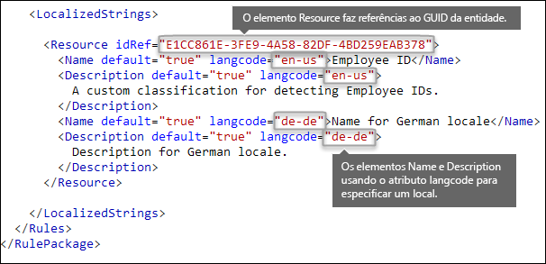

# <a name="create-a-custom-sensitive-information-type-using-powershell"></a><span data-ttu-id="e752f-103">Criar um tipo de informação confidencial personalizado usando o Windows PowerShell</span><span class="sxs-lookup"><span data-stu-id="e752f-103">Create a custom sensitive information type using PowerShell</span></span>

<span data-ttu-id="e752f-104">Este tópico mostra como usar o Windows PowerShell para criar um arquivo XML *pacote de regras* que define seus próprios [tipos de informações confidenciais](sensitive-information-type-entity-definitions.md)personalizados.</span><span class="sxs-lookup"><span data-stu-id="e752f-104">This topic shows you how to use PowerShell to create an XML *rule package* file that defines your own custom [sensitive information types](sensitive-information-type-entity-definitions.md).</span></span> <span data-ttu-id="e752f-105">Você precisa saber como criar uma expressão regular.</span><span class="sxs-lookup"><span data-stu-id="e752f-105">You need to know how to create a regular expression.</span></span> <span data-ttu-id="e752f-106">Como exemplo, este tópico cria um tipo personalizado de informações confidenciais que identifica uma ID de funcionário.</span><span class="sxs-lookup"><span data-stu-id="e752f-106">As an example, this topic creates a custom sensitive information type that identifies an employee ID.</span></span> <span data-ttu-id="e752f-107">Você pode usar esse XML de exemplo como ponto de partida para o seu próprio arquivo XML.</span><span class="sxs-lookup"><span data-stu-id="e752f-107">You can use this example XML as a starting point for your own XML file.</span></span> <span data-ttu-id="e752f-108">Se você for novo nos tipos de informações confidenciais, consulte [Saiba mais sobre os tipos de informações confidenciais](sensitive-information-type-learn-about.md).</span><span class="sxs-lookup"><span data-stu-id="e752f-108">If you are new to sensitive information types, see [Learn about sensitive information types](sensitive-information-type-learn-about.md).</span></span>

<span data-ttu-id="e752f-p102">Depois de criar um arquivo XML bem formado, você poderá carregá-lo no Microsoft 365 usando o PowerShell do Microsoft 365. Você estará pronto para usar seu tipo personalizado de informação confidencial nas suas políticas e testar se ele está detectando as informações confidenciais conforme o planejado.</span><span class="sxs-lookup"><span data-stu-id="e752f-p102">After you've created a well-formed XML file, you can upload it to Microsoft 365 by using Microsoft 365 PowerShell. Then you're ready to use your custom sensitive information type in your policies and test that it's detecting the sensitive information as you intended.</span></span>

> [!NOTE]
> <span data-ttu-id="e752f-111">Se você não precisa do controle refinado que o Windows PowerShell oferece, pode criar tipos de informações confidenciais personalizados no Centro de conformidade.</span><span class="sxs-lookup"><span data-stu-id="e752f-111">If you don't need the fine grained control that PowerShell provides, you can create custom sensitive information types in the Compliance center.</span></span> <span data-ttu-id="e752f-112">Para saber mais informações, consulte [Criar um tipo de informação confidencial personalizado](create-a-custom-sensitive-information-type.md).</span><span class="sxs-lookup"><span data-stu-id="e752f-112">For more information, see [Create a custom sensitive information type](create-a-custom-sensitive-information-type.md).</span></span>

## <a name="important-disclaimer"></a><span data-ttu-id="e752f-113">Aviso de isenção de responsabilidade importante</span><span class="sxs-lookup"><span data-stu-id="e752f-113">Important disclaimer</span></span>

<span data-ttu-id="e752f-p104"> Devido às variações nos ambientes do cliente e nos requisitos de correspondência de conteúdo, o Suporte da Microsoft não pode ajudar no fornecimento de definições de correspondência de conteúdo personalizado; por exemplo, definindo classificações personalizadas ou padrões de expressões regulares ("RegEx"). Para desenvolvimento, teste e depuração de correspondência de conteúdo personalizado, os clientes do Microsoft 365 devem contar com recursos de TI internos ou usar um recurso de consultoria externo, como os Serviços de Consultoria Microsoft (MCS). Os engenheiros de suporte podem fornecer suporte limitado para o recurso, mas não podem garantir que o desenvolvimento de correspondência de conteúdo personalizado atenda aos requisitos ou à conformidade do cliente. Como exemplo do tipo de auxílio disponível que pode ser fornecido, amostras de padrões de expressão regular podem ser fornecidos para fins de teste. OU então, o suporte pode auxiliar na resolução de problemas em um padrão RegEx existente, que não esteja sendo acionado como esperado, com um único exemplo de conteúdo específico.</span><span class="sxs-lookup"><span data-stu-id="e752f-p104">Due to the variances in customer environments and content match requirements, Microsoft Support cannot assist in providing custom content-matching definitions; e.g., defining custom classifications or regular expression (also known as RegEx) patterns. For custom content-matching development, testing, and debugging, Microsoft 365 customers will need to rely upon internal IT resources, or use an external consulting resource such as Microsoft Consulting Services (MCS). Support engineers can provide limited support for the feature, but cannot provide assurances that any custom content-matching development will fulfill the customer's requirements or obligations.  As an example of the type of support that can be provided, sample regular expression patterns may be provided for testing purposes. Or, support can assist with troubleshooting an existing RegEx pattern which is not triggering as expected with a single specific content example.</span></span>

<span data-ttu-id="e752f-119">Confira [Possíveis problemas de validação para se lembrar](#potential-validation-issues-to-be-aware-of) neste tópico.</span><span class="sxs-lookup"><span data-stu-id="e752f-119">See [Potential validation issues to be aware of](#potential-validation-issues-to-be-aware-of) in this topic.</span></span>

<span data-ttu-id="e752f-120">Para saber mais sobre o mecanismo de Boost.RegEx (conhecido anteriormente como RegEx + +) é usado para processar o texto, confira [Boost.Regex 5.1.3](https://www.boost.org/doc/libs/1_68_0/libs/regex/doc/html/).</span><span class="sxs-lookup"><span data-stu-id="e752f-120">For more information about the Boost.RegEx (formerly known as RegEx++) engine that's used for processing the text, see [Boost.Regex 5.1.3](https://www.boost.org/doc/libs/1_68_0/libs/regex/doc/html/).</span></span>

## <a name="sample-xml-of-a-rule-package"></a><span data-ttu-id="e752f-121">XML de exemplo de um pacote de regras</span><span class="sxs-lookup"><span data-stu-id="e752f-121">Sample XML of a rule package</span></span>

<span data-ttu-id="e752f-p105">Eis um XML de exemplo do pacote de regras que criaremos neste tópico. Os elementos e os atributos são explicados nas seções abaixo.</span><span class="sxs-lookup"><span data-stu-id="e752f-p105">Here's the sample XML of the rule package that we'll create in this topic. Elements and attributes are explained in the sections below.</span></span>
  
```xml
<?xml version="1.0" encoding="UTF-16"?>
<RulePackage xmlns="http://schemas.microsoft.com/office/2011/mce">
<RulePack id="DAD86A92-AB18-43BB-AB35-96F7C594ADAA">
    <Version build="0" major="1" minor="0" revision="0"/>
    <Publisher id="619DD8C3-7B80-4998-A312-4DF0402BAC04"/>
    <Details defaultLangCode="en-us">
        <LocalizedDetails langcode="en-us">
            <PublisherName>Contoso</PublisherName>
            <Name>Employee ID Custom Rule Pack</Name>
            <Description>
            This rule package contains the custom Employee ID entity.
            </Description>
        </LocalizedDetails>
    </Details>
</RulePack>
<Rules>
<!-- Employee ID -->
    <Entity id="E1CC861E-3FE9-4A58-82DF-4BD259EAB378" patternsProximity="300" recommendedConfidence="75">
        <Pattern confidenceLevel="65">
            <IdMatch idRef="Regex_employee_id"/>
        </Pattern>
        <Pattern confidenceLevel="75">
            <IdMatch idRef="Regex_employee_id"/>
            <Match idRef="Func_us_date"/>
        </Pattern>
        <Pattern confidenceLevel="85">
            <IdMatch idRef="Regex_employee_id"/>
            <Match idRef="Func_us_date"/>
            <Any minMatches="1">
                <Match idRef="Keyword_badge" minCount="2"/>
                <Match idRef="Keyword_employee"/>
            </Any>
            <Any minMatches="0" maxMatches="0">
                <Match idRef="Keyword_false_positives_local"/>
                <Match idRef="Keyword_false_positives_intl"/>
            </Any>
        </Pattern>
    </Entity>
    <Regex id="Regex_employee_id">(\s)(\d{9})(\s)</Regex>
    <Keyword id="Keyword_employee">
        <Group matchStyle="word">
            <Term>Identification</Term>
            <Term>Contoso Employee</Term>
        </Group>
    </Keyword>
    <Keyword id="Keyword_badge">
        <Group matchStyle="string">
            <Term>card</Term>
            <Term>badge</Term>
            <Term caseSensitive="true">ID</Term>
        </Group>
    </Keyword>
    <Keyword id="Keyword_false_positives_local">
        <Group matchStyle="word">
            <Term>credit card</Term>
            <Term>national ID</Term>
        </Group>
    </Keyword>
    <Keyword id="Keyword_false_positives_intl">
        <Group matchStyle="word">
            <Term>identity card</Term>
            <Term>national ID</Term>
            <Term>EU debit card</Term>
        </Group>
    </Keyword>
    <LocalizedStrings>
        <Resource idRef="E1CC861E-3FE9-4A58-82DF-4BD259EAB378">
            <Name default="true" langcode="en-us">Employee ID</Name>
            <Description default="true" langcode="en-us">
            A custom classification for detecting Employee IDs.
            </Description>
            <Description default="false" langcode="de-de">
            Description for German locale.
            </Description>
        </Resource>
    </LocalizedStrings>
</Rules>
</RulePackage>
```

## <a name="what-are-your-key-requirements-rule-entity-pattern-elements"></a><span data-ttu-id="e752f-p106">Quais são seus principais requisitos? [elementos Rule, Entity, Pattern]</span><span class="sxs-lookup"><span data-stu-id="e752f-p106">What are your key requirements? [Rule, Entity, Pattern elements]</span></span>

<span data-ttu-id="e752f-126">Antes de começar, é importante compreender a estrutura básica do esquema XML para uma regra e como você pode usar essa estrutura para definir seu tipo personalizado de informações confidenciais para que ele identifique o conteúdo certo.</span><span class="sxs-lookup"><span data-stu-id="e752f-126">Before you get started, it's helpful to understand the basic structure of the XML schema for a rule, and how you can use this structure to define your custom sensitive information type so that it will identify the right content.</span></span>
  
<span data-ttu-id="e752f-p107">Uma regra define uma ou mais entidades (tipos de informações confidenciais) e cada entidade define um ou mais padrões. Um padrão é o que a política procura ao avaliar conteúdo como emails e documentos.</span><span class="sxs-lookup"><span data-stu-id="e752f-p107">A rule defines one or more entities (sensitive information types), and each entity defines one or more patterns. A pattern is what a policy looks for when it evaluates content such as email and documents.</span></span>

<span data-ttu-id="e752f-p108">Neste tópico, a marcação XML usa uma regra para significar os padrões que definem uma entidade, também conhecido como um tipo de informação confidencial. Portanto, neste tópico, ao ver a regra, pense na entidade ou no tipo de informação confidencial, não nas condições e ações.</span><span class="sxs-lookup"><span data-stu-id="e752f-p108">In this topic, the XML markup uses rule to mean the patterns that define an entity, also known as a sensitive information type. So in this topic, when you see rule, think entity or sensitive information type, not conditions and actions.</span></span>
  
### <a name="simplest-scenario-entity-with-one-pattern"></a><span data-ttu-id="e752f-131">Cenário mais simples: entidade com um padrão</span><span class="sxs-lookup"><span data-stu-id="e752f-131">Simplest scenario: entity with one pattern</span></span>

<span data-ttu-id="e752f-p109">Aqui está o cenário mais simples. Você quer que sua política identifique conteúdo que inclua a ID de funcionário da sua organização, com o formato de um número de nove dígitos. Assim, o padrão faz referência a uma expressão regular contida na regra que identifica números de nove dígitos. Qualquer conteúdo que contiver um número de nove dígitos corresponderá a esse padrão.</span><span class="sxs-lookup"><span data-stu-id="e752f-p109">Here's the simplest scenario. You want your policy to identify content that contains your organization's employee ID, which is formatted as a nine-digit number. So the pattern refers to a regular expression contained in the rule that identifies nine-digit numbers. Any content containing a nine-digit number satisfies the pattern.</span></span>
  

  
<span data-ttu-id="e752f-137">No entanto, embora seja simples, esse padrão poderá identificar muitos falsos positivos combinando conteúdo que contém qualquer número de nove dígitos que não seja necessariamente uma ID de funcionário.</span><span class="sxs-lookup"><span data-stu-id="e752f-137">However, while simple, this pattern may identify many false positives by matching content that contains any nine-digit number that is not necessarily an employee ID.</span></span>
  
### <a name="more-common-scenario-entity-with-multiple-patterns"></a><span data-ttu-id="e752f-138">Cenário mais comum: entidade com vários padrões</span><span class="sxs-lookup"><span data-stu-id="e752f-138">More common scenario: entity with multiple patterns</span></span>

<span data-ttu-id="e752f-139">Por esse motivo, é mais comum definir uma entidade usando mais de um padrão, em que os padrões identificam evidências de suporte (como uma palavra-chave ou data) além da entidade (como um número de nove dígitos).</span><span class="sxs-lookup"><span data-stu-id="e752f-139">For this reason, it's more common to define an entity by using more than one pattern, where the patterns identify supporting evidence (such as a keyword or date) in addition to the entity (such as a nine-digit number).</span></span>
  
<span data-ttu-id="e752f-140">Por exemplo, para aumentar as chances de identificar o conteúdo com uma ID de funcionário, você poderá definir outro padrão que também identifica a data de contratação ou definir outro padrão que identifica a data de contratação e uma palavra-chave (como "ID do funcionário"), além do número de nove dígitos.</span><span class="sxs-lookup"><span data-stu-id="e752f-140">For example, to increase the likelihood of identifying content that contains an employee ID, you can define another pattern that also identifies a hire date, and define yet another pattern that identifies both a hire date and a keyword (such as "employee ID"), in addition to the nine-digit number.</span></span>
  

  
<span data-ttu-id="e752f-142">Observe alguns aspectos importantes dessa estrutura:</span><span class="sxs-lookup"><span data-stu-id="e752f-142">Note a couple of important aspects of this structure:</span></span>
  
- <span data-ttu-id="e752f-p110">Os padrões que exigem mais evidência têm maior nível de confiança. Isso é útil porque, quando você usar esse tipo de informação confidencial em uma política, poderá usar ações mais restritivas (como bloquear conteúdo) com apenas as correspondências de maior confiança e poderá usar ações menos restritivas (como enviar notificação) com correspondências de menor confiança.</span><span class="sxs-lookup"><span data-stu-id="e752f-p110">Patterns that require more evidence have a higher confidence level. This is useful because when you later use this sensitive information type in a policy, you can use more restrictive actions (such as block content) with only the higher-confidence matches, and you can use less restrictive actions (such as send notification) with the lower-confidence matches.</span></span>

- <span data-ttu-id="e752f-p111">Os elementos IdMatch e Match de suporte fazem referência a expressões regulares e palavras-chave que são na verdade filhas do elemento Rule, não o Pattern. Esses elementos de suporte são referenciados pelo Pattern, mas incluídos na Rule. Isso significa que uma única definição de um elemento de suporte, como uma expressão regular ou uma lista de palavras-chave, pode ser referenciada por várias entidades e padrões.</span><span class="sxs-lookup"><span data-stu-id="e752f-p111">The supporting IdMatch and Match elements reference regexes and keywords that are actually children of the Rule element, not the Pattern. These supporting elements are referenced by the Pattern but included in the Rule. This means that a single definition of a supporting element, like a regular expression or a keyword list, can be referenced by multiple entities and patterns.</span></span>

## <a name="what-entity-do-you-need-to-identify-entity-element-id-attribute"></a><span data-ttu-id="e752f-p112">De que entidade você precisa para identificar? [elemento Entity, atributo de id]</span><span class="sxs-lookup"><span data-stu-id="e752f-p112">What entity do you need to identify? [Entity element, id attribute]</span></span>

<span data-ttu-id="e752f-p113">Uma entidade é um tipo de informação confidencial, como um número de cartão de crédito, que tem um padrão bem definido. Cada entidade tem um GUID exclusivo como sua ID.</span><span class="sxs-lookup"><span data-stu-id="e752f-p113">An entity is a sensitive information type, such as a credit card number, that has a well-defined pattern. Each entity has a unique GUID as its ID.</span></span>
  
### <a name="name-the-entity-and-generate-its-guid"></a><span data-ttu-id="e752f-152">Nomear a entidade e gerar seu GUID</span><span class="sxs-lookup"><span data-stu-id="e752f-152">Name the entity and generate its GUID</span></span>

1. <span data-ttu-id="e752f-153">No editor XML de sua escolha, adicione os elementos Regras e Entidade.</span><span class="sxs-lookup"><span data-stu-id="e752f-153">In your XML editor of choice, add the Rules and Entity elements.</span></span>
2. <span data-ttu-id="e752f-p114">Adicione um comentário que contenha o nome da sua entidade personalizada - neste exemplo, ID do funcionário. Posteriormente, você adicionará o nome da entidade à seção de cadeias de caracteres localizadas, e esse nome é o que aparecerá na IU quando você criar uma política.</span><span class="sxs-lookup"><span data-stu-id="e752f-p114">Add a comment that contains the name of your custom entity — in this example, Employee ID. Later, you'll add the entity name to the localized strings section, and that name is what appears in the UI when you create a policy.</span></span>
3. <span data-ttu-id="e752f-156">Gere um GUID para sua entidade.</span><span class="sxs-lookup"><span data-stu-id="e752f-156">Generate a GUID for your entity.</span></span> <span data-ttu-id="e752f-157">Há várias maneiras de gerar GUIDs, mas você pode fazer isso facilmente no Windows PowerShell digitando **[guid]::NewGuid()**.</span><span class="sxs-lookup"><span data-stu-id="e752f-157">There are several ways to generate GUIDs, but you can do it easily in PowerShell by typing **[guid]::NewGuid()**.</span></span> <span data-ttu-id="e752f-158">Posteriormente, você também adicionará o GUID da entidade à seção de strings localizadas.</span><span class="sxs-lookup"><span data-stu-id="e752f-158">Later, you'll also add the entity GUID to the localized strings section.</span></span>
  

  
## <a name="what-pattern-do-you-want-to-match-pattern-element-idmatch-element-regex-element"></a><span data-ttu-id="e752f-p116">Que padrão você deseja corresponder? [elemento Pattern, elemento IdMatch, elemento Regex]</span><span class="sxs-lookup"><span data-stu-id="e752f-p116">What pattern do you want to match? [Pattern element, IdMatch element, Regex element]</span></span>

<span data-ttu-id="e752f-p117">O padrão contém a lista do que o tipo de informação confidencial está procurando. Isso pode incluir expressões regulares, palavras-chave e funções internas (que realizam tarefas como executar expressões regulares para localizar datas ou endereços). Os tipos de informações confidenciais podem ter vários padrões com confianças exclusivas.</span><span class="sxs-lookup"><span data-stu-id="e752f-p117">The pattern contains the list of what the sensitive information type is looking for. This can include regexes, keywords, and built-in functions (which perform tasks like running regexes to find dates or addresses). Sensitive information types can have multiple patterns with unique confidences.</span></span>
  
<span data-ttu-id="e752f-p118">O que todos os padrões abaixo têm em comum é que eles fazem referência à mesma expressão regular, que procura um número de nove dígitos (\d{9}) delimitado por espaço em branco (\s)... (\s). Essa expressão regular é referenciada pelo elemento IdMatch e é o requisito comum de todos os padrões que procuram a entidade ID do funcionário. IdMatch é o identificador que o padrão está tentando corresponder, como número de cartão de crédito ou ID do funcionário ou número da previdência social. Um elemento Pattern deve ter exatamente um elemento IdMatch.</span><span class="sxs-lookup"><span data-stu-id="e752f-p118">What all of the below patterns have in common is that they all reference the same regular expression, which looks for a nine-digit number (\d{9}) surrounded by white space (\s) … (\s). This regular expression is referenced by the IdMatch element and is the common requirement for all patterns that look for the Employee ID entity. IdMatch is the identifier that the pattern is to trying to match, such as Employee ID or credit card number or social security number. A Pattern element must have exactly one IdMatch element.</span></span>
  

  
<span data-ttu-id="e752f-p119">Quando satisfeito, um padrão retorna uma contagem e um nível de confiança que pode ser usado nas condições da sua política. Ao adicionar uma condição para detectar um tipo de informação confidencial a uma política, você pode editar a contagem e o nível de confiança como mostrado aqui. O nível de confiança (também chamado de precisão de correspondência) é explicado mais adiante neste tópico.</span><span class="sxs-lookup"><span data-stu-id="e752f-p119">When satisfied, a pattern returns a count and confidence level, which you can use in the conditions in your policy. When you add a condition for detecting a sensitive information type to a policy, you can edit the count and confidence level as shown here. Confidence level (also called match accuracy) is explained later in this topic.</span></span>
  

  
<span data-ttu-id="e752f-p120">Ao criar sua expressão regular, lembre-se de que há possíveis problemas a serem considerados. Por exemplo, se você escrever e carregar uma expressão regular que identifica conteúdo demais, isso poderá afetar o desempenho. Para saber mais sobre esses possíveis problemas, confira a seção posterior [Possíveis problemas de validação a serem considerados](#potential-validation-issues-to-be-aware-of).</span><span class="sxs-lookup"><span data-stu-id="e752f-p120">When you create your regular expression, keep in mind that there are potential issues to be aware of. For example, if you write and upload a regex that identifies too much content, this can impact performance. To learn more about these potential issues, see the later section [Potential validation issues to be aware of](#potential-validation-issues-to-be-aware-of).</span></span>
  
## <a name="do-you-want-to-require-additional-evidence-match-element-mincount-attribute"></a><span data-ttu-id="e752f-p121">Você deseja exigir evidências adicionais? [elemento Match, atributo minCount]</span><span class="sxs-lookup"><span data-stu-id="e752f-p121">Do you want to require additional evidence? [Match element, minCount attribute]</span></span>

<span data-ttu-id="e752f-180">Além de IdMatch, um padrão pode usar o elemento Match para exigir evidências adicionais, como uma palavra-chave, expressão regular, data ou endereço.</span><span class="sxs-lookup"><span data-stu-id="e752f-180">In addition to the IdMatch, a pattern can use the Match element to require additional supporting evidence, such as a keyword, regex, date, or address.</span></span>
  
<span data-ttu-id="e752f-p122">Um padrão pode incluir vários elementos Match; eles podem ser incluídos diretamente no elemento Pattern ou combinados usando o elemento Any. Os elementos Match são unidos por um operador AND implícito; todos os elementos Match devem ser satisfeitos para que o padrão seja correspondido. Você pode usar o elemento Any para introduzir os operadores AND ou OR (veja mais sobre isso em uma seção posterior).</span><span class="sxs-lookup"><span data-stu-id="e752f-p122">A Pattern can include multiple Match elements; they can be included directly in the Pattern element or combined by using the Any element. Match elements are joined by an implicit AND operator; all Match elements must be satisfied for the pattern to be matched. You can use the Any element to introduce AND or OR operators (more on that in a later section).</span></span>
  
<span data-ttu-id="e752f-p123">Você pode usar o atributo opcional minCount para especificar quantas instâncias de uma correspondência precisam ser encontradas para cada um dos elementos Match. Por exemplo, você pode especificar que um padrão apenas será satisfeito quando pelo menos duas palavras-chave de uma lista de palavra-chave forem encontradas.</span><span class="sxs-lookup"><span data-stu-id="e752f-p123">You can use the optional minCount attribute to specify how many instances of a match need to be found for each of the Match elements. For example, you can specify that a pattern is satisfied only when at least two keywords from a keyword list are found.</span></span>
  

  
### <a name="keywords-keyword-group-and-term-elements-matchstyle-and-casesensitive-attributes"></a><span data-ttu-id="e752f-187">Palavras-chave [elementos Keyword, Group e Term, atributos matchStyle e caseSensitive]</span><span class="sxs-lookup"><span data-stu-id="e752f-187">Keywords [Keyword, Group, and Term elements, matchStyle and caseSensitive attributes]</span></span>

<span data-ttu-id="e752f-p124">Quando você identifica informações confidenciais, como a ID de um funcionário, geralmente deseja exigir palavras-chave como evidência corroborativa. Por exemplo, além de corresponder a um número de nove dígitos, você pode procurar palavras como "cartão", "crachá" ou "ID". Para fazer isso, você usa o elemento Keyword. O elemento Keyword tem um atributo ID que pode ser referenciado por vários elementos Match em vários padrões ou entidades.</span><span class="sxs-lookup"><span data-stu-id="e752f-p124">When you identify sensitive information, like an employee ID, you often want to require keywords as corroborative evidence. For example, in addition to matching a nine-digit number, you may want to look for words like "card", "badge", or "ID". To do this, you use the Keyword element. The Keyword element has an ID attribute that can be referenced by multiple Match elements in multiple patterns or entities.</span></span>
  
<span data-ttu-id="e752f-p125">Palavras-chave são incluídas como uma lista de elementos Term em um elemento Group. O elemento Group tem um atributo matchStyle com dois valores possíveis:</span><span class="sxs-lookup"><span data-stu-id="e752f-p125">Keywords are included as a list of Term elements in a Group element. The Group element has a matchStyle attribute with two possible values:</span></span>
  
- <span data-ttu-id="e752f-p126">**matchStyle="word"** A correspondência por palavra identifica palavras inteiras delimitadas por espaços em branco ou outros delimitadores. Você sempre deve usar palavra, a menos que precise corresponder partes de palavras ou corresponder palavras em idiomas asiáticos.</span><span class="sxs-lookup"><span data-stu-id="e752f-p126">**matchStyle="word"** Word match identifies whole words surrounded by white space or other delimiters. You should always use word unless you need to match parts of words or match words in Asian languages.</span></span> 
    
- <span data-ttu-id="e752f-p127">**matchStyle="string"** A correspondência por cadeia de caracteres identifica cadeias de caracteres independentemente do que está em volta. Por exemplo, "id" terá correspondência com "cidade" e "ideia". Use cadeia de caracteres somente quando precisar corresponder palavras asiáticas ou se a palavra-chave puder ser incluída como parte de outras cadeias de caracteres.</span><span class="sxs-lookup"><span data-stu-id="e752f-p127">**matchStyle="string"** String match identifies strings no matter what they're surrounded by. For example, "id" will match "bid" and "idea". Use string only when you need to match Asian words or if your keyword may be included as part of other strings.</span></span> 
    
<span data-ttu-id="e752f-199">Por fim, você pode usar o atributo caseSensitive do elemento Term para especificar que o conteúdo deve corresponder à palavra-chave exatamente, incluindo letras minúsculas e maiúsculas.</span><span class="sxs-lookup"><span data-stu-id="e752f-199">Finally, you can use the caseSensitive attribute of the Term element to specify that the content must match the keyword exactly, including lower- and upper-case letters.</span></span>
  

  
### <a name="regular-expressions-regex-element"></a><span data-ttu-id="e752f-201">Expressões regulares [elemento Regex]</span><span class="sxs-lookup"><span data-stu-id="e752f-201">Regular expressions [Regex element]</span></span>

<span data-ttu-id="e752f-p128">Neste exemplo, a entidade de ID do funcionário já usa o elemento IdMatch para fazer referência a uma regex para o padrão - um número de nove dígitos cercado por um espaço em branco. Além disso, um padrão pode usar um elemento Match para fazer referência a um elemento Regex adicional para identificar evidências corroborativas, como um número de cinco ou nove dígitos no formato de um código postal dos EUA.</span><span class="sxs-lookup"><span data-stu-id="e752f-p128">In this example, the employee ID entity already uses the IdMatch element to reference a regex for the pattern — a nine-digit number surrounded by whitespace. In addition, a pattern can use a Match element to reference an additional Regex element to identify corroborative evidence, such as a five- or nine-digit number in the format of a US zip code.</span></span>
  
### <a name="additional-patterns-such-as-dates-or-addresses-built-in-functions"></a><span data-ttu-id="e752f-204">Padrões adicionais, como datas ou endereços [funções internas]</span><span class="sxs-lookup"><span data-stu-id="e752f-204">Additional patterns such as dates or addresses [built-in functions]</span></span>

<span data-ttu-id="e752f-p129">Além dos tipos de informações confidenciais internos, os tipos de informações confidenciais também podem usar funções internas que podem identificar evidências corroborativas, como data dos EUA, data da UE, data de expiração ou endereço nos EUA. O Microsoft 365 não oferece suporte ao carregamento de suas próprias funções personalizadas, mas quando você cria um tipo de informação confidencial personalizado, sua entidade pode fazer referência às funções internas.</span><span class="sxs-lookup"><span data-stu-id="e752f-p129">In addition to the built-in sensitive information types, sensitive information types can also use built-in functions that can identify corroborative evidence such as a US date, EU date, expiration date, or US address. Microsoft 365 does not support uploading your own custom functions, but when you create a custom sensitive information type, your entity can reference the built-in functions.</span></span>
  
<span data-ttu-id="e752f-207">Por exemplo, um crachá de ID do funcionário tem uma data de contratação; portanto, essa entidade personalizada pode usar a função interna `Func_us_date` para identificar uma data no formato comumente utilizado nos EUA.</span><span class="sxs-lookup"><span data-stu-id="e752f-207">For example, an employee ID badge has a hire date on it, so this custom entity can use the built-in function  `Func_us_date` to identify a date in the format commonly used in the US.</span></span> 
  
<span data-ttu-id="e752f-208">Para saber mais, confira [O que as funções DLP procuram](what-the-dlp-functions-look-for.md).</span><span class="sxs-lookup"><span data-stu-id="e752f-208">For more information, see [What the DLP functions look for](what-the-dlp-functions-look-for.md).</span></span>
  

  
## <a name="different-combinations-of-evidence-any-element-minmatches-and-maxmatches-attributes"></a><span data-ttu-id="e752f-210">Diferentes combinações de evidências [elemento Any, atributos minMatches e maxMatches]</span><span class="sxs-lookup"><span data-stu-id="e752f-210">Different combinations of evidence [Any element, minMatches and maxMatches attributes]</span></span>

<span data-ttu-id="e752f-p130">Em um elemento Pattern, todos os elementos IdMatch e Match são unidos por um operador AND implícito - todas as correspondências devem ser satisfeitas antes que o padrão possa ser satisfeito. No entanto, você pode criar uma lógica de correspondência mais flexível usando o elemento Any para agrupar elementos Match. Por exemplo, você pode usar o elemento Any para corresponder a todos, nenhum ou um subconjunto exato de seus elementos filhos Match.</span><span class="sxs-lookup"><span data-stu-id="e752f-p130">In a Pattern element, all IdMatch and Match elements are joined by an implicit AND operator — all of the matches must be satisfied before the pattern can be satisfied. However, you can create more flexible matching logic by using the Any element to group Match elements. For example, you can use the Any element to match all, none, or an exact subset of its children Match elements.</span></span>
  
<span data-ttu-id="e752f-p131">O elemento Any tem atributos opcionais minMatches e maxMatches que você pode usar para definir quantos elementos Match filhos devem ser satisfeitos para que esse padrão seja correspondido. Observe que esses atributos definem o número de elementos Match que devem ser satisfeitos, e não o número de instâncias de evidências encontradas para as correspondências. Para definir um número mínimo de instâncias para uma correspondência específica, como duas palavras-chave de uma lista, use o atributo minCount para um elemento Match (veja acima).</span><span class="sxs-lookup"><span data-stu-id="e752f-p131">The Any element has optional minMatches and maxMatches attributes that you can use to define how many of the children Match elements must be satisfied before the pattern is matched. Note that these attributes define the number of Match elements that must be satisfied, not the number of instances of evidence found for the matches. To define a minimum number of instances for a specific match, such as two keywords from a list, use the minCount attribute for a Match element (see above).</span></span>
  
### <a name="match-at-least-one-child-match-element"></a><span data-ttu-id="e752f-217">Corresponder pelo menos um elemento Match filho</span><span class="sxs-lookup"><span data-stu-id="e752f-217">Match at least one child Match element</span></span>

<span data-ttu-id="e752f-p132">Se você quiser exigir que apenas um número mínimo de elementos Match seja atendido, use o atributo minMatches. De fato, esses elementos Match são unidos por um operador OR implícito. Esse elemento Any será satisfeito se uma data no formato dos EUA ou uma palavra-chave de ambas as listas for encontrada.</span><span class="sxs-lookup"><span data-stu-id="e752f-p132">If you want to require that only a minimum number of Match elements must be met, you can use the minMatches attribute. In effect, these Match elements are joined by an implicit OR operator. This Any element is satisfied if a US-formatted date or a keyword from either list is found.</span></span>

```xml
<Any minMatches="1" >
     <Match idRef="Func_us_date" />
     <Match idRef="Keyword_employee" />
     <Match idRef="Keyword_badge" />
</Any>
```
    
### <a name="match-an-exact-subset-of-any-children-match-elements"></a><span data-ttu-id="e752f-221">Corresponder um subconjunto exato dos elementos filhos de Match</span><span class="sxs-lookup"><span data-stu-id="e752f-221">Match an exact subset of any children Match elements</span></span>

<span data-ttu-id="e752f-p133">Se você quiser exigir que um número exato de elementos Match seja atendido, você pode definir minMatches e maxMatches com o mesmo valor. Este elemento Qualquer é satisfeito apenas se exatamente uma data ou palavra-chave for encontrada - mais do que isso, e o padrão não será correspondido.</span><span class="sxs-lookup"><span data-stu-id="e752f-p133">If you want to require that an exact number of Match elements must be met, you can set minMatches and maxMatches to the same value. This Any element is satisfied only if exactly one date or keyword is found — any more than that, and the pattern won't be matched.</span></span>

```xml
<Any minMatches="1" maxMatches="1" >
     <Match idRef="Func_us_date" />
     <Match idRef="Keyword_employee" />
     <Match idRef="Keyword_badge" />
</Any>
```
  
### <a name="match-none-of-children-match-elements"></a><span data-ttu-id="e752f-224">Corresponder nenhum dos elementos filhos de Match</span><span class="sxs-lookup"><span data-stu-id="e752f-224">Match none of children Match elements</span></span>

<span data-ttu-id="e752f-p134">Se você quiser exigir a ausência de evidências específicas para que um padrão seja satisfeito, defina minMatches e maxMatches como 0. Isso poderá ser útil se você tiver uma lista de palavra-chave ou outras evidências com grandes chances de indicarem um falso positivo.</span><span class="sxs-lookup"><span data-stu-id="e752f-p134">If you want to require the absence of specific evidence for a pattern to be satisfied, you can set both minMatches and maxMatches to 0. This can be useful if you have a keyword list or other evidence that are likely to indicate a false positive.</span></span>
  
<span data-ttu-id="e752f-p135">Por exemplo, a entidade ID do funcionário procura a palavra-chave "cartão" porque ela pode fazer referência a um "cartão de ID". No entanto, se o cartão aparecer apenas na frase "cartão de crédito", "cartão" neste conteúdo é improvável que signifique um "cartão de ID". Portanto, você pode adicionar "cartão de crédito" como uma palavra-chave a uma lista de termos que você deseja excluir na hora de satisfazer o padrão.</span><span class="sxs-lookup"><span data-stu-id="e752f-p135">For example, the employee ID entity looks for the keyword "card" because it might refer to an "ID card". However, if card appears only in the phrase "credit card", "card" in this content is unlikely to mean "ID card". So you can add "credit card" as a keyword to a list of terms that you want to exclude from satisfying the pattern.</span></span>
  
```xml
<Any minMatches="0" maxMatches="0" >
    <Match idRef="Keyword_false_positives_local" />
    <Match idRef="Keyword_false_positives_intl" />
</Any>
```

### <a name="match-a-number-of-unique-terms"></a><span data-ttu-id="e752f-230">Corresponder a um número de termos exclusivos</span><span class="sxs-lookup"><span data-stu-id="e752f-230">Match a number of unique terms</span></span>

<span data-ttu-id="e752f-231">Se você quiser corresponder vários termos exclusivos, use o parâmetro *uniqueResults*, definido como *true*, conforme mostrado no exemplo a seguir:</span><span class="sxs-lookup"><span data-stu-id="e752f-231">If you want to match a number of unique terms, use the *uniqueResults* parameter, set to *true*, as shown in the following example:</span></span>

```xml
<Pattern confidenceLevel="75">
    <IdMatch idRef="Salary_Revision_terms" />
    <Match idRef=" Salary_Revision_ID " minCount="3" uniqueResults="true" />
</Pattern>
```

<span data-ttu-id="e752f-232">Neste exemplo, um padrão é definido para revisão salarial usando pelo menos três correspondências exclusivas.</span><span class="sxs-lookup"><span data-stu-id="e752f-232">In this example, a pattern is defined for salary revision using at least three unique matches.</span></span> 
  
## <a name="how-close-to-the-entity-must-the-other-evidence-be-patternsproximity-attribute"></a><span data-ttu-id="e752f-p136">Qual a proximidade das outras evidências com a entidade? [atributo patternsProximity]</span><span class="sxs-lookup"><span data-stu-id="e752f-p136">How close to the entity must the other evidence be? [patternsProximity attribute]</span></span>

<span data-ttu-id="e752f-p137">O seu tipo de informação confidencial está procurando um padrão que represente uma ID de funcionário e, como parte desse padrão, ele também está à procura de evidências comprobatórias, como uma palavra-chave como "ID". Faz sentido que, quanto mais próxima essa evidência estiver, mais provavelmente o padrão será uma ID de funcionário real. Você pode determinar a proximidade outras evidências do padrão com a entidade usando o atributo necessário patternsProximity do elemento Entity.</span><span class="sxs-lookup"><span data-stu-id="e752f-p137">Your sensitive information type is looking for a pattern that represents an employee ID, and as part of that pattern it's also looking for corroborative evidence like a keyword such as "ID". It makes sense that the closer together this evidence is, the more likely the pattern is to be an actual employee ID. You can determine how close other evidence in the pattern must be to the entity by using the required patternsProximity attribute of the Entity element.</span></span>
  

  
<span data-ttu-id="e752f-p138">Para cada padrão na entidade, o valor do atributo patternsProximity define a distância (em caracteres Unicode) do local de IdMatch para todas as outras correspondências especificadas para esse padrão. A janela de proximidade é ancorada pela localização de IdMatch e se estende à esquerda e à direita de IdMatch.</span><span class="sxs-lookup"><span data-stu-id="e752f-p138">For each pattern in the entity, the patternsProximity attribute value defines the distance (in Unicode characters) from the IdMatch location for all other Matches specified for that Pattern. The proximity window is anchored by the IdMatch location, with the window extending to the left and right of the IdMatch.</span></span>
  

  
<span data-ttu-id="e752f-p139">O exemplo abaixo ilustra como a janela de proximidade afeta a correspondência de padrões em que o elemento IdMatch para a entidade personalizada ID do funcionário exige pelo menos uma correspondência comprobatória da palavra-chave ou data. Apenas ID1 tem correspondência porque, para ID2 e ID3, nenhuma ou apenas evidência comprobatória parcial foi localizada dentro da janela de proximidade.</span><span class="sxs-lookup"><span data-stu-id="e752f-p139">The example below illustrates how the proximity window affects the pattern matching where IdMatch element for the employee ID custom entity requires at least one corroborating match of keyword or date. Only ID1 matches because for ID2 and ID3, either no or only partial corroborating evidence is found within the proximity window.</span></span>
  

  
<span data-ttu-id="e752f-p140">Observe que, para email, o corpo da mensagem e cada anexo são tratados como itens separados. Isso significa que a janela de proximidade não se estende para além do final de cada um desses itens. Para cada item (anexo ou corpo), o idMatch e as evidências comprobatórias precisam residir nesse item.</span><span class="sxs-lookup"><span data-stu-id="e752f-p140">Note that for email, the message body and each attachment are treated as separate items. This means that the proximity window does not extend beyond the end of each of these items. For each item (attachment or body), both the idMatch and corroborative evidence needs to reside in that item.</span></span>
  
## <a name="what-are-the-right-confidence-levels-for-different-patterns-confidencelevel-attribute-recommendedconfidence-attribute"></a><span data-ttu-id="e752f-p141">Quais são os níveis de confiança certos para diferentes padrões? [atributo confidenceLevel, atributo recommendedConfidence]</span><span class="sxs-lookup"><span data-stu-id="e752f-p141">What are the right confidence levels for different patterns? [confidenceLevel attribute, recommendedConfidence attribute]</span></span>

<span data-ttu-id="e752f-p142">Quanto mais evidências um padrão exigir, mais confiança você terá que uma entidade real (como ID do funcionário) será identificada quando esse padrão for correspondido. Por exemplo, você tem mais confiança em um padrão que exige um número de ID de nove dígitos, uma data de contratação e palavras-chave com proximidade imediata do que em um padrão que exige apenas um número de ID de nove dígitos.</span><span class="sxs-lookup"><span data-stu-id="e752f-p142">The more evidence that a pattern requires, the more confidence you have that an actual entity (such as employee ID) has been identified when the pattern is matched. For example, you have more confidence in a pattern that requires a nine-digit ID number, hire date, and keyword in close proximity, than you do in a pattern that requires only a nine-digit ID number.</span></span>
  
<span data-ttu-id="e752f-p143">O elemento Pattern tem um atributo confidenceLevel obrigatório. Você pode pensar no valor de confidenceLevel (um inteiro entre 1 e 100) como uma ID exclusiva para cada padrão em uma entidade - os padrões em uma entidade devem ter níveis de confiança diferentes que você atribui. O valor preciso do inteiro não importa, basta escolher números que façam sentido para sua equipe de conformidade. Depois de carregar seu tipo de informação confidencial personalizado e criar uma política, você poderá fazer referência a esses níveis de confiança nas condições das regras que você criar.</span><span class="sxs-lookup"><span data-stu-id="e752f-p143">The Pattern element has a required confidenceLevel attribute. You can think of the value of confidenceLevel (an integer between 1 and 100) as a unique ID for each pattern in an entity — the patterns in an entity must have different confidence levels that you assign. The precise value of the integer doesn't matter — simply pick numbers that make sense to your compliance team. After you upload your custom sensitive information type and then create a policy, you can reference these confidence levels in the conditions of the rules that you create.</span></span>
  

  
<span data-ttu-id="e752f-257">Além do atributo confidenceLevel para cada Padrão, a Entidade tem um atributo recommendedConfidence.</span><span class="sxs-lookup"><span data-stu-id="e752f-257">In addition to confidenceLevel for each Pattern, the Entity has a recommendedConfidence attribute.</span></span> <span data-ttu-id="e752f-258">O atributo recommendedConfidence pode ser visto como o nível de confiança padrão para a regra.</span><span class="sxs-lookup"><span data-stu-id="e752f-258">The recommended confidence attribute can be thought of as the default confidence level for the rule.</span></span> <span data-ttu-id="e752f-259">Quando criar uma regra em uma política, se você não especificar um nível de confiança para a regra a ser usada, essa regra corresponderá com base no nível de confiança recomendado para a entidade.</span><span class="sxs-lookup"><span data-stu-id="e752f-259">When you create a rule in a policy, if you don't specify a confidence level for the rule to use, that rule will match based on the recommended confidence level for the entity.</span></span> <span data-ttu-id="e752f-260">Observe que o atributo recommendedConfidence é obrigatório para cada ID de entidade no pacote de regras, se não houver, não será possível salvar políticas que usem o tipo de informações confidenciais.</span><span class="sxs-lookup"><span data-stu-id="e752f-260">Please note that the recommendedConfidence attribute is mandatory for each Entity ID in the Rule Package, if missing you won't be able to save policies that use the Sensitive Information Type.</span></span> 
  
## <a name="do-you-want-to-support-other-languages-in-the-ui-of-the-compliance-center-localizedstrings-element"></a><span data-ttu-id="e752f-p145">Deseja oferecer suporte a outros idiomas na interface do usuário do Centro de conformidade? [elemento LocalizedStrings]</span><span class="sxs-lookup"><span data-stu-id="e752f-p145">Do you want to support other languages in the UI of the Compliance center? [LocalizedStrings element]</span></span>

<span data-ttu-id="e752f-p146">Se a sua equipe de conformidade usa o Centro de conformidade do Microsoft 365 para criar políticas em localidades e idiomas diferentes, você poderá fornecer versões localizadas do nome e da descrição do seu tipo de informação confidencial personalizado. Quando a equipe de conformidade usa o Microsoft 365 em um idioma compatível, eles verão o nome localizado na interface do usuário.</span><span class="sxs-lookup"><span data-stu-id="e752f-p146">If your compliance team uses the Microsoft 365 Compliance center to create polices policies in different locales and in different languages, you can provide localized versions of the name and description of your custom sensitive information type. When your compliance team uses Microsoft 365 in a language that you support, they'll see the localized name in the UI.</span></span>
  

  
<span data-ttu-id="e752f-p147">O elemento Rules deve conter um elemento LocalizedStrings, que contém um elemento Resource que faz referência à GUID da sua entidade personalizada. Por sua vez, cada elemento Resource contém um ou mais elementos Name e Description, cada um utilizando o atributo langcode para fornecer uma cadeia de caracteres localizada para um idioma específico.</span><span class="sxs-lookup"><span data-stu-id="e752f-p147">The Rules element must contain a LocalizedStrings element, which contains a Resource element that references the GUID of your custom entity. In turn, each Resource element contains one or more Name and Description elements that each use the langcode attribute to provide a localized string for a specific language.</span></span>
  

  
<span data-ttu-id="e752f-p148">Observe que você utiliza cadeias de caracteres localizadas apenas para o modo como o seu tipo de informação confidencial personalizado é exibido na interface de usuário do Centro de conformidade. Não é possível usar cadeias de caracteres localizadas para fornecer diferentes versões localizadas de uma lista de palavra-chave ou expressão regular.</span><span class="sxs-lookup"><span data-stu-id="e752f-p148">Note that you use localized strings only for how your custom sensitive information type appears in the UI of the Compliance center. You can't use localized strings to provide different localized versions of a keyword list or regular expression.</span></span>
  
## <a name="other-rule-package-markup-rulepack-guid"></a><span data-ttu-id="e752f-271">Outra marcação de pacote de regras [GUID RulePack]</span><span class="sxs-lookup"><span data-stu-id="e752f-271">Other rule package markup [RulePack GUID]</span></span>

<span data-ttu-id="e752f-p149">Por fim, o início de cada RulePackage contém algumas informações gerais que você precisa preencher. Use a marcação a seguir como um modelo e substitua os espaços reservados "..." pelas suas próprias informações.</span><span class="sxs-lookup"><span data-stu-id="e752f-p149">Finally, the beginning of each RulePackage contains some general information that you need to fill in. You can use the following markup as a template and replace the ". . ." placeholders with your own info.</span></span>
  
<span data-ttu-id="e752f-p150">O mais importante: você precisará gerar um GUID para o RulePack. Acima, você gerou um GUID para a entidade; este é um segundo GUID para o RulePack. Há várias maneiras de gerar GUIDs, mas você pode fazer isso facilmente no PowerShell digitando [guid]::NewGuid().</span><span class="sxs-lookup"><span data-stu-id="e752f-p150">Most importantly, you'll need to generate a GUID for the RulePack. Above, you generated a GUID for the entity; this is a second GUID for the RulePack. There are several ways to generate GUIDs, but you can do it easily in PowerShell by typing [guid]::NewGuid().</span></span>
  
<span data-ttu-id="e752f-p151">O elemento Version também é importante. Ao carregar seu pacote de regras pela primeira vez, o Microsoft 365 anotará o número da versão. Mais tarde, se você atualizar o pacote de regras e carregar uma nova versão, verifique se atualizou o número da versão ou o Microsoft 365 não implantará o pacote de regras.</span><span class="sxs-lookup"><span data-stu-id="e752f-p151">The Version element is also important. When you upload your rule package for the first time, Microsoft 365 notes the version number. Later, if you update the rule package and upload a new version, make sure to update the version number or Microsoft 365 won't deploy the rule package.</span></span>
  
```xml
<?xml version="1.0" encoding="utf-16"?>
<RulePackage xmlns="http://schemas.microsoft.com/office/2011/mce">
  <RulePack id=". . .">
    <Version major="1" minor="0" build="0" revision="0" />
    <Publisher id=". . ." /> 
    <Details defaultLangCode=". . .">
      <LocalizedDetails langcode=" . . . ">
         <PublisherName>. . .</PublisherName>
         <Name>. . .</Name>
         <Description>. . .</Description>
      </LocalizedDetails>
    </Details>
  </RulePack>
  
 <Rules>
    . . .
 </Rules>
</RulePackage>

```

<span data-ttu-id="e752f-283">Ao concluir, seu elemento RulePack deve ter esta aparência.</span><span class="sxs-lookup"><span data-stu-id="e752f-283">When complete, your RulePack element should look like this.</span></span>
  

  
## <a name="changes-for-exchange-online"></a><span data-ttu-id="e752f-285">Mudanças para o Exchange Online</span><span class="sxs-lookup"><span data-stu-id="e752f-285">Changes for Exchange Online</span></span>

<span data-ttu-id="e752f-p152">Anteriormente, você podia usar o PowerShell do Exchange Online para importar seus tipos de informações confidenciais personalizados para a DLP. Agora, os tipos de informações confidenciais personalizados podem ser usados ​​no Centro de administração do Exchange e no Centro de conformidade. Como parte dessa melhoria, você deve usar o PowerShell do Centro de conformidade para importar seus tipos de informações confidenciais personalizados - você não pode mais importá-los do PowerShell do Exchange. Seus tipos de informações confidenciais personalizados continuarão a funcionar como antes; no entanto, pode levar até uma hora para que as alterações feitas nos tipos de informações confidenciais personalizados no Centro de conformidade apareçam no Centro de administração do Exchange.</span><span class="sxs-lookup"><span data-stu-id="e752f-p152">Previously, you might have used Exchange Online PowerShell to import your custom sensitive information types for DLP. Now your custom sensitive information types can be used in both the Exchange admin center and the Compliance center. As part of this improvement, you should use Compliance center PowerShell to import your custom sensitive information types — you can't import them from the Exchange PowerShell anymore. Your custom sensitive information types will continue to work just like before; however, it may take up to one hour for changes made to custom sensitive information types in the Compliance center to appear in the Exchange admin center.</span></span>
  
<span data-ttu-id="e752f-290">Observe que, no Centro de conformidade, você usa o **[cmdlet New-DlpSensitiveInformationTypeRulePackage](/powershell/module/exchange/new-dlpsensitiveinformationtyperulepackage)** para carregar um pacote de regras.</span><span class="sxs-lookup"><span data-stu-id="e752f-290">Note that in the Compliance center, you use the **[New-DlpSensitiveInformationTypeRulePackage](/powershell/module/exchange/new-dlpsensitiveinformationtyperulepackage)** cmdlet to upload a rule package.</span></span> <span data-ttu-id="e752f-291">(Anteriormente, no Centro de administração do Exchange, você usava o cmdlet **ClassificationRuleCollection \`**.)</span><span class="sxs-lookup"><span data-stu-id="e752f-291">(Previously, in the Exchange admin center, you used the  **ClassificationRuleCollection**\` cmdlet.)</span></span> 
  
## <a name="upload-your-rule-package"></a><span data-ttu-id="e752f-292">Carregar o pacote de regras</span><span class="sxs-lookup"><span data-stu-id="e752f-292">Upload your rule package</span></span>


<span data-ttu-id="e752f-293">Para carregar o pacote de regras, siga as etapas:</span><span class="sxs-lookup"><span data-stu-id="e752f-293">To upload your rule package, do the following steps:</span></span>
  
1. <span data-ttu-id="e752f-294">Salve-o como um arquivo .xml com codificação Unicode.</span><span class="sxs-lookup"><span data-stu-id="e752f-294">Save it as an .xml file with Unicode encoding.</span></span>
    
2. [<span data-ttu-id="e752f-295">Conecte-se ao centro de conformidade Windows PowerShell</span><span class="sxs-lookup"><span data-stu-id="e752f-295">Connect to Compliance center PowerShell</span></span>](/powershell/exchange/exchange-online-powershell)
    
3. <span data-ttu-id="e752f-296">Use a seguinte sintaxe:</span><span class="sxs-lookup"><span data-stu-id="e752f-296">Use the following syntax:</span></span>

   ```powershell
   New-DlpSensitiveInformationTypeRulePackage -FileData (Get-Content -Path "PathToUnicodeXMLFile" -Encoding Byte -ReadCount 0)
   ```

   <span data-ttu-id="e752f-297">Este exemplo carrega o arquivo XML Unicode chamado MyNewRulePack.xml de C:\Meus documentos.</span><span class="sxs-lookup"><span data-stu-id="e752f-297">This example uploads the Unicode XML file named MyNewRulePack.xml from C:\My Documents.</span></span>

   ```powershell
   New-DlpSensitiveInformationTypeRulePackage -FileData (Get-Content -Path "C:\My Documents\MyNewRulePack.xml" -Encoding Byte -ReadCount 0)
   ```

   <span data-ttu-id="e752f-298">Para informações detalhadas de sintaxe e parâmetros, confira [New-DlpSensitiveInformationTypeRulePackage](/powershell/module/exchange/new-dlpsensitiveinformationtyperulepackage).</span><span class="sxs-lookup"><span data-stu-id="e752f-298">For detailed syntax and parameter information, see [New-DlpSensitiveInformationTypeRulePackage](/powershell/module/exchange/new-dlpsensitiveinformationtyperulepackage).</span></span>

   > [!NOTE]
   > <span data-ttu-id="e752f-299">O número máximo de pacotes de regras com suporte é 10, mas cada pacote pode conter a definição de vários tipos de informações confidenciais.</span><span class="sxs-lookup"><span data-stu-id="e752f-299">The maximum number of rule packages supported is 10, but each package can contain the definition of multiple sensitive information types.</span></span>

4. <span data-ttu-id="e752f-300">Para confirmar que você criou um novo tipo de informação confidencial com êxito, execute uma destas etapas:</span><span class="sxs-lookup"><span data-stu-id="e752f-300">To verify that you've successfully created a new sensitive information type, do any of the following steps:</span></span>

   - <span data-ttu-id="e752f-301">Execute o cmdlet [Get-DlpSensitiveInformationTypeRulePackage](/powershell/module/exchange/get-dlpsensitiveinformationtyperulepackage) para verificar se o novo pacote de regras está listado:</span><span class="sxs-lookup"><span data-stu-id="e752f-301">Run the [Get-DlpSensitiveInformationTypeRulePackage](/powershell/module/exchange/get-dlpsensitiveinformationtyperulepackage) cmdlet to verify the new rule package is listed:</span></span>

     ```powershell
     Get-DlpSensitiveInformationTypeRulePackage
     ``` 

   - <span data-ttu-id="e752f-302">Execute o cmdlet [Get-DlpSensitiveInformationType](/powershell/module/exchange/get-dlpsensitiveinformationtype) para verificar se o tipo de informação confidencial está listado:</span><span class="sxs-lookup"><span data-stu-id="e752f-302">Run the [Get-DlpSensitiveInformationType](/powershell/module/exchange/get-dlpsensitiveinformationtype) cmdlet to verify the sensitive information type is listed:</span></span>

     ```powershell
     Get-DlpSensitiveInformationType
     ``` 

     <span data-ttu-id="e752f-303">Para tipos personalizados de informação confidencial, o valor da propriedade Publisher será diferente do Microsoft Corporation.</span><span class="sxs-lookup"><span data-stu-id="e752f-303">For custom sensitive information types, the Publisher property value will be something other than Microsoft Corporation.</span></span>

   - <span data-ttu-id="e752f-304">Substitua \<Name\>com o valor Name do tipo de informação sensível (exemplo: ID do Funcionário) e execute o cmdlet [Get-DlpSensitiveInformationType](/powershell/module/exchange/get-dlpsensitiveinformationtype):</span><span class="sxs-lookup"><span data-stu-id="e752f-304">Replace \<Name\> with the Name value of the sensitive information type (example: Employee ID) and run the [Get-DlpSensitiveInformationType](/powershell/module/exchange/get-dlpsensitiveinformationtype) cmdlet:</span></span>

     ```powershell
     Get-DlpSensitiveInformationType -Identity "<Name>"
     ```
    
## <a name="potential-validation-issues-to-be-aware-of"></a><span data-ttu-id="e752f-305">Possíveis problemas de validação a serem considerados</span><span class="sxs-lookup"><span data-stu-id="e752f-305">Potential validation issues to be aware of</span></span>

<span data-ttu-id="e752f-p154">Ao carregar seu arquivo XML do pacote de regras, o sistema validará o XML e verificará se há padrões inválidos conhecidos e problemas óbvios de desempenho. Aqui estão alguns problemas conhecidos procurados pela validação, uma expressão regular:</span><span class="sxs-lookup"><span data-stu-id="e752f-p154">When you upload your rule package XML file, the system validates the XML and checks for known bad patterns and obvious performance issues. Here are some known issues that the validation checks for — a regular expression:</span></span>
  
- <span data-ttu-id="e752f-308">Não comece ou termine com um alternador "|", que corresponde tudo por ser considerado uma correspondência vazia.</span><span class="sxs-lookup"><span data-stu-id="e752f-308">Cannot begin or end with alternator "|", which matches everything because it's considered an empty match.</span></span>
    
  <span data-ttu-id="e752f-309">Por exemplo, "| a" ou "b |" não passará na validação.</span><span class="sxs-lookup"><span data-stu-id="e752f-309">For example, "|a" or "b|" will not pass validation.</span></span>
    
- <span data-ttu-id="e752f-310">Não comece ou termine com um padrão ".{0,m}", que não tem finalidade funcional e apenas prejudica o desempenho.</span><span class="sxs-lookup"><span data-stu-id="e752f-310">Cannot begin or end with a ".{0,m}" pattern, which has no functional purpose and only impairs performance.</span></span>
    
  <span data-ttu-id="e752f-311">Por exemplo, ".{0,50}ASDF" ou "ASDF.{0,50}" não passará na validação.</span><span class="sxs-lookup"><span data-stu-id="e752f-311">For example, ".{0,50}ASDF" or "ASDF.{0,50}" will not pass validation.</span></span>
    
- <span data-ttu-id="e752f-312">Não é possível instalar ".{0,m}" ou ".{1,m}" em grupos e não pode ter".\*" ou ". + "em grupos.</span><span class="sxs-lookup"><span data-stu-id="e752f-312">Cannot have ".{0,m}" or ".{1,m}" in groups, and cannot have ".\*" or ".+" in groups.</span></span>
    
  <span data-ttu-id="e752f-313">Por exemplo, "(.{0,50000})" não passará na validação.</span><span class="sxs-lookup"><span data-stu-id="e752f-313">For example, "(.{0,50000})" will not pass validation.</span></span>
    
- <span data-ttu-id="e752f-314">Não é possível ter caracteres com "{0,m}" ou os repetidores "{1,m}" em grupos.</span><span class="sxs-lookup"><span data-stu-id="e752f-314">Cannot have any character with "{0,m}" or "{1,m}" repeaters in groups.</span></span>
    
  <span data-ttu-id="e752f-315">Por exemplo, "(a\*)" não passará na validação.</span><span class="sxs-lookup"><span data-stu-id="e752f-315">For example, "(a\*)" will not pass validation.</span></span>
    
- <span data-ttu-id="e752f-316">Não comece ou termine com ".{1,m}"; em vez disso, use simplesmente "."</span><span class="sxs-lookup"><span data-stu-id="e752f-316">Cannot begin or end with ".{1,m}"; instead, use just "."</span></span>
    
  <span data-ttu-id="e752f-317">Por exemplo, ".{1,m}asdf "não passará na validação; use apenas ".asdf".</span><span class="sxs-lookup"><span data-stu-id="e752f-317">For example, ".{1,m}asdf" will not pass validation; instead, use just ".asdf".</span></span>
    
- <span data-ttu-id="e752f-318">Não pode ter um repetidor não vinculado (como "\*" ou "+") em um grupo.</span><span class="sxs-lookup"><span data-stu-id="e752f-318">Cannot have an unbounded repeater (such as "\*" or "+") on a group.</span></span>
    
  <span data-ttu-id="e752f-319">Por exemplo, "(xx)\*" e "(xx)+" não passarão na validação.</span><span class="sxs-lookup"><span data-stu-id="e752f-319">For example, "(xx)\*" and "(xx)+" will not pass validation.</span></span>
  
- <span data-ttu-id="e752f-320">As palavras-chave têm no máximo 50 caracteres de comprimento.</span><span class="sxs-lookup"><span data-stu-id="e752f-320">Keywords have a maximum of 50 characters in Length.</span></span>  <span data-ttu-id="e752f-321">Se você tiver uma palavra-chave dentro de um Grupo que exceda isso, uma solução sugerida é criar o Grupo de termos como [Dicionário de Palavras-chave](./create-a-keyword-dictionary.md) e fazer referência ao GUID do Dicionário de Palavras-chave dentro da estrutura XML como parte da Entidade para Correspondência ou idMatch no Arquivo.</span><span class="sxs-lookup"><span data-stu-id="e752f-321">If you have a keyword within a Group exceeding this, a suggested solution is to create the Group of terms as a [Keyword Dictionary](./create-a-keyword-dictionary.md) and reference the GUID of the Keyword Dictionary within the XML structure as part of the Entity for Match or idMatch in the file.</span></span>

- <span data-ttu-id="e752f-322">Cada tipo de informação confidencial personalizada pode ter no máximo 2.048 palavras-chave no total.</span><span class="sxs-lookup"><span data-stu-id="e752f-322">Each Custom Sensitive Information Type can have a maximum of 2048 keywords total.</span></span>

- <span data-ttu-id="e752f-323">O tamanho máximo dos Dicionários de Palavras-chave em um único locatário é de 1 MB compactados.</span><span class="sxs-lookup"><span data-stu-id="e752f-323">The maximum size of Keyword Dictionaries in a single tenant is 1 MB compressed.</span></span> <span data-ttu-id="e752f-324">Consulte o mesmo dicionário quantas vezes forem necessárias ao criar tipos de informações confidenciais personalizados.</span><span class="sxs-lookup"><span data-stu-id="e752f-324">Reference the same dictionary as many times as necessary when creating custom sensitive information types.</span></span> <span data-ttu-id="e752f-325">Inicie criando listas de palavras-chave personalizadas no tipo de informação confidencial e use dicionários de palavras-chave se você tiver mais de 2.048 palavras-chave em uma lista de palavras-chave ou se uma palavra-chave tiver mais de 50 caracteres.</span><span class="sxs-lookup"><span data-stu-id="e752f-325">Start with creating custom keyword lists in the sensitive information type and use keyword dictionaries if you have more than 2048 keywords in a keyword list or a keyword is larger than 50 characters in length.</span></span>

- <span data-ttu-id="e752f-326">Um máximo de 50 tipos de informações confidenciais com base no dicionário de palavras-chave são permitidas em um locatário.</span><span class="sxs-lookup"><span data-stu-id="e752f-326">A maximum of 50 keyword dictionary based sensitive information types are allowed in a tenant.</span></span>

- <span data-ttu-id="e752f-327">Certifique-se de que cada elemento de Entidade contenha um atributo recommendedConfidence.</span><span class="sxs-lookup"><span data-stu-id="e752f-327">Ensure each Entity element contains a recommendedConfidence attribute.</span></span>

- <span data-ttu-id="e752f-328">Ao usar o cmdlet do Windows PowerShell, há um tamanho máximo de retorno dos dados desserializados de aproximadamente 1 megabyte.</span><span class="sxs-lookup"><span data-stu-id="e752f-328">When using the PowerShell Cmdlet there is a maximum return size of the Deserialized Data of approximately 1 megabyte.</span></span>   <span data-ttu-id="e752f-329">Isso afetará o tamanho do arquivo XML do pacote de regras.</span><span class="sxs-lookup"><span data-stu-id="e752f-329">This will affect the size of your rule pack XML file.</span></span> <span data-ttu-id="e752f-330">Mantenha o arquivo carregado limitado a um máximo de 770 kilobytes como um limite sugerido para resultados consistentes sem erros durante o processamento.</span><span class="sxs-lookup"><span data-stu-id="e752f-330">Keep the uploaded file limited to a 770 kilobyte maximum as a suggested limit for consistent results without error when processing.</span></span>

- <span data-ttu-id="e752f-331">A estrutura XML não requer caracteres de formatação, como espaços, guias ou entradas de retorno de carro/avanço de linha.</span><span class="sxs-lookup"><span data-stu-id="e752f-331">The XML structure does not require formatting characters such as spaces, tabs, or carriage return/linefeed entries.</span></span>  <span data-ttu-id="e752f-332">Observe isso ao otimizar o espaço em uploads.</span><span class="sxs-lookup"><span data-stu-id="e752f-332">Take note of this when optimizing for space on uploads.</span></span> <span data-ttu-id="e752f-333">Ferramentas como o Microsoft Visual Code fornecem recursos de linha de junção para compactar o arquivo XML.</span><span class="sxs-lookup"><span data-stu-id="e752f-333">Tools such as Microsoft Visual Code provide join line features to compact the XML file.</span></span>
    
<span data-ttu-id="e752f-334">Se um tipo personalizado de informações confidenciais contiver um problema que pode afetar o desempenho, ele não será carregado e você poderá ver uma dessas mensagens de erro:</span><span class="sxs-lookup"><span data-stu-id="e752f-334">If a custom sensitive information type contains an issue that may affect performance, it won't be uploaded and you may see one of these error messages:</span></span>
  
- <span data-ttu-id="e752f-335">**Quantificadores genéricos que correspondem a mais conteúdo do que o esperado (por exemplo, "+", "\*")**</span><span class="sxs-lookup"><span data-stu-id="e752f-335">**Generic quantifiers which match more content than expected (e.g., '+', '\*')**</span></span>
    
- <span data-ttu-id="e752f-336">**Declarações de pesquisa**</span><span class="sxs-lookup"><span data-stu-id="e752f-336">**Lookaround assertions**</span></span>
    
- <span data-ttu-id="e752f-337">**Agrupamento complexo em conjunção com quantificadores genéricos**</span><span class="sxs-lookup"><span data-stu-id="e752f-337">**Complex grouping in conjunction with general quantifiers**</span></span>
    
## <a name="recrawl-your-content-to-identify-the-sensitive-information"></a><span data-ttu-id="e752f-338">Repetir o rastreamento de seu conteúdo para identificar informações confidenciais</span><span class="sxs-lookup"><span data-stu-id="e752f-338">Recrawl your content to identify the sensitive information</span></span>

<span data-ttu-id="e752f-p159">O Microsoft 365 usa o rastreador de pesquisa para identificar e classificar informações confidenciais no conteúdo do site. O conteúdo em sites do SharePoint Online e do OneDrive for Business será novamente rastreado automaticamente sempre que ele for atualizado. Mas, para identificar o novo tipo de informação confidencial personalizado em todo o conteúdo existente, esse conteúdo deverá ser rastreado novamente.</span><span class="sxs-lookup"><span data-stu-id="e752f-p159">Microsoft 365 uses the search crawler to identify and classify sensitive information in site content. Content in SharePoint Online and OneDrive for Business sites is recrawled automatically whenever it's updated. But to identify your new custom type of sensitive information in all existing content, that content must be recrawled.</span></span>
  
<span data-ttu-id="e752f-342">No Microsoft 365, você não pode solicitar manualmente um novo rastreamento de um locatário inteiro, mas pode fazer isso para um conjunto de sites, lista ou biblioteca - consulte [ Solicitar manualmente o rastreamento e reindexação de um site, uma biblioteca ou uma lista ](/sharepoint/crawl-site-content). </span><span class="sxs-lookup"><span data-stu-id="e752f-342">In Microsoft 365, you can't manually request a recrawl of an entire tenant, but you can do this for a site collection, list, or library — see [Manually request crawling and re-indexing of a site, a library or a list](/sharepoint/crawl-site-content).</span></span>
  
## <a name="remove-a-custom-sensitive-information-type"></a><span data-ttu-id="e752f-343">Remover um tipo personalizado de informação confidencial</span><span class="sxs-lookup"><span data-stu-id="e752f-343">Remove a custom sensitive information type</span></span>

> [!NOTE]
> <span data-ttu-id="e752f-344">Antes de remover um tipo personalizado de informação confidencial, verifique se nenhuma política de DLP ou regras de fluxo de emails do Exchange (também conhecidas como regras de transporte) ainda fazem referência ao tipo de informação confidencial.</span><span class="sxs-lookup"><span data-stu-id="e752f-344">Before your remove a custom sensitive information type, verify that no DLP policies or Exchange mail flow rules (also known as transport rules) still reference the sensitive information type.</span></span>

<span data-ttu-id="e752f-345">No Centro de Conformidade Windows PowerShell, existem dois métodos para remover tipos de informações confidenciais personalizadas:</span><span class="sxs-lookup"><span data-stu-id="e752f-345">In Compliance center PowerShell, there are two methods to remove custom sensitive information types:</span></span>

- <span data-ttu-id="e752f-p160">**Remover os tipos personalizados individuais de informação confidencial**: use o método documentado em [Modificar um tipo personalizado de informação confidencial](#modify-a-custom-sensitive-information-type). Você exporta o pacote de regras personalizado que contém o tipo personalizado de informação confidencial, remove o tipo de informação confidencial do arquivo XML e importa o arquivo XML atualizado de volta para o pacote de regras personalizado existente.</span><span class="sxs-lookup"><span data-stu-id="e752f-p160">**Remove individual custom sensitive information types**: Use the method documented in [Modify a custom sensitive information type](#modify-a-custom-sensitive-information-type). You export the custom rule package that contains the custom sensitive information type, remove the sensitive information type from the XML file, and import the updated XML file back into the existing custom rule package.</span></span>

- <span data-ttu-id="e752f-348">**Remover todos os pacotes de regras personalizados e todos os tipos personalizados de informação confidencial que eles contêm**: este método está documentado nesta seção.</span><span class="sxs-lookup"><span data-stu-id="e752f-348">**Remove a custom rule package and all custom sensitive information types that it contains**: This method is documented in this section.</span></span>

1. [<span data-ttu-id="e752f-349">Conecte-se ao centro de conformidade Windows PowerShell</span><span class="sxs-lookup"><span data-stu-id="e752f-349">Connect to Compliance center PowerShell</span></span>](/powershell/exchange/exchange-online-powershell)

2. <span data-ttu-id="e752f-350">Para remover um pacote de regras personalizado, use o cmdlet [Remove-DlpSensitiveInformationTypeRulePackage](/powershell/module/exchange/remove-dlpsensitiveinformationtyperulepackage):</span><span class="sxs-lookup"><span data-stu-id="e752f-350">To remove a custom rule package, use the [Remove-DlpSensitiveInformationTypeRulePackage](/powershell/module/exchange/remove-dlpsensitiveinformationtyperulepackage) cmdlet:</span></span>

   ```powershell
   Remove-DlpSensitiveInformationTypeRulePackage -Identity "RulePackageIdentity"
   ```

   <span data-ttu-id="e752f-351">Você pode usar o valor de Name (para qualquer idioma) ou o `RulePack id` valor (GUID) para identificar o pacote de regras.</span><span class="sxs-lookup"><span data-stu-id="e752f-351">You can use the Name value (for any language) or the `RulePack id` (GUID) value to identify the rule package.</span></span>

   <span data-ttu-id="e752f-352">Este exemplo remove o pacote de regras chamado "Pacote de regras de personalizado de ID do funcionário".</span><span class="sxs-lookup"><span data-stu-id="e752f-352">This example removes the rule package named "Employee ID Custom Rule Pack".</span></span>

   ```powershell
   Remove-DlpSensitiveInformationTypeRulePackage -Identity "Employee ID Custom Rule Pack"
   ```

   <span data-ttu-id="e752f-353">Para informações detalhadas sobre sintaxe e parâmetros, confira [Remove-DlpSensitiveInformationTypeRulePackage](/powershell/module/exchange/remove-dlpsensitiveinformationtyperulepackage).</span><span class="sxs-lookup"><span data-stu-id="e752f-353">For detailed syntax and parameter information, see [Remove-DlpSensitiveInformationTypeRulePackage](/powershell/module/exchange/remove-dlpsensitiveinformationtyperulepackage).</span></span>

3. <span data-ttu-id="e752f-354">Para confirmar se você removeu um novo tipo de informação confidencial com êxito, execute uma destas etapas:</span><span class="sxs-lookup"><span data-stu-id="e752f-354">To verify that you've successfully removed a custom sensitive information type, do any of the following steps:</span></span>

   - <span data-ttu-id="e752f-355">Execute o cmdlet [Get-DlpSensitiveInformationTypeRulePackage](/powershell/module/exchange/get-dlpsensitiveinformationtyperulepackage) e verifique se o pacote de regras não está mais listado:</span><span class="sxs-lookup"><span data-stu-id="e752f-355">Run the [Get-DlpSensitiveInformationTypeRulePackage](/powershell/module/exchange/get-dlpsensitiveinformationtyperulepackage) cmdlet and verify the rule package is no longer listed:</span></span>

     ```powershell
     Get-DlpSensitiveInformationTypeRulePackage
     ```

   - <span data-ttu-id="e752f-356">Execute o cmdlet [Get-DlpSensitiveInformationType](/powershell/module/exchange/get-dlpsensitiveinformationtype) para verificar se os tipos de informações confidenciais no pacote de regras removido não estão mais listados:</span><span class="sxs-lookup"><span data-stu-id="e752f-356">Run the [Get-DlpSensitiveInformationType](/powershell/module/exchange/get-dlpsensitiveinformationtype) cmdlet to verify the sensitive information types in the removed rule package are no longer listed:</span></span>

     ```powershell
     Get-DlpSensitiveInformationType
     ```

     <span data-ttu-id="e752f-357">Para tipos personalizados de informação confidencial, o valor da propriedade Publisher será diferente do Microsoft Corporation.</span><span class="sxs-lookup"><span data-stu-id="e752f-357">For custom sensitive information types, the Publisher property value will be something other than Microsoft Corporation.</span></span>

   - <span data-ttu-id="e752f-358">Substitua \<Name\>com o valor Name do tipo de informação confidencial (por exemplo, ID do funcionário) e execute o cmdlet [Get-DlpSensitiveInformationType](/powershell/module/exchange/get-dlpsensitiveinformationtype) para verificar se o tipo de informação confidencial não está mais listado:</span><span class="sxs-lookup"><span data-stu-id="e752f-358">Replace \<Name\> with the Name value of the sensitive information type (for example, Employee ID) and run the [Get-DlpSensitiveInformationType](/powershell/module/exchange/get-dlpsensitiveinformationtype) cmdlet to verify the sensitive information type is no longer listed:</span></span>

     ```powershell
     Get-DlpSensitiveInformationType -Identity "<Name>"
     ```

## <a name="modify-a-custom-sensitive-information-type"></a><span data-ttu-id="e752f-359">Modificar um tipo personalizado de informação confidencial</span><span class="sxs-lookup"><span data-stu-id="e752f-359">Modify a custom sensitive information type</span></span>

<span data-ttu-id="e752f-360">No Centro de Conformidade Windows PowerShell, a modificação de um tipo de informação confidencial personalizada requer que você:</span><span class="sxs-lookup"><span data-stu-id="e752f-360">In Compliance center PowerShell, modifying a custom sensitive information type requires you to:</span></span>

1. <span data-ttu-id="e752f-361">Exporte um pacote de regras existente que contém o tipo personalizado de informação confidencial para um arquivo XML (ou use o arquivo XML existente, se você o tiver).</span><span class="sxs-lookup"><span data-stu-id="e752f-361">Export the existing rule package that contains the custom sensitive information type to an XML file (or use the existing XML file if you have it).</span></span>

2. <span data-ttu-id="e752f-362">Modifique um tipo personalizado de informação confidencial no arquivo XML exportado.</span><span class="sxs-lookup"><span data-stu-id="e752f-362">Modify the custom sensitive information type in the exported XML file.</span></span>

3. <span data-ttu-id="e752f-363">Importe o arquivo XML atualizado de volta para o pacote de regras existente.</span><span class="sxs-lookup"><span data-stu-id="e752f-363">Import the updated XML file back into the existing rule package.</span></span>

<span data-ttu-id="e752f-364">Para se conectar ao Compliance Center Windows PowerShell, consulte [Conectar ao Compliance Center PowerShell](/powershell/exchange/exchange-online-powershell).</span><span class="sxs-lookup"><span data-stu-id="e752f-364">To connect to Compliance Center PowerShell, see [Connect to Compliance Center PowerShell](/powershell/exchange/exchange-online-powershell).</span></span>

### <a name="step-1-export-the-existing-rule-package-to-an-xml-file"></a><span data-ttu-id="e752f-365">Etapa 1: Exportar o pacote de regras existente para um arquivo XML</span><span class="sxs-lookup"><span data-stu-id="e752f-365">Step 1: Export the existing rule package to an XML file</span></span>

> [!NOTE]
> <span data-ttu-id="e752f-366">Se você tiver uma cópia do arquivo XML (por exemplo, você acabou de criá-lo e importá-lo), poderá pular para a próxima etapa para modificar o arquivo XML.</span><span class="sxs-lookup"><span data-stu-id="e752f-366">If you have a copy of the XML file (for example, you just created and imported it), you can skip to the next step to modify the XML file.</span></span>

1. <span data-ttu-id="e752f-367">Se você ainda não sabe, execute o cmdlet [Get-DlpSensitiveInformationTypeRulePackage](/powershell/module/exchange/get-dlpsensitiveinformationtype) para encontrar o nome do pacote de regras personalizado:</span><span class="sxs-lookup"><span data-stu-id="e752f-367">If you don't already know it, run the [Get-DlpSensitiveInformationTypeRulePackage](/powershell/module/exchange/get-dlpsensitiveinformationtype) cmdlet to find the name of the custom rule package:</span></span>

   ```powershell
   Get-DlpSensitiveInformationTypeRulePackage
   ```

   > [!NOTE]
   > <span data-ttu-id="e752f-p161">O pacote de regras interno que contém os tipos de informações confidenciais internos é denominado Pacote de Regras da Microsoft. O pacote de regras que contém os tipos de informações confidenciais personalizados que você criou na IU do Centro de conformidade é denominado Microsoft.SCCManaged.CustomRulePack.</span><span class="sxs-lookup"><span data-stu-id="e752f-p161">The built-in rule package that contains the built-in sensitive information types is named Microsoft Rule Package. The rule package that contains the custom sensitive information types that you created in the Compliance center UI is named Microsoft.SCCManaged.CustomRulePack.</span></span>

2. <span data-ttu-id="e752f-370">Use o cmdlet [Get-DlpSensitiveInformationTypeRulePackage](/powershell/module/exchange/get-dlpsensitiveinformationtyperulepackage) para armazenar o pacote de regras personalizadas em uma variável:</span><span class="sxs-lookup"><span data-stu-id="e752f-370">Use the [Get-DlpSensitiveInformationTypeRulePackage](/powershell/module/exchange/get-dlpsensitiveinformationtyperulepackage) cmdlet to store the custom rule package to a variable:</span></span>

   ```powershell
   $rulepak = Get-DlpSensitiveInformationTypeRulePackage -Identity "RulePackageName"
   ```

   <span data-ttu-id="e752f-371">Por exemplo, se o nome do pacote de regras for "Pacote de regras personalizadas do ID do funcionário", execute o seguinte cmdlet:</span><span class="sxs-lookup"><span data-stu-id="e752f-371">For example, if the name of the rule package is "Employee ID Custom Rule Pack", run the following cmdlet:</span></span>

   ```powershell
   $rulepak = Get-DlpSensitiveInformationTypeRulePackage -Identity "Employee ID Custom Rule Pack"
   ```

3. <span data-ttu-id="e752f-372">Use o cmdlet [Set-Content](/powershell/module/microsoft.powershell.management/set-content?view=powershell-6) para exportar o pacote de regras personalizadas para um arquivo XML:</span><span class="sxs-lookup"><span data-stu-id="e752f-372">Use the [Set-Content](/powershell/module/microsoft.powershell.management/set-content?view=powershell-6) cmdlet to export the custom rule package to an XML file:</span></span>

   ```powershell
   Set-Content -Path "XMLFileAndPath" -Encoding Byte -Value $rulepak.SerializedClassificationRuleCollection
   ```

   <span data-ttu-id="e752f-373">Este exemplo exporta o pacote de regras para o arquivo chamado ExportedRulePackage.xml na pasta C:\Meus documentos.</span><span class="sxs-lookup"><span data-stu-id="e752f-373">This example export the rule package to the file named ExportedRulePackage.xml in the C:\My Documents folder.</span></span>

   ```powershell
   Set-Content -Path "C:\My Documents\ExportedRulePackage.xml" -Encoding Byte -Value $rulepak.SerializedClassificationRuleCollection
   ```

#### <a name="step-2-modify-the-sensitive-information-type-in-the-exported-xml-file"></a><span data-ttu-id="e752f-374">Etapa 2: Modificar um tipo personalizado de informação confidencial no arquivo XML exportado</span><span class="sxs-lookup"><span data-stu-id="e752f-374">Step 2: Modify the sensitive information type in the exported XML file</span></span>

<span data-ttu-id="e752f-375">Os tipos de informação confidencial no arquivo XML e outros elementos no arquivo são descritos anteriormente neste tópico.</span><span class="sxs-lookup"><span data-stu-id="e752f-375">Sensitive information types in the XML file and other elements in the file are described earlier in this topic.</span></span>

#### <a name="step-3-import-the-updated-xml-file-back-into-the-existing-rule-package"></a><span data-ttu-id="e752f-376">Etapa 3: Importar o arquivo XML atualizado de volta para o pacote de regras existente</span><span class="sxs-lookup"><span data-stu-id="e752f-376">Step 3: Import the updated XML file back into the existing rule package</span></span>

<span data-ttu-id="e752f-377">Para importar o XML atualizado de volta para o pacote de regras existente, use o cmdlet [Set-DlpSensitiveInformationTypeRulePackage](/powershell/module/exchange/set-dlpsensitiveinformationtyperulepackage):</span><span class="sxs-lookup"><span data-stu-id="e752f-377">To import the updated XML back into the existing rule package, use the [Set-DlpSensitiveInformationTypeRulePackage](/powershell/module/exchange/set-dlpsensitiveinformationtyperulepackage) cmdlet:</span></span>

```powershell
Set-DlpSensitiveInformationTypeRulePackage -FileData ([Byte[]]$(Get-Content -Path "C:\My Documents\External Sensitive Info Type Rule Collection.xml" -Encoding Byte -ReadCount 0))
```

<span data-ttu-id="e752f-378">Para informações detalhadas sobre sintaxe e parâmetros, confira [Set-DlpSensitiveInformationTypeRulePackage](/powershell/module/exchange/set-dlpsensitiveinformationtyperulepackage).</span><span class="sxs-lookup"><span data-stu-id="e752f-378">For detailed syntax and parameter information, see [Set-DlpSensitiveInformationTypeRulePackage](/powershell/module/exchange/set-dlpsensitiveinformationtyperulepackage).</span></span>

## <a name="reference-rule-package-xml-schema-definition"></a><span data-ttu-id="e752f-379">Referência: Definição do esquema XML do pacote de regras</span><span class="sxs-lookup"><span data-stu-id="e752f-379">Reference: Rule package XML schema definition</span></span>

<span data-ttu-id="e752f-380">Você pode copiar essa marcação, salvá-la como um arquivo XSD e usá-la para validar o arquivo XML do seu pacote de regras.</span><span class="sxs-lookup"><span data-stu-id="e752f-380">You can copy this markup, save it as an XSD file, and use it to validate your rule package XML file.</span></span>
  
```xml
<?xml version="1.0" encoding="utf-8"?>
<xs:schema xmlns:mce="http://schemas.microsoft.com/office/2011/mce"
           targetNamespace="http://schemas.microsoft.com/office/2011/mce"
           xmlns:xs="https://www.w3.org/2001/XMLSchema"
           elementFormDefault="qualified"
           attributeFormDefault="unqualified"
           id="RulePackageSchema">
  <!-- Use include if this schema has the same target namespace as the schema being referenced, otherwise use import -->
  <xs:element name="RulePackage" type="mce:RulePackageType"/>
  <xs:simpleType name="LangType">
    <xs:union memberTypes="xs:language">
      <xs:simpleType>
        <xs:restriction base="xs:string">
          <xs:enumeration value=""/>
        </xs:restriction>
      </xs:simpleType>
    </xs:union>
  </xs:simpleType>
  <xs:simpleType name="GuidType" final="#all">
    <xs:restriction base="xs:token">
      <xs:pattern value="[0-9a-fA-F]{8}\-([0-9a-fA-F]{4}\-){3}[0-9a-fA-F]{12}"/>
    </xs:restriction>
  </xs:simpleType>
  <xs:complexType name="RulePackageType">
    <xs:sequence>
      <xs:element name="RulePack" type="mce:RulePackType"/>
      <xs:element name="Rules" type="mce:RulesType">
        <xs:key name="UniqueRuleId">
          <xs:selector xpath="mce:Entity|mce:Affinity|mce:Version/mce:Entity|mce:Version/mce:Affinity"/>
          <xs:field xpath="@id"/>
        </xs:key>
        <xs:key name="UniqueProcessorId">
          <xs:selector xpath="mce:Regex|mce:Keyword|mce:Fingerprint"></xs:selector>
          <xs:field xpath="@id"/>
        </xs:key>
        <xs:key name="UniqueResourceIdRef">
          <xs:selector xpath="mce:LocalizedStrings/mce:Resource"/>
          <xs:field xpath="@idRef"/>
        </xs:key>
        <xs:keyref name="ReferencedRuleMustExist" refer="mce:UniqueRuleId">
          <xs:selector xpath="mce:LocalizedStrings/mce:Resource"/>
          <xs:field xpath="@idRef"/>
        </xs:keyref>
        <xs:keyref name="RuleMustHaveResource" refer="mce:UniqueResourceIdRef">
          <xs:selector xpath="mce:Entity|mce:Affinity|mce:Version/mce:Entity|mce:Version/mce:Affinity"/>
          <xs:field xpath="@id"/>
        </xs:keyref>
      </xs:element>
    </xs:sequence>
  </xs:complexType>
  <xs:complexType name="RulePackType">
    <xs:sequence>
      <xs:element name="Version" type="mce:VersionType"/>
      <xs:element name="Publisher" type="mce:PublisherType"/>
      <xs:element name="Details" type="mce:DetailsType">
        <xs:key name="UniqueLangCodeInLocalizedDetails">
          <xs:selector xpath="mce:LocalizedDetails"/>
          <xs:field xpath="@langcode"/>
        </xs:key>
        <xs:keyref name="DefaultLangCodeMustExist" refer="mce:UniqueLangCodeInLocalizedDetails">
          <xs:selector xpath="."/>
          <xs:field xpath="@defaultLangCode"/>
        </xs:keyref>
      </xs:element>
      <xs:element name="Encryption" type="mce:EncryptionType" minOccurs="0" maxOccurs="1"/>
    </xs:sequence>
    <xs:attribute name="id" type="mce:GuidType" use="required"/>
  </xs:complexType>
  <xs:complexType name="VersionType">
    <xs:attribute name="major" type="xs:unsignedShort" use="required"/>
    <xs:attribute name="minor" type="xs:unsignedShort" use="required"/>
    <xs:attribute name="build" type="xs:unsignedShort" use="required"/>
    <xs:attribute name="revision" type="xs:unsignedShort" use="required"/>
  </xs:complexType>
  <xs:complexType name="PublisherType">
    <xs:attribute name="id" type="mce:GuidType" use="required"/>
  </xs:complexType>
  <xs:complexType name="LocalizedDetailsType">
    <xs:sequence>
      <xs:element name="PublisherName" type="mce:NameType"/>
      <xs:element name="Name" type="mce:RulePackNameType"/>
      <xs:element name="Description" type="mce:OptionalNameType"/>
    </xs:sequence>
    <xs:attribute name="langcode" type="mce:LangType" use="required"/>
  </xs:complexType>
  <xs:complexType name="DetailsType">
    <xs:sequence>
      <xs:element name="LocalizedDetails" type="mce:LocalizedDetailsType" maxOccurs="unbounded"/>
    </xs:sequence>
    <xs:attribute name="defaultLangCode" type="mce:LangType" use="required"/>
  </xs:complexType>
  <xs:complexType name="EncryptionType">
    <xs:sequence>
      <xs:element name="Key" type="xs:normalizedString"/>
      <xs:element name="IV" type="xs:normalizedString"/>
    </xs:sequence>
  </xs:complexType>
  <xs:simpleType name="RulePackNameType">
    <xs:restriction base="xs:token">
      <xs:minLength value="1"/>
      <xs:maxLength value="64"/>
    </xs:restriction>
  </xs:simpleType>
  <xs:simpleType name="NameType">
    <xs:restriction base="xs:normalizedString">
      <xs:minLength value="1"/>
      <xs:maxLength value="256"/>
    </xs:restriction>
  </xs:simpleType>
  <xs:simpleType name="OptionalNameType">
    <xs:restriction base="xs:normalizedString">
      <xs:minLength value="0"/>
      <xs:maxLength value="256"/>
    </xs:restriction>
  </xs:simpleType>
  <xs:simpleType name="RestrictedTermType">
    <xs:restriction base="xs:string">
      <xs:minLength value="1"/>
      <xs:maxLength value="100"/>
    </xs:restriction>
  </xs:simpleType>
  <xs:complexType name="RulesType">
    <xs:sequence>
      <xs:choice maxOccurs="unbounded">
        <xs:element name="Entity" type="mce:EntityType"/>
        <xs:element name="Affinity" type="mce:AffinityType"/>
        <xs:element name="Version" type="mce:VersionedRuleType"/>
      </xs:choice>
      <xs:choice minOccurs="0" maxOccurs="unbounded">
        <xs:element name="Regex" type="mce:RegexType"/>
        <xs:element name="Keyword" type="mce:KeywordType"/>
        <xs:element name="Fingerprint" type="mce:FingerprintType"/>
        <xs:element name="ExtendedKeyword" type="mce:ExtendedKeywordType"/>
      </xs:choice>
      <xs:element name="LocalizedStrings" type="mce:LocalizedStringsType"/>
    </xs:sequence>
  </xs:complexType>
  <xs:complexType name="EntityType">
    <xs:sequence>
      <xs:element name="Pattern" type="mce:PatternType" maxOccurs="unbounded"/>
      <xs:element name="Version" type="mce:VersionedPatternType" minOccurs="0" maxOccurs="unbounded" />
    </xs:sequence>
    <xs:attribute name="id" type="mce:GuidType" use="required"/>
    <xs:attribute name="patternsProximity" type="mce:ProximityType" use="required"/>
    <xs:attribute name="recommendedConfidence" type="mce:ProbabilityType"/>
    <xs:attribute name="workload" type="mce:WorkloadType"/>
  </xs:complexType>
  <xs:complexType name="PatternType">
    <xs:sequence>
      <xs:element name="IdMatch" type="mce:IdMatchType"/>
      <xs:choice minOccurs="0" maxOccurs="unbounded">
        <xs:element name="Match" type="mce:MatchType"/>
        <xs:element name="Any" type="mce:AnyType"/>
      </xs:choice>
    </xs:sequence>
    <xs:attribute name="confidenceLevel" type="mce:ProbabilityType" use="required"/>
  </xs:complexType>
  <xs:complexType name="AffinityType">
    <xs:sequence>
      <xs:element name="Evidence" type="mce:EvidenceType" maxOccurs="unbounded"/>
      <xs:element name="Version" type="mce:VersionedEvidenceType" minOccurs="0" maxOccurs="unbounded" />
    </xs:sequence>
    <xs:attribute name="id" type="mce:GuidType" use="required"/>
    <xs:attribute name="evidencesProximity" type="mce:ProximityType" use="required"/>
    <xs:attribute name="thresholdConfidenceLevel" type="mce:ProbabilityType" use="required"/>
    <xs:attribute name="workload" type="mce:WorkloadType"/>
  </xs:complexType>
  <xs:complexType name="EvidenceType">
    <xs:sequence>
      <xs:choice maxOccurs="unbounded">
        <xs:element name="Match" type="mce:MatchType"/>
        <xs:element name="Any" type="mce:AnyType"/>
      </xs:choice>
    </xs:sequence>
    <xs:attribute name="confidenceLevel" type="mce:ProbabilityType" use="required"/>
  </xs:complexType>
  <xs:complexType name="IdMatchType">
    <xs:attribute name="idRef" type="xs:string" use="required"/>
  </xs:complexType>
  <xs:complexType name="MatchType">
    <xs:attribute name="idRef" type="xs:string" use="required"/>
    <xs:attribute name="minCount" type="xs:positiveInteger" use="optional"/>
    <xs:attribute name="uniqueResults" type="xs:boolean" use="optional"/>
  </xs:complexType>
  <xs:complexType name="AnyType">
    <xs:sequence>
      <xs:choice maxOccurs="unbounded">
        <xs:element name="Match" type="mce:MatchType"/>
        <xs:element name="Any" type="mce:AnyType"/>
      </xs:choice>
    </xs:sequence>
    <xs:attribute name="minMatches" type="xs:nonNegativeInteger" default="1"/>
    <xs:attribute name="maxMatches" type="xs:nonNegativeInteger" use="optional"/>
  </xs:complexType>
  <xs:simpleType name="ProximityType">
    <xs:union>
      <xs:simpleType>
        <xs:restriction base='xs:string'>
          <xs:enumeration value="unlimited"/>
        </xs:restriction>
      </xs:simpleType>
      <xs:simpleType>
        <xs:restriction base="xs:positiveInteger">
          <xs:minInclusive value="1"/>
        </xs:restriction>
      </xs:simpleType>
    </xs:union>
  </xs:simpleType>
  <xs:simpleType name="ProbabilityType">
    <xs:restriction base="xs:integer">
      <xs:minInclusive value="1"/>
      <xs:maxInclusive value="100"/>
    </xs:restriction>
  </xs:simpleType>
  <xs:simpleType name="WorkloadType">
    <xs:restriction base="xs:string">
      <xs:enumeration value="Exchange"/>
      <xs:enumeration value="Outlook"/>
    </xs:restriction>
  </xs:simpleType>
  <xs:simpleType name="EngineVersionType">
    <xs:restriction base="xs:token">
      <xs:pattern value="^\d{2}\.01?\.\d{3,4}\.\d{1,3}$"/>
    </xs:restriction>
  </xs:simpleType>
  <xs:complexType name="VersionedRuleType">
    <xs:choice maxOccurs="unbounded">
      <xs:element name="Entity" type="mce:EntityType"/>
      <xs:element name="Affinity" type="mce:AffinityType"/>
    </xs:choice>
    <xs:attribute name="minEngineVersion" type="mce:EngineVersionType" use="required" />
  </xs:complexType>
  <xs:complexType name="VersionedPatternType">
    <xs:sequence>
      <xs:element name="Pattern" type="mce:PatternType" maxOccurs="unbounded"/>
    </xs:sequence>
    <xs:attribute name="minEngineVersion" type="mce:EngineVersionType" use="required" />
  </xs:complexType>
  <xs:complexType name="VersionedEvidenceType">
    <xs:sequence>
      <xs:element name="Evidence" type="mce:EvidenceType" maxOccurs="unbounded"/>
    </xs:sequence>
    <xs:attribute name="minEngineVersion" type="mce:EngineVersionType" use="required" />
  </xs:complexType>
  <xs:simpleType name="FingerprintValueType">
    <xs:restriction base="xs:string">
      <xs:minLength value="2732"/>
      <xs:maxLength value="2732"/>
    </xs:restriction>
  </xs:simpleType>
  <xs:complexType name="FingerprintType">
    <xs:simpleContent>
      <xs:extension base="mce:FingerprintValueType">
        <xs:attribute name="id" type="xs:token" use="required"/>
        <xs:attribute name="threshold" type="mce:ProbabilityType" use="required"/>
        <xs:attribute name="shingleCount" type="xs:positiveInteger" use="required"/>
        <xs:attribute name="description" type="xs:string" use="optional"/>
      </xs:extension>
    </xs:simpleContent>
  </xs:complexType>
  <xs:complexType name="RegexType">
    <xs:simpleContent>
      <xs:extension base="xs:string">
        <xs:attribute name="id" type="xs:token" use="required"/>
      </xs:extension>
    </xs:simpleContent>
  </xs:complexType>
  <xs:complexType name="KeywordType">
    <xs:sequence>
      <xs:element name="Group" type="mce:GroupType" maxOccurs="unbounded"/>
    </xs:sequence>
    <xs:attribute name="id" type="xs:token" use="required"/>
  </xs:complexType>
  <xs:complexType name="GroupType">
    <xs:sequence>
      <xs:choice>
        <xs:element name="Term" type="mce:TermType" maxOccurs="unbounded"/>
      </xs:choice>
    </xs:sequence>
    <xs:attribute name="matchStyle" default="word">
      <xs:simpleType>
        <xs:restriction base="xs:NMTOKEN">
          <xs:enumeration value="word"/>
          <xs:enumeration value="string"/>
        </xs:restriction>
      </xs:simpleType>
    </xs:attribute>
  </xs:complexType>
  <xs:complexType name="TermType">
    <xs:simpleContent>
      <xs:extension base="mce:RestrictedTermType">
        <xs:attribute name="caseSensitive" type="xs:boolean" default="false"/>
      </xs:extension>
    </xs:simpleContent>
  </xs:complexType>
  <xs:complexType name="ExtendedKeywordType">
    <xs:simpleContent>
      <xs:extension base="xs:string">
        <xs:attribute name="id" type="xs:token" use="required"/>
      </xs:extension>
    </xs:simpleContent>
  </xs:complexType>
  <xs:complexType name="LocalizedStringsType">
    <xs:sequence>
      <xs:element name="Resource" type="mce:ResourceType" maxOccurs="unbounded">
      <xs:key name="UniqueLangCodeUsedInNamePerResource">
        <xs:selector xpath="mce:Name"/>
        <xs:field xpath="@langcode"/>
      </xs:key>
      <xs:key name="UniqueLangCodeUsedInDescriptionPerResource">
        <xs:selector xpath="mce:Description"/>
        <xs:field xpath="@langcode"/>
      </xs:key>
    </xs:element>
    </xs:sequence>
  </xs:complexType>
  <xs:complexType name="ResourceType">
    <xs:sequence>
      <xs:element name="Name" type="mce:ResourceNameType" maxOccurs="unbounded"/>
      <xs:element name="Description" type="mce:DescriptionType" minOccurs="0" maxOccurs="unbounded"/>
    </xs:sequence>
    <xs:attribute name="idRef" type="mce:GuidType" use="required"/>
  </xs:complexType>
  <xs:complexType name="ResourceNameType">
    <xs:simpleContent>
      <xs:extension base="xs:string">
        <xs:attribute name="default" type="xs:boolean" default="false"/>
        <xs:attribute name="langcode" type="mce:LangType" use="required"/>
      </xs:extension>
    </xs:simpleContent>
  </xs:complexType>
  <xs:complexType name="DescriptionType">
    <xs:simpleContent>
      <xs:extension base="xs:string">
        <xs:attribute name="default" type="xs:boolean" default="false"/>
        <xs:attribute name="langcode" type="mce:LangType" use="required"/>
      </xs:extension>
    </xs:simpleContent>
  </xs:complexType>
</xs:schema>
```

## <a name="more-information"></a><span data-ttu-id="e752f-381">Mais informações</span><span class="sxs-lookup"><span data-stu-id="e752f-381">More information</span></span>

- [<span data-ttu-id="e752f-382">Saiba mais sobre a prevenção contra perda de dados</span><span class="sxs-lookup"><span data-stu-id="e752f-382">Learn about data loss prevention</span></span>](dlp-learn-about-dlp.md)

- [<span data-ttu-id="e752f-383">Definições da entidade do tipo de informações confidenciais</span><span class="sxs-lookup"><span data-stu-id="e752f-383">Sensitive information type entity definitions</span></span>](sensitive-information-type-entity-definitions.md)

- [<span data-ttu-id="e752f-384">O que as funções DLP procuram</span><span class="sxs-lookup"><span data-stu-id="e752f-384">What the DLP functions look for</span></span>](what-the-dlp-functions-look-for.md)
