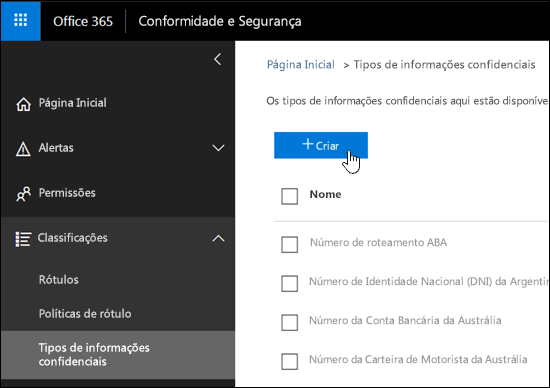
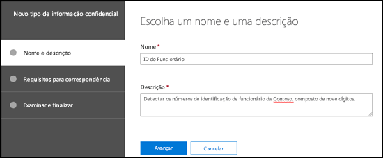
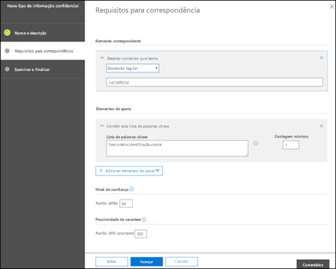
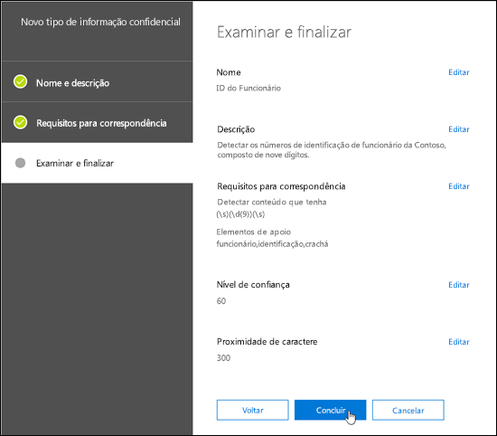
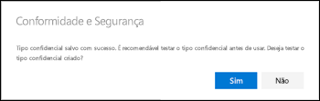
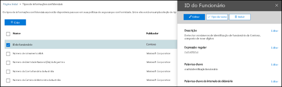
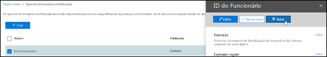
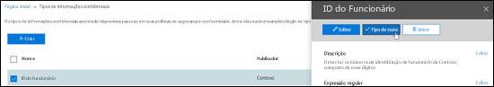
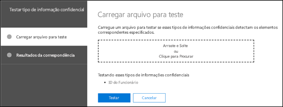
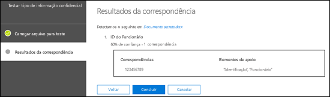

<!-- rename md file to match the display name -->
# Criar um tipo personalizado de informação confidencial no Centro de Conformidade e Segurança

Leia este artigo para criar um [ tipo personalizado de informação confidencial](custom-sensitive-info-types.md) no Centro de Conformidade e Segurança ([https://protection.office.com](https://protection.office.com)). Os tipos personalizados de informações confidenciais criados através desse método são adicionados ao pacote de regras chamado `Microsoft.SCCManaged.CustomRulePack`.

Também é possível criar tipos personalizados de informações confidenciais usando os recursos PowerShell e Exact Data Match. Para saber mais sobre esses métodos, confira:
- [Crie um tipo personalizado de informação confidencial no PowerShell do Centro de Conformidade e Segurança](create-a-custom-sensitive-information-type-in-scc-powershell.md)
- [Criar um tipo personalizado de informações confidenciais com Correspondência Exata de Dados (visualização)](create-custom-sensitive-information-types-with-exact-data-match-based-classification.md)

## Antes de começar

> [!NOTE]
> Você deve ter permissões de administrador Global ou administrador de Conformidade para criar, testar e implantar um tipo personalizado de informações confidenciais por meio da interface do usuário. Confira, [Funções de administrador](https://docs.microsoft.com/office365/admin/add-users/about-admin-roles?view=o365-worldwide) no Office 365.

- Sua organização deve ter uma assinatura, como o Office 365 Enterprise, que inclua a Prevenção Contra Perda de Dados (DLP) Consulte [Política de Mensagens e Descrição do Serviço de Conformidade](https://docs.microsoft.com/office365/servicedescriptions/exchange-online-protection-service-description/messaging-policy-and-compliance-servicedesc). 

- Custom sensitive information types require familiarity with regular expressions (RegEx). For more information about the Boost.RegEx (formerly known as RegEx++) engine that's used for processing the text, see [Boost.Regex 5.1.3](https://www.boost.org/doc/libs/1_68_0/libs/regex/doc/html/).

  O suporte e serviço de atendimento ao cliente da Microsoft não consegue ajudar na criação de classificações personalizadas ou padrões de expressão regular. Os engenheiros de suporte podem fornecer suporte limitado para os recursos, como, fornecer padrões de expressão regular de exemplo para fins de teste ou auxiliar na solução de problemas de um padrão de expressão regular existente que não seja disparador conforme o esperado, mas não oferecer garantias de que qualquer desenvolvimento da correspondência de conteúdo personalizado atenderá a seus requisitos ou obrigações.

- A DLP usa o rastreador de pesquisa para identificar e classificar informações confidenciais em sites do SharePoint Online e do OneDrive for Business. Para identificar seu novo tipo personalizado de informações confidenciais no conteúdo existente, o conteúdo deve ser novamente rastreado. O conteúdo e rastreado de acordo com um cronograma, mas você pode re-rastrear manualmente o conteúdo de um conjunto de sites, lista ou biblioteca. Para saber mais, confira [Solicitar manualmente o rastreamento e a reindexação de um site, uma biblioteca ou uma lista](https://docs.microsoft.com/sharepoint/crawl-site-content).

## Criar tipos de informações confidenciais personalizados no Centro de Conformidade e Segurança

No Centro de Conformidade e Segurança, acesse **Classificações** \> **Tipos de informações confidenciais** e clique em **Criar**.

As configurações são bastante óbvias e são explicadas na página associada do assistente:

- **Nome**

- **Descrição**

- **Proximidade**

- **Nível de confiança**

- **Elemento de padrão principal** (palavras-chave, expressão regular ou dicionário)

- **Elementos de padrão de suporte** opcionais (palavras-chave, expressão regular ou dicionário) e um valor de **Custo mínimo** correspondente.

Here's a scenario: You want a custom sensitive information type that detects 9-digit employee numbers in content, along with the keywords "employee" "ID" and "badge". To create this custom sensitive information type, do the following steps:

1. No Centro de Conformidade e Segurança, acesse **Classificações** \> **Tipos de informações confidenciais** e clique em **Criar**.

    

2. Na página **Escolher um nome e uma descrição** que é aberta, insira os seguintes valores:

  - **Nome**: ID de funcionário.

  - **Descrição** detectar os números de nove dígitos de ID de funcionário da Contoso.

    

    Quando terminar, clique em **Avançar**.

3. Na página **Requisitos para correspondência** que é aberta, clique em **Adicionar um elemento** e defina as seguintes configurações:

    - **Detectar conteúdo que tenha**:
 
      a. Click **Any of these** and select **Regular expression**.

      b. In the regular expression box, enter `(\s)(\d{9})(\s)` (nine-digit numbers surrounded by white space).
  
    - **Elementos de suporte**: clique em **Adicionar elementos de suporte** e selecione **Contém esta lista de palavras-chave**.

    - Na área **Contém esta lista de palavra-chave** que é exibida, defina as seguintes configurações:

      - **Lista de palavra-chave**: insira o seguinte valor: funcionário,ID,crachá.

      - **Contagem mínima**: mantenha o valor padrão 1.

    - Mantenha o valor padrão de 60 para o **Nível de confiança**. 

    - Mantenha o valor padrão de 300 para a **Proximidade de caracteres**.

    

    Quando terminar, clique em **Avançar**.

4. Na página **Examinar e finalizar** que é aberta, examine as configurações e clique em **Concluir**.

    

5. The next page encourages you to test the new custom sensitive information type by clicking **Yes**. For more information, see [Test custom sensitive information types in the Security & Compliance Center](#test-custom-sensitive-information-types-in-the-security--compliance-center). To test the rule later, click **No**.

    

### Como saber se funcionou?

Para confirmar que você criou um novo tipo de informação confidencial com êxito, execute uma destas etapas:

  - Vá para **Classificações** \> **Tipos de informações confidenciais** e verifique se o novo tipo personalizado de informações confidenciais está listado.

  - Test the new custom sensitive information type. For more information, see [Test custom sensitive information types in the Security & Compliance Center](#test-custom-sensitive-information-types-in-the-security--compliance-center).

## Modificar tipos de informações confidenciais personalizados no Centro de Conformidade e Segurança

**Observações**:
<!-- check to see if this note contradicts the guidance in "customize a built in sensitive information type customize-a-built-in-sensitive-information-type it sure seems like it does-->
- You can only modify custom sensitive information types; you can't modify built-in sensitive information types. But you can use PowerShell to export built-in custom sensitive information types, customize them, and import them as custom sensitive information types. For more information, see [Customize a built-in sensitive information type](customize-a-built-in-sensitive-information-type.md).

- You can only modify custom sensitive information types that you created in the UI. If you used the [PowerShell procedure](create-a-custom-sensitive-information-type-in-scc-powershell.md) to import a custom sensitive information type rule package, you'll get an error.

No Centro de Conformidade e Segurança, acesse **Classificações** \> **Tipos de informações confidenciais**, selecione os tipos de informações confidenciais personalizados que você deseja modificar e clique em **Editar**.

  

The same options are available here as when you created the custom sensitive information type in the Security & Compliance Center. For more information, see [Create custom sensitive information types in the Security & Compliance Center](#create-custom-sensitive-information-types-in-the-security--compliance-center).

### Como saber se funcionou?

Para confirmar que você modificou um tipo de informação confidencial com êxito, execute uma destas etapas:

  - Vá para **classificações** \> **Tipos de informações confidenciais** para verificar as propriedades do tipo personalizado de informação confidencial modificado. 

  - Test the modified custom sensitive information type. For more information, see [Test custom sensitive information types in the Security & Compliance Center](#test-custom-sensitive-information-types-in-the-security--compliance-center).

## Remover tipos de informações confidenciais personalizados no Centro de Conformidade e Segurança 

**Observações**:

- Você só pode remover tipos de informações confidenciais personalizados. Não é possível remover tipos internos de informações confidenciais.

- Antes de remover um tipo personalizado de informação confidencial, verifique se nenhuma política de DLP ou regras de fluxo de emails do Exchange (também conhecidas como regras de transporte) ainda fazem referência ao tipo de informação confidencial.

1. No Centro de Conformidade e Segurança, acesse **Classificações** \> **Tipos de informações confidenciais** e selecione um ou mais tipos de informações confidenciais personalizados que você deseja remover.

2. No submenu que é aberto, clique em **Excluir** (ou **Excluir tipos de informações confidenciais** se você tiver selecionado mais de um).

    

3. Na mensagem de aviso exibida, clique em **Sim**.

### Como saber se funcionou?

Para verificar se você removeu um tipo personalizado de informação confidencial com êxito, vá até **Classificações** \> **Tipos de informações confidenciais** para verificar se o tipo personalizado de informação confidencial não está mais presente.

## Teste tipos de informações confidenciais personalizados no Centro de Conformidade e Segurança

1. No Centro de Conformidade e Segurança, acesse **Classificações** \> **Tipos de informações confidenciais**.

2. Select one or more custom sensitive information types to test. In the fly-out that opens, click **Test type** (or **Test sensitive info types** if you selected more than one).

    

3. Na página **Carregar arquivo para teste** que se abre, carregue um documento para teste arrastando e soltando um arquivo, ou então clicando em **Procurar** e selecionando um arquivo.

    

4. Clique no botão **Testar** para testar o documento em busca de correspondências de padrão no arquivo.

5. Na página **Resultados da correspondência**, clique em **Concluir**.

    
