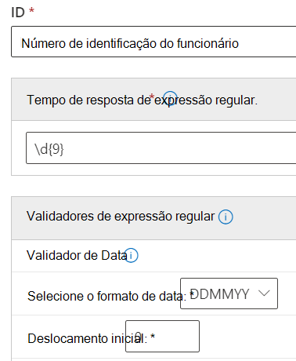

# <a name="get-started-with-custom-sensitive-information-types"></a>Comece com tipos de informações confidenciais personalizados

Se os tipos de informações confidenciais pré-configurados não atendem às suas necessidades, você pode criar seus próprios tipos de informações confidenciais personalizados que você define totalmente ou pode copiar um dos pré-configurados e modificá-lo.

Os tipos personalizados de informações confidenciais criados através desse método são adicionados ao pacote de regras chamado `Microsoft.SCCManaged.CustomRulePack`.

Existem duas maneiras de criar um novo tipo de informação confidencial:

- [do zero, onde você define totalmente todos os elementos](#create-a-custom-sensitive-information-type)
- [copiar e modificar um tipo de informação confidencial](#copy-and-modify-a-sensitive-information-type)


## <a name="before-you-begin"></a>Antes de começar

- Você deve estar familiarizado com os tipos de informações confidenciais e com o que eles são compostos. Consulte, [Saiba mais sobre os tipos de informações confidenciais](sensitive-information-type-learn-about.md). É fundamental compreender as funções de:
    - [expressões regulares](https://www.boost.org/doc/libs/1_68_0/libs/regex/doc/html/) - os tipos de informações confidenciais do Microsoft 365 usam o mecanismo Boost.RegEx 5.1.3
    - listas de palavras-chave - você pode criar suas próprias conforme define seu tipo de informação confidencial ou escolher entre as listas de palavras-chave existentes
    - [dicionário de palavras-chave](create-a-keyword-dictionary.md)
    - [funções](what-the-dlp-functions-look-for.md)
    - [níveis de confiança](sensitive-information-type-learn-about.md#more-on-confidence-levels)
 
- Você deve ter permissões de administrador Global ou administrador de Conformidade para criar, testar e implantar um tipo personalizado de informações confidenciais por meio da interface do usuário. Confira, [Funções de administrador](/office365/admin/add-users/about-admin-roles) no Office 365.

- Sua organização deve ter uma assinatura, como o Office 365 Enterprise, que inclua a Prevenção Contra Perda de Dados (DLP) Consulte [Política de Mensagens e Descrição do Serviço de Conformidade](/office365/servicedescriptions/exchange-online-protection-service-description/messaging-policy-and-compliance-servicedesc). 


> [!IMPORTANT]
> O suporte e serviço de atendimento ao cliente da Microsoft não consegue ajudar na criação de classificações personalizadas ou padrões de expressão regular. Os engenheiros de suporte podem fornecer suporte limitado para os recursos, como, fornecer padrões de expressão regular de exemplo para fins de teste ou auxiliar na solução de problemas de um padrão de expressão regular existente que não seja disparador conforme o esperado, mas não oferecer garantias de que qualquer desenvolvimento da correspondência de conteúdo personalizado atenderá a seus requisitos ou obrigações.

## <a name="create-a-custom-sensitive-information-type"></a>Criar um tipo de informação confidencial personalizado

Usar este procedimento para criar um novo tipo de informação confidencial que você define completamente. 

1. No Centro de Conformidade, vá para **Classificação de dados** \>**Tipos de informações confidenciais** e escolha **Criar tipo de informação**.
2. Preencher os valores para **Nome** e **Descrição** e escolher **Próximo**.
3. Escolher **Criar padrão**. Você pode criar vários padrões, cada um com diferentes elementos e níveis de confiança, conforme define seu novo tipo de informação confidencial.
4. Escolher o nível de confiança padrão para o padrão. Os valores são **Confiança baixa**, **Confiança média** e **Confiança alta**.
5. Escolher e definir **Elemento primário**. O elemento primário pode ser uma **Expressão regular** com um validador opcional, uma **Lista de palavras-chave**, um **Dicionário de palavras-chave**, ou uma das **Funções** pré-configuradas. Para obter mais informações sobre as funções DLP, consulte [O que procuram as funções DLP](what-the-dlp-functions-look-for.md). Para obter mais informações sobre a data e os validadores de verificação, consulte [Mais informações sobre validadores de expressão regular](#more-information-on-regular-expression-validators).
6. Preencha um valor para **Proximidade do caractere**.
7. (Opcional) Adicionar elementos de suporte, se houver. Os elementos de suporte podem ser uma expressão regular com um validador opcional, uma lista de palavras-chave, um dicionário de palavras-chave ou uma das funções predefinidas. Os elementos de suporte podem ter sua própria **configuração de proximidade character.** 
8. (Opcional) Adicionar [**verificações adicionais**](#more-information-on-additional-checks) da lista de verificações disponíveis.
9. Escolher **Criar**.
10. Escolher **Próximo**.
11. Escolher o **nível de confiança recomendado** para este tipo de informação confidencial.
12. Verificar sua configuração e escolha **Enviar**.

> [!IMPORTANT]
> O Microsoft 365 usa o rastreador de pesquisa para identificar e classificar informações confidenciais nos sites do SharePoint Online e OneDrive for Business. Para identificar seu novo tipo personalizado de informações confidenciais no conteúdo existente, o conteúdo deve ser novamente rastreado. O conteúdo e rastreado de acordo com um cronograma, mas você pode re-rastrear manualmente o conteúdo de um conjunto de sites, lista ou biblioteca. Para saber mais, confira [Solicitar manualmente o rastreamento e a reindexação de um site, uma biblioteca ou uma lista](/sharepoint/crawl-site-content).

13. Na página **Classificação de dados**, você verá todos os tipos de informações confidenciais listados. Escolha **Atualizar** e, em seguida, procure ou use a ferramenta de pesquisa para encontrar o tipo de informação confidencial que acabou de criar.

## <a name="test-a-sensitive-information-type"></a>Teste um tipo de informação confidencial

Você pode testar qualquer tipo de informação confidencial na lista. Sugerimos que você teste todos os tipos de informações confidenciais que criar antes de usá-los em uma política.

1. Prepare dois arquivos, como um documento do Word. Um com conteúdo que corresponda aos elementos que você especificou em seu tipo de informação confidencial e outro que não corresponda.
2. No Centro de Conformidade, vá para **Classificação de dados** \>**Tipos de informações confidenciais** e escolha o tipo de informações confidenciais na lista para abrir o painel de detalhes e escolha **Teste**.
3. Faça upload de um arquivo e escolha **Teste**.
4. Na página **Resultados das correspondências**, analise os resultados e escolha **Fim**.

## <a name="modify-custom-sensitive-information-types-in-the-compliance-center"></a>Modificar tipos de informações confidenciais personalizadas no Centro de Conformidade

1. No Centro de Conformidade, vá para **Classificação de dados** \>**Tipos de informações confidenciais** e escolha o tipo de informações confidenciais na lista que você deseja modificar, escolha **Editar**.
2. Você pode adicionar outros padrões, com elementos primários e de suporte exclusivos, níveis de confiança, proximidade de caractere e [**verificações adicionais**](#more-information-on-additional-checks), ou editar/remover os existentes.

## <a name="remove-custom-sensitive-information-types-in-the-compliance-center"></a>Remover tipos de informações confidenciais personalizados no Centro de Conformidade 

> [!NOTE]
> Você só pode remover tipos de informações confidenciais personalizados. Não é possível remover tipos internos de informações confidenciais.

> [!IMPORTANT]
> Antes de remover um tipo personalizado de informação confidencial, verifique se nenhuma política de DLP ou regras de fluxo de emails do Exchange (também conhecidas como regras de transporte) ainda fazem referência ao tipo de informação confidencial.

1. No Centro de Conformidade, vá para **Classificação de dados** \>**Tipos de informações confidenciais** e escolha o tipo de informações confidenciais da lista que deseja remover.
2. No menu desdobrável que é aberto, escolha **Excluir**.

## <a name="copy-and-modify-a-sensitive-information-type"></a>Copiar e modificar um tipo de informação confidencial

Usar este procedimento para criar um novo tipo de informação confidencial baseado em um tipo de informação sensível existente. 

1. No Centro de Conformidade, vá para **Classificação de dados** \>**Tipos de informações confidenciais** e escolha o tipo de informações confidenciais que deseja copiar.
2. No menu desdobrável, escolha **Copiar**.
3. Escolher **Atualizar** na lista de tipos de informações confidenciais e navegue ou pesquise a cópia que acabou de fazer. Pesquisas parciais de picada funcionam, então você pode apenas pesquisar por `copy`e a pesquisa retornará todos os tipos de informações confidenciais com a palavra `copy` no nome. 
4. Preencher os valores para **Nome** e **Descrição** e escolher **Próximo**.
5. Escolher a cópia do seu tipo de informação confidenciall e escolha **Editar**. 
6. Dê ao seu novo tipo de informação confidencial um novo **Nome** e **Descrição**.
7. Você pode escolher por editar ou remover os padrões existentes e adicionar novos. Escolher o nível de confiança padrão para o novo padrão. Os valores são **Confiança baixa**, **Confiança média** e **Confiança alta**.
8. Escolher e definir **Elemento primário**. O elemento primário pode ser uma **Expressão regular**, uma **Lista de palavras-chave**, um **Dicionário de palavras-chave** ou uma das **Funções** pré-configuradas. Consulte, [O que procuram as funções DLP](what-the-dlp-functions-look-for.md).
9. Preencha um valor para **Proximidade do caractere**.
10. (Opcional) Adicione os **Elementos de suporte** ou [**Verificações adicionais**](#more-information-on-additional-checks) que você tiver. Se necessário, você pode agrupar seus **Elementos de suporte**.
11. Escolher **Criar**.
12. Escolher **Próximo**.
13. Escolher o **nível de confiança recomendado** para este tipo de informação confidencial.
14. Verificar sua configuração e escolha **Enviar**.

Também é possível criar tipos personalizados de informações confidenciais usando os recursos PowerShell e Exact Data Match. Para saber mais sobre esses métodos, confira:
- [Crie um tipo personalizado de informação confidencial no PowerShell do Centro de Conformidade e Segurança](create-a-custom-sensitive-information-type-in-scc-powershell.md)
- [Criar um tipo personalizado de informações confidenciais com Correspondência Exata de Dados (visualização)](create-custom-sensitive-information-types-with-exact-data-match-based-classification.md)

## <a name="more-information-on-regular-expression-validators"></a>Mais informações sobre validadores de expressão regular

### <a name="checksum-validator"></a>Validador checksum

Se você precisar executar um checksum em um dígito em uma expressão regular, poderá usar o *validador checksum*. Por exemplo, digamos que você precise criar um SIT para um número de licença de oito dígitos onde o último dígito é um dígito de verificação que é validado usando um cálculo mod 9. Você definiu o algoritmo checksum assim:

Soma = dígito 1 * Peso 1 + dígito 2 * peso 2 + dígito 3 * peso 3 + dígito 4 * peso 4 + dígito 5 * peso 5 + dígito 6 * peso 6 * peso 6 + dígito 7 * peso 7 + dígito 8 * peso 8 Valor mod = soma % 9 Se o valor mod == dígito 8 Número de conta for válido Se o valor mod != dígito 8 Número da conta for inválido

1. Defina o elemento principal com essa expressão regular:

   ```console
   \d{8}
   ```

2. Em seguida, adicione o validador checksum.
3. Adicione os valores de peso separados por vírgulas, a posição do dígito de verificação e o valor Mod. Para obter mais informações sobre a operação Modulo, consulte [Operação Modulo](https://en.wikipedia.org/wiki/Modulo_operation).

> [!NOTE]
> Se o dígito de verificação não faz parte do cálculo de verificação, use 0 como o peso do dígito de verificação. Por exemplo, no caso acima, o peso 8 será igual a 0 se o dígito de verificação não for usado para calcular o dígito de verificação.  Modulo_operation).


### <a name="date-validator"></a>Validador de data

Se um valor de data inserido na expressão regular faz parte de um novo padrão que você está criando, você pode usar o *validador* de data para testar se ele atende aos seus critérios. Por exemplo, digamos que você queira criar um SIT para um número de identificação de funcionários de nove dígitos. Os seis primeiros dígitos são a data de contratação no formato DDMMYYY e os três últimos são números gerados aleatoriamente. Para validar se os seis primeiros dígitos estão no formato correto.

1. Defina o elemento principal com essa expressão regular:

   ```console
   \d{9}
   ```

2. Em seguida, adicione o validador de data.
3. Selecione o formato de data e o deslocamento inicial. Como a cadeia de caracteres de data é os primeiros seis dígitos, o deslocamento é `0` .



### <a name="functional-processors-as-validators"></a>Processadores funcionais como validadores

Você pode usar processadores de função para alguns dos SITs mais usados como validadores. Isso permite que você defina sua própria expressão regular enquanto garante que eles passem as verificações adicionais exigidas pelo SIT. Por exemplo, Func_India_Aadhar garantirá que a expressão regular personalizada definida por você passe a lógica de validação necessária para o cartão Aadhar da Índia. Para obter mais informações sobre funções DLP que podem ser usadas como validadores, consulte O que as funções [DLP procurarão](what-the-dlp-functions-look-for.md#what-the-dlp-functions-look-for). 

### <a name="luhn-check-validator"></a>Validador de verificação luhn

Você pode usar o validador de verificação Luhn se tiver um tipo de informação confidenciais personalizado que inclua uma expressão regular que deve passar no algoritmo [Luhn](https://en.wikipedia.org/wiki/Luhn_algorithm).

## <a name="more-information-on-additional-checks"></a>Mais informações sobre verificações adicionais

Veja as definições e alguns exemplos das verificações adicionais disponíveis.

**Excluir correspondências específicas**: essa verificação permite definir palavras-chave a serem excluídas ao detectar correspondências para o padrão que você estiver editando. Por exemplo, você pode excluir os números de cartão de crédito de teste, como "4111111111111111", para não corresponderem a um número válido.

**Inicia ou não com caracteres**: essa verificação permite definir os caracteres com os quais os itens correspondentes devem ou não iniciar. Por exemplo, se você quiser que o padrão detecte apenas números de cartão de crédito que iniciem com 41, 42 ou 43, selecione **Inicia com** e adicione 41, 42 e 43 à lista, separados por vírgulas. 

**Termina ou não com caracteres**: essa verificação permite definir os caracteres com os quais os itens correspondentes devem ou não terminar. Por exemplo, se seu número de ID do funcionário não puder terminar com 0 ou 1, selecione **Não termina com** e adicione 0 e 1 à lista, separados por vírgulas.

**Excluir caracteres duplicados**: essa verificação permite ignorar as correspondências em que todos os dígitos são iguais. Por exemplo, se o número de ID do funcionário de seis dígitos não puder ter todos os dígitos iguais, selecione **Excluir caracteres duplicados** para excluir 111111, 222222, 333333, 444444, 555555, 666666, 777777, 888888, 999999 e 000000 da lista de correspondências válidas para a ID do funcionário.

**Incluir ou excluir prefixos**: essa verificação permite definir as palavras-chave que devem ou não ser encontradas imediatamente antes da entidade correspondente. Dependendo da seleção, as entidades serão ou não correspondidas se forem precedidas pelos prefixos que você incluir aqui. Por exemplo, se você **Excluir** o prefixo **GUID:**, qualquer entidade precedida por **GUID:** não será considerada uma correspondência.

**Incluir ou excluir sufixos**: essa verificação permite definir as palavras-chave que devem ou não ser encontradas imediatamente depois da entidade correspondente. Dependendo da seleção, as entidades serão ou não correspondidas se forem seguidas pelos sufixos que você incluir aqui. Por exemplo, se você **Excluir** o sufixo **:GUID**, qualquer texto seguido por **:GUID** não será correspondido.


> [!NOTE]
> A Proteção de Informações do Microsoft 365 oferece suporte aos idiomas de conjunto de caracteres de byte duplo para:
> - Chinês (simplificado)
> - Chinês (tradicional)
> - Coreano
> - Japonês
>
>Este suporte está disponível para tipos de informações confidenciais. Para obter mais informações, confira [Suporte à proteção de informações para notas de versão de conjuntos de caracteres de byte duplo (visualização)](mip-dbcs-relnotes.md).

> [!TIP]
> Para detectar padrões que contêm caracteres chineses/japoneses e caracteres de byte único ou para detectar padrões que contenham chinês/japonês e inglês, defina duas variantes da palavra-chave ou regex. 
>
> Por exemplo, para detectar uma palavra-chave como "机的document", use duas variantes da palavra-chave; um com um espaço entre o texto japonês e o inglês e outro sem um espaço entre o texto japonês e o inglês. Portanto, as palavras-chave a serem adicionadas no SIT devem ser "机密的 document" e "机密的document". Da mesma forma, para detectar uma frase "東京オリンピック2020", duas variantes devem ser usadas; "東京オリンピック 2020" e "東京オリンピック2020".
>
> Ao criar um regex usando um hífen de byte duplo ou um ponto de byte duplo, certifique-se de escapar ambos os caracteres, como um escape de um hífen ou ponto em um regex. Aqui está um exemplo de regex para referência:
>
>    - (?<!\d)([４][０-９]{3}[\-?\－\t]*[０-９]{4}
>
> É recomendável usar uma correspondência de cadeia de caracteres em vez de uma correspondência de palavras-chave em uma lista de palavras-chave.
