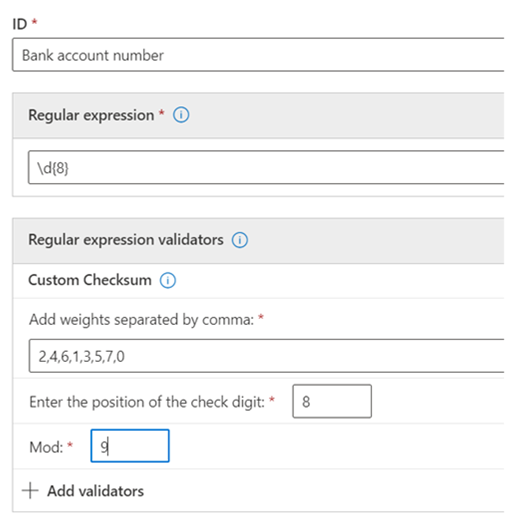

# <a name="get-started-with-custom-sensitive-information-types"></a><span data-ttu-id="9ccb0-103">Comece com tipos de informações confidenciais personalizados</span><span class="sxs-lookup"><span data-stu-id="9ccb0-103">Get started with custom sensitive information types</span></span>

<span data-ttu-id="9ccb0-104">Se os tipos de informações confidenciais pré-configurados não atendem às suas necessidades, você pode criar seus próprios tipos de informações confidenciais personalizados que você define totalmente ou pode copiar um dos pré-configurados e modificá-lo.</span><span class="sxs-lookup"><span data-stu-id="9ccb0-104">If the pre-configured sensitive information types don't meet your needs, you can create your own custom sensitive information types that you fully define or you can copy one of the pre-configured ones and modify it.</span></span>

<span data-ttu-id="9ccb0-105">Os tipos personalizados de informações confidenciais criados através desse método são adicionados ao pacote de regras chamado `Microsoft.SCCManaged.CustomRulePack`.</span><span class="sxs-lookup"><span data-stu-id="9ccb0-105">The custom sensitive information types that you create by using this method are added to the rule package named `Microsoft.SCCManaged.CustomRulePack`.</span></span>

<span data-ttu-id="9ccb0-106">Existem duas maneiras de criar um novo tipo de informação confidencial:</span><span class="sxs-lookup"><span data-stu-id="9ccb0-106">There are two ways to create a new sensitive information type:</span></span>

- [<span data-ttu-id="9ccb0-107">do zero, onde você define totalmente todos os elementos</span><span class="sxs-lookup"><span data-stu-id="9ccb0-107">from scratch where you fully define all elements</span></span>](#create-a-custom-sensitive-information-type)
- [<span data-ttu-id="9ccb0-108">copiar e modificar um tipo de informação confidencial</span><span class="sxs-lookup"><span data-stu-id="9ccb0-108">copy and modify an existing sensitive information type</span></span>](#copy-and-modify-a-sensitive-information-type)


## <a name="before-you-begin"></a><span data-ttu-id="9ccb0-109">Antes de começar</span><span class="sxs-lookup"><span data-stu-id="9ccb0-109">Before you begin</span></span>

- <span data-ttu-id="9ccb0-110">Você deve estar familiarizado com os tipos de informações confidenciais e com o que eles são compostos.</span><span class="sxs-lookup"><span data-stu-id="9ccb0-110">You should be familiar with sensitive information types and what they are composed of.</span></span> <span data-ttu-id="9ccb0-111">Consulte, [Saiba mais sobre os tipos de informações confidenciais](sensitive-information-type-learn-about.md).</span><span class="sxs-lookup"><span data-stu-id="9ccb0-111">See, [Learn about sensitive information types](sensitive-information-type-learn-about.md).</span></span> <span data-ttu-id="9ccb0-112">É fundamental compreender as funções de:</span><span class="sxs-lookup"><span data-stu-id="9ccb0-112">It is critical to understand the roles of:</span></span>
    - <span data-ttu-id="9ccb0-113">[expressões regulares](https://www.boost.org/doc/libs/1_68_0/libs/regex/doc/html/) - os tipos de informações confidenciais do Microsoft 365 usam o mecanismo Boost.RegEx 5.1.3</span><span class="sxs-lookup"><span data-stu-id="9ccb0-113">[regular expressions](https://www.boost.org/doc/libs/1_68_0/libs/regex/doc/html/) - Microsoft 365 sensitive information types uses the Boost.RegEx 5.1.3 engine</span></span>
    - <span data-ttu-id="9ccb0-114">listas de palavras-chave - você pode criar suas próprias conforme define seu tipo de informação confidencial ou escolher entre as listas de palavras-chave existentes</span><span class="sxs-lookup"><span data-stu-id="9ccb0-114">keyword lists - you can create your own as you define your sensitive information type or choose from existing keyword lists</span></span>
    - [<span data-ttu-id="9ccb0-115">dicionário de palavras-chave</span><span class="sxs-lookup"><span data-stu-id="9ccb0-115">keyword dictionary</span></span>](create-a-keyword-dictionary.md)
    - [<span data-ttu-id="9ccb0-116">funções</span><span class="sxs-lookup"><span data-stu-id="9ccb0-116">functions</span></span>](what-the-dlp-functions-look-for.md)
    - [<span data-ttu-id="9ccb0-117">níveis de confiança</span><span class="sxs-lookup"><span data-stu-id="9ccb0-117">confidence levels</span></span>](sensitive-information-type-learn-about.md#more-on-confidence-levels)
 
- <span data-ttu-id="9ccb0-118">Você deve ter permissões de administrador Global ou administrador de Conformidade para criar, testar e implantar um tipo personalizado de informações confidenciais por meio da interface do usuário.</span><span class="sxs-lookup"><span data-stu-id="9ccb0-118">You must have Global admin or Compliance admin permissions to create, test, and deploy a custom sensitive information type through the UI.</span></span> <span data-ttu-id="9ccb0-119">Confira, [Funções de administrador](/office365/admin/add-users/about-admin-roles) no Office 365.</span><span class="sxs-lookup"><span data-stu-id="9ccb0-119">See [About admin roles](/office365/admin/add-users/about-admin-roles) in Office 365.</span></span>

- <span data-ttu-id="9ccb0-120">Sua organização deve ter uma assinatura, como o Office 365 Enterprise, que inclua a Prevenção Contra Perda de Dados (DLP)</span><span class="sxs-lookup"><span data-stu-id="9ccb0-120">Your organization must have a subscription, such as Office 365 Enterprise, that includes Data Loss Prevention (DLP).</span></span> <span data-ttu-id="9ccb0-121">Consulte [Política de Mensagens e Descrição do Serviço de Conformidade](/office365/servicedescriptions/exchange-online-protection-service-description/messaging-policy-and-compliance-servicedesc).</span><span class="sxs-lookup"><span data-stu-id="9ccb0-121">See [Messaging Policy and Compliance ServiceDescription](/office365/servicedescriptions/exchange-online-protection-service-description/messaging-policy-and-compliance-servicedesc).</span></span> 


> [!IMPORTANT]
> <span data-ttu-id="9ccb0-122">O suporte e serviço de atendimento ao cliente da Microsoft não consegue ajudar na criação de classificações personalizadas ou padrões de expressão regular.</span><span class="sxs-lookup"><span data-stu-id="9ccb0-122">Microsoft Customer Service & Support can't assist with creating custom classifications or regular expression patterns.</span></span> <span data-ttu-id="9ccb0-123">Os engenheiros de suporte podem fornecer suporte limitado para os recursos, como, fornecer padrões de expressão regular de exemplo para fins de teste ou auxiliar na solução de problemas de um padrão de expressão regular existente que não seja disparador conforme o esperado, mas não oferecer garantias de que qualquer desenvolvimento da correspondência de conteúdo personalizado atenderá a seus requisitos ou obrigações.</span><span class="sxs-lookup"><span data-stu-id="9ccb0-123">Support engineers can provide limited support for the feature, such as, providing sample regular expression patterns for testing purposes, or assisting with troubleshooting an existing regular expression pattern that's not triggering as expected, but can't provide assurances that any custom content-matching development will fulfill your requirements or obligations.</span></span>

## <a name="create-a-custom-sensitive-information-type"></a><span data-ttu-id="9ccb0-124">Criar um tipo de informação confidencial personalizado</span><span class="sxs-lookup"><span data-stu-id="9ccb0-124">Create a custom sensitive information type</span></span>

<span data-ttu-id="9ccb0-125">Usar este procedimento para criar um novo tipo de informação confidencial que você define completamente.</span><span class="sxs-lookup"><span data-stu-id="9ccb0-125">Use this procedure to create a new sensitive information type that you fully define.</span></span> 

1. <span data-ttu-id="9ccb0-126">No Centro de Conformidade, vá para **Classificação de dados** \>**Tipos de informações confidenciais** e escolha **Criar tipo de informação**.</span><span class="sxs-lookup"><span data-stu-id="9ccb0-126">In the Compliance Center, go to **Data classification** \> **Sensitive info types** and choose **Create info type**.</span></span>
2. <span data-ttu-id="9ccb0-127">Preencher os valores para **Nome** e **Descrição** e escolher **Próximo**.</span><span class="sxs-lookup"><span data-stu-id="9ccb0-127">Fill in values for **Name** and **Description** and choose **Next**.</span></span>
3. <span data-ttu-id="9ccb0-128">Escolher **Criar padrão**.</span><span class="sxs-lookup"><span data-stu-id="9ccb0-128">Choose **Create pattern**.</span></span> <span data-ttu-id="9ccb0-129">Você pode criar vários padrões, cada um com diferentes elementos e níveis de confiança, conforme define seu novo tipo de informação confidencial.</span><span class="sxs-lookup"><span data-stu-id="9ccb0-129">You can create multiple patterns, each with different elements and confidence levels, as you define your new sensitive information type.</span></span>
4. <span data-ttu-id="9ccb0-130">Escolher o nível de confiança padrão para o padrão.</span><span class="sxs-lookup"><span data-stu-id="9ccb0-130">Choose the default confidence level for the pattern.</span></span> <span data-ttu-id="9ccb0-131">Os valores são **Confiança baixa**, **Confiança média** e **Confiança alta**.</span><span class="sxs-lookup"><span data-stu-id="9ccb0-131">The values are **Low confidence**, **Medium confidence**, and **High confidence**.</span></span>
5. <span data-ttu-id="9ccb0-132">Escolher e definir **Elemento primário**.</span><span class="sxs-lookup"><span data-stu-id="9ccb0-132">Choose and define **Primary element**.</span></span> <span data-ttu-id="9ccb0-133">O elemento primário pode ser uma **Expressão regular** com um validador opcional, uma **Lista de palavras-chave**, um **Dicionário de palavras-chave**, ou uma das **Funções** pré-configuradas.</span><span class="sxs-lookup"><span data-stu-id="9ccb0-133">The primary element can be a **Regular expression** with an optional validator, a **Keyword list**, a **Keyword dictionary**, or one of the pre-configured **Functions**.</span></span> <span data-ttu-id="9ccb0-134">Para obter mais informações sobre as funções DLP, consulte [O que procuram as funções DLP](what-the-dlp-functions-look-for.md).</span><span class="sxs-lookup"><span data-stu-id="9ccb0-134">For more information on DLP functions, see [What the DLP functions look for](what-the-dlp-functions-look-for.md).</span></span> <span data-ttu-id="9ccb0-135">Para obter mais informações sobre a data e os validadores de verificação, consulte [Mais informações sobre validadores de expressão regular](#more-information-on-regular-expression-validators).</span><span class="sxs-lookup"><span data-stu-id="9ccb0-135">For more information on the date and the checksum validators, see [More information on regular expression validators](#more-information-on-regular-expression-validators).</span></span>
6. <span data-ttu-id="9ccb0-136">Preencha um valor para **Proximidade do caractere**.</span><span class="sxs-lookup"><span data-stu-id="9ccb0-136">Fill in a value for **Character proximity**.</span></span>
7. <span data-ttu-id="9ccb0-137">(Opcional) Adicionar elementos de suporte, se houver.</span><span class="sxs-lookup"><span data-stu-id="9ccb0-137">(Optional) Add supporting elements if you have any.</span></span> <span data-ttu-id="9ccb0-138">Os elementos de suporte podem ser uma expressão regular com um validador opcional, uma lista de palavras-chave, um dicionário de palavras-chave ou uma das funções predefinidas.</span><span class="sxs-lookup"><span data-stu-id="9ccb0-138">Supporting elements can be a regular expression with an optional validator, a keyword list, a keyword dictionary or one of the pre-defined functions.</span></span> <span data-ttu-id="9ccb0-139">Os elementos de suporte podem ter sua própria **configuração de proximidade character.**</span><span class="sxs-lookup"><span data-stu-id="9ccb0-139">Supporting elements can have their own **Character proximity** configuration.</span></span> 
8. <span data-ttu-id="9ccb0-140">(Opcional) Adicionar [**verificações adicionais**](#more-information-on-additional-checks) da lista de verificações disponíveis.</span><span class="sxs-lookup"><span data-stu-id="9ccb0-140">(Optional) Add any [**additional checks**](#more-information-on-additional-checks) from the list of available checks.</span></span>
9. <span data-ttu-id="9ccb0-141">Escolher **Criar**.</span><span class="sxs-lookup"><span data-stu-id="9ccb0-141">Choose **Create**.</span></span>
10. <span data-ttu-id="9ccb0-142">Escolher **Próximo**.</span><span class="sxs-lookup"><span data-stu-id="9ccb0-142">Choose **Next**.</span></span>
11. <span data-ttu-id="9ccb0-143">Escolher o **nível de confiança recomendado** para este tipo de informação confidencial.</span><span class="sxs-lookup"><span data-stu-id="9ccb0-143">Choose the **recommended confidence level** for this sensitive information type.</span></span>
12. <span data-ttu-id="9ccb0-144">Verificar sua configuração e escolha **Enviar**.</span><span class="sxs-lookup"><span data-stu-id="9ccb0-144">Check your setting and choose **Submit**.</span></span>

> [!IMPORTANT]
> <span data-ttu-id="9ccb0-145">O Microsoft 365 usa o rastreador de pesquisa para identificar e classificar informações confidenciais nos sites do SharePoint Online e OneDrive for Business.</span><span class="sxs-lookup"><span data-stu-id="9ccb0-145">Microsoft 365 uses the search crawler to identify and classify sensitive information in SharePoint Online and OneDrive for Business sites.</span></span> <span data-ttu-id="9ccb0-146">Para identificar seu novo tipo personalizado de informações confidenciais no conteúdo existente, o conteúdo deve ser novamente rastreado.</span><span class="sxs-lookup"><span data-stu-id="9ccb0-146">To identify your new custom sensitive information type in existing content, the content must be re-crawled.</span></span> <span data-ttu-id="9ccb0-147">O conteúdo e rastreado de acordo com um cronograma, mas você pode re-rastrear manualmente o conteúdo de um conjunto de sites, lista ou biblioteca.</span><span class="sxs-lookup"><span data-stu-id="9ccb0-147">Content is crawled based on a schedule, but you can manually re-crawl content for a site collection, list, or library.</span></span> <span data-ttu-id="9ccb0-148">Para saber mais, confira [Solicitar manualmente o rastreamento e a reindexação de um site, uma biblioteca ou uma lista](/sharepoint/crawl-site-content).</span><span class="sxs-lookup"><span data-stu-id="9ccb0-148">For more information, see [Manually request crawling and re-indexing of a site, a library or a list](/sharepoint/crawl-site-content).</span></span>

13. <span data-ttu-id="9ccb0-149">Na página **Classificação de dados**, você verá todos os tipos de informações confidenciais listados.</span><span class="sxs-lookup"><span data-stu-id="9ccb0-149">On the **Data classification** page, you'll see all the sensitive information types listed.</span></span> <span data-ttu-id="9ccb0-150">Escolha **Atualizar** e, em seguida, procure ou use a ferramenta de pesquisa para encontrar o tipo de informação confidencial que acabou de criar.</span><span class="sxs-lookup"><span data-stu-id="9ccb0-150">Choose **Refresh** and then browse for or use the search tool to find the sensitive information type you created.</span></span>

## <a name="test-a-sensitive-information-type"></a><span data-ttu-id="9ccb0-151">Teste um tipo de informação confidencial</span><span class="sxs-lookup"><span data-stu-id="9ccb0-151">Test a sensitive information type</span></span>

<span data-ttu-id="9ccb0-152">Você pode testar qualquer tipo de informação confidencial na lista.</span><span class="sxs-lookup"><span data-stu-id="9ccb0-152">You can test any sensitive information type in the list.</span></span> <span data-ttu-id="9ccb0-153">Sugerimos que você teste todos os tipos de informações confidenciais que criar antes de usá-los em uma política.</span><span class="sxs-lookup"><span data-stu-id="9ccb0-153">We suggest that you test every sensitive information type that you create before using it in a policy.</span></span>

1. <span data-ttu-id="9ccb0-154">Prepare dois arquivos, como um documento do Word.</span><span class="sxs-lookup"><span data-stu-id="9ccb0-154">Prepare two files, like a Word document.</span></span> <span data-ttu-id="9ccb0-155">Um com conteúdo que corresponda aos elementos que você especificou em seu tipo de informação confidencial e outro que não corresponda.</span><span class="sxs-lookup"><span data-stu-id="9ccb0-155">One with content that matches the elements you specified in your sensitive information type and one that doesn't match.</span></span>
2. <span data-ttu-id="9ccb0-156">No Centro de Conformidade, vá para **Classificação de dados** \>**Tipos de informações confidenciais** e escolha o tipo de informações confidenciais na lista para abrir o painel de detalhes e escolha **Teste**.</span><span class="sxs-lookup"><span data-stu-id="9ccb0-156">In the Compliance Center, go to **Data classification** \> **Sensitive info types** and choose the sensitive information type from the list to open the details pane and choose **Test**.</span></span>
3. <span data-ttu-id="9ccb0-157">Faça upload de um arquivo e escolha **Teste**.</span><span class="sxs-lookup"><span data-stu-id="9ccb0-157">Upload a file and choose **Test**.</span></span>
4. <span data-ttu-id="9ccb0-158">Na página **Resultados das correspondências**, analise os resultados e escolha **Fim**.</span><span class="sxs-lookup"><span data-stu-id="9ccb0-158">On the **Matches results** page, review the results and choose **Finish**.</span></span>

## <a name="modify-custom-sensitive-information-types-in-the-compliance-center"></a><span data-ttu-id="9ccb0-159">Modificar tipos de informações confidenciais personalizadas no Centro de Conformidade</span><span class="sxs-lookup"><span data-stu-id="9ccb0-159">Modify custom sensitive information types in the Compliance Center</span></span>

1. <span data-ttu-id="9ccb0-160">No Centro de Conformidade, vá para **Classificação de dados** \>**Tipos de informações confidenciais** e escolha o tipo de informações confidenciais na lista que você deseja modificar, escolha **Editar**.</span><span class="sxs-lookup"><span data-stu-id="9ccb0-160">In the Compliance Center, go to **Data classification** \> **Sensitive info types** and choose the sensitive information type from the list that you want to modify choose **Edit**.</span></span>
2. <span data-ttu-id="9ccb0-161">Você pode adicionar outros padrões, com elementos primários e de suporte exclusivos, níveis de confiança, proximidade de caractere e [**verificações adicionais**](#more-information-on-additional-checks), ou editar/remover os existentes.</span><span class="sxs-lookup"><span data-stu-id="9ccb0-161">You can add other patterns, with unique primary and supporting elements, confidence levels, character proximity, and [**additional checks**](#more-information-on-additional-checks) or edit/remove the existing ones.</span></span>

## <a name="remove-custom-sensitive-information-types-in-the-compliance-center"></a><span data-ttu-id="9ccb0-162">Remover tipos de informações confidenciais personalizados no Centro de Conformidade</span><span class="sxs-lookup"><span data-stu-id="9ccb0-162">Remove custom sensitive information types in the Compliance Center</span></span> 

> [!NOTE]
> <span data-ttu-id="9ccb0-163">Você só pode remover tipos de informações confidenciais personalizados. Não é possível remover tipos internos de informações confidenciais.</span><span class="sxs-lookup"><span data-stu-id="9ccb0-163">You can only remove custom sensitive information types; you can't remove built-in sensitive information types.</span></span>

> [!IMPORTANT]
> <span data-ttu-id="9ccb0-164">Antes de remover um tipo personalizado de informação confidencial, verifique se nenhuma política de DLP ou regras de fluxo de emails do Exchange (também conhecidas como regras de transporte) ainda fazem referência ao tipo de informação confidencial.</span><span class="sxs-lookup"><span data-stu-id="9ccb0-164">Before your remove a custom sensitive information type, verify that no DLP policies or Exchange mail flow rules (also known as transport rules) still reference the sensitive information type.</span></span>

1. <span data-ttu-id="9ccb0-165">No Centro de Conformidade, vá para **Classificação de dados** \>**Tipos de informações confidenciais** e escolha o tipo de informações confidenciais da lista que deseja remover.</span><span class="sxs-lookup"><span data-stu-id="9ccb0-165">In the Compliance Center, go to **Data classification** \> **Sensitive info types** and choose the sensitive information type from the list that you want to remove.</span></span>
2. <span data-ttu-id="9ccb0-166">No menu desdobrável que é aberto, escolha **Excluir**.</span><span class="sxs-lookup"><span data-stu-id="9ccb0-166">In the fly-out that opens, choose **Delete**.</span></span>

## <a name="copy-and-modify-a-sensitive-information-type"></a><span data-ttu-id="9ccb0-167">Copiar e modificar um tipo de informação confidencial</span><span class="sxs-lookup"><span data-stu-id="9ccb0-167">Copy and modify a sensitive information type</span></span>

<span data-ttu-id="9ccb0-168">Usar este procedimento para criar um novo tipo de informação confidencial baseado em um tipo de informação sensível existente.</span><span class="sxs-lookup"><span data-stu-id="9ccb0-168">Use this procedure to create a new sensitive information type that is based on an existing sensitive information type.</span></span> 

1. <span data-ttu-id="9ccb0-169">No Centro de Conformidade, vá para **Classificação de dados** \>**Tipos de informações confidenciais** e escolha o tipo de informações confidenciais que deseja copiar.</span><span class="sxs-lookup"><span data-stu-id="9ccb0-169">In the Compliance Center, go to **Data classification** \> **Sensitive info types** and choose the sensitive information type that you want to copy.</span></span>
2. <span data-ttu-id="9ccb0-170">No menu desdobrável, escolha **Copiar**.</span><span class="sxs-lookup"><span data-stu-id="9ccb0-170">In the flyout, choose **Copy**.</span></span>
3. <span data-ttu-id="9ccb0-171">Escolher **Atualizar** na lista de tipos de informações confidenciais e navegue ou pesquise a cópia que acabou de fazer.</span><span class="sxs-lookup"><span data-stu-id="9ccb0-171">Choose **Refresh** in the list of sensitive information types and either browse or search for the copy you just made.</span></span> <span data-ttu-id="9ccb0-172">Pesquisas parciais de picada funcionam, então você pode apenas pesquisar por `copy`e a pesquisa retornará todos os tipos de informações confidenciais com a palavra `copy` no nome.</span><span class="sxs-lookup"><span data-stu-id="9ccb0-172">Partial sting searches work, so you could just search for `copy` and search would return all the sensitive information types with the word `copy` in the name.</span></span> 
4. <span data-ttu-id="9ccb0-173">Preencher os valores para **Nome** e **Descrição** e escolher **Próximo**.</span><span class="sxs-lookup"><span data-stu-id="9ccb0-173">Fill in values for **Name** and **Description** and choose **Next**.</span></span>
5. <span data-ttu-id="9ccb0-174">Escolher a cópia do seu tipo de informação confidenciall e escolha **Editar**.</span><span class="sxs-lookup"><span data-stu-id="9ccb0-174">Choose your sensitive information type copy and choose **Edit**.</span></span> 
6. <span data-ttu-id="9ccb0-175">Dê ao seu novo tipo de informação confidencial um novo **Nome** e **Descrição**.</span><span class="sxs-lookup"><span data-stu-id="9ccb0-175">Give your new sensitive information type a new **Name** and **Description**.</span></span>
7. <span data-ttu-id="9ccb0-176">Você pode escolher por editar ou remover os padrões existentes e adicionar novos.</span><span class="sxs-lookup"><span data-stu-id="9ccb0-176">You can choose to edit or remove the existing patterns and add new ones.</span></span> <span data-ttu-id="9ccb0-177">Escolher o nível de confiança padrão para o novo padrão.</span><span class="sxs-lookup"><span data-stu-id="9ccb0-177">Choose the default confidence level for the new pattern.</span></span> <span data-ttu-id="9ccb0-178">Os valores são **Confiança baixa**, **Confiança média** e **Confiança alta**.</span><span class="sxs-lookup"><span data-stu-id="9ccb0-178">The values are **Low confidence**, **Medium confidence**, and **High confidence**.</span></span>
8. <span data-ttu-id="9ccb0-179">Escolher e definir **Elemento primário**.</span><span class="sxs-lookup"><span data-stu-id="9ccb0-179">Choose and define **Primary element**.</span></span> <span data-ttu-id="9ccb0-180">O elemento primário pode ser uma **Expressão regular**, uma **Lista de palavras-chave**, um **Dicionário de palavras-chave** ou uma das **Funções** pré-configuradas.</span><span class="sxs-lookup"><span data-stu-id="9ccb0-180">The primary element can be a **Regular expression**, a **Keyword list**, a **Keyword dictionary**, or one of the pre-configured **Functions**.</span></span> <span data-ttu-id="9ccb0-181">Consulte, [O que procuram as funções DLP](what-the-dlp-functions-look-for.md).</span><span class="sxs-lookup"><span data-stu-id="9ccb0-181">See, [What the DLP functions look for](what-the-dlp-functions-look-for.md).</span></span>
9. <span data-ttu-id="9ccb0-182">Preencha um valor para **Proximidade do caractere**.</span><span class="sxs-lookup"><span data-stu-id="9ccb0-182">Fill in a value for **Character proximity**.</span></span>
10. <span data-ttu-id="9ccb0-183">(Opcional) Adicione os **Elementos de suporte** ou [**Verificações adicionais**](#more-information-on-additional-checks) que você tiver.</span><span class="sxs-lookup"><span data-stu-id="9ccb0-183">(Optional) If you have **Supporting elements** or any [**Additional checks**](#more-information-on-additional-checks) add them.</span></span> <span data-ttu-id="9ccb0-184">Se necessário, você pode agrupar seus **Elementos de suporte**.</span><span class="sxs-lookup"><span data-stu-id="9ccb0-184">If needed you can group your **Supporting elements**.</span></span>
11. <span data-ttu-id="9ccb0-185">Escolher **Criar**.</span><span class="sxs-lookup"><span data-stu-id="9ccb0-185">Choose **Create**.</span></span>
12. <span data-ttu-id="9ccb0-186">Escolher **Próximo**.</span><span class="sxs-lookup"><span data-stu-id="9ccb0-186">Choose **Next**.</span></span>
13. <span data-ttu-id="9ccb0-187">Escolher o **nível de confiança recomendado** para este tipo de informação confidencial.</span><span class="sxs-lookup"><span data-stu-id="9ccb0-187">Choose the **recommended confidence level** for this sensitive information type.</span></span>
14. <span data-ttu-id="9ccb0-188">Verificar sua configuração e escolha **Enviar**.</span><span class="sxs-lookup"><span data-stu-id="9ccb0-188">Check your setting and choose **Submit**.</span></span>

<span data-ttu-id="9ccb0-189">Também é possível criar tipos personalizados de informações confidenciais usando os recursos PowerShell e Exact Data Match.</span><span class="sxs-lookup"><span data-stu-id="9ccb0-189">You can also create custom sensitive information types by using PowerShell and Exact Data Match capabilities.</span></span> <span data-ttu-id="9ccb0-190">Para saber mais sobre esses métodos, confira:</span><span class="sxs-lookup"><span data-stu-id="9ccb0-190">To learn more about those methods, see:</span></span>
- [<span data-ttu-id="9ccb0-191">Crie um tipo personalizado de informação confidencial no PowerShell do Centro de Conformidade e Segurança</span><span class="sxs-lookup"><span data-stu-id="9ccb0-191">Create a custom sensitive information type in Security & Compliance Center PowerShell</span></span>](create-a-custom-sensitive-information-type-in-scc-powershell.md)
- [<span data-ttu-id="9ccb0-192">Criar um tipo personalizado de informações confidenciais com Correspondência Exata de Dados (visualização)</span><span class="sxs-lookup"><span data-stu-id="9ccb0-192">Create a custom sensitive information type for DLP with Exact Data Match (EDM)</span></span>](create-custom-sensitive-information-types-with-exact-data-match-based-classification.md)

## <a name="more-information-on-regular-expression-validators"></a><span data-ttu-id="9ccb0-193">Mais informações sobre validadores de expressão regular</span><span class="sxs-lookup"><span data-stu-id="9ccb0-193">More information on regular expression validators</span></span>

### <a name="checksum-validator"></a><span data-ttu-id="9ccb0-194">Validador checksum</span><span class="sxs-lookup"><span data-stu-id="9ccb0-194">Checksum validator</span></span>

<span data-ttu-id="9ccb0-195">Se você precisar executar um checksum em um dígito em uma expressão regular, poderá usar o *validador checksum*.</span><span class="sxs-lookup"><span data-stu-id="9ccb0-195">If you need to run a checksum on a digit in a regular expression, you can use the *checksum validator*.</span></span> <span data-ttu-id="9ccb0-196">Por exemplo, digamos que você precise criar um SIT para um número de licença de oito dígitos onde o último dígito é um dígito de verificação que é validado usando um cálculo mod 9.</span><span class="sxs-lookup"><span data-stu-id="9ccb0-196">For example, say you need to create a SIT for an eight digit license number where the last digit is a checksum digit that is validated using a mod 9 calculation.</span></span> <span data-ttu-id="9ccb0-197">Você definiu o algoritmo checksum assim:</span><span class="sxs-lookup"><span data-stu-id="9ccb0-197">You've set up the checksum algorithm like this:</span></span>

<span data-ttu-id="9ccb0-198">Soma = dígito 1 \* Peso 1 + dígito 2 \* peso 2 + dígito 3 \* peso 3 + dígito 4 \* peso 4 + dígito 5 \* peso 5 + dígito 6 \* peso 6 \* peso 6 + dígito 7 \* peso 7 + dígito 8 \* peso 8 Valor mod = soma % 9 Se o valor mod == dígito 8 Número de conta for válido Se o valor mod != dígito 8 Número da conta for inválido</span><span class="sxs-lookup"><span data-stu-id="9ccb0-198">Sum = digit 1 \* Weight 1 + digit 2 \* weight 2 + digit 3 \* weight 3 + digit 4 \* weight 4 + digit 5 \* weight 5 + digit 6 \* weight 6 + digit 7 \* weight 7 + digit 8 \* weight 8 Mod value = Sum % 9 If Mod value == digit 8 Account number is valid If Mod value != digit 8 Account number is invalid</span></span>

1. <span data-ttu-id="9ccb0-199">Defina o elemento principal com essa expressão regular:</span><span class="sxs-lookup"><span data-stu-id="9ccb0-199">Define the primary element with this regular expression:</span></span>

   ```console
   \d{8}
   ```

2. <span data-ttu-id="9ccb0-200">Em seguida, adicione o validador checksum.</span><span class="sxs-lookup"><span data-stu-id="9ccb0-200">Then add the checksum validator.</span></span>
3. <span data-ttu-id="9ccb0-201">Adicione os valores de peso separados por vírgulas, a posição do dígito de verificação e o valor Mod.</span><span class="sxs-lookup"><span data-stu-id="9ccb0-201">Add the weight values separated by commas, the position of the check digit and the Mod value.</span></span> <span data-ttu-id="9ccb0-202">Para obter mais informações sobre a operação Modulo, consulte [Operação Modulo](https://en.wikipedia.org/wiki/Modulo_operation).</span><span class="sxs-lookup"><span data-stu-id="9ccb0-202">For more information on the Modulo operation, see [Modulo operation](https://en.wikipedia.org/wiki/Modulo_operation).</span></span>

> [!NOTE]
> <span data-ttu-id="9ccb0-203">Se o dígito de verificação não faz parte do cálculo de verificação, use 0 como o peso do dígito de verificação.</span><span class="sxs-lookup"><span data-stu-id="9ccb0-203">If the check digit is not part of the checksum calculation then use 0 as the weight for the check digit.</span></span> <span data-ttu-id="9ccb0-204">Por exemplo, no caso acima, o peso 8 será igual a 0 se o dígito de verificação não for usado para calcular o dígito de verificação.</span><span class="sxs-lookup"><span data-stu-id="9ccb0-204">For example, in the above case weight 8 will be equal to 0 if the check digit is not to be used for calculating the check digit.</span></span>  <span data-ttu-id="9ccb0-205">Modulo_operation).</span><span class="sxs-lookup"><span data-stu-id="9ccb0-205">Modulo_operation).</span></span>



### <a name="date-validator"></a><span data-ttu-id="9ccb0-207">Validador de data</span><span class="sxs-lookup"><span data-stu-id="9ccb0-207">Date validator</span></span>

<span data-ttu-id="9ccb0-208">Se um valor de data inserido na expressão regular faz parte de um novo padrão que você está criando, você pode usar o *validador* de data para testar se ele atende aos seus critérios.</span><span class="sxs-lookup"><span data-stu-id="9ccb0-208">If a date value that is embedded in regular expression is part of a new pattern you are creating, you can use the *date validator* to test that it meets your criteria.</span></span> <span data-ttu-id="9ccb0-209">Por exemplo, digamos que você queira criar um SIT para um número de identificação de funcionários de nove dígitos.</span><span class="sxs-lookup"><span data-stu-id="9ccb0-209">For example, say you want to create a SIT for a nine digit employee identification number.</span></span> <span data-ttu-id="9ccb0-210">Os seis primeiros dígitos são a data de contratação no formato DDMMYYY e os três últimos são números gerados aleatoriamente.</span><span class="sxs-lookup"><span data-stu-id="9ccb0-210">The first six digits are the date of hire in DDMMYY format and the last three are randomly generated numbers.</span></span> <span data-ttu-id="9ccb0-211">Para validar se os seis primeiros dígitos estão no formato correto.</span><span class="sxs-lookup"><span data-stu-id="9ccb0-211">To validate that the first six digits are in the correct format.</span></span>

1. <span data-ttu-id="9ccb0-212">Defina o elemento principal com essa expressão regular:</span><span class="sxs-lookup"><span data-stu-id="9ccb0-212">Define the primary element with this regular expression:</span></span>

   ```console
   \d{9}
   ```

2. <span data-ttu-id="9ccb0-213">Em seguida, adicione o validador de data.</span><span class="sxs-lookup"><span data-stu-id="9ccb0-213">Then add the date validator.</span></span>
3. <span data-ttu-id="9ccb0-214">Selecione o formato de data e o deslocamento inicial.</span><span class="sxs-lookup"><span data-stu-id="9ccb0-214">Select the date format and the start offset.</span></span> <span data-ttu-id="9ccb0-215">Como a cadeia de caracteres de data é os primeiros seis dígitos, o deslocamento é `0` .</span><span class="sxs-lookup"><span data-stu-id="9ccb0-215">Since the date string is the first six digits, the offset is `0`.</span></span>


### <a name="functional-processors-as-validators"></a><span data-ttu-id="9ccb0-217">Processadores funcionais como validadores</span><span class="sxs-lookup"><span data-stu-id="9ccb0-217">Functional processors as validators</span></span>

<span data-ttu-id="9ccb0-218">Você pode usar processadores de função para alguns dos SITs mais usados como validadores.</span><span class="sxs-lookup"><span data-stu-id="9ccb0-218">You can use function processors for some of the most commonly used SITs as validators.</span></span> <span data-ttu-id="9ccb0-219">Isso permite que você defina sua própria expressão regular enquanto garante que eles passem as verificações adicionais exigidas pelo SIT.</span><span class="sxs-lookup"><span data-stu-id="9ccb0-219">This allows you to define your own regular expression while ensuring they pass the additional checks required by the SIT.</span></span> <span data-ttu-id="9ccb0-220">Por exemplo, Func_India_Aadhar garantirá que a expressão regular personalizada definida por você passe a lógica de validação necessária para o cartão Aadhar da Índia.</span><span class="sxs-lookup"><span data-stu-id="9ccb0-220">For example, Func_India_Aadhar will ensure that the custom regular expression defined by you passes the validation logic required for Indian Aadhar card.</span></span> <span data-ttu-id="9ccb0-221">Para obter mais informações sobre funções DLP que podem ser usadas como validadores, consulte O que as funções [DLP procurarão](what-the-dlp-functions-look-for.md#what-the-dlp-functions-look-for).</span><span class="sxs-lookup"><span data-stu-id="9ccb0-221">For more information on DLP functions that can be used as validators, see [What the DLP functions look for](what-the-dlp-functions-look-for.md#what-the-dlp-functions-look-for).</span></span> 

### <a name="luhn-check-validator"></a><span data-ttu-id="9ccb0-222">Validador de verificação luhn</span><span class="sxs-lookup"><span data-stu-id="9ccb0-222">Luhn check validator</span></span>

<span data-ttu-id="9ccb0-223">Você pode usar o validador de verificação Luhn se tiver um tipo de informação confidenciais personalizado que inclua uma expressão regular que deve passar no algoritmo [Luhn](https://en.wikipedia.org/wiki/Luhn_algorithm).</span><span class="sxs-lookup"><span data-stu-id="9ccb0-223">You can use the Luhn check validator if you have a custom Sensitive information type that includes a regular expression which should pass the [Luhn algorithm](https://en.wikipedia.org/wiki/Luhn_algorithm).</span></span>

## <a name="more-information-on-additional-checks"></a><span data-ttu-id="9ccb0-224">Mais informações sobre verificações adicionais</span><span class="sxs-lookup"><span data-stu-id="9ccb0-224">More information on additional checks</span></span>

<span data-ttu-id="9ccb0-225">Veja as definições e alguns exemplos das verificações adicionais disponíveis.</span><span class="sxs-lookup"><span data-stu-id="9ccb0-225">Here are the definitions and some examples for the available additional checks.</span></span>

<span data-ttu-id="9ccb0-226">**Excluir correspondências específicas**: essa verificação permite definir palavras-chave a serem excluídas ao detectar correspondências para o padrão que você estiver editando.</span><span class="sxs-lookup"><span data-stu-id="9ccb0-226">**Exclude specific matches**: This check lets you define keywords to exclude when detecting matches for the pattern you are editing.</span></span> <span data-ttu-id="9ccb0-227">Por exemplo, você pode excluir os números de cartão de crédito de teste, como "4111111111111111", para não corresponderem a um número válido.</span><span class="sxs-lookup"><span data-stu-id="9ccb0-227">For example, you might exclude test credit card numbers like '4111111111111111' so that they're not matched as a valid number.</span></span>

<span data-ttu-id="9ccb0-228">**Inicia ou não com caracteres**: essa verificação permite definir os caracteres com os quais os itens correspondentes devem ou não iniciar.</span><span class="sxs-lookup"><span data-stu-id="9ccb0-228">**Starts or doesn't start with characters**: This check lets you define the characters that the matched items must or must not start with.</span></span> <span data-ttu-id="9ccb0-229">Por exemplo, se você quiser que o padrão detecte apenas números de cartão de crédito que iniciem com 41, 42 ou 43, selecione **Inicia com** e adicione 41, 42 e 43 à lista, separados por vírgulas.</span><span class="sxs-lookup"><span data-stu-id="9ccb0-229">For example, if you want the pattern to detect only credit card numbers that start with 41, 42, or 43, select **Starts with** and add 41, 42, and 43 to the list, separated by commas.</span></span> 

<span data-ttu-id="9ccb0-230">**Termina ou não com caracteres**: essa verificação permite definir os caracteres com os quais os itens correspondentes devem ou não terminar.</span><span class="sxs-lookup"><span data-stu-id="9ccb0-230">**Ends or doesn't end with characters**: This check lets you define the characters that the matched items must or must not end with.</span></span> <span data-ttu-id="9ccb0-231">Por exemplo, se seu número de ID do funcionário não puder terminar com 0 ou 1, selecione **Não termina com** e adicione 0 e 1 à lista, separados por vírgulas.</span><span class="sxs-lookup"><span data-stu-id="9ccb0-231">For example, if your Employee ID number cannot end with 0 or 1, select **Doesn't end with** and add 0 and 1 to the list, separated by commas.</span></span>

<span data-ttu-id="9ccb0-232">**Excluir caracteres duplicados**: essa verificação permite ignorar as correspondências em que todos os dígitos são iguais.</span><span class="sxs-lookup"><span data-stu-id="9ccb0-232">**Exclude duplicate characters**: This check lets you ignore matches in which all the digits are the same.</span></span> <span data-ttu-id="9ccb0-233">Por exemplo, se o número de ID do funcionário de seis dígitos não puder ter todos os dígitos iguais, selecione **Excluir caracteres duplicados** para excluir 111111, 222222, 333333, 444444, 555555, 666666, 777777, 888888, 999999 e 000000 da lista de correspondências válidas para a ID do funcionário.</span><span class="sxs-lookup"><span data-stu-id="9ccb0-233">For example, if the six digit employee ID number cannot have all the digits be the same, you can select **Exclude duplicate characters** to exclude 111111, 222222, 333333, 444444, 555555, 666666, 777777, 888888, 999999, and 000000 from the list of valid matches for the employee ID.</span></span>

<span data-ttu-id="9ccb0-234">**Incluir ou excluir prefixos**: essa verificação permite definir as palavras-chave que devem ou não ser encontradas imediatamente antes da entidade correspondente.</span><span class="sxs-lookup"><span data-stu-id="9ccb0-234">**Include or exclude prefixes**: This check lets you define the keywords that must or must not be found immediately before the matching entity.</span></span> <span data-ttu-id="9ccb0-235">Dependendo da seleção, as entidades serão ou não correspondidas se forem precedidas pelos prefixos que você incluir aqui.</span><span class="sxs-lookup"><span data-stu-id="9ccb0-235">Depending on your selection, entities will be matched or not matched if they're preceded by the prefixes you include here.</span></span> <span data-ttu-id="9ccb0-236">Por exemplo, se você **Excluir** o prefixo **GUID:**, qualquer entidade precedida por **GUID:** não será considerada uma correspondência.</span><span class="sxs-lookup"><span data-stu-id="9ccb0-236">For example, if you **Exclude** the prefix **GUID:**, any entity that's preceded by **GUID:** won't be considered a match.</span></span>

<span data-ttu-id="9ccb0-237">**Incluir ou excluir sufixos**: essa verificação permite definir as palavras-chave que devem ou não ser encontradas imediatamente depois da entidade correspondente.</span><span class="sxs-lookup"><span data-stu-id="9ccb0-237">**Include or exclude suffixes** This check lets you define the keywords that must or must not be found immediately after the matching entity.</span></span> <span data-ttu-id="9ccb0-238">Dependendo da seleção, as entidades serão ou não correspondidas se forem seguidas pelos sufixos que você incluir aqui.</span><span class="sxs-lookup"><span data-stu-id="9ccb0-238">Depending on your selection, entities will be matched or not matched if they're followed by the suffixes you include here.</span></span> <span data-ttu-id="9ccb0-239">Por exemplo, se você **Excluir** o sufixo **:GUID**, qualquer texto seguido por **:GUID** não será correspondido.</span><span class="sxs-lookup"><span data-stu-id="9ccb0-239">For example, if you **Exclude** the suffix **:GUID**, any text that's followed by **:GUID** won't be matched.</span></span>


> [!NOTE]
> <span data-ttu-id="9ccb0-240">Microsoft 365 A Proteção de Informações dá suporte a idiomas de conjunto de caracteres de byte duplo para:</span><span class="sxs-lookup"><span data-stu-id="9ccb0-240">Microsoft 365 Information Protection supports double byte character set languages for:</span></span>
> - <span data-ttu-id="9ccb0-241">Chinês (simplificado)</span><span class="sxs-lookup"><span data-stu-id="9ccb0-241">Chinese (simplified)</span></span>
> - <span data-ttu-id="9ccb0-242">Chinês (tradicional)</span><span class="sxs-lookup"><span data-stu-id="9ccb0-242">Chinese (traditional)</span></span>
> - <span data-ttu-id="9ccb0-243">Coreano</span><span class="sxs-lookup"><span data-stu-id="9ccb0-243">Korean</span></span>
> - <span data-ttu-id="9ccb0-244">Japonês</span><span class="sxs-lookup"><span data-stu-id="9ccb0-244">Japanese</span></span>
>
><span data-ttu-id="9ccb0-245">Este suporte está disponível para tipos de informações confidenciais.</span><span class="sxs-lookup"><span data-stu-id="9ccb0-245">This support is available for sensitive information types.</span></span> <span data-ttu-id="9ccb0-246">Para obter mais informações, confira [Suporte à proteção de informações para notas de versão de conjuntos de caracteres de byte duplo (visualização)](mip-dbcs-relnotes.md).</span><span class="sxs-lookup"><span data-stu-id="9ccb0-246">See, [Information protection support for double byte character sets release notes (preview)](mip-dbcs-relnotes.md) for more information.</span></span>

> [!TIP]
> <span data-ttu-id="9ccb0-247">Para detectar padrões que contêm caracteres chineses/japoneses e caracteres de byte único ou para detectar padrões que contenham chinês/japonês e inglês, defina duas variantes da palavra-chave ou regex.</span><span class="sxs-lookup"><span data-stu-id="9ccb0-247">To detect patterns containing Chinese/Japanese characters and single byte characters or to detect patterns containing Chinese/Japanese and English, define two variants of the keyword or regex.</span></span> <span data-ttu-id="9ccb0-248">Por exemplo, para detectar uma palavra-chave como "机密的document", use duas variantes da palavra-chave; um com um espaço entre o texto japonês e inglês e outro sem um espaço entre o texto japonês e o inglês.</span><span class="sxs-lookup"><span data-stu-id="9ccb0-248">For example, to detect a keyword like "机密的document", use two variants of the keyword; one with a space between the Japanese and English text and another without a space between the Japanese and English text.</span></span> <span data-ttu-id="9ccb0-249">Portanto, as palavras-chave a serem adicionadas ao SIT devem ser "机密的 documento" e "机密的document".</span><span class="sxs-lookup"><span data-stu-id="9ccb0-249">So, the keywords to be added in the SIT should be "机密的 document" and "机密的document".</span></span> <span data-ttu-id="9ccb0-250">Da mesma forma, para detectar uma frase "東京オリ ピック2020", duas variantes devem ser usadas; "東京オリ ピック 2020" e "東京オリ ピック2020".</span><span class="sxs-lookup"><span data-stu-id="9ccb0-250">Similarly, to detect a phrase "東京オリンピック2020", two variants should be used; "東京オリンピック 2020" and "東京オリンピック2020".</span></span>
> <span data-ttu-id="9ccb0-251">Ao criar um regex usando um hífen de byte duplo ou um período de byte duplo, certifique-se de escapar de ambos os caracteres como um escaparia de um hífen ou ponto em um regex.</span><span class="sxs-lookup"><span data-stu-id="9ccb0-251">While creating a regex using a double byte hyphen or a double byte period, make sure to escape both the characters like one would escape a hyphen or period in a regex.</span></span> <span data-ttu-id="9ccb0-252">Aqui está um exemplo de regex para referência:</span><span class="sxs-lookup"><span data-stu-id="9ccb0-252">Here is a sample regex for reference:</span></span>
    - <span data-ttu-id="9ccb0-253">(?<!\d) ([4][0-9] {3} [ \- ?\-\t]\*[0-9]{4}</span><span class="sxs-lookup"><span data-stu-id="9ccb0-253">(?<!\d)([４][０-９]{3}[\-?\－\t]\*[０-９]{4}</span></span>
> <span data-ttu-id="9ccb0-254">Recomendamos usar uma sequência de caracteres em vez de uma combinação de palavras em uma lista de palavras-chave.</span><span class="sxs-lookup"><span data-stu-id="9ccb0-254">We recommend using a string match instead of a word match in a keyword list.</span></span>
