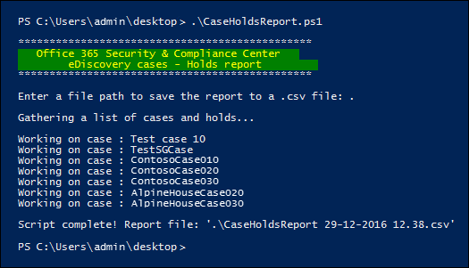

# <a name="create-a-report-on-holds-in-ediscovery-cases"></a>Criar um relatório sobre retenções em ocorrências de Descoberta eletrônica

O script neste artigo permite que os administradores de Descobertas e Gerentes de Descobertas De eDiscovery gerem um relatório que contém informações sobre todas as reações associadas a ocorrências de Descoberta e No centro de conformidade no Office 365 ou no Microsoft 365. O relatório contém informações como o nome da ocorrência à que uma isenção está associada, os locais de conteúdo que são colocados em espera e se a isenção é baseada em consulta. Se houver casos que não tenham retém, o script criará um relatório adicional com uma lista de casos sem retém.

Consulte a [seção Mais](#more-information) informações para obter uma descrição detalhada das informações incluídas no relatório.

## <a name="admin-requirements-and-script-information"></a>Requisitos de administrador e informações de script

- Para gerar um relatório sobre todas as ocorrências de Descobertas Na sua organização, você precisa ser Um Administrador de Descobertas Na sua organização. Se você for um Gerente de Descoberta eDiscovery, o relatório incluirá apenas informações sobre os casos que você pode acessar. Para obter mais informações sobre permissões de Descoberta eDiscovery, consulte [Assign eDiscovery permissions](assign-ediscovery-permissions.md).

- O script neste artigo tem tratamento mínimo de erros. O objetivo principal é criar rapidamente um relatório sobre as isenções que estão associadas aos casos de Descoberta eDiscovery em sua organização.

- Os scripts de exemplo fornecidos neste tópico não são compatíveis com nenhum serviço ou programa de suporte padrão da Microsoft. Os scripts de exemplo são fornecidos COMO ESTÃO sem qualquer tipo de garantia. A Microsoft também se isenta de todas as garantias implícitas, incluindo sem limitações quaisquer garantias aplicáveis de padrões de comercialização ou de adequação a uma finalidade específica. Todos os riscos decorrentes do uso ou da execução da documentação ou scripts de exemplo serão de sua responsabilidade. De modo algum a Microsoft, seus autores ou qualquer outra pessoa envolvida na criação, produção ou veiculação dos scripts serão considerados responsáveis por quaisquer danos (incluindo sem limitações danos por perda de lucros comerciais, interrupção de negócios, perda de informações comerciais ou outras perdas pecuniárias) resultantes do uso ou da incapacidade de uso da documentação ou scripts de exemplo, mesmo que a Microsoft tenha sido alertada sobre a possibilidade de tais danos.

## <a name="step-1-connect-to-the-security--compliance-center-powershell"></a>Etapa 1: Conectar-se ao PowerShell do Centro de Conformidade & segurança

A primeira etapa é conectar-se ao PowerShell do Centro de & Conformidade e Segurança da sua organização. Para obter instruções passo a passo, confira [Conectar-se ao Centro de Segurança e Conformidade no PowerShell](https://docs.microsoft.com/powershell/exchange/connect-to-scc-powershell).

## <a name="step-2-run-the-script-to-report-on-holds-associated-with-ediscovery-cases"></a>Etapa 2: Executar o script para relatar resções associadas a casos de Descoberta

Depois de & se conectar ao PowerShell do Centro de Conformidade e Segurança, a próxima etapa é criar e executar o script que coleta informações sobre os casos de Descoberta eDiscovery em sua organização.

1. Salve o texto a seguir em um arquivo de script do Windows PowerShell usando um sufixo de nome de arquivo .ps1; por exemplo, CaseHoldsReport.ps1.

   ```powershell
   #script begin
   " "
   write-host "***********************************************"
   write-host "   Security & Compliance Center   " -foregroundColor yellow -backgroundcolor darkgreen
   write-host "        eDiscovery cases - Holds report         " -foregroundColor yellow -backgroundcolor darkgreen
   write-host "***********************************************"
   " "
   #prompt users to specify a path to store the output files
   $time=get-date
   $Path = Read-Host 'Enter a file path to save the report to a .csv file'
   $outputpath=$Path+'\'+'CaseHoldsReport'+' '+$time.day+'-'+$time.month+'-'+$time.year+' '+$time.hour+'.'+$time.minute+'.csv'
   $noholdsfilepath=$Path+'\'+'CaseswithNoHolds'+' '+$time.day+'-'+$time.month+'-'+$time.year+' '+$time.hour+'.'+$time.minute+'.csv'
   #add case details to the csv file
   function add-tocasereport{
   Param([string]$casename,
   [String]$casestatus,
   [datetime]$casecreatedtime,
   [string]$casemembers,
   [datetime]$caseClosedDateTime,
   [string]$caseclosedby,
   [string]$holdname,
   [String]$Holdenabled,
   [string]$holdcreatedby,
   [string]$holdlastmodifiedby,
   [string]$ExchangeLocation,
   [string]$sharePointlocation,
   [string]$ContentMatchQuery,
   [datetime]$holdcreatedtime,
   [datetime]$holdchangedtime
   )
   $addRow = New-Object PSObject
   Add-Member -InputObject $addRow -MemberType NoteProperty -Name "Case name" -Value $casename
   Add-Member -InputObject $addRow -MemberType NoteProperty -Name "Case status" -Value $casestatus
   Add-Member -InputObject $addRow -MemberType NoteProperty -Name "Case members" -Value $casemembers
   Add-Member -InputObject $addRow -MemberType NoteProperty -Name "Case created time" -Value $casecreatedtime
   Add-Member -InputObject $addRow -MemberType NoteProperty -Name "Case closed time" -Value $caseClosedDateTime
   Add-Member -InputObject $addRow -MemberType NoteProperty -Name "Case closed by" -Value $caseclosedby
   Add-Member -InputObject $addRow -MemberType NoteProperty -Name "Hold name" -Value $holdname
   Add-Member -InputObject $addRow -MemberType NoteProperty -Name "Hold enabled" -Value $Holdenabled
   Add-Member -InputObject $addRow -MemberType NoteProperty -Name "Hold created by" -Value $holdcreatedby
   Add-Member -InputObject $addRow -MemberType NoteProperty -Name "Hold last changed by" -Value $holdlastmodifiedby
   Add-Member -InputObject $addRow -MemberType NoteProperty -Name "Exchange locations" -Value  $ExchangeLocation
   Add-Member -InputObject $addRow -MemberType NoteProperty -Name "SharePoint locations" -Value $sharePointlocation
   Add-Member -InputObject $addRow -MemberType NoteProperty -Name "Hold query" -Value $ContentMatchQuery
   Add-Member -InputObject $addRow -MemberType NoteProperty -Name "Hold created time (UTC)" -Value $holdcreatedtime
   Add-Member -InputObject $addRow -MemberType NoteProperty -Name "Hold changed time (UTC)" -Value $holdchangedtime
   $allholdreport = $addRow | Select-Object "Case name","Case status","Hold name","Hold enabled","Case members", "Case created time","Case closed time","Case closed by","Exchange locations","SharePoint locations","Hold query","Hold created by","Hold created time (UTC)","Hold last changed by","Hold changed time (UTC)"
   $allholdreport | export-csv -path $outputPath -notypeinfo -append -Encoding ascii
   }
   #get information on the cases and pass values to the case report function
   " "
   write-host "Gathering a list of cases and holds..."
   " "
   $edc =Get-ComplianceCase -ErrorAction SilentlyContinue
   foreach($cc in $edc)
   {
   write-host "Working on case :" $cc.name
   if($cc.status -eq 'Closed')
   {
   $cmembers = ((Get-ComplianceCaseMember -Case $cc.name).windowsLiveID)-join ';'
   add-tocasereport -casename $cc.name -casestatus $cc.Status -caseclosedby $cc.closedby -caseClosedDateTime $cc.ClosedDateTime -casemembers $cmembers
   }
   else{
   $cmembers = ((Get-ComplianceCaseMember -Case $cc.name).windowsLiveID)-join ';'
   $policies = Get-CaseHoldPolicy -Case $cc.Name | %{ Get-CaseHoldPolicy $_.Name -Case $_.CaseId -DistributionDetail}
   if ($policies -ne $NULL)
   {
   foreach ($policy in $policies)
   {
   $rule=Get-CaseHoldRule -Policy $policy.name
   add-tocasereport -casename $cc.name -casemembers $cmembers -casestatus $cc.Status -casecreatedtime $cc.CreatedDateTime -holdname $policy.name -holdenabled $policy.enabled -holdcreatedby $policy.CreatedBy -holdlastmodifiedby $policy.LastModifiedBy -ExchangeLocation (($policy.exchangelocation.name)-join ';') -SharePointLocation (($policy.sharePointlocation.name)-join ';') -ContentMatchQuery $rule.ContentMatchQuery -holdcreatedtime $policy.WhenCreatedUTC -holdchangedtime $policy.WhenChangedUTC
   }
   }
   else{
   write-host "No hold policies found in case:" $cc.name -foregroundColor 'Yellow'
   " "
   [string]$cc.name | out-file -filepath $noholdsfilepath -append
   }
   }
   }

   " "
   Write-host "Script complete! Report files saved to this folder: '$Path'"
   " "
   #script end
   ```

2. Na sessão do Windows PowerShell aberta na Etapa 1, vá para a pasta onde você salvou o script.

3. Execute o script; por exemplo:

   ```powershell
   .\CaseHoldsReport.ps1
   ```

   O script solicitará uma pasta de destino para salvar o relatório.

4. Digite o nome do caminho completo da pasta para salvar o relatório e pressione **Enter**.

   > [!TIP]
   > Para salvar o relatório na mesma pasta em que o script está localizado, digite um ponto (".") quando solicitado a uma pasta de destino. Para salvar o relatório em uma subpasta na pasta onde o script está localizado, basta digitar o nome da subpasta.

   O script começa a coletar informações sobre todos os casos de Descoberta eDiscovery em sua organização. Não acesse o arquivo de relatório enquanto o script estiver em execução. Depois que o script for concluído, uma mensagem de confirmação será exibida na sessão do Windows PowerShell. Depois que essa mensagem for exibida, você poderá acessar o relatório na pasta especificada na Etapa 4. O nome do arquivo para o relatório é `CaseHoldsReport<DateTimeStamp>.csv` .

   Além disso, o script também cria um relatório com uma lista de casos que não têm retém. O nome do arquivo para este relatório é `CaseswithNoHolds<DateTimeStamp>.csv` .

   Aqui está um exemplo de execução do script CaseHoldsReport.ps1 script.

   

## <a name="more-information"></a>Mais informações

O relatório de ocorrências criado quando você executar o script neste artigo contém as seguintes informações sobre cada espera. Conforme explicado anteriormente, você precisa ser um Administrador de Descobertas e Para retornar informações sobre todas as retém em sua organização. Para obter mais informações sobre retém de caso, consulte [ocorrências de Descoberta eDiscovery](ediscovery-cases.md).

- O nome da isenção e o nome da ocorrência de Descoberta e à que a isenção está associada.

- Se o caso de Descoberta eDiscovery está ativo ou fechado.

- Se a espera está habilitada ou desabilitada ou não.

- Os membros da ocorrência de Descoberta e à que a isenção está associada. Os membros da ocorrência podem exibir ou gerenciar uma ocorrência, dependendo das permissões de Descoberta eDiscovery que eles foram atribuídos.

- A hora e a data em que o caso foi criado.

- Se um caso for fechado, a pessoa que o fechou e a hora e a data em que foi fechado.

- As caixas de correio do Exchange e locais de sites do SharePoint que estão em espera.

- Se a isenção for baseada em consulta, a sintaxe da consulta.

- A hora e a data em que a espera foi criada e a pessoa que a criou.

- A hora e a data em que a espera foi alterada pela última vez e a pessoa que o alterou.
