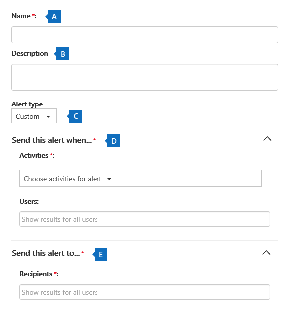

# Criar alertas de atividade

Você pode criar um alerta de atividade que enviará uma notificação de email quando os usuários executarem atividades específicas Office 365. Alertas de atividade são semelhantes à pesquisa de eventos no log de auditoria, exceto que você será enviado uma mensagem de email quando um evento para uma atividade que você criou um alerta acontecer. 
  
 **Por que usar alertas de atividade em vez de pesquisar o log de auditoria?** Pode haver certos tipos de atividade ou atividade executadas por usuários específicos que você realmente deseja conhecer. Em vez de ter que lembrar de pesquisar no log de auditoria para essas atividades, você pode usar alertas de atividade para enviar Microsoft 365 mensagem de email quando os usuários executarem essas atividades. Por exemplo, você pode criar um alerta de atividade para notificá-lo quando um usuário excluir arquivos no SharePoint ou você pode criar um alerta para notificá-lo quando um usuário excluir permanentemente mensagens de sua caixa de correio. A notificação de email enviada a você inclui informações sobre qual atividade foi executada e o usuário que a realizou.

> [!NOTE]
> Os alertas de atividade estão sendo preterido. Recomendamos que você comece a usar políticas de alerta no centro de segurança e conformidade em vez de criar novos alertas de atividade. As políticas de alerta fornecem funcionalidade de adição, como a capacidade de criar uma política de alerta que dispara um alerta quando qualquer usuário executa uma atividade especificada e exibe alertas na página Exibir **alertas** no centro de conformidade e segurança. Para obter mais informações, consulte [Políticas de alerta.](alert-policies.md)
  
## Confirmar funções e configurar o log de auditoria

- Você deve receber a função Configuração da Organização no Centro de Conformidade & Segurança para gerenciar alertas de atividade. Por padrão, essa função é atribuída aos grupos de função Administrador de Conformidade e Gerenciamento da Organização. Para obter mais informações sobre como adicionar membros a grupos de funções, consulte [Give users access to the Security & Compliance Center](../security/defender-365-security/grant-access-to-the-security-and-compliance-center.md).
    
- Você (ou outro administrador) deve primeiro ativar o log de auditoria para sua organização antes de começar a usar alertas de atividade. Para fazer isso, basta clicar em **Iniciar o registro da** atividade do usuário e do administrador na página **Alertas de** atividade. (Se você não vir esse link, a auditoria já foi responsabilidade da sua organização.) Você também pode ativar a auditoria na página de pesquisa de **log** de auditoria no Centro de Conformidade & Segurança (acesse **Pesquisa** \> **de log de auditoria**). Você só precisa fazer isso uma vez para sua organização.
  
- Você pode criar alertas para as mesmas atividades que você pode pesquisar no log de auditoria. Consulte a [seção Mais informações](#more-information) para obter uma lista de cenários comuns (e a atividade específica a ser monitorada) para a que você pode criar alertas. 
    
- Você pode usar a página Alertas de atividade no Centro de Conformidade & segurança para criar alertas somente para atividades realizadas por usuários **listados** no livro de endereços da sua organização. Você não pode usar essa página para criar alertas para atividades realizadas por usuários externos que não estão listados no livro de endereços. 
    
## Criar um alerta de atividade

1. Acesse [https://protection.office.com/managealerts](https://protection.office.com/managealerts).
    
2. Entre usando sua conta de trabalho ou da escola.
    
3. Na página **Alertas de atividade,** clique em  **Novo**.

   A página de sobrevoo para criar um alerta de atividade é exibida.

    
    
  
4. Conclua os seguintes campos para criar um alerta de atividade:
    
    a. **Nome** - Digite um nome para o alerta. Os nomes de alerta devem ser exclusivos em sua organização.
    
    b. **Descrição** (Opcional) - Descreva o alerta, como as atividades e os usuários que estão sendo rastreados, e os usuários para os que as notificações de email são enviadas. As descrições fornecem uma maneira rápida e fácil de descrever a finalidade do alerta para outros administradores.
    
    c. **Tipo de alerta** - Certifique-se de **que a opção Custom** está selecionada. 

    d. **Enviar esse alerta quando** - Clique em **Enviar esse alerta quando** e configure estes dois campos:
    
    - **Atividades** - Clique na listada para exibir as atividades para as que você pode criar um alerta. Essa é a mesma lista de atividades exibida quando você pesquisa o log de auditoria. Você pode selecionar uma ou mais atividades específicas ou clicar no nome do grupo de atividades para selecionar todas as atividades no grupo. Para uma descrição dessas atividades, consulte a seção "Atividades auditadas" em [Pesquisar o log de auditoria](search-the-audit-log-in-security-and-compliance.md#audited-activities). Quando um usuário executa qualquer uma das atividades que você adicionou ao alerta, uma notificação de email é enviada. 
    
     - **Usuários** - Clique nesta caixa e selecione um ou mais usuários. Se os usuários nesta caixa executarem as atividades adicionadas à caixa **Atividades,** um alerta será enviado. Deixe a **caixa Usuários** em branco para enviar um alerta quando qualquer usuário em sua organização executar as atividades especificadas pelo alerta. 

    e. Enviar esse alerta para - Clique em Enviar esse alerta e clique na caixa **Destinatários** e digite um nome para adicionar um usuário que receberá uma  notificação de email quando um usuário (especificado na caixa **Usuários)** executar uma atividade (especificada na caixa Atividades).   Observe que você foi adicionado à lista de destinatários por padrão. Você pode remover seu nome dessa lista.
    
5. Clique **em Salvar** para criar o alerta. 
    
    O novo alerta é exibido na lista na página **Alertas de** atividade. 
    
    
  
    O status do alerta é definido como **On**. Observe que os destinatários que receberão uma notificação de email quando um alerta for enviado também estão listados. 
  
## Desativar um alerta de atividade

Você pode desativar um alerta de atividade para que uma notificação de email não seja enviada. Depois de desativar o alerta de atividade, ele ainda será exibido na lista de alertas de atividade para sua organização e você ainda poderá exibir suas propriedades.
  
1. Vá para Ir para [https://protection.office.com/managealerts](https://protection.office.com/managealerts) .
    
2. Entre usando sua conta de trabalho ou da escola.
    
3. Na lista de alertas de atividade para sua organização, clique no alerta que você deseja desativar.
    
4. Na página **Editar alerta,** clique na opção **Ao** alternar para alterar o status para **Off** e clique em **Salvar**.
    
    O status do alerta nas páginas **alertas de** atividade está definido como **Off**. 
    
Para ativar novamente um alerta de atividade, repita estas etapas e clique no botão Desativar **para** alterar o status para **Ligado.**
  
## Mais informações

- Aqui está um exemplo da notificação de email que é enviada aos usuários especificados no campo Enviado este alerta para (e listado em **Destinatários** na página **Alertas** de atividade ) no Centro de Conformidade & Segurança. 
    
    
  
- Aqui estão algumas atividades comuns de documento e email para as que você pode criar alertas de atividade. As tabelas descrevem a atividade, o nome da atividade para a criação de um alerta e  o nome do grupo de atividades em que a atividade está listada na listada atividades. Para ver uma lista completa das atividades para as que você pode criar alertas de atividade, consulte a seção "Atividades auditadas" em [Pesquisar o log de auditoria](search-the-audit-log-in-security-and-compliance.md#audited-activities).
    
    > [!TIP]
    > Talvez você queira criar um alerta de atividade para apenas uma atividade executada por qualquer usuário. Ou talvez você queira criar um alerta de atividade que acompanhe várias atividades executadas por um ou mais usuários. 
  
    A tabela a seguir lista algumas atividades comuns relacionadas a documentos SharePoint ou OneDrive for Business.
    
    |**Quando um usuário faz isso...**|**Criar um alerta para essa atividade**|**Grupo de atividades**|
    |:-----|:-----|:-----|
    |Visualiza um documento em um site.    |Arquivo acessado    |Atividades de arquivo e pasta    |
    |Edita ou altera um documento.    |Arquivo modificado    |Atividades de arquivo e pasta    |
    |Compartilha um documento com um usuário fora da sua organização.    |Compartilhar arquivo, pasta ou site    And    Convite de compartilhamento criado    Para saber mais, veja [Usar a auditoria de compartilhamento no log de auditoria](use-sharing-auditing.md).    |Atividades de compartilhamento e solicitação de acesso    |
    |Carrega ou baixa um documento.    |Arquivo carregado    E/ou    Arquivo baixado    |Atividades de arquivo e pasta    |
    |Altera as permissões de acesso para um site.    |Permissões de site modificadas    |Atividades de administração do site    |

    A tabela a seguir lista algumas atividades comuns relacionadas a email Exchange Online.

    |**Quando um usuário faz isso...**|**Criar um alerta para essa atividade**|**Grupo de atividades**|
    |:-----|:-----|:-----|
    |Exclui permanentemente (limpa) uma mensagem de email de sua caixa de correio.    |Mensagens limpas da caixa de correio    | Atividades de caixa de correio do Exchange    |
    |Envia uma mensagem de email de uma caixa de correio compartilhada.    |Mensagem enviada com permissões Enviar Como    And    Mensagem enviada com permissões Enviar em Nome de    | Atividades de caixa de correio do Exchange    |
   
- Você também pode usar os cmdlet & s **New-ActivityAlert** e **Set-ActivityAlert** no Centro de Conformidade e Segurança do PowerShell para criar e editar alertas de atividade. Lembre-se das seguintes coisas se você usar esses cmdlets para criar ou editar alertas de atividade: 
    
  - Se você usar um cmdlet para adicionar uma atividade ao  alerta que não está listado na listada Atividades, uma mensagem será exibida na página de propriedades do alerta que diz: "Esse alerta tem operações personalizadas não listadas no seletor". 
    
  - Um bom motivo para usar os cmdlets para criar ou editar um alerta de atividade é enviar notificações por email para alguém de fora da sua organização. Esse usuário externo será listado na lista de destinatários do alerta. Mas se você remover esse usuário externo do alerta, esse usuário não poderá ser adicionado ao alerta usando a página **Editar alerta.** Você terá que adicionar o usuário externo usando o cmdlet **Set-ActivityAlert** ou usar o cmdlet **New-ActivityAlert** para adicionar o mesmo (ou diferente) usuário externo a um novo alerta. 
