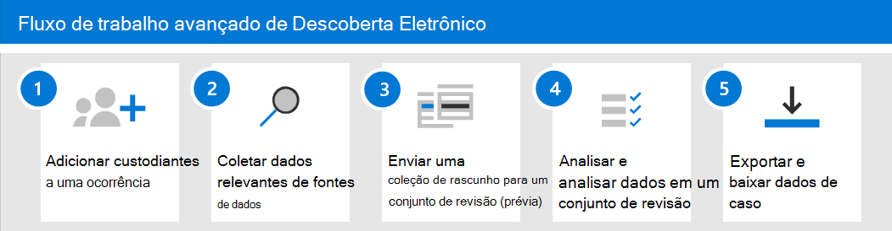

# Criar e gerenciar um Advanced eDiscovery caso

Depois de configurar o Advanced eDiscovery e atribuir permissões aos gerentes de [Descobertas EDiscovery](get-started-with-advanced-ediscovery.md#step-2-assign-ediscovery-permissions) em sua organização que gerenciarão casos, a próxima etapa é criar e gerenciar um caso.

Este artigo também fornece uma visão geral de alto nível do uso de casos para gerenciar o fluxo de trabalho Advanced eDiscovery para um caso legal ou outros tipos de investigações.

## Criar um caso

Conclua as etapas a seguir para criar uma ocorrência e adicionar membros. O usuário que cria a ocorrência é adicionado automaticamente como membro. Os membros do caso podem acessar o caso no centro de conformidade Microsoft 365 e executar Advanced eDiscovery tarefas.

1. Acesse e entre usando as credenciais da conta de usuário que foram atribuídas permissões <https://compliance.microsoft.com> de Descoberta e. Membros do grupo de função Gerenciamento da Organização também podem criar Advanced eDiscovery casos.

2. No painel de navegação esquerdo do Centro de Conformidade do Microsoft 365, clique em **Mostrar tudo** e, a seguir, clique em **Descoberta Eletrônica > Avançada**.

3. Na página **Advanced eDiscovery,** clique na guia **Casos** e clique em **Criar um caso**.

4. Na página **Sobrevoo** de caso de Descoberta Nova Descoberta, dê ao caso um nome (necessário) e digite um número de caso opcional e uma descrição. O nome do caso deve ser exclusivo em sua organização.

5. Clique **em Salvar** para criar o caso.

   O novo caso é criado e a **guia Configurações** no novo caso é exibida.

6. No & **de** permissões do Access na **guia** Configurações, clique em **Selecionar**.

7. Na página **Gerenciar o** sub-subsistência desta ocorrência, em **Gerenciar membros,** clique em **Adicionar** para adicionar membros ao caso.

8. Na lista de pessoas, marque a caixa de seleção ao lado dos nomes das pessoas que você deseja adicionar ao caso. Como explicado anteriormente, certifique-se de que as pessoas que você adicionar ao caso tenham sido atribuídas às permissões de Descoberta eDiscoveria apropriadas.

9. Depois de selecionar as pessoas a adicionar como membros da ocorrência, clique em **Adicionar**.

10. No submenu de página **Gerenciar esse caso**, clique em **Salvar** para salvar uma nova lista de membros de caso. 

11. Clique na **guia Página** Inicial para ir para a home page do caso.

## Gerenciar o fluxo de trabalho

Para começar a usar Advanced eDiscovery, veja um fluxo de trabalho básico que se alinha às práticas [comuns de Descoberta Eletrônico.](advanced-ediscovery-edrm.md) Em cada uma dessas etapas, também destacaremos algumas funcionalidades Advanced eDiscovery que você pode explorar.

1. **[Adicione os custodiantes](add-custodians-to-case.md) e fontes de dados não [custodiais](non-custodial-data-sources.md) ao caso**. A primeira etapa após a criação de um caso é adicionar custodiantes. Um *custodiante* é uma pessoa que tem controle administrativo de um documento ou arquivo eletrônico que pode ser relevante para o caso. Além disso, você pode adicionar fontes de dados que não estão associadas a um usuário específico, mas que podem ser relevantes para o caso.

   Aqui estão algumas coisas que ocorrem (ou que você pode fazer) quando você adiciona os custodiantes a um caso:

   - Os dados na caixa de correio de Exchange do custodiante, OneDrive conta e qualquer grupo Microsoft Teams ou Yammer dos Yammer dos que o custodiante é membro podem ser "marcados" como dados de custodia no caso.
  
   - Os dados custodiados são reindexados (por um processo chamado *indexação avançada*). Isso ajuda a otimizar a pesquisa na próxima etapa.
  
   - Você pode colocar uma espera nos dados de custodiante. Isso preserva dados que podem ser relevantes para o caso durante a investigação.
  
   - Você pode associar outras fontes de dados a um custodiante (por exemplo, você pode associar um site do SharePoint ou um grupo Microsoft 365 a um custodiante) para que esses dados possam ser reindexados, colocados em espera e pesquisados, assim como os dados na caixa de correio do custodiante ou na conta OneDrive.

   - Você pode usar o fluxo [de trabalho](managing-custodian-communications.md) de comunicações Advanced eDiscovery enviar uma notificação de espera legal aos custodiantes.

2. **[Coletar conteúdo relevante de fontes de dados](create-draft-collection.md)**. Depois de adicionar os custodiantes e as fontes de dados não custodiais a uma ocorrência, use a ferramenta de coletas integrados para pesquisar essas fontes de dados em busca de conteúdo que possa ser relevante para o caso. Você usa palavras-chave, propriedades  e condições para criar consultas de pesquisa que retornam resultados de pesquisa com os dados que provavelmente são relevantes para o caso. Você também pode:

   - Exibir [estatísticas de coleção que](collection-statistics-reports.md) podem ajudá-lo a refinar uma coleção para restringir os resultados.

   - Visualize um exemplo da coleção para verificar rapidamente se os dados relevantes estão sendo encontrados.

   - Revise uma consulta e reprise a coleção.

3. **[Commit collection to a review set](commit-draft-collection.md)**. Depois de configurar e verificar se uma pesquisa retorna os dados desejados, a próxima etapa é adicionar os resultados da pesquisa a um conjunto de revisão. Quando você adiciona dados a um conjunto de revisão, os itens são copiados de seu local original para um local seguro do Azure Armazenamento local. Os dados são reindexados novamente para otimisá-los para pesquisas completas e rápidas ao analisar e analisar itens no conjunto de revisão. Além disso, você também pode [adicionar dados não Office 365 em um conjunto de revisão.](load-non-office-365-data-into-a-review-set.md)

   Também há um tipo especial de conjunto de revisão ao qual você pode adicionar dados, chamado de conjunto de revisão *de conversa.* Esses tipos de conjuntos de análises fornecem recursos de reconstrução de conversa para reconstruir, revisar e exportar conversas encadeadas como aquelas em Microsoft Teams. Para obter mais informações, [consulte Review conversations in Advanced eDiscovery](conversation-review-sets.md).

4. **Analisar e analisar dados em um conjunto de revisão.** Agora que os dados estão em um conjunto de revisão, você pode usar uma ampla variedade de ferramentas e recursos para exibir e analisar os dados de caso com o objetivo de reduzir o conjunto de dados para o que é mais relevante para o caso que você está investigando. Aqui está uma lista de algumas ferramentas e recursos que você pode usar durante esse processo.

   - [Exibir documentos](view-documents-in-review-set.md). Isso inclui a exibição dos metadados de cada documento em um conjunto de revisão e a exibição do documento em sua versão nativa ou versão de texto.

   - [Criar consultas e filtros](review-set-search.md). Você cria consultas de pesquisa usando vários critérios de pesquisa (incluindo a capacidade de pesquisar todas as propriedades de [metadados](document-metadata-fields-in-advanced-ediscovery.md)de arquivo ) para refinar ainda mais e excluir os dados de caso para o que é mais relevante para o caso. Você também pode usar filtros de conjunto de revisão para aplicar rapidamente outras condições aos resultados de uma consulta de pesquisa para refinar ainda mais esses resultados. 

   - [Criar e usar marcas](tagging-documents.md). Você pode aplicar marcas a documentos em um conjunto de revisão para identificar quais são responsivos (ou não respondendo ao caso) e, em seguida, usar essas marcas ao criar consultas de pesquisa para incluir ou excluir os documentos marcados. Você também pode marcar para determinar quais documentos serão exportados.

   - [Anotar e redactar documentos](view-documents-in-review-set.md#annotate-view). Você pode usar a ferramenta de anotação em uma revisão para anotar documentos e rediscar o conteúdo em documentos como produto de trabalho. Geramos uma versão em PDF de um documento anotado ou editado durante a revisão para reduzir o risco de exportar a versão nativa não editada do documento.

   - [Analisar dados de caso](analyzing-data-in-review-set.md). A funcionalidade de análise no Advanced eDiscovery é poderosa. Depois de executar análises nos dados no conjunto de revisão, realizamos análises como detecção quase duplicada, threading de email e temas que podem ajudar a reduzir o volume de documentos que você precisa revisar. Também geramos relatórios do Analytics que resumem o resultado da execução da análise. Como explicado anteriormente, a execução da análise também executa o modelo de detecção de privilégio [advogado-cliente.](attorney-privilege-detection.md#use-the-attorney-client-privilege-detection-model)

5. **Exportar e baixar dados de caso.** Uma etapa final após coletar, analisar e analisar dados de caso é exportá-los para fora do Advanced eDiscovery para revisão externa ou para revisão por pessoas fora da equipe de investigação. Exportar dados é um processo de duas etapas. A primeira etapa é [exportar](export-documents-from-review-set.md) dados do conjunto de revisão e copiá-lo para um local Armazenamento do Azure diferente (um fornecido pela Microsoft ou um gerenciado pela sua organização). Em seguida, use Gerenciador de Armazenamento do Azure [para baixar](download-export-jobs.md) os dados para um computador local. Além dos arquivos de dados exportados, o contém do pacote de exportação também contém um relatório de exportação, um relatório de resumo e um relatório de erro.

## Advanced eDiscovery arquitetura

Aqui está um diagrama de arquitetura que mostra o fluxo de trabalho Advanced eDiscovery de ponta a ponta em um ambiente de geo único e em um ambiente multi-geo, e o fluxo de dados de ponta a ponta alinhado com o Modelo de Referência de Descoberta Eletrônica [.](overview-ediscovery-20.md#advanced-ediscovery-alignment-with-the-electronic-discovery-reference-model)

[Exibir como uma imagem](../media/solutions-architecture-center/m365-advanced-ediscovery-architecture.png)

[Baixar como um arquivo PDF](https://download.microsoft.com/download/d/1/c/d1ce536d-9bcf-4d31-b75b-fcf0dc560665/m365-advanced-ediscovery-architecture.pdf)

[Baixar como um arquivo Visio arquivo](https://download.microsoft.com/download/d/1/c/d1ce536d-9bcf-4d31-b75b-fcf0dc560665/m365-advanced-ediscovery-architecture.vsdx)
