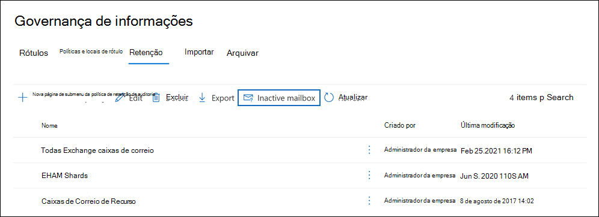
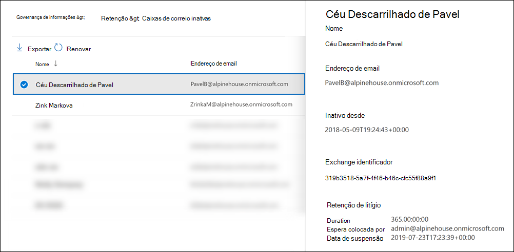

# <a name="create-and-manage-inactive-mailboxes"></a><span data-ttu-id="b61ce-103">Criar e gerenciar caixas de correio inativas</span><span class="sxs-lookup"><span data-stu-id="b61ce-103">Create and manage inactive mailboxes</span></span>

<span data-ttu-id="b61ce-104">Microsoft 365 torna possível manter o conteúdo das caixas de correio excluídas.</span><span class="sxs-lookup"><span data-stu-id="b61ce-104">Microsoft 365 makes it possible for you to retain the contents of deleted mailboxes.</span></span> <span data-ttu-id="b61ce-105">Esse recurso é chamado de [caixas de correio inativas](inactive-mailboxes-in-office-365.md).</span><span class="sxs-lookup"><span data-stu-id="b61ce-105">This feature is called [inactive mailboxes](inactive-mailboxes-in-office-365.md).</span></span> <span data-ttu-id="b61ce-106">Caixas de correio inativas permitem que você retenha os emails de ex-funcionários depois que eles saem da sua organização.</span><span class="sxs-lookup"><span data-stu-id="b61ce-106">Inactive mailboxes allow you to retain former employees' email after they leave your organization.</span></span> <span data-ttu-id="b61ce-107">Uma caixa de correio fica inativa quando uma Retenção de Litígio ou uma política de retenção (criada no centro de segurança e conformidade no Office 365 ou Microsoft 365) é aplicada à caixa de correio antes que a conta de usuário correspondente seja excluída.</span><span class="sxs-lookup"><span data-stu-id="b61ce-107">A mailbox becomes inactive when a Litigation Hold or a retention policy (created in the security and compliance center in Office 365 or Microsoft 365) is applied to the mailbox before the corresponding user account is deleted.</span></span> <span data-ttu-id="b61ce-108">O conteúdo de uma caixa de correio inativa é mantido durante a espera que foi colocada na caixa de correio antes de ser inativa.</span><span class="sxs-lookup"><span data-stu-id="b61ce-108">The contents of an inactive mailbox are retained for the duration of the hold that was placed on the mailbox before it was made inactive.</span></span> <span data-ttu-id="b61ce-109">Isso permite que administradores, gerentes de conformidade e gerentes de registros usem a Pesquisa de Conteúdo para pesquisar e exportar o conteúdo de uma caixa de correio inativa.</span><span class="sxs-lookup"><span data-stu-id="b61ce-109">This allows administrators, compliance officers, and records managers to use Content Search to search and export the contents of an inactive mailbox.</span></span> <span data-ttu-id="b61ce-110">As caixas de correio inativas não podem receber emails e não são exibidas no catálogo de endereços compartilhados da sua organização ou em outras listas.</span><span class="sxs-lookup"><span data-stu-id="b61ce-110">Inactive mailboxes can't receive email and aren't displayed in your organization's shared address book or other lists.</span></span>
  
> [!IMPORTANT]
> <span data-ttu-id="b61ce-111">À medida que continuamos a investir em diferentes maneiras de preservar o conteúdo da caixa de correio, anunciamos a ress contração de In-Place no centro de administração Exchange.</span><span class="sxs-lookup"><span data-stu-id="b61ce-111">As we continue to invest in different ways to preserve mailbox content, we're announcing the retirement of In-Place Holds in the Exchange admin center.</span></span> <span data-ttu-id="b61ce-112">Isso significa que você deve usar as Políticas de Retenção e Retenção de Litígio para criar uma caixa de correio inativa.</span><span class="sxs-lookup"><span data-stu-id="b61ce-112">That means you should use Litigation Holds and retention policies to create an inactive mailbox.</span></span> <span data-ttu-id="b61ce-113">A partir de 1º de julho de 2020, você não poderá criar novos In-Place de Exchange Online.</span><span class="sxs-lookup"><span data-stu-id="b61ce-113">Starting July 1, 2020 you won't be able to create new In-Place Holds in Exchange Online.</span></span> <span data-ttu-id="b61ce-114">Mas você ainda poderá alterar a duração de espera de uma In-Place de espera colocada em uma caixa de correio inativa.</span><span class="sxs-lookup"><span data-stu-id="b61ce-114">But you'll still be able to change the hold duration of an In-Place Hold placed on an inactive mailbox.</span></span> <span data-ttu-id="b61ce-115">No entanto, a partir de 1º de outubro de 2020, você não poderá alterar a duração da espera.</span><span class="sxs-lookup"><span data-stu-id="b61ce-115">However, starting October 1, 2020, you won't be able to change the hold duration.</span></span> <span data-ttu-id="b61ce-116">Você só poderá excluir uma caixa de correio inativa removendo o In-Place Hold.</span><span class="sxs-lookup"><span data-stu-id="b61ce-116">You'll only be able to delete an inactive mailbox by removing the In-Place Hold.</span></span> <span data-ttu-id="b61ce-117">As caixas de correio inativas existentes que estão em In-Place de espera ainda serão preservadas até que a espera seja removida.</span><span class="sxs-lookup"><span data-stu-id="b61ce-117">Existing inactive mailboxes that are on In-Place Hold will still be preserved until the hold is removed.</span></span> <span data-ttu-id="b61ce-118">Para obter mais informações sobre a aposentadoria de In-Place Detém, consulte A aposentadoria de ferramentas [de Descoberta eDiscovery herdado.](legacy-ediscovery-retirement.md)</span><span class="sxs-lookup"><span data-stu-id="b61ce-118">For more information about the retirement of In-Place Holds, see [Retirement of legacy eDiscovery tools](legacy-ediscovery-retirement.md).</span></span>
  
## <a name="preparations-before-creating-an-inactive-mailbox"></a><span data-ttu-id="b61ce-119">Preparações antes de criar uma caixa de correio inativa</span><span class="sxs-lookup"><span data-stu-id="b61ce-119">Preparations before creating an inactive mailbox</span></span>

- <span data-ttu-id="b61ce-120">Para tornar uma caixa de correio inativa, ela deve receber uma licença Exchange Online Plano 2 para que uma Retenção de Litígio ou uma política de retenção possa ser aplicada à caixa de correio antes de ser excluída.</span><span class="sxs-lookup"><span data-stu-id="b61ce-120">To make a mailbox inactive, it must be assigned an Exchange Online Plan 2 license so that a Litigation Hold or a retention policy can be applied to the mailbox before it's deleted.</span></span> <span data-ttu-id="b61ce-121">Exchange Online As licenças do Plano 2 fazem parte de uma assinatura Office 365 Enterprise E3 e E5.</span><span class="sxs-lookup"><span data-stu-id="b61ce-121">Exchange Online Plan 2 licenses are part of an Office 365 Enterprise E3 and E5 subscription.</span></span> <span data-ttu-id="b61ce-122">Se uma caixa de correio for atribuída a uma licença de Exchange Online Plano 1 ou Exchange Online Kiosk (que fazem parte de uma assinatura do Office 365 E1 e F1, respectivamente), você terá que atribuí-la uma licença de Arquivamento do Exchange Online separada para que uma responsabilidade possa ser aplicada à caixa de correio antes de ser excluída.</span><span class="sxs-lookup"><span data-stu-id="b61ce-122">If a mailbox is assigned an Exchange Online Plan 1 or Exchange Online Kiosk license (which are part of an Office 365 E1 and F1 subscription respectively), you would have to assign it a separate Exchange Online Archiving license so that a hold can be applied to the mailbox before it's deleted.</span></span> <span data-ttu-id="b61ce-123">Para saber mais, confira [Arquivamento do Exchange Online](https://go.microsoft.com/fwlink/p/?LinkId=286153).</span><span class="sxs-lookup"><span data-stu-id="b61ce-123">For more information, see [Exchange Online Archiving](https://go.microsoft.com/fwlink/p/?LinkId=286153).</span></span>

- <span data-ttu-id="b61ce-124">As licenças associadas à caixa de correio excluída Exchange Online estarão disponíveis depois que você excluir a conta de usuário correspondente.</span><span class="sxs-lookup"><span data-stu-id="b61ce-124">The licenses associated with the deleted Exchange Online mailbox will be available after you delete the corresponding user account.</span></span> <span data-ttu-id="b61ce-125">Em seguida, [você pode atribuir essas licenças a outro usuário](../admin/manage/assign-licenses-to-users.md).</span><span class="sxs-lookup"><span data-stu-id="b61ce-125">You can then [assign those licenses to another user](../admin/manage/assign-licenses-to-users.md).</span></span>

- <span data-ttu-id="b61ce-126">Se uma Retenção de Litígio ou uma política de retenção (configurada para reter ou reter e excluir conteúdo) não for aplicada a uma caixa de correio antes de ser excluída, o conteúdo da caixa de correio não será retido ou descoberto.</span><span class="sxs-lookup"><span data-stu-id="b61ce-126">If a Litigation Hold or a retention policy (that's configured to retain or retain and then delete content) isn't applied to a mailbox before it's deleted, the contents of the mailbox won't be retained or discoverable.</span></span> <span data-ttu-id="b61ce-127">No entanto, a caixa de correio excluída pode ser recuperada dentro de 30 dias após a exclusão, mas a caixa de correio e seu conteúdo serão excluídos permanentemente após 30 dias se ela não for recuperada.</span><span class="sxs-lookup"><span data-stu-id="b61ce-127">However, the deleted mailbox can be recovered within 30 days of deletion, but the mailbox and its contents will be permanently deleted after 30 days if it isn't recovered.</span></span>

- <span data-ttu-id="b61ce-128">Para obter mais informações sobre a responsabilidade por litígio, consulte [Litigation Hold](/exchange/security-and-compliance/in-place-and-litigation-holds).</span><span class="sxs-lookup"><span data-stu-id="b61ce-128">For more information about Litigation Hold, see [Litigation Hold](/exchange/security-and-compliance/in-place-and-litigation-holds).</span></span> <span data-ttu-id="b61ce-129">Para obter mais informações sobre políticas de retenção, [consulte Saiba mais sobre políticas de retenção e rótulos de retenção.](retention.md)</span><span class="sxs-lookup"><span data-stu-id="b61ce-129">For more information about retention policies, see [Learn about retention policies and retention labels](retention.md).</span></span>
  
## <a name="create-an-inactive-mailbox"></a><span data-ttu-id="b61ce-130">Criar uma caixa de correio inativa</span><span class="sxs-lookup"><span data-stu-id="b61ce-130">Create an inactive mailbox</span></span>

<span data-ttu-id="b61ce-131">Tornar uma caixa de correio inativa envolve duas etapas: 1) colocar a caixa de correio em Retenção de Litígio ou aplicar uma política de retenção a ela e 2) excluir a caixa de correio ou a conta de usuário correspondente.</span><span class="sxs-lookup"><span data-stu-id="b61ce-131">Making a mailbox inactive involves two steps: 1) placing the mailbox on Litigation Hold or applying a  retention policy to it, and 2) deleting the mailbox or corresponding user account.</span></span> <span data-ttu-id="b61ce-132">Após a caixa de correio ficar inativa, seu conteúdo será mantido até que a política de retenção ou retenção seja removida.</span><span class="sxs-lookup"><span data-stu-id="b61ce-132">After the mailbox is inactive, its contents are retained until the hold or retention policy is removed.</span></span>
  
### <a name="step-1-place-a-mailbox-on-litigation-hold-or-apply-a-retention-policy"></a><span data-ttu-id="b61ce-133">Etapa 1: colocar uma caixa de correio em Retenção de Litígio ou aplicar uma política de retenção</span><span class="sxs-lookup"><span data-stu-id="b61ce-133">Step 1: Place a mailbox on Litigation Hold or apply a retention policy</span></span>

<span data-ttu-id="b61ce-134">Colocar uma caixa de correio em Retenção de Litígio ou aplicar uma política de retenção (configurada para reter ou reter e excluir conteúdo) retém o conteúdo na caixa de correio antes de ser excluída.</span><span class="sxs-lookup"><span data-stu-id="b61ce-134">Placing a mailbox on Litigation Hold or applying a retention policy (that's configured to retain or retain and then delete content) retains the contents in the mailbox before it's deleted.</span></span> <span data-ttu-id="b61ce-135">Ambos os tipos de retenção manterão todo o conteúdo da caixa de correio, incluindo itens excluídos e versões originais de itens modificados.</span><span class="sxs-lookup"><span data-stu-id="b61ce-135">Both types of holds will retain all mailbox content, including deleted items and original versions of modified items.</span></span> <span data-ttu-id="b61ce-136">Os itens excluídos e modificados são mantidos na caixa de correio inativa por um período especificado ou até que você exclua permanentemente a caixa de correio inativa removendo a política de retenção ou retenção aplicada à caixa de correio inativa.</span><span class="sxs-lookup"><span data-stu-id="b61ce-136">Deleted and modified items are retained in the inactive mailbox for a specified period, or until you permanently delete the inactive mailbox by removing the hold or retention policy that's applied to the inactive mailbox.</span></span>
  
<span data-ttu-id="b61ce-137">Se uma retenção já estiver colocada em uma caixa de correio ou se uma política de retenção já estiver aplicada a uma caixa de correio, tudo o que você precisa fazer é excluir a conta de usuário correspondente, conforme explicado na Etapa 2.</span><span class="sxs-lookup"><span data-stu-id="b61ce-137">If a hold is already placed on a mailbox, or if a retention policy is already applied to a mailbox, then all you have to do is delete the corresponding user account as explained in Step 2.</span></span>
  
<span data-ttu-id="b61ce-138">Para procedimentos passo a passo para colocar uma caixa de correio em Retenção de Litígio ou aplicar uma política de retenção, consulte:</span><span class="sxs-lookup"><span data-stu-id="b61ce-138">For step-by-step procedures for placing a mailbox on Litigation Hold or applying a retention policy, see:</span></span>
  
- [<span data-ttu-id="b61ce-139">Colocar uma caixa de correio em Retenção de Litígio</span><span class="sxs-lookup"><span data-stu-id="b61ce-139">Place a mailbox on Litigation Hold</span></span>](create-a-litigation-hold.md)

- [<span data-ttu-id="b61ce-140">Saiba mais sobre as políticas de retenção e os rótulos de retenção</span><span class="sxs-lookup"><span data-stu-id="b61ce-140">Learn about retention policies and retention labels</span></span>](retention.md)

> [!NOTE]
> <span data-ttu-id="b61ce-141">Para as Políticas de Retenção e Retenção de Litígio, você pode criar uma retenção por tempo indeterminado ou em uma retenção baseada em tempo.</span><span class="sxs-lookup"><span data-stu-id="b61ce-141">For Litigation Holds and retention policies, you can create an indefinite hold or on a time-based hold.</span></span> <span data-ttu-id="b61ce-142">Em uma espera indefinida, o conteúdo da caixa de correio inativa será mantido para sempre, ou até que a espera seja removida ou até que a duração da espera seja alterada.</span><span class="sxs-lookup"><span data-stu-id="b61ce-142">In an indefinite hold, the contents of the inactive mailbox will be retained forever, or until the hold is removed or until the hold duration is changed.</span></span> <span data-ttu-id="b61ce-143">Depois que a política de retenção ou retenção for removida (supondo que a caixa de correio foi excluída há mais de 183 dias), a caixa de correio inativa será marcada para exclusão permanente e o conteúdo da caixa de correio não será mais retido ou descoberto.</span><span class="sxs-lookup"><span data-stu-id="b61ce-143">After the hold or retention policy is removed (assuming that the mailbox was deleted more than 183 days ago), the inactive mailbox will be marked for permanent deletion and the contents of the mailbox will no longer be retained or discoverable.</span></span> <span data-ttu-id="b61ce-144">Em uma política de retenção ou retenção baseada em tempo, você especifica a duração da retenção.</span><span class="sxs-lookup"><span data-stu-id="b61ce-144">In a time-based hold or retention policy, you specify the duration of the hold.</span></span> <span data-ttu-id="b61ce-145">Essa duração é aplicada a cada item e é calculada a partir da data em que o item foi recebido ou criado.</span><span class="sxs-lookup"><span data-stu-id="b61ce-145">This duration is on a per-item basis and is calculated from the date a mailbox item was received or created.</span></span> <span data-ttu-id="b61ce-146">Depois que a retenção expirar para um item de caixa de correio e esse item for movido para ou está localizado na pasta Itens Recuperáveis na caixa de correio inativa, o item será excluído permanentemente (limpo) da caixa de correio inativa após o período de retenção do item excluído expirar.</span><span class="sxs-lookup"><span data-stu-id="b61ce-146">After the hold expires for a mailbox item, and that item moved to or is located in the Recoverable Items folder in the inactive mailbox, the item is permanently deleted (purged) from the inactive mailbox after the deleted item retention period expires.</span></span> 
  
### <a name="step-2-delete-the-mailbox"></a><span data-ttu-id="b61ce-147">Etapa 2: Excluir a caixa de correio</span><span class="sxs-lookup"><span data-stu-id="b61ce-147">Step 2: Delete the mailbox</span></span>

<span data-ttu-id="b61ce-148">Depois que a caixa de correio é colocada em retenção ou uma política de retenção é aplicada a ela, a próxima etapa é excluir a caixa de correio.</span><span class="sxs-lookup"><span data-stu-id="b61ce-148">After the mailbox is placed on hold or a retention policy is applied to it, the next step is to delete the mailbox.</span></span> <span data-ttu-id="b61ce-149">A melhor maneira de excluir uma caixa de correio é excluir a conta de usuário correspondente no Microsoft 365 de administração.</span><span class="sxs-lookup"><span data-stu-id="b61ce-149">The best way to delete a mailbox is to delete the corresponding user account in the Microsoft 365 admin center.</span></span> <span data-ttu-id="b61ce-150">Para obter informações sobre como excluir contas de usuário, consulte [Excluir um usuário de sua organização](../admin/add-users/delete-a-user.md).</span><span class="sxs-lookup"><span data-stu-id="b61ce-150">For information about deleting user accounts, see [Delete a user from your organization](../admin/add-users/delete-a-user.md).</span></span>
  
> [!NOTE]
> <span data-ttu-id="b61ce-151">Você também pode excluir a caixa de correio usando o cmdlet **Remove-Mailbox** no Exchange Online PowerShell.</span><span class="sxs-lookup"><span data-stu-id="b61ce-151">You can also delete the mailbox by using the **Remove-Mailbox** cmdlet in Exchange Online PowerShell.</span></span> <span data-ttu-id="b61ce-152">Para saber mais, confira [Excluir ou restaurar caixas de correio do usuário no Exchange Online](/exchange/recipients-in-exchange-online/delete-or-restore-mailboxes).</span><span class="sxs-lookup"><span data-stu-id="b61ce-152">For more information, see [Delete or restore user mailboxes in Exchange Online](/exchange/recipients-in-exchange-online/delete-or-restore-mailboxes).</span></span> 
  
## <a name="view-a-list-of-inactive-mailboxes"></a><span data-ttu-id="b61ce-153">Exibir uma lista de caixas de correio inativas</span><span class="sxs-lookup"><span data-stu-id="b61ce-153">View a list of inactive mailboxes</span></span>

<span data-ttu-id="b61ce-154">Para exibir uma lista das caixas de correio inativas em sua organização:</span><span class="sxs-lookup"><span data-stu-id="b61ce-154">To view a list of the inactive mailboxes in your organization:</span></span>

1. <span data-ttu-id="b61ce-155">Vá para <https://compliance.microsoft.com> e entre usando as credenciais de uma conta de administrador em sua organização.</span><span class="sxs-lookup"><span data-stu-id="b61ce-155">Go to <https://compliance.microsoft.com> and sign in using the credentials for an administrator account in your organization.</span></span>

2. <span data-ttu-id="b61ce-156">No painel de navegação esquerdo do centro de conformidade Microsoft 365, clique em **Mostrar** tudo e clique em **Governança** de informações > Retenção .</span><span class="sxs-lookup"><span data-stu-id="b61ce-156">In the left navigation pane of the Microsoft 365 compliance center, click **Show all**, and then click **Information governance > Retention**.</span></span>

   

3. <span data-ttu-id="b61ce-158">Na página **Retenção,** clique em **Caixa de correio Inativa** para exibir uma lista de caixas de correio inativas.</span><span class="sxs-lookup"><span data-stu-id="b61ce-158">On the **Retention** page, click **Inactive mailbox** to display a list of inactive mailboxes.</span></span>

4. <span data-ttu-id="b61ce-159">Selecione uma caixa de correio inativa para exibir uma página de sobrevoo com informações sobre a caixa de correio inativa.</span><span class="sxs-lookup"><span data-stu-id="b61ce-159">Select an inactive mailbox to display a flyout page with information about the inactive mailbox.</span></span>

     

<span data-ttu-id="b61ce-161">Você pode clicar em Exportar ícone de resultados de pesquisa Exportar para exibir ou baixar um arquivo CSV que contém informações adicionais sobre as caixas de correio   inativas em sua organização.</span><span class="sxs-lookup"><span data-stu-id="b61ce-161">You can click  **Export** to view or download a CSV file that contains additional information about the inactive mailboxes in your organization.</span></span>

<span data-ttu-id="b61ce-162">Como alternativa, você pode executar o seguinte comando no Exchange Online PowerShell para exibir a lista de caixas de correio inativas.</span><span class="sxs-lookup"><span data-stu-id="b61ce-162">Alternatively, you can run the following command in Exchange Online PowerShell to display the list of inactive mailboxes.</span></span>

```powershell
 Get-Mailbox -InactiveMailboxOnly | FT DisplayName,PrimarySMTPAddress,WhenSoftDeleted
```

<span data-ttu-id="b61ce-163">Você também pode executar o seguinte comando para exportar a lista de caixas de correio inativas e outras informações para um arquivo CSV.</span><span class="sxs-lookup"><span data-stu-id="b61ce-163">You can also run the following command to export the list of inactive mailboxes and other information to a CSV file.</span></span> <span data-ttu-id="b61ce-164">Neste exemplo, o arquivo CSV é criado no diretório atual.</span><span class="sxs-lookup"><span data-stu-id="b61ce-164">In this example, the CSV file is created in the current directory.</span></span>

```powershell
Get-Mailbox -InactiveMailboxOnly | Select Displayname,PrimarySMTPAddress,DistinguishedName,ExchangeGuid,WhenSoftDeleted | Export-Csv InactiveMailboxes.csv -NoType
```

> [!NOTE]
> <span data-ttu-id="b61ce-165">É possível que uma caixa de correio inativa possa ter o mesmo endereço SMTP de uma caixa de correio de usuário ativa.</span><span class="sxs-lookup"><span data-stu-id="b61ce-165">It's possible that an inactive mailbox may have the same SMTP address as an active user mailbox.</span></span> <span data-ttu-id="b61ce-166">Nesse caso, o valor da propriedade **DistinguishedName** ou **ExchangeGuid** pode ser usado para identificar exclusivamente uma caixa de correio inativa.</span><span class="sxs-lookup"><span data-stu-id="b61ce-166">In this case, the value of the **DistinguishedName** or **ExchangeGuid** property can be used to uniquely identify an inactive mailbox.</span></span>
  
## <a name="search-and-export-the-contents-of-an-inactive-mailbox"></a><span data-ttu-id="b61ce-167">Pesquisar e exportar o conteúdo de uma caixa de correio inativa</span><span class="sxs-lookup"><span data-stu-id="b61ce-167">Search and export the contents of an inactive mailbox</span></span>

<span data-ttu-id="b61ce-168">Você pode acessar o conteúdo da caixa de correio inativa usando a ferramenta Pesquisa de Conteúdo no Centro de Conformidade & Segurança.</span><span class="sxs-lookup"><span data-stu-id="b61ce-168">You can access the contents of the inactive mailbox by using the Content Search tool in the Security & Compliance Center.</span></span> <span data-ttu-id="b61ce-169">Ao pesquisar uma caixa de correio inativa, você pode criar uma pesquisa por palavras chave para buscar itens específicos ou pode obter todo o conteúdo da caixa de correio inativa.</span><span class="sxs-lookup"><span data-stu-id="b61ce-169">When you search an inactive mailbox, you can create a keyword search query to search for specific items or you can return the entire contents of the inactive mailbox.</span></span> <span data-ttu-id="b61ce-170">Você pode visualizar os resultados da pesquisa ou exportar os resultados da pesquisa para um arquivo Outlook dados (PST) ou como mensagens de email individuais.</span><span class="sxs-lookup"><span data-stu-id="b61ce-170">You can preview the search results or export the search results to an Outlook Data (PST) file or as individual email messages.</span></span> <span data-ttu-id="b61ce-171">Para procedimentos passo a passo para pesquisar caixas de correio e exportar resultados de pesquisa, consulte os seguintes tópicos:</span><span class="sxs-lookup"><span data-stu-id="b61ce-171">For step-by-step procedures for searching mailboxes and exporting search results, see the following topics:</span></span>
  
- [<span data-ttu-id="b61ce-172">Pesquisa de conteúdo</span><span class="sxs-lookup"><span data-stu-id="b61ce-172">Content search</span></span>](content-search.md)

- [<span data-ttu-id="b61ce-173">Exportar resultados de pesquisa</span><span class="sxs-lookup"><span data-stu-id="b61ce-173">Export search results</span></span>](export-search-results.md)

<span data-ttu-id="b61ce-174">Eis alguns pontos a serem levados em consideração durante a pesquisa de caixas de correio inativas.</span><span class="sxs-lookup"><span data-stu-id="b61ce-174">Here are a few things to keep in mind when searching inactive mailboxes.</span></span>
  
- <span data-ttu-id="b61ce-175">Se uma pesquisa de conteúdo incluir uma caixa de correio de usuário e essa caixa de correio for inativa, a pesquisa de conteúdo continuará a pesquisar a caixa de correio inativa quando você reprisar a pesquisa depois que ela se tornar inativa.</span><span class="sxs-lookup"><span data-stu-id="b61ce-175">If a content search includes a user mailbox and that mailbox is made inactive, the content search will continue to search the inactive mailbox when you rerun the search after it becomes inactive.</span></span>

- <span data-ttu-id="b61ce-176">Em alguns casos, um usuário pode ter uma caixa de correio ativa e uma caixa de correio inativa com o mesmo endereço SMTP.</span><span class="sxs-lookup"><span data-stu-id="b61ce-176">In some cases, a user may have an active mailbox and an inactive mailbox that have the same SMTP address.</span></span> <span data-ttu-id="b61ce-177">Nesse caso, somente a caixa de correio específica selecionada como local para uma pesquisa de conteúdo será pesquisada.</span><span class="sxs-lookup"><span data-stu-id="b61ce-177">In this case, only the specific mailbox that you select as a location for a content search will be searched.</span></span> <span data-ttu-id="b61ce-178">Em outras palavras, se você adicionar a caixa de correio de um usuário a uma pesquisa, não poderá supor que suas caixas de correio ativas e inativas serão pesquisadas; somente a caixa de correio que você adicionar explicitamente à pesquisa será pesquisada.</span><span class="sxs-lookup"><span data-stu-id="b61ce-178">In other words, if you add a user's mailbox to a search, you can't assume that both their active and inactive mailboxes will be searched; only the mailbox that you explicitly add to the search will be searched.</span></span>

- <span data-ttu-id="b61ce-179">Não é recomendável de forma alguma que você tenha uma caixa de correio ativa e uma inativa com o mesmo endereço SMTP.</span><span class="sxs-lookup"><span data-stu-id="b61ce-179">We strongly recommend that you avoid having an active mailbox and inactive mailbox with the same SMTP address.</span></span> <span data-ttu-id="b61ce-180">Se você precisar reutilizar o endereço SMTP atualmente atribuído a uma caixa de correio inativa, recomendamos recuperar a caixa de correio inativa ou restaurar o conteúdo de uma caixa de correio inativa para uma caixa de correio ativa (ou o arquivo morto de uma caixa de correio ativa) e excluir a caixa de correio inativa.</span><span class="sxs-lookup"><span data-stu-id="b61ce-180">If you need to reuse the SMTP address that is currently assigned to an inactive mailbox, we recommend that you recover the inactive mailbox or restore the contents of an inactive mailbox to an active mailbox (or the archive of an active mailbox), and then delete the inactive mailbox.</span></span>

## <a name="change-the-hold-duration-for-an-inactive-mailbox"></a><span data-ttu-id="b61ce-181">Alterar a duração do bloqueio para uma caixa de correio inativa</span><span class="sxs-lookup"><span data-stu-id="b61ce-181">Change the hold duration for an inactive mailbox</span></span>

<span data-ttu-id="b61ce-182">Depois que uma caixa de correio é inativa, você pode alterar a duração da retenção ou a política de retenção aplicada à caixa de correio inativa.</span><span class="sxs-lookup"><span data-stu-id="b61ce-182">After a mailbox is made inactive, you can change the duration of the hold or the retention policy applied to the inactive mailbox.</span></span> <span data-ttu-id="b61ce-183">Para procedimentos passo a passo, consulte [Change the hold duration for an inactive mailbox in](change-the-hold-duration-for-an-inactive-mailbox.md)Office 365 .</span><span class="sxs-lookup"><span data-stu-id="b61ce-183">For step-by-step procedures, see [Change the hold duration for an inactive mailbox in Office 365](change-the-hold-duration-for-an-inactive-mailbox.md).</span></span>
  
## <a name="recover-an-inactive-mailbox"></a><span data-ttu-id="b61ce-184">Recuperar uma caixa de correio inativa</span><span class="sxs-lookup"><span data-stu-id="b61ce-184">Recover an inactive mailbox</span></span>

<span data-ttu-id="b61ce-185">Se um ex-funcionário retornar à sua organização ou se um novo funcionário for contratado para assumir as responsabilidades de trabalho do funcionário desapurado, você poderá recuperar o conteúdo da caixa de correio inativa.</span><span class="sxs-lookup"><span data-stu-id="b61ce-185">If a former employee returns to your organization, or if a new employee is hired to take on the job responsibilities of the departed employee, you can recover the contents of the inactive mailbox.</span></span> <span data-ttu-id="b61ce-186">Ao recuperar uma caixa de correio inativa, ela é convertida em uma nova caixa de correio, o conteúdo e a estrutura de pastas da caixa de correio inativa são mantidos e ela é vinculada a uma nova conta de usuário.</span><span class="sxs-lookup"><span data-stu-id="b61ce-186">When you recover an inactive mailbox, the mailbox is converted to a new mailbox, the contents and folder structure of the inactive mailbox are retained, and the mailbox is linked to a new user account.</span></span> <span data-ttu-id="b61ce-187">Após sua recuperação, a caixa de correio inativa deixa de existir.</span><span class="sxs-lookup"><span data-stu-id="b61ce-187">After it's recovered, the inactive mailbox no longer exists.</span></span> <span data-ttu-id="b61ce-188">Para obter procedimentos passo a passo e mais informações sobre o que acontece quando você recupera uma caixa de correio inativa, consulte Recover an [inactive mailbox in Office 365](recover-an-inactive-mailbox.md).</span><span class="sxs-lookup"><span data-stu-id="b61ce-188">For step-by-step procedures and more information about happens when you recover an inactive mailbox, see [Recover an inactive mailbox in Office 365](recover-an-inactive-mailbox.md).</span></span>
  
## <a name="restore-the-contents-of-an-inactive-mailbox-to-another-mailbox"></a><span data-ttu-id="b61ce-189">Restaurar o conteúdo de uma caixa de correio inativa em outra caixa de correio</span><span class="sxs-lookup"><span data-stu-id="b61ce-189">Restore the contents of an inactive mailbox to another mailbox</span></span>

<span data-ttu-id="b61ce-190">Se outro funcionário assumir as responsabilidades de trabalho de um ex-funcionário ou se outra pessoa precisar acessar o conteúdo da caixa de correio inativa, você poderá restaurar (ou mesclar) o conteúdo da caixa de correio inativa para uma caixa de correio existente.</span><span class="sxs-lookup"><span data-stu-id="b61ce-190">If another employee takes on the job responsibilities of a former employee, or if another person needs access to the contents of the inactive mailbox, you can restore (or merge) the contents of the inactive mailbox to an existing mailbox.</span></span> <span data-ttu-id="b61ce-191">Quando você restaura uma caixa de correio inativa, o conteúdo é copiado para outra caixa de correio.</span><span class="sxs-lookup"><span data-stu-id="b61ce-191">When you restore an inactive mailbox, the contents are copied to another mailbox.</span></span> <span data-ttu-id="b61ce-192">A caixa de correio inativa é mantida e permanece uma caixa de correio inativa.</span><span class="sxs-lookup"><span data-stu-id="b61ce-192">The inactive mailbox is retained and remains an inactive mailbox.</span></span> <span data-ttu-id="b61ce-193">A caixa de correio inativa ainda pode ser pesquisada usando a Descoberta Eletrônica, seu conteúdo pode ser restaurado para outra caixa de correio ou ela pode ser recuperada ou excluída posteriormente.</span><span class="sxs-lookup"><span data-stu-id="b61ce-193">The inactive mailbox can still be searched using eDiscovery, its contents can be restored to another mailbox, or it can be recovered or deleted at a later date.</span></span> <span data-ttu-id="b61ce-194">Para procedimentos passo a passo, consulte [Restore an inactive mailbox in Office 365](restore-an-inactive-mailbox.md).</span><span class="sxs-lookup"><span data-stu-id="b61ce-194">For step-by-step procedures, see [Restore an inactive mailbox in Office 365](restore-an-inactive-mailbox.md).</span></span>
  
## <a name="delete-an-inactive-mailbox"></a><span data-ttu-id="b61ce-195">Excluir uma caixa de correio inativa</span><span class="sxs-lookup"><span data-stu-id="b61ce-195">Delete an inactive mailbox</span></span>

<span data-ttu-id="b61ce-196">Se você não precisar mais reter o conteúdo de uma caixa de correio inativa, poderá excluir permanentemente a caixa de correio inativa removendo a retenção ou removendo a política de retenção aplicada à caixa de correio inativa.</span><span class="sxs-lookup"><span data-stu-id="b61ce-196">If you no longer need to retain the contents of an inactive mailbox, you can permanently delete the inactive mailbox by removing the hold or removing the retention policy applied to the inactive mailbox.</span></span> <span data-ttu-id="b61ce-197">A caixa de correio será mantida por 183 dias depois que você remover a política de retenção ou retenção.</span><span class="sxs-lookup"><span data-stu-id="b61ce-197">The mailbox will be retained for 183 days after you remove the hold or retention policy.</span></span> <span data-ttu-id="b61ce-198">Após 183 dias, a caixa de correio será marcada para exclusão permanente e a caixa de correio se tornará não recuperável.</span><span class="sxs-lookup"><span data-stu-id="b61ce-198">After 183 days, the mailbox will be marked for permanent deletion, and the mailbox will become non-recoverable.</span></span> <span data-ttu-id="b61ce-199">Se a caixa de correio inativa foi excluída nos últimos 183 dias, você ainda poderá recuperá-la.</span><span class="sxs-lookup"><span data-stu-id="b61ce-199">If the inactive mailbox was deleted within the last 183 days, you can still recover it.</span></span> <span data-ttu-id="b61ce-200">Para procedimentos passo a passo para remover uma retenção ou uma política de retenção para excluir permanentemente uma caixa de correio inativa, consulte Excluir uma caixa de correio [inativa](delete-an-inactive-mailbox.md).</span><span class="sxs-lookup"><span data-stu-id="b61ce-200">For step-by-step procedures for removing a hold or a retention policy to permanently delete an inactive mailbox, see [Delete an inactive mailbox](delete-an-inactive-mailbox.md).</span></span>
