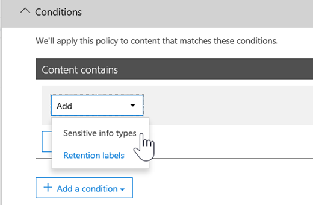

# <a name="create-custom-sensitive-information-types-with-exact-data-match-based-classification"></a>Criar tipos personalizados de informações confidenciais com classificação baseada em Exact Data Match

[Tipos de informações confidenciais personalizadas](sensitive-information-type-learn-about.md) são usadas para ajudar a identificar itens confidenciais para que você possa evitar que sejam compartilhados inadvertidamente ou inadequadamente. Você define um tipo de informações confidenciais personalizada com base em:

- padrões
- evidência de palavra-chave, como *funcionário*, *alça de preenchimento* ou *ID*
- proximidade de um caractere da evidência em um padrão específico
- níveis de confiança

 Esses tipos personalizados de informações confidenciais atendem às necessidades comerciais de várias organizações.

Mas e se você quiser um tipo personalizado de informações confidenciais que usa valores de dados exatos, em vez de corresponder apenas a padrões genéricos? Com a classificação baseada em Exact Data Match (EDM), você pode criar um tipo personalizado de informações confidenciais que é criada para:

- ser dinâmica e facilmente atualizada
- ser mais escalonável
- resultar em menos falso-positivos
- trabalhar com dados confidenciais estruturados
- lidar com as informações confidenciais com mais segurança
- ser usado com vários serviços de nuvem da Microsoft


A classificação baseada no EDM permite criar tipos personalizados de informações confidenciais que fazem referência a valores exatos em um banco de dados de informações confidenciais. O banco de dados pode ser atualizado diariamente e pode conter até 100 milhões de linhas de dados. Assim como funcionários, pacientes ou clientes vêm e vão e os registros são alterados, os tipos personalizados de informações confidenciais permanecem atualizados e aplicáveis. Você também pode usar a classificação baseada em EDM com políticas, como [políticas de prevenção contra perda de dados](data-loss-prevention-policies.md) (DLP) ou [políticas de arquivo do Microsoft Cloud App Security](https://docs.microsoft.com/cloud-app-security/data-protection-policies).

> [!NOTE]
> A Proteção de Informações do Microsoft 365 agora oferece suporte a idiomas de conjunto de caracteres de byte duplo de visualização:
> - Chinês (simplificado)
> - Chinês (tradicional)
> - Coreano
> - Japonês
> 
> Este suporte está disponível para tipos de informações confidenciais. Para obter mais informações, confira [Suporte à proteção de informações para notas de versão de conjuntos de caracteres de byte duplo (visualização)](mip-dbcs-relnotes.md).

## <a name="required-licenses-and-permissions"></a>Licenças e permissões necessárias

Você deve ser um administrador global, administrador de conformidade ou administrador do Exchange Online para executar as tarefas descritas neste artigo. Para saber mais sobre permissões DLP, confira [Permissões](data-loss-prevention-policies.md#permissions).

A classificação baseada em EDM está incluída nestas assinaturas

- Office 365 E5
- Microsoft 365 E5
- Conformidade do Microsoft 365 E5
- Proteção e governança de informações do Microsoft E5/A5

## <a name="portal-links-for-your-subscription"></a>Links do portal para sua assinatura


|Portal  |World Wide/GCC  |GCC-High  |DOD  |
|---------|---------|---------|---------|
|Office SCC     |  protection.office.com       |scc.office365.us         |scc.protection.apps.mil |
|Centro de Segurança do Microsoft 365     |security.microsoft.com         |security.microsoft.us         |security.apps.mil|
|Centro de Conformidade do Microsoft 365     |compliance.microsoft.com         |compliance.microsoft.us         |compliance.apps.mil|


## <a name="the-work-flow-at-a-glance"></a>Visão geral do fluxo de trabalho 

|Fase  |Requisitos  |
|---------|---------|
|[Parte 1: Configuração da classificação baseada em EDM](#part-1-set-up-edm-based-classification)<br/><br/>(conforme o necessário)<br/>- [Edite o Esquema de Banco de Dados](#editing-the-schema-for-edm-based-classification) <br/>- [Remova o esquema](#removing-the-schema-for-edm-based-classification) |– Acesso de leitura aos dados confidenciais<br/>– Esquema de banco de dados no formato XML (exemplo fornecido)<br/>– Pacote de regras no formato XML (exemplo fornecido)<br/>– Permissões de administrador ao Centro de Conformidade e Segurança (usando o PowerShell) |
|[Parte 2: hash e carregamento de dados confidenciais](#part-2-hash-and-upload-the-sensitive-data)<br/><br/>(conforme o necessário)<br/>[Atualize os dados](#refreshing-your-sensitive-information-database) |– Grupo de segurança personalizado e conta de usuário<br/>– Acesso de administrador local à máquina com o agente de carregamento do EDM<br/>– Acesso de leitura aos dados confidenciais<br/>– Processar e agendar a atualização de dados|
|[Parte 3: uso da classificação baseada em EDM com os serviços de nuvem da Microsoft](#part-3-use-edm-based-classification-with-your-microsoft-cloud-services) |– Assinatura do Microsoft 365 com DLP<br/>– Recurso de classificação baseada em EDM habilitado |

### <a name="part-1-set-up-edm-based-classification"></a>Parte 1: Configuração da classificação baseada em EDM

Organizar e configurar a classificação baseada em EDM envolve:

1. [Salvar os dados confidenciais no formato .csv](#save-sensitive-data-in-csv-format)
2. [Definir o esquema do banco de dados de informações confidenciais](#define-the-schema-for-your-database-of-sensitive-information)
3. [Configurar um pacote de regras](#set-up-a-rule-package)


#### <a name="save-sensitive-data-in-csv-format"></a>Salvar os dados confidenciais no formato .csv

1. Identifique as informações confidenciais que deseja usar. Exporte os dados para um aplicativo, como o Microsoft Excel, e salve o arquivo no formato .csv. O arquivo de dados pode incluir um máximo de:
      - Até 100 milhões de linhas de dados confidenciais
      - Até 32 colunas (campos) por fonte de dados
      - Até 5 colunas (campos) marcadas como pesquisáveis

2. Estruture os dados confidenciais no arquivo .csv, de modo que a primeira linha inclui os nomes dos campos usados na classificação baseada em EDM. Você pode ter nomes de campo no arquivo .csv, como "CPF", "data de nascimento", "nome", "sobrenome". Os nomes de cabeçalhos de coluna não podem conter espaços ou sublinhados. Por exemplo, o arquivo .csv de amostra que usamos neste artigo é denominado *PatientRecords.csv* e suas colunas incluem *PatientID*, *MRN*, *LastName*, *FirstName*, *SSN* e mais.

3. Preste atenção ao formato dos campos de dados confidenciais. Em particular, os campos que podem conter vírgulas em seu conteúdo (por exemplo, um endereço que contém o valor "Seattle, WA") seriam analisados como dois campos separados quando analisados pela ferramenta EDM. Para evitar isso, certifique-se de que esses campos estejam entre aspas simples ou duplas na tabela de dados confidenciais. Se os campos com vírgulas também puderem conter espaços, você precisará criar um Tipo de Informação Confidencial personalizado que corresponda ao formato correspondente (por exemplo, uma cadeia de caracteres de várias palavras com vírgulas e espaços) para garantir que a cadeia de caracteres seja correspondida corretamente quando o documento é verificado.

#### <a name="define-the-schema-for-your-database-of-sensitive-information"></a>Definir o esquema para seu banco de dados de informações confidenciais

Se, por motivos técnico ou de negócios, você preferir não usar o Windows PowerShell ou a linha de comando para criar o esquema e padrão do tipo de informações confidenciais do EDM (pacote de regras), poderá usar o [Assistente de Correspondência Exata de Dados e Tipo de Informações Confidenciais](sit-edm-wizard.md) para criá-los. Quando terminar de criar o esquema e o padrão do tipo de informações confidenciais do EDM, volte para concluir todas as etapas necessárias para disponibilizar seu EDM para o seu tipo de informações confidenciais.

> [!NOTE]
> O Assistente de Correspondência Exata de Dados e Tipo de Informações Confidenciais está disponível apenas para as nuvens World Wide e GCC.

1. Defina o esquema para o banco de dados de informações confidenciais no formato XML (semelhante ao nosso exemplo a seguir). Nomeie esse arquivo de esquema como **edm.xml** e configure-o de forma que, para cada coluna no banco de dados, haja uma linha que use a sintaxe: 

      `\<Field name="" searchable=""/\>`.

      - Use nomes de coluna para valores de *Nome de campo*.
      - Use *searchable = "true"* para os campos que você deseja que sejam pesquisáveis de ​​até no máximo 5 campos. Pelo menos um campo deve ser pesquisável.

      Como exemplo, o seguinte arquivo XML define o esquema para um banco de dados de registros de pacientes, com cinco campos especificados como pesquisáveis: *PatientID*, *MRN*, *SSN*, *Telefone* e *DOB*.

      (Você pode copiar, modificar e usar nosso exemplo.)

      ```xml
      <EdmSchema xmlns="http://schemas.microsoft.com/office/2018/edm">
            <DataStore name="PatientRecords" description="Schema for patient records" version="1">
                  <Field name="PatientID" searchable="true" caseInsensitive="true" ignoredDelimiters="-,/,*,#,^" />
                  <Field name="MRN" searchable="true" />
                  <Field name="FirstName" />
                  <Field name="LastName" />
                  <Field name="SSN" searchable="true" />
                  <Field name="Phone" searchable="true" />
                  <Field name="DOB" searchable="true" />
                  <Field name="Gender" />
                  <Field name="Address" />
            </DataStore>
      </EdmSchema>
      ```

##### <a name="configurable-match-using-the-caseinsensitive-and-ignoreddelimiters-fields"></a>Correspondência configurável usando os campos caseInsensitive e ignoredDelimiters

As amostras XML acima usam os campos `caseInsensitive` e `ignoredDelimiters`. 

Quando você incluir o campo ***caseInsensitive** _ definido para o valor de `true` em sua definição de esquema o EDM não excluirá um item baseado em diferenças de maiúsculas para o campo `PatientID`. Dessa forma, o EDM verá `PatientID` _ *FOO-1234** e **fOo-1234** como idênticos.

Quando você inclui o campo * **ignoreDelimiters** _ com caracteres suportados, o EDM irá ignorar esses caracteres no `PatientID`. Dessa forma, o EDM verá `PatientID` _ *FOO-1234** e `PatientID` **fOo-1234** como idênticos. O sinalizador `ignoredDelimiters` dá suporte a qualquer caractere não alfanumérico, aqui estão alguns exemplos:
- \.
- \-
- \/
- \_
- \*
- \^
- \#
- \!
- \?
- \[
- \]
- \{
- \}
- \\
- \~
- \; 

- O sinalizador `ignoredDelimiters` não tem suporte para:
- caracteres de 0 a 9
- A-Z
- a-z
- \"
- \,

Nesse exemplo, onde `caseInsensitive` e `ignoredDelimiters` são usados, o EDM veria **FOO-1234** e **fOo#1234** como idênticos e classificaria o item como tipo de informação confidencial do registro do paciente. 

4. Conectar ao centro de Conformidade e Segurança usando os procedimentos em [Conectar ao Centro de Conformidade e Segurança do PowerShell](https://docs.microsoft.com/powershell/exchange/connect-to-scc-powershell).

5. Para carregar o esquema do banco de dados, execute os seguintes cmdlets, um de cada vez:

      ```powershell
      $edmSchemaXml=Get-Content .\\edm.xml -Encoding Byte -ReadCount 0
      New-DlpEdmSchema -FileData $edmSchemaXml -Confirm:$true
      ```

      Você será solicitado a confirmar da seguinte maneira:

      > Confirmar
      >
      > Tem certeza que deseja executar essa ação?
      >
      > O novo esquema EDM para o repositório de dado 'patientrecords' será importado.
      >
      > \[S\] Sim \[A\] Sim para Todos \[N\] Não \[L\] Não para Todos \[?\] Ajuda (padrão é “Y”):

> [!TIP]
> Se você deseja que suas alterações ocorram sem confirmação, na Etapa 5, use este cmdlet: New-DlpEdmSchema -FileData $edmSchemaXml

> [!NOTE]
> Pode levar de 10 a 60 minutos para atualizar o EDMSchema com as adições. A atualização deve ser concluída antes que você execute as etapas que usam as adições.

#### <a name="set-up-a-rule-package"></a>Configurar um pacote de regras

1. Crie um pacote de regras no formato XML (com codificação Unicode), semelhante ao exemplo a seguir. (Você pode copiar, modificar e usar nosso exemplo.)

      Ao configurar o seu pacote de regras, certifique-se de referenciar corretamente o arquivo .csv e o arquivo **edm.xml**. Você pode copiar, modificar e usar nosso exemplo. Neste exemplo de xml, os seguintes campos precisam ser personalizados para criar seu tipo confidencial do EDM:

      - **Id do RulePack e id ExactMatch**: Use [New-GUID](https://docs.microsoft.com/powershell/module/microsoft.powershell.utility/new-guid?view=powershell-6) para gerar um GUID.

      - **Datastore**: este campo especifica o repositório de dados de pesquisa EDM a ser usado. Forneça um nome de fonte de dados de um esquema EDM configurado.

      - **idMatch**: este campo aponta para o elemento principal do EDM.
        - Correspondências: especifica o campo a ser usado na pesquisa exata. Forneça um nome de campo pesquisável no esquema EDM para o DataStore.
        - Classificação: este campo especifica a correspondência de tipo confidencial que dispara a pesquisa EDM. Você pode fornecer o nome ou o GUID de um tipo de informação confidencial interno ou personalizado existente. Esteja ciente de que qualquer cadeia de caracteres que corresponda ao tipo de informação confidencial fornecido terá um hash e será comparado a cada entrada na tabela de informações sensíveis. Para evitar causar problemas de desempenho, se você usar um tipo de informação confidencial personalizado como o elemento de Classificação em EDM, evite usar um que corresponda a uma grande porcentagem do conteúdo (como "qualquer número" ou "qualquer palavra de cinco letras") adicionando palavras-chave de suporte ou incluindo formatação na definição do tipo de informação confidencial de classificação personalizada. 

      - **Corresponder:** este campo aponta para evidências adicionais encontradas em proximidade do idMatch.
        - Correspondências: forneça o nome do campo no esquema EMD para DataStore.
      - **Recurso:** esta seção especifica o nome e a descrição do tipo confidencial em várias localidades.
        - idRef: forneça GUID para ExactMatch id.
        - Nomes e descrições: personalizar conforme necessário.

      ```xml
      <RulePackage xmlns="http://schemas.microsoft.com/office/2018/edm">
        <RulePack id="fd098e03-1796-41a5-8ab6-198c93c62b11">
          <Version build="0" major="2" minor="0" revision="0" />
          <Publisher id="eb553734-8306-44b4-9ad5-c388ad970528" />
          <Details defaultLangCode="en-us">
            <LocalizedDetails langcode="en-us">
              <PublisherName>IP DLP</PublisherName>
              <Name>Health Care EDM Rulepack</Name>
              <Description>This rule package contains the EDM sensitive type for health care sensitive types.</Description>
            </LocalizedDetails>
          </Details>
        </RulePack>
        <Rules>
          <ExactMatch id = "E1CC861E-3FE9-4A58-82DF-4BD259EAB371" patternsProximity = "300" dataStore ="PatientRecords" recommendedConfidence = "65" >
            <Pattern confidenceLevel="65">
              <idMatch matches = "SSN" classification = "U.S. Social Security Number (SSN)" />
            </Pattern>
            <Pattern confidenceLevel="75">
              <idMatch matches = "SSN" classification = "U.S. Social Security Number (SSN)" />
              <Any minMatches ="3" maxMatches ="6">
                <match matches="PatientID" />
                <match matches="MRN"/>
                <match matches="FirstName"/>
                <match matches="LastName"/>
                <match matches="Phone"/>
                <match matches="DOB"/>
              </Any>
            </Pattern>
          </ExactMatch>
          <LocalizedStrings>
            <Resource idRef="E1CC861E-3FE9-4A58-82DF-4BD259EAB371">
              <Name default="true" langcode="en-us">Patient SSN Exact Match.</Name>
              <Description default="true" langcode="en-us">EDM Sensitive type for detecting Patient SSN.</Description>
            </Resource>
          </LocalizedStrings>
        </Rules>
      </RulePackage>
      ```

2. Carregue o pacote de regras executando os seguintes cmdlets do PowerShell, um de cada vez:

      ```powershell
      $rulepack=Get-Content .\\rulepack.xml -Encoding Byte -ReadCount 0
      New-DlpSensitiveInformationTypeRulePackage -FileData $rulepack
      ```

Nesse ponto, você configurou a classificação baseada em EDM. A próxima etapa é criar o hash dos dados confidenciais e carregar os hashes de indexação.

Lembre-se do procedimento anterior onde o nosso esquema PatientRecords define cinco campos como pesquisáveis: *PatientID*, *MRN*, *SSN*, *Phone* e *DOB*. Nosso pacote de regras de exemplo inclui esses campos e faz referência ao arquivo de esquema do banco de dados (**edm.xml**), com um item *ExactMatch* por campo pesquisável. Considere o seguinte item ExactMatch:

```xml
<ExactMatch id = "E1CC861E-3FE9-4A58-82DF-4BD259EAB371" patternsProximity = "300" dataStore ="PatientRecords" recommendedConfidence = "65" >
      <Pattern confidenceLevel="65">
        <idMatch matches = "SSN" classification = "U.S. Social Security Number (SSN)" />
      </Pattern>
      <Pattern confidenceLevel="75">
        <idMatch matches = "SSN" classification = "U.S. Social Security Number (SSN)" />
        <Any minMatches ="3" maxMatches ="100">
          <match matches="PatientID" />
          <match matches="MRN"/>
          <match matches="FirstName"/>
          <match matches="LastName"/>
          <match matches="Phone"/>
          <match matches="DOB"/>
        </Any>
      </Pattern>
    </ExactMatch>
```

Nesse exemplo, observe que:

- O nome do dataStore faz referência ao arquivo .csv que criamos anteriormente: **dataStore = "PatientRecords"**.

- O valor idMatch faz referência a um campo pesquisável listado no arquivo de esquema do banco de dados: **idMatch matches = "SSN"**.

- O valor de classificação faz referência a um tipo de informação confidencial existente ou personalizada: **classification = "Número de Seguridade Social dos EUA (SSN)"**. (Nesse caso, usamos o tipo de informação confidencial existente do Número de Seguridade Social dos EUA.)

> [!NOTE]
> Pode levar de 10 a 60 minutos para atualizar o EDMSchema com as adições. A atualização deve ser concluída antes que você execute as etapas que usam as adições.

#### <a name="editing-the-schema-for-edm-based-classification"></a>Editando o esquema para classificação baseada em EDM

Se você quiser fazer alterações em seu arquivo **edm.xml**, como alterar quais os campos usados para a classificação baseada em EDM, siga estas etapas:

> [!TIP]
> Você pode alterar seu esquema EDM e o arquivo de dados para tirar vantagem de **correspondência configurável**. Quando configurado, o EDM ignorará as diferenças de maiúsculas e alguns delimitadores quando avalia um item. Isso facilita a definição do seu esquema XML e de arquivos de dados confidenciais. Para saber mais, confira [Modificar o esquema de Correspondência de Dados Exato para usar a correspondência configurável](sit-modify-edm-schema-configurable-match.md).

1. Edite seu arquivo **edm.xml** (este é o arquivo discutido na seção [Definir o esquema](#define-the-schema-for-your-database-of-sensitive-information) deste artigo).

2. Conectar ao centro de Conformidade e Segurança usando os procedimentos em [Conectar ao Centro de Conformidade e Segurança do PowerShell](https://docs.microsoft.com/powershell/exchange/connect-to-scc-powershell).

3. Para atualizar o seu esquema do banco de dados, execute os seguintes cmdlets, um de cada vez:

      ```powershell
      $edmSchemaXml=Get-Content .\\edm.xml -Encoding Byte -ReadCount 0
      Set-DlpEdmSchema -FileData $edmSchemaXml -Confirm:$true
      ```

      Você será solicitado a confirmar da seguinte maneira:

      > Confirmar
      >
      > Tem certeza que deseja executar essa ação?
      >
      > O esquema EDM para o repositório de dados 'patientrecords' será atualizado.
      >
      > \[S\] Sim \[A\] Sim para Todos \[N\] Não \[L\] Não para Todos \[?\] Ajuda (padrão é “Y”):

      > [!TIP]
      > Se você quiser que suas alterações ocorram sem confirmação, na Etapa 3, use este cmdlet: Set-DlpEdmSchema -FileData $edmSchemaXml

      > [!NOTE]
      > Pode levar de 10 a 60 minutos para atualizar o EDMSchema com as adições. A atualização deve ser concluída antes que você execute as etapas que usam as adições.

#### <a name="removing-the-schema-for-edm-based-classification"></a>Removendo o esquema para classificação baseada em EDM

(Conforme necessário) Se você quiser remover o esquema que está usando para classificação baseada em EDM, siga estas etapas:

1. Conectar ao centro de Conformidade e Segurança usando os procedimentos em [Conectar ao Centro de Conformidade e Segurança do PowerShell](https://docs.microsoft.com/powershell/exchange/connect-to-scc-powershell).

2. Execute os seguinte cmdlets do PowerShell, substituindo o nome do repositório de dados do "patient records" pelo nome que você deseja remover:

      ```powershell
      Remove-DlpEdmSchema -Identity patientrecords
      ```

      Será solicitado que você confirme:

      > Confirmar
      >
      > Tem certeza que deseja executar essa ação?
      >
      > O esquema EDM para o repositório de dados 'patientrecords' será removido.
      >
      > \[S\] Sim \[A\] Sim para Todos \[N\] Não \[L\] Não para Todos \[?\] Ajuda (padrão é “Y”):

      > [!TIP]
      >  Se você deseja que suas alterações ocorram sem confirmação, na Etapa 2, use este cmdlet: Remove-DlpEdmSchema -Identity patientrecords -Confirm: $ false

### <a name="part-2-hash-and-upload-the-sensitive-data"></a>Parte 2: hash e carregamento de dados confidenciais

Nessa fase, você configura um grupo de segurança personalizado e uma conta de usuário, e configura a ferramenta do agente de carregamento do EDM. Depois, use a ferramenta para o hash com valor salt dos dados confidenciais e carregue-los.

O hash e o carregamento podem ser feitos usando um computador, ou você pode separar a etapa de hash da etapa de carregamento para obter mais segurança.

Se você quiser usar o hash e carregá-los de um computador, será preciso fazer isso em um computador que possa se conectar diretamente ao seu locatário do Microsoft 365. Isso exige que os arquivos de dados confidenciais de texto sem formatação estejam no computador para hash.

Se você não quiser expor o seu arquivo de dados confidenciais de texto não criptografado, poderá hashá-lo em um computador em um local seguro e, em seguida, copiar o arquivo de hash e o arquivo salt para um computador que possa conectar-se diretamente ao locatário do Microsoft 365 para carregamento. Neste cenário, você precisará do EDMUploadAgent em ambos os computadores.

> [!IMPORTANT]
> Caso tenha usado o Assistente de Correspondência Exata de Dados e Tipo de Informações Confidenciais, você ***deve** baixar o esquema para esse procedimento.

#### <a name="prerequisites"></a>Pré-requisitos

- uma conta corporativa ou de estudante do Microsoft 365 que será adicionada ao grupo de segurança **EDM\_DataUploaders**
- um computador com Windows 10 ou Windows Server 2016 com o .NET versão 4.6.2 para executar o EDMUploadAgent
- um diretório no computador de carregamento para o:
    -  EDMUploadAgent
    - seu arquivo de item confidencial no formato cvs **PatientRecords.csv** em nossos exemplos
    -  os arquivos hash de saída e salt
    - o nome do repositório de armazenamento do arquivo **edm.xml**, para esse exemplo, é `PatientRecords`
- Se você usou o esquema de [Correspondência de Dados Exata e o assistente de tipo de informação confidencial,](sit-edm-wizard.md) você ***deve*** baixá-lo

#### <a name="set-up-the-security-group-and-user-account"></a>Configuração do grupo de segurança e conta de usuário

1. Como administrador global, vá para o centro de administração usando o [link apropriado para sua assinatura](#portal-links-for-your-subscription) e [crie um grupo de segurança](https://docs.microsoft.com/office365/admin/email/create-edit-or-delete-a-security-group?view=o365-worldwide) chamado **EDM\_DataUploaders**.

2. Adicione um ou mais usuários ao grupo de segurança **EDM\_DataUploaders**. (Esses usuários vão gerenciar o banco de dados de informações confidenciais.)

#### <a name="hash-and-upload-from-one-computer"></a>Hash e carregamento de um computador

Esse computador deve ter acesso direto ao seu locatário do Microsoft 365.

>[!NOTE]
> Antes de iniciar este procedimento, certifique-se de que você é membro do grupo de segurança **EDM\_DataUploaders**.

> [!TIP]
> Opcionalmente, você pode executar uma validação contra o arquivo CSV antes de carregar executando:
>
>`EdmUploadAgent.exe /ValidateData /DataFile [data file] /Schema [schema file]`
>
>Para obter mais informações sobre todos os parâmetros suportados do EdmUploadAgent.exe >execute parâmetros suportados
>
> `EdmUploadAgent.exe /?`


#### <a name="links-to-edm-upload-agent-by-subscription-type"></a>Links para o agente de carregamento EDM por tipo de assinatura

- [Commercial + GCC](https://go.microsoft.com/fwlink/?linkid=2088639) – a maioria dos clientes comerciais devem usar este
- [GCC-High](https://go.microsoft.com/fwlink/?linkid=2137521) – especificamente para assinantes da nuvem governamental de alta segurança
- [DoD](https://go.microsoft.com/fwlink/?linkid=2137807) – este é especificamente para os clientes de nuvem do Departamento de Defesa dos Estados Unidos

1. Crie um diretório de trabalho para o EDMUploadAgent. Por exemplo, **C:\EDM\Data**. Coloque o arquivo **PatientRecords.csv** lá.

2. Baixar e instalar o apropriado [Agente de Carregamento EDM](#links-to-edm-upload-agent-by-subscription-type) para sua assinatura no diretório que você criou na etapa 1.

   > [!NOTE]
   > O EDMUploadAgent nos links acima foi atualizado para adicionar automaticamente um valor salt aos dados do hash. Como alternativa, você pode fornecer seu próprio valor salt. Depois de usar essa versão, não será possível usar a versão anterior do EDMUploadAgent.
   >
   > Você pode carregar dados com o EDMUploadAgent para qualquer armazenamento de dados apenas duas vezes por dia.

   > [!TIP]
   > Para obter uma lista com os parâmetros de comando com suporte, execute o agente sem argumentos. Por exemplo, ‘EdmUploadAgent.exe’.

2. Para autorizar o Agente de Carregamento EDM, abra o prompt de comando (como um administrador), mude para o diretório **C:\EDM\Data** e execute o seguinte comando:

   `EdmUploadAgent.exe /Authorize`

3. Entre com sua conta empresarial ou de estudante do Microsoft 365 que foi adicionada ao grupo de segurança EDM_DataUploaders. As informações do locatário são extraídas da conta do usuário para fazer a conexão.

   OPCIONAL: Caso tenha usado o Assistente de Correspondência Exata de Dados e Tipo de Informações Confidenciais para criar o seu esquema e arquivos padrão, execute o comando a seguir na janela do Prompt de Comando:

   `EdmUploadAgent.exe /SaveSchema /DataStoreName <schema name> /OutputDir <path to output folder>`

4. Para criar o hash e carregar os dados confidenciais, execute o seguinte comando no prompt de comando:

   `EdmUploadAgent.exe /UploadData /DataStoreName [DS Name] /DataFile [data file] /HashLocation [hash file location] /Schema [Schema file]`

   Exemplo: **EdmUploadAgent.exe /UploadData /DataStoreName PatientRecords /DataFile C:\Edm\Hash\PatientRecords.csv /HashLocation C:\Edm\Hash /Schema edm.xml**

   Isso adicionará automaticamente um valor salt gerado aleatoriamente ao hash para aumentar a segurança. Opcionalmente, se você quiser usar seu próprio valor salt, adicione o **/Salt <saltvalue>** ao comando. Esse valor deve ter 64 caracteres de comprimento e só pode conter os caracteres de a-z e de 0-9.

5. Verifique o status de carregamento executando este comando:

   `EdmUploadAgent.exe /GetSession /DataStoreName \<DataStoreName\>`

   Exemplo: **EdmUploadAgent.exe/GetSession/DataStoreName PatientRecords**

   Procure o status em **ProcessingInProgress**. Verifique novamente em alguns minutos até que o status mude para **Concluído**. Quando o status for concluído, os dados do EDM estarão prontos para uso.

#### <a name="separate-hash-and-upload"></a>Separar hash e upload

Execute o hash em um computador em um ambiente seguro.

OPCIONAL: Caso tenha usado o Assistente de Correspondência Exata de Dados e Tipo de Informações Confidenciais para criar o seu esquema e arquivos padrão, execute o comando a seguir na janela do Prompt de Comando:

`EdmUploadAgent.exe /SaveSchema /DataStoreName <schema name> /OutputDir <path to output folder>`

1. Execute os seguinte comando na janela prompt de comando:

   `EdmUploadAgent.exe /CreateHash /DataFile [data file] /HashLocation [hash file location] /Schema [Schema file] >`

   Por exemplo:

   > **EdmUploadAgent.exe /CreateHash /DataFile C:\Edm\Data\PatientRecords.csv /HashLocation C:\Edm\Hash /Schema edm.xml**

   Isso gerará um arquivo de hash e um arquivo salt com essas extensões, caso você não tenha especificado a opção **/Salt <saltvalue>**:
   - .EdmHash
   - .EdmSalt

2. Copie esses arquivos de forma segura para o computador que você usará para carregar seu arquivo cvs de itens confidenciais (PatientRecords) para o seu locatário.

   Para carregar os dados com hash, execute o seguinte comando no prompt de comando do Windows:

   `EdmUploadAgent.exe /UploadHash /DataStoreName \<DataStoreName\> /HashFile \<HashedSourceFilePath\>`

   Por exemplo:

   > **EdmUploadAgent.exe /UploadHash /DataStoreName PatientRecords /HashFile C:\\Edm\\Hash\\PatientRecords.EdmHash**


   Para verificar se os dados confidenciais foram carregados, execute o seguinte comando na janela do prompt de comando:

   `EdmUploadAgent.exe /GetDataStore`

   Você verá uma lista de armazenamento de dados e a data da última atualização.

   Se você quiser ver todos os carregamentos de dados em um determinado armazenamento, execute o seguinte comando em um prompt de comando do Windows:

   `EdmUploadAgent.exe /GetSession /DataStoreName <DataStoreName>`

   Prossiga para configurar seu processo e agenda da [Atualização de banco de dados de informação confidencial](#refreshing-your-sensitive-information-database).

Nesse ponto, você já usou a classificação baseada em EDM com os serviços de nuvem da Microsoft. Por exemplo, você pode [configurar uma política usando a classificação baseada em EDM](#to-create-a-dlp-policy-with-edm).

#### <a name="refreshing-your-sensitive-information-database"></a>Atualização do banco de dados de informações confidenciais

Você pode atualizar seu banco de dados confidenciais diariamente, e a ferramenta de carregamento do EDM pode reindexar os dados confidenciais e depois recarregar os dados indexados.

1. Determine seu processo e a frequência (diariamente ou semanalmente) para atualização do banco de dados de informações confidenciais.

2. Exporte novamente os dados confidenciais para um aplicativo, como o Microsoft Excel, e salve o arquivo no formato .csv. Mantenha o mesmo nome de arquivo e local que você usou quando seguiu as etapas descritas em [Hash e upload de dados confidenciais](#part-2-hash-and-upload-the-sensitive-data).

      > [!NOTE]
      > Se não houver alterações na estrutura (nomes de campos) do arquivo .csv, você não precisará fazer alterações no arquivo de esquema do banco de dados ao atualizar os dados. Mas se for necessário fazer alterações, não deixe de editar o esquema de banco de dados e seu pacote de regra correspondente.

3. Use o [Agendador de tarefas](https://docs.microsoft.com/windows/desktop/TaskSchd/task-scheduler-start-page) para automatizar as etapas 2 e 3 no procedimento [Hash e fazer upload dos dados confidenciais](#part-2-hash-and-upload-the-sensitive-data). Você pode agendar tarefas usando vários métodos:

      | Método             | O que fazer |
      | ---------------------- | ---------------- |
      | Windows PowerShell     | Confira a documentação do [ScheduledTasks](https://docs.microsoft.com/powershell/module/scheduledtasks/?view=win10-ps) e o [exemplo do script do PowerShell](#example-powershell-script-for-task-scheduler) neste artigo |
      | API do Agendador de Tarefas     | Confira a documentação do [Agendador de tarefas](https://docs.microsoft.com/windows/desktop/TaskSchd/using-the-task-scheduler)                                                                                                                                                                                                                                                                                |
      | Interface do usuário do Windows | No Windows, clique em **Iniciar** e digite Agendador de tarefas. Em seguida, na lista de resultados, clique com o botão direito do mouse no **Agendador de Tarefas**, e escolha **executar como administrador**.                                                                                                                                                                                                                                                                           |

#### <a name="example-powershell-script-for-task-scheduler"></a>Exemplo de script do PowerShell para o Agendador de Tarefas

Esta seção inclui um exemplo de script do PowerShell que você pode usar para agendar as tarefas de dados de hash e para carregamento de dados com hash:

##### <a name="to-schedule-hashing-and-upload-in-a-combined-step"></a>Para agendar o hash e carregamento em uma etapa combinada

```powershell
param(\[string\]$dataStoreName,\[string\]$fileLocation)
\# Assuming current user is also the user context to run the task
$user = "$env:USERDOMAIN\\$env:USERNAME"
$edminstallpath = 'C:\\Program Files\\Microsoft\\EdmUploadAgent\\'
$edmuploader = $edminstallpath + 'EdmUploadAgent.exe'
$csvext = '.csv'
$schemaext = '.xml'
\# Assuming CSV file name is same as data store name
$dataFile = "$fileLocation\\$dataStoreName$csvext"
\# Assuming location to store hash file is same as the location of csv file
$hashLocation = $fileLocation
\# Assuming Schema file name is same as data store name
$schemaFile = "$fileLocation\\$dataStoreName$schemaext"
$uploadDataArgs = '/UploadData /DataStoreName ' + $dataStoreName + ' /DataFile ' + $dataFile + ' /HashLocation' + $hashLocation + ' /Schema ' + $schemaFile
\# Set up actions associated with the task
$actions = @()
$actions += New-ScheduledTaskAction -Execute $edmuploader -Argument $uploadDataArgs -WorkingDirectory $edminstallpath
\# Set up trigger for the task
$trigger = New-ScheduledTaskTrigger -Weekly -DaysOfWeek Sunday -At 2am
\# Set up task settings
$principal = New-ScheduledTaskPrincipal -UserId $user -LogonType S4U -RunLevel Highest
$settings = New-ScheduledTaskSettingsSet -RunOnlyIfNetworkAvailable -StartWhenAvailable -WakeToRun
\# Create the scheduled task
$scheduledTask = New-ScheduledTask -Action $actions -Principal $principal -Trigger $trigger -Settings $settings
\# Get credentials to run the task
$creds = Get-Credential -UserName $user -Message "Enter credentials to run the task"
$password=\[Runtime.InteropServices.Marshal\]::PtrToStringAuto(\[Runtime.InteropServices.Marshal\]::SecureStringToBSTR($creds.Password))
\# Register the scheduled task
$taskName = 'EDMUpload\_' + $dataStoreName
Register-ScheduledTask -TaskName $taskName -InputObject $scheduledTask -User $user -Password $password
```

#### <a name="to-schedule-hashing-and-upload-as-separate-steps"></a>Para agendar o hash e carregamento em etapas separadas

```powershell
param(\[string\]$dataStoreName,\[string\]$fileLocation)
\# Assuming current user is also the user context to run the task
$user = "$env:USERDOMAIN\\$env:USERNAME"
$edminstallpath = 'C:\\Program Files\\Microsoft\\EdmUploadAgent\\'
$edmuploader = $edminstallpath + 'EdmUploadAgent.exe'
$csvext = '.csv'
$edmext = '.EdmHash'
$schemaext = '.xml'
\# Assuming CSV file name is same as data store name
$dataFile = "$fileLocation\\$dataStoreName$csvext"
$hashFile = "$fileLocation\\$dataStoreName$edmext"
\# Assuming Schema file name is same as data store name
$schemaFile = "$fileLocation\\$dataStoreName$schemaext "

\# Assuming location to store hash file is same as the location of csv file
$hashLocation = $fileLocation
$createHashArgs = '/CreateHash' + ' /DataFile ' + $dataFile + ' /HashLocation ' + $hashLocation + ' /Schema ' + $schemaFile
$uploadHashArgs = '/UploadHash /DataStoreName ' + $dataStoreName + ' /HashFile ' + $hashFile
\# Set up actions associated with the task
$actions = @()
$actions += New-ScheduledTaskAction -Execute $edmuploader -Argument $createHashArgs -WorkingDirectory $edminstallpath
$actions += New-ScheduledTaskAction -Execute $edmuploader -Argument $uploadHashArgs -WorkingDirectory $edminstallpath
\# Set up trigger for the task
$trigger = New-ScheduledTaskTrigger -Weekly -DaysOfWeek Sunday -At 2am
\# Set up task settings
$principal = New-ScheduledTaskPrincipal -UserId $user -LogonType S4U -RunLevel Highest
$settings = New-ScheduledTaskSettingsSet -RunOnlyIfNetworkAvailable -StartWhenAvailable -WakeToRun
\# Create the scheduled task
$scheduledTask = New-ScheduledTask -Action $actions -Principal $principal -Trigger $trigger -Settings $settings
\# Get credentials to run the task
$creds = Get-Credential -UserName $user -Message "Enter credentials to run the task"
$password=\[Runtime.InteropServices.Marshal\]::PtrToStringAuto(\[Runtime.InteropServices.Marshal\]::SecureStringToBSTR($creds.Password))
\# Register the scheduled task
$taskName = 'EDMUpload\_' + $dataStoreName
Register-ScheduledTask -TaskName $taskName -InputObject $scheduledTask -User $user -Password $password

```

### <a name="part-3-use-edm-based-classification-with-your-microsoft-cloud-services"></a>Parte 3: uso da classificação baseada em EDM com os serviços de nuvem da Microsoft

Estes locais são compatíveis com os tipos de informações confidenciais do EDM:

- DLP para Exchange Online (email)
- OneDrive for Business (arquivos)
- Microsoft Teams (conversas)
- DLP para SharePoint (arquivos)
- Políticas DLP de Segurança de Aplicativos do Microsoft Cloud

Os tipos de informações confidenciais do EDM para os cenários a seguir estão em desenvolvimento, mas ainda não estão disponíveis:

- Classificação automática de rótulos de confidencialidade e rótulos de retenção.

#### <a name="to-create-a-dlp-policy-with-edm"></a>Criação de uma política DLP com o EDM

1. Vá para o Centro de Conformidade e Segurança usando o apropriado [link para sua assinatura](#portal-links-for-your-subscription).

2. Escolha a **Política**\>**de prevenção contra perda de dados**.

3. Escolha **Criar uma política**\>**Personalizada**\>**Avançar**.

4. Na guia **Nomear sua política**, especifique um nome e uma descrição e, em seguida, escolha **Próximo**. 

5. Na guia **Escolher locais**, clique em **Escolher locais específicos** e, em seguida, clique em **Próximo**.

6. Na coluna **Status**, selecione **Exchange email, contas do OneDrive, bate-papo do Teams e mensagem do canal** e escolha **Avançar**.

7. Na guia **Configurações de política**, escolha **Usar configurações avançadas** e, em seguida, clique em **Próximo**.

8. Escolha **+ Nova regra**.

9. Na seção **Nome**, especifique um nome e uma descrição para a regra.

10. Na seção **Condições**, na lista **+ Adicionar uma condição**, escolha **Conteúdo contém tipo confidencial**.

      

11. Pesquise pelo tipo de informação confidencial que você criou ao configurar o pacote de regras e, em seguida, escolha **+ Adicionar**.  
    Então escolha **Concluído**.

12. Termine de selecionar as opções para a regra, como **Notificações de usuário**, **Substituições do usuário**, **Relatórios de incidente**, e assim por diante, e depois clique em **Salvar**.

13. Na guia **Configurações de política**, revise suas regras e, em seguida, clique em **Próximo**.

14. Especifique se deseja ativar a política imediatamente, testá-la ou desativá-la. Depois clique em **Próximo**.

15. Na guia **Revisar suas configurações**, revise sua política. Faça todas as alterações necessárias. Quando concluir, clique em **Criar**.

> [!NOTE]
> Espere aproximadamente uma hora para sua nova política DLP funcionar em seu data center.

## <a name="related-articles"></a>Artigos relacionados

- [Definições da entidade do tipo de informações confidenciais](sensitive-information-type-entity-definitions.md)
- [Aprenda sobre os tipos de informações confidenciais](sensitive-information-type-learn-about.md)
- [Visão geral das políticas DLP](data-loss-prevention-policies.md)
- [Microsoft Cloud App Security](https://docs.microsoft.com/cloud-app-security)
- [New-DlpEdmSchema](https://docs.microsoft.com/powershell/module/exchange/new-dlpedmschema)
- [Modificar o esquema de Correspondência de Dados Exato para usar a correspondência configurável](sit-modify-edm-schema-configurable-match.md)
