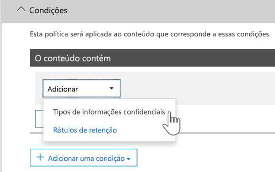

# <a name="create-custom-sensitive-information-types-with-exact-data-match-based-classification"></a><span data-ttu-id="dc143-103">Criar tipos personalizados de informações confidenciais com classificação baseada em Exact Data Match</span><span class="sxs-lookup"><span data-stu-id="dc143-103">Create custom sensitive information types with Exact Data Match based classification</span></span>

<span data-ttu-id="dc143-104">[Tipos personalizados de informações confidenciais](custom-sensitive-info-types.md)  são usados para ajudar a prevenir o compartilhamento acidental ou inadequado de informações confidenciais.</span><span class="sxs-lookup"><span data-stu-id="dc143-104">[Custom sensitive information types](custom-sensitive-info-types.md) are used to help prevent inadvertent or inappropriate sharing of sensitive information.</span></span> <span data-ttu-id="dc143-105">Como um administrador, você pode usar o Centro de Conformidade e Segurança ou o PowerShell para definir um tipo personalizado de informação confidencial baseado em padrões, evidências (palavras-chave como  *funcionário*,  *crachá*,  *ID* e assim por diante), proximidade de caractere (como a evidência está próxima de caracteres em um padrão específico), e níveis de confiança.</span><span class="sxs-lookup"><span data-stu-id="dc143-105">As an administrator, you can use the Security & Compliance Center or PowerShell to define a custom sensitive information type based on patterns, evidence (keywords such as *employee*, *badge*, *ID*, and so on), character proximity (how close evidence is to characters in a particular pattern), and confidence levels.</span></span> <span data-ttu-id="dc143-106">Esses tipos personalizados de informações confidenciais atendem às necessidades comerciais de várias organizações.</span><span class="sxs-lookup"><span data-stu-id="dc143-106">Such custom sensitive information types meet business needs for many organizations.</span></span>

<span data-ttu-id="dc143-107">Mas e se você quiser um tipo personalizado de informações confidenciais que usa valores de dados exatos, em vez de corresponder apenas a padrões genéricos?</span><span class="sxs-lookup"><span data-stu-id="dc143-107">But what if you wanted a custom sensitive information type that uses exact data values, instead of matching only with generic patterns?</span></span> <span data-ttu-id="dc143-108">Com a classificação baseada em Exact Data Match (EDM), você pode criar um tipo personalizado de informações confidenciais que é criada para:</span><span class="sxs-lookup"><span data-stu-id="dc143-108">With Exact Data Match (EDM)-based classification, you can create a custom sensitive information type that is designed to:</span></span>

- <span data-ttu-id="dc143-109">ser dinâmico e atualizável.</span><span class="sxs-lookup"><span data-stu-id="dc143-109">be dynamic and refreshable;</span></span>
- <span data-ttu-id="dc143-110">ser mais escalonável;</span><span class="sxs-lookup"><span data-stu-id="dc143-110">be more scalable;</span></span>
- <span data-ttu-id="dc143-111">resultar em menos falso positivos.</span><span class="sxs-lookup"><span data-stu-id="dc143-111">result in fewer false-positives;</span></span>
- <span data-ttu-id="dc143-112">trabalhar com dados confidenciais estruturados;</span><span class="sxs-lookup"><span data-stu-id="dc143-112">work with structured sensitive data;</span></span>
- <span data-ttu-id="dc143-113">lidar com as informações confidenciais com mais segurança; e</span><span class="sxs-lookup"><span data-stu-id="dc143-113">handle sensitive information more securely; and</span></span>
- <span data-ttu-id="dc143-114">ser usado com vários serviços de nuvem da Microsoft.</span><span class="sxs-lookup"><span data-stu-id="dc143-114">be used with several Microsoft cloud services.</span></span>


<span data-ttu-id="dc143-116">A classificação baseada no EDM permite criar tipos personalizados de informações confidenciais que fazem referência a valores exatos em um banco de dados de informações confidenciais.</span><span class="sxs-lookup"><span data-stu-id="dc143-116">EDM-based classification enables you to create custom sensitive information types that refer to exact values in a database of sensitive information.</span></span> <span data-ttu-id="dc143-117">O banco de dados pode ser atualizado diariamente ou semanalmente e pode conter até 100 milhões de linhas de dados.</span><span class="sxs-lookup"><span data-stu-id="dc143-117">The database can be refreshed daily or weekly, and it can contain up to 100 million rows of data.</span></span> <span data-ttu-id="dc143-118">Assim como funcionários, pacientes ou clientes vêm e vão e os registros são alterados, os tipos personalizados de informações confidenciais permanecem atualizados e aplicáveis.</span><span class="sxs-lookup"><span data-stu-id="dc143-118">So as employees, patients, or clients come and go, and records change, your custom sensitive information types remain current and applicable.</span></span> <span data-ttu-id="dc143-119">Você também pode usar a classificação baseada em EDM com políticas, como [políticas de prevenção contra perda de dados](data-loss-prevention-policies.md) (DLP) ou políticas de arquivo do [Microsoft Cloud App Security](https://docs.microsoft.com/cloud-app-security/data-protection-policies).</span><span class="sxs-lookup"><span data-stu-id="dc143-119">And, you can use EDM-based classification with policies, such as [data loss prevention policies](data-loss-prevention-policies.md) (DLP) or [Microsoft Cloud App Security file policies](https://docs.microsoft.com/cloud-app-security/data-protection-policies).</span></span>

> [!NOTE]
> <span data-ttu-id="dc143-120">A Proteção de Informações do Microsoft 365 agora oferece suporte a idiomas de conjunto de caracteres de byte duplo de visualização:</span><span class="sxs-lookup"><span data-stu-id="dc143-120">Microsoft 365 Information Protection now  supports in preview double byte character set languages for:</span></span>
> - <span data-ttu-id="dc143-121">Chinês (simplificado)</span><span class="sxs-lookup"><span data-stu-id="dc143-121">Chinese (simplified)</span></span>
> - <span data-ttu-id="dc143-122">Chinês (tradicional)</span><span class="sxs-lookup"><span data-stu-id="dc143-122">Chinese (traditional)</span></span>
> - <span data-ttu-id="dc143-123">Coreano</span><span class="sxs-lookup"><span data-stu-id="dc143-123">Korean</span></span>
> - <span data-ttu-id="dc143-124">Japonês</span><span class="sxs-lookup"><span data-stu-id="dc143-124">Japanese</span></span>
> 
><span data-ttu-id="dc143-125">Esta visualização está apenas na nuvem comercial e a implementação está limitada para:</span><span class="sxs-lookup"><span data-stu-id="dc143-125">This preview is only in the commercial cloud and the rollout is limited to:</span></span>
> - <span data-ttu-id="dc143-126">Japão</span><span class="sxs-lookup"><span data-stu-id="dc143-126">Japan</span></span>
> - <span data-ttu-id="dc143-127">Coreia</span><span class="sxs-lookup"><span data-stu-id="dc143-127">Korea</span></span>
> - <span data-ttu-id="dc143-128">China</span><span class="sxs-lookup"><span data-stu-id="dc143-128">China</span></span>
> - <span data-ttu-id="dc143-129">Hong Kong</span><span class="sxs-lookup"><span data-stu-id="dc143-129">Hong Kong</span></span>
> - <span data-ttu-id="dc143-130">Macau</span><span class="sxs-lookup"><span data-stu-id="dc143-130">Macau</span></span>
> - <span data-ttu-id="dc143-131">Taiwan</span><span class="sxs-lookup"><span data-stu-id="dc143-131">Taiwan</span></span>
>
><span data-ttu-id="dc143-132">Este suporte está disponível para tipos de informações confidenciais.</span><span class="sxs-lookup"><span data-stu-id="dc143-132">This support is available for sensitive information types.</span></span> <span data-ttu-id="dc143-133">Para obter mais informações, confira [Suporte à proteção de informações para notas de versão de conjuntos de caracteres de byte duplo (visualização)](mip-dbcs-relnotes.md).</span><span class="sxs-lookup"><span data-stu-id="dc143-133">See, [Information protection support for double byte character sets release notes (preview)](mip-dbcs-relnotes.md) for more information.</span></span>

## <a name="required-licenses-and-permissions"></a><span data-ttu-id="dc143-134">Licenças e permissões necessárias</span><span class="sxs-lookup"><span data-stu-id="dc143-134">Required licenses and permissions</span></span>

<span data-ttu-id="dc143-135">Você deve ser um administrador global, administrador de conformidade ou administrador do Exchange Online para executar as tarefas descritas neste artigo.</span><span class="sxs-lookup"><span data-stu-id="dc143-135">You must be a global admin, compliance administrator, or Exchange Online administrator to perform the tasks described in this article.</span></span> <span data-ttu-id="dc143-136">Para saber mais sobre permissões DLP, consulte [Permissões](data-loss-prevention-policies.md#permissions).</span><span class="sxs-lookup"><span data-stu-id="dc143-136">To learn more about DLP permissions, see [Permissions](data-loss-prevention-policies.md#permissions).</span></span>

<span data-ttu-id="dc143-137">A classificação baseada em EDM está incluída nestas assinaturas</span><span class="sxs-lookup"><span data-stu-id="dc143-137">EDM-based classification is included in these subscriptions</span></span>

- <span data-ttu-id="dc143-138">Office 365 E5</span><span class="sxs-lookup"><span data-stu-id="dc143-138">Office 365 E5</span></span>
- <span data-ttu-id="dc143-139">Microsoft 365 E5</span><span class="sxs-lookup"><span data-stu-id="dc143-139">Microsoft 365 E5</span></span>
- <span data-ttu-id="dc143-140">Conformidade do Microsoft 365 E5</span><span class="sxs-lookup"><span data-stu-id="dc143-140">Microsoft 365 E5 Compliance</span></span>
- <span data-ttu-id="dc143-141">Proteção e governança de informações do Microsoft E5/A5</span><span class="sxs-lookup"><span data-stu-id="dc143-141">Microsoft E5/A5 Information Protection and Governance</span></span>

## <a name="portal-links-for-your-subscription"></a><span data-ttu-id="dc143-142">Links do portal para sua assinatura</span><span class="sxs-lookup"><span data-stu-id="dc143-142">Portal links for your subscription</span></span>


|<span data-ttu-id="dc143-143">Portal</span><span class="sxs-lookup"><span data-stu-id="dc143-143">Portal</span></span>  |<span data-ttu-id="dc143-144">World Wide/GCC</span><span class="sxs-lookup"><span data-stu-id="dc143-144">World Wide/GCC</span></span>  |<span data-ttu-id="dc143-145">GCC-High</span><span class="sxs-lookup"><span data-stu-id="dc143-145">GCC-High</span></span>  |<span data-ttu-id="dc143-146">DOD</span><span class="sxs-lookup"><span data-stu-id="dc143-146">DOD</span></span>  |
|---------|---------|---------|---------|
|<span data-ttu-id="dc143-147">Office SCC</span><span class="sxs-lookup"><span data-stu-id="dc143-147">Office SCC</span></span>     |  <span data-ttu-id="dc143-148">protection.office.com</span><span class="sxs-lookup"><span data-stu-id="dc143-148">protection.office.com</span></span>       |<span data-ttu-id="dc143-149">scc.office365.us</span><span class="sxs-lookup"><span data-stu-id="dc143-149">scc.office365.us</span></span>         |<span data-ttu-id="dc143-150">scc.protection.apps.mil</span><span class="sxs-lookup"><span data-stu-id="dc143-150">scc.protection.apps.mil</span></span> |
|<span data-ttu-id="dc143-151">Centro de Segurança do Microsoft 365</span><span class="sxs-lookup"><span data-stu-id="dc143-151">Microsoft 365 Security center</span></span>     |<span data-ttu-id="dc143-152">security.microsoft.com</span><span class="sxs-lookup"><span data-stu-id="dc143-152">security.microsoft.com</span></span>         |<span data-ttu-id="dc143-153">security.microsoft.us</span><span class="sxs-lookup"><span data-stu-id="dc143-153">security.microsoft.us</span></span>         |<span data-ttu-id="dc143-154">security.apps.mil</span><span class="sxs-lookup"><span data-stu-id="dc143-154">security.apps.mil</span></span>|
|<span data-ttu-id="dc143-155">Centro de Conformidade do Microsoft 365</span><span class="sxs-lookup"><span data-stu-id="dc143-155">Microsoft 365 Compliance center</span></span>     |<span data-ttu-id="dc143-156">compliance.microsoft.com</span><span class="sxs-lookup"><span data-stu-id="dc143-156">compliance.microsoft.com</span></span>         |<span data-ttu-id="dc143-157">compliance.microsoft.us</span><span class="sxs-lookup"><span data-stu-id="dc143-157">compliance.microsoft.us</span></span>         |<span data-ttu-id="dc143-158">compliance.apps.mil</span><span class="sxs-lookup"><span data-stu-id="dc143-158">compliance.apps.mil</span></span>|


## <a name="the-work-flow-at-a-glance"></a><span data-ttu-id="dc143-159">Visão geral do fluxo de trabalho </span><span class="sxs-lookup"><span data-stu-id="dc143-159">The work flow at a glance</span></span>

|<span data-ttu-id="dc143-160">Fase</span><span class="sxs-lookup"><span data-stu-id="dc143-160">Phase</span></span>  |<span data-ttu-id="dc143-161">Requisitos</span><span class="sxs-lookup"><span data-stu-id="dc143-161">What's needed</span></span>  |
|---------|---------|
|[<span data-ttu-id="dc143-162">Parte 1: Configuração da classificação baseada em EDM</span><span class="sxs-lookup"><span data-stu-id="dc143-162">Part 1: Set up EDM-based classification</span></span>](#part-1-set-up-edm-based-classification)<br/><br/><span data-ttu-id="dc143-163">(conforme o necessário)</span><span class="sxs-lookup"><span data-stu-id="dc143-163">(As needed)</span></span><br/><span data-ttu-id="dc143-164">- [Edite o Esquema de Banco de Dados](#editing-the-schema-for-edm-based-classification)</span><span class="sxs-lookup"><span data-stu-id="dc143-164">- [Edit the database schema](#editing-the-schema-for-edm-based-classification)</span></span> <br/><span data-ttu-id="dc143-165">- [Remova o esquema](#removing-the-schema-for-edm-based-classification)</span><span class="sxs-lookup"><span data-stu-id="dc143-165">- [Remove the schema](#removing-the-schema-for-edm-based-classification)</span></span> |<span data-ttu-id="dc143-166">– Acesso de leitura aos dados confidenciais</span><span class="sxs-lookup"><span data-stu-id="dc143-166">- Read access to the sensitive data</span></span><br/><span data-ttu-id="dc143-167">– Esquema de banco de dados no formato XML (exemplo fornecido)</span><span class="sxs-lookup"><span data-stu-id="dc143-167">- Database schema in XML format (example provided)</span></span><br/><span data-ttu-id="dc143-168">– Pacote de regras no formato XML (exemplo fornecido)</span><span class="sxs-lookup"><span data-stu-id="dc143-168">- Rule package in XML format (example provided)</span></span><br/><span data-ttu-id="dc143-169">– Permissões de administrador ao Centro de Conformidade e Segurança (usando o PowerShell)</span><span class="sxs-lookup"><span data-stu-id="dc143-169">- Admin permissions to the Security & Compliance Center (using PowerShell)</span></span> |
|[<span data-ttu-id="dc143-170">Parte 2: hash e carregamento de dados confidenciais</span><span class="sxs-lookup"><span data-stu-id="dc143-170">Part 2: Hash and upload the sensitive data</span></span>](#part-2-hash-and-upload-the-sensitive-data)<br/><br/><span data-ttu-id="dc143-171">(conforme o necessário)</span><span class="sxs-lookup"><span data-stu-id="dc143-171">(As needed)</span></span><br/>[<span data-ttu-id="dc143-172">Atualize os dados</span><span class="sxs-lookup"><span data-stu-id="dc143-172">Refresh the data</span></span>](#refreshing-your-sensitive-information-database) |<span data-ttu-id="dc143-173">– Grupo de segurança personalizado e conta de usuário</span><span class="sxs-lookup"><span data-stu-id="dc143-173">- Custom security group and user account</span></span><br/><span data-ttu-id="dc143-174">– Acesso de administrador local à máquina com o agente de carregamento do EDM</span><span class="sxs-lookup"><span data-stu-id="dc143-174">- Local admin access to machine with EDM Upload Agent</span></span><br/><span data-ttu-id="dc143-175">– Acesso de leitura aos dados confidenciais</span><span class="sxs-lookup"><span data-stu-id="dc143-175">- Read access to the sensitive data</span></span><br/><span data-ttu-id="dc143-176">– Processar e agendar a atualização de dados</span><span class="sxs-lookup"><span data-stu-id="dc143-176">- Process and schedule for refreshing the data</span></span>|
|[<span data-ttu-id="dc143-177">Parte 3: uso da classificação baseada em EDM com os serviços de nuvem da Microsoft</span><span class="sxs-lookup"><span data-stu-id="dc143-177">Part 3: Use EDM-based classification with your Microsoft cloud services</span></span>](#part-3-use-edm-based-classification-with-your-microsoft-cloud-services) |<span data-ttu-id="dc143-178">– Assinatura do Microsoft 365 com DLP</span><span class="sxs-lookup"><span data-stu-id="dc143-178">- Microsoft 365 subscription with DLP</span></span><br/><span data-ttu-id="dc143-179">– Recurso de classificação baseada em EDM habilitado</span><span class="sxs-lookup"><span data-stu-id="dc143-179">- EDM-based classification feature enabled</span></span> |

### <a name="part-1-set-up-edm-based-classification"></a><span data-ttu-id="dc143-180">Parte 1: Configuração da classificação baseada em EDM</span><span class="sxs-lookup"><span data-stu-id="dc143-180">Part 1: Set up EDM-based classification</span></span>

<span data-ttu-id="dc143-181">Definição e configuração da classificação baseada em EDM envolve o salvamento de dados confidenciais no formato .csv, a definição de um esquema para seu banco de dados de informações confidenciais, a criação de um pacote de regras e o carregamento do esquema e do pacote de regras.</span><span class="sxs-lookup"><span data-stu-id="dc143-181">Setting up and configuring EDM-based classification involves saving sensitive data in .csv format, defining a schema for your database of sensitive information, creating a rule package, and then uploading the schema and rule package.</span></span>

#### <a name="define-the-schema-for-your-database-of-sensitive-information"></a><span data-ttu-id="dc143-182">Definição do esquema para seu banco de dados de informações confidenciais</span><span class="sxs-lookup"><span data-stu-id="dc143-182">Define the schema for your database of sensitive information</span></span>

1. <span data-ttu-id="dc143-183">Identifique as informações confidenciais que deseja usar.</span><span class="sxs-lookup"><span data-stu-id="dc143-183">Identify the sensitive information you want to use.</span></span> <span data-ttu-id="dc143-184">Exporte os dados para um aplicativo, como o Microsoft Excel, e salve o arquivo no formato .csv.</span><span class="sxs-lookup"><span data-stu-id="dc143-184">Export the data to an app, such as Microsoft Excel, and save the file in .csv format.</span></span> <span data-ttu-id="dc143-185">O arquivo de dados pode incluir um máximo de:</span><span class="sxs-lookup"><span data-stu-id="dc143-185">The data file can include a maximum of:</span></span>
      - <span data-ttu-id="dc143-186">Até 100 milhões de linhas de dados confidenciais</span><span class="sxs-lookup"><span data-stu-id="dc143-186">Up to 100 million rows of sensitive data</span></span>
      - <span data-ttu-id="dc143-187">Até 32 colunas (campos) por fonte de dados</span><span class="sxs-lookup"><span data-stu-id="dc143-187">Up to 32 columns (fields) per data source</span></span>
      - <span data-ttu-id="dc143-188">Até 5 colunas (campos) marcadas como pesquisáveis</span><span class="sxs-lookup"><span data-stu-id="dc143-188">Up to 5 columns (fields) marked as searchable</span></span>

2. <span data-ttu-id="dc143-189">Estruture os dados confidenciais no arquivo .csv, de modo que a primeira linha inclui os nomes dos campos usados na classificação baseada em EDM.</span><span class="sxs-lookup"><span data-stu-id="dc143-189">Structure the sensitive data in the .csv file such that the first row includes the names of the fields used for EDM-based classification.</span></span> <span data-ttu-id="dc143-190">Você pode ter nomes de campo no arquivo .csv, como "CPF", "data de nascimento", "nome", "sobrenome" e assim por diante.</span><span class="sxs-lookup"><span data-stu-id="dc143-190">In your .csv file, you might have field names, such as "ssn", "birthdate", "firstname", "lastname", and so on.</span></span> <span data-ttu-id="dc143-191">Observe que os cabeçalhos de coluna não podem incluir espaços ou sublinhados em seus nomes.</span><span class="sxs-lookup"><span data-stu-id="dc143-191">Please note that column headers can't include spaces or underscores in their names.</span></span> <span data-ttu-id="dc143-192">Por exemplo, nosso arquivo .csv é chamado  *ProntuáriodePaciente.csv*, e suas colunas incluem  *IDdePaciente*, *Número de Prontuário Médico*, *Sobrenome*, *Nome*, *CPF* e mais.</span><span class="sxs-lookup"><span data-stu-id="dc143-192">As an example, our .csv file is called *PatientRecords.csv*, and its columns include *PatientID*, *MRN*, *LastName*, *FirstName*, *SSN*, and more.</span></span>

3. <span data-ttu-id="dc143-193">Defina o esquema para o banco de dados de informações confidenciais no formato XML (semelhante ao nosso exemplo a seguir).</span><span class="sxs-lookup"><span data-stu-id="dc143-193">Define the schema for the database of sensitive information in XML format (similar to our example below).</span></span> <span data-ttu-id="dc143-194">Nomeie esse esquema do arquivo **edm.xml** e configure-o para cada coluna no banco de dados, há uma linha que usa a sintaxe:</span><span class="sxs-lookup"><span data-stu-id="dc143-194">Name this schema file **edm.xml**, and configure it such that for each column in the database, there is a line that uses the syntax:</span></span> 

      <span data-ttu-id="dc143-195">`\<Field name="" searchable=""/\>`.</span><span class="sxs-lookup"><span data-stu-id="dc143-195">`\<Field name="" searchable=""/\>`.</span></span>

      - <span data-ttu-id="dc143-196">Use nomes de coluna para valores de *Nome do campo* .</span><span class="sxs-lookup"><span data-stu-id="dc143-196">Use column names for *Field name* values.</span></span>
      - <span data-ttu-id="dc143-197">Use  *searchable="true"*  para até 5 campos pesquisáveis.</span><span class="sxs-lookup"><span data-stu-id="dc143-197">Use *searchable="true"* for the fields that you want to be searchable up to a maximum of 5 fields.</span></span> <span data-ttu-id="dc143-198">Você deve designar pelo menos um campo como pesquisável.</span><span class="sxs-lookup"><span data-stu-id="dc143-198">You must designate a minimum of one field as searchable.</span></span>

      <span data-ttu-id="dc143-199">Por exemplo, o arquivo XML a seguir define o esquema para um banco de dados de registros de paciente, com cinco campos especificados como pesquisáveis:  *PatientID*, *Número de prontuário médico*, *CPF*, *Telefone*e  *Data de nascimento*.</span><span class="sxs-lookup"><span data-stu-id="dc143-199">As an example, the following XML file defines the schema for a patient records database, with five fields specified as searchable: *PatientID*, *MRN*, *SSN*, *Phone*, and *DOB*.</span></span>

      <span data-ttu-id="dc143-200">(Você pode copiar, modificar e usar nosso exemplo.)</span><span class="sxs-lookup"><span data-stu-id="dc143-200">(You can copy, modify, and use our example.)</span></span>

      ```xml
      <EdmSchema xmlns="http://schemas.microsoft.com/office/2018/edm">
            <DataStore name="PatientRecords" description="Schema for patient records" version="1">
                  <Field name="PatientID" searchable="true" />
                  <Field name="MRN" searchable="true" />
                  <Field name="FirstName" />
                  <Field name="LastName" />
                  <Field name="SSN" searchable="true" />
                  <Field name="Phone" searchable="true" />
                  <Field name="DOB" searchable="true" />
                  <Field name="Gender" />
                  <Field name="Address" />
            </DataStore>
      </EdmSchema>
      ```

4. <span data-ttu-id="dc143-201">Conectar ao centro de Conformidade e Segurança usando os procedimentos em [Conectar ao Centro de Conformidade e Segurança do PowerShell](https://docs.microsoft.com/powershell/exchange/office-365-scc/connect-to-scc-powershell/connect-to-scc-powershell?view=exchange-ps).</span><span class="sxs-lookup"><span data-stu-id="dc143-201">Connect to the Security & Compliance center using the procedures in [Connect to Security & Compliance Center PowerShell](https://docs.microsoft.com/powershell/exchange/office-365-scc/connect-to-scc-powershell/connect-to-scc-powershell?view=exchange-ps).</span></span>

5. <span data-ttu-id="dc143-202">Para carregar o esquema do banco de dados, execute os seguintes cmdlets, um de cada vez:</span><span class="sxs-lookup"><span data-stu-id="dc143-202">To upload the database schema, run the following cmdlets, one at a time:</span></span>

      ```powershell
      $edmSchemaXml=Get-Content .\\edm.xml -Encoding Byte -ReadCount 0
      New-DlpEdmSchema -FileData $edmSchemaXml -Confirm:$true
      ```

      <span data-ttu-id="dc143-203">Você será solicitado a confirmar da seguinte maneira:</span><span class="sxs-lookup"><span data-stu-id="dc143-203">You will be prompted to confirm, as follows:</span></span>

      > <span data-ttu-id="dc143-204">Confirmar</span><span class="sxs-lookup"><span data-stu-id="dc143-204">Confirm</span></span>
      >
      > <span data-ttu-id="dc143-205">Tem certeza que deseja executar essa ação?</span><span class="sxs-lookup"><span data-stu-id="dc143-205">Are you sure you want to perform this action?</span></span>
      >
      > <span data-ttu-id="dc143-206">O novo esquema EDM para o repositório de dado 'patientrecords' será importado.</span><span class="sxs-lookup"><span data-stu-id="dc143-206">New EDM Schema for the data store 'patientrecords' will be imported.</span></span>
      >
      > <span data-ttu-id="dc143-207">\[S\] Sim \[A\] Sim para Todos \[N\] Não \[L\] Não para Todos \[?\] Ajuda (padrão é “Y”):</span><span class="sxs-lookup"><span data-stu-id="dc143-207">\[Y\] Yes \[A\] Yes to All \[N\] No \[L\] No to All \[?\] Help (default is "Y"):</span></span>

> [!TIP]
> <span data-ttu-id="dc143-208">Se você quiser que as suas alterações ocorram sem confirmação, na Etapa 5, use este cmdlet: New-DlpEdmSchema -FileData $edmSchemaXml</span><span class="sxs-lookup"><span data-stu-id="dc143-208">If you want your changes to occur without confirmation, in Step 5, use this cmdlet instead: New-DlpEdmSchema -FileData $edmSchemaXml</span></span>

> [!NOTE]
> <span data-ttu-id="dc143-209">Pode levar de 10 a 60 minutos para atualizar o EDMSchema com as adições.</span><span class="sxs-lookup"><span data-stu-id="dc143-209">It can take between 10-60 minutes to update the EDMSchema with additions.</span></span> <span data-ttu-id="dc143-210">A atualização deve ser concluída antes que você execute as etapas que usam as adições.</span><span class="sxs-lookup"><span data-stu-id="dc143-210">The update must complete before you execute steps that use the additions.</span></span>

<span data-ttu-id="dc143-211">Agora que o esquema para o seu banco de dados de informações confidenciais está definido, a próxima etapa é configurar um pacote de regras.</span><span class="sxs-lookup"><span data-stu-id="dc143-211">Now that the schema for your database of sensitive information is defined, the next step is to set up a rule package.</span></span> <span data-ttu-id="dc143-212">Continue na seção [Configurar um pacote de regras](#set-up-a-rule-package).</span><span class="sxs-lookup"><span data-stu-id="dc143-212">Proceed to the section [Set up a rule package](#set-up-a-rule-package).</span></span>

#### <a name="editing-the-schema-for-edm-based-classification"></a><span data-ttu-id="dc143-213">Editando o esquema para classificação baseada em EDM</span><span class="sxs-lookup"><span data-stu-id="dc143-213">Editing the schema for EDM-based classification</span></span>

<span data-ttu-id="dc143-214">Se você quiser fazer alterações em seu arquivo **edm.xml**, como alterar quais os campos usados para a classificação baseada em EDM, siga estas etapas:</span><span class="sxs-lookup"><span data-stu-id="dc143-214">If you want to make changes to your **edm.xml** file, such as changing which fields are used for EDM-based classification, follow these steps:</span></span>

1. <span data-ttu-id="dc143-215">Edite o seu arquivo **edm.xml** (este é o arquivo discutido na seção [Definir o esquema](#define-the-schema-for-your-database-of-sensitive-information)  deste artigo).</span><span class="sxs-lookup"><span data-stu-id="dc143-215">Edit your **edm.xml** file (this is the file discussed in the [Define the schema](#define-the-schema-for-your-database-of-sensitive-information) section of this article).</span></span>

2. <span data-ttu-id="dc143-216">Conectar ao centro de Conformidade e Segurança usando os procedimentos em [Conectar ao Centro de Conformidade e Segurança do PowerShell](https://docs.microsoft.com/powershell/exchange/office-365-scc/connect-to-scc-powershell/connect-to-scc-powershell?view=exchange-ps).</span><span class="sxs-lookup"><span data-stu-id="dc143-216">Connect to the Security & Compliance center using the procedures in [Connect to Security & Compliance Center PowerShell](https://docs.microsoft.com/powershell/exchange/office-365-scc/connect-to-scc-powershell/connect-to-scc-powershell?view=exchange-ps).</span></span>

3. <span data-ttu-id="dc143-217">Para atualizar o seu esquema do banco de dados, execute os seguintes cmdlets, um de cada vez:</span><span class="sxs-lookup"><span data-stu-id="dc143-217">To update your database schema, run the following cmdlets, one at a time:</span></span>

      ```powershell
      $edmSchemaXml=Get-Content .\\edm.xml -Encoding Byte -ReadCount 0
      Set-DlpEdmSchema -FileData $edmSchemaXml -Confirm:$true
      ```

      <span data-ttu-id="dc143-218">Você será solicitado a confirmar da seguinte maneira:</span><span class="sxs-lookup"><span data-stu-id="dc143-218">You will be prompted to confirm, as follows:</span></span>

      > <span data-ttu-id="dc143-219">Confirmar</span><span class="sxs-lookup"><span data-stu-id="dc143-219">Confirm</span></span>
      >
      > <span data-ttu-id="dc143-220">Tem certeza que deseja executar essa ação?</span><span class="sxs-lookup"><span data-stu-id="dc143-220">Are you sure you want to perform this action?</span></span>
      >
      > <span data-ttu-id="dc143-221">O esquema EDM para o repositório de dados 'patientrecords' será atualizado.</span><span class="sxs-lookup"><span data-stu-id="dc143-221">EDM Schema for the data store 'patientrecords' will be updated.</span></span>
      >
      > <span data-ttu-id="dc143-222">\[S\] Sim \[A\] Sim para Todos \[N\] Não \[L\] Não para Todos \[?\] Ajuda (padrão é “Y”):</span><span class="sxs-lookup"><span data-stu-id="dc143-222">\[Y\] Yes \[A\] Yes to All \[N\] No \[L\] No to All \[?\] Help (default is "Y"):</span></span>

      > [!TIP]
      > <span data-ttu-id="dc143-223">Se você quiser que as suas alterações ocorram sem confirmação, na Etapa 3, use este cmdlet: Set-DlpEdmSchema -FileData $edmSchemaXml</span><span class="sxs-lookup"><span data-stu-id="dc143-223">If you want your changes to occur without confirmation, in Step 3, use this cmdlet instead: Set-DlpEdmSchema -FileData $edmSchemaXml</span></span>

      > [!NOTE]
      > <span data-ttu-id="dc143-224">Pode levar de 10 a 60 minutos para atualizar o EDMSchema com as adições.</span><span class="sxs-lookup"><span data-stu-id="dc143-224">It can take between 10-60 minutes to update the EDMSchema with additions.</span></span> <span data-ttu-id="dc143-225">A atualização deve ser concluída antes que você execute as etapas que usam as adições.</span><span class="sxs-lookup"><span data-stu-id="dc143-225">The update must complete before you execute steps that use the additions.</span></span>

## <a name="removing-the-schema-for-edm-based-classification"></a><span data-ttu-id="dc143-226">Removendo o esquema para classificação baseada em EDM</span><span class="sxs-lookup"><span data-stu-id="dc143-226">Removing the schema for EDM-based classification</span></span>

<span data-ttu-id="dc143-227">(Conforme necessário) Se você quiser remover o esquema que está usando para classificação baseada em EDM, siga estas etapas:</span><span class="sxs-lookup"><span data-stu-id="dc143-227">(As needed) If you want to remove the schema you're using for EDM-based classification, follow these steps:</span></span>

1. <span data-ttu-id="dc143-228">Conectar ao centro de Conformidade e Segurança usando os procedimentos em [Conectar ao Centro de Conformidade e Segurança do PowerShell](https://docs.microsoft.com/powershell/exchange/office-365-scc/connect-to-scc-powershell/connect-to-scc-powershell?view=exchange-ps).</span><span class="sxs-lookup"><span data-stu-id="dc143-228">Connect to the Security & Compliance center using the procedures in [Connect to Security & Compliance Center PowerShell](https://docs.microsoft.com/powershell/exchange/office-365-scc/connect-to-scc-powershell/connect-to-scc-powershell?view=exchange-ps).</span></span>

2. <span data-ttu-id="dc143-229">Execute os seguinte cmdlets do PowerShell, substituindo o nome do repositório de dados de "patientrecords" pelo nome que você deseja remover:</span><span class="sxs-lookup"><span data-stu-id="dc143-229">Run the following PowerShell cmdlets, substituting the data store name of "patientrecords" with the one you want to remove:</span></span>

      ```powershell
      Remove-DlpEdmSchema -Identity patientrecords
      ```

      <span data-ttu-id="dc143-230">Você será solicitado a confirmar da seguinte maneira:</span><span class="sxs-lookup"><span data-stu-id="dc143-230">You will be prompted to confirm, as follows:</span></span>

      > <span data-ttu-id="dc143-231">Confirmar</span><span class="sxs-lookup"><span data-stu-id="dc143-231">Confirm</span></span>
      >
      > <span data-ttu-id="dc143-232">Tem certeza que deseja executar essa ação?</span><span class="sxs-lookup"><span data-stu-id="dc143-232">Are you sure you want to perform this action?</span></span>
      >
      > <span data-ttu-id="dc143-233">O esquema EDM para o repositório de dados 'patientrecords' será removido.</span><span class="sxs-lookup"><span data-stu-id="dc143-233">EDM Schema for the data store 'patientrecords' will be removed.</span></span>
      >
      > <span data-ttu-id="dc143-234">\[S\] Sim \[A\] Sim para Todos \[N\] Não \[L\] Não para Todos \[?\] Ajuda (padrão é “Y”):</span><span class="sxs-lookup"><span data-stu-id="dc143-234">\[Y\] Yes \[A\] Yes to All \[N\] No \[L\] No to All \[?\] Help (default is "Y"):</span></span>

      > [!TIP]
      >  <span data-ttu-id="dc143-235">Se você quiser que as alterações ocorram sem confirmação, na Etapa 2, use este cmdlet: Remove-DlpEdmSchema -Identity patientrecords -Confirm:$false</span><span class="sxs-lookup"><span data-stu-id="dc143-235">If you want your changes to occur without confirmation, in Step 2, use this cmdlet instead: Remove-DlpEdmSchema -Identity patientrecords -Confirm:$false</span></span>

### <a name="set-up-a-rule-package"></a><span data-ttu-id="dc143-236">Configurar um pacote de regras</span><span class="sxs-lookup"><span data-stu-id="dc143-236">Set up a rule package</span></span>

1. <span data-ttu-id="dc143-237">Crie um pacote de regras no formato XML (com codificação Unicode), semelhante ao exemplo a seguir.</span><span class="sxs-lookup"><span data-stu-id="dc143-237">Create a rule package in XML format (with Unicode encoding), similar to the following example.</span></span> <span data-ttu-id="dc143-238">(Você pode copiar, modificar e usar nosso exemplo.)</span><span class="sxs-lookup"><span data-stu-id="dc143-238">(You can copy, modify, and use our example.)</span></span>

      <span data-ttu-id="dc143-239">Ao configurar o seu pacote de regras, certifique-se de referenciar corretamente o arquivo .csv e o arquivo **edm.xml**.</span><span class="sxs-lookup"><span data-stu-id="dc143-239">When you set up your rule package, make sure to correctly reference your .csv file and **edm.xml** file.</span></span> <span data-ttu-id="dc143-240">Você pode copiar, modificar e usar nosso exemplo.</span><span class="sxs-lookup"><span data-stu-id="dc143-240">You can copy, modify, and use our example.</span></span> <span data-ttu-id="dc143-241">Neste exemplo de xml, os seguintes campos precisam ser personalizados para criar seu tipo confidencial do EDM:</span><span class="sxs-lookup"><span data-stu-id="dc143-241">In this sample xml the following fields needs to be customized to create your EDM sensitive type:</span></span>

      - <span data-ttu-id="dc143-242">**RulePack id e ExactMatch id**: use [New-GUID](https://docs.microsoft.com/powershell/module/microsoft.powershell.utility/new-guid?view=powershell-6) para gerar um GUID.</span><span class="sxs-lookup"><span data-stu-id="dc143-242">**RulePack id & ExactMatch id**: Use [New-GUID](https://docs.microsoft.com/powershell/module/microsoft.powershell.utility/new-guid?view=powershell-6) to generate a GUID.</span></span>

      - <span data-ttu-id="dc143-243">**Datastore**: este campo especifica o repositório de dados de pesquisa EDM a ser usado.</span><span class="sxs-lookup"><span data-stu-id="dc143-243">**Datastore**: This field specifies EDM lookup data store to be used.</span></span> <span data-ttu-id="dc143-244">Forneça um nome de fonte de dados de um esquema EDM configurado.</span><span class="sxs-lookup"><span data-stu-id="dc143-244">You provide a data source name of a configured EDM Schema.</span></span>

      - <span data-ttu-id="dc143-245">**idMatch**: este campo aponta para o elemento principal do EDM.</span><span class="sxs-lookup"><span data-stu-id="dc143-245">**idMatch**: This field points to the primary element for EDM.</span></span>
        - <span data-ttu-id="dc143-246">Correspondências: especifica o campo a ser usado na pesquisa exata.</span><span class="sxs-lookup"><span data-stu-id="dc143-246">Matches: Specifies the field to be used in exact lookup.</span></span> <span data-ttu-id="dc143-247">Forneça um nome de campo pesquisável no esquema EDM para o DataStore.</span><span class="sxs-lookup"><span data-stu-id="dc143-247">You provide a searchable field name in EDM Schema for the DataStore.</span></span>
        - <span data-ttu-id="dc143-248">Classificação: este campo especifica a correspondência de tipo confidencial que dispara a pesquisa EDM.</span><span class="sxs-lookup"><span data-stu-id="dc143-248">Classification: This field specifies the sensitive type match that triggers EDM lookup.</span></span> <span data-ttu-id="dc143-249">Você pode fornecer o nome ou o GUID de uma classificação interna ou personalizada existente.</span><span class="sxs-lookup"><span data-stu-id="dc143-249">You can provide Name or GUID of an existing built-in or custom classification.</span></span>

      - <span data-ttu-id="dc143-250">**Corresponder:** este campo aponta para evidências adicionais encontradas em proximidade do idMatch.</span><span class="sxs-lookup"><span data-stu-id="dc143-250">**Match:** This field points to additional evidence found in proximity of idMatch.</span></span>
        - <span data-ttu-id="dc143-251">Correspondências: forneça o nome do campo no esquema EMD para DataStore.</span><span class="sxs-lookup"><span data-stu-id="dc143-251">Matches: You provide any field name in EDM Schema for DataStore.</span></span>
      - <span data-ttu-id="dc143-252">**Recurso:** esta seção especifica o nome e a descrição do tipo confidencial em várias localidades.</span><span class="sxs-lookup"><span data-stu-id="dc143-252">**Resource:** This section specifies the name and description for sensitive type in multiple locales.</span></span>
        - <span data-ttu-id="dc143-253">idRef: forneça GUID para ExactMatch id.</span><span class="sxs-lookup"><span data-stu-id="dc143-253">idRef: You provide GUID for ExactMatch ID.</span></span>
        - <span data-ttu-id="dc143-254">Nomes e descrições: personalizar conforme necessário.</span><span class="sxs-lookup"><span data-stu-id="dc143-254">Name & descriptions: customize as required.</span></span>

      ```xml
      <RulePackage xmlns="http://schemas.microsoft.com/office/2018/edm">
        <RulePack id="fd098e03-1796-41a5-8ab6-198c93c62b11">
          <Version build="0" major="2" minor="0" revision="0" />
          <Publisher id="eb553734-8306-44b4-9ad5-c388ad970528" />
          <Details defaultLangCode="en-us">
            <LocalizedDetails langcode="en-us">
              <PublisherName>IP DLP</PublisherName>
              <Name>Health Care EDM Rulepack</Name>
              <Description>This rule package contains the EDM sensitive type for health care sensitive types.</Description>
            </LocalizedDetails>
          </Details>
        </RulePack>
        <Rules>
          <ExactMatch id = "E1CC861E-3FE9-4A58-82DF-4BD259EAB371" patternsProximity = "300" dataStore ="PatientRecords" recommendedConfidence = "65" >
            <Pattern confidenceLevel="65">
              <idMatch matches = "SSN" classification = "U.S. Social Security Number (SSN)" />
            </Pattern>
            <Pattern confidenceLevel="75">
              <idMatch matches = "SSN" classification = "U.S. Social Security Number (SSN)" />
              <Any minMatches ="3" maxMatches ="6">
                <match matches="PatientID" />
                <match matches="MRN"/>
                <match matches="FirstName"/>
                <match matches="LastName"/>
                <match matches="Phone"/>
                <match matches="DOB"/>
              </Any>
            </Pattern>
          </ExactMatch>
          <LocalizedStrings>
            <Resource idRef="E1CC861E-3FE9-4A58-82DF-4BD259EAB371">
              <Name default="true" langcode="en-us">Patient SSN Exact Match.</Name>
              <Description default="true" langcode="en-us">EDM Sensitive type for detecting Patient SSN.</Description>
            </Resource>
          </LocalizedStrings>
        </Rules>
      </RulePackage>
      ```

1. <span data-ttu-id="dc143-255">Carregue o pacote de regras executando os seguintes cmdlets do PowerShell, um de cada vez:</span><span class="sxs-lookup"><span data-stu-id="dc143-255">Upload the rule package by running the following PowerShell cmdlets, one at a time:</span></span>

      ```powershell
      $rulepack=Get-Content .\\rulepack.xml -Encoding Byte -ReadCount 0
      New-DlpSensitiveInformationTypeRulePackage -FileData $rulepack
      ```

<span data-ttu-id="dc143-256">Nesse ponto, você configurou a classificação baseada em EDM.</span><span class="sxs-lookup"><span data-stu-id="dc143-256">At this point, you have set up EDM-based classification.</span></span> <span data-ttu-id="dc143-257">A próxima etapa é criar o hash dos dados confidenciais e carregar os hashes de indexação.</span><span class="sxs-lookup"><span data-stu-id="dc143-257">The next step is to hash the sensitive data, and then upload the hashes for indexing.</span></span>

<span data-ttu-id="dc143-258">Lembre-se do procedimento anterior onde o nosso esquema PatientRecords define cinco campos como pesquisáveis:  *PatientID*, *Número de prontuário médico*, *CPF*, *Telefone* e  *Data de nascimento*.</span><span class="sxs-lookup"><span data-stu-id="dc143-258">Recall from the previous procedure that our PatientRecords schema defines five fields as searchable: *PatientID*, *MRN*, *SSN*, *Phone*, and *DOB*.</span></span> <span data-ttu-id="dc143-259">O nosso pacote de regras de exemplo inclui esses campos e faz referência ao arquivo de esquema do banco de dados (**edm.xml**), com um item  *ExactMatch*  por campo pesquisável.</span><span class="sxs-lookup"><span data-stu-id="dc143-259">Our example rule package includes those fields and references the database schema file (**edm.xml**), with one *ExactMatch* items per searchable field.</span></span> <span data-ttu-id="dc143-260">Considere o seguinte item ExactMatch:</span><span class="sxs-lookup"><span data-stu-id="dc143-260">Consider the following ExactMatch item:</span></span>

```xml
<ExactMatch id = "E1CC861E-3FE9-4A58-82DF-4BD259EAB371" patternsProximity = "300" dataStore ="PatientRecords" recommendedConfidence = "65" >
      <Pattern confidenceLevel="65">
        <idMatch matches = "SSN" classification = "U.S. Social Security Number (SSN)" />
      </Pattern>
      <Pattern confidenceLevel="75">
        <idMatch matches = "SSN" classification = "U.S. Social Security Number (SSN)" />
        <Any minMatches ="3" maxMatches ="100">
          <match matches="PatientID" />
          <match matches="MRN"/>
          <match matches="FirstName"/>
          <match matches="LastName"/>
          <match matches="Phone"/>
          <match matches="DOB"/>
        </Any>
      </Pattern>
    </ExactMatch>
```

<span data-ttu-id="dc143-261">Neste exemplo, observe o seguinte:</span><span class="sxs-lookup"><span data-stu-id="dc143-261">In this example, note the following:</span></span>

- <span data-ttu-id="dc143-262">O nome do dataStore faz referência ao arquivo .csv que criamos anteriormente: **dataStore = "PatientRecords"**.</span><span class="sxs-lookup"><span data-stu-id="dc143-262">The dataStore name references the .csv file we created earlier: **dataStore = "PatientRecords"**.</span></span>

- <span data-ttu-id="dc143-263">O valor idMatch faz referência a um campo pesquisável listado no arquivo de esquema do banco de dados:  **idMatch matches = "SSN"**.</span><span class="sxs-lookup"><span data-stu-id="dc143-263">The idMatch value references a searchable field that is listed in the database schema file: **idMatch matches = "SSN"**.</span></span>

- <span data-ttu-id="dc143-264">O valor de classificação faz referência a um tipo de informação confidencial existente ou personalizada: **classification = "Número de Seguridade Social dos EUA (SSN)"**.</span><span class="sxs-lookup"><span data-stu-id="dc143-264">The classification value references an existing or custom sensitive information type: **classification = "U.S. Social Security Number (SSN)"**.</span></span> <span data-ttu-id="dc143-265">(Nesse caso, usamos o tipo de informação confidencial existente do Número de Seguridade Social dos EUA.)</span><span class="sxs-lookup"><span data-stu-id="dc143-265">(In this case, we use the existing sensitive information type of U.S. Social Security Number.)</span></span>

> [!NOTE]
> <span data-ttu-id="dc143-266">Pode levar de 10 a 60 minutos para atualizar o EDMSchema com as adições.</span><span class="sxs-lookup"><span data-stu-id="dc143-266">It can take between 10-60 minutes to update the EDMSchema with additions.</span></span> <span data-ttu-id="dc143-267">A atualização deve ser concluída antes que você execute as etapas que usam as adições.</span><span class="sxs-lookup"><span data-stu-id="dc143-267">The update must complete before you execute steps that use the additions.</span></span>

### <a name="part-2-hash-and-upload-the-sensitive-data"></a><span data-ttu-id="dc143-268">Parte 2: hash e carregamento de dados confidenciais</span><span class="sxs-lookup"><span data-stu-id="dc143-268">Part 2: Hash and upload the sensitive data</span></span>

<span data-ttu-id="dc143-269">Durante essa fase, você configura um grupo de segurança personalizado e uma conta de usuário, e configura a ferramenta do agente de carregamento do EDM.</span><span class="sxs-lookup"><span data-stu-id="dc143-269">During this phase, you set up a custom security group and user account, and set up the EDM Upload Agent tool.</span></span> <span data-ttu-id="dc143-270">Em seguida, você usa a ferramenta para criar o hash dos dados confidenciais e carregar os dados com hash para que possam ser indexados.</span><span class="sxs-lookup"><span data-stu-id="dc143-270">Then, you use the tool to hash the sensitive data, and upload the hashed data so it can be indexed.</span></span>

#### <a name="set-up-the-security-group-and-user-account"></a><span data-ttu-id="dc143-271">Configuração do grupo de segurança e conta de usuário</span><span class="sxs-lookup"><span data-stu-id="dc143-271">Set up the security group and user account</span></span>

1. <span data-ttu-id="dc143-272">Como um administrador global, acesse o centro de administração usando o apropriado [link para sua assinatura](#portal-links-for-your-subscription) e  [criar um grupo de segurança](https://docs.microsoft.com/office365/admin/email/create-edit-or-delete-a-security-group?view=o365-worldwide) chamado de  **EDM\_DataUploaders**.</span><span class="sxs-lookup"><span data-stu-id="dc143-272">As a global administrator, go to the admin center using the appropriate [link for your subscription](#portal-links-for-your-subscription) and [create a security group](https://docs.microsoft.com/office365/admin/email/create-edit-or-delete-a-security-group?view=o365-worldwide) called **EDM\_DataUploaders**.</span></span>

2. <span data-ttu-id="dc143-273">Adicione um ou mais usuários ao grupo de segurança **EDM\_DataUploaders** .</span><span class="sxs-lookup"><span data-stu-id="dc143-273">Add one or more users to the **EDM\_DataUploaders** security group.</span></span> <span data-ttu-id="dc143-274">(Esses usuários vão gerenciar o banco de dados de informações confidenciais.)</span><span class="sxs-lookup"><span data-stu-id="dc143-274">(These users will manage the database of sensitive information.)</span></span>

3. <span data-ttu-id="dc143-275">Certifique-se de que todos os usuários que estão gerenciando os dados confidenciais sejam um administrador local no computador usado para o agente de carregamento do EDM.</span><span class="sxs-lookup"><span data-stu-id="dc143-275">Make sure each user who is managing the sensitive data is a local admin on the machine used for the EDM Upload Agent.</span></span>

#### <a name="set-up-the-edm-upload-agent"></a><span data-ttu-id="dc143-276">Configurar o agente de carregamento do EDM</span><span class="sxs-lookup"><span data-stu-id="dc143-276">Set up the EDM Upload Agent</span></span>

>[!NOTE]
> <span data-ttu-id="dc143-277">Antes de iniciar esse procedimento, certifique-se de que você é um membro do grupo de segurança **EDM\_DataUploaders**  e um administrador local no computador.</span><span class="sxs-lookup"><span data-stu-id="dc143-277">Before you begin this procedure, make sure that you are a member of the **EDM\_DataUploaders** security group and a local admin on your machine.</span></span>

#### <a name="links-to-edm-upload-agent-by-subscription-type"></a><span data-ttu-id="dc143-278">Links para o agente de carregamento EDM por tipo de assinatura</span><span class="sxs-lookup"><span data-stu-id="dc143-278">Links to EDM upload agent by subscription type</span></span>

- [<span data-ttu-id="dc143-279">Comercial + GCC</span><span class="sxs-lookup"><span data-stu-id="dc143-279">Commercial + GCC</span></span>](https://go.microsoft.com/fwlink/?linkid=2088639)
- [<span data-ttu-id="dc143-280">GCC-High</span><span class="sxs-lookup"><span data-stu-id="dc143-280">GCC-High</span></span>](https://go.microsoft.com/fwlink/?linkid=2137521)
- [<span data-ttu-id="dc143-281">DoD</span><span class="sxs-lookup"><span data-stu-id="dc143-281">DoD</span></span>](https://go.microsoft.com/fwlink/?linkid=2137807)

1. <span data-ttu-id="dc143-282">Baixar e instalar o apropriado [Agente de Carregamento EDM](#links-to-edm-upload-agent-by-subscription-type) para sua assinatura.</span><span class="sxs-lookup"><span data-stu-id="dc143-282">Download and install the appropriate [EDM Upload Agent](#links-to-edm-upload-agent-by-subscription-type) for your subscription.</span></span> <span data-ttu-id="dc143-283">Por padrão, o local de instalação deve ser  **C:\\Arquivos de Programa \\Microsoft\\EdmUploadAgent**.</span><span class="sxs-lookup"><span data-stu-id="dc143-283">By default, the installation location should be **C:\\Program Files\\Microsoft\\EdmUploadAgent**.</span></span>

   > [!TIP]
   > <span data-ttu-id="dc143-284">Para obter uma lista com os parâmetros de comando com suporte, execute o agente sem argumentos.</span><span class="sxs-lookup"><span data-stu-id="dc143-284">To a get a list out of the supported command parameters, run the agent no arguments.</span></span> <span data-ttu-id="dc143-285">Por exemplo, ‘EdmUploadAgent.exe’.</span><span class="sxs-lookup"><span data-stu-id="dc143-285">For example 'EdmUploadAgent.exe'.</span></span>

   > [!NOTE]
   > <span data-ttu-id="dc143-286">Você pode carregar dados com o EDMUploadAgent para qualquer armazenamento de dados apenas duas vezes por dia.</span><span class="sxs-lookup"><span data-stu-id="dc143-286">You can upload data with the EDMUploadAgent to any given data store only twice per day.</span></span>

2. <span data-ttu-id="dc143-287">Para autorizar o Agente de Carregamento EDM, abra o Prompt de Comando do Windows (como um administrador) e execute o seguinte comando:</span><span class="sxs-lookup"><span data-stu-id="dc143-287">To authorize the EDM Upload Agent, open Windows Command Prompt (as an administrator), and then run the following command:</span></span>

   `EdmUploadAgent.exe /Authorize`

3. <span data-ttu-id="dc143-288">Entre com sua conta empresarial ou de estudante do Office 365 que foi adicionado ao grupo de segurança EDM_DataUploaders.</span><span class="sxs-lookup"><span data-stu-id="dc143-288">Sign in with your work or school account for Office 365 that was added to the EDM_DataUploaders security group.</span></span>

<span data-ttu-id="dc143-289">A próxima etapa é usar o Agente de Carregamento do EDM para criar o hash dos dados confidenciais e, em seguida, carregar os dados com hash.</span><span class="sxs-lookup"><span data-stu-id="dc143-289">The next step is to use the EDM Upload Agent to hash the sensitive data, and then upload the hashed data.</span></span>

#### <a name="hash-and-upload-the-sensitive-data"></a><span data-ttu-id="dc143-290">Hash e carregamento de dados confidenciais</span><span class="sxs-lookup"><span data-stu-id="dc143-290">Hash and upload the sensitive data</span></span>

<span data-ttu-id="dc143-291">Salve o arquivo de dados confidenciais (lembre-se de que o nosso exemplo é **PatientRecords.csv**) para a unidade local no computador.</span><span class="sxs-lookup"><span data-stu-id="dc143-291">Save the sensitive data file (recall our example is **PatientRecords.csv**) to the local drive on the machine.</span></span> <span data-ttu-id="dc143-292">(Salvamos nosso arquivo de exemplo **PatientRecords.csv**  em  **C:\\Edm\\Data**.)</span><span class="sxs-lookup"><span data-stu-id="dc143-292">(We saved our example **PatientRecords.csv** file to **C:\\Edm\\Data**.)</span></span>

<span data-ttu-id="dc143-293">Para criar o hash e carregar os dados confidenciais, execute o seguinte comando no prompt de comando do Windows:</span><span class="sxs-lookup"><span data-stu-id="dc143-293">To hash and upload the sensitive data, run the following command in Windows Command Prompt:</span></span>

`EdmUploadAgent.exe /UploadData /DataStoreName \<DataStoreName\> /DataFile \<DataFilePath\> /HashLocation \<HashedFileLocation\>`

<span data-ttu-id="dc143-294">Exemplo: **EdmUploadAgent.exe /UploadData /DataStoreName PatientRecords /DataFile C:\\Edm\\Hash\\PatientRecords.csv /HashLocation C:\\Edm\\Hash**</span><span class="sxs-lookup"><span data-stu-id="dc143-294">Example: **EdmUploadAgent.exe /UploadData /DataStoreName PatientRecords /DataFile C:\\Edm\\Hash\\PatientRecords.csv /HashLocation C:\\Edm\\Hash**</span></span>

<span data-ttu-id="dc143-295">Para separar e executar o hash de dados confidenciais em um ambiente isolado, execute as etapas de hash e carregamento separadamente.</span><span class="sxs-lookup"><span data-stu-id="dc143-295">To separate and execute the hashing of sensitive data in an isolated environment, execute the hashing and upload steps separately.</span></span>

<span data-ttu-id="dc143-296">Para criar o hash dos dados confidenciais, execute o seguinte comando no prompt de comando do Windows:</span><span class="sxs-lookup"><span data-stu-id="dc143-296">To hash the sensitive data, run the following command in Windows Command Prompt:</span></span>

`EdmUploadAgent.exe /CreateHash /DataFile \<DataFilePath\> /HashLocation \<HashedFileLocation\>`

<span data-ttu-id="dc143-297">Por exemplo:</span><span class="sxs-lookup"><span data-stu-id="dc143-297">For example:</span></span>

> <span data-ttu-id="dc143-298">**EdmUploadAgent.exe /CreateHash /DataFile C:\\Edm\\Data\\PatientRecords.csv /HashLocation C:\\Edm\\Hash**</span><span class="sxs-lookup"><span data-stu-id="dc143-298">**EdmUploadAgent.exe /CreateHash /DataFile C:\\Edm\\Data\\PatientRecords.csv /HashLocation C:\\Edm\\Hash**</span></span>

<span data-ttu-id="dc143-299">Para carregar os dados com hash, execute o seguinte comando no prompt de comando do Windows:</span><span class="sxs-lookup"><span data-stu-id="dc143-299">To upload the hashed data, run the following command in Windows Command Prompt:</span></span>

`EdmUploadAgent.exe /UploadHash /DataStoreName \<DataStoreName\> /HashFile \<HashedSourceFilePath\>`

<span data-ttu-id="dc143-300">Por exemplo:</span><span class="sxs-lookup"><span data-stu-id="dc143-300">For example:</span></span>

> <span data-ttu-id="dc143-301">**EdmUploadAgent.exe /UploadHash /DataStoreName PatientRecords /HashFile C:\\Edm\\Hash\\PatientRecords.EdmHash**</span><span class="sxs-lookup"><span data-stu-id="dc143-301">**EdmUploadAgent.exe /UploadHash /DataStoreName PatientRecords /HashFile C:\\Edm\\Hash\\PatientRecords.EdmHash**</span></span>


<span data-ttu-id="dc143-302">Para verificar se os dados confidenciais foram carregados, execute o seguinte comando na janela do prompt de comando:</span><span class="sxs-lookup"><span data-stu-id="dc143-302">To verify that your sensitive data has been uploaded, run the following command in Command Prompt window:</span></span>


`EdmUploadAgent.exe /GetDataStore`

<span data-ttu-id="dc143-303">Você verá uma lista de armazenamento de dados e a data da última atualização.</span><span class="sxs-lookup"><span data-stu-id="dc143-303">You'll see a list of data stores and when they were last updated.</span></span>

<span data-ttu-id="dc143-304">Se você quiser ver todos os carregamentos de dados em um determinado armazenamento, execute o seguinte comando em um prompt de comando do Windows:</span><span class="sxs-lookup"><span data-stu-id="dc143-304">If you want to see all the data uploads to a particular store, run the following command in a Windows command prompt:</span></span>

`EdmUploadAgent.exe /GetSession /DataStoreName <DataStoreName>`

<span data-ttu-id="dc143-305">Prossiga para configurar seu processo e cronograma da [Atualização de banco de dados de informação confidencial](#refreshing-your-sensitive-information-database).</span><span class="sxs-lookup"><span data-stu-id="dc143-305">Proceed to set up your process and schedule for [Refreshing your sensitive information database](#refreshing-your-sensitive-information-database).</span></span>

<span data-ttu-id="dc143-306">Nesse ponto, você já usou a classificação baseada em EDM com os serviços de nuvem da Microsoft.</span><span class="sxs-lookup"><span data-stu-id="dc143-306">At this point, you are ready to use EDM-based classification with your Microsoft cloud services.</span></span> <span data-ttu-id="dc143-307">Por exemplo, você pode [configurar uma política usando a classificação baseada em EDM](#to-create-a-dlp-policy-with-edm).</span><span class="sxs-lookup"><span data-stu-id="dc143-307">For example, you can [set up a DLP policy using EDM-based classification](#to-create-a-dlp-policy-with-edm).</span></span>

#### <a name="refreshing-your-sensitive-information-database"></a><span data-ttu-id="dc143-308">Atualização do banco de dados de informações confidenciais</span><span class="sxs-lookup"><span data-stu-id="dc143-308">Refreshing your sensitive information database</span></span>

<span data-ttu-id="dc143-309">Você pode atualizar seu banco de dados confidenciais diariamente ou semanalmente, e a Ferramenta de Carregamento do EDM poderá criar novamente o hash dos dados confidenciais e depois recarregar os dados com hash.</span><span class="sxs-lookup"><span data-stu-id="dc143-309">You can refresh your sensitive information database daily or weekly, and the EDM Upload Tool can re-hash the sensitive data and then reupload the hashed data.</span></span>

1. <span data-ttu-id="dc143-310">Determine seu processo e a frequência (diariamente ou semanalmente) para atualização do banco de dados de informações confidenciais.</span><span class="sxs-lookup"><span data-stu-id="dc143-310">Determine your process and frequency (daily or weekly) for refreshing the database of sensitive information.</span></span>

2. <span data-ttu-id="dc143-311">Exporte novamente os dados confidenciais para um aplicativo, como o Microsoft Excel, e salve o arquivo no formato .csv.</span><span class="sxs-lookup"><span data-stu-id="dc143-311">Re-export the sensitive data to an app, such as Microsoft Excel, and save the file in .csv format.</span></span> <span data-ttu-id="dc143-312">Mantenha o mesmo nome do arquivo e o local que você usou ao seguir as etapas descritas em [Hash e carregamento de dados confidenciais](#hash-and-upload-the-sensitive-data).</span><span class="sxs-lookup"><span data-stu-id="dc143-312">Keep the same file name and location you used when you followed the steps described in [Hash and upload the sensitive data](#hash-and-upload-the-sensitive-data).</span></span>

      > [!NOTE]
      > <span data-ttu-id="dc143-313">Se não houver alterações na estrutura (nomes de campos) do arquivo .csv, você não precisará fazer alterações no arquivo de esquema do banco de dados ao atualizar os dados.</span><span class="sxs-lookup"><span data-stu-id="dc143-313">If there are no changes to the structure (field names) of the .csv file, you won't need to make any changes to your database schema file when you refresh the data.</span></span> <span data-ttu-id="dc143-314">Mas se for necessário fazer alterações, não deixe de editar o esquema de banco de dados e seu pacote de regra correspondente.</span><span class="sxs-lookup"><span data-stu-id="dc143-314">But if you must make changes, make sure to edit the database schema and your rule package accordingly.</span></span>

3. <span data-ttu-id="dc143-315">Use o [Agendador de tarefas](https://docs.microsoft.com/windows/desktop/TaskSchd/task-scheduler-start-page) para automatizar as etapas 2 e 3 no procedimento de  [Hash e carregamento de dados confidenciais](#hash-and-upload-the-sensitive-data) .</span><span class="sxs-lookup"><span data-stu-id="dc143-315">Use [Task Scheduler](https://docs.microsoft.com/windows/desktop/TaskSchd/task-scheduler-start-page) to automate steps 2 and 3 in the [Hash and upload the sensitive data](#hash-and-upload-the-sensitive-data) procedure.</span></span> <span data-ttu-id="dc143-316">Você pode agendar tarefas usando vários métodos:</span><span class="sxs-lookup"><span data-stu-id="dc143-316">You can schedule tasks using several methods:</span></span>

      | <span data-ttu-id="dc143-317">Método</span><span class="sxs-lookup"><span data-stu-id="dc143-317">Method</span></span>             | <span data-ttu-id="dc143-318">O que fazer</span><span class="sxs-lookup"><span data-stu-id="dc143-318">What to do</span></span> |
      | ---------------------- | ---------------- |
      | <span data-ttu-id="dc143-319">Windows PowerShell</span><span class="sxs-lookup"><span data-stu-id="dc143-319">Windows PowerShell</span></span>     | <span data-ttu-id="dc143-320">Confira a [documentação do ScheduledTasks](https://docs.microsoft.com/powershell/module/scheduledtasks/?view=win10-ps) e o [exemplo do script do PowerShell](#example-powershell-script-for-task-scheduler) neste artigo.</span><span class="sxs-lookup"><span data-stu-id="dc143-320">See the [ScheduledTasks](https://docs.microsoft.com/powershell/module/scheduledtasks/?view=win10-ps) documentation and the [example PowerShell script](#example-powershell-script-for-task-scheduler) in this article</span></span> |
      | <span data-ttu-id="dc143-321">API do Agendador de Tarefas</span><span class="sxs-lookup"><span data-stu-id="dc143-321">Task Scheduler API</span></span>     | <span data-ttu-id="dc143-322">Confira a documentação do [Agendador de Tarefas](https://docs.microsoft.com/windows/desktop/TaskSchd/using-the-task-scheduler) </span><span class="sxs-lookup"><span data-stu-id="dc143-322">See the [Task Scheduler](https://docs.microsoft.com/windows/desktop/TaskSchd/using-the-task-scheduler) documentation</span></span>                                                                                                                                                                                                                                                                                |
      | <span data-ttu-id="dc143-323">Interface do usuário do Windows</span><span class="sxs-lookup"><span data-stu-id="dc143-323">Windows user interface</span></span> | <span data-ttu-id="dc143-324">No Windows, clique em **Iniciar** e digite Agendador de Tarefas.</span><span class="sxs-lookup"><span data-stu-id="dc143-324">In Windows, click **Start**, and type Task Scheduler.</span></span> <span data-ttu-id="dc143-325">Em seguida, na lista de resultados, clique com o botão direito do mouse no **Agendador de Tarefas** e escolha **executar como administrador**.</span><span class="sxs-lookup"><span data-stu-id="dc143-325">Then, in the list of results, right-click **Task Scheduler**, and choose **Run as administrator**.</span></span>                                                                                                                                                                                                                                                                           |

#### <a name="example-powershell-script-for-task-scheduler"></a><span data-ttu-id="dc143-326">Exemplo de script do PowerShell para o Agendador de Tarefas</span><span class="sxs-lookup"><span data-stu-id="dc143-326">Example PowerShell script for Task Scheduler</span></span>

<span data-ttu-id="dc143-327">Esta seção inclui um exemplo de script do PowerShell que você pode usar para agendar as tarefas de dados de hash e para carregamento de dados com hash:</span><span class="sxs-lookup"><span data-stu-id="dc143-327">This section includes an example PowerShell script you can use to schedule your tasks for hashing data and uploading the hashed data:</span></span>

##### <a name="to-schedule-hashing-and-upload-in-a-combined-step"></a><span data-ttu-id="dc143-328">Para agendar o hash e carregamento em uma etapa combinada</span><span class="sxs-lookup"><span data-stu-id="dc143-328">To schedule hashing and upload in a combined step</span></span>

```powershell
param(\[string\]$dataStoreName,\[string\]$fileLocation)
\# Assuming current user is also the user context to run the task
$user = "$env:USERDOMAIN\\$env:USERNAME"
$edminstallpath = 'C:\\Program Files\\Microsoft\\EdmUploadAgent\\'
$edmuploader = $edminstallpath + 'EdmUploadAgent.exe'
$csvext = '.csv'
\# Assuming CSV file name is same as data store name
$dataFile = "$fileLocation\\$dataStoreName$csvext"
\# Assuming location to store hash file is same as the location of csv file
$hashLocation = $fileLocation
$uploadDataArgs = '/UploadData /DataStoreName ' + $dataStoreName + ' /DataFile ' + $dataFile + ' /HashLocation' + $hashLocation
\# Set up actions associated with the task
$actions = @()
$actions += New-ScheduledTaskAction -Execute $edmuploader -Argument $uploadDataArgs -WorkingDirectory $edminstallpath
\# Set up trigger for the task
$trigger = New-ScheduledTaskTrigger -Weekly -DaysOfWeek Sunday -At 2am
\# Set up task settings
$principal = New-ScheduledTaskPrincipal -UserId $user -LogonType S4U -RunLevel Highest
$settings = New-ScheduledTaskSettingsSet -RunOnlyIfNetworkAvailable -StartWhenAvailable -WakeToRun
\# Create the scheduled task
$scheduledTask = New-ScheduledTask -Action $actions -Principal $principal -Trigger $trigger -Settings $settings
\# Get credentials to run the task
$creds = Get-Credential -UserName $user -Message "Enter credentials to run the task"
$password=\[Runtime.InteropServices.Marshal\]::PtrToStringAuto(\[Runtime.InteropServices.Marshal\]::SecureStringToBSTR($creds.Password))
\# Register the scheduled task
$taskName = 'EDMUpload\_' + $dataStoreName
Register-ScheduledTask -TaskName $taskName -InputObject $scheduledTask -User $user -Password $password
```

#### <a name="to-schedule-hashing-and-upload-as-separate-steps"></a><span data-ttu-id="dc143-329">Para agendar o hash e carregamento em etapas separadas</span><span class="sxs-lookup"><span data-stu-id="dc143-329">To schedule hashing and upload as separate steps</span></span>

```powershell
param(\[string\]$dataStoreName,\[string\]$fileLocation)
\# Assuming current user is also the user context to run the task
$user = "$env:USERDOMAIN\\$env:USERNAME"
$edminstallpath = 'C:\\Program Files\\Microsoft\\EdmUploadAgent\\'
$edmuploader = $edminstallpath + 'EdmUploadAgent.exe'
$csvext = '.csv'
$edmext = '.EdmHash'
\# Assuming CSV file name is same as data store name
$dataFile = "$fileLocation\\$dataStoreName$csvext"
$hashFile = "$fileLocation\\$dataStoreName$edmext"
\# Assuming location to store hash file is same as the location of csv file
$hashLocation = $fileLocation
$createHashArgs = '/CreateHash' + ' /DataFile ' + $dataFile + ' /HashLocation ' + $hashLocation
$uploadHashArgs = '/UploadHash /DataStoreName ' + $dataStoreName + ' /HashFile ' + $hashFile
\# Set up actions associated with the task
$actions = @()
$actions += New-ScheduledTaskAction -Execute $edmuploader -Argument $createHashArgs -WorkingDirectory $edminstallpath
$actions += New-ScheduledTaskAction -Execute $edmuploader -Argument $uploadHashArgs -WorkingDirectory $edminstallpath
\# Set up trigger for the task
$trigger = New-ScheduledTaskTrigger -Weekly -DaysOfWeek Sunday -At 2am
\# Set up task settings
$principal = New-ScheduledTaskPrincipal -UserId $user -LogonType S4U -RunLevel Highest
$settings = New-ScheduledTaskSettingsSet -RunOnlyIfNetworkAvailable -StartWhenAvailable -WakeToRun
\# Create the scheduled task
$scheduledTask = New-ScheduledTask -Action $actions -Principal $principal -Trigger $trigger -Settings $settings
\# Get credentials to run the task
$creds = Get-Credential -UserName $user -Message "Enter credentials to run the task"
$password=\[Runtime.InteropServices.Marshal\]::PtrToStringAuto(\[Runtime.InteropServices.Marshal\]::SecureStringToBSTR($creds.Password))
\# Register the scheduled task
$taskName = 'EDMUpload\_' + $dataStoreName
Register-ScheduledTask -TaskName $taskName -InputObject $scheduledTask -User $user -Password $password
```

### <a name="part-3-use-edm-based-classification-with-your-microsoft-cloud-services"></a><span data-ttu-id="dc143-330">Parte 3: uso da classificação baseada em EDM com os serviços de nuvem da Microsoft</span><span class="sxs-lookup"><span data-stu-id="dc143-330">Part 3: Use EDM-based classification with your Microsoft cloud services</span></span>

<span data-ttu-id="dc143-331">Estes locais são compatíveis com os tipos de informações confidenciais do EDM:</span><span class="sxs-lookup"><span data-stu-id="dc143-331">These locations are support EDM sensitive information types:</span></span>

- <span data-ttu-id="dc143-332">DLP para Exchange Online (email)</span><span class="sxs-lookup"><span data-stu-id="dc143-332">DLP for Exchange Online (email)</span></span>
- <span data-ttu-id="dc143-333">OneDrive for Business (arquivos)</span><span class="sxs-lookup"><span data-stu-id="dc143-333">OneDrive for Business (files)</span></span>
- <span data-ttu-id="dc143-334">Microsoft Teams (conversas)</span><span class="sxs-lookup"><span data-stu-id="dc143-334">Microsoft Teams (conversations)</span></span>
- <span data-ttu-id="dc143-335">DLP para SharePoint (arquivos)</span><span class="sxs-lookup"><span data-stu-id="dc143-335">DLP for SharePoint (files)</span></span>
- <span data-ttu-id="dc143-336">Políticas DLP de Segurança de Aplicativos do Microsoft Cloud</span><span class="sxs-lookup"><span data-stu-id="dc143-336">Microsoft Cloud App Security DLP policies</span></span>

<span data-ttu-id="dc143-337">Os tipos de informações confidenciais do EDM para os cenários a seguir estão em desenvolvimento, mas ainda não estão disponíveis:</span><span class="sxs-lookup"><span data-stu-id="dc143-337">EDM sensitive information types for following scenarios are currently in development, but not yet available:</span></span>

- <span data-ttu-id="dc143-338">Classificação automática de rótulos de confidencialidade e rótulos de retenção.</span><span class="sxs-lookup"><span data-stu-id="dc143-338">Auto-classification of sensitivity labels and retention labels</span></span>

#### <a name="to-create-a-dlp-policy-with-edm"></a><span data-ttu-id="dc143-339">Criação de uma política DLP com o EDM</span><span class="sxs-lookup"><span data-stu-id="dc143-339">To create a DLP policy with EDM</span></span>

1. <span data-ttu-id="dc143-340">Vá para o Centro de Conformidade e Segurança usando o apropriado [link para sua assinatura](#portal-links-for-your-subscription).</span><span class="sxs-lookup"><span data-stu-id="dc143-340">Go to the Security & Compliance Center using the appropriate [link for your subscription](#portal-links-for-your-subscription).</span></span>

2. <span data-ttu-id="dc143-341">Clique em **Prevenção contra perda de dados** \> **Política**.</span><span class="sxs-lookup"><span data-stu-id="dc143-341">Choose **Data loss prevention** \> **Policy**.</span></span>

3. <span data-ttu-id="dc143-342">Clique em **Criar uma política** \> **Personalizar** \> **Próximo**.</span><span class="sxs-lookup"><span data-stu-id="dc143-342">Choose **Create a policy** \> **Custom** \> **Next**.</span></span>

4. <span data-ttu-id="dc143-343">Na guia **Nomear sua política** , especifique um nome e uma descrição e, em seguida, clique em **Próximo**.</span><span class="sxs-lookup"><span data-stu-id="dc143-343">On the **Name your policy** tab, specify a name and description, and then choose **Next**.</span></span>

5. <span data-ttu-id="dc143-344">Na guia **Escolher locais** , clique em **Escolher locais específicos**e, em seguida, clique em **Próximo**.</span><span class="sxs-lookup"><span data-stu-id="dc143-344">On the **Choose locations** tab, select **Let me choose specific locations**, and then choose **Next**.</span></span>

6. <span data-ttu-id="dc143-345">Na coluna **Status** , escolha **email do Exchange, contas do OneDrive, mensagem de canal e chat do Teams** e, em seguida, escolha **Próximo**.</span><span class="sxs-lookup"><span data-stu-id="dc143-345">In the **Status** column, select **Exchange email, OneDrive accounts, Teams chat and channel message** , and then choose **Next**.</span></span>

7. <span data-ttu-id="dc143-346">Na guia **Configurações de política** , escolha **Usar configurações avançadas**e, em seguida, clique em **Próximo**.</span><span class="sxs-lookup"><span data-stu-id="dc143-346">On the **Policy settings** tab, choose **Use advanced settings**, and then choose **Next**.</span></span>

8. <span data-ttu-id="dc143-347">Escolha **+ Nova regra**.</span><span class="sxs-lookup"><span data-stu-id="dc143-347">Choose **+ New rule**.</span></span>

9. <span data-ttu-id="dc143-348">Na seção **Nome** , especifique um nome e uma descrição para a regra.</span><span class="sxs-lookup"><span data-stu-id="dc143-348">In the **Name** section, specify a name and description for the rule.</span></span>

10. <span data-ttu-id="dc143-349">Na seção **Condições** , na lista **Adicionar uma condição** , escolha **Conteúdo contém tipo confidencial**.</span><span class="sxs-lookup"><span data-stu-id="dc143-349">In the **Conditions** section, in the **+ Add a condition** list, choose **Content contains sensitive type**.</span></span>

      

11. <span data-ttu-id="dc143-351">Pesquise o tipo de informação confidencial que você criou ao configurar o pacote de regras e, em seguida, escolha **+ Adicionar**.</span><span class="sxs-lookup"><span data-stu-id="dc143-351">Search for the sensitive information type you created when you set up your rule package, and then choose **+ Add**.</span></span>  
    <span data-ttu-id="dc143-352">Em seguida, escolha **Concluído**.</span><span class="sxs-lookup"><span data-stu-id="dc143-352">Then choose **Done**.</span></span>

12. <span data-ttu-id="dc143-353">Termine de selecionar as opções para a regra, como **Notificações de usuário**, **Substituições do usuário**, **Relatórios de incidente**, e assim por diante, e depois clique em **Salvar**.</span><span class="sxs-lookup"><span data-stu-id="dc143-353">Finish selecting options for your rule, such as **User notifications**, **User overrides**, **Incident reports**, and so on, and then choose **Save**.</span></span>

13. <span data-ttu-id="dc143-354">Na guia **Configurações de política** , revise suas regras e, em seguida, clique em **Próximo**.</span><span class="sxs-lookup"><span data-stu-id="dc143-354">On the **Policy settings** tab, review your rules, and then choose **Next**.</span></span>

14. <span data-ttu-id="dc143-355">Especifique se deseja ativar a política imediatamente, testá-la ou desativá-la.</span><span class="sxs-lookup"><span data-stu-id="dc143-355">Specify whether to turn on the policy right away, test it out, or keep it turned off.</span></span> <span data-ttu-id="dc143-356">Em seguida, escolha **Próximo**.</span><span class="sxs-lookup"><span data-stu-id="dc143-356">Then choose **Next**.</span></span>

15. <span data-ttu-id="dc143-357">Na guia **Revisar suas configurações** , revise sua política.</span><span class="sxs-lookup"><span data-stu-id="dc143-357">On the **Review your settings** tab, review your policy.</span></span> <span data-ttu-id="dc143-358">Faça todas as alterações necessárias.</span><span class="sxs-lookup"><span data-stu-id="dc143-358">Make any needed changes.</span></span> <span data-ttu-id="dc143-359">Quando concluir, clique em **Criar**.</span><span class="sxs-lookup"><span data-stu-id="dc143-359">When you're ready, choose **Create**.</span></span>

> [!NOTE]
> <span data-ttu-id="dc143-360">Espere aproximadamente uma hora para sua nova política DLP funcionar em seu data center.</span><span class="sxs-lookup"><span data-stu-id="dc143-360">Allow approximately one hour for your new DLP policy to work its way through your data center.</span></span>

## <a name="related-articles"></a><span data-ttu-id="dc143-361">Artigos relacionados</span><span class="sxs-lookup"><span data-stu-id="dc143-361">Related articles</span></span>

- [<span data-ttu-id="dc143-362">Definições da entidade do tipo de informações confidenciais</span><span class="sxs-lookup"><span data-stu-id="dc143-362">Sensitive information type-entity definitions</span></span>](sensitive-information-type-entity-definitions.md)
- [<span data-ttu-id="dc143-363">Tipos personalizados de informações confidenciais</span><span class="sxs-lookup"><span data-stu-id="dc143-363">Custom sensitive information types</span></span>](custom-sensitive-info-types.md)
- [<span data-ttu-id="dc143-364">Visão geral das políticas DLP</span><span class="sxs-lookup"><span data-stu-id="dc143-364">Overview of DLP policies</span></span>](data-loss-prevention-policies.md)
- [<span data-ttu-id="dc143-365">Microsoft Cloud App Security</span><span class="sxs-lookup"><span data-stu-id="dc143-365">Microsoft Cloud App Security</span></span>](https://docs.microsoft.com/cloud-app-security)
- [<span data-ttu-id="dc143-366">New-DlpEdmSchema</span><span class="sxs-lookup"><span data-stu-id="dc143-366">New-DlpEdmSchema</span></span>](https://docs.microsoft.com/powershell/module/exchange/new-dlpedmschema?view=exchange-ps)

