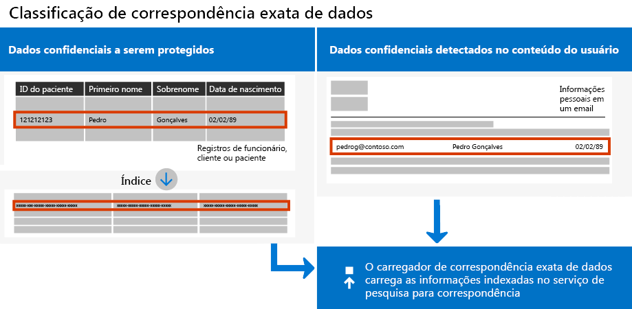

# <a name="create-custom-sensitive-information-types-with-exact-data-match-based-classification"></a><span data-ttu-id="87cf0-103">Criar tipos personalizados de informações confidenciais com classificação baseada em Exact Data Match</span><span class="sxs-lookup"><span data-stu-id="87cf0-103">Create custom sensitive information types with Exact Data Match based classification</span></span>

<span data-ttu-id="87cf0-104">[Tipos de informações confidenciais personalizadas](sensitive-information-type-learn-about.md) são usadas para ajudar a identificar itens confidenciais para que você possa evitar que sejam compartilhados inadvertidamente ou inadequadamente.</span><span class="sxs-lookup"><span data-stu-id="87cf0-104">[Custom sensitive information types](sensitive-information-type-learn-about.md) are used to help identify sensitive items so that you can prevent them from being inadvertently or inappropriately shared.</span></span> <span data-ttu-id="87cf0-105">Você define um tipo de informações confidenciais personalizada com base em:</span><span class="sxs-lookup"><span data-stu-id="87cf0-105">You define a custom sensitive information type based on:</span></span>

- <span data-ttu-id="87cf0-106">padrões</span><span class="sxs-lookup"><span data-stu-id="87cf0-106">patterns</span></span>
- <span data-ttu-id="87cf0-107">evidência de palavra-chave, como *funcionário*, *alça de preenchimento* ou *ID*</span><span class="sxs-lookup"><span data-stu-id="87cf0-107">keyword evidence such as *employee*, *badge*, or *ID*</span></span>
- <span data-ttu-id="87cf0-108">proximidade de um caractere da evidência em um padrão específico</span><span class="sxs-lookup"><span data-stu-id="87cf0-108">character proximity to evidence in a particular pattern</span></span>
- <span data-ttu-id="87cf0-109">níveis de confiança</span><span class="sxs-lookup"><span data-stu-id="87cf0-109">confidence levels</span></span>

 <span data-ttu-id="87cf0-110">Esses tipos personalizados de informações confidenciais atendem às necessidades comerciais de várias organizações.</span><span class="sxs-lookup"><span data-stu-id="87cf0-110">Such custom sensitive information types meet business needs for many organizations.</span></span>

<span data-ttu-id="87cf0-111">Mas e se você quiser um tipo personalizado de informações confidenciais que usa valores de dados exatos, em vez de corresponder apenas a padrões genéricos?</span><span class="sxs-lookup"><span data-stu-id="87cf0-111">But what if you wanted a custom sensitive information type that uses exact data values, instead of one that found matches based on generic patterns?</span></span> <span data-ttu-id="87cf0-112">Com a classificação baseada em Exact Data Match (EDM), você pode criar um tipo personalizado de informações confidenciais que é criada para:</span><span class="sxs-lookup"><span data-stu-id="87cf0-112">With Exact Data Match (EDM)-based classification, you can create a custom sensitive information type that is designed to:</span></span>

- <span data-ttu-id="87cf0-113">ser dinâmica e facilmente atualizada</span><span class="sxs-lookup"><span data-stu-id="87cf0-113">be dynamic and easily refreshed</span></span>
- <span data-ttu-id="87cf0-114">ser mais escalonável</span><span class="sxs-lookup"><span data-stu-id="87cf0-114">be more scalable</span></span>
- <span data-ttu-id="87cf0-115">resultar em menos falso-positivos</span><span class="sxs-lookup"><span data-stu-id="87cf0-115">result in fewer false-positives</span></span>
- <span data-ttu-id="87cf0-116">trabalhar com dados confidenciais estruturados</span><span class="sxs-lookup"><span data-stu-id="87cf0-116">work with structured sensitive data</span></span>
- <span data-ttu-id="87cf0-117">lidar com as informações confidenciais com mais segurança</span><span class="sxs-lookup"><span data-stu-id="87cf0-117">handle sensitive information more securely</span></span>
- <span data-ttu-id="87cf0-118">ser usado com vários serviços de nuvem da Microsoft</span><span class="sxs-lookup"><span data-stu-id="87cf0-118">be used with several Microsoft cloud services</span></span>



<span data-ttu-id="87cf0-120">A classificação baseada no EDM permite criar tipos personalizados de informações confidenciais que fazem referência a valores exatos em um banco de dados de informações confidenciais.</span><span class="sxs-lookup"><span data-stu-id="87cf0-120">EDM-based classification enables you to create custom sensitive information types that refer to exact values in a database of sensitive information.</span></span> <span data-ttu-id="87cf0-121">O banco de dados pode ser atualizado diariamente e pode conter até 100 milhões de linhas de dados.</span><span class="sxs-lookup"><span data-stu-id="87cf0-121">The database can be refreshed daily, and contain up to 100 million rows of data.</span></span> <span data-ttu-id="87cf0-122">Assim como funcionários, pacientes ou clientes vêm e vão e os registros são alterados, os tipos personalizados de informações confidenciais permanecem atualizados e aplicáveis.</span><span class="sxs-lookup"><span data-stu-id="87cf0-122">So as employees, patients, or clients come and go, and records change, your custom sensitive information types remain current and applicable.</span></span> <span data-ttu-id="87cf0-123">Você também pode usar a classificação baseada em EDM com políticas, como [políticas de prevenção contra perda de dados](data-loss-prevention-policies.md) (DLP) ou [políticas de arquivo do Microsoft Cloud App Security](https://docs.microsoft.com/cloud-app-security/data-protection-policies).</span><span class="sxs-lookup"><span data-stu-id="87cf0-123">And, you can use EDM-based classification with policies, such as [data loss prevention policies](data-loss-prevention-policies.md) (DLP) or [Microsoft Cloud App Security file policies](https://docs.microsoft.com/cloud-app-security/data-protection-policies).</span></span>

> [!NOTE]
> <span data-ttu-id="87cf0-124">A Proteção de Informações do Microsoft 365 agora oferece suporte a idiomas de conjunto de caracteres de byte duplo de visualização:</span><span class="sxs-lookup"><span data-stu-id="87cf0-124">Microsoft 365 Information Protection now  supports in preview double byte character set languages for:</span></span>
> - <span data-ttu-id="87cf0-125">Chinês (simplificado)</span><span class="sxs-lookup"><span data-stu-id="87cf0-125">Chinese (simplified)</span></span>
> - <span data-ttu-id="87cf0-126">Chinês (tradicional)</span><span class="sxs-lookup"><span data-stu-id="87cf0-126">Chinese (traditional)</span></span>
> - <span data-ttu-id="87cf0-127">Coreano</span><span class="sxs-lookup"><span data-stu-id="87cf0-127">Korean</span></span>
> - <span data-ttu-id="87cf0-128">Japonês</span><span class="sxs-lookup"><span data-stu-id="87cf0-128">Japanese</span></span>
> 
> <span data-ttu-id="87cf0-129">Este suporte está disponível para tipos de informações confidenciais.</span><span class="sxs-lookup"><span data-stu-id="87cf0-129">This support is available for sensitive information types.</span></span> <span data-ttu-id="87cf0-130">Para obter mais informações, confira [Suporte à proteção de informações para notas de versão de conjuntos de caracteres de byte duplo (visualização)](mip-dbcs-relnotes.md).</span><span class="sxs-lookup"><span data-stu-id="87cf0-130">See, [Information protection support for double byte character sets release notes (preview)](mip-dbcs-relnotes.md) for more information.</span></span>

## <a name="required-licenses-and-permissions"></a><span data-ttu-id="87cf0-131">Licenças e permissões necessárias</span><span class="sxs-lookup"><span data-stu-id="87cf0-131">Required licenses and permissions</span></span>

<span data-ttu-id="87cf0-132">Você deve ser um administrador global, administrador de conformidade ou administrador do Exchange Online para executar as tarefas descritas neste artigo.</span><span class="sxs-lookup"><span data-stu-id="87cf0-132">You must be a global admin, compliance administrator, or Exchange Online administrator to perform the tasks described in this article.</span></span> <span data-ttu-id="87cf0-133">Para saber mais sobre permissões DLP, confira [Permissões](data-loss-prevention-policies.md#permissions).</span><span class="sxs-lookup"><span data-stu-id="87cf0-133">To learn more about DLP permissions, see [Permissions](data-loss-prevention-policies.md#permissions).</span></span>

<span data-ttu-id="87cf0-134">A classificação baseada em EDM está incluída nestas assinaturas</span><span class="sxs-lookup"><span data-stu-id="87cf0-134">EDM-based classification is included in these subscriptions</span></span>

- <span data-ttu-id="87cf0-135">Office 365 E5</span><span class="sxs-lookup"><span data-stu-id="87cf0-135">Office 365 E5</span></span>
- <span data-ttu-id="87cf0-136">Microsoft 365 E5</span><span class="sxs-lookup"><span data-stu-id="87cf0-136">Microsoft 365 E5</span></span>
- <span data-ttu-id="87cf0-137">Conformidade do Microsoft 365 E5</span><span class="sxs-lookup"><span data-stu-id="87cf0-137">Microsoft 365 E5 Compliance</span></span>
- <span data-ttu-id="87cf0-138">Proteção e governança de informações do Microsoft E5/A5</span><span class="sxs-lookup"><span data-stu-id="87cf0-138">Microsoft E5/A5 Information Protection and Governance</span></span>

## <a name="portal-links-for-your-subscription"></a><span data-ttu-id="87cf0-139">Links do portal para sua assinatura</span><span class="sxs-lookup"><span data-stu-id="87cf0-139">Portal links for your subscription</span></span>


|<span data-ttu-id="87cf0-140">Portal</span><span class="sxs-lookup"><span data-stu-id="87cf0-140">Portal</span></span>  |<span data-ttu-id="87cf0-141">World Wide/GCC</span><span class="sxs-lookup"><span data-stu-id="87cf0-141">World Wide/GCC</span></span>  |<span data-ttu-id="87cf0-142">GCC-High</span><span class="sxs-lookup"><span data-stu-id="87cf0-142">GCC-High</span></span>  |<span data-ttu-id="87cf0-143">DOD</span><span class="sxs-lookup"><span data-stu-id="87cf0-143">DOD</span></span>  |
|---------|---------|---------|---------|
|<span data-ttu-id="87cf0-144">Office SCC</span><span class="sxs-lookup"><span data-stu-id="87cf0-144">Office SCC</span></span>     |  <span data-ttu-id="87cf0-145">protection.office.com</span><span class="sxs-lookup"><span data-stu-id="87cf0-145">protection.office.com</span></span>       |<span data-ttu-id="87cf0-146">scc.office365.us</span><span class="sxs-lookup"><span data-stu-id="87cf0-146">scc.office365.us</span></span>         |<span data-ttu-id="87cf0-147">scc.protection.apps.mil</span><span class="sxs-lookup"><span data-stu-id="87cf0-147">scc.protection.apps.mil</span></span> |
|<span data-ttu-id="87cf0-148">Centro de Segurança do Microsoft 365</span><span class="sxs-lookup"><span data-stu-id="87cf0-148">Microsoft 365 Security center</span></span>     |<span data-ttu-id="87cf0-149">security.microsoft.com</span><span class="sxs-lookup"><span data-stu-id="87cf0-149">security.microsoft.com</span></span>         |<span data-ttu-id="87cf0-150">security.microsoft.us</span><span class="sxs-lookup"><span data-stu-id="87cf0-150">security.microsoft.us</span></span>         |<span data-ttu-id="87cf0-151">security.apps.mil</span><span class="sxs-lookup"><span data-stu-id="87cf0-151">security.apps.mil</span></span>|
|<span data-ttu-id="87cf0-152">Centro de Conformidade do Microsoft 365</span><span class="sxs-lookup"><span data-stu-id="87cf0-152">Microsoft 365 Compliance center</span></span>     |<span data-ttu-id="87cf0-153">compliance.microsoft.com</span><span class="sxs-lookup"><span data-stu-id="87cf0-153">compliance.microsoft.com</span></span>         |<span data-ttu-id="87cf0-154">compliance.microsoft.us</span><span class="sxs-lookup"><span data-stu-id="87cf0-154">compliance.microsoft.us</span></span>         |<span data-ttu-id="87cf0-155">compliance.apps.mil</span><span class="sxs-lookup"><span data-stu-id="87cf0-155">compliance.apps.mil</span></span>|


## <a name="the-work-flow-at-a-glance"></a><span data-ttu-id="87cf0-156">Visão geral do fluxo de trabalho </span><span class="sxs-lookup"><span data-stu-id="87cf0-156">The work flow at a glance</span></span>

|<span data-ttu-id="87cf0-157">Fase</span><span class="sxs-lookup"><span data-stu-id="87cf0-157">Phase</span></span>  |<span data-ttu-id="87cf0-158">Requisitos</span><span class="sxs-lookup"><span data-stu-id="87cf0-158">What's needed</span></span>  |
|---------|---------|
|[<span data-ttu-id="87cf0-159">Parte 1: Configuração da classificação baseada em EDM</span><span class="sxs-lookup"><span data-stu-id="87cf0-159">Part 1: Set up EDM-based classification</span></span>](#part-1-set-up-edm-based-classification)<br/><br/><span data-ttu-id="87cf0-160">(conforme o necessário)</span><span class="sxs-lookup"><span data-stu-id="87cf0-160">(As needed)</span></span><br/><span data-ttu-id="87cf0-161">- [Edite o Esquema de Banco de Dados](#editing-the-schema-for-edm-based-classification)</span><span class="sxs-lookup"><span data-stu-id="87cf0-161">- [Edit the database schema](#editing-the-schema-for-edm-based-classification)</span></span> <br/><span data-ttu-id="87cf0-162">- [Remova o esquema](#removing-the-schema-for-edm-based-classification)</span><span class="sxs-lookup"><span data-stu-id="87cf0-162">- [Remove the schema](#removing-the-schema-for-edm-based-classification)</span></span> |<span data-ttu-id="87cf0-163">– Acesso de leitura aos dados confidenciais</span><span class="sxs-lookup"><span data-stu-id="87cf0-163">- Read access to the sensitive data</span></span><br/><span data-ttu-id="87cf0-164">– Esquema de banco de dados no formato XML (exemplo fornecido)</span><span class="sxs-lookup"><span data-stu-id="87cf0-164">- Database schema in XML format (example provided)</span></span><br/><span data-ttu-id="87cf0-165">– Pacote de regras no formato XML (exemplo fornecido)</span><span class="sxs-lookup"><span data-stu-id="87cf0-165">- Rule package in XML format (example provided)</span></span><br/><span data-ttu-id="87cf0-166">– Permissões de administrador ao Centro de Conformidade e Segurança (usando o PowerShell)</span><span class="sxs-lookup"><span data-stu-id="87cf0-166">- Admin permissions to the Security & Compliance Center (using PowerShell)</span></span> |
|[<span data-ttu-id="87cf0-167">Parte 2: hash e carregamento de dados confidenciais</span><span class="sxs-lookup"><span data-stu-id="87cf0-167">Part 2: Hash and upload the sensitive data</span></span>](#part-2-hash-and-upload-the-sensitive-data)<br/><br/><span data-ttu-id="87cf0-168">(conforme o necessário)</span><span class="sxs-lookup"><span data-stu-id="87cf0-168">(As needed)</span></span><br/>[<span data-ttu-id="87cf0-169">Atualize os dados</span><span class="sxs-lookup"><span data-stu-id="87cf0-169">Refresh the data</span></span>](#refreshing-your-sensitive-information-database) |<span data-ttu-id="87cf0-170">– Grupo de segurança personalizado e conta de usuário</span><span class="sxs-lookup"><span data-stu-id="87cf0-170">- Custom security group and user account</span></span><br/><span data-ttu-id="87cf0-171">– Acesso de administrador local à máquina com o agente de carregamento do EDM</span><span class="sxs-lookup"><span data-stu-id="87cf0-171">- Local admin access to machine with EDM Upload Agent</span></span><br/><span data-ttu-id="87cf0-172">– Acesso de leitura aos dados confidenciais</span><span class="sxs-lookup"><span data-stu-id="87cf0-172">- Read access to the sensitive data</span></span><br/><span data-ttu-id="87cf0-173">– Processar e agendar a atualização de dados</span><span class="sxs-lookup"><span data-stu-id="87cf0-173">- Process and schedule for refreshing the data</span></span>|
|[<span data-ttu-id="87cf0-174">Parte 3: uso da classificação baseada em EDM com os serviços de nuvem da Microsoft</span><span class="sxs-lookup"><span data-stu-id="87cf0-174">Part 3: Use EDM-based classification with your Microsoft cloud services</span></span>](#part-3-use-edm-based-classification-with-your-microsoft-cloud-services) |<span data-ttu-id="87cf0-175">– Assinatura do Microsoft 365 com DLP</span><span class="sxs-lookup"><span data-stu-id="87cf0-175">- Microsoft 365 subscription with DLP</span></span><br/><span data-ttu-id="87cf0-176">– Recurso de classificação baseada em EDM habilitado</span><span class="sxs-lookup"><span data-stu-id="87cf0-176">- EDM-based classification feature enabled</span></span> |

### <a name="part-1-set-up-edm-based-classification"></a><span data-ttu-id="87cf0-177">Parte 1: Configuração da classificação baseada em EDM</span><span class="sxs-lookup"><span data-stu-id="87cf0-177">Part 1: Set up EDM-based classification</span></span>

<span data-ttu-id="87cf0-178">Organizar e configurar a classificação baseada em EDM envolve:</span><span class="sxs-lookup"><span data-stu-id="87cf0-178">Setting up and configuring EDM-based classification involves:</span></span>

1. [<span data-ttu-id="87cf0-179">Salvar os dados confidenciais no formato .csv</span><span class="sxs-lookup"><span data-stu-id="87cf0-179">Saving sensitive data in .csv format</span></span>](#save-sensitive-data-in-csv-format)
2. [<span data-ttu-id="87cf0-180">Definir o esquema do banco de dados de informações confidenciais</span><span class="sxs-lookup"><span data-stu-id="87cf0-180">Define your sensitive information database schema</span></span>](#define-the-schema-for-your-database-of-sensitive-information)
3. [<span data-ttu-id="87cf0-181">Configurar um pacote de regras</span><span class="sxs-lookup"><span data-stu-id="87cf0-181">Create a rule package</span></span>](#set-up-a-rule-package)


#### <a name="save-sensitive-data-in-csv-format"></a><span data-ttu-id="87cf0-182">Salvar os dados confidenciais no formato .csv</span><span class="sxs-lookup"><span data-stu-id="87cf0-182">Save sensitive data in .csv format</span></span>

1. <span data-ttu-id="87cf0-183">Identifique as informações confidenciais que deseja usar.</span><span class="sxs-lookup"><span data-stu-id="87cf0-183">Identify the sensitive information you want to use.</span></span> <span data-ttu-id="87cf0-184">Exporte os dados para um aplicativo, como o Microsoft Excel, e salve o arquivo no formato .csv.</span><span class="sxs-lookup"><span data-stu-id="87cf0-184">Export the data to an app, such as Microsoft Excel, and save the file in .csv format.</span></span> <span data-ttu-id="87cf0-185">O arquivo de dados pode incluir um máximo de:</span><span class="sxs-lookup"><span data-stu-id="87cf0-185">The data file can include a maximum of:</span></span>
      - <span data-ttu-id="87cf0-186">Até 100 milhões de linhas de dados confidenciais</span><span class="sxs-lookup"><span data-stu-id="87cf0-186">Up to 100 million rows of sensitive data</span></span>
      - <span data-ttu-id="87cf0-187">Até 32 colunas (campos) por fonte de dados</span><span class="sxs-lookup"><span data-stu-id="87cf0-187">Up to 32 columns (fields) per data source</span></span>
      - <span data-ttu-id="87cf0-188">Até 5 colunas (campos) marcadas como pesquisáveis</span><span class="sxs-lookup"><span data-stu-id="87cf0-188">Up to 5 columns (fields) marked as searchable</span></span>

2. <span data-ttu-id="87cf0-189">Estruture os dados confidenciais no arquivo .csv, de modo que a primeira linha inclui os nomes dos campos usados na classificação baseada em EDM.</span><span class="sxs-lookup"><span data-stu-id="87cf0-189">Structure the sensitive data in the .csv file such that the first row includes the names of the fields used for EDM-based classification.</span></span> <span data-ttu-id="87cf0-190">Você pode ter nomes de campo no arquivo .csv, como "CPF", "data de nascimento", "nome", "sobrenome".</span><span class="sxs-lookup"><span data-stu-id="87cf0-190">In your .csv file, you might have field names, such as "ssn", "birthdate", "firstname", "lastname".</span></span> <span data-ttu-id="87cf0-191">Os nomes de cabeçalhos de coluna não podem conter espaços ou sublinhados.</span><span class="sxs-lookup"><span data-stu-id="87cf0-191">The column header names can't include spaces or underscores.</span></span> <span data-ttu-id="87cf0-192">Por exemplo, o arquivo .csv de amostra que usamos neste artigo é denominado *PatientRecords.csv* e suas colunas incluem *PatientID*, *MRN*, *LastName*, *FirstName*, *SSN* e mais.</span><span class="sxs-lookup"><span data-stu-id="87cf0-192">For example, the sample .csv file that we use in this article is named *PatientRecords.csv*, and its columns include *PatientID*, *MRN*, *LastName*, *FirstName*, *SSN*, and more.</span></span>

3. <span data-ttu-id="87cf0-193">Preste atenção ao formato dos campos de dados confidenciais.</span><span class="sxs-lookup"><span data-stu-id="87cf0-193">Pay attention to the format of the sensitive data fields.</span></span> <span data-ttu-id="87cf0-194">Em particular, os campos que podem conter vírgulas em seu conteúdo (por exemplo, um endereço que contém o valor "Seattle, WA") seriam analisados como dois campos separados quando analisados pela ferramenta EDM.</span><span class="sxs-lookup"><span data-stu-id="87cf0-194">In particular, fields that may contain commas in their content (e.g. a street address that contains the value "Seattle,WA") would be parsed as two separate fields when parsed by the EDM tool.</span></span> <span data-ttu-id="87cf0-195">Para evitar isso, certifique-se de que esses campos estejam entre aspas simples ou duplas na tabela de dados confidenciais.</span><span class="sxs-lookup"><span data-stu-id="87cf0-195">In order to avoid this, you need to ensure such fields are surrounded by single or double quotes in the sensitive data table.</span></span> <span data-ttu-id="87cf0-196">Se os campos com vírgulas também puderem conter espaços, você precisará criar um Tipo de Informação Confidencial personalizado que corresponda ao formato correspondente (por exemplo, uma cadeia de caracteres de várias palavras com vírgulas e espaços) para garantir que a cadeia de caracteres seja correspondida corretamente quando o documento é verificado.</span><span class="sxs-lookup"><span data-stu-id="87cf0-196">If fields with commas in them may also contain spaces, you would need to create a custom Sensitive Information Type that matches the corresponding format (e.g. a multi-word string with commas and spaces in it) to ensure the string is correctly matched when the document is scanned.</span></span>

#### <a name="define-the-schema-for-your-database-of-sensitive-information"></a><span data-ttu-id="87cf0-197">Definir o esquema para seu banco de dados de informações confidenciais</span><span class="sxs-lookup"><span data-stu-id="87cf0-197">Define the schema for your database of sensitive information</span></span>

<span data-ttu-id="87cf0-198">Se, por motivos técnico ou de negócios, você preferir não usar o Windows PowerShell ou a linha de comando para criar o esquema e padrão do tipo de informações confidenciais do EDM (pacote de regras), poderá usar o [Assistente de Correspondência Exata de Dados e Tipo de Informações Confidenciais](sit-edm-wizard.md) para criá-los.</span><span class="sxs-lookup"><span data-stu-id="87cf0-198">If for business or technical reasons, you prefer not to use PowerShell or command line to create your schema and EDM sensitive info type patter (rule package), you can use the [Exact Data Match Schema and Sensitive Information Type Wizard](sit-edm-wizard.md) to create them.</span></span> <span data-ttu-id="87cf0-199">Quando terminar de criar o esquema e o padrão do tipo de informações confidenciais do EDM, volte para concluir todas as etapas necessárias para disponibilizar seu EDM para o seu tipo de informações confidenciais.</span><span class="sxs-lookup"><span data-stu-id="87cf0-199">When you are done creating the schema and EDM sensitive info type pattern, return to complete all the steps necessary to make your EDM based sensitive information type available for use.</span></span>

> [!NOTE]
> <span data-ttu-id="87cf0-200">O Assistente de Correspondência Exata de Dados e Tipo de Informações Confidenciais está disponível apenas para as nuvens World Wide e GCC.</span><span class="sxs-lookup"><span data-stu-id="87cf0-200">The Exact Data Match Schema and Sensitive Information Type Wizard is only available for the World Wide and GCC clouds only.</span></span>

1. <span data-ttu-id="87cf0-201">Defina o esquema para o banco de dados de informações confidenciais no formato XML (semelhante ao nosso exemplo a seguir).</span><span class="sxs-lookup"><span data-stu-id="87cf0-201">Define the schema for the database of sensitive information in XML format (similar to our example below).</span></span> <span data-ttu-id="87cf0-202">Nomeie esse arquivo de esquema como **edm.xml** e configure-o de forma que, para cada coluna no banco de dados, haja uma linha que use a sintaxe:</span><span class="sxs-lookup"><span data-stu-id="87cf0-202">Name this schema file **edm.xml**, and configure it such that for each column in the database, there is a line that uses the syntax:</span></span> 

      <span data-ttu-id="87cf0-203">`\<Field name="" searchable=""/\>`.</span><span class="sxs-lookup"><span data-stu-id="87cf0-203">`\<Field name="" searchable=""/\>`.</span></span>

      - <span data-ttu-id="87cf0-204">Use nomes de coluna para valores de *Nome de campo*.</span><span class="sxs-lookup"><span data-stu-id="87cf0-204">Use column names for *Field name* values.</span></span>
      - <span data-ttu-id="87cf0-205">Use *searchable = "true"* para os campos que você deseja que sejam pesquisáveis de ​​até no máximo 5 campos.</span><span class="sxs-lookup"><span data-stu-id="87cf0-205">Use *searchable="true"* for the fields that you want to be searchable up to a maximum of 5 fields.</span></span> <span data-ttu-id="87cf0-206">Pelo menos um campo deve ser pesquisável.</span><span class="sxs-lookup"><span data-stu-id="87cf0-206">At least one field must be searchable.</span></span>

      <span data-ttu-id="87cf0-207">Como exemplo, o seguinte arquivo XML define o esquema para um banco de dados de registros de pacientes, com cinco campos especificados como pesquisáveis: *PatientID*, *MRN*, *SSN*, *Telefone* e *DOB*.</span><span class="sxs-lookup"><span data-stu-id="87cf0-207">As an example, the following XML file defines the schema for a patient records database, with five fields specified as searchable: *PatientID*, *MRN*, *SSN*, *Phone*, and *DOB*.</span></span>

      <span data-ttu-id="87cf0-208">(Você pode copiar, modificar e usar nosso exemplo.)</span><span class="sxs-lookup"><span data-stu-id="87cf0-208">(You can copy, modify, and use our example.)</span></span>

      ```xml
      <EdmSchema xmlns="http://schemas.microsoft.com/office/2018/edm">
            <DataStore name="PatientRecords" description="Schema for patient records" version="1">
                  <Field name="PatientID" searchable="true" caseInsensitive="true" ignoredDelimiters="-,/,*,#,^" />
                  <Field name="MRN" searchable="true" />
                  <Field name="FirstName" />
                  <Field name="LastName" />
                  <Field name="SSN" searchable="true" />
                  <Field name="Phone" searchable="true" />
                  <Field name="DOB" searchable="true" />
                  <Field name="Gender" />
                  <Field name="Address" />
            </DataStore>
      </EdmSchema>
      ```

##### <a name="configurable-match-using-the-caseinsensitive-and-ignoreddelimiters-fields"></a><span data-ttu-id="87cf0-209">Correspondência configurável usando os campos caseInsensitive e ignoredDelimiters</span><span class="sxs-lookup"><span data-stu-id="87cf0-209">Configurable match using the caseInsensitive and ignoredDelimiters fields</span></span>

<span data-ttu-id="87cf0-210">As amostras XML acima usam os campos `caseInsensitive` e `ignoredDelimiters`.</span><span class="sxs-lookup"><span data-stu-id="87cf0-210">The above XML sample makes use of the `caseInsensitive` and the `ignoredDelimiters` fields.</span></span> 

<span data-ttu-id="87cf0-211">Quando você incluir o campo \***caseInsensitive** _ definido para o valor de `true` em sua definição de esquema o EDM não excluirá um item baseado em diferenças de maiúsculas para o campo `PatientID`.</span><span class="sxs-lookup"><span data-stu-id="87cf0-211">When you include the \***caseInsensitive** _ field set to the value of `true` in your schema definition, EDM will not exclude an item based on case differences for `PatientID` field.</span></span> <span data-ttu-id="87cf0-212">Dessa forma, o EDM verá `PatientID` _ *FOO-1234*\* e **fOo-1234** como idênticos.</span><span class="sxs-lookup"><span data-stu-id="87cf0-212">So EDM will see, `PatientID` _ *FOO-1234*\* and **fOo-1234** as being identical.</span></span>

<span data-ttu-id="87cf0-213">Quando você inclui o campo \* **ignoreDelimiters** _ com caracteres suportados, o EDM irá ignorar esses caracteres no `PatientID`.</span><span class="sxs-lookup"><span data-stu-id="87cf0-213">When you include the \***ignoredDelimiters** _ field with supported characters,  EDM will ignore those characters in the `PatientID`.</span></span> <span data-ttu-id="87cf0-214">Dessa forma, o EDM verá `PatientID` _ *FOO-1234*\* e `PatientID` **fOo-1234** como idênticos.</span><span class="sxs-lookup"><span data-stu-id="87cf0-214">So EDM will see, `PatientID` _ *FOO-1234*\* and `PatientID` **FOO#1234** as being identical.</span></span> <span data-ttu-id="87cf0-215">O sinalizador `ignoredDelimiters` dá suporte a qualquer caractere não alfanumérico, aqui estão alguns exemplos:</span><span class="sxs-lookup"><span data-stu-id="87cf0-215">The `ignoredDelimiters` flag supports any non-alphanumeric character, here are some examples:</span></span>
- <span data-ttu-id="87cf0-216">\.</span><span class="sxs-lookup"><span data-stu-id="87cf0-216">\.</span></span>
- \-
- \/
- \_
- \*
- \^
- \#
- \!
- \?
- \[
- \]
- \{
- \}
- \\
- \~
- \; 

- <span data-ttu-id="87cf0-217">O sinalizador `ignoredDelimiters` não tem suporte para:</span><span class="sxs-lookup"><span data-stu-id="87cf0-217">The `ignoredDelimiters` flag doesn't support:</span></span>
- <span data-ttu-id="87cf0-218">caracteres de 0 a 9</span><span class="sxs-lookup"><span data-stu-id="87cf0-218">characters 0-9</span></span>
- <span data-ttu-id="87cf0-219">A-Z</span><span class="sxs-lookup"><span data-stu-id="87cf0-219">A-Z</span></span>
- <span data-ttu-id="87cf0-220">a-z</span><span class="sxs-lookup"><span data-stu-id="87cf0-220">a-z</span></span>
- \"
- \,

<span data-ttu-id="87cf0-221">Nesse exemplo, onde `caseInsensitive` e `ignoredDelimiters` são usados, o EDM veria **FOO-1234** e **fOo#1234** como idênticos e classificaria o item como tipo de informação confidencial do registro do paciente.</span><span class="sxs-lookup"><span data-stu-id="87cf0-221">In this example, where both `caseInsensitive` and `ignoredDelimiters` are used, EDM would see **FOO-1234** and **fOo#1234** as  identical and classify the item as a patient record sensitive information type.</span></span> 

4. <span data-ttu-id="87cf0-222">Conectar ao centro de Conformidade e Segurança usando os procedimentos em [Conectar ao Centro de Conformidade e Segurança do PowerShell](https://docs.microsoft.com/powershell/exchange/connect-to-scc-powershell).</span><span class="sxs-lookup"><span data-stu-id="87cf0-222">Connect to the Security & Compliance center using the procedures in [Connect to Security & Compliance Center PowerShell](https://docs.microsoft.com/powershell/exchange/connect-to-scc-powershell).</span></span>

5. <span data-ttu-id="87cf0-223">Para carregar o esquema do banco de dados, execute os seguintes cmdlets, um de cada vez:</span><span class="sxs-lookup"><span data-stu-id="87cf0-223">To upload the database schema, run the following cmdlets, one at a time:</span></span>

      ```powershell
      $edmSchemaXml=Get-Content .\\edm.xml -Encoding Byte -ReadCount 0
      New-DlpEdmSchema -FileData $edmSchemaXml -Confirm:$true
      ```

      <span data-ttu-id="87cf0-224">Você será solicitado a confirmar da seguinte maneira:</span><span class="sxs-lookup"><span data-stu-id="87cf0-224">You will be prompted to confirm, as follows:</span></span>

      > <span data-ttu-id="87cf0-225">Confirmar</span><span class="sxs-lookup"><span data-stu-id="87cf0-225">Confirm</span></span>
      >
      > <span data-ttu-id="87cf0-226">Tem certeza que deseja executar essa ação?</span><span class="sxs-lookup"><span data-stu-id="87cf0-226">Are you sure you want to perform this action?</span></span>
      >
      > <span data-ttu-id="87cf0-227">O novo esquema EDM para o repositório de dado 'patientrecords' será importado.</span><span class="sxs-lookup"><span data-stu-id="87cf0-227">New EDM Schema for the data store 'patientrecords' will be imported.</span></span>
      >
      > <span data-ttu-id="87cf0-228">\[S\] Sim \[A\] Sim para Todos \[N\] Não \[L\] Não para Todos \[?\] Ajuda (padrão é “Y”):</span><span class="sxs-lookup"><span data-stu-id="87cf0-228">\[Y\] Yes \[A\] Yes to All \[N\] No \[L\] No to All \[?\] Help (default is "Y"):</span></span>

> [!TIP]
> <span data-ttu-id="87cf0-229">Se você deseja que suas alterações ocorram sem confirmação, na Etapa 5, use este cmdlet: New-DlpEdmSchema -FileData $edmSchemaXml</span><span class="sxs-lookup"><span data-stu-id="87cf0-229">If you want your changes to occur without confirmation, in Step 5, use this cmdlet instead: New-DlpEdmSchema -FileData $edmSchemaXml</span></span>

> [!NOTE]
> <span data-ttu-id="87cf0-230">Pode levar de 10 a 60 minutos para atualizar o EDMSchema com as adições.</span><span class="sxs-lookup"><span data-stu-id="87cf0-230">It can take between 10-60 minutes to update the EDMSchema with additions.</span></span> <span data-ttu-id="87cf0-231">A atualização deve ser concluída antes que você execute as etapas que usam as adições.</span><span class="sxs-lookup"><span data-stu-id="87cf0-231">The update must complete before you execute steps that use the additions.</span></span>

#### <a name="set-up-a-rule-package"></a><span data-ttu-id="87cf0-232">Configurar um pacote de regras</span><span class="sxs-lookup"><span data-stu-id="87cf0-232">Set up a rule package</span></span>

1. <span data-ttu-id="87cf0-233">Crie um pacote de regras no formato XML (com codificação Unicode), semelhante ao exemplo a seguir.</span><span class="sxs-lookup"><span data-stu-id="87cf0-233">Create a rule package in XML format (with Unicode encoding), similar to the following example.</span></span> <span data-ttu-id="87cf0-234">(Você pode copiar, modificar e usar nosso exemplo.)</span><span class="sxs-lookup"><span data-stu-id="87cf0-234">(You can copy, modify, and use our example.)</span></span>

      <span data-ttu-id="87cf0-235">Ao configurar o seu pacote de regras, certifique-se de referenciar corretamente o arquivo .csv e o arquivo **edm.xml**.</span><span class="sxs-lookup"><span data-stu-id="87cf0-235">When you set up your rule package, make sure to correctly reference your .csv file and **edm.xml** file.</span></span> <span data-ttu-id="87cf0-236">Você pode copiar, modificar e usar nosso exemplo.</span><span class="sxs-lookup"><span data-stu-id="87cf0-236">You can copy, modify, and use our example.</span></span> <span data-ttu-id="87cf0-237">Neste exemplo de xml, os seguintes campos precisam ser personalizados para criar seu tipo confidencial do EDM:</span><span class="sxs-lookup"><span data-stu-id="87cf0-237">In this sample xml the following fields needs to be customized to create your EDM sensitive type:</span></span>

      - <span data-ttu-id="87cf0-238">**Id do RulePack e id ExactMatch**: Use [New-GUID](https://docs.microsoft.com/powershell/module/microsoft.powershell.utility/new-guid?view=powershell-6) para gerar um GUID.</span><span class="sxs-lookup"><span data-stu-id="87cf0-238">**RulePack id & ExactMatch id**: Use [New-GUID](https://docs.microsoft.com/powershell/module/microsoft.powershell.utility/new-guid?view=powershell-6) to generate a GUID.</span></span>

      - <span data-ttu-id="87cf0-239">**Datastore**: este campo especifica o repositório de dados de pesquisa EDM a ser usado.</span><span class="sxs-lookup"><span data-stu-id="87cf0-239">**Datastore**: This field specifies EDM lookup data store to be used.</span></span> <span data-ttu-id="87cf0-240">Forneça um nome de fonte de dados de um esquema EDM configurado.</span><span class="sxs-lookup"><span data-stu-id="87cf0-240">You provide a data source name of a configured EDM Schema.</span></span>

      - <span data-ttu-id="87cf0-241">**idMatch**: este campo aponta para o elemento principal do EDM.</span><span class="sxs-lookup"><span data-stu-id="87cf0-241">**idMatch**: This field points to the primary element for EDM.</span></span>
        - <span data-ttu-id="87cf0-242">Correspondências: especifica o campo a ser usado na pesquisa exata.</span><span class="sxs-lookup"><span data-stu-id="87cf0-242">Matches: Specifies the field to be used in exact lookup.</span></span> <span data-ttu-id="87cf0-243">Forneça um nome de campo pesquisável no esquema EDM para o DataStore.</span><span class="sxs-lookup"><span data-stu-id="87cf0-243">You provide a searchable field name in EDM Schema for the DataStore.</span></span>
        - <span data-ttu-id="87cf0-244">Classificação: este campo especifica a correspondência de tipo confidencial que dispara a pesquisa EDM.</span><span class="sxs-lookup"><span data-stu-id="87cf0-244">Classification: This field specifies the sensitive type match that triggers EDM lookup.</span></span> <span data-ttu-id="87cf0-245">Você pode fornecer o nome ou o GUID de um tipo de informação confidencial interno ou personalizado existente.</span><span class="sxs-lookup"><span data-stu-id="87cf0-245">You can provide the Name or GUID of an existing built-in or custom sensitive information type.</span></span> <span data-ttu-id="87cf0-246">Esteja ciente de que qualquer cadeia de caracteres que corresponda ao tipo de informação confidencial fornecido terá um hash e será comparado a cada entrada na tabela de informações sensíveis.</span><span class="sxs-lookup"><span data-stu-id="87cf0-246">Be aware that any string that matches the sensitive information type provided will be hashed and compared to every entry in the sensitive information table.</span></span> <span data-ttu-id="87cf0-247">Para evitar causar problemas de desempenho, se você usar um tipo de informação confidencial personalizado como o elemento de Classificação em EDM, evite usar um que corresponda a uma grande porcentagem do conteúdo (como "qualquer número" ou "qualquer palavra de cinco letras") adicionando palavras-chave de suporte ou incluindo formatação na definição do tipo de informação confidencial de classificação personalizada.</span><span class="sxs-lookup"><span data-stu-id="87cf0-247">In order to avoid causing performance issues, if you use a custom sensitive information type as the Classification element in EDM, avoid using one that will match a large percentage of content (such as "any number" or "any five-letter word") by adding supporting keywords or including formatting in the definition of the custom classification sensitive information type.</span></span> 

      - <span data-ttu-id="87cf0-248">**Corresponder:** este campo aponta para evidências adicionais encontradas em proximidade do idMatch.</span><span class="sxs-lookup"><span data-stu-id="87cf0-248">**Match:** This field points to additional evidence found in proximity of idMatch.</span></span>
        - <span data-ttu-id="87cf0-249">Correspondências: forneça o nome do campo no esquema EMD para DataStore.</span><span class="sxs-lookup"><span data-stu-id="87cf0-249">Matches: You provide any field name in EDM Schema for DataStore.</span></span>
      - <span data-ttu-id="87cf0-250">**Recurso:** esta seção especifica o nome e a descrição do tipo confidencial em várias localidades.</span><span class="sxs-lookup"><span data-stu-id="87cf0-250">**Resource:** This section specifies the name and description for sensitive type in multiple locales.</span></span>
        - <span data-ttu-id="87cf0-251">idRef: forneça GUID para ExactMatch id.</span><span class="sxs-lookup"><span data-stu-id="87cf0-251">idRef: You provide GUID for ExactMatch ID.</span></span>
        - <span data-ttu-id="87cf0-252">Nomes e descrições: personalizar conforme necessário.</span><span class="sxs-lookup"><span data-stu-id="87cf0-252">Name & descriptions: customize as required.</span></span>

      ```xml
      <RulePackage xmlns="http://schemas.microsoft.com/office/2018/edm">
        <RulePack id="fd098e03-1796-41a5-8ab6-198c93c62b11">
          <Version build="0" major="2" minor="0" revision="0" />
          <Publisher id="eb553734-8306-44b4-9ad5-c388ad970528" />
          <Details defaultLangCode="en-us">
            <LocalizedDetails langcode="en-us">
              <PublisherName>IP DLP</PublisherName>
              <Name>Health Care EDM Rulepack</Name>
              <Description>This rule package contains the EDM sensitive type for health care sensitive types.</Description>
            </LocalizedDetails>
          </Details>
        </RulePack>
        <Rules>
          <ExactMatch id = "E1CC861E-3FE9-4A58-82DF-4BD259EAB371" patternsProximity = "300" dataStore ="PatientRecords" recommendedConfidence = "65" >
            <Pattern confidenceLevel="65">
              <idMatch matches = "SSN" classification = "U.S. Social Security Number (SSN)" />
            </Pattern>
            <Pattern confidenceLevel="75">
              <idMatch matches = "SSN" classification = "U.S. Social Security Number (SSN)" />
              <Any minMatches ="3" maxMatches ="6">
                <match matches="PatientID" />
                <match matches="MRN"/>
                <match matches="FirstName"/>
                <match matches="LastName"/>
                <match matches="Phone"/>
                <match matches="DOB"/>
              </Any>
            </Pattern>
          </ExactMatch>
          <LocalizedStrings>
            <Resource idRef="E1CC861E-3FE9-4A58-82DF-4BD259EAB371">
              <Name default="true" langcode="en-us">Patient SSN Exact Match.</Name>
              <Description default="true" langcode="en-us">EDM Sensitive type for detecting Patient SSN.</Description>
            </Resource>
          </LocalizedStrings>
        </Rules>
      </RulePackage>
      ```

2. <span data-ttu-id="87cf0-253">Carregue o pacote de regras executando os seguintes cmdlets do PowerShell, um de cada vez:</span><span class="sxs-lookup"><span data-stu-id="87cf0-253">Upload the rule package by running the following PowerShell cmdlets, one at a time:</span></span>

      ```powershell
      $rulepack=Get-Content .\\rulepack.xml -Encoding Byte -ReadCount 0
      New-DlpSensitiveInformationTypeRulePackage -FileData $rulepack
      ```

<span data-ttu-id="87cf0-254">Nesse ponto, você configurou a classificação baseada em EDM.</span><span class="sxs-lookup"><span data-stu-id="87cf0-254">At this point, you have set up EDM-based classification.</span></span> <span data-ttu-id="87cf0-255">A próxima etapa é criar o hash dos dados confidenciais e carregar os hashes de indexação.</span><span class="sxs-lookup"><span data-stu-id="87cf0-255">The next step is to hash the sensitive data, and then upload the hashes for indexing.</span></span>

<span data-ttu-id="87cf0-256">Lembre-se do procedimento anterior onde o nosso esquema PatientRecords define cinco campos como pesquisáveis: *PatientID*, *MRN*, *SSN*, *Phone* e *DOB*.</span><span class="sxs-lookup"><span data-stu-id="87cf0-256">Recall from the previous procedure that our PatientRecords schema defines five fields as searchable: *PatientID*, *MRN*, *SSN*, *Phone*, and *DOB*.</span></span> <span data-ttu-id="87cf0-257">Nosso pacote de regras de exemplo inclui esses campos e faz referência ao arquivo de esquema do banco de dados (**edm.xml**), com um item *ExactMatch* por campo pesquisável.</span><span class="sxs-lookup"><span data-stu-id="87cf0-257">Our example rule package includes those fields and references the database schema file (**edm.xml**), with one *ExactMatch* item per searchable field.</span></span> <span data-ttu-id="87cf0-258">Considere o seguinte item ExactMatch:</span><span class="sxs-lookup"><span data-stu-id="87cf0-258">Consider the following ExactMatch item:</span></span>

```xml
<ExactMatch id = "E1CC861E-3FE9-4A58-82DF-4BD259EAB371" patternsProximity = "300" dataStore ="PatientRecords" recommendedConfidence = "65" >
      <Pattern confidenceLevel="65">
        <idMatch matches = "SSN" classification = "U.S. Social Security Number (SSN)" />
      </Pattern>
      <Pattern confidenceLevel="75">
        <idMatch matches = "SSN" classification = "U.S. Social Security Number (SSN)" />
        <Any minMatches ="3" maxMatches ="100">
          <match matches="PatientID" />
          <match matches="MRN"/>
          <match matches="FirstName"/>
          <match matches="LastName"/>
          <match matches="Phone"/>
          <match matches="DOB"/>
        </Any>
      </Pattern>
    </ExactMatch>
```

<span data-ttu-id="87cf0-259">Nesse exemplo, observe que:</span><span class="sxs-lookup"><span data-stu-id="87cf0-259">In this example, note that:</span></span>

- <span data-ttu-id="87cf0-260">O nome do dataStore faz referência ao arquivo .csv que criamos anteriormente: **dataStore = "PatientRecords"**.</span><span class="sxs-lookup"><span data-stu-id="87cf0-260">The dataStore name references the .csv file we created earlier: **dataStore = "PatientRecords"**.</span></span>

- <span data-ttu-id="87cf0-261">O valor idMatch faz referência a um campo pesquisável listado no arquivo de esquema do banco de dados: **idMatch matches = "SSN"**.</span><span class="sxs-lookup"><span data-stu-id="87cf0-261">The idMatch value references a searchable field that is listed in the database schema file: **idMatch matches = "SSN"**.</span></span>

- <span data-ttu-id="87cf0-262">O valor de classificação faz referência a um tipo de informação confidencial existente ou personalizada: **classification = "Número de Seguridade Social dos EUA (SSN)"**.</span><span class="sxs-lookup"><span data-stu-id="87cf0-262">The classification value references an existing or custom sensitive information type: **classification = "U.S. Social Security Number (SSN)"**.</span></span> <span data-ttu-id="87cf0-263">(Nesse caso, usamos o tipo de informação confidencial existente do Número de Seguridade Social dos EUA.)</span><span class="sxs-lookup"><span data-stu-id="87cf0-263">(In this case, we use the existing sensitive information type of U.S. Social Security Number.)</span></span>

> [!NOTE]
> <span data-ttu-id="87cf0-264">Pode levar de 10 a 60 minutos para atualizar o EDMSchema com as adições.</span><span class="sxs-lookup"><span data-stu-id="87cf0-264">It can take between 10-60 minutes to update the EDMSchema with additions.</span></span> <span data-ttu-id="87cf0-265">A atualização deve ser concluída antes que você execute as etapas que usam as adições.</span><span class="sxs-lookup"><span data-stu-id="87cf0-265">The update must complete before you execute steps that use the additions.</span></span>

#### <a name="editing-the-schema-for-edm-based-classification"></a><span data-ttu-id="87cf0-266">Editando o esquema para classificação baseada em EDM</span><span class="sxs-lookup"><span data-stu-id="87cf0-266">Editing the schema for EDM-based classification</span></span>

<span data-ttu-id="87cf0-267">Se você quiser fazer alterações em seu arquivo **edm.xml**, como alterar quais os campos usados para a classificação baseada em EDM, siga estas etapas:</span><span class="sxs-lookup"><span data-stu-id="87cf0-267">If you want to make changes to your **edm.xml** file, such as changing which fields are used for EDM-based classification, follow these steps:</span></span>

> [!TIP]
> <span data-ttu-id="87cf0-268">Você pode alterar seu esquema EDM e o arquivo de dados para tirar vantagem de **correspondência configurável**.</span><span class="sxs-lookup"><span data-stu-id="87cf0-268">You can change your EDM schema and data file to take advantage of **configurable match**.</span></span> <span data-ttu-id="87cf0-269">Quando configurado, o EDM ignorará as diferenças de maiúsculas e alguns delimitadores quando avalia um item.</span><span class="sxs-lookup"><span data-stu-id="87cf0-269">When configured, EDM will ignore case differences and some delimiters when it evaluates an item.</span></span> <span data-ttu-id="87cf0-270">Isso facilita a definição do seu esquema XML e de arquivos de dados confidenciais.</span><span class="sxs-lookup"><span data-stu-id="87cf0-270">This makes defining your xml schema and your sensitive data files easier.</span></span> <span data-ttu-id="87cf0-271">Para saber mais, confira [Modificar o esquema de Correspondência de Dados Exato para usar a correspondência configurável](sit-modify-edm-schema-configurable-match.md).</span><span class="sxs-lookup"><span data-stu-id="87cf0-271">To learn more see, [Modify Exact Data Match schema to use configurable match](sit-modify-edm-schema-configurable-match.md).</span></span>

1. <span data-ttu-id="87cf0-272">Edite seu arquivo **edm.xml** (este é o arquivo discutido na seção [Definir o esquema](#define-the-schema-for-your-database-of-sensitive-information) deste artigo).</span><span class="sxs-lookup"><span data-stu-id="87cf0-272">Edit your **edm.xml** file (this is the file discussed in the [Define the schema](#define-the-schema-for-your-database-of-sensitive-information) section of this article).</span></span>

2. <span data-ttu-id="87cf0-273">Conectar ao centro de Conformidade e Segurança usando os procedimentos em [Conectar ao Centro de Conformidade e Segurança do PowerShell](https://docs.microsoft.com/powershell/exchange/connect-to-scc-powershell).</span><span class="sxs-lookup"><span data-stu-id="87cf0-273">Connect to the Security & Compliance center using the procedures in [Connect to Security & Compliance Center PowerShell](https://docs.microsoft.com/powershell/exchange/connect-to-scc-powershell).</span></span>

3. <span data-ttu-id="87cf0-274">Para atualizar o seu esquema do banco de dados, execute os seguintes cmdlets, um de cada vez:</span><span class="sxs-lookup"><span data-stu-id="87cf0-274">To update your database schema, run the following cmdlets, one at a time:</span></span>

      ```powershell
      $edmSchemaXml=Get-Content .\\edm.xml -Encoding Byte -ReadCount 0
      Set-DlpEdmSchema -FileData $edmSchemaXml -Confirm:$true
      ```

      <span data-ttu-id="87cf0-275">Você será solicitado a confirmar da seguinte maneira:</span><span class="sxs-lookup"><span data-stu-id="87cf0-275">You will be prompted to confirm, as follows:</span></span>

      > <span data-ttu-id="87cf0-276">Confirmar</span><span class="sxs-lookup"><span data-stu-id="87cf0-276">Confirm</span></span>
      >
      > <span data-ttu-id="87cf0-277">Tem certeza que deseja executar essa ação?</span><span class="sxs-lookup"><span data-stu-id="87cf0-277">Are you sure you want to perform this action?</span></span>
      >
      > <span data-ttu-id="87cf0-278">O esquema EDM para o repositório de dados 'patientrecords' será atualizado.</span><span class="sxs-lookup"><span data-stu-id="87cf0-278">EDM Schema for the data store 'patientrecords' will be updated.</span></span>
      >
      > <span data-ttu-id="87cf0-279">\[S\] Sim \[A\] Sim para Todos \[N\] Não \[L\] Não para Todos \[?\] Ajuda (padrão é “Y”):</span><span class="sxs-lookup"><span data-stu-id="87cf0-279">\[Y\] Yes \[A\] Yes to All \[N\] No \[L\] No to All \[?\] Help (default is "Y"):</span></span>

      > [!TIP]
      > <span data-ttu-id="87cf0-280">Se você quiser que suas alterações ocorram sem confirmação, na Etapa 3, use este cmdlet: Set-DlpEdmSchema -FileData $edmSchemaXml</span><span class="sxs-lookup"><span data-stu-id="87cf0-280">If you want your changes to occur without confirmation, in Step 3, use this cmdlet instead: Set-DlpEdmSchema -FileData $edmSchemaXml</span></span>

      > [!NOTE]
      > <span data-ttu-id="87cf0-281">Pode levar de 10 a 60 minutos para atualizar o EDMSchema com as adições.</span><span class="sxs-lookup"><span data-stu-id="87cf0-281">It can take between 10-60 minutes to update the EDMSchema with additions.</span></span> <span data-ttu-id="87cf0-282">A atualização deve ser concluída antes que você execute as etapas que usam as adições.</span><span class="sxs-lookup"><span data-stu-id="87cf0-282">The update must complete before you execute steps that use the additions.</span></span>

#### <a name="removing-the-schema-for-edm-based-classification"></a><span data-ttu-id="87cf0-283">Removendo o esquema para classificação baseada em EDM</span><span class="sxs-lookup"><span data-stu-id="87cf0-283">Removing the schema for EDM-based classification</span></span>

<span data-ttu-id="87cf0-284">(Conforme necessário) Se você quiser remover o esquema que está usando para classificação baseada em EDM, siga estas etapas:</span><span class="sxs-lookup"><span data-stu-id="87cf0-284">(As needed) If you want to remove the schema you're using for EDM-based classification, follow these steps:</span></span>

1. <span data-ttu-id="87cf0-285">Conectar ao centro de Conformidade e Segurança usando os procedimentos em [Conectar ao Centro de Conformidade e Segurança do PowerShell](https://docs.microsoft.com/powershell/exchange/connect-to-scc-powershell).</span><span class="sxs-lookup"><span data-stu-id="87cf0-285">Connect to the Security & Compliance center using the procedures in [Connect to Security & Compliance Center PowerShell](https://docs.microsoft.com/powershell/exchange/connect-to-scc-powershell).</span></span>

2. <span data-ttu-id="87cf0-286">Execute os seguinte cmdlets do PowerShell, substituindo o nome do repositório de dados do "patient records" pelo nome que você deseja remover:</span><span class="sxs-lookup"><span data-stu-id="87cf0-286">Run the following PowerShell cmdlets, substituting the data store name of "patient records" with the one you want to remove:</span></span>

      ```powershell
      Remove-DlpEdmSchema -Identity patientrecords
      ```

      <span data-ttu-id="87cf0-287">Será solicitado que você confirme:</span><span class="sxs-lookup"><span data-stu-id="87cf0-287">You will be prompted to confirm:</span></span>

      > <span data-ttu-id="87cf0-288">Confirmar</span><span class="sxs-lookup"><span data-stu-id="87cf0-288">Confirm</span></span>
      >
      > <span data-ttu-id="87cf0-289">Tem certeza que deseja executar essa ação?</span><span class="sxs-lookup"><span data-stu-id="87cf0-289">Are you sure you want to perform this action?</span></span>
      >
      > <span data-ttu-id="87cf0-290">O esquema EDM para o repositório de dados 'patientrecords' será removido.</span><span class="sxs-lookup"><span data-stu-id="87cf0-290">EDM Schema for the data store 'patientrecords' will be removed.</span></span>
      >
      > <span data-ttu-id="87cf0-291">\[S\] Sim \[A\] Sim para Todos \[N\] Não \[L\] Não para Todos \[?\] Ajuda (padrão é “Y”):</span><span class="sxs-lookup"><span data-stu-id="87cf0-291">\[Y\] Yes \[A\] Yes to All \[N\] No \[L\] No to All \[?\] Help (default is "Y"):</span></span>

      > [!TIP]
      >  <span data-ttu-id="87cf0-292">Se você deseja que suas alterações ocorram sem confirmação, na Etapa 2, use este cmdlet: Remove-DlpEdmSchema -Identity patientrecords -Confirm: $ false</span><span class="sxs-lookup"><span data-stu-id="87cf0-292">If you want your changes to occur without confirmation, in Step 2, use this cmdlet instead: Remove-DlpEdmSchema -Identity patientrecords -Confirm:$false</span></span>

### <a name="part-2-hash-and-upload-the-sensitive-data"></a><span data-ttu-id="87cf0-293">Parte 2: hash e carregamento de dados confidenciais</span><span class="sxs-lookup"><span data-stu-id="87cf0-293">Part 2: Hash and upload the sensitive data</span></span>

<span data-ttu-id="87cf0-294">Nessa fase, você configura um grupo de segurança personalizado e uma conta de usuário, e configura a ferramenta do agente de carregamento do EDM.</span><span class="sxs-lookup"><span data-stu-id="87cf0-294">In this phase, you set up a custom security group and user account, and set up the EDM Upload Agent tool.</span></span> <span data-ttu-id="87cf0-295">Depois, use a ferramenta para o hash com valor salt dos dados confidenciais e carregue-los.</span><span class="sxs-lookup"><span data-stu-id="87cf0-295">Then, you use the tool to hash with salt value the sensitive data, and upload it.</span></span>

<span data-ttu-id="87cf0-296">O hash e o carregamento podem ser feitos usando um computador, ou você pode separar a etapa de hash da etapa de carregamento para obter mais segurança.</span><span class="sxs-lookup"><span data-stu-id="87cf0-296">The hashing and uploading can be done using one computer or you can separate the hashing step from the upload step for greater security.</span></span>

<span data-ttu-id="87cf0-297">Se você quiser usar o hash e carregá-los de um computador, será preciso fazer isso em um computador que possa se conectar diretamente ao seu locatário do Microsoft 365.</span><span class="sxs-lookup"><span data-stu-id="87cf0-297">If you want to hash and upload from one computer, you need to do it from a computer that can directly connect to your Microsoft 365 tenant.</span></span> <span data-ttu-id="87cf0-298">Isso exige que os arquivos de dados confidenciais de texto sem formatação estejam no computador para hash.</span><span class="sxs-lookup"><span data-stu-id="87cf0-298">This requires that your clear text sensitive data files are on that computer for hashing.</span></span>

<span data-ttu-id="87cf0-299">Se você não quiser expor o seu arquivo de dados confidenciais de texto não criptografado, poderá hashá-lo em um computador em um local seguro e, em seguida, copiar o arquivo de hash e o arquivo salt para um computador que possa conectar-se diretamente ao locatário do Microsoft 365 para carregamento.</span><span class="sxs-lookup"><span data-stu-id="87cf0-299">If you do not want to expose your clear text sensitive data file, you can hash it on a computer in a secure location and then copy the hash file and the salt file to a computer that can directly connect to your Microsoft 365 tenant for upload.</span></span> <span data-ttu-id="87cf0-300">Neste cenário, você precisará do EDMUploadAgent em ambos os computadores.</span><span class="sxs-lookup"><span data-stu-id="87cf0-300">In this scenario, you will need the EDMUploadAgent on both computers.</span></span>

> [!IMPORTANT]
> <span data-ttu-id="87cf0-301">Caso tenha usado o Assistente de Correspondência Exata de Dados e Tipo de Informações Confidenciais, você \***deve** baixar o esquema para esse procedimento.</span><span class="sxs-lookup"><span data-stu-id="87cf0-301">If you used the Exact Data Match schema and sensitive information type wizard to create your schema and pattern files, you \***must** download the schema for this procedure.</span></span>

#### <a name="prerequisites"></a><span data-ttu-id="87cf0-302">Pré-requisitos</span><span class="sxs-lookup"><span data-stu-id="87cf0-302">Prerequisites</span></span>

- <span data-ttu-id="87cf0-303">uma conta corporativa ou de estudante do Microsoft 365 que será adicionada ao grupo de segurança **EDM\_DataUploaders**</span><span class="sxs-lookup"><span data-stu-id="87cf0-303">a work or school account for Microsoft 365  that will be added to the **EDM\_DataUploaders** security group</span></span>
- <span data-ttu-id="87cf0-304">um computador com Windows 10 ou Windows Server 2016 com o .NET versão 4.6.2 para executar o EDMUploadAgent</span><span class="sxs-lookup"><span data-stu-id="87cf0-304">a Windows 10 or Windows Server 2016 machine with .NET version 4.6.2 for running the EDMUploadAgent</span></span>
- <span data-ttu-id="87cf0-305">um diretório no computador de carregamento para o:</span><span class="sxs-lookup"><span data-stu-id="87cf0-305">a directory on your upload machine for the:</span></span>
    -  <span data-ttu-id="87cf0-306">EDMUploadAgent</span><span class="sxs-lookup"><span data-stu-id="87cf0-306">EDMUploadAgent</span></span>
    - <span data-ttu-id="87cf0-307">seu arquivo de item confidencial no formato cvs **PatientRecords.csv** em nossos exemplos</span><span class="sxs-lookup"><span data-stu-id="87cf0-307">your sensitive item file in csv format **PatientRecords.csv** in our examples</span></span>
    -  <span data-ttu-id="87cf0-308">os arquivos hash de saída e salt</span><span class="sxs-lookup"><span data-stu-id="87cf0-308">and the output hash and salt files</span></span>
    - <span data-ttu-id="87cf0-309">o nome do repositório de armazenamento do arquivo **edm.xml**, para esse exemplo, é `PatientRecords`</span><span class="sxs-lookup"><span data-stu-id="87cf0-309">the datastore name from the **edm.xml** file, for this example its `PatientRecords`</span></span>
- <span data-ttu-id="87cf0-310">Se você usou o esquema de [Correspondência de Dados Exata e o assistente de tipo de informação confidencial,](sit-edm-wizard.md) você ***deve*** baixá-lo</span><span class="sxs-lookup"><span data-stu-id="87cf0-310">If you used the [Exact Data Match schema and sensitive information type wizard](sit-edm-wizard.md) you ***must*** download it</span></span>

#### <a name="set-up-the-security-group-and-user-account"></a><span data-ttu-id="87cf0-311">Configuração do grupo de segurança e conta de usuário</span><span class="sxs-lookup"><span data-stu-id="87cf0-311">Set up the security group and user account</span></span>

1. <span data-ttu-id="87cf0-312">Como administrador global, vá para o centro de administração usando o [link apropriado para sua assinatura](#portal-links-for-your-subscription) e [crie um grupo de segurança](https://docs.microsoft.com/office365/admin/email/create-edit-or-delete-a-security-group?view=o365-worldwide) chamado **EDM\_DataUploaders**.</span><span class="sxs-lookup"><span data-stu-id="87cf0-312">As a global administrator, go to the admin center using the appropriate [link for your subscription](#portal-links-for-your-subscription) and [create a security group](https://docs.microsoft.com/office365/admin/email/create-edit-or-delete-a-security-group?view=o365-worldwide) called **EDM\_DataUploaders**.</span></span>

2. <span data-ttu-id="87cf0-313">Adicione um ou mais usuários ao grupo de segurança **EDM\_DataUploaders**.</span><span class="sxs-lookup"><span data-stu-id="87cf0-313">Add one or more users to the **EDM\_DataUploaders** security group.</span></span> <span data-ttu-id="87cf0-314">(Esses usuários vão gerenciar o banco de dados de informações confidenciais.)</span><span class="sxs-lookup"><span data-stu-id="87cf0-314">(These users will manage the database of sensitive information.)</span></span>

#### <a name="hash-and-upload-from-one-computer"></a><span data-ttu-id="87cf0-315">Hash e carregamento de um computador</span><span class="sxs-lookup"><span data-stu-id="87cf0-315">Hash and upload from one computer</span></span>

<span data-ttu-id="87cf0-316">Esse computador deve ter acesso direto ao seu locatário do Microsoft 365.</span><span class="sxs-lookup"><span data-stu-id="87cf0-316">This computer must have direct access to your Microsoft 365 tenant.</span></span>

>[!NOTE]
> <span data-ttu-id="87cf0-317">Antes de iniciar este procedimento, certifique-se de que você é membro do grupo de segurança **EDM\_DataUploaders**.</span><span class="sxs-lookup"><span data-stu-id="87cf0-317">Before you begin this procedure, make sure that you are a member of the **EDM\_DataUploaders** security group.</span></span>

> [!TIP]
> <span data-ttu-id="87cf0-318">Opcionalmente, você pode executar uma validação contra o arquivo CSV antes de carregar executando:</span><span class="sxs-lookup"><span data-stu-id="87cf0-318">Optionally, you can run a validation against your csv file before uploading by running:</span></span>
>
>`EdmUploadAgent.exe /ValidateData /DataFile [data file] /Schema [schema file]`
>
><span data-ttu-id="87cf0-319">Para obter mais informações sobre todos os parâmetros suportados do EdmUploadAgent.exe >execute parâmetros suportados</span><span class="sxs-lookup"><span data-stu-id="87cf0-319">For more information on all the EdmUploadAgent.exe >supported parameters run</span></span>
>
> `EdmUploadAgent.exe /?`


#### <a name="links-to-edm-upload-agent-by-subscription-type"></a><span data-ttu-id="87cf0-320">Links para o agente de carregamento EDM por tipo de assinatura</span><span class="sxs-lookup"><span data-stu-id="87cf0-320">Links to EDM upload agent by subscription type</span></span>

- <span data-ttu-id="87cf0-321">[Commercial + GCC](https://go.microsoft.com/fwlink/?linkid=2088639) – a maioria dos clientes comerciais devem usar este</span><span class="sxs-lookup"><span data-stu-id="87cf0-321">[Commercial + GCC](https://go.microsoft.com/fwlink/?linkid=2088639) - most commercial customers should use this</span></span>
- <span data-ttu-id="87cf0-322">[GCC-High](https://go.microsoft.com/fwlink/?linkid=2137521) – especificamente para assinantes da nuvem governamental de alta segurança</span><span class="sxs-lookup"><span data-stu-id="87cf0-322">[GCC-High](https://go.microsoft.com/fwlink/?linkid=2137521) - This is specifically for high security government cloud subscribers</span></span>
- <span data-ttu-id="87cf0-323">[DoD](https://go.microsoft.com/fwlink/?linkid=2137807) – este é especificamente para os clientes de nuvem do Departamento de Defesa dos Estados Unidos</span><span class="sxs-lookup"><span data-stu-id="87cf0-323">[DoD](https://go.microsoft.com/fwlink/?linkid=2137807) - this is specifically for United States Department of Defense cloud customers</span></span>

1. <span data-ttu-id="87cf0-324">Crie um diretório de trabalho para o EDMUploadAgent.</span><span class="sxs-lookup"><span data-stu-id="87cf0-324">Create a working directory for the EDMUploadAgent.</span></span> <span data-ttu-id="87cf0-325">Por exemplo, **C:\EDM\Data**.</span><span class="sxs-lookup"><span data-stu-id="87cf0-325">For example, **C:\EDM\Data**.</span></span> <span data-ttu-id="87cf0-326">Coloque o arquivo **PatientRecords.csv** lá.</span><span class="sxs-lookup"><span data-stu-id="87cf0-326">Place the **PatientRecords.csv** file there.</span></span>

2. <span data-ttu-id="87cf0-327">Baixar e instalar o apropriado [Agente de Carregamento EDM](#links-to-edm-upload-agent-by-subscription-type) para sua assinatura no diretório que você criou na etapa 1.</span><span class="sxs-lookup"><span data-stu-id="87cf0-327">Download and install the appropriate [EDM Upload Agent](#links-to-edm-upload-agent-by-subscription-type) for your subscription into the directory you created in step 1.</span></span>

   > [!NOTE]
   > <span data-ttu-id="87cf0-328">O EDMUploadAgent nos links acima foi atualizado para adicionar automaticamente um valor salt aos dados do hash.</span><span class="sxs-lookup"><span data-stu-id="87cf0-328">The EDMUploadAgent at the above links has been updated to automatically add a salt value to the hashed data.</span></span> <span data-ttu-id="87cf0-329">Como alternativa, você pode fornecer seu próprio valor salt.</span><span class="sxs-lookup"><span data-stu-id="87cf0-329">Alternately, you can provide your own salt value.</span></span> <span data-ttu-id="87cf0-330">Depois de usar essa versão, não será possível usar a versão anterior do EDMUploadAgent.</span><span class="sxs-lookup"><span data-stu-id="87cf0-330">Once you have used this version, you will not be able to use the previous version of the EDMUploadAgent.</span></span>
   >
   > <span data-ttu-id="87cf0-331">Você pode carregar dados com o EDMUploadAgent para qualquer armazenamento de dados apenas duas vezes por dia.</span><span class="sxs-lookup"><span data-stu-id="87cf0-331">You can upload data with the EDMUploadAgent to any given data store only twice per day.</span></span>

   > [!TIP]
   > <span data-ttu-id="87cf0-332">Para obter uma lista com os parâmetros de comando com suporte, execute o agente sem argumentos.</span><span class="sxs-lookup"><span data-stu-id="87cf0-332">To a get a list out of the supported command parameters, run the agent no arguments.</span></span> <span data-ttu-id="87cf0-333">Por exemplo, ‘EdmUploadAgent.exe’.</span><span class="sxs-lookup"><span data-stu-id="87cf0-333">For example 'EdmUploadAgent.exe'.</span></span>

2. <span data-ttu-id="87cf0-334">Para autorizar o Agente de Carregamento EDM, abra o prompt de comando (como um administrador), mude para o diretório **C:\EDM\Data** e execute o seguinte comando:</span><span class="sxs-lookup"><span data-stu-id="87cf0-334">Authorize the EDM Upload Agent, open  Command Prompt window (as an administrator), switch to the **C:\EDM\Data** directory and then run the following command:</span></span>

   `EdmUploadAgent.exe /Authorize`

3. <span data-ttu-id="87cf0-335">Entre com sua conta empresarial ou de estudante do Microsoft 365 que foi adicionada ao grupo de segurança EDM_DataUploaders.</span><span class="sxs-lookup"><span data-stu-id="87cf0-335">Sign in with your work or school account for Microsoft 365 that was added to the EDM_DataUploaders security group.</span></span> <span data-ttu-id="87cf0-336">As informações do locatário são extraídas da conta do usuário para fazer a conexão.</span><span class="sxs-lookup"><span data-stu-id="87cf0-336">Your tenant information is extracted from the user account to make the connection.</span></span>

   <span data-ttu-id="87cf0-337">OPCIONAL: Caso tenha usado o Assistente de Correspondência Exata de Dados e Tipo de Informações Confidenciais para criar o seu esquema e arquivos padrão, execute o comando a seguir na janela do Prompt de Comando:</span><span class="sxs-lookup"><span data-stu-id="87cf0-337">OPTIONAL: If you used the Exact Data Match schema and sensitive information type wizard to create your schema and pattern files, run the following command in a Command Prompt window:</span></span>

   `EdmUploadAgent.exe /SaveSchema /DataStoreName <schema name> /OutputDir <path to output folder>`

4. <span data-ttu-id="87cf0-338">Para criar o hash e carregar os dados confidenciais, execute o seguinte comando no prompt de comando:</span><span class="sxs-lookup"><span data-stu-id="87cf0-338">To hash and upload the sensitive data, run the following command in Command Prompt window:</span></span>

   `EdmUploadAgent.exe /UploadData /DataStoreName [DS Name] /DataFile [data file] /HashLocation [hash file location] /Schema [Schema file]`

   <span data-ttu-id="87cf0-339">Exemplo: **EdmUploadAgent.exe /UploadData /DataStoreName PatientRecords /DataFile C:\Edm\Hash\PatientRecords.csv /HashLocation C:\Edm\Hash /Schema edm.xml**</span><span class="sxs-lookup"><span data-stu-id="87cf0-339">Example: **EdmUploadAgent.exe /UploadData /DataStoreName PatientRecords /DataFile C:\Edm\Hash\PatientRecords.csv /HashLocation C:\Edm\Hash /Schema edm.xml**</span></span>

   <span data-ttu-id="87cf0-340">Isso adicionará automaticamente um valor salt gerado aleatoriamente ao hash para aumentar a segurança.</span><span class="sxs-lookup"><span data-stu-id="87cf0-340">This will automatically add a randomly generated salt value to the hash for greater security.</span></span> <span data-ttu-id="87cf0-341">Opcionalmente, se você quiser usar seu próprio valor salt, adicione o **/Salt <saltvalue>** ao comando.</span><span class="sxs-lookup"><span data-stu-id="87cf0-341">Optionally, if you want to use your own salt value, add the **/Salt <saltvalue>** to the command.</span></span> <span data-ttu-id="87cf0-342">Esse valor deve ter 64 caracteres de comprimento e só pode conter os caracteres de a-z e de 0-9.</span><span class="sxs-lookup"><span data-stu-id="87cf0-342">This value must be 64 characters in length and can only contain the a-z characters and 0-9 characters.</span></span>

5. <span data-ttu-id="87cf0-343">Verifique o status de carregamento executando este comando:</span><span class="sxs-lookup"><span data-stu-id="87cf0-343">Check the upload status by running this command:</span></span>

   `EdmUploadAgent.exe /GetSession /DataStoreName \<DataStoreName\>`

   <span data-ttu-id="87cf0-344">Exemplo: **EdmUploadAgent.exe/GetSession/DataStoreName PatientRecords**</span><span class="sxs-lookup"><span data-stu-id="87cf0-344">Example: **EdmUploadAgent.exe /GetSession /DataStoreName PatientRecords**</span></span>

   <span data-ttu-id="87cf0-345">Procure o status em **ProcessingInProgress**.</span><span class="sxs-lookup"><span data-stu-id="87cf0-345">Look for the status to be in **ProcessingInProgress**.</span></span> <span data-ttu-id="87cf0-346">Verifique novamente em alguns minutos até que o status mude para **Concluído**.</span><span class="sxs-lookup"><span data-stu-id="87cf0-346">Check again every few minutes until the status changes to **Completed**.</span></span> <span data-ttu-id="87cf0-347">Quando o status for concluído, os dados do EDM estarão prontos para uso.</span><span class="sxs-lookup"><span data-stu-id="87cf0-347">Once the status is completed, your EDM data is ready for use.</span></span>

#### <a name="separate-hash-and-upload"></a><span data-ttu-id="87cf0-348">Separar hash e upload</span><span class="sxs-lookup"><span data-stu-id="87cf0-348">Separate Hash and upload</span></span>

<span data-ttu-id="87cf0-349">Execute o hash em um computador em um ambiente seguro.</span><span class="sxs-lookup"><span data-stu-id="87cf0-349">Perform the hash on a computer in a secure environment.</span></span>

<span data-ttu-id="87cf0-350">OPCIONAL: Caso tenha usado o Assistente de Correspondência Exata de Dados e Tipo de Informações Confidenciais para criar o seu esquema e arquivos padrão, execute o comando a seguir na janela do Prompt de Comando:</span><span class="sxs-lookup"><span data-stu-id="87cf0-350">OPTIONAL: If you used the Exact Data Match schema and sensitive information type wizard to create your schema and pattern files, run the following command in a Command Prompt window:</span></span>

`EdmUploadAgent.exe /SaveSchema /DataStoreName <schema name> /OutputDir <path to output folder>`

1. <span data-ttu-id="87cf0-351">Execute os seguinte comando na janela prompt de comando:</span><span class="sxs-lookup"><span data-stu-id="87cf0-351">Run the following command in Command Prompt windows:</span></span>

   `EdmUploadAgent.exe /CreateHash /DataFile [data file] /HashLocation [hash file location] /Schema [Schema file] >`

   <span data-ttu-id="87cf0-352">Por exemplo:</span><span class="sxs-lookup"><span data-stu-id="87cf0-352">For example:</span></span>

   > <span data-ttu-id="87cf0-353">**EdmUploadAgent.exe /CreateHash /DataFile C:\Edm\Data\PatientRecords.csv /HashLocation C:\Edm\Hash /Schema edm.xml**</span><span class="sxs-lookup"><span data-stu-id="87cf0-353">**EdmUploadAgent.exe /CreateHash /DataFile C:\Edm\Data\PatientRecords.csv /HashLocation C:\Edm\Hash /Schema edm.xml**</span></span>

   <span data-ttu-id="87cf0-354">Isso gerará um arquivo de hash e um arquivo salt com essas extensões, caso você não tenha especificado a opção **/Salt <saltvalue>**:</span><span class="sxs-lookup"><span data-stu-id="87cf0-354">This will output a hashed file and a salt file with these extensions if you didn't specify the **/Salt <saltvalue>** option:</span></span>
   - <span data-ttu-id="87cf0-355">.EdmHash</span><span class="sxs-lookup"><span data-stu-id="87cf0-355">.EdmHash</span></span>
   - <span data-ttu-id="87cf0-356">.EdmSalt</span><span class="sxs-lookup"><span data-stu-id="87cf0-356">.EdmSalt</span></span>

2. <span data-ttu-id="87cf0-357">Copie esses arquivos de forma segura para o computador que você usará para carregar seu arquivo cvs de itens confidenciais (PatientRecords) para o seu locatário.</span><span class="sxs-lookup"><span data-stu-id="87cf0-357">Copy these files in a secure fashion to the computer you will use to upload your sensitive items csv file (PatientRecords) to your tenant.</span></span>

   <span data-ttu-id="87cf0-358">Para carregar os dados com hash, execute o seguinte comando no prompt de comando do Windows:</span><span class="sxs-lookup"><span data-stu-id="87cf0-358">To upload the hashed data, run the following command in Windows Command Prompt:</span></span>

   `EdmUploadAgent.exe /UploadHash /DataStoreName \<DataStoreName\> /HashFile \<HashedSourceFilePath\>`

   <span data-ttu-id="87cf0-359">Por exemplo:</span><span class="sxs-lookup"><span data-stu-id="87cf0-359">For example:</span></span>

   > <span data-ttu-id="87cf0-360">**EdmUploadAgent.exe /UploadHash /DataStoreName PatientRecords /HashFile C:\\Edm\\Hash\\PatientRecords.EdmHash**</span><span class="sxs-lookup"><span data-stu-id="87cf0-360">**EdmUploadAgent.exe /UploadHash /DataStoreName PatientRecords /HashFile C:\\Edm\\Hash\\PatientRecords.EdmHash**</span></span>


   <span data-ttu-id="87cf0-361">Para verificar se os dados confidenciais foram carregados, execute o seguinte comando na janela do prompt de comando:</span><span class="sxs-lookup"><span data-stu-id="87cf0-361">To verify that your sensitive data has been uploaded, run the following command in Command Prompt window:</span></span>

   `EdmUploadAgent.exe /GetDataStore`

   <span data-ttu-id="87cf0-362">Você verá uma lista de armazenamento de dados e a data da última atualização.</span><span class="sxs-lookup"><span data-stu-id="87cf0-362">You'll see a list of data stores and when they were last updated.</span></span>

   <span data-ttu-id="87cf0-363">Se você quiser ver todos os carregamentos de dados em um determinado armazenamento, execute o seguinte comando em um prompt de comando do Windows:</span><span class="sxs-lookup"><span data-stu-id="87cf0-363">If you want to see all the data uploads to a particular store, run the following command in a Windows command prompt:</span></span>

   `EdmUploadAgent.exe /GetSession /DataStoreName <DataStoreName>`

   <span data-ttu-id="87cf0-364">Prossiga para configurar seu processo e agenda da [Atualização de banco de dados de informação confidencial](#refreshing-your-sensitive-information-database).</span><span class="sxs-lookup"><span data-stu-id="87cf0-364">Proceed to set up your process and schedule for [Refreshing your sensitive information database](#refreshing-your-sensitive-information-database).</span></span>

<span data-ttu-id="87cf0-365">Nesse ponto, você já usou a classificação baseada em EDM com os serviços de nuvem da Microsoft.</span><span class="sxs-lookup"><span data-stu-id="87cf0-365">At this point, you are ready to use EDM-based classification with your Microsoft cloud services.</span></span> <span data-ttu-id="87cf0-366">Por exemplo, você pode [configurar uma política usando a classificação baseada em EDM](#to-create-a-dlp-policy-with-edm).</span><span class="sxs-lookup"><span data-stu-id="87cf0-366">For example, you can [set up a DLP policy using EDM-based classification](#to-create-a-dlp-policy-with-edm).</span></span>

#### <a name="refreshing-your-sensitive-information-database"></a><span data-ttu-id="87cf0-367">Atualização do banco de dados de informações confidenciais</span><span class="sxs-lookup"><span data-stu-id="87cf0-367">Refreshing your sensitive information database</span></span>

<span data-ttu-id="87cf0-368">Você pode atualizar seu banco de dados confidenciais diariamente, e a ferramenta de carregamento do EDM pode reindexar os dados confidenciais e depois recarregar os dados indexados.</span><span class="sxs-lookup"><span data-stu-id="87cf0-368">You can refresh your sensitive information database daily, and the EDM Upload Tool can reindex the sensitive data and then reupload the indexed data.</span></span>

1. <span data-ttu-id="87cf0-369">Determine seu processo e a frequência (diariamente ou semanalmente) para atualização do banco de dados de informações confidenciais.</span><span class="sxs-lookup"><span data-stu-id="87cf0-369">Determine your process and frequency (daily or weekly) for refreshing the database of sensitive information.</span></span>

2. <span data-ttu-id="87cf0-370">Exporte novamente os dados confidenciais para um aplicativo, como o Microsoft Excel, e salve o arquivo no formato .csv.</span><span class="sxs-lookup"><span data-stu-id="87cf0-370">Re-export the sensitive data to an app, such as Microsoft Excel, and save the file in .csv format.</span></span> <span data-ttu-id="87cf0-371">Mantenha o mesmo nome de arquivo e local que você usou quando seguiu as etapas descritas em [Hash e upload de dados confidenciais](#part-2-hash-and-upload-the-sensitive-data).</span><span class="sxs-lookup"><span data-stu-id="87cf0-371">Keep the same file name and location you used when you followed the steps described in [Hash and upload the sensitive data](#part-2-hash-and-upload-the-sensitive-data).</span></span>

      > [!NOTE]
      > <span data-ttu-id="87cf0-372">Se não houver alterações na estrutura (nomes de campos) do arquivo .csv, você não precisará fazer alterações no arquivo de esquema do banco de dados ao atualizar os dados.</span><span class="sxs-lookup"><span data-stu-id="87cf0-372">If there are no changes to the structure (field names) of the .csv file, you won't need to make any changes to your database schema file when you refresh the data.</span></span> <span data-ttu-id="87cf0-373">Mas se for necessário fazer alterações, não deixe de editar o esquema de banco de dados e seu pacote de regra correspondente.</span><span class="sxs-lookup"><span data-stu-id="87cf0-373">But if you must make changes, make sure to edit the database schema and your rule package accordingly.</span></span>

3. <span data-ttu-id="87cf0-374">Use o [Agendador de tarefas](https://docs.microsoft.com/windows/desktop/TaskSchd/task-scheduler-start-page) para automatizar as etapas 2 e 3 no procedimento [Hash e fazer upload dos dados confidenciais](#part-2-hash-and-upload-the-sensitive-data).</span><span class="sxs-lookup"><span data-stu-id="87cf0-374">Use [Task Scheduler](https://docs.microsoft.com/windows/desktop/TaskSchd/task-scheduler-start-page) to automate steps 2 and 3 in the [Hash and upload the sensitive data](#part-2-hash-and-upload-the-sensitive-data) procedure.</span></span> <span data-ttu-id="87cf0-375">Você pode agendar tarefas usando vários métodos:</span><span class="sxs-lookup"><span data-stu-id="87cf0-375">You can schedule tasks using several methods:</span></span>

      | <span data-ttu-id="87cf0-376">Método</span><span class="sxs-lookup"><span data-stu-id="87cf0-376">Method</span></span>             | <span data-ttu-id="87cf0-377">O que fazer</span><span class="sxs-lookup"><span data-stu-id="87cf0-377">What to do</span></span> |
      | ---------------------- | ---------------- |
      | <span data-ttu-id="87cf0-378">Windows PowerShell</span><span class="sxs-lookup"><span data-stu-id="87cf0-378">Windows PowerShell</span></span>     | <span data-ttu-id="87cf0-379">Confira a documentação do [ScheduledTasks](https://docs.microsoft.com/powershell/module/scheduledtasks/?view=win10-ps) e o [exemplo do script do PowerShell](#example-powershell-script-for-task-scheduler) neste artigo</span><span class="sxs-lookup"><span data-stu-id="87cf0-379">See the [ScheduledTasks](https://docs.microsoft.com/powershell/module/scheduledtasks/?view=win10-ps) documentation and the [example PowerShell script](#example-powershell-script-for-task-scheduler) in this article</span></span> |
      | <span data-ttu-id="87cf0-380">API do Agendador de Tarefas</span><span class="sxs-lookup"><span data-stu-id="87cf0-380">Task Scheduler API</span></span>     | <span data-ttu-id="87cf0-381">Confira a documentação do [Agendador de tarefas](https://docs.microsoft.com/windows/desktop/TaskSchd/using-the-task-scheduler)</span><span class="sxs-lookup"><span data-stu-id="87cf0-381">See the [Task Scheduler](https://docs.microsoft.com/windows/desktop/TaskSchd/using-the-task-scheduler) documentation</span></span>                                                                                                                                                                                                                                                                                |
      | <span data-ttu-id="87cf0-382">Interface do usuário do Windows</span><span class="sxs-lookup"><span data-stu-id="87cf0-382">Windows user interface</span></span> | <span data-ttu-id="87cf0-383">No Windows, clique em **Iniciar** e digite Agendador de tarefas.</span><span class="sxs-lookup"><span data-stu-id="87cf0-383">In Windows, click **Start**, and type Task Scheduler.</span></span> <span data-ttu-id="87cf0-384">Em seguida, na lista de resultados, clique com o botão direito do mouse no **Agendador de Tarefas**, e escolha **executar como administrador**.</span><span class="sxs-lookup"><span data-stu-id="87cf0-384">Then, in the list of results, right-click **Task Scheduler**, and choose **Run as administrator**.</span></span>                                                                                                                                                                                                                                                                           |

#### <a name="example-powershell-script-for-task-scheduler"></a><span data-ttu-id="87cf0-385">Exemplo de script do PowerShell para o Agendador de Tarefas</span><span class="sxs-lookup"><span data-stu-id="87cf0-385">Example PowerShell script for Task Scheduler</span></span>

<span data-ttu-id="87cf0-386">Esta seção inclui um exemplo de script do PowerShell que você pode usar para agendar as tarefas de dados de hash e para carregamento de dados com hash:</span><span class="sxs-lookup"><span data-stu-id="87cf0-386">This section includes an example PowerShell script you can use to schedule your tasks for hashing data and uploading the hashed data:</span></span>

##### <a name="to-schedule-hashing-and-upload-in-a-combined-step"></a><span data-ttu-id="87cf0-387">Para agendar o hash e carregamento em uma etapa combinada</span><span class="sxs-lookup"><span data-stu-id="87cf0-387">To schedule hashing and upload in a combined step</span></span>

```powershell
param(\[string\]$dataStoreName,\[string\]$fileLocation)
\# Assuming current user is also the user context to run the task
$user = "$env:USERDOMAIN\\$env:USERNAME"
$edminstallpath = 'C:\\Program Files\\Microsoft\\EdmUploadAgent\\'
$edmuploader = $edminstallpath + 'EdmUploadAgent.exe'
$csvext = '.csv'
$schemaext = '.xml'
\# Assuming CSV file name is same as data store name
$dataFile = "$fileLocation\\$dataStoreName$csvext"
\# Assuming location to store hash file is same as the location of csv file
$hashLocation = $fileLocation
\# Assuming Schema file name is same as data store name
$schemaFile = "$fileLocation\\$dataStoreName$schemaext"
$uploadDataArgs = '/UploadData /DataStoreName ' + $dataStoreName + ' /DataFile ' + $dataFile + ' /HashLocation' + $hashLocation + ' /Schema ' + $schemaFile
\# Set up actions associated with the task
$actions = @()
$actions += New-ScheduledTaskAction -Execute $edmuploader -Argument $uploadDataArgs -WorkingDirectory $edminstallpath
\# Set up trigger for the task
$trigger = New-ScheduledTaskTrigger -Weekly -DaysOfWeek Sunday -At 2am
\# Set up task settings
$principal = New-ScheduledTaskPrincipal -UserId $user -LogonType S4U -RunLevel Highest
$settings = New-ScheduledTaskSettingsSet -RunOnlyIfNetworkAvailable -StartWhenAvailable -WakeToRun
\# Create the scheduled task
$scheduledTask = New-ScheduledTask -Action $actions -Principal $principal -Trigger $trigger -Settings $settings
\# Get credentials to run the task
$creds = Get-Credential -UserName $user -Message "Enter credentials to run the task"
$password=\[Runtime.InteropServices.Marshal\]::PtrToStringAuto(\[Runtime.InteropServices.Marshal\]::SecureStringToBSTR($creds.Password))
\# Register the scheduled task
$taskName = 'EDMUpload\_' + $dataStoreName
Register-ScheduledTask -TaskName $taskName -InputObject $scheduledTask -User $user -Password $password
```

#### <a name="to-schedule-hashing-and-upload-as-separate-steps"></a><span data-ttu-id="87cf0-388">Para agendar o hash e carregamento em etapas separadas</span><span class="sxs-lookup"><span data-stu-id="87cf0-388">To schedule hashing and upload as separate steps</span></span>

```powershell
param(\[string\]$dataStoreName,\[string\]$fileLocation)
\# Assuming current user is also the user context to run the task
$user = "$env:USERDOMAIN\\$env:USERNAME"
$edminstallpath = 'C:\\Program Files\\Microsoft\\EdmUploadAgent\\'
$edmuploader = $edminstallpath + 'EdmUploadAgent.exe'
$csvext = '.csv'
$edmext = '.EdmHash'
$schemaext = '.xml'
\# Assuming CSV file name is same as data store name
$dataFile = "$fileLocation\\$dataStoreName$csvext"
$hashFile = "$fileLocation\\$dataStoreName$edmext"
\# Assuming Schema file name is same as data store name
$schemaFile = "$fileLocation\\$dataStoreName$schemaext "

\# Assuming location to store hash file is same as the location of csv file
$hashLocation = $fileLocation
$createHashArgs = '/CreateHash' + ' /DataFile ' + $dataFile + ' /HashLocation ' + $hashLocation + ' /Schema ' + $schemaFile
$uploadHashArgs = '/UploadHash /DataStoreName ' + $dataStoreName + ' /HashFile ' + $hashFile
\# Set up actions associated with the task
$actions = @()
$actions += New-ScheduledTaskAction -Execute $edmuploader -Argument $createHashArgs -WorkingDirectory $edminstallpath
$actions += New-ScheduledTaskAction -Execute $edmuploader -Argument $uploadHashArgs -WorkingDirectory $edminstallpath
\# Set up trigger for the task
$trigger = New-ScheduledTaskTrigger -Weekly -DaysOfWeek Sunday -At 2am
\# Set up task settings
$principal = New-ScheduledTaskPrincipal -UserId $user -LogonType S4U -RunLevel Highest
$settings = New-ScheduledTaskSettingsSet -RunOnlyIfNetworkAvailable -StartWhenAvailable -WakeToRun
\# Create the scheduled task
$scheduledTask = New-ScheduledTask -Action $actions -Principal $principal -Trigger $trigger -Settings $settings
\# Get credentials to run the task
$creds = Get-Credential -UserName $user -Message "Enter credentials to run the task"
$password=\[Runtime.InteropServices.Marshal\]::PtrToStringAuto(\[Runtime.InteropServices.Marshal\]::SecureStringToBSTR($creds.Password))
\# Register the scheduled task
$taskName = 'EDMUpload\_' + $dataStoreName
Register-ScheduledTask -TaskName $taskName -InputObject $scheduledTask -User $user -Password $password

```

### <a name="part-3-use-edm-based-classification-with-your-microsoft-cloud-services"></a><span data-ttu-id="87cf0-389">Parte 3: uso da classificação baseada em EDM com os serviços de nuvem da Microsoft</span><span class="sxs-lookup"><span data-stu-id="87cf0-389">Part 3: Use EDM-based classification with your Microsoft cloud services</span></span>

<span data-ttu-id="87cf0-390">Estes locais são compatíveis com os tipos de informações confidenciais do EDM:</span><span class="sxs-lookup"><span data-stu-id="87cf0-390">These locations are support EDM sensitive information types:</span></span>

- <span data-ttu-id="87cf0-391">DLP para Exchange Online (email)</span><span class="sxs-lookup"><span data-stu-id="87cf0-391">DLP for Exchange Online (email)</span></span>
- <span data-ttu-id="87cf0-392">OneDrive for Business (arquivos)</span><span class="sxs-lookup"><span data-stu-id="87cf0-392">OneDrive for Business (files)</span></span>
- <span data-ttu-id="87cf0-393">Microsoft Teams (conversas)</span><span class="sxs-lookup"><span data-stu-id="87cf0-393">Microsoft Teams (conversations)</span></span>
- <span data-ttu-id="87cf0-394">DLP para SharePoint (arquivos)</span><span class="sxs-lookup"><span data-stu-id="87cf0-394">DLP for SharePoint (files)</span></span>
- <span data-ttu-id="87cf0-395">Políticas DLP de Segurança de Aplicativos do Microsoft Cloud</span><span class="sxs-lookup"><span data-stu-id="87cf0-395">Microsoft Cloud App Security DLP policies</span></span>

<span data-ttu-id="87cf0-396">Os tipos de informações confidenciais do EDM para os cenários a seguir estão em desenvolvimento, mas ainda não estão disponíveis:</span><span class="sxs-lookup"><span data-stu-id="87cf0-396">EDM sensitive information types for following scenarios are currently in development, but not yet available:</span></span>

- <span data-ttu-id="87cf0-397">Classificação automática de rótulos de confidencialidade e rótulos de retenção.</span><span class="sxs-lookup"><span data-stu-id="87cf0-397">Auto-classification of sensitivity labels and retention labels</span></span>

#### <a name="to-create-a-dlp-policy-with-edm"></a><span data-ttu-id="87cf0-398">Criação de uma política DLP com o EDM</span><span class="sxs-lookup"><span data-stu-id="87cf0-398">To create a DLP policy with EDM</span></span>

1. <span data-ttu-id="87cf0-399">Vá para o Centro de Conformidade e Segurança usando o apropriado [link para sua assinatura](#portal-links-for-your-subscription).</span><span class="sxs-lookup"><span data-stu-id="87cf0-399">Go to the Security & Compliance Center using the appropriate [link for your subscription](#portal-links-for-your-subscription).</span></span>

2. <span data-ttu-id="87cf0-400">Escolha a **Política**\>**de prevenção contra perda de dados**.</span><span class="sxs-lookup"><span data-stu-id="87cf0-400">Choose **Data loss prevention** \> **Policy**.</span></span>

3. <span data-ttu-id="87cf0-401">Escolha **Criar uma política**\>**Personalizada**\>**Avançar**.</span><span class="sxs-lookup"><span data-stu-id="87cf0-401">Choose **Create a policy** \> **Custom** \> **Next**.</span></span>

4. <span data-ttu-id="87cf0-402">Na guia **Nomear sua política**, especifique um nome e uma descrição e, em seguida, escolha **Próximo**. </span><span class="sxs-lookup"><span data-stu-id="87cf0-402">On the **Name your policy** tab, specify a name and description, and then choose **Next**.</span></span>

5. <span data-ttu-id="87cf0-403">Na guia **Escolher locais**, clique em **Escolher locais específicos** e, em seguida, clique em **Próximo**.</span><span class="sxs-lookup"><span data-stu-id="87cf0-403">On the **Choose locations** tab, select **Let me choose specific locations**, and then choose **Next**.</span></span>

6. <span data-ttu-id="87cf0-404">Na coluna **Status**, selecione **Exchange email, contas do OneDrive, bate-papo do Teams e mensagem do canal** e escolha **Avançar**.</span><span class="sxs-lookup"><span data-stu-id="87cf0-404">In the **Status** column, select **Exchange email, OneDrive accounts, Teams chat and channel message**, and then choose **Next**.</span></span>

7. <span data-ttu-id="87cf0-405">Na guia **Configurações de política**, escolha **Usar configurações avançadas** e, em seguida, clique em **Próximo**.</span><span class="sxs-lookup"><span data-stu-id="87cf0-405">On the **Policy settings** tab, choose **Use advanced settings**, and then choose **Next**.</span></span>

8. <span data-ttu-id="87cf0-406">Escolha **+ Nova regra**.</span><span class="sxs-lookup"><span data-stu-id="87cf0-406">Choose **+ New rule**.</span></span>

9. <span data-ttu-id="87cf0-407">Na seção **Nome**, especifique um nome e uma descrição para a regra.</span><span class="sxs-lookup"><span data-stu-id="87cf0-407">In the **Name** section, specify a name and description for the rule.</span></span>

10. <span data-ttu-id="87cf0-408">Na seção **Condições**, na lista **+ Adicionar uma condição**, escolha **Conteúdo contém tipo confidencial**.</span><span class="sxs-lookup"><span data-stu-id="87cf0-408">In the **Conditions** section, in the **+ Add a condition** list, choose **Content contains sensitive type**.</span></span>

      

11. <span data-ttu-id="87cf0-410">Pesquise pelo tipo de informação confidencial que você criou ao configurar o pacote de regras e, em seguida, escolha **+ Adicionar**.</span><span class="sxs-lookup"><span data-stu-id="87cf0-410">Search for the sensitive information type you created when you set up your rule package, and then choose **+ Add**.</span></span>  
    <span data-ttu-id="87cf0-411">Então escolha **Concluído**.</span><span class="sxs-lookup"><span data-stu-id="87cf0-411">Then choose **Done**.</span></span>

12. <span data-ttu-id="87cf0-412">Termine de selecionar as opções para a regra, como **Notificações de usuário**, **Substituições do usuário**, **Relatórios de incidente**, e assim por diante, e depois clique em **Salvar**.</span><span class="sxs-lookup"><span data-stu-id="87cf0-412">Finish selecting options for your rule, such as **User notifications**, **User overrides**, **Incident reports**, and so on, and then choose **Save**.</span></span>

13. <span data-ttu-id="87cf0-413">Na guia **Configurações de política**, revise suas regras e, em seguida, clique em **Próximo**.</span><span class="sxs-lookup"><span data-stu-id="87cf0-413">On the **Policy settings** tab, review your rules, and then choose **Next**.</span></span>

14. <span data-ttu-id="87cf0-414">Especifique se deseja ativar a política imediatamente, testá-la ou desativá-la.</span><span class="sxs-lookup"><span data-stu-id="87cf0-414">Specify whether to turn on the policy right away, test it out, or keep it turned off.</span></span> <span data-ttu-id="87cf0-415">Depois clique em **Próximo**.</span><span class="sxs-lookup"><span data-stu-id="87cf0-415">Then choose **Next**.</span></span>

15. <span data-ttu-id="87cf0-416">Na guia **Revisar suas configurações**, revise sua política.</span><span class="sxs-lookup"><span data-stu-id="87cf0-416">On the **Review your settings** tab, review your policy.</span></span> <span data-ttu-id="87cf0-417">Faça todas as alterações necessárias.</span><span class="sxs-lookup"><span data-stu-id="87cf0-417">Make any needed changes.</span></span> <span data-ttu-id="87cf0-418">Quando concluir, clique em **Criar**.</span><span class="sxs-lookup"><span data-stu-id="87cf0-418">When you're ready, choose **Create**.</span></span>

> [!NOTE]
> <span data-ttu-id="87cf0-419">Espere aproximadamente uma hora para sua nova política DLP funcionar em seu data center.</span><span class="sxs-lookup"><span data-stu-id="87cf0-419">Allow approximately one hour for your new DLP policy to work its way through your data center.</span></span>

## <a name="related-articles"></a><span data-ttu-id="87cf0-420">Artigos relacionados</span><span class="sxs-lookup"><span data-stu-id="87cf0-420">Related articles</span></span>

- [<span data-ttu-id="87cf0-421">Definições da entidade do tipo de informações confidenciais</span><span class="sxs-lookup"><span data-stu-id="87cf0-421">Sensitive information type-entity definitions</span></span>](sensitive-information-type-entity-definitions.md)
- [<span data-ttu-id="87cf0-422">Aprenda sobre os tipos de informações confidenciais</span><span class="sxs-lookup"><span data-stu-id="87cf0-422">Learn about sensitive information types</span></span>](sensitive-information-type-learn-about.md)
- [<span data-ttu-id="87cf0-423">Visão geral das políticas DLP</span><span class="sxs-lookup"><span data-stu-id="87cf0-423">Overview of DLP policies</span></span>](data-loss-prevention-policies.md)
- [<span data-ttu-id="87cf0-424">Microsoft Cloud App Security</span><span class="sxs-lookup"><span data-stu-id="87cf0-424">Microsoft Cloud App Security</span></span>](https://docs.microsoft.com/cloud-app-security)
- [<span data-ttu-id="87cf0-425">New-DlpEdmSchema</span><span class="sxs-lookup"><span data-stu-id="87cf0-425">New-DlpEdmSchema</span></span>](https://docs.microsoft.com/powershell/module/exchange/new-dlpedmschema)
- [<span data-ttu-id="87cf0-426">Modificar o esquema de Correspondência de Dados Exato para usar a correspondência configurável</span><span class="sxs-lookup"><span data-stu-id="87cf0-426">Modify Exact Data Match schema to use configurable match</span></span>](sit-modify-edm-schema-configurable-match.md)
