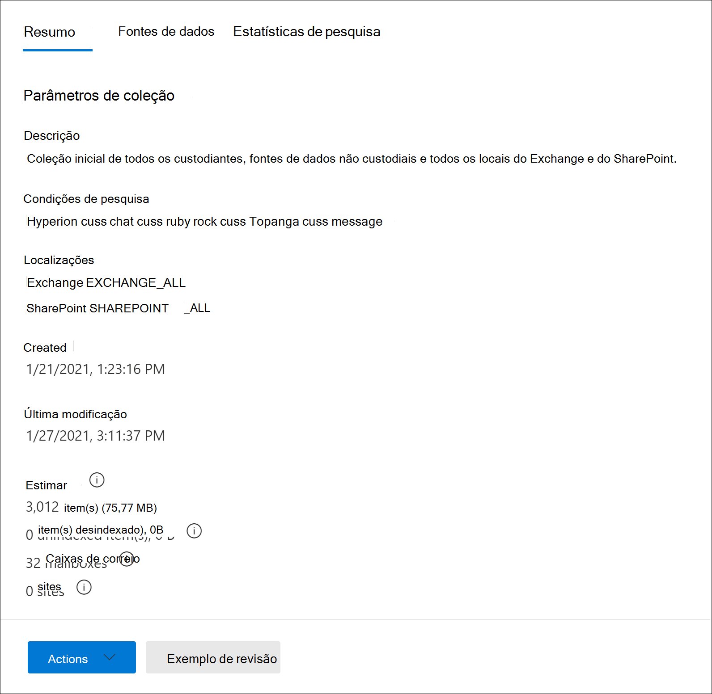
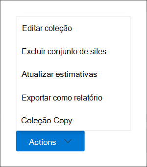

# Criar uma coleção de rascunhos em Advanced eDiscovery

Depois de identificar os custodiantes e quaisquer fontes de dados não custodiantes para o caso, você estará pronto para identificar e localizar um conjunto de documentos relevantes. Você faz isso usando a ferramenta Coleções para pesquisar fontes de dados para conteúdo relevante. Você faz isso criando uma coleção que pesquisa fontes de dados especificadas para conteúdo que corresponde aos seus critérios de pesquisa. Você tem *a* opção de criar um conjunto de rascunhos , que é uma estimativa dos itens encontrados ou você pode criar uma coleção que adiciona automaticamente os itens a um conjunto de revisão. Ao criar um conjunto de rascunhos, você pode ver informações sobre os resultados estimados que corresponderam à consulta de pesquisa, como o número total e o tamanho dos itens encontrados, as diferentes fontes de dados onde foram encontrados e estatísticas sobre a consulta de pesquisa. Você também pode visualizar um exemplo de itens que foram retornados pela coleção. Usando essas estatísticas, você pode alterar a consulta de pesquisa e reprisar a coleção de rascunhos para restringir seus resultados. Depois de satisfeito com os resultados da coleção, você pode comprometer a coleção em um conjunto de revisão. Quando você confirma um conjunto de rascunhos, os itens retornados pela coleção são adicionados a um conjunto de revisão para revisão, análise e exportação.

## Antes de criar uma coleção de rascunhos

- Adicione os custodiantes e fontes de dados não custodiais ao caso antes de criar uma coleção de rascunho. Isso é necessário para que você possa selecionar as fontes de dados ao criar uma coleção de rascunho. Para saber mais, confira:

  - [Adicionar custodiantes a uma ocorrência](add-custodians-to-case.md)

  - [Adicionar fontes de dados não custodial a uma ocorrência](non-custodial-data-sources.md)

- Você pode pesquisar fontes de dados adicionais (aquelas que não foram adicionadas ao caso como locais de custodia ou não-custodiante) em um conjunto de rascunhos para conteúdo que pode ser relevante para o caso. Essas fontes de dados podem incluir caixas de correio, SharePoint sites e Teams. Se essa situação for aplicável ao seu caso, compile uma lista dessas fontes de dados para que você possa adicioná-las à coleção.

## Criar uma coleção de rascunho

1. No centro Microsoft 365 de conformidade, abra o Advanced eDiscovery e selecione **a guia** Coleções.

2. Na página **Coleções,** selecione **Nova coleção**  >  **Standard collection**.

3. Digite um nome (obrigatório) e uma descrição (opcional) para a coleção. Depois que a coleção for criada, você não poderá alterar o nome, mas poderá modificar a descrição.

4. Na página **Fontes de dados custodiais,** faça uma das seguintes coisas para identificar as fontes de dados de custodia para coletar conteúdo de:

   - Clique **em Selecionar custodiantes** para pesquisar custodiantes específicos que foram adicionados ao caso. Se você usar essa opção, uma lista dos custodiantes de caso será exibida. Selecione um ou mais custodiantes. Depois de selecionar e adicionar os custodiantes, você também pode selecionar as fontes de dados específicas para pesquisar por cada custodiante. Essas fontes de dados exibidas foram especificadas quando o custodiante foi adicionado ao caso.

   - Clique na **opção Selecionar todos** para pesquisar todos os custodiantes que foram adicionados à ocorrência. Quando você seleciona essa opção, todas as fontes de dados de todos os custodiantes são pesquisadas.

5. Na página **Fontes de** dados não custodiais, faça uma das seguintes coisas para identificar as fontes de dados não custodiadas para coletar conteúdo de:

   - Clique **em Selecionar fontes de dados** não custodiais para selecionar fontes de dados não custodiais específicas que foram adicionadas ao caso. Se você usar essa opção, será exibida uma lista de fontes de dados. Selecione uma ou mais dessas fontes de dados.

   - Clique na **opção Selecionar todos** para selecionar todas as fontes de dados não custodiais que foram adicionadas à ocorrência.

6. Na página **Fontes de dados adicionais,** você pode selecionar outras caixas de correio e sites para pesquisar como parte da coleção. Esses tipos de fontes de dados não foram adicionados como locais de dados custodiados ou não custodiais no caso. Você também tem duas opções ao pesquisar fontes de dados adicionais:

   - Para pesquisar todos os locais de conteúdo para um serviço específico (caixas de correio Exchange, sites SharePoint  e OneDrive, ou Exchange pastas públicas), clique na alternância Selecionar tudo correspondente na coluna **Status.** Essa opção pesquisará todos os locais de conteúdo no serviço selecionado.

   - Para pesquisar o local de conteúdo  específico de um serviço, clique no botão Selecionar todos os alternâncias correspondentes na coluna **Status** e clique em **Usuários,** grupos ou equipes (para caixas de correio do Exchange) ou Escolha **sites** para (sites SharePoint e OneDrive) para pesquisar locais de conteúdo específicos.

7. Na página **Condições,** você pode criar a consulta de pesquisa usada para coletar itens das fontes de dados identificadas nas páginas anteriores do assistente. Você pode pesquisar palavras-chave, property:value pairs ou usar uma lista de palavras-chave. Você também pode adicionar várias condições de pesquisa para restringir o escopo da coleção. Para obter mais informações, consulte [Build search queries for collections](building-search-queries.md).

8. Na página **Salvar como rascunho ou adicionar ao conjunto de** revisão, selecione Salvar coleção como **rascunho**.

   > [!NOTE]
   > A outra opção nesta página permite coletar itens e adicioná-los diretamente a um conjunto de revisão. Em vez de criar um conjunto de rascunhos para o qual você pode revisar estatísticas e visualizar um exemplo dos resultados da coleção, essa opção ignora esse processo e adiciona automaticamente a coleção a um conjunto de revisão. Se você selecionar a segunda opção para adicionar a coleção a um conjunto de revisão, terá configurações adicionais para configurar, como coletar threads de conversa de chat inteiros no Microsoft Teams e Yammer e coletar anexos de nuvem (também chamados de *anexos* modernos ). Para obter mais informações sobre essas configurações, consulte [Commit a draft collection to a review set](commit-draft-collection.md).

9. Na página **Revisar sua coleção,** você pode revisar e atualizar as configurações de coleção configuradas nas páginas anteriores.

   - **Guia** Resumo: revise e modifique o nome e a descrição da coleção, os critérios de pesquisa da coleção, locais de dados adicionais e o tipo de coleção.

   - **Guia Fontes:** Revise e modifique as fontes de dados custodiais e não custodiais para a coleção.

10. Clique **em Enviar** para criar o conjunto de rascunhos. Uma página é exibida confirmando que a coleção foi criada.

## O que acontece depois que você cria um conjunto de rascunhos

Depois de criar um conjunto de rascunhos, ele é listado na página **Coleções** no caso e o status mostra que ele está em andamento. Um trabalho chamado **Preparando visualização de pesquisa e estimativas** também é criado e exibido na página **Trabalhos** no caso.

Durante o processo de coleta de rascunho, Advanced eDiscovery executa uma estimativa de pesquisa usando os critérios de pesquisa e as fontes de dados especificadas na coleção. Advanced eDiscovery também prepara uma amostragem de itens que você pode visualizar. Quando a coleção é concluída, as seguintes colunas e valores correspondentes na página **Coleção** são atualizados:

- **Status**: indica o status e o tipo de coleção. Um valor estimado **indica** que uma coleção de rascunho está concluída. Esse mesmo valor também indica que a coleção é uma coleção de rascunho e que ela não foi adicionada a um conjunto de revisão. Um valor de **Committed** na coluna **Status** indica que a coleção foi adicionada a um conjunto de revisão.

- **Status da** estimativa : indica o status dos resultados estimados da pesquisa e se as estimativas e estatísticas de pesquisa estão prontas ou não para revisão. Um valor de **Successful** indica que os resultados do conjunto de rascunhos estão prontos para revisão. Depois de enviar pela primeira vez uma coleção de rascunhos, um valor **de Em andamento** é exibido para indicar que a coleção ainda está em execução

- **Status de visualização**: indica o status dos itens de exemplo que você pode visualizar. Um valor de **Successful** indica que os itens estão prontos para visualização. Depois de enviar pela primeira vez uma coleção de rascunhos, um valor **em** andamento é exibido para indicar que a coleção ainda está em execução.

## Próximas etapas após a conclusão de um conjunto de rascunhos

Depois que a coleção de rascunho for concluída com êxito, você poderá executar várias tarefas. Para executar a maioria dessas  tarefas, basta acessar a guia Coleções e clicar no nome da coleção de rascunho para exibir a página de sobrevoo.

Aqui está uma lista de coisas que você pode fazer na página de sobrevoo da coleção:

- Selecione a **guia Resumo** para exibir informações de resumo sobre a coleção e os resultados de pesquisa estimados retornados pela coleção. Isso inclui o número total de itens e o tamanho dos resultados estimados da pesquisa, o número de caixas de correio e sites que continham os resultados da pesquisa e as condições de pesquisa (se usadas) usadas para escopo da coleção.

- Selecione a **guia Fontes de** dados para exibir uma lista de custodiantes e fontes de dados não custodiais) que foram pesquisadas na coleção. Quaisquer locais de conteúdo adicionais que foram pesquisados estão listados em **Locais** na **guia Resumo.**

- Selecione a **guia Estatísticas de Pesquisa** para exibir estatísticas sobre a coleção. Isso inclui o número total e o tamanho dos itens encontrados em cada serviço (por exemplo, caixas de correio Exchange ou sites SharePoint) e um relatório de condição que exibe estatísticas sobre o número de itens retornados por diferentes componentes da consulta de pesquisa usada pela coleção. Para obter mais informações, consulte [Estatísticas e relatórios de coleção.](collection-statistics-reports.md)

- Clique **em Revisar exemplo** (localizado na parte inferior da página de sobrevoo) para visualizar um exemplo dos itens retornados pela coleção.

- Commit the draft collection to a review set (by clicking **Actions**  >  **Edit collection**). Isso significa que você reprise a coleção (usando as configurações atuais) e adicione os itens retornados pela coleção a um conjunto de revisão. Como explicado anteriormente, você também pode configurar configurações adicionais (como threading de conversa e anexos baseados em nuvem) ao adicionar a coleção a um conjunto de revisão. Para obter mais informações e instruções passo a passo, consulte [Commit a draft collection to a review set](commit-draft-collection.md).

## Gerenciar uma coleção de rascunhos

Você pode usar as opções no menu **Ações** na página de sobrevoo de um conjunto de rascunhos para executar várias tarefas de gerenciamento.

Aqui estão as descrições das opções de gerenciamento.

- **Coleção Edit**: Alterar as configurações do conjunto de rascunhos. Depois de fazer alterações, você pode reprisar a coleção e atualizar as estimativas e estatísticas de pesquisa. Como explicado anteriormente, você usa essa opção para comprometer um conjunto de rascunhos em um conjunto de revisão.  

- **Excluir coleção**: Excluir uma coleção de rascunho. Observe que depois que um conjunto de rascunhos é comprometido com um conjunto de revisão, ele não pode ser excluído.

- **Estimativas de atualização**: Reprise a consulta (em relação às fontes de dados) especificada na coleção de rascunho para atualizar as estimativas e estatísticas de pesquisa.

- **Exportar como relatório**: exporta informações sobre o conjunto de rascunhos para um arquivo CSV que você pode baixar no computador local. O relatório de exportação contém as seguintes informações:

  - A identidade de cada local de conteúdo que contém itens que corresponderem à consulta de pesquisa no conjunto de rascunhos. Esses locais geralmente são caixas de correio ou sites.
  
  - O número total de itens em cada local de conteúdo.
  
  - O tamanho total (em bytes) dos itens em cada local de conteúdo.

  - O serviço (como Exchange ou SharePoint) no qual o local do conteúdo está localizado.

- **Coleção Copy**: Crie um novo conjunto de rascunho copiando as configurações de uma coleção existente. Você precisa usar um nome diferente para a nova coleção. Você também tem a opção de modificar as configurações antes de enviar a nova coleção. Depois de enviar, a consulta de pesquisa é executado e novas estimativas e estatísticas são geradas. É uma boa maneira de criar rapidamente um conjunto de rascunhos adicionais e modificar as configurações selecionadas conforme necessário enquanto ainda preserva as informações na coleção original. Isso também permite comparar facilmente os resultados de duas coleções semelhantes.

> [!NOTE]
> Depois que um conjunto de rascunhos for comprometido com um conjunto de revisão, você só poderá copiar a coleção e exportar um relatório.
