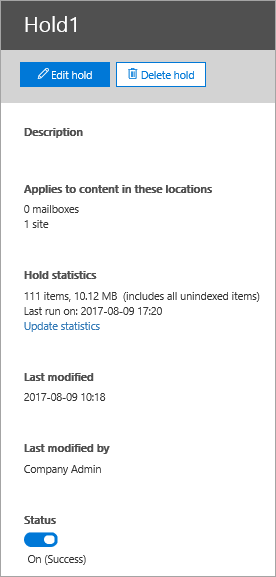
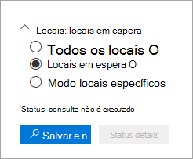

# <a name="create-an-ediscovery-hold"></a>Criar uma retenção de Descoberta Eletrônica

Você pode usar um caso core de Descoberta eDiscovery para criar ressarces para preservar conteúdo que pode ser relevante para o caso. Você pode colocar uma responsabilidade nas caixas de correio do Exchange e contas do OneDrive for Business das pessoas que você está investigando no caso. Você também pode colocar em espera as caixas de correio e os sites associados ao Microsoft Teams, grupos do Office 365 e grupos do Yammer. Quando você coloca locais de conteúdo em espera, o conteúdo é preservado até que você remova a remoção do local do conteúdo ou até que você exclua a remoção.

Depois de criar uma ressarção de Descoberta E, pode levar até 24 horas para que a espera entre em vigor. 

Quando você cria uma espera, você tem as seguintes opções para escopo do conteúdo que é preservado nos locais de conteúdo especificados:
  
- Você cria uma espera infinita onde todo o conteúdo nos locais especificados é colocado em espera. Como alternativa, você pode criar uma isenção baseada em consulta, em que apenas o conteúdo nos locais especificados que corresponde a uma consulta de pesquisa é colocado em espera.

- Você pode especificar um intervalo de datas para preservar apenas o conteúdo que foi enviado, recebido ou criado dentro desse intervalo de datas. Como alternativa, você pode manter todo o conteúdo em locais especificados, independentemente de quando ele foi enviado, recebido ou criado.
  
## <a name="how-to-create-an-ediscovery-hold"></a>Como criar uma ressarção de Descoberta

Para criar uma ressarcição de Descoberta De eDiscovery associada a um caso core de Descoberta eDiscovery:
  
1. Acesse e entre usando as credenciais da conta de usuário que foram atribuídas às permissões [https://compliance.microsoft.com](https://compliance.microsoft.com) de Descoberta eDiscoveria apropriadas.

2. No painel de navegação esquerdo do centro de conformidade do Microsoft 365, clique em **Mostrar** tudo e clique em **Descoberta > Core**.

3. Na página **Descoberta Principal da Descoberta** e, em seguida, selecione o caso em que você deseja criar a responsabilidade e clique em Abrir **caso**.

4. Na **home** page do caso, clique na guia **Retém.**
  
5. Na página **Retém,** clique em **Criar**.

6. Na página **Nomear seu assistente** de espera, dê um nome à espera e adicione uma descrição opcional e clique em **Próximo**. O nome da retenção deve ser exclusivo na sua organização.

7. Na página **Locais de** conteúdo, escolha os locais de conteúdo que você deseja colocar em espera. Você pode colocar caixas de correio, sites e pastas públicas em espera.

    
  
   1. **Locais de** caixa de correio - Clique em **Escolher usuários, grupos** ou equipes e clique em Escolher **usuários,** grupos ou equipes novamente para especificar as caixas de correio que devem ser colocadas em espera. Use a caixa de pesquisa para encontrar caixas de correio de usuário e grupos de distribuição (para colocar uma responsabilidade nas caixas de correio dos membros do grupo) para colocar em espera. Você também pode colocar uma responsabilidade na caixa de correio associada para uma Equipe da Microsoft, Grupo do Office 365 ou Grupo do Yammer. Selecione a caixa de seleção usuário, grupo, equipe, clique em **Escolher** e clique em **Feito**.

   1. **Locais do site** - Clique **em Escolher sites** e clique em Escolher **sites** novamente para especificar contas do SharePoint e do OneDrive para colocar em espera. Digite a URL de cada site que você deseja colocar em retenção. Você também pode adicionar a URL do site do SharePoint para uma Equipe da Microsoft, Grupo do Office 365 ou um Grupo do Yammer. Clique **em Escolher** e clique em **Feito**.
  
   1. **Pastas públicas do Exchange.** Mover o controle de alternância Alternar para a posição Todos para colocar todas as  pastas públicas em sua organização do Exchange Online em espera.  Não é possível escolher pastas públicas específicas para colocar em espera. Deixe a opção de alternância definida como **Nenhuma** se você não quiser colocar uma espera em pastas públicas.

   > [!NOTE]
   > Você deve adicionar pelo menos um local de conteúdo à espera. Caso contrário, as estáticas de ressução de Descoberta e Mostrarão que nenhum item está em espera.

8. Quando terminar de adicionar locais de conteúdo à espera, clique em **Próximo**.

9. Para criar uma espera baseada em consulta com condições, conclua o seguinte. Caso contrário, para preservar todo o conteúdo nos locais de conteúdo especificados, clique em **Próximo**.

    
  
    1. Na caixa em **Palavras-chave,** digite uma consulta de pesquisa para que apenas o conteúdo que atenda aos critérios de pesquisa seja preservado. Você pode especificar palavras-chave, propriedades de mensagem de email ou propriedades de documento, como nomes de arquivo. Você também pode usar consultas mais complexas que usam um operador Boolean, como **AND**, **OR** ou **NOT**.

    1. Clique **em Adicionar condições** para adicionar uma ou mais condições para restringir a consulta de pesquisa para a espera. Cada condição adiciona uma cláusula à consulta de pesquisa KQL criada e executado quando você cria a isenção. Por exemplo, você pode especificar um intervalo de datas para que os documentos de email ou site criados dentro do intervalo de datas sejam colocados em espera. Uma condição é conectada logicamente à consulta de  palavra-chave (especificada na caixa Palavras-chave) pelo **operador AND.** Isso significa que os itens devem atender à consulta de palavra-chave e à condição a ser preservada.

    Para obter mais informações sobre como criar uma consulta de pesquisa e usar condições, consulte [Keyword queries and search conditions for Content Search](keyword-queries-and-search-conditions.md).

10. Depois de configurar uma espera baseada em consulta, clique em **Próximo**.

11. Revise suas configurações (e edite-as se necessário) e clique **em Criar essa espera**.

## <a name="query-based-holds-placed-on-site-documents"></a>Retém baseadas em consultas colocadas em documentos de site

Lembre-se das seguintes coisas ao colocar uma espera de Descoberta eDiscovery baseada em consulta em documentos localizados em sites do SharePoint:

- Uma responsabilidade baseada em consulta preserva inicialmente todos os documentos em um site por um curto período de tempo após a exclusão. Isso significa que, quando um documento for excluído, ele será movido para a biblioteca de Reter Preservação, mesmo que ele não corresponder aos critérios de espera baseada em consulta. No entanto, documentos excluídos que não corresponderem a uma espera baseada em consulta serão removidos por um trabalho de timer que processa a biblioteca de Preservação de Espera. O trabalho de timer é executado periodicamente e compara todos os documentos na biblioteca de Retenção de Preservação com seus retenções de Descoberta eDiscovery baseada em consulta (e outros tipos de retenção e políticas de retenção). O trabalho de timer exclui os documentos que não corresponderem a uma ressarção baseada em consulta e preserva os documentos que fazem.

- As respeções baseadas em consultas não devem ser usadas para executar a preservação direcionada, como a preservação de documentos em uma pasta ou site específico ou usando outros critérios de espera baseados em local. Fazer isso pode ter resultados não intencionados. Recomendamos usar critérios de espera não baseados em local, como palavras-chave, intervalos de datas ou outras propriedades de documento para preservar documentos do site.

## <a name="ediscovery-hold-statistics"></a>Estatísticas de espera de Descobertas EDiscovery

Depois de criar uma bloqueio de Descoberta eDiscovery, as informações sobre a nova ressalto serão exibidas na página de sobrevoo para a espera selecionada. Essas informações incluem o número de caixas de correio e sites em espera e estatísticas sobre o conteúdo colocado em espera, como o número total e o tamanho dos itens colocados em espera e a última vez que as estatísticas de espera foram calculadas. Essas estatísticas de espera ajudam a identificar a quantidade de conteúdo relacionado ao caso que está sendo preservado.
  

  
Lembre-se das seguintes coisas sobre estatísticas de espera de Descobertas EDiscovery:
  
- O número total de itens em espera indica o número de itens de todas as fontes de conteúdo colocadas em espera. Se você tiver criado uma ressarção baseada em consulta, essa estatística indicará o número de itens que corresponderão à consulta.

- O número de itens em espera também inclui itens não índicedos encontrados nos locais de conteúdo. Se você criar uma espera baseada em consulta, todos os itens não índicedos nos locais de conteúdo serão colocados em espera. Isso inclui itens nãoindexados que não corresponderem aos critérios de pesquisa de uma espera baseada em consulta e itens não índicedos que podem ficar fora de uma condição de intervalo de datas. Isso é diferente do que acontece quando você executar uma pesquisa, na qual itens não indexados que não corresponderem à consulta de pesquisa ou são excluídos por uma condição de intervalo de datas não estão incluídos nos resultados da pesquisa. Para obter mais informações sobre itens não indexados, consulte [Itens parcialmente indexados.](partially-indexed-items-in-content-search.md)

- Você pode obter as estatísticas de  espera mais recentes clicando em Atualizar estatísticas para reprisar uma estimativa de pesquisa que calcula o número atual de itens em espera.

- É normal que o número de itens em espera aumente com o tempo, pois os usuários cuja caixa de correio ou site está em espera geralmente estão enviando ou recebendo novas mensagens de email e criando novos documentos no SharePoint e no OneDrive.

- Se uma caixa de correio do Exchange, site do SharePoint ou conta do OneDrive for movida para uma região diferente em um ambiente multi-geo, as estatísticas desse site não serão incluídas nas estatísticas de espera. Mas o conteúdo nesses locais ainda será preservado. Além disso, se uma caixa de correio ou site for movido para uma região diferente, o endereço SMTP ou URL exibido na espera não será atualizado automaticamente. Você terá que editar a espera e atualizar a URL ou o endereço SMTP para que os locais de conteúdo sejam novamente incluídos nas estatísticas de espera

## <a name="search-locations-on-ediscovery-hold"></a>Locais de pesquisa em espera de Descoberta e Descoberta

Quando você [procura](search-for-content-in-core-ediscovery.md) conteúdo em um caso de Descoberta Básica, pode configurar rapidamente a pesquisa para apenas pesquisar os locais de conteúdo que foram colocados em uma responsabilidade associada ao caso.



Selecione a **opção Locais em espera** para pesquisar todos os locais de conteúdo que foram colocados em espera. Se o caso contiver vários ressarces de Descoberta e, os locais de conteúdo de todos os ressarces serão pesquisados quando você selecionar essa opção. Além disso, se um local de conteúdo foi colocado em uma espera baseada em consulta, somente os itens que corresponderem à consulta de espera serão pesquisados quando você executar a pesquisa. Em outras palavras, somente o conteúdo que corresponde aos critérios de espera e aos critérios de pesquisa é retornado com os resultados da pesquisa. Por exemplo, se um usuário foi colocado em uma responsabilidade de caso baseada em consulta que preserva itens que foram enviados ou criados antes de uma data específica, somente esses itens serão pesquisados. Isso é feito conectando a consulta de espera de caso e a consulta de pesquisa por um **operador AND.**

Aqui estão algumas outras coisas a ter em mente ao pesquisar locais em espera de Descoberta e:

- Se um local de conteúdo faz parte de várias resções no mesmo caso, as consultas de espera são combinadas por operadores **OR** quando você pesquisa esse local de conteúdo usando a opção de conteúdo de todas as ocorrências. Da mesma forma, se um local de conteúdo faz parte de duas resções diferentes, em que uma é baseada em consulta e a outra é uma isenção infinita (onde todo o conteúdo é colocado em espera), todo o conteúdo é pesquisa por causa da ressarção infinita.

- Se uma pesquisa estiver configurada para locais de pesquisa em espera e, em seguida, você alterar uma remoção de Descoberta Eletrônica no caso (adicionando ou removendo um local ou alterando uma consulta de espera), a configuração de pesquisa será atualizada com essas alterações. No entanto, você precisa reprisar a pesquisa após a alteração da espera para atualizar os resultados da pesquisa.

- Se vários ressarcedores de Descoberta E são colocados em um único local em um caso de Descoberta e você seleciona para pesquisar locais em espera, o número máximo de palavras-chave para essa consulta de pesquisa é 500. Isso porque a pesquisa combina todas as resções baseadas em consulta usando o **operador OR.** Se houver mais de 500 palavras-chave nas consultas de espera combinadas e na consulta de pesquisa, todo o conteúdo da caixa de correio será pesquisado, e não apenas o conteúdo que corresponde à ocorrência baseada em consulta será ressarte.

- Se uma espera de Descoberta De eDiscovery tiver um status de Ligar **,** você ainda poderá pesquisar os locais em espera enquanto a espera estiver sendo 100% 100%.

## <a name="preserve-content-in-microsoft-teams"></a>Preservar conteúdo no Microsoft Teams

As conversas que fazem parte de um canal do Microsoft Teams são armazenadas na caixa de correio associada à Equipe da Microsoft. Da mesma forma, os arquivos que os membros da equipe compartilham em um canal são armazenados no site do SharePoint da equipe. Portanto, você precisa colocar a caixa de correio de equipe e o site do SharePoint em espera de Descoberta Eletrônico para preservar conversas e arquivos em um canal.

Como alternativa, as conversas que fazem parte da lista chat no Teams (chamadas *de chats 1:1* ou chats de grupo *1:N*) são armazenadas nas caixas de correio dos usuários que participam do chat. E os arquivos que os usuários compartilham em conversas de chat são armazenados na conta do OneDrive do usuário que compartilha o arquivo. Portanto, você precisa adicionar as caixas de correio de usuário individuais e contas do OneDrive a uma responsabilidade de Descoberta Eletrônico para preservar conversas e arquivos na lista de chat. É uma boa ideia colocar em espera as caixas de correio de membros de uma Equipe da Microsoft, além de colocar a caixa de correio e o site de equipe em espera.

> [!IMPORTANT]
> Em uma organização baseada em nuvem, os usuários que participam de conversas que fazem parte da lista de chat no Teams devem ter uma caixa de correio do Exchange Online para manter conversas de chat quando a caixa de correio é colocada em uma retenção de Descoberta Eletrônico. Isso porque as conversas que fazem parte da lista de chat são armazenadas nas caixas de correio baseadas em nuvem dos participantes do chat. Se um participante de chat não tiver uma caixa de correio do Exchange Online, você não poderá preservar essas conversas de chat. Por exemplo, em uma implantação híbrida do Exchange, os usuários com uma caixa de correio local podem participar de conversas que fazem parte da lista de chat no Teams. Mas, nesse caso, o conteúdo dessa conversa não pode ser preservado porque esses usuários não têm caixas de correio baseadas em nuvem que podem ser colocadas em espera.

Para obter mais informações sobre como preservar o conteúdo do Teams, consulte Colocar um usuário ou equipe do [Microsoft Teams em espera legal](/MicrosoftTeams/legal-hold).

### <a name="preserve-card-content"></a>Preservar o conteúdo do cartão

Da mesma forma, o conteúdo de cartão gerado por aplicativos em canais do Teams, chats 1:1 e chats de grupo 1:N é armazenado em caixas de correio e é preservado quando uma caixa de correio é colocada em uma espera de Descoberta Eletrônico. Um *cartão* é um contêiner de interface de usuário para pequenos pedaços de conteúdo. Os cartões podem ter várias propriedades e anexos e podem incluir botões que disparam ações de cartão. Para obter mais informações, consulte [Cartões](/microsoftteams/platform/task-modules-and-cards/what-are-cards). Como outros conteúdos de equipes, onde o conteúdo do cartão é armazenado é baseado em onde o cartão foi usado. O conteúdo dos cartões usados em um canal Teams é armazenado na caixa de correio do grupo Teams. O conteúdo do cartão para bate-papos individuais e 1xN é armazenado nas caixas de correio dos participantes do bate-papo.

### <a name="preserve-meeting-and-call-information"></a>Preservar informações de reunião e chamada

As informações de resumo para reuniões e chamadas em um canal do Teams também são armazenadas nas caixas de correio dos usuários que discam para a reunião ou chamada. Esse conteúdo também é preservado quando uma isenção de Descoberta Eletrônico é colocada em caixas de correio de usuário.

### <a name="preserve-content-in-private-channels"></a>Preservar conteúdo em canais privados

A partir de fevereiro de 2020, também a iniciamos a capacidade de preservar o conteúdo em canais privados. Como os chats de canal privado são armazenados nas caixas de correio dos participantes do chat, colocar uma caixa de correio de usuário em espera de Descoberta Eletrônico preservará chats de canal privado. Além disso, se uma caixa de correio de usuário foi colocada em uma suspensão de Descoberta Automática antes de fevereiro de 2020, a suspensão agora se aplicará automaticamente às mensagens de canal privado armazenadas nessa caixa de correio. A preservação de arquivos compartilhados em canais privados também é suportada.

### <a name="preserve-wiki-content"></a>Preservar conteúdo wiki

Cada equipe ou canal de equipe também contém um Wiki para anotações e colaboração. O conteúdo Wiki é salvo automaticamente em um arquivo com um formato .mht. Esse arquivo é armazenado na biblioteca de documentos de Dados do Wiki do Teams no site do SharePoint da equipe. Você pode preservar o conteúdo wiki adicionando o site do SharePoint da equipe a uma redução de Descoberta EDiscovery.

> [!NOTE]
> A capacidade de preservar conteúdo wiki para um canal de equipe ou equipe (quando você coloca o site do SharePoint da equipe em espera) foi lançada em 22 de junho de 2017. Se um site de equipe estiver em espera, o conteúdo wiki será mantido a partir dessa data. No entanto, se um site de equipe estiver em espera e o conteúdo wiki tiver sido excluído antes de 22 de junho de 2017, o conteúdo wiki não foi preservado.

### <a name="office-365-groups"></a>Grupos do Office 365

O Teams é criado em Grupos do Office 365. Portanto, colocar grupos do Office 365 em espera de Descoberta eDiscovery é semelhante colocando o conteúdo do Teams em espera.

Lembre-se das seguintes coisas ao colocar os Grupos do Teams e do Office 365 em uma espera de Descoberta EDiscovery:

- Como explicado anteriormente, para colocar o conteúdo localizado no Teams e nos Grupos do Office 365 em espera, você precisa especificar a caixa de correio e o site do SharePoint associados a um grupo ou equipe.

- Execute o cmdlet **Get-UnifiedGroup** no [PowerShell](/powershell/exchange/connect-to-exchange-online-powershell) do Exchange Online para exibir propriedades do Teams e grupos do Office 365. Essa é uma boa maneira de obter a URL do site associado a uma equipe ou grupo do Office 365. Por exemplo, o comando abaixo exibe as propriedades selecionadas para um grupo do Office365 chamado de Equipe de Liderança Sênior:

    ```text
    Get-UnifiedGroup "Senior Leadership Team" | FL DisplayName,Alias,PrimarySmtpAddress,SharePointSiteUrl

    DisplayName            : Senior Leadership Team
    Alias                  : seniorleadershipteam
    PrimarySmtpAddress     : seniorleadershipteam@contoso.onmicrosoft.com
    SharePointSiteUrl      : https://contoso.sharepoint.com/sites/seniorleadershipteam
    ```

    > [!NOTE]
    > Para executar o cmdlet **Get-UnifiedGroup**, é preciso ter atribuído a função de Destinatários Somente Leitura no Exchange Online ou ser membro de um grupo de funções atribuído à função de Destinatários Somente Leitura. 
  
- Quando a caixa de correio de um usuário é pesquisada, qualquer Equipe ou Grupo do Office 365 do que o usuário é membro não será pesquisado. Da mesma forma, quando você coloca uma Equipe ou Grupo do Office 365 em espera de Descoberta eDiscovery, somente a caixa de correio de grupo e o site do grupo são colocados em espera. As caixas de correio e os sites do OneDrive for Business dos membros do grupo não são colocados em espera, a menos que você as adicione explicitamente à responsabilidade de Descoberta Eletrônico. Portanto, se você tiver que colocar uma Equipe ou Grupo do Office 365 em espera por um motivo legal, considere adicionar as caixas de correio e contas do OneDrive de membros da equipe ou grupo na mesma espera.

- Para obter uma lista dos membros de uma equipe ou grupo do Office 365, você pode exibir as propriedades na página **Grupos** no Centro de administração do Microsoft 365. Como alternativa, execute o comando a seguir no PowerShell do Exchange Online:

    ```powershell
    Get-UnifiedGroupLinks <group or team name> -LinkType Members | FL DisplayName,PrimarySmtpAddress
    ```

    > [!NOTE]
    > Para executar o cmdlet **Get-UnifiedGroupLinks**, é preciso ter atribuído a função de Destinatários Somente Leitura no Exchange Online ou ser um membro de um grupo de funções atribuído à função Destinatários Somente Leitura.

## <a name="preserve-content-in-onedrive-accounts"></a>Preservar conteúdo em contas do OneDrive

Para coletar uma lista das URLs para os sites do OneDrive for Business em sua organização para que você possa adicioná-las a uma responsabilidade ou pesquisa associada a um caso de Descoberta eDiscovery, consulte Create a list of all [OneDrive locations in](/onedrive/list-onedrive-urls)your organization . O script neste artigo cria um arquivo de texto que contém uma lista de todos os sites do OneDrive em sua organização. Para executar esse script, é necessário instalar e usar o Shell de Gerenciamento Online do SharePoint. Não se esqueça de acrescentar a URL do domínio MySite da organização para cada site do OneDrive que você deseja pesquisar. Este é o domínio que contém todos os seus OneDrive; por exemplo, `https://contoso-my.sharepoint.com`. Veja um exemplo de URL para o site do OneDrive de um usuário: `https://contoso-my.sharepoint.com/personal/sarad_contoso_onmicrosoft.com`.

> [!IMPORTANT]
> A URL da conta do OneDrive de um usuário inclui o nome principal do usuário (UPN) (por exemplo, `https://alpinehouse-my.sharepoint.com/personal/sarad_alpinehouse_onmicrosoft_com` ). No caso raro de a UPN de uma pessoa ser alterada, a URL do OneDrive também será alterada para incorporar o novo UPN. Se a conta do OneDrive de um usuário faz parte de uma remoção de Descoberta Automática, antigo e seu UPN é alterado, você precisa atualizar a responsabilidade e você terá que atualizar a responsabilidade e adicionar a nova URL do OneDrive do usuário e remover a antiga. Para saber mais, confira [Como as alterações de UPN afetam a URL do OneDrive](/onedrive/upn-changes).

## <a name="removing-content-locations-from-an-ediscovery-hold"></a>Removendo locais de conteúdo de uma remoção de descoberta de ediscovery

Depois que uma caixa de correio, um site do SharePoint ou uma conta do OneDrive for removida de uma responsabilidade de Descoberta Eletrônico, *será* aplicado um atraso. Isso significa que a remoção real da responsabilidade é adiada por 30 dias para impedir que os dados são excluídos permanentemente (apagados) de um local de conteúdo. Isso oferece aos administradores a oportunidade de pesquisar ou recuperar o conteúdo que será limpo após a remoção de uma remoção de uma descoberta de eDiscovery. Os detalhes de como a espera de atraso funciona para caixas de correio e sites são diferentes.

- **Caixas de correio:** Uma espera de atraso é colocada em uma caixa de correio na próxima vez que o Assistente de Pasta Gerenciada processa a caixa de correio e detecta que uma remoção de uma remoção de descoberta eletrônico. Especificamente, um atraso é aplicado a uma caixa de correio quando o Assistente de Pasta Gerenciada define uma das seguintes propriedades de caixa de correio como **True**:

   - **DelayHoldApplied:** Essa propriedade se aplica ao conteúdo relacionado a email (gerado por pessoas que usam o Outlook e o Outlook na Web) que é armazenado na caixa de correio de um usuário.

   - **DelayReleaseHoldApplied:** Essa propriedade se aplica ao conteúdo baseado em nuvem (gerado por aplicativos que não são do Outlook, como Microsoft Teams, Microsoft Forms e Microsoft Yammer) armazenados na caixa de correio de um usuário. Os dados de nuvem gerados por um aplicativo Microsoft geralmente são armazenados em uma pasta oculta na caixa de correio de um usuário.

   Quando um atraso é colocado na caixa de correio (quando uma das propriedades anteriores é definida como **True**), a caixa de correio ainda é considerada em espera por uma duração de espera ilimitada, como se a caixa de correio estivesse em Contencioso. Após 30 dias, a espera de atraso expira e o Microsoft 365 tentará remover automaticamente a espera de atraso (definindo a propriedade DelayHoldApplied ou DelayReleaseHoldApplied como **False**) para que a suspensão seja removida. Depois que uma dessas propriedades for definida como **False**, os itens correspondentes marcados para remoção serão limpos na próxima vez que a caixa de correio for processada pelo Assistente de Pasta Gerenciada.

   Para saber mais, confira [Gerenciar caixas de correios em retenção por atraso](identify-a-hold-on-an-exchange-online-mailbox.md#managing-mailboxes-on-delay-hold).

- **Sites do SharePoint e do OneDrive:** Qualquer conteúdo do SharePoint ou do OneDrive que está sendo mantido na biblioteca de Reter Preservação não é excluído durante o período de espera de 30 dias depois que um site é removido de uma responsabilidade de Descoberta Virtual. Isso é semelhante ao que acontece quando um site é liberado de uma política de retenção. Além disso, você não pode excluir manualmente esse conteúdo na biblioteca de Preservação de Espera durante o período de espera de 30 dias. 

   Para obter mais informações, [consulte Liberando uma política de retenção](retention.md#releasing-a-policy-for-retention).

Uma espera de atraso também é aplicada a locais de conteúdo em espera quando você fecha um caso de Descoberta Principal de Descoberta e, por isso, as regiões de espera são desligadas quando uma ocorrência é fechada. Para obter mais informações sobre como fechar um caso, consulte [Close, reopen, and delete a Core eDiscovery case](close-reopen-delete-core-ediscovery-cases.md).

## <a name="ediscovery-hold-limits"></a>Limites de espera de Descoberta eDiscovery

A tabela a seguir lista os limites para os casos de Descoberta e de ocorrências.

  | Descrição do limite | Limite |
  |:-----|:-----|
  |Número máximo de casos para uma organização.  <br/> |Sem limite  <br/> |
  |Número máximo de retém descobertas de eDiscovery para uma organização.  <br/> |10.000  <br/> |
  |Número máximo de caixas de correio em uma única parada de Descoberta Eletrônico. Esse limite inclui o total combinado de caixas de correio de usuário e as caixas de correio associadas aos Grupos do Microsoft 365, Microsoft Teams e Grupos do Yammer.  <br/> |1.000  <br/> |
  |Número máximo de sites em uma única parada de Descoberta e. Esse limite inclui o total combinado de sites do OneDrive for Business, sites do SharePoint e os sites associados aos Grupos do Microsoft 365, Microsoft Teams e Grupos do Yammer.  <br/> |100  <br/> |
  |Número máximo de casos exibidos na home page da Descoberta e o número máximo de itens exibidos nas guias Regiões, Pesquisas e Exportação dentro de uma ocorrência. <sup>1</sup> |1.000|
  |||

   > [!NOTE]
   > <sup>1</sup> Para exibir uma lista de mais de 1.000 casos, regiões, pesquisas ou exportações, você pode usar o cmdlet do Office 365 Security & Compliance PowerShell:
   >
   > - [Get-ComplianceCase](/powershell/module/exchange/get-compliancecase)
   > - [Get-CaseHoldPolicy](/powershell/module/exchange/get-caseholdpolicy)
   > - [Get-ComplianceSearch](/powershell/module/exchange/get-compliancesearch)
   > - [Get-ComplianceSearchAction](/powershell/module/exchange/get-compliancesearchaction)
