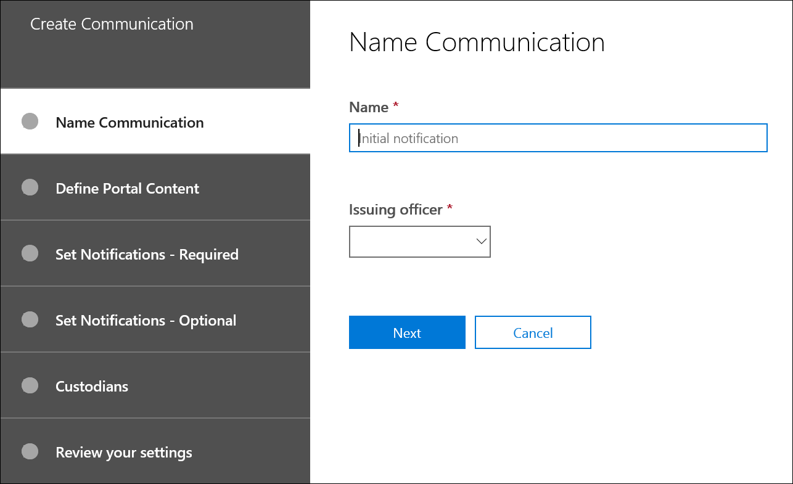

# Criar um aviso de espera legal

Usando Advanced eDiscovery comunicações custodiantes, as organizações podem gerenciar seu fluxo de trabalho ao se comunicar com os custodiantes. Por meio da ferramenta Comunicações, as equipes jurídicas podem enviar, coletar e acompanhar sistematicamente as notificações de espera legal. O processo de criação flexível também permite que as equipes personalizem o fluxo de trabalho de notificação de espera e o conteúdo nos avisos enviados aos custodiantes.

O artigo descreve as etapas no fluxo de trabalho de notificação de espera.

## Etapa 1: Especificar detalhes de comunicação

A primeira etapa é especificar os detalhes apropriados para avisos de responsabilidade legal ou outras comunicações de custodiante.

1. No Centro de Conformidade & segurança, vá para **a > Advanced eDiscovery** de Descoberta > Advanced eDiscovery para exibir a lista de casos em sua organização.

2. Selecione uma ocorrência, clique na guia **Comunicações** e clique em **Nova comunicação**.

3. Na página **Comunicação de** nome, especifique os seguintes detalhes de comunicação (necessários).

    - **Nome**: este é o nome da comunicação.

    - **Oficial de emissão**: a listada exibe uma lista de membros da ocorrência. Para obter mais informações sobre como adicionar novos membros a um caso, consulte [Create an Advanced eDiscovery case](create-and-manage-advanced-ediscoveryv2-case.md#create-a-case). Cada aviso enviado aos custodiantes será enviado em nome do oficial de emissão especificado.

> [!NOTE]
> O responsável pela emissão deve ter uma **caixa** de correio ativa para aparecer no menu suspenso Diretor de emissão

4. Clique em **Próximo**.

## Etapa 2: Definir o conteúdo do portal

Em seguida, você pode criar e adicionar o conteúdo do aviso de espera. Na página **Definir conteúdo do portal** no assistente Criar **comunicação,** especifique o conteúdo do aviso de espera. Esse conteúdo será automaticamente anexado aos avisos de Emissão, Remissão, Lembrete e Escalonamento. Além disso, esse conteúdo aparecerá no Portal de Conformidade do custodiante.

Para criar o conteúdo do portal:

1. Digite (ou recorte e colar de outro documento) seu aviso de espera na caixa de texto para o conteúdo do portal.

2. Insira variáveis de mesclagem em seu aviso para personalizar o aviso e compartilhar o Portal de Conformidade custodiada.

3. Clique em **Próximo**.

  > [!TIP]
  > Para saber mais sobre como personalizar o conteúdo e o formato do conteúdo do portal, consulte [Use the Communications Editor](using-communications-editor.md).

## Etapa 3: Definir as notificações necessárias

Depois de definir o conteúdo do aviso de espera, você pode configurar os fluxos de trabalho ao enviar e gerenciar o processo de notificação. As notificações são mensagens de email enviadas para notificar e acompanhar os custodiantes. Todos os custodiados adicionados à comunicação receberão a mesma notificação.

Para configurar e enviar um aviso de espera, você deve incluir notificações de Emissão, Re-Emissão e Lançamento.

### Notificação de emissão

Depois que a comunicação é criada, a **Notificação** de Emissão é iniciada pelo Diretor de Emissão especificado. A notificação de emissão é a primeira comunicação enviada ao custodiado para informá-los sobre suas obrigações de preservação.

Para criar uma notificação de emissão:

1. No **tile Emissão,** clique em **Editar**.

2. Se necessário, adicione membros de caso adicionais ou funcionários aos **campos Cc** e **Cc.** Para adicionar vários usuários a esses campos, separe endereços de email com dois pontos e vírgulas.

3. **Especifique o Assunto** para o aviso (obrigatório).

4. Especifique o conteúdo ou instruções adicionais que você gostaria de fornecer ao custodiado (necessário). O conteúdo do portal definido na Etapa 2 é adicionado ao final do aviso de emissão.

5. Clique em **Salvar**.

### Re-Issuance notificação

À medida que o caso avança, os custodiantes podem ser necessários para preservar dados adicionais ou menores do que os instruídos anteriormente. Depois de atualizar o conteúdo do portal, a notificação de nova emissão é enviada e alerta os custodiantes sobre quaisquer alterações em suas obrigações de preservação.

Para criar uma notificação de nova emissão:

1. No **azulejo Reissue,** clique em **Editar**.

2. Se necessário, adicione membros de caso adicionais ou funcionários aos **campos Cc** e **Cc.** Para adicionar vários usuários a esses campos, separe endereços de email com dois pontos e vírgulas.

3. **Especifique o Assunto** para o aviso (obrigatório).

4. Especifique o conteúdo ou instruções adicionais que você gostaria de fornecer ao custodiado (necessário). O conteúdo do portal definido na Etapa 2 é adicionado ao final do aviso de reemissão.

5. Clique em **Salvar**.

> [!NOTE]
> Se o conteúdo do portal for modificado (na página Definir Conteúdo do **Portal** no assistente de comunicação Editar), a notificação de nova emissão será enviada automaticamente a todos os custodiantes atribuídos ao aviso.  Depois que a notificação for enviada, os custodiantes serão solicitados a confirmar sua notificação de responsabilidade. Se você tiver definido algum lembrete ou fluxos de trabalho de escalonamento, eles também serão rea start. Para obter mais informações sobre quais outros eventos de gerenciamento de casos disparam comunicações, consulte [Eventos que disparam notificações](#events-that-trigger-notifications).

### Notificação de versão

Depois que um assunto for resolvido ou se um custodiante não estiver mais sujeito a preservar o conteúdo, você poderá liberar o custodiante de uma ocorrência. Se o custodiante tiver sido previamente emitido um aviso de responsabilidade, a notificação de versão poderá ser usada para alertar os custodiantes de que eles foram liberados de suas obrigações.

Para criar uma notificação de versão:

1. No **azulejo Liberar,** clique em **Editar**.

2. Se necessário, adicione membros de caso adicionais ou funcionários aos **campos Cc** e **Cc.** Para adicionar vários usuários a esses campos, separe endereços de email com dois pontos e vírgulas.

3. **Especifique o Assunto** para o aviso (obrigatório).

4. Especifique o conteúdo ou instruções adicionais que você gostaria de fornecer ao custodiado (necessário).

5. Clique **em Salvar** e vá para a próxima etapa.

## (Opcional) Etapa 4: Definir as notificações opcionais

Opcionalmente, você pode simplificar o fluxo de trabalho para acompanhar os custodiados não responsivos criando e agendando notificações automatizadas de lembrete e escalonamento.

### Reminders

Depois de enviar uma notificação de espera, você pode acompanhar os custodiados não responsivos definindo um fluxo de trabalho de lembrete.

Para agendar lembretes:

1. No **azulejo Lembrete,** clique em **Editar**.

2. Habilita **o fluxo** de trabalho lembrete ativando a alternância **Status** (obrigatório).

3. **Especifique o intervalo de Lembrete (em dias)** (obrigatório). Esse é o número de dias para aguardar antes de enviar as primeiras notificações de lembrete e acompanhamento. Por exemplo, se você definir o intervalo de lembrete como sete dias, o primeiro lembrete será enviado sete dias após a notificação de espera ter sido inicialmente emitida. Todos os lembretes subsequentes também seriam enviados a cada sete dias.

4. **Especifique o Número de lembretes** (obrigatório). Este campo especifica quantos lembretes enviar para custodiantes não responsivos. Por exemplo, se você definir o número de lembretes como 3, um custodiante receberá no máximo três lembretes. Depois que um custodiante confirmar a notificação de espera, os lembretes não serão mais enviados para esse usuário.

5. **Especifique o Assunto** para o aviso (obrigatório).

6. Especifique o conteúdo ou instruções adicionais que você gostaria de fornecer ao custodiado (necessário). O conteúdo do portal definido na Etapa 2 é adicionado ao final do aviso de lembrete.

7. Clique **em Salvar** e vá para a próxima etapa.

### Escalações

Em algumas situações, você pode precisar de maneiras adicionais de acompanhar os custodiantes não responsivos. Se um custodiante não confirmar uma notificação de suspensão após receber o número especificado de lembretes, a equipe jurídica poderá especificar um fluxo de trabalho para enviar automaticamente um aviso de escalonamento para o custodiante e seu gerente.

Para agendar escalonamentos:

1. No **tile Escalation,** clique em **Editar**.

2. Habilita **o fluxo de** trabalho de Escalonamento ativando a **alternância Status.**

3. **Especifique o intervalo de escalonamento (em dias)** (obrigatório).

4. **Especifique o Número de escalonamentos** (necessário). Este campo especifica quantas escalações enviar para custodiantes não responsivos. Por exemplo, se você definir o número de escalonamentos como 3, um aviso de escalonamento será enviado ao custodiante e ao gerente no máximo três vezes. Depois que um custodiante confirmar a notificação de espera, as escalações não serão mais enviadas.

5. **Especifique o Assunto** para o aviso (obrigatório).

6. Especifique o conteúdo ou instruções adicionais que você gostaria de fornecer ao custodiado (necessário). O conteúdo do portal definido na Etapa 2 é adicionado ao final do aviso de escalonamento.

7. Clique **em Salvar** e vá para a próxima etapa.

## Etapa 5: Atribuir custodiantes para receber notificações

Depois de finalizar o conteúdo para notificações, selecione os custodiantes para os que você gostaria de enviar notificações.

Para adicionar custodiantes:

1. Atribua os custodiantes à comunicação clicando na caixa de seleção ao lado de seu nome.

    Após a criação da comunicação, o fluxo de trabalho de notificação será aplicado automaticamente aos custodiantes selecionados.

2. Clique **em Próximo** para revisar as configurações de comunicação e os detalhes.

> [!NOTE]
> Você só pode adicionar os custodiantes que foram adicionados ao caso e não foram enviados outra notificação dentro do caso.

## Etapa 6: Revisar configurações

Depois de revisar as configurações e clicar em **Enviar** para concluir a comunicação, o sistema iniciará automaticamente o fluxo de trabalho de comunicação enviando o aviso de emissão.

## Eventos que disparam notificações

A tabela a seguir descreve eventos no processo de gerenciamento de casos que disparam quando os diferentes tipos de notificações são enviados aos custodiantes.

|Tipo de comunicação|Gatilho |
|:---------|:---------|
|Avisos de emissão|A criação inicial da notificação. Você também pode ressalucar manualmente uma notificação de espera. |
|Avisos de reemissão|Atualizando o conteúdo do portal na página **Definir Conteúdo do Portal** no assistente de comunicação **Editar.**|
|Avisos de versão|O custodiante é liberado do caso.|
|Reminders|O intervalo e o número de lembretes configurados para o lembrete.|
|Escalações|O intervalo e o número de lembretes configurados para a escalonamento.|
|||
