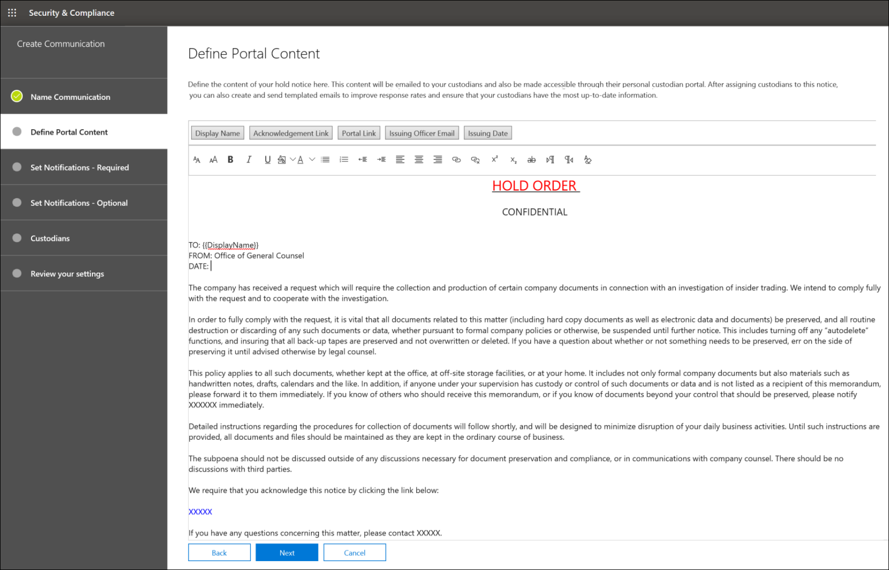

# Criar um aviso de espera legalCreate a legal hold notice

Usando comunicações custodiantes de Descoberta Eletrônica Avançada, as organizações podem gerenciar seu fluxo de trabalho em torno da comunicação com os custodiantes.Using Advanced eDiscovery custodian communications, organizations can manage their workflow around communicating with custodians. Por meio da ferramenta de Comunicações, as equipes jurídicas podem enviar, coletar e acompanhar sistematicamente as notificações de espera legal.Through the Communications tool, legal teams can systematically send, collect, and track legal hold notifications. O processo de criação flexível também permite que as equipes personalizem o fluxo de trabalho de notificação de espera e o conteúdo nos avisos enviados aos custodiantes.The flexible creation process also allows teams to customize the hold notification workflow and the content in the notices sent to custodians.

O artigo descreve as etapas no fluxo de trabalho de notificação de espera.The article outlines the steps in the hold notification workflow.

## Etapa 1: especificar detalhes de comunicaçãoStep 1: Specify communication details

A primeira etapa é especificar os detalhes apropriados para avisos de responsabilidade legal ou outras comunicações custodiais.The first step is to specify the appropriate details for legal hold notices or other custodian communications.

1. No Centro de Conformidade & Segurança, vá para a Descoberta > **eDiscovery** Avançada para exibir a lista de ocorrências em sua organização.In the Security & Compliance Center, go to **eDiscovery > Advanced eDiscovery** to display the list of cases in your organization.

2. Selecione um caso, clique na guia **Comunicações** e clique em **Nova comunicação.**Select a case, click the **Communications** tab, and then click **New communication**.

3. Na página **de comunicação nome,** especifique os seguintes detalhes de comunicação (obrigatórios).On the **Name communication** page, specify the following (required) communication details.

    - **Nome:** este é o nome da comunicação.**Name**: This is the name for the communication.

    - **Diretor de emissão:** a lista suspenso exibe uma lista de membros da ocorrência.**Issuing officer**: The dropdown list displays a list of case members. For more information on how to add new members to a case, see [Create an Advanced eDiscovery case](create-and-manage-advanced-ediscoveryv2-case.md#create-a-case).For more information on how to add new members to a case, see [Create an Advanced eDiscovery case](create-and-manage-advanced-ediscoveryv2-case.md#create-a-case). Cada aviso enviado aos custodiantes será enviado em nome do responsável pela emissão especificada.Each notice sent to custodians will be sent on behalf of the specified issuing officer.

> [!NOTE]
> O diretor de emissão deve ter uma caixa de correio **ativa** para aparecer no menu suspenso do Diretor de EmissãoThe issuing officer must have an **active mailbox** to show up in the Issuing Officer dropdown

4. Clique em **Avançar**.Click **Next**.

## Etapa 2: definir o conteúdo do portalStep 2: Define the portal content

Em seguida, você pode criar e adicionar o conteúdo do aviso de espera.Next, you can create and add the content of the hold notice. Na página **Definir conteúdo do portal** no assistente **Criar** comunicação, especifique o conteúdo do aviso de espera.On the **Define portal content** page in the **Create communication** wizard, specify the contents of the hold notice. Esse conteúdo será automaticamente anexado aos avisos de Emissão, Nova Emissão, Lembrete e Escalonamento.This content will be automatically appended to the Issuance, Re-Issue, Reminder, and Escalation notices. Além disso, esse conteúdo será exibido no Portal de Conformidade do custodiante.Additionally, this content will appear in the custodian's Compliance Portal. 

Para criar o conteúdo do portal:To create the portal content:

1. Digite (ou recorte e colar de outro documento) o aviso de espera na caixa de texto do conteúdo do portal.Type (or cut and paste from another document) your hold notice in the textbox for the portal content. 

2. Insira variáveis mescladas em seu aviso para personalizar o aviso e compartilhar o Portal de Conformidade custodiantes.Insert merge variables into your notice to customize the notice and share the Custodian Compliance Portal.

3. Clique em **Avançar**.Click **Next**.

  >[!Tip]
  >Para saber mais sobre como personalizar o conteúdo e o formato do conteúdo do portal, consulte [Usar o Editor de Comunicações.](using-communications-editor.md)To learn more about how to can customize the content and format of the portal content, see [Use the Communications Editor](using-communications-editor.md).

## Etapa 3: Definir as notificações necessáriasStep 3: Set the required notifications

Depois de definir o conteúdo do aviso de espera, você pode configurar os fluxos de trabalho para enviar e gerenciar o processo de notificação.After you've defined the contents of the hold notice, you can set up the workflows around sending and managing the notification process. As notificações são mensagens de email enviadas para notificar e acompanhar os custodiantes.Notifications are email messages that are sent to notify and follow up with custodians. Todos os custodiados adicionados à comunicação receberão a mesma notificação.Every custodian added to the communication will receive the same notification. 

Para configurar e enviar um aviso de espera, você deve incluir notificações de Emissão, Nova Emissão e Lançamento.To set up and send a hold notice, you must include Issuance, Re-Issuance, and Release notifications.

### Notificação de emissãoIssuance notification 

Após a criação da comunicação, a **Notificação** de Emissão é iniciada pelo Diretor de Emissão especificado.After the communication is created, the **Issuance Notification** is initiated by the specified Issuing Officer. A notificação de emissão é a primeira comunicação enviada ao custodiatário para informá-lo sobre suas obrigações de preservação.The Issuance notification is the first communication sent to the custodian to inform them about their preservation obligations. 

Para criar uma notificação de emissão:To create an issuance notification:

1. No lado **da emissão,** clique em **Editar.**In the **Issuance** tile, click **Edit**.

2. Se necessário, adicione outros membros da ocorrência ou equipe aos **campos Cc** **e Cc.**If necessary, add additional case members or staff to the **Cc** and **Bcc** fields. Para adicionar vários usuários a esses campos, separe os endereços de email com pontos-e-vírgulas.To add multiple users to these fields, separate email addresses with a semi-colon.

3. **Especifique o** Assunto para o aviso (obrigatório).Specify the **Subject** for the notice (required).

4. Especifique o conteúdo ou instruções adicionais que você gostaria de fornecer ao custodiatário (obrigatório).Specify the contents or additional instructions that you would like to provide to the custodian (required). O conteúdo do portal definido na Etapa 2 é adicionado ao final do aviso de publicação.The portal content you defined in Step 2 is added to the end of the issuance notice. 

5. Clique em **Salvar**.Click **Save**.

### Re-Issuance notificaçãoRe-Issuance notification

À medida que o caso progride, os custodiantes podem ser obrigados a preservar dados adicionais ou menores do que foi instruído anteriormente.As the case progresses, custodians may be required to preserve additional or less data than was previously instructed. Depois de atualizar o conteúdo do portal, a notificação de nova emissão é enviada e alerta os custodiantes sobre quaisquer alterações em suas obrigações de preservação.After you update the portal content, the re-issuance notification is sent and alerts custodians about any changes to their preservation obligations.

Para criar uma notificação de nova emissão:To create a re-issuance notification:

1. No lado **reemissão,** clique em **Editar.**In the **Reissue** tile, click **Edit**.

2. Se necessário, adicione outros membros da ocorrência ou equipe aos **campos Cc** **e Cc.**If necessary, add additional case members or staff to the **Cc** and **Bcc** fields. Para adicionar vários usuários a esses campos, separe os endereços de email com pontos-e-vírgulas.To add multiple users to these fields, separate email addresses with a semi-colon.

3. **Especifique o** Assunto para o aviso (obrigatório).Specify the **Subject** for the notice (required).

4. Especifique o conteúdo ou instruções adicionais que você gostaria de fornecer ao custodiatário (obrigatório).Specify the contents or additional instructions that you would like to provide to the custodian (required). O conteúdo do portal definido na Etapa 2 é adicionado ao final do aviso de reemissão.The portal content you defined in Step 2 is added to the end of the re-issuance notice.

5. Clique em **Salvar**.Click **Save**.

> [!NOTE]
> Se o conteúdo do portal for modificado (na página Definir Conteúdo do **Portal** no assistente de comunicação Editar), a notificação de nova publicação será automaticamente enviada a todos os custodiantes atribuídos ao aviso. If the portal content is modified (on the **Define Portal Content** page in the **Edit communication** wizard), the re-issuance notification will be automatically sent to all custodians assigned to the notice. Depois que a notificação for enviada, os custodiantes serão solicitados a confirmar o aviso de espera.After the notification is sent, custodians will be asked to re-acknowledge their hold notice. Se você tiver definido algum fluxo de trabalho de lembrete ou escalonamento, eles também serão re-iniciar.If you have set up any reminder or escalation workflows, these will also re-start. Para obter mais informações sobre quais outros eventos de gerenciamento de casos disparam comunicações, consulte [Eventos que disparam notificações.](#events-that-trigger-notifications)For more information about what other case management events trigger communications, see [Events that trigger notifications](#events-that-trigger-notifications).

### Notificação de versãoRelease notification

Depois que uma questão for resolvida ou se um custodiante não estiver mais sujeito a preservar conteúdo, você poderá liberar o custodiante de uma ocorrência.After a matter is resolved or if a custodian is no longer subject to preserve content, you can release the custodian from a case. Se o custodiante tiver emitido anteriormente um aviso de responsabilidade, a notificação de liberação poderá ser usada para alertar os custodiantes de que eles foram liberados de sua obrigação.If the custodian was previously issued a hold notice, the release notification can be used to alert custodians that they have been released from their obligation.

Para criar uma notificação de lançamento:To create a release notification: 

1. In the **Release** tile, click **Edit**.In the **Release** tile, click **Edit**.

2. Se necessário, adicione outros membros da ocorrência ou equipe aos **campos Cc** **e Cc.**If necessary, add additional case members or staff to the **Cc** and **Bcc** fields. Para adicionar vários usuários a esses campos, separe os endereços de email com pontos-e-vírgulas.To add multiple users to these fields, separate email addresses with a semi-colon.

3. **Especifique o** Assunto para o aviso (obrigatório).Specify the **Subject** for the notice (required).

4. Especifique o conteúdo ou instruções adicionais que você gostaria de fornecer ao custodiatário (obrigatório).Specify the contents or additional instructions that you would like to provide to the custodian (required).

5. Clique **em** Salvar e vá para a próxima etapa.Click **Save** and go to the next step.

## (Opcional) Etapa 4: Definir as notificações opcionais(Optional) Step 4: Set the optional notifications

Opcionalmente, você pode simplificar o fluxo de trabalho para acompanhar com custodiantes não responsivos criando e agendando notificações automatizadas de lembrete e escalonamento.Optionally, you can simplify the workflow for following up with unresponsive custodians by creating and scheduling automated reminder and escalation notifications.

### RemindersReminders

Depois de enviar uma notificação de espera, você pode acompanhar os custodiantes sem resposta definindo um fluxo de trabalho de lembrete.After you have sent a hold notification, you can follow up with unresponsive custodians by defining a reminder workflow.

Para agendar lembretes:To schedule reminders:

1. No lado **lembrete,** clique em **Editar**.In the **Reminder** tile, click **Edit**.

2. **Habilita o fluxo** de trabalho Lembrete ativando a **alternância status** (obrigatório).Enable the **Reminder** workflow by turning on the **Status** toggle (required).

3. **Especifique o intervalo de Lembrete (em dias)** (obrigatório).Specify the **Reminder interval (in days)** (required). Esse é o número de dias de espera antes de enviar as primeiras notificações de lembrete e acompanhamento.This is the number of days to wait before sending the first and follow-up reminder notifications. Por exemplo, se você definir o intervalo de lembrete como sete dias, o primeiro lembrete será enviado sete dias após a notificação de espera ter sido inicialmente emitida.For example, if you set the reminder interval to seven days, then the first reminder would be sent seven days after the hold notification was initially issued. Todos os lembretes subsequentes também seriam enviados a cada sete dias.All subsequent reminders would also be sent every seven days.

4. **Especifique o Número de lembretes** (obrigatório).Specify the **Number of reminders** (required). Este campo especifica quantos lembretes enviar a custodiantes não responsivos.This field specifies how many reminders to send to unresponsive custodians. Por exemplo, se você definir o número de lembretes como 3, um custodiante receberá no máximo três lembretes.For example, if you set the number of reminders to 3, then a custodian would receive a maximum of three reminders. Depois que um custodiante reconhecer a notificação de espera, os lembretes não serão mais enviados para esse usuário.After a custodian acknowledges the hold notification, reminders will no longer be sent to that user.

5. **Especifique o** Assunto para o aviso (obrigatório).Specify the **Subject** for the notice (required). 

6. Especifique o conteúdo ou instruções adicionais que você gostaria de fornecer ao custodiatário (obrigatório).Specify the contents or additional instructions that you would like to provide to the custodian (required). O conteúdo do portal definido na Etapa 2 é adicionado ao final do aviso de lembrete.The portal content you defined in Step 2 is added to the end of the reminder notice.

7. Clique **em** Salvar e vá para a próxima etapa.Click **Save** and go the next step.

### EscalonamentosEscalations

Em algumas situações, talvez você precise de maneiras adicionais de acompanhar os custodiantes não responsivos.In some situations, you may need additional ways to follow up with unresponsive custodians. Se um custodiante não confirmar uma notificação de suspensão após receber o número especificado de lembretes, a equipe jurídica poderá especificar um fluxo de trabalho para enviar automaticamente um aviso de escalonamento para o custodiante e seu gerente.If a custodian doesn't acknowledge a hold notification after receiving the specified number of reminders, the legal team can specify a workflow to automatically send an escalation notice to the custodian and their manager.

Para agendar escalonamentos:To schedule escalations:

1. No lado **do escalonamento,** clique em **Editar.**In the **Escalation** tile, click **Edit**.

2. **Habilita o fluxo de** trabalho de escalonamento ativando a **alternância Status.**Enable the **Escalation** workflow by turning on the **Status** toggle.

3. **Especifique o intervalo de escalonamento (em dias)** (obrigatório).Specify the **Escalation interval (in days)** (required).

4. **Especifique o número de escalonamentos** (obrigatório).Specify the **Number of escalations** (required). Este campo especifica quantas escalações enviar para custodiantes não responsivos.This field specifies how many escalations to send to unresponsive custodians. Por exemplo, se você definir o número de escalonamentos como 3, um aviso de escalonamento será enviado ao custodiante e ao gerente no máximo três vezes.For example, if you set the number of escalations to 3, then an escalation notice would be sent to the custodian and their manager a maximum of three times. Depois que um custodiante reconhecer a notificação de espera, os escalonamentos não serão mais enviados.After a custodian acknowledges the hold notification, escalations will no longer be sent.

5. **Especifique o** Assunto para o aviso (obrigatório).Specify the **Subject** for the notice (required). 

6. Especifique o conteúdo ou instruções adicionais que você gostaria de fornecer ao custodiatário (obrigatório).Specify the contents or additional instructions that you would like to provide to the custodian (required). O conteúdo do portal definido na Etapa 2 é adicionado ao final do aviso de escalonamento.The portal content you defined in Step 2 is added to the end of the escalation notice.

7. Clique **em** Salvar e vá para a próxima etapa.Click **Save** and go the next step.

## Etapa 5: Atribuir custodiantes para receber notificaçõesStep 5: Assign custodians to receive notifications

Depois de finalizar o conteúdo para notificações, selecione os custodiantes aos que você gostaria de enviar notificações.After you have finalized the content for notifications, select the custodians that you would like to send notifications to. 

Para adicionar custodiantes:To add custodians:

1. Atribua custodiantes à comunicação clicando na caixa de seleção ao lado do nome.Assign custodians to the communication by clicking the checkbox next to their name.

    Após a criação da comunicação, o fluxo de trabalho de notificação será aplicado automaticamente aos custodiantes selecionados.After the communication is created, the notification workflow will automatically apply to the selected custodians.

2. Clique **em Próximo** para revisar as configurações e os detalhes da comunicação.Click **Next** to review the communication settings and details.

>[!NOTE]
>Você só pode adicionar custodiantes que foram adicionados à ocorrência e não foram enviadas outra notificação dentro da ocorrência.You can only add custodians who have been added to the case and haven't been sent another notification within the case.

## Etapa 6: Revisar as configuraçõesStep 6: Review settings

Depois de revisar as configurações e clicar em **Enviar** para concluir a comunicação, o sistema iniciará automaticamente o fluxo de trabalho de comunicação enviando o aviso de emissão.After you review the settings and click **Send** to complete the communication, the system will automatically start the communication workflow by sending the issuance notice.

## Eventos que disparam notificaçõesEvents that trigger notifications

A tabela a seguir descreve eventos no processo de gerenciamento de casos que disparam quando os diferentes tipos de notificações são enviados aos custodiantes.The following table describes events in the case management process that trigger when the different types of notifications are sent to custodians.

|Tipo de comunicaçãoType of communication|GatilhoTrigger |
|:---------|:---------|
|Avisos de emissãoIssuance notices|A criação inicial da notificação.The initial creation of the notification. Você também pode resendá-la manualmente.You can also manually resend a hold notification. |
|Avisos de reemissãoRe-issuance notices|Atualizando o conteúdo do portal na página **Definir Conteúdo do Portal** no assistente editar **comunicação.**Updating the portal content on the **Define Portal Content** page in the **Edit communication** wizard.|
|Avisos de versãoRelease notices|O custodiante é liberado da ocorrência.The custodian is released from the case.|
|RemindersReminders|O intervalo e o número de lembretes configurados para o lembrete.The interval and number of reminders configured for the reminder.|
|EscalonamentosEscalations|O intervalo e o número de lembretes configurados para o escalonamento.The interval and number of reminders configured for the escalation.|
|||
