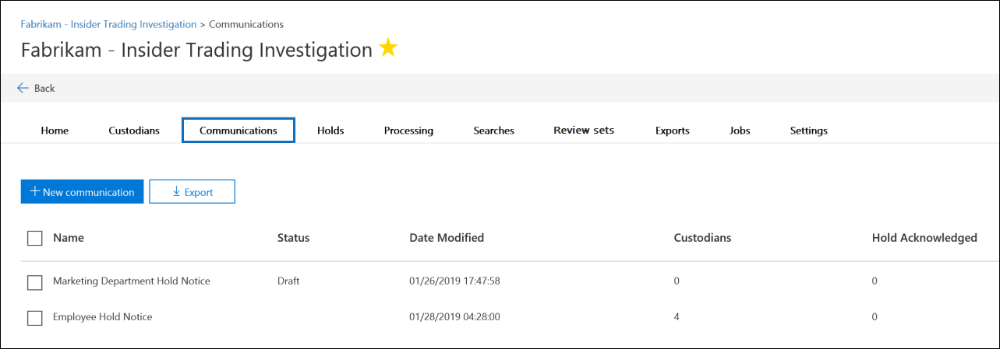

# Criar um aviso de retenção legalCreate a legal hold notice

Usando a comunicação de descoberta eletrônica avançada, as organizações podem gerenciar seu fluxo de trabalho em relação à comunicação com os responsáveis.Using Advanced eDiscovery custodian communications, organizations can manage their workflow around communicating with custodians. Por meio da ferramenta de comunicação, as equipes jurídicas podem, sistematicamente, enviar, coletar e acompanhar as notificações de retenção legal.Through the Communications tool, legal teams can systematically send, collect, and track legal hold notifications. O processo de criação flexível também permite que as equipes personalizem o fluxo de trabalho de notificação de espera e o conteúdo dos avisos enviados aos responsáveis.The flexible creation process also allows teams to customize the hold notification workflow and the content in the notices sent to custodians. 

O artigo descreve as etapas no fluxo de trabalho de notificação de retenção.The article outlines the steps in the hold notification workflow.

## Etapa 1: especificar detalhes de comunicaçãoStep 1: Specify communication details

A primeira etapa é especificar os detalhes apropriados para avisos de retenção legal ou outras comunicações do mesmo.The first step is to specify the appropriate details for legal hold notices or other custodian communications.

1. No centro de conformidade de & de segurança, acesse **descoberta eletrônica avançada > eDiscovery** para exibir a lista de casos em sua organização.In the Security & Compliance Center, go to **eDiscovery > Advanced eDiscovery** to display the list of cases in your organization.

2. Selecione um caso, clique na guia **comunicações** e, em seguida, clique em **nova comunicação**.Select a case, click the **Communications** tab, and then click **New communication**.

3. Na página **comunicação de nome** , especifique os seguintes detalhes de comunicação (obrigatório).On the **Name communication** page, specify the following (required) communication details.

    - **Name**: Este é o nome da comunicação.**Name**: This is the name for the communication.

    - **Responsável pela emissão**: a lista suspensa exibe uma lista de membros de caso.**Issuing officer**: The dropdown list displays a list of case members. Para obter mais informações sobre como adicionar novos membros a uma ocorrência, consulte [criar uma caixa de descoberta eletrônica avançada](get-started-with-advanced-ediscovery.md#step-4-create-an-advanced-ediscovery-case).For more information on how to add new members to a case, see [Create an Advanced eDiscovery case](get-started-with-advanced-ediscovery.md#step-4-create-an-advanced-ediscovery-case). Cada aviso enviado aos responsáveis será enviado em nome do responsável pela emissão especificado.Each notice sent to custodians will be sent on behalf of the specified issuing officer.

> [!NOTE]
> O responsável pela emissão deve ter uma **caixa de correio ativa** para aparecer no menu suspenso do responsável pela emissãoThe issuing officer must have an **active mailbox** to show up in the Issuing Officer dropdown

4. Clique em **Avançar**.Click **Next**.

## Etapa 2: definir o conteúdo do portalStep 2: Define the portal content

Em seguida, você pode criar e adicionar o conteúdo do aviso de isenção.Next, you can create and add the content of the hold notice. Na página **definir conteúdo do portal** no Assistente para **criar comunicação** , especifique o conteúdo do aviso de isenção.On the **Define portal content** page in the **Create communication** wizard, specify the contents of the hold notice. Esse conteúdo será automaticamente acrescentado aos avisos de emissão, reemissão, lembrete e escalonamento.This content will be automatically appended to the Issuance, Re-Issue, Reminder, and Escalation notices. Além disso, esse conteúdo aparecerá no portal de conformidade do responsáveis.Additionally, this content will appear in the custodian's Compliance Portal. 

Para criar o conteúdo do portal:To create the portal content:

1. Digite (ou recorte e Cole de outro documento) seu aviso de bloqueio na caixa de texto do conteúdo do Portal.Type (or cut and paste from another document) your hold notice in the textbox for the portal content. 

2. Insira as variáveis de mesclagem no seu aviso para personalizar o aviso e compartilhar o portal de conformidade do responsáveis.Insert merge variables into your notice to customize the notice and share the Custodian Compliance Portal.

3. Clique em **Avançar**.Click **Next**.

  >[!Tip]
  >Para saber mais sobre como personalizar o conteúdo e o formato do conteúdo do portal, confira [usar o editor de comunicações](using-communications-editor.md).To learn more about how to can customize the content and format of the portal content, see [Use the Communications Editor](using-communications-editor.md).

## Etapa 3: definir as notificações necessáriasStep 3: Set the required notifications

Após definir o conteúdo do aviso de espera, você pode configurar os fluxos de trabalho em torno do envio e gerenciamento do processo de notificação.After you've defined the contents of the hold notice, you can set up the workflows around sending and managing the notification process. Notificações são mensagens de email enviadas para notificar e acompanhar os responsáveis.Notifications are email messages that are sent to notify and follow up with custodians. Todos os responsáveis adicionados à comunicação receberão a mesma notificação.Every custodian added to the communication will receive the same notification. 

Para configurar e enviar um aviso de espera, você deve incluir notificações de emissão, reemissão e lançamento.To set up and send a hold notice, you must include Issuance, Re-Issuance, and Release notifications.

### Notificação de emissãoIssuance notification 

Depois que a comunicação é criada, a **notificação de emissão** é iniciada pelo responsável pela emissão especificado.After the communication is created, the **Issuance Notification** is initiated by the specified Issuing Officer. A notificação de emissão é a primeira comunicação enviada ao responsáveis para informá-los sobre suas obrigações de preservação.The Issuance notification is the first communication sent to the custodian to inform them about their preservation obligations. 

Para criar uma notificação de emissão:To create an issuance notification:

1. No bloco de **publicação** , clique em **Editar**.In the **Issuance** tile, click **Edit**.

2. Se necessário, adicione membros de caso adicionais ou equipe aos campos **CC** e **Cco** .If necessary, add additional case members or staff to the **Cc** and **Bcc** fields. Para adicionar vários usuários a esses campos, separe os endereços de email com um ponto-e-vírgula.To add multiple users to these fields, separate email addresses with a semi-colon.

3. Especifique o **assunto** para o aviso (obrigatório).Specify the **Subject** for the notice (required).

4. Especifique o conteúdo ou instruções adicionais que você gostaria de fornecer aos responsáveis (obrigatório).Specify the contents or additional instructions that you would like to provide to the custodian (required). O conteúdo do portal que você definiu na etapa 2 é adicionado ao final do aviso de emissão.The portal content you defined in Step 2 is added to the end of the issuance notice. 

5. Clique em **Salvar**.Click **Save**.

### Notificação de Re-IssuanceRe-Issuance notification

Como o caso progride, os responsáveis podem ser necessários para preservar dados adicionais ou menos do que foram instruídos anteriormente.As the case progresses, custodians may be required to preserve additional or less data than was previously instructed. Depois que você atualizar o conteúdo do portal, a notificação de reemissão será enviada e alertará os responsáveis por todas as suas obrigações de preservação.After you update the portal content, the re-issuance notification is sent and alerts custodians about any changes to their preservation obligations.

Para criar uma notificação de reemissão:To create a re-issuance notification:

1. No bloco **reemitir** , clique em **Editar**.In the **Reissue** tile, click **Edit**.

2. Se necessário, adicione membros de caso adicionais ou equipe aos campos **CC** e **Cco** .If necessary, add additional case members or staff to the **Cc** and **Bcc** fields. Para adicionar vários usuários a esses campos, separe os endereços de email com um ponto-e-vírgula.To add multiple users to these fields, separate email addresses with a semi-colon.

3. Especifique o **assunto** para o aviso (obrigatório).Specify the **Subject** for the notice (required).

4. Especifique o conteúdo ou instruções adicionais que você gostaria de fornecer aos responsáveis (obrigatório).Specify the contents or additional instructions that you would like to provide to the custodian (required). O conteúdo do portal que você definiu na etapa 2 é adicionado ao final do aviso de reemissão.The portal content you defined in Step 2 is added to the end of the re-issuance notice.

5. Clique em **Salvar**.Click **Save**.

> [!NOTE]
> Se o conteúdo do portal for modificado (na página **definir conteúdo do portal** no assistente **Editar comunicação** ), a notificação de reemissão será automaticamente enviada a todos os responsáveis atribuídos ao aviso.If the portal content is modified (on the **Define Portal Content** page in the **Edit communication** wizard), the re-issuance notification will be automatically sent to all custodians assigned to the notice. Após a notificação ser enviada, os responsáveis serão solicitados a reconfirmar seu aviso de isenção.After the notification is sent, custodians will be asked to re-acknowledge their hold notice. Se você tiver configurado os fluxos de trabalho de lembretes ou de escalonamento, eles também serão reiniciados.If you have set up any reminder or escalation workflows, these will also re-start. Para obter mais informações sobre o que outros eventos de gerenciamento de caso disparam comunicações, consulte [eventos que disparam notificações](#events-that-trigger-notifications).For more information about what other case management events trigger communications, see [Events that trigger notifications](#events-that-trigger-notifications).

### Notificação de lançamentoRelease notification

Após uma questão ser resolvida ou se um usuário não está mais sujeito a preservar o conteúdo, você pode liberar os responsáveis de uma ocorrência.After a matter is resolved or if a custodian is no longer subject to preserve content, you can release the custodian from a case. Se o objectrecebeu anteriormente um aviso de espera, a notificação de lançamento pode ser usada para alertar os responsáveis por terem sido liberados de sua obrigação.If the custodian was previously issued a hold notice, the release notification can be used to alert custodians that they have been released from their obligation.

Para criar uma notificação de lançamento:To create a release notification: 

1. No bloco de **versão** , clique em **Editar**.In the **Release** tile, click **Edit**.

2. Se necessário, adicione membros de caso adicionais ou equipe aos campos **CC** e **Cco** .If necessary, add additional case members or staff to the **Cc** and **Bcc** fields. Para adicionar vários usuários a esses campos, separe os endereços de email com um ponto-e-vírgula.To add multiple users to these fields, separate email addresses with a semi-colon.

3. Especifique o **assunto** para o aviso (obrigatório).Specify the **Subject** for the notice (required).

4. Especifique o conteúdo ou instruções adicionais que você gostaria de fornecer aos responsáveis (obrigatório).Specify the contents or additional instructions that you would like to provide to the custodian (required).

5. Clique em **salvar** e vá para a próxima etapa.Click **Save** and go to the next step.

## Opcion Etapa 4: definir as notificações opcionais(Optional) Step 4: Set the optional notifications

Opcionalmente, você pode simplificar o fluxo de trabalho para acompanhar os responsáveis por não responder, criando e agendando notificações automatizadas de lembrete e escalonamento.Optionally, you can simplify the workflow for following up with unresponsive custodians by creating and scheduling automated reminder and escalation notifications.

### RemindersReminders

Depois de enviar uma notificação de espera, você pode acompanhar os responsáveis por não responder, definindo um fluxo de trabalho de lembrete.After you have sent a hold notification, you can follow up with unresponsive custodians by defining a reminder workflow.

Para agendar lembretes:To schedule reminders:

1. No bloco **lembrete** , clique em **Editar**.In the **Reminder** tile, click **Edit**.

2. Habilite o fluxo de trabalho de **lembrete** ativando o **status** de alternância (obrigatório).Enable the **Reminder** workflow by turning on the **Status** toggle (required).

3. Especifique o **intervalo de lembretes (em dias)** (obrigatório).Specify the **Reminder interval (in days)** (required). Este é o número de dias de espera antes de enviar as notificações de lembrete inicial e de acompanhamento.This is the number of days to wait before sending the first and follow-up reminder notifications. Por exemplo, se você definir o intervalo de lembretes para sete dias, o primeiro lembrete será enviado sete dias após a notificação de retenção ser emitida inicialmente.For example, if you set the reminder interval to seven days, then the first reminder would be sent seven days after the hold notification was initially issued. Todos os lembretes subsequentes também serão enviados a cada sete dias.All subsequent reminders would also be sent every seven days.

4. Especifique o **número de lembretes** (obrigatório).Specify the **Number of reminders** (required). Este campo especifica o número de lembretes a serem enviados para os responsáveis por não responder.This field specifies how many reminders to send to unresponsive custodians. Por exemplo, se você definir o número de lembretes como 3, um dos responsáveis receberá um máximo de três lembretes.For example, if you set the number of reminders to 3, then a custodian would receive a maximum of three reminders. Depois que os responsáveis confirmarem a notificação de espera, os lembretes não serão mais enviados para esse usuário.After a custodian acknowledges the hold notification, reminders will no longer be sent to that user.

5. Especifique o **assunto** para o aviso (obrigatório).Specify the **Subject** for the notice (required). 

6. Especifique o conteúdo ou instruções adicionais que você gostaria de fornecer aos responsáveis (obrigatório).Specify the contents or additional instructions that you would like to provide to the custodian (required). O conteúdo do portal que você definiu na etapa 2 é adicionado ao final do aviso de lembrete.The portal content you defined in Step 2 is added to the end of the reminder notice.

7. Clique em **salvar** e vá para a próxima etapa.Click **Save** and go the next step.

### EscalonamentosEscalations

Em algumas situações, talvez você precise de outras maneiras de acompanhar os responsáveis por não responder.In some situations, you may need additional ways to follow up with unresponsive custodians. Se um responsáveis não confirmar uma notificação de bloqueio após receber o número especificado de lembretes, a equipe jurídica poderá especificar um fluxo de trabalho para enviar automaticamente um aviso de escalonamento para os responsáveis e seu gerente.If a custodian doesn't acknowledge a hold notification after receiving the specified number of reminders, the legal team can specify a workflow to automatically send an escalation notice to the custodian and their manager.

Para agendar escalonamentos:To schedule escalations:

1. No bloco **escalonamento** , clique em **Editar**.In the **Escalation** tile, click **Edit**.

2. Habilite o fluxo de trabalho de **escalonamento** ativando a alternância de **status** .Enable the **Escalation** workflow by turning on the **Status** toggle.

3. Especifique o **intervalo de escalonamento (em dias)** (obrigatório).Specify the **Escalation interval (in days)** (required).

4. Especifique o **número de escalas** (obrigatório).Specify the **Number of escalations** (required). Este campo especifica a quantidade de escalonamentos a ser enviada para os responsáveis por não responder.This field specifies how many escalations to send to unresponsive custodians. Por exemplo, se você definir o número de escalonamentos como 3, um aviso de escalonamento será enviado aos responsáveis e seu gerente no máximo três vezes.For example, if you set the number of escalations to 3, then an escalation notice would be sent to the custodian and their manager a maximum of three times. Depois que os responsáveis confirmarem a notificação de espera, os escalonamentos não serão mais enviados.After a custodian acknowledges the hold notification, escalations will no longer be sent.

5. Especifique o **assunto** para o aviso (obrigatório).Specify the **Subject** for the notice (required). 

6. Especifique o conteúdo ou instruções adicionais que você gostaria de fornecer aos responsáveis (obrigatório).Specify the contents or additional instructions that you would like to provide to the custodian (required). O conteúdo de portal que você definiu na etapa 2 é adicionado ao final do aviso de escalonamento.The portal content you defined in Step 2 is added to the end of the escalation notice.

7. Clique em **salvar** e vá para a próxima etapa.Click **Save** and go the next step.

## Etapa 5: atribuir os responsáveis a receber notificaçõesStep 5: Assign custodians to receive notifications

Depois de finalizar o conteúdo para notificações, selecione os responsáveis para os quais você gostaria de enviar notificações.After you have finalized the content for notifications, select the custodians that you would like to send notifications to. 

Para adicionar os responsáveis:To add custodians:

1. Atribua os responsáveis à comunicação clicando na caixa de seleção ao lado do nome.Assign custodians to the communication by clicking the checkbox next to their name.

    Depois que a comunicação for criada, o fluxo de trabalho de notificação será aplicado automaticamente aos responsáveis selecionados.After the communication is created, the notification workflow will automatically apply to the selected custodians.

2. Clique em **Avançar** para revisar as configurações e detalhes de comunicação.Click **Next** to review the communication settings and details.

>[!NOTE]
>Você só pode adicionar os responsáveis que foram adicionados ao caso e não foram enviados outra notificação no caso.You can only add custodians who have been added to the case and haven't been sent another notification within the case.

## Etapa 6: revisar as configuraçõesStep 6: Review settings

Após revisar as configurações e clicar em **Enviar** para concluir a comunicação, o sistema iniciará automaticamente o fluxo de trabalho de comunicação enviando o aviso de emissão.After you review the settings and click **Send** to complete the communication, the system will automatically start the communication workflow by sending the issuance notice.

## Eventos que disparam notificaçõesEvents that trigger notifications

A tabela a seguir descreve os eventos no processo de gerenciamento de casos que são acionados quando os diferentes tipos de notificações são enviados para os responsáveis.The following table describes events in the case management process that trigger when the different types of notifications are sent to custodians.

|Tipo de comunicaçãoType of communication|GatilhoTrigger |
|:---------|:---------|
|Notificações de emissãoIssuance notices|A criação inicial da notificação.The initial creation of the notification. Você também pode reenviar manualmente uma notificação de retenção.You can also manually resend a hold notification. |
|Notificações de reemissãoRe-issuance notices|Atualizando o conteúdo do portal na página **definir conteúdo do portal** no Assistente para **Editar comunicação** .Updating the portal content on the **Define Portal Content** page in the **Edit communication** wizard.|
|Avisos de lançamentoRelease notices|Os responsáveis são liberados do caso.The custodian is released from the case.|
|RemindersReminders|O intervalo e o número de lembretes configurados para o lembrete.The interval and number of reminders configured for the reminder.|
|EscalonamentosEscalations|O intervalo e o número de lembretes configurados para o escalonamento.The interval and number of reminders configured for the escalation.|
|||
