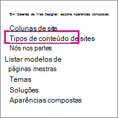

# Criar e aplicar políticas de gerenciamento de informações

As políticas de gerenciamento de informações permitem que sua organização controle por quanto tempo reter conteúdo, auditar o que as pessoas fazem com o conteúdo e adicionar códigos de barras ou rótulos a documentos. Uma política pode ajudar a impor a conformidade com regulamentos legais e governamentais ou processos comerciais internos. Como administrador, você pode configurar uma política para controlar como rastrear documentos e por quanto tempo manter documentos.
  
Você pode criar uma política de gerenciamento de informações em três locais diferentes na hierarquia do site, do mais amplo ao mais estreito:
  
- Crie uma política a ser usada em vários tipos de conteúdo em um conjunto de sites.
    
- Crie uma política para um tipo de conteúdo de site.
    
- Crie uma política para uma lista ou biblioteca.
    
Para obter mais informações, consulte [Introdução às políticas de gerenciamento de informações.](intro-to-info-mgmt-policies.md)
  
## Criar uma política para vários tipos de conteúdo em um conjunto de sites

Para garantir que uma política de informações seja aplicada a todos os documentos de um determinado tipo em um conjunto de sites, considere criar a política no nível do conjunto de sites e, em seguida, aplicar a política a tipos de conteúdo. Elas são conhecidas como políticas de conjunto de sites. 
  
1. Na home page do conjunto de sites Configurações \>   \> **Configurações do site**.
    
    Em um SharePoint conectado a um grupo, clique em **Configurações,** em Conteúdo do **Site** e em **Site Configurações**. 
    
2. Na página Site Configurações, em Modelos de Política de Tipo de Conteúdo da Administração do **Conjunto** \> **de Sites.** 
  

  
3. Na página Políticas \> **Criar**. 
    
4. Insira um nome e uma descrição para a política e, em seguida, escreva uma breve instrução de política que explica aos usuários para o que é a política.
    
5. Consulte a próxima seção sobre como criar políticas para um tipo de conteúdo de site para saber como configurar os recursos que você deseja associar à política. 
    
6. Escolha **OK**.
    
## Criar uma política para um tipo de conteúdo de site

Adicionar uma política de gerenciamento de informações a um tipo de conteúdo facilita a associação de recursos de política a várias listas ou bibliotecas. Você pode optar por adicionar uma política de gerenciamento de informações existente a um tipo de conteúdo ou criar uma política exclusiva específica para um tipo de conteúdo individual.
  
 Você também pode adicionar uma política de gerenciamento de informações a um tipo de conteúdo específico para listas. Isso tem o efeito de aplicar a política somente a itens nessa lista que estão usando o tipo de conteúdo. 
  
1. Na home page do conjunto de sites Configurações \>   \> **Configurações do site**.
    
    Em um SharePoint conectado a um grupo, clique em **Configurações,** em Conteúdo do **Site** e em **Site Configurações**. 
    
2. Na página Site Configurações, em **Web Designer Galleries** \> **Tipos de conteúdo do site**.
  

  
3. Na página Tipo de Conteúdo do Site Configurações, selecione o tipo de conteúdo ao qual deseja adicionar uma política.
    
4. Na página Tipo de Conteúdo do Site, **em** Configurações \> **Configurações de política de gerenciamento de informações.**
    
5. Na página Editar Política, insira um nome e uma descrição para a política e, em seguida, escreva uma breve descrição que explica aos usuários para o que a política é.
    
6. Nas próximas seções, selecione os recursos de política individuais que você deseja adicionar à sua política de gerenciamento de informações. 
  

  
7. Para especificar um período de retenção para documentos e itens que estão sujeitos a essa política, escolha Habilitar Retenção **e** especifique o período de retenção e as ações que você deseja que ocorram quando os itens expirarem.
    
    Para especificar um período de retenção
    
||||||**1.**|**Escolha **Adicionar um estágio de retenção para registros...****|
|:-----|:-----|:-----|:-----|:-----|:-----|:-----|
||||||2.    | Selecione uma opção de período de retenção para especificar quando documentos ou itens estão definidos para expirar. Siga um destes procedimentos:     Para definir a data de expiração com base em uma propriedade de data, em **Evento** Este estágio é baseado em uma propriedade de data no item e selecione a ação documento ou item (por exemplo, Criado ou Modificado) e o incremento de tempo após essa ação (por exemplo, o número de dias, meses ou anos) quando você deseja que o \> item expire.     Para usar uma fórmula de retenção personalizada para determinar a expiração, escolha Definir por uma fórmula de **retenção personalizada instalada neste servidor**.    > [!NOTE]> Essa opção só estará disponível se uma fórmula personalizada tiver sido configurada pelo administrador.           |
||||||3.    |A **opção Iniciar um fluxo** de trabalho só estará disponível se você estiver definindo uma política para uma lista, biblioteca ou tipo de conteúdo que já tenha um fluxo de trabalho associado a ela. Em seguida, você receberá uma escolha de fluxos de trabalho para escolher.    |
||||||4.    |Na seção **Recorrência,** selecione **Repetir a ação deste estágio...** e insira com que frequência você deseja que a ação seja reocupda.    > [!NOTE]> Essa opção só estará disponível se a ação selecionada puder ser repetida. Por exemplo, você não pode definir recorrência para a ação **Excluir Permanentemente**.           |
||||||5.    |Escolha **OK**.    |
   
1. Para habilitar a auditoria para os documentos e itens que estão sujeitos a essa política, escolha **Habilitar** Auditoria e especifique os eventos que você deseja auditar.
    
    Para habilitar a auditoria
    
||||||1.****|Na página Editar Política,** em  **Auditoria** Habilitar auditoria **, e selecione as caixas de seleção ao lado dos eventos para os quais você deseja manter uma trilha de auditoria **\>**  para.****|
|:-----|:-----|:-----|:-----|:-----|:-----|:-----|
||||||**2.**   |**Para solicitar que os usuários insiram esses códigos de barras em documentos,** **escolha** Solicitar que os usuários insiram um código de barras antes de salvar **ou imprimir.**    |
||||||**3.**   |**Escolha** **OK** ** para aplicar o recurso de auditoria à política. **   |
|||||||O recurso Política de Auditoria permite que as organizações criem e analisem trilhas de auditoria para documentos e listem itens como listas de tarefas, listas de problemas, grupos de discussão e calendários. Esse recurso de política fornece um log de auditoria que registra eventos, por exemplo, quando o conteúdo é visualizado, editado ou excluído.    |
|||||||Quando a auditoria é habilitada como parte de uma política de gerenciamento de informações, os administradores podem exibir os dados de auditoria nos relatórios de uso da política que são baseados em Microsoft Excel e que resumem o uso atual. Os administradores podem usar esses relatórios para determinar como as informações estão sendo utilizadas na organização. Esses relatórios também podem ajudar as organizações a verificar e documentar sua conformidade regulamentar ou a investigar possíveis preocupações.    |
|||||||O log de auditoria registra as seguintes informações: nome do evento, data e hora do evento e nome do sistema do usuário que executou a ação.    |
   
1. Quando os códigos de barras são habilitados como parte de uma política, eles são adicionados às propriedades do documento e exibidos na área de header do documento ao qual o código de barras é aplicado. Assim como os rótulos, os códigos de barras também podem ser removidos manualmente de um documento. Você pode especificar se os usuários devem ser solicitados a incluir o código de barras ao  imprimir ou salvar um item ou se o código de barras deve ser inserido manualmente usando a guia Inserir em 2010 Office de versão. 
    
    Para habilitar códigos de barras
    
||||||1.****|**Na página Editar Política, em **Códigos de Barras** \> **Habilitar Códigos de Barras**.**|
|:-----|:-----|:-----|:-----|:-----|:-----|:-----|
||||||**2.**   |Para solicitar que os usuários insiram esses códigos de barras em documentos, escolha Solicitar que os usuários insiram um **código de barras antes de salvar ou imprimir.**    |
||||||**3.**   |Escolha **OK** para aplicar o recurso de código de barras à política.    |
|||||||
 A política de código de barras gera códigos de barras padrão do Código 39. Cada imagem de código de barras inclui texto abaixo do símbolo de código de barras que representa o valor do código de barras. Isso permite que os dados de código de barras sejam usados mesmo quando o hardware de verificação não está disponível. Os usuários podem digitar manualmente o número de código de barras na caixa de pesquisa para localizar o item em um site.    |
   
1. Para exigir que os documentos sujeitos a essa política tenham rótulos, escolha **Habilitar** Rótulos e especifique as configurações que você deseja para os rótulos.
    
    Para habilitar rótulos
    
||||||**1.**|**Para exigir que os usuários adicionem um rótulo a um documento, escolha Solicitar que os usuários insiram um rótulo **antes de salvar ou imprimir.**    > [!NOTE]> Se quiser que os rótulos sejam opcionais, não marque essa caixa de seleção.        **|
|:-----|:-----|:-----|:-----|:-----|:-----|:-----|
||||||2.    |Para bloquear um rótulo para que ele não possa ser alterado depois que ele tiver sido inserido, escolha Impedir alterações nos rótulos **depois que eles são adicionados**.     Essa configuração impede que o texto do rótulo seja atualizado depois que o rótulo tiver sido inserido em um item dentro de um aplicativo cliente, como Word, Excel ou PowerPoint. Se você quiser que o rótulo seja adicionado quando as propriedades desse documento ou item forem atualizadas, não marque essa caixa de seleção.    |
||||||3.    |Na caixa Formato rótulo, insira o texto do rótulo conforme você deseja que ele seja exibido. Os rótulos podem conter até 10 referências de coluna, cada uma delas pode ter até 255 caracteres. Para criar o formato do rótulo, faça o seguinte:    Digite os nomes das colunas que você deseja incluir no rótulo na ordem na qual você deseja que elas apareçam. Coloque os nomes de coluna em colchetes cacheados ( ), conforme {} mostrado no exemplo na página Editar Política.    Digite palavras para identificar as colunas fora dos colchetes, conforme mostrado no exemplo na página Editar Política.    |
||||||4.    |Para adicionar uma quebra de linha, **digite\n** onde você deseja que a quebra de linha apareça.    |
||||||5.    |Selecione o tamanho e o estilo da fonte que você deseja e especifique se deseja que o rótulo seja posicionado para a esquerda, para o centro ou para a direita dentro do documento.     Selecione uma fonte e um estilo disponíveis nos computadores dos usuários. O tamanho da fonte afeta a quantidade de texto que pode ser exibida no rótulo.    |
||||||6.    |Insira a altura e a largura do rótulo. A altura e a largura podem ter de.50 a 63,5 cm. O texto do rótulo sempre é centralizado verticalmente na imagem.    |
||||||7.    |Escolha **Atualizar para** visualizar o conteúdo do rótulo.    |
   
1. Escolha **OK**.
    
## Criar uma política para uma lista, biblioteca ou pasta (política de retenção com base em local)

Você pode definir uma política de retenção que se aplica somente a uma lista, biblioteca ou pasta específica. No entanto, se você criar uma política de retenção dessa forma, não poderá reutilizar essa política em outras listas, bibliotecas, pastas ou sites e não poderá aplicar uma política de conjunto de sites a uma política baseada em local.
  
Se você quiser aplicar uma única política de retenção a todos os tipos de conteúdo em um único local, provavelmente vai querer usar a retenção baseada em local. Na maioria dos outros casos, você vai querer verificar se uma política de retenção é especificada para todos os tipos de conteúdo.
  
 Cada subpasta herda a política de retenção de seu pai, a menos que você opte por quebrar a herança e definir uma nova política de retenção no nível filho. 
  
Se você quiser definir uma política de gerenciamento de informações diferente da retenção para uma lista ou biblioteca, você precisará definir uma política de gerenciamento de informações para cada tipo de conteúdo de lista individual associado a essa lista ou biblioteca.
  
 Se, em algum momento, você decidir alternar do tipo de conteúdo para políticas baseadas em local para uma lista ou biblioteca, somente a política de retenção será usada como a política baseada em local. Todas as outras políticas de gerenciamento (auditorias, códigos de barras e códigos de barras) serão herdadas dos tipos de conteúdo associados. 
  
 As políticas baseadas em local podem ser desabilitadas para um conjunto de sites desativando o recurso De retenção baseada em biblioteca e pasta. Isso permite que os administradores do conjunto de sites assegurem que suas políticas de tipo de conteúdo não sejam substituídos pelas políticas baseadas em local de um administrador de lista. 
  
Você precisa pelo menos da permissão Gerenciar Listas para alterar as configurações da política de gerenciamento de informações para uma lista ou biblioteca.
  
1. Navegue até a lista ou biblioteca para a qual você deseja especificar uma política de gerenciamento de informações. 
    
2. Na faixa de opções, escolha **a guia Biblioteca** ou **Lista** de Configurações \>  ou Lista **Configurações**.
    
    Em SharePoint Online, clique **em** Configurações e clique **em Listar configurações** ou **configurações de Biblioteca.** 
    
3. Em **Permissões e Configurações de política** de gerenciamento de informações de \> **gerenciamento.**
  

  
4. Na página Política de Gerenciamento de Informações Configurações, certifique-se de que a fonte de retenção para a lista ou biblioteca está definida como Biblioteca e Pastas. 
  
Se **Tipo de Conteúdo** aparecer como a origem, clique em Alterar **Fonte** e clique em Biblioteca **e Pastas.** Você é alertado de que as políticas de retenção de tipo de conteúdo serão ignoradas. Escolha **OK**. 
    
5. Na página Editar Política, em **Agenda de** Retenção Baseada em Biblioteca, insira uma breve descrição da política que você está criando. 
    
6. Escolha **Adicionar um estágio de retenção...**
    
     Observe que, em Registros, você pode optar por definir políticas de retenção diferentes para registros selecionando a opção Definir diferentes estágios de retenção para registros. 
    
7. Na caixa de diálogo Propriedades estágio, selecione uma opção de período de retenção para especificar quando documentos ou itens estão definidos para expirar. Siga um destes procedimentos:
    
  - Para definir a data de expiração com base em uma propriedade de data, em **Evento** Este estágio é baseado em uma propriedade de data no item e selecione a ação documento ou item (por exemplo, Criado ou Modificado) e o incremento de tempo após essa ação (por exemplo, o número de dias, meses ou anos) quando você deseja que o \> item expire. 
    
  - Para usar uma fórmula de retenção personalizada para determinar a expiração, escolha Definir por uma fórmula de **retenção personalizada instalada neste servidor**. 
    
    > [!NOTE]
    >  Essa opção só estará disponível se uma fórmula personalizada tiver sido configurada pelo administrador. 
  
  - Em **Ação**, especifique o que você deseja que aconteça quando o documento ou item expirar. Para habilitar uma ação específica para o documento ou item (como exclusão), selecione uma ação na lista. 
    
8. A **opção Iniciar um fluxo** de trabalho só estará disponível se você estiver definindo uma política para uma lista, biblioteca ou tipo de conteúdo que já tenha um fluxo de trabalho associado a ela. Em seguida, você receberá uma escolha de fluxos de trabalho para escolher. 
    
9. Em **Recorrência,** escolha **Repetir a ação deste estágio...** e insira com que frequência você deseja que a ação seja reocupda. 
    
    > [!NOTE]
    >  Essa opção só estará disponível se a ação selecionada puder ser repetida. Por exemplo, você não pode definir recorrência para a ação **Excluir Permanentemente**. 
  
10. Escolha **OK**.
    
## Aplicar uma política de conjunto de sites a um tipo de conteúdo

Se as políticas de gerenciamento de informações já foram criadas para seu site como políticas de conjunto de sites, você pode aplicar uma das políticas a um tipo de conteúdo. Ao fazer isso, você pode aplicar a mesma política a vários tipos de conteúdo em um conjunto de sites que não compartilham o mesmo tipo de conteúdo pai.
  
 Se você quiser aplicar políticas a vários tipos de conteúdo em um conjunto de sites e tiver um Serviço de Metadados Gerenciados configurado, poderá usar a Publicação de Tipo de Conteúdo para publicar políticas de gerenciamento de informações em vários conjunto de sites. Consulte a seção [Aplicar uma política entre os conjunto de sites](#apply-a-policy-across-site-collections) para obter mais informações. 
  
1. Navegue até a lista ou biblioteca que contém o tipo de conteúdo ao qual você deseja aplicar uma política.
    
2. Na faixa de opções, escolha **a guia Biblioteca** ou **Lista** de Configurações \>  ou Lista **Configurações**.
    
    Em SharePoint Online, clique **em** Configurações e clique **em Listar configurações** ou **configurações de Biblioteca.** 
    
3. Em **Permissões e Configurações de política** de gerenciamento de informações de \> **gerenciamento.**
  

  
4. Verifique se a fonte de política está  definida como **Tipos** de Conteúdo e, em Políticas de Tipo de Conteúdo, selecione o tipo de conteúdo ao qual você deseja aplicar a política. 
    
5. Em **Especificar a Política** Use uma política de conjunto de sites e selecione a política que você deseja aplicar na \> lista. 
    
    > [!NOTE]
    >  Se a **opção Usar uma política de conjunto** de sites não estiver disponível, nenhuma política de conjunto de sites foi definida para o conjunto de sites. 
  
6. Escolha **OK**.
    
     Se a lista ou biblioteca com a qual você  está trabalhando oferece suporte para o gerenciamento de vários tipos de conteúdo, em Tipos de Conteúdo, você pode escolher o tipo de conteúdo para o qual deseja especificar uma política de gerenciamento de informações. Isso levará você diretamente para a Etapa 5 acima. 
    
## Aplicar uma política em coleções de sites

Compartilhe tipos de conteúdo entre os conjunto de sites usando um aplicativo de serviço de Metadados Gerenciados para configurar a publicação de tipo de conteúdo. A publicação de tipo de conteúdo ajuda você a gerenciar conteúdo e metadados consistentemente em seus sites, pois os tipos de conteúdo podem ser criados e atualizados centralmente, e as atualizações podem ser publicadas em vários conjunto de sites de assinatura ou aplicativos Web.
  
## Criar um modelo a partir de uma política existente a ser usada em conjunto de sites

Você pode definir uma política de gerenciamento de informações e criar um modelo a partir dela para usar conforme necessário em vários conjunto de sites. Esse método pode ser usado se você quiser ter um backup de suas políticas de informações ou também pode ser usado como um método alternativo para usar a publicação de tipo de conteúdo para aplicar uma política em conjunto de sites. Você cria um modelo ou backup da política exportando a política de um conjunto de sites e importando-a para um local salvo ou para outro conjunto de sites.
  
> [!IMPORTANT]
>  Se você estiver usando o recurso de exportação/importação como uma maneira de criar um conjunto de modelos de política, tenha em mente que existe um identificador exclusivo no arquivo de política .xml. Por isso, você não pode importar essa política para um site mais de uma vez sem alterar esse identificador exclusivo. 
  
### Exportar uma política

1. Na home page do conjunto de sites, escolha **Configurações** engrenagem de Configurações que tomou o lugar de  \> **Configurações**.
    
    Em um SharePoint conectado a um grupo, clique em **Configurações,** em Conteúdo do **Site** e em **Site Configurações**. 
    
2. Na página Site Configurações, em Modelos de Política de Tipo de Conteúdo da Administração do **Conjunto** \> **de Sites.** 
  

  
3. Escolha a política que você deseja exportar \> rolagem para a parte \> **inferior Exportar**.
    
4. No prompt para salvar ou abrir o arquivo, escolha **Salvar** e selecione um local para salvar o arquivo. Certifique-se de selecionar um local que está disponível para os conjunto de sites que estão importando a política.
    
5. Quando a caixa de diálogo Baixar Concluído for exibida, escolha **Fechar**.
    
### Importar uma política para um conjunto de sites diferente

Importar uma política de gerenciamento de informações permite aplicá-la a vários tipos de conteúdo no nível do site ou da lista em qualquer conjunto de sites específico. Os benefícios de fazer isso são duplos: você não precisa definir e aplicar a política em cada tipo de conteúdo e gerenciar mais facilmente as modificações de política fazendo alterações na política em apenas um local.
  
1. Na home page do conjunto de sites ao qual você deseja aplicar **Configurações** política, escolha Configurações engrenagem de Configurações que tomou o lugar de  \> **Configurações**.
    
    Em um SharePoint conectado a um grupo, clique em **Configurações,** em Conteúdo do **Site** e em **Site Configurações**. 
    
2. Na página Site Configurações, em Modelos de Política de Tipo de Conteúdo da Administração do **Conjunto** \> **de Sites.**
    
3. Na página Políticas Importar \>  \> **Procurar** para encontrar o arquivo XML da política. 
    
4. Selecione o arquivo XML no qual a política foi salva \> **Abrir**. 
    
5. Na página Importar uma Política de Conjunto de Sites \> **Importar** para adicionar a política ao conjunto de sites. 
    
Sua política importada agora pode ser aplicada a um ou vários tipos de conteúdo no nível do site ou da lista. 
  
As políticas de gerenciamento de informações permitem que sua organização controle por quanto tempo reter conteúdo, auditar o que as pessoas fazem com o conteúdo e adicionar códigos de barras ou rótulos a documentos. Uma política pode ajudar a impor a conformidade com regulamentos legais e governamentais ou processos comerciais internos. Como administrador, você pode configurar uma política para controlar como rastrear documentos e por quanto tempo manter documentos.

Você pode criar uma política de gerenciamento de informações em três locais diferentes na hierarquia do site, do mais amplo ao mais estreito:
- Crie uma política a ser usada em vários tipos de conteúdo em um conjunto de sites.
- Crie uma política para um tipo de conteúdo de site.
- Crie uma política para uma lista ou biblioteca.

Para obter mais informações, consulte [Introdução às políticas de gerenciamento de informações.](intro-to-info-mgmt-policies.md)
  

