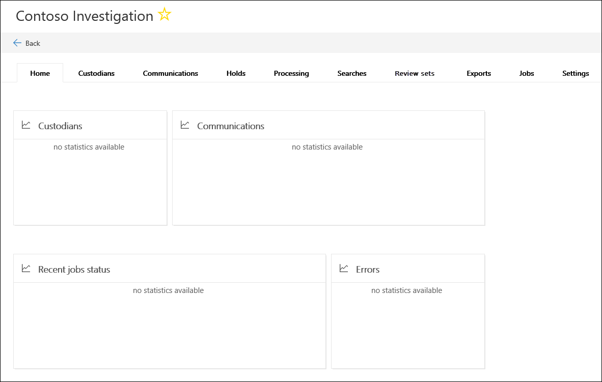

# Criar um novo caso na descoberta eletrônica avançadaCreate a new case in Advanced eDiscovery  

1. Acesse [https://protection.office.com](https://protection.office.com).Go to [https://protection.office.com](https://protection.office.com).
    
2. Entre no Office 365 usando a sua conta corporativa ou de estudante.Sign in to Office 365 using your work or school account.
    
3. No centro de conformidade & segurança, clique em **descoberta eletrônica avançada > descoberta eletrônica avançada**.In the Security & Compliance Center, click **eDiscovery > Advanced eDiscovery**.
 
4. Na página **descoberta eletrônica avançada** , clique em **criar uma ocorrência**.On the **Advanced eDiscovery** page, click **Create a case**.
    
5. Na página novo submenu de **ocorrência de descoberta eletrônica** , dê um nome (obrigatório) e digite um número de caso e descrição opcionais.On the **New eDiscovery case** flyout page, give the case a name (required), and then type an optional case number and description. Observe que o nome do caso deve ser exclusivo em sua organização.Note that the case name must be unique in your organization.

6. Em **você deseja definir configurações adicionais depois de criar este caso?**, siga um destes procedimentos:Under **Do you want to configure additional settings after creating this case?**, do one of the following:

    - Clique em **Sim** para criar o caso e exiba a página de **configurações** no novo caso.Click **Yes** to create the case, and display the **Settings** page in the new case. Isso permite que você adicione membros à ocorrência.This allows you to add members to the case.
    
    - Clique em **não** para apenas criar o caso e exibi-lo na lista de casos na página **descoberta eletrônica avançada** .Click **No** to just create the case and display it in the list of cases on the **Advanced eDiscovery** page. Se você escolher essa opção, será adicionado como o único membro do caso e as configurações padrão de pesquisa e análise serão usadas.If you choose this option, you will be added as the only member of the case and the default search and analytics settings will be used. Você pode adicionar membros ou alterar as configurações a qualquer momento após a criação do caso.You can add members or change settings any time after the case is created.

7. Clique em **salvar** para criar o caso.Click **Save** to create the case.

    O novo caso é exibido na lista de casos na página **descoberta eletrônica avançada** .The new case is displayed in the list of cases on the **Advanced eDiscovery** page. 

8. Para abrir uma ocorrência, clique no nome da ocorrência.To open a case, click the name of the case. 

    A guia **página inicial** do caso é exibida.The **Home** tab for the case is displayed. Por exemplo, aqui está um novo caso chamado *investigação da Contoso*.For example, here's a new case named *Contoso Investigation*.

    
