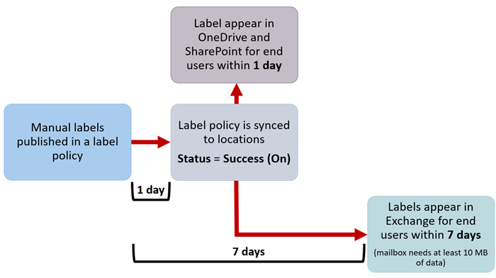

# <a name="create-publish-and-auto-apply-retention-labels"></a><span data-ttu-id="06f2f-103">Criar, publicar ou aplicar automaticamente rótulos de retenção</span><span class="sxs-lookup"><span data-stu-id="06f2f-103">Create, publish, and auto-apply retention labels</span></span>

><span data-ttu-id="06f2f-104">*[Diretrizes de licenciamento do Microsoft 365 para segurança e conformidade](https://aka.ms/ComplianceSD).*</span><span class="sxs-lookup"><span data-stu-id="06f2f-104">*[Microsoft 365 licensing guidance for security & compliance](https://aka.ms/ComplianceSD).*</span></span>

<span data-ttu-id="06f2f-105">Use as informações a seguir para ajudá-lo a criar [rótulos de retenção](labels.md) e, em seguida, aplicá-los automaticamente a documentos e emails, ou publicá-los para que os usuários possam aplicá-los manualmente.</span><span class="sxs-lookup"><span data-stu-id="06f2f-105">Use the following information to help you create [retention labels](labels.md), and then automatically apply them to documents and emails, or publish them so that users can manually apply them.</span></span>

<span data-ttu-id="06f2f-106">Os rótulos de retenção ajudam a reter o que você precisa e excluir o que não é necessário.</span><span class="sxs-lookup"><span data-stu-id="06f2f-106">Retention labels help you retain what you need and delete what you don't.</span></span> <span data-ttu-id="06f2f-107">Eles também são usados para declarar um item como um registro como parte de uma solução de [gerenciamento de registros](records-management.md) para seus dados do Microsoft 365.</span><span class="sxs-lookup"><span data-stu-id="06f2f-107">They are also used to declare an item as a record as part of a [records management](records-management.md) solution for your Microsoft 365 data.</span></span>

<span data-ttu-id="06f2f-108">Onde você cria e configura seus rótulos de retenção depende se você está usando o gerenciamento de registros ou não.</span><span class="sxs-lookup"><span data-stu-id="06f2f-108">Where you create and configure your retention labels depend on whether you're using records management or not.</span></span> <span data-ttu-id="06f2f-109">São fornecidas instruções para ambos os cenários.</span><span class="sxs-lookup"><span data-stu-id="06f2f-109">Instructions are provided for both scenarios.</span></span>

## <a name="before-you-begin"></a><span data-ttu-id="06f2f-110">Antes de começar</span><span class="sxs-lookup"><span data-stu-id="06f2f-110">Before you begin</span></span>

<span data-ttu-id="06f2f-111">Os membros da sua equipe de conformidade que criarão rótulos de retenção precisam de permissões para o Centro de Conformidade e Segurança do &amp;.</span><span class="sxs-lookup"><span data-stu-id="06f2f-111">Members of your compliance team who will create retention labels need permissions to the Security &amp; Compliance Center.</span></span> <span data-ttu-id="06f2f-112">Por padrão, o administrador do locatário tem acesso a esse local e pode conceder, aos agentes de conformidade e a outras pessoas, acesso ao Centro de Conformidade e Segurança do &amp;, sem lhes dar todas as permissões de um administrador de locatários. Para fazer isso, recomendamos que você acesse a página **Permissões** do Centro de Conformidade e Segurança do &amp;, edite o grupo de função **Administrador de Conformidade** e adicione membros a esse grupo de função.</span><span class="sxs-lookup"><span data-stu-id="06f2f-112">By default, your tenant admin has access to this location and can give compliance officers and other people access to the Security &amp; Compliance Center, without giving them all of the permissions of a tenant admin. To do this, we recommend that you go to the **Permissions** page of the Security &amp; Compliance Center, edit the **Compliance Administrator** role group, and add members to that role group.</span></span> 
  
<span data-ttu-id="06f2f-113">Para saber mais, consulte [Dar aos usuários acesso ao &amp;Centro de Conformidade](../security/office-365-security/grant-access-to-the-security-and-compliance-center.md) e Segurança do Office 365.</span><span class="sxs-lookup"><span data-stu-id="06f2f-113">For more information, see [Give users access to the Office 365 Security &amp; Compliance Center](../security/office-365-security/grant-access-to-the-security-and-compliance-center.md).</span></span>
  
<span data-ttu-id="06f2f-p104">Essas permissões só serão necessárias para criar e aplicar rótulos de retenção. A imposição da política não exige acesso ao conteúdo.</span><span class="sxs-lookup"><span data-stu-id="06f2f-p104">These permissions are required only to create and apply retention labels and a label policy. Policy enforcement does not require access to the content.</span></span>

## <a name="create-and-configure-retention-labels"></a><span data-ttu-id="06f2f-116">Criar e configurar rótulos de retenção</span><span class="sxs-lookup"><span data-stu-id="06f2f-116">Create and configure retention labels</span></span>

1. <span data-ttu-id="06f2f-117">No [Centro de Conformidade do Microsoft 365 ](https://compliance.microsoft.com/), navegue até um dos seguintes locais:</span><span class="sxs-lookup"><span data-stu-id="06f2f-117">In the [Microsoft 365 compliance center](https://compliance.microsoft.com/), navigate to one of the following locations:</span></span>
    
    - <span data-ttu-id="06f2f-118">Se você estiver usando o gerenciamento de registros:</span><span class="sxs-lookup"><span data-stu-id="06f2f-118">If you are using records management:</span></span>
        - <span data-ttu-id="06f2f-119">**Soluções** > **Gerenciamento de Registros** >  guia **Plano de Arquivos** > **+ Criar um Rótulo** > **Rótulo de Retenção**</span><span class="sxs-lookup"><span data-stu-id="06f2f-119">**Solutions** > **Records management** > **File plan** tab > **+ Create a label** > **Retention label**</span></span>
        
    - <span data-ttu-id="06f2f-120">Se você não estiver usando o gerenciamento de registros:</span><span class="sxs-lookup"><span data-stu-id="06f2f-120">If you are not using records management:</span></span>
       - <span data-ttu-id="06f2f-121">**Soluções** > **Governança de Informações** >  guia **Rótulos** > + **Criar um Rótulo**</span><span class="sxs-lookup"><span data-stu-id="06f2f-121">**Solutions** > **Information governance** > **Labels** tab > + **Create a label**</span></span>
    
    <span data-ttu-id="06f2f-122">Não vê a opção imediatamente?</span><span class="sxs-lookup"><span data-stu-id="06f2f-122">Don't immediately see your option?</span></span> <span data-ttu-id="06f2f-123">Primeiro, selecione **Mostrar Tudo**.</span><span class="sxs-lookup"><span data-stu-id="06f2f-123">First select **Show all**.</span></span> 

2. <span data-ttu-id="06f2f-124">Siga as instruções do assistente.</span><span class="sxs-lookup"><span data-stu-id="06f2f-124">Follow the prompts in the wizard.</span></span> <span data-ttu-id="06f2f-125">Se você estiver usando o gerenciamento de registros:</span><span class="sxs-lookup"><span data-stu-id="06f2f-125">If you are using records management:</span></span>
    
    - <span data-ttu-id="06f2f-126">Para saber mais sobre os descritores de plano de arquivo, confira [Visão geral do gerenciador de planos de arquivo](file-plan-manager.md)</span><span class="sxs-lookup"><span data-stu-id="06f2f-126">For information about the file plan descriptors, see [Overview of file plan manager](file-plan-manager.md)</span></span>
    
    - <span data-ttu-id="06f2f-127">Para usar o rótulo de retenção para declarar conteúdo como um registro, ative a caixa de seleção **Usar rótulo para classificar o conteúdo como um "Registro"**.</span><span class="sxs-lookup"><span data-stu-id="06f2f-127">To use the retention label to declare content as a record, enable the checkbox **Use label to classify content as a "Record"**.</span></span>

3. <span data-ttu-id="06f2f-128">Repita essas etapas para criar mais rótulos.</span><span class="sxs-lookup"><span data-stu-id="06f2f-128">Repeat these steps to create more labels.</span></span>

<span data-ttu-id="06f2f-129">Para editar um rótulo existente, selecione-o e depois selecione **Editar rótulo**.</span><span class="sxs-lookup"><span data-stu-id="06f2f-129">To edit an existing label, select it, and then select **Edit label**.</span></span> <span data-ttu-id="06f2f-130">Isso inicia o mesmo assistente, que permite alterar as descrições e configurações do rótulo na etapa 2.</span><span class="sxs-lookup"><span data-stu-id="06f2f-130">This starts the same wizard, which lets you change the label descriptions and settings in step 2.</span></span>

## <a name="publish-retention-labels-by-creating-a-retention-label-policy"></a><span data-ttu-id="06f2f-131">Publicar rótulos de retenção criando uma política de rótulo de retenção</span><span class="sxs-lookup"><span data-stu-id="06f2f-131">Publish retention labels by creating a retention label policy</span></span>

<span data-ttu-id="06f2f-132">Publique seus rótulos de retenção, para que possam ser aplicados manualmente pelos usuários.</span><span class="sxs-lookup"><span data-stu-id="06f2f-132">Publish retention labels so that they can be manually applied by users.</span></span>

1. <span data-ttu-id="06f2f-133">No [Centro de Conformidade do Microsoft 365 ](https://compliance.microsoft.com/), navegue até um dos seguintes locais:</span><span class="sxs-lookup"><span data-stu-id="06f2f-133">In the [Microsoft 365 compliance center](https://compliance.microsoft.com/), navigate to one of the following locations:</span></span>
    
    - <span data-ttu-id="06f2f-134">Se você estiver usando o gerenciamento de registros:</span><span class="sxs-lookup"><span data-stu-id="06f2f-134">If you are using records management:</span></span>
        - <span data-ttu-id="06f2f-135">**Soluções** > **Gerenciamento de Registros** > > guia **Políticas de Rótulo** > **Publicar Rótulos**</span><span class="sxs-lookup"><span data-stu-id="06f2f-135">**Solutions** > **Records management** > > **Label policies** tab > **Publish labels**</span></span>
    
    - <span data-ttu-id="06f2f-136">Se você não estiver usando o gerenciamento de registros:</span><span class="sxs-lookup"><span data-stu-id="06f2f-136">If you are not using records management:</span></span>
        - <span data-ttu-id="06f2f-137">**Soluções** > **Governança de Informações** >  guia **Políticas de Rótulo** > **Publicar Rótulos**</span><span class="sxs-lookup"><span data-stu-id="06f2f-137">**Solutions** > **Information governance** > **Label policies** tab > **Publish labels**</span></span>
    
    <span data-ttu-id="06f2f-138">Não vê a opção imediatamente?</span><span class="sxs-lookup"><span data-stu-id="06f2f-138">Don't immediately see your option?</span></span> <span data-ttu-id="06f2f-139">Primeiro, selecione **Mostrar Tudo**.</span><span class="sxs-lookup"><span data-stu-id="06f2f-139">First select **Show all**.</span></span> 

2. <span data-ttu-id="06f2f-140">Siga as instruções do assistente.</span><span class="sxs-lookup"><span data-stu-id="06f2f-140">Follow the prompts in the wizard.</span></span>
    
    <span data-ttu-id="06f2f-141">Para obter informações sobre como configurar os locais, confira a seção [Locais e rótulos de retenção](#retention-labels-and-locations) nesta página.</span><span class="sxs-lookup"><span data-stu-id="06f2f-141">For information about configuring the locations, see the [Retention labels and locations](#retention-labels-and-locations) section on this page.</span></span> 

## <a name="auto-apply-a-retention-label"></a><span data-ttu-id="06f2f-142">Aplicação automática de um rótulo de retenção</span><span class="sxs-lookup"><span data-stu-id="06f2f-142">Auto-apply a retention label</span></span>

<span data-ttu-id="06f2f-143">Aplique automaticamente um rótulo de retenção, com base nas condições que você especificar.</span><span class="sxs-lookup"><span data-stu-id="06f2f-143">Auto-apply a retention label, based on the conditions that you specify.</span></span>

1. <span data-ttu-id="06f2f-144">No [Centro de Conformidade do Microsoft 365 ](https://compliance.microsoft.com/), navegue até um dos seguintes locais:</span><span class="sxs-lookup"><span data-stu-id="06f2f-144">In the [Microsoft 365 compliance center](https://compliance.microsoft.com/), navigate to one of the following locations:</span></span>
    
    - <span data-ttu-id="06f2f-145">Se você estiver usando o gerenciamento de registros: **Governança de Informações**:</span><span class="sxs-lookup"><span data-stu-id="06f2f-145">If you are using records management: **Information governance**:</span></span>
        - <span data-ttu-id="06f2f-146">**Soluções** > **Gerenciamento de Registros** >  guia **Políticas de Rótulo** > **Aplicar rótulo automaticamente**</span><span class="sxs-lookup"><span data-stu-id="06f2f-146">**Solutions** > **Records management** > **Label policies** tab > **Auto-apply label**</span></span>
    
    - <span data-ttu-id="06f2f-147">Se você não estiver usando o gerenciamento de registros:</span><span class="sxs-lookup"><span data-stu-id="06f2f-147">If you are not using records management:</span></span>
        - <span data-ttu-id="06f2f-148">**Soluções** > **Governança de Informações** >  guia **Políticas de Rótulo** > **Aplicar rótulo automaticamente**</span><span class="sxs-lookup"><span data-stu-id="06f2f-148">**Solutions** > **Information governance** > **Label policies** tab > **Auto-apply label**</span></span>
    
    <span data-ttu-id="06f2f-149">Não vê a opção imediatamente?</span><span class="sxs-lookup"><span data-stu-id="06f2f-149">Don't immediately see your option?</span></span> <span data-ttu-id="06f2f-150">Primeiro, selecione **Mostrar Tudo**.</span><span class="sxs-lookup"><span data-stu-id="06f2f-150">First select **Show all**.</span></span> 

2. <span data-ttu-id="06f2f-151">Siga as instruções do assistente.</span><span class="sxs-lookup"><span data-stu-id="06f2f-151">Follow the prompts in the wizard.</span></span>
    
    <span data-ttu-id="06f2f-152">Para saber mais sobre como configurar condições que aplicam automaticamente o rótulo de retenção, confira o [Configurar condições para a aplicação automática de rótulos de retenção](#configuring-conditions-for-auto-apply-retention-labels) nesta página.</span><span class="sxs-lookup"><span data-stu-id="06f2f-152">For information about configuring the conditions that automatically apply the retention label, see the [Configuring conditions for auto-apply retention labels](#configuring-conditions-for-auto-apply-retention-labels) section on this page.</span></span>
    
    <span data-ttu-id="06f2f-153">Para obter informações sobre como configurar os locais, confira a próxima seção desta página, [Locais e rótulos de retenção](#retention-labels-and-locations).</span><span class="sxs-lookup"><span data-stu-id="06f2f-153">For information about configuring the locations, see the next section on this page, [Retention labels and locations](#retention-labels-and-locations).</span></span>

## <a name="retention-labels-and-locations"></a><span data-ttu-id="06f2f-154">Locais e rótulos de retenção</span><span class="sxs-lookup"><span data-stu-id="06f2f-154">Retention labels and locations</span></span>

<span data-ttu-id="06f2f-155">É possível publicar tipos diferentes de rótulos de retenção em locais diferentes, dependendo do que o rótulo faz.</span><span class="sxs-lookup"><span data-stu-id="06f2f-155">Different types of retention labels can be published to different locations, depending on what the retention label does.</span></span>
  
|<span data-ttu-id="06f2f-156">**Se o rótulo de retenção for...**</span><span class="sxs-lookup"><span data-stu-id="06f2f-156">**If the retention label is…**</span></span>|<span data-ttu-id="06f2f-157">**A política do rótulo poderá ser aplicada a...**</span><span class="sxs-lookup"><span data-stu-id="06f2f-157">**Then the label policy can be applied to…**</span></span>|
|:-----|:-----|
|<span data-ttu-id="06f2f-158">Publicado para usuários finais</span><span class="sxs-lookup"><span data-stu-id="06f2f-158">Published to end users</span></span>  <br/> |<span data-ttu-id="06f2f-159">Exchange, SharePoint, OneDrive, grupos do Office 365</span><span class="sxs-lookup"><span data-stu-id="06f2f-159">Exchange, SharePoint, OneDrive, Office 365 groups</span></span>  <br/> |
|<span data-ttu-id="06f2f-160">Aplicado automaticamente com base em tipos de informações confidenciais</span><span class="sxs-lookup"><span data-stu-id="06f2f-160">Auto-applied based on sensitive information types</span></span>  <br/> |<span data-ttu-id="06f2f-161">Exchange (somente para todas as caixas de correio), SharePoint, OneDrive</span><span class="sxs-lookup"><span data-stu-id="06f2f-161">Exchange (all mailboxes only), SharePoint, OneDrive</span></span>  <br/> |
|<span data-ttu-id="06f2f-162">Aplicado automaticamente com base em uma consulta</span><span class="sxs-lookup"><span data-stu-id="06f2f-162">Auto-applied based on a query</span></span>  <br/> |<span data-ttu-id="06f2f-163">Exchange, SharePoint, OneDrive, grupos do Office 365</span><span class="sxs-lookup"><span data-stu-id="06f2f-163">Exchange, SharePoint, OneDrive, Office 365 groups</span></span>  <br/> |
   
<span data-ttu-id="06f2f-164">No Exchange, os rótulos de aplicação automática (para consultas e tipos de informações confidenciais) se aplicam somente às mensagens enviadas recentemente (dados em trânsito), não a todos os itens atualmente na caixa de correio (dados em repouso).</span><span class="sxs-lookup"><span data-stu-id="06f2f-164">In Exchange, auto-apply retention labels (for both queries and sensitive information types) are applied only to messages newly sent (data in transit), not to all items currently in the mailbox (data at rest).</span></span> <span data-ttu-id="06f2f-165">Além disso, os rótulos de retenção de aplicação automática para tipos de informações confidenciais podem ser aplicados somente a todas as caixas de correio; você não pode selecionar as caixas de correio específicas.</span><span class="sxs-lookup"><span data-stu-id="06f2f-165">Also, auto-apply retention labels for sensitive information types can apply only to all mailboxes; you can't select the specific mailboxes.</span></span>
  
<span data-ttu-id="06f2f-166">As pastas públicas do Exchange e do Skype não oferecem suporte a rótulos de retenção.</span><span class="sxs-lookup"><span data-stu-id="06f2f-166">Exchange public folders and Skype do not support retention labels.</span></span>


## <a name="configuring-conditions-for-auto-apply-retention-labels"></a><span data-ttu-id="06f2f-167">Configurar condições para a aplicação automática de rótulos de retenção</span><span class="sxs-lookup"><span data-stu-id="06f2f-167">Configuring conditions for auto-apply retention labels</span></span>

<span data-ttu-id="06f2f-168">Você pode aplicar os rótulos de retenção automaticamente ao conteúdo quando esse conteúdo apresentar:</span><span class="sxs-lookup"><span data-stu-id="06f2f-168">You can apply retention labels to content automatically when that content contains:</span></span>
  
- [<span data-ttu-id="06f2f-169">Tipos específicos de informações confidenciais</span><span class="sxs-lookup"><span data-stu-id="06f2f-169">Specific types of sensitive information</span></span>](#auto-apply-labels-to-content-with-specific-types-of-sensitive-information)
    
- [<span data-ttu-id="06f2f-170">Palavras-chave específicas que correspondem a uma consulta criada por você</span><span class="sxs-lookup"><span data-stu-id="06f2f-170">Specific keywords that match a query you create</span></span>](#auto-apply-labels-to-content-with-keywords-or-searchable-properties)

- [<span data-ttu-id="06f2f-171">Uma correspondência de classificadores treináveis</span><span class="sxs-lookup"><span data-stu-id="06f2f-171">A match for trainable classifiers</span></span>](#auto-apply-labels-to-content-by-using-trainable-classifiers)
    


<span data-ttu-id="06f2f-173">Pode levar até sete dias para que os rótulos de retenção sejam aplicados automaticamente a todo o conteúdo que corresponde às condições que você configurou.</span><span class="sxs-lookup"><span data-stu-id="06f2f-173">It can take up to seven days for auto-apply retention labels to be applied to all content that matches the conditions you've configured.</span></span>

### <a name="auto-apply-labels-to-content-with-specific-types-of-sensitive-information"></a><span data-ttu-id="06f2f-174">Aplicar automaticamente rótulos a conteúdo com tipos específicos de informações confidenciais</span><span class="sxs-lookup"><span data-stu-id="06f2f-174">Auto-apply labels to content with specific types of sensitive information</span></span>

<span data-ttu-id="06f2f-175">Ao criar rótulos de retenção de aplicação automática para informações confidenciais, você vê a mesma lista de modelos de política que quando cria uma política de prevenção contra perda de dados (DLP).</span><span class="sxs-lookup"><span data-stu-id="06f2f-175">When you create auto-apply retention labels for sensitive information, you see the same list of policy templates as when you create a data loss prevention (DLP) policy.</span></span> <span data-ttu-id="06f2f-176">Cada modelo de política é pré-configurado para procurar tipos específicos de informações confidenciais.</span><span class="sxs-lookup"><span data-stu-id="06f2f-176">Each policy template is preconfigured to look for specific types of sensitive information.</span></span> <span data-ttu-id="06f2f-177">Por exemplo, o modelo mostrado aqui procura os números do ITIN (Número de Identificação de Contribuinte Individual) dos EUA, SSN (CPF) e passaporte.</span><span class="sxs-lookup"><span data-stu-id="06f2f-177">For example, the template shown here looks for U.S. ITIN, SSN, and passport numbers.</span></span> <span data-ttu-id="06f2f-178">Para saber mais sobre DLP, confira [Visão geral das políticas de prevenção contra perda de dados](data-loss-prevention-policies.md).</span><span class="sxs-lookup"><span data-stu-id="06f2f-178">To learn more about DLP, see [Overview of data loss prevention policies](data-loss-prevention-policies.md).</span></span>
  

  
<span data-ttu-id="06f2f-p112">Depois de selecionar um modelo de política, você pode adicionar ou remover quaisquer tipos de informações confidenciais, e pode alterar a contagem de instâncias e a precisão de correspondência. No exemplo mostrado aqui, um rótulo de retenção será aplicado automaticamente apenas quando:</span><span class="sxs-lookup"><span data-stu-id="06f2f-p112">After you select a policy template, you can add or remove any types of sensitive information, and you can change the instance count and match accuracy. In the example shown here, a retention label will be auto-applied only when:</span></span>
  
- <span data-ttu-id="06f2f-p113">O conteúdo tiver entre uma e nove instâncias de qualquer um destes três tipos de informações confidenciais. Você pode excluir o valor **max** para que mude para **any**.</span><span class="sxs-lookup"><span data-stu-id="06f2f-p113">The content contains between 1 and 9 instances of any of these three sensitive information types. You can delete the **max** value so that it changes to **any**.</span></span>
    
- <span data-ttu-id="06f2f-p114">O tipo de informação confidencial detectado tiver uma precisão de correspondência (ou nível de confiança) de pelo menos 75. Muitos tipos de informações confidenciais são definidos com vários padrões, em que um padrão de precisão de correspondência superior exige mais evidências para ser encontrado (como palavras-chave, datas ou endereços), enquanto um padrão de precisão de correspondência inferior exige menos evidências. Resumindo, quanto menor a precisão de correspondência **min**, mais fácil será para o conteúdo atender à condição.</span><span class="sxs-lookup"><span data-stu-id="06f2f-p114">The type of sensitive information that's detected has a match accuracy (or confidence level) of at least 75. Many sensitive information types are defined with multiple patterns, where a pattern with a higher match accuracy requires more evidence to be found (such as keywords, dates, or addresses), while a pattern with a lower match accuracy requires less evidence. Simply put, the lower the **min** match accuracy, the easier it is for content to match the condition.</span></span> 
    
<span data-ttu-id="06f2f-187">Para saber mais sobre essas opções, confira [Como ajustar as regras para facilitar ou dificultar a correspondência](data-loss-prevention-policies.md#tuning-rules-to-make-them-easier-or-harder-to-match).</span><span class="sxs-lookup"><span data-stu-id="06f2f-187">For more information on these options, see [Tuning rules to make them easier or harder to match](data-loss-prevention-policies.md#tuning-rules-to-make-them-easier-or-harder-to-match).</span></span>
    

  
### <a name="auto-apply-labels-to-content-with-keywords-or-searchable-properties"></a><span data-ttu-id="06f2f-189">Aplicar rótulos automaticamente a conteúdos com palavras-chave ou propriedades pesquisáveis</span><span class="sxs-lookup"><span data-stu-id="06f2f-189">Auto-apply labels to content with keywords or searchable properties</span></span>

<span data-ttu-id="06f2f-p115">Você pode aplicar automaticamente os rótulos ao conteúdo que atenda a certas condições. As condições disponíveis agora dão suporte à aplicação de um rótulo a conteúdos que incluem palavras ou frases específicas, ou valores de propriedades pesquisáveis. Você pode refinar a consulta usando os operadores de pesquisa AND, OR e NOT.</span><span class="sxs-lookup"><span data-stu-id="06f2f-p115">You can auto-apply labels to content that satisfies certain conditions. The conditions now available support applying a label to content that contains specific words, phrases, or values of searchable properties. You can refine your query by using search operators like AND, OR, and NOT.</span></span>

<span data-ttu-id="06f2f-193">Para saber mais sobre sintaxe de consulta, confira:</span><span class="sxs-lookup"><span data-stu-id="06f2f-193">For more information on query syntax, see:</span></span>

- [<span data-ttu-id="06f2f-194">Referência de sintaxe da Linguagem de Consulta de Palavra-chave (KQL)</span><span class="sxs-lookup"><span data-stu-id="06f2f-194">Keyword Query Language (KQL) syntax reference</span></span>](https://docs.microsoft.com/sharepoint/dev/general-development/keyword-query-language-kql-syntax-reference)

<span data-ttu-id="06f2f-p116">Rótulos baseados em consultas usam o índice de pesquisa para identificar conteúdos. Para saber mais sobre propriedades pesquisáveis válidas, confira:</span><span class="sxs-lookup"><span data-stu-id="06f2f-p116">Query-based labels use the search index to identify content. For more information on valid searchable properties, see:</span></span>

- [<span data-ttu-id="06f2f-197">Consultas de palavra-chave e condições de pesquisa para Pesquisa de Conteúdo</span><span class="sxs-lookup"><span data-stu-id="06f2f-197">Keyword queries and search conditions for Content Search</span></span>](keyword-queries-and-search-conditions.md)
- [<span data-ttu-id="06f2f-198">Visão geral de propriedades rastreadas e gerenciadas no SharePoint Server</span><span class="sxs-lookup"><span data-stu-id="06f2f-198">Overview of crawled and managed properties in SharePoint Server</span></span>](https://docs.microsoft.com/SharePoint/technical-reference/crawled-and-managed-properties-overview)

<span data-ttu-id="06f2f-199">Consultas de exemplos:</span><span class="sxs-lookup"><span data-stu-id="06f2f-199">Examples queries:</span></span>

- <span data-ttu-id="06f2f-200">Exchange</span><span class="sxs-lookup"><span data-stu-id="06f2f-200">Exchange</span></span>
    - <span data-ttu-id="06f2f-201">assunto:"Finanças trimestrais"</span><span class="sxs-lookup"><span data-stu-id="06f2f-201">subject:"Quarterly Financials"</span></span>
    - <span data-ttu-id="06f2f-202">destinatários:garthf</span><span class="sxs-lookup"><span data-stu-id="06f2f-202">recipients:garthf</span></span><!--nolink--><span data-ttu-id="06f2f-203">@contoso.com</span><span class="sxs-lookup"><span data-stu-id="06f2f-203">@contoso.com</span></span>
- <span data-ttu-id="06f2f-204">SharePoint e OneDrive</span><span class="sxs-lookup"><span data-stu-id="06f2f-204">SharePoint and OneDrive</span></span>
    - <span data-ttu-id="06f2f-205">contenttype:contract</span><span class="sxs-lookup"><span data-stu-id="06f2f-205">contenttype:contract</span></span>
    - <span data-ttu-id="06f2f-206">site:https</span><span class="sxs-lookup"><span data-stu-id="06f2f-206">site:https</span></span><!--nolink--><span data-ttu-id="06f2f-207">://contoso.sharepoint.com/sites/teams/procurement E contenttype:contract</span><span class="sxs-lookup"><span data-stu-id="06f2f-207">://contoso.sharepoint.com/sites/teams/procurement AND contenttype:contract</span></span>


### <a name="auto-apply-labels-to-content-by-using-trainable-classifiers"></a><span data-ttu-id="06f2f-209">Aplicar rótulos automaticamente ao conteúdo usando classificadores treináveis</span><span class="sxs-lookup"><span data-stu-id="06f2f-209">Auto-apply labels to content by using trainable classifiers</span></span>

<span data-ttu-id="06f2f-210">Ao escolher a opção de um classificador treinado, você pode selecionar um dos classificadores internos ou um classificador personalizado.</span><span class="sxs-lookup"><span data-stu-id="06f2f-210">When you choose the option for a trainable classifier, you can select one of the built-in classifiers, or a custom classifier.</span></span> <span data-ttu-id="06f2f-211">Os classificadores internos incluem **Currículos**, **SourceCode**, **Assédio Direcionado**, **Profanação** e **Ameaças**:</span><span class="sxs-lookup"><span data-stu-id="06f2f-211">The built-in classifiers include **Resumes**, **SourceCode**, **Targeted Harassment**, **Profanity**, and **Threat**:</span></span>


<span data-ttu-id="06f2f-213">Para aplicar um rótulo automaticamente usando essa opção, as caixas de correio e sites do SharePoint Online devem ter pelo menos 10 MB de dados.</span><span class="sxs-lookup"><span data-stu-id="06f2f-213">To automatically apply a label by using this option, SharePoint Online sites and mailboxes must have at least 10 MB of data.</span></span>

<span data-ttu-id="06f2f-214">Para obter mais informações sobre os classificadores treináveis, confira [Introdução aos classificadores treináveis (visualização)](classifier-getting-started-with.md).</span><span class="sxs-lookup"><span data-stu-id="06f2f-214">For more information about trainable classifiers, see [Getting started with trainable classifiers (preview)](classifier-getting-started-with.md).</span></span>

<span data-ttu-id="06f2f-215">Para um exemplo de configuração, consulte [Como preparar e usar um classificador interno](classifier-using-a-ready-to-use-classifier.md#how-to-verify-that-a-built-in-classifier-will-meet-your-needs).</span><span class="sxs-lookup"><span data-stu-id="06f2f-215">For an example configuration, see [How to prepare for and use a built-in classifier](classifier-using-a-ready-to-use-classifier.md#how-to-verify-that-a-built-in-classifier-will-meet-your-needs).</span></span>

## <a name="how-long-it-takes-for-retention-labels-to-take-effect"></a><span data-ttu-id="06f2f-216">Quanto tempo demora para os rótulos de retenção entrarem em vigor</span><span class="sxs-lookup"><span data-stu-id="06f2f-216">How long it takes for retention labels to take effect</span></span>

<span data-ttu-id="06f2f-217">Quando você publica ou aplica rótulos de retenção automaticamente, eles não entram em vigor imediatamente:</span><span class="sxs-lookup"><span data-stu-id="06f2f-217">When you publish or auto-apply retention labels, they don't take effect immediately:</span></span>
  
1. <span data-ttu-id="06f2f-218">Primeiro, a política de rótulos precisa ser sincronizada desde o centro de administração até os locais na política.</span><span class="sxs-lookup"><span data-stu-id="06f2f-218">First the label policy needs to be synced from the admin center to the locations in the policy.</span></span>
    
2. <span data-ttu-id="06f2f-219">Em seguida, o local pode precisar de tempo para disponibilizar rótulos de retenção publicados para os usuários finais ou para aplicar rótulos automaticamente ao conteúdo.</span><span class="sxs-lookup"><span data-stu-id="06f2f-219">Then the location might require time to make published retention labels available to end users or time to auto-apply labels to content.</span></span> <span data-ttu-id="06f2f-220">Quanto tempo isso leva depende do local e do tipo de rótulo de retenção.</span><span class="sxs-lookup"><span data-stu-id="06f2f-220">How long this takes depends on the location and type of retention label.</span></span>
    
### <a name="published-retention-labels"></a><span data-ttu-id="06f2f-221">Rótulos de retenção publicados</span><span class="sxs-lookup"><span data-stu-id="06f2f-221">Published retention labels</span></span>

<span data-ttu-id="06f2f-p119">Se você publicar rótulos de retenção no SharePoint ou no OneDrive, talvez demore um dia para que esses rótulos de retenção apareçam para os usuários finais. Além disso, se você publicar os rótulos de retenção no Exchange, talvez demore 7 dias para que eles apareçam para os usuários finais, e a caixa de correio deles deve conter pelo menos 10 MB de dados.</span><span class="sxs-lookup"><span data-stu-id="06f2f-p119">If you publish retention labels to SharePoint or OneDrive, it can take one day for those retention labels to appear for end users. In addition, if you publish retention labels to Exchange, it can take 7 days for those retention labels to appear for end users, and the mailbox needs to contain at least 10 MB of data.</span></span>
  

  
### <a name="auto-apply-retention-labels"></a><span data-ttu-id="06f2f-225">Aplicação automática de rótulos de retenção</span><span class="sxs-lookup"><span data-stu-id="06f2f-225">Auto-apply retention labels</span></span>

<span data-ttu-id="06f2f-226">Se você aplicar automaticamente rótulos de retenção a conteúdos que se encaixem em condições específicas, poderá levar sete dias para que os rótulos de retenção sejam aplicados a todo o conteúdo existente que se encaixe nas condições.</span><span class="sxs-lookup"><span data-stu-id="06f2f-226">If you auto-apply retention labels to content matching specific conditions, it can take seven days for the retention labels to be applied to all existing content that matches the conditions.</span></span>
  

  
### <a name="how-to-check-on-the-status-of-retention-labels-published-to-exchange"></a><span data-ttu-id="06f2f-228">Como verificar o status dos rótulos de retenção publicados no Exchange</span><span class="sxs-lookup"><span data-stu-id="06f2f-228">How to check on the status of retention labels published to Exchange</span></span>

<span data-ttu-id="06f2f-p120">No Exchange Online, os rótulos de retenção são disponibilizados para os usuários finais por um processo executado a cada sete dias. Usando o Powershell, é possível ver quando esse processo foi executado pela última vez e, assim, determinar quando ele será executado novamente.</span><span class="sxs-lookup"><span data-stu-id="06f2f-p120">In Exchange Online, retention labels are made available to end users by a process that runs every seven days. By using Powershell, you can see when this process last ran and thus determine when it will run again.</span></span>
  
1. <span data-ttu-id="06f2f-231">[Conectar-se ao Exchange Online PowerShell](https://go.microsoft.com/fwlink/?linkid=799773).</span><span class="sxs-lookup"><span data-stu-id="06f2f-231">[Connect to Exchange Online PowerShell](https://go.microsoft.com/fwlink/?linkid=799773).</span></span>
    
2. <span data-ttu-id="06f2f-232">Execute estes comandos.</span><span class="sxs-lookup"><span data-stu-id="06f2f-232">Run these commands.</span></span>
    
   ```powershell
   $logProps = Export-MailboxDiagnosticLogs <user> -ExtendedProperties
   ```

   ```powershell
   $xmlprops = [xml]($logProps.MailboxLog)
   ```

   ```powershell
   $xmlprops.Properties.MailboxTable.Property | ? {$_.Name -like "ELC*"}
   ```

<span data-ttu-id="06f2f-233">Nos resultados, a propriedade `ELCLastSuccessTimeStamp` (UTC) mostra quando o sistema processou sua caixa de correio pela última vez.</span><span class="sxs-lookup"><span data-stu-id="06f2f-233">In the results, the `ELCLastSuccessTimeStamp` (UTC) property shows when the system last processed your mailbox.</span></span> <span data-ttu-id="06f2f-234">Se isso não tiver acontecido desde a hora em que você criou a política, os rótulos não serão exibidos.</span><span class="sxs-lookup"><span data-stu-id="06f2f-234">If it has not happened since the time you created the policy, the labels are not going to appear.</span></span> <span data-ttu-id="06f2f-235">Para forçar o processamento, execute o  `Start-ManagedFolderAssistant -Identity <user>`.</span><span class="sxs-lookup"><span data-stu-id="06f2f-235">To force processing, run  `Start-ManagedFolderAssistant -Identity <user>`.</span></span>
    
<span data-ttu-id="06f2f-236">Se os rótulos não estiverem aparecendo no Outlook na Web, e você achar que deveriam aparecer, limpe o cache do navegador (CTRL + F5).</span><span class="sxs-lookup"><span data-stu-id="06f2f-236">If labels aren't appearing in Outlook on the web and you think they should be, make sure to clear the cache in your browser (CTRL+F5).</span></span>
    

## <a name="updating-retention-labels-and-their-policies"></a><span data-ttu-id="06f2f-237">Atualizar rótulos de retenção e suas políticas</span><span class="sxs-lookup"><span data-stu-id="06f2f-237">Updating retention labels and their policies</span></span>

<span data-ttu-id="06f2f-238">Se você editar um rótulo de retenção, política de rótulo de retenção ou política de aplicação automática e o rótulo de retenção já estiver aplicado ao conteúdo, as configurações atualizadas serão aplicadas automaticamente a esse conteúdo, além do conteúdo recentemente rotulado.</span><span class="sxs-lookup"><span data-stu-id="06f2f-238">If you edit a retention label, retention label policy, or auto-apply policy and the retention label is already applied to content, your updated settings will automatically be applied to this content in addition to content that's newly labeled.</span></span>

## <a name="find-the-powershell-cmdlets-for-retention-labels"></a><span data-ttu-id="06f2f-239">Localizar os cmdlets do Windows PowerShell para rótulos de retenção</span><span class="sxs-lookup"><span data-stu-id="06f2f-239">Find the PowerShell cmdlets for retention labels</span></span>

<span data-ttu-id="06f2f-240">Para usar os cmdlets de rótulos de retenção:</span><span class="sxs-lookup"><span data-stu-id="06f2f-240">To use the retention label cmdlets:</span></span>
  
1. [<span data-ttu-id="06f2f-241">Conecte-se ao PowerShell do Centro de Conformidade e Segurança do Office 365</span><span class="sxs-lookup"><span data-stu-id="06f2f-241">Connect to the Office 365 Security & Compliance Center Powershell</span></span>](https://docs.microsoft.com/powershell/exchange/office-365-scc/connect-to-scc-powershell/connect-to-scc-powershell)
    
2. <span data-ttu-id="06f2f-242">Use esses cmdlets do Centro de Conformidade e Segurança do Office 365</span><span class="sxs-lookup"><span data-stu-id="06f2f-242">Use these Office 365 Security & Compliance Center cmdlets:</span></span>
    
    - [<span data-ttu-id="06f2f-243">Get-ComplianceTag</span><span class="sxs-lookup"><span data-stu-id="06f2f-243">Get-ComplianceTag</span></span>](https://docs.microsoft.com/powershell/module/exchange/policy-and-compliance-retention/get-compliancetag)
    
    - [<span data-ttu-id="06f2f-244">New-ComplianceTag</span><span class="sxs-lookup"><span data-stu-id="06f2f-244">New-ComplianceTag</span></span>](https://docs.microsoft.com/powershell/module/exchange/policy-and-compliance-retention/new-compliancetag)
    
    - [<span data-ttu-id="06f2f-245">Remove-ComplianceTag</span><span class="sxs-lookup"><span data-stu-id="06f2f-245">Remove-ComplianceTag</span></span>](https://docs.microsoft.com/powershell/module/exchange/policy-and-compliance-retention/remove-compliancetag)
    
    - [<span data-ttu-id="06f2f-246">Set-ComplianceTag</span><span class="sxs-lookup"><span data-stu-id="06f2f-246">Set-ComplianceTag</span></span>](https://docs.microsoft.com/powershell/module/exchange/policy-and-compliance-retention/set-compliancetag)
    
    - [<span data-ttu-id="06f2f-247">Enable-ComplianceTagStorage</span><span class="sxs-lookup"><span data-stu-id="06f2f-247">Enable-ComplianceTagStorage</span></span>](https://docs.microsoft.com/powershell/module/exchange/policy-and-compliance-retention/enable-compliancetagstorage)
    
    - [<span data-ttu-id="06f2f-248">Get-ComplianceTagStorage</span><span class="sxs-lookup"><span data-stu-id="06f2f-248">Get-ComplianceTagStorage</span></span>](https://docs.microsoft.com/powershell/module/exchange/policy-and-compliance-retention/get-compliancetagstorage)
    
    - [<span data-ttu-id="06f2f-249">Get-RetentionCompliancePolicy</span><span class="sxs-lookup"><span data-stu-id="06f2f-249">Get-RetentionCompliancePolicy</span></span>](https://docs.microsoft.com/powershell/module/exchange/policy-and-compliance-retention/get-retentioncompliancepolicy)
    
    - [<span data-ttu-id="06f2f-250">New-RetentionCompliancePolicy</span><span class="sxs-lookup"><span data-stu-id="06f2f-250">New-RetentionCompliancePolicy</span></span>](https://docs.microsoft.com/powershell/module/exchange/policy-and-compliance-retention/new-retentioncompliancepolicy)
    
    - [<span data-ttu-id="06f2f-251">Remove-RetentionCompliancePolicy</span><span class="sxs-lookup"><span data-stu-id="06f2f-251">Remove-RetentionCompliancePolicy</span></span>](https://docs.microsoft.com/powershell/module/exchange/policy-and-compliance-retention/remove-retentioncompliancepolicy)
    
    - [<span data-ttu-id="06f2f-252">Set-RetentionCompliancePolicy</span><span class="sxs-lookup"><span data-stu-id="06f2f-252">Set-RetentionCompliancePolicy</span></span>](https://docs.microsoft.com/powershell/module/exchange/policy-and-compliance-retention/set-retentioncompliancepolicy)
    
    - [<span data-ttu-id="06f2f-253">Get-RetentionComplianceRule</span><span class="sxs-lookup"><span data-stu-id="06f2f-253">Get-RetentionComplianceRule</span></span>](https://docs.microsoft.com/powershell/module/exchange/policy-and-compliance-retention/get-retentioncompliancerule)
    
    - [<span data-ttu-id="06f2f-254">New-RetentionComplianceRule</span><span class="sxs-lookup"><span data-stu-id="06f2f-254">New-RetentionComplianceRule</span></span>](https://docs.microsoft.com/powershell/module/exchange/policy-and-compliance-retention/new-retentioncompliancerule)
    
    - [<span data-ttu-id="06f2f-255">Remove-RetentionComplianceRule</span><span class="sxs-lookup"><span data-stu-id="06f2f-255">Remove-RetentionComplianceRule</span></span>](https://docs.microsoft.com/powershell/module/exchange/policy-and-compliance-retention/remove-retentioncompliancerule)
    
    - [<span data-ttu-id="06f2f-256">Set-RetentionComplianceRule</span><span class="sxs-lookup"><span data-stu-id="06f2f-256">Set-RetentionComplianceRule</span></span>](https://docs.microsoft.com/powershell/module/exchange/policy-and-compliance-retention/set-retentioncompliancerule)
