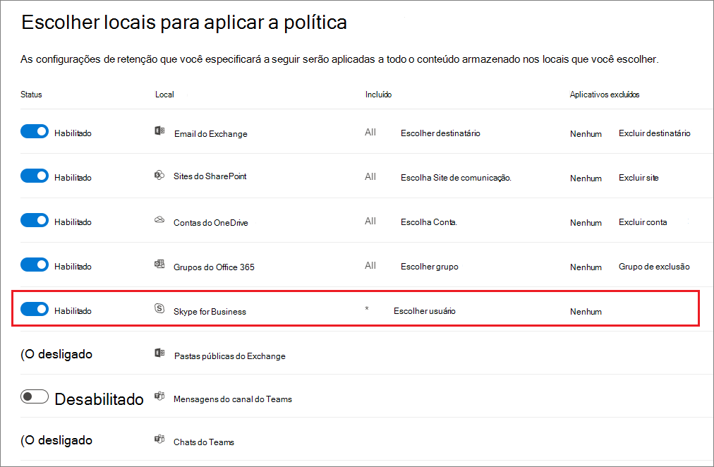
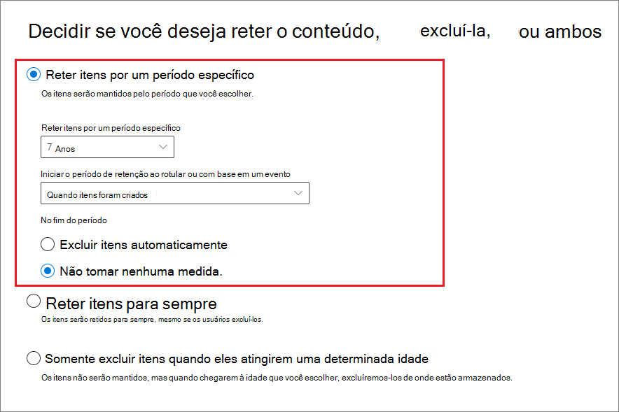

# Criar e configurar políticas de retenção

>*[Diretrizes de licenciamento do Microsoft 365 para segurança e conformidade](https://aka.ms/ComplianceSD).*

Use uma política de retenção para decidir proativamente se deseja reter o conteúdo, excluí-lo ou ambos; reter e depois excluir o conteúdo.

Uma política de retenção permite que você faça isso com muita eficiência, atribuindo as mesmas configurações de retenção para o conteúdo por local, no nível do site ou da caixa de correio. Se você não tiver certeza se deseja usar uma política de retenção ou um rótulo de retenção, consulte [Políticas e rótulos de retenção](retention.md#retention-policies-and-retention-labels).

Para saber mais sobre o funcionamento das políticas de retenção, consulte [Saiba mais sobre políticas e rótulos de retenção](retention.md).

## Antes de começar

O administrador global da sua organização tem permissões completas para criar e editar políticas de retenção. Se você não estiver entrando como um administrador global, consulte [Permissões necessárias para criar e gerenciar as políticas e rótulos de retenção](get-started-with-retention.md#permissions-required-to-create-and-manage-retention-policies-and-retention-labels).

## Criar e configurar uma política de retenção

Embora uma política de retenção possa dar suporte a vários locais, você não pode criar uma única política de retenção que inclui todos os locais suportados:

- Email do Exchange
- Site do Microsoft Office SharePoint Online
- Contas do OneDrive
- Grupos do Microsoft 365
- Skype for Business
- Pastas públicas do Exchange
- Mensagens do canal do Teams
- Chats do Teams
- Mensagens da comunidade do Yammer
- Mensagens privadas do Yammer

Se você selecionar os locais do Teams ou Yammer ao criar uma política de retenção, os outros locais serão excluídos automaticamente. Portanto, as instruções a seguir dependem se você precisa incluir os locais do Teams ou Yammer:

- [Instruções para uma política de retenção para locais do Teams](#retention-policy-for-teams-locations)
- [Instruções para uma política de retenção para locais do Yammer](#retention-policy-for-yammer-locations)
- [Instruções para uma política de retenção para locais do Teams e Yammer](#retention-policy-for-locations-other-than-teams-and-yammer)

Quando você tem mais de uma política de retenção, e quando você também usa rótulos de retenção, consulte [Princípios de retenção ou o que tem precedência?](retention.md#the-principles-of-retention-or-what-takes-precedence) para compreender o que acontece quando várias configurações de retenção se aplicam ao mesmo conteúdo.

### Política de retenção para locais do Teams

1. No [Centro de Conformidade do Microsoft 365](https://compliance.microsoft.com/), selecione **Políticas** > **Retenção**.

2. Selecione **Nova política de retenção** para iniciar o assistente Criar política de retenção, e a nomeie.

3. Para a página **Escolher locais para aplicar a política**, selecione um ou ambos os locais para o Teams: **Mensagem de canal do Teams** e **Chats do Teams**.

   Para **Mensagens de canal do Teams**, estão incluídas as mensagem de canais padrão, mas não [canais privados](https://docs.microsoft.com/microsoftteams/private-channels). No momento, não há suporte para canais privados das políticas de retenção.

   Por padrão, [todas as equipes e usuários são selecionados](#a-policy-that-applies-to-entire-locations), mas você pode refinar isso selecionando as opções de [**Escolha** e **Exclusão**](#a-policy-with-specific-inclusions-or-exclusions).

4. Para **Decidir se deseja reter o conteúdo, excluí-lo, ou ambos** página do assistente, especifique as opções de configuração para manter e excluir o conteúdo.

   Você pode criar uma política de retenção que apenas retenha o conteúdo sem excluir, retenha e exclua após um período especifico de tempo ou apenas exclua o conteúdo após um período especifico de tempo. Para saber mais, consulte[Configurações de retenção e exclusão de conteúdo](#settings-for-retaining-and-deleting-content) nesta página.

5. Conclua o assistente para salvar suas configurações.

Para mais informações sobre as políticas de retenção para o Teams, confira [Políticas de retenção no Microsoft Teams](https://docs.microsoft.com/microsoftteams/retention-policies) da documentação do Teams.

#### Políticas de retenção adicional necessárias para oferecer suporte ao Teams

O Teams é mais do que apenas mensagens de canal e chats. Se você tiver equipes criadas a partir de um grupo do Microsoft 365 (antigo Grupo do Office 365), deverá configurar uma política de retenção que inclua o grupo do Microsoft 365 usando o local **Grupos do Microsoft 365**. Essa política de retenção se aplica ao conteúdo da caixa de correio do grupo, do site e dos arquivos.

Se você tiver um sites da equipe que não está conectado a um grupo do Microsoft 365, você precisará de uma política de retenção que inclua os locais dos **sites do SharePoint** ou das **contas do OneDrive** para manter e excluir arquivos no Teams:

- Os arquivos compartilhados no chat são armazenados na conta do OneDrive do usuário que compartilhou o arquivo.

- Os arquivos carregados nos canais são armazenados no site do SharePoint usado pela equipe.

> [!TIP]
> Você pode aplicar uma política de retenção aos arquivos apenas para uma equipe específica quando não estiver conectado a um grupo do Microsoft 365, selecionando o site do SharePoint para a equipe e as contas de usuários do OneDrive da Equipe.

É possível que uma política de retenção aplicada a grupos do Microsoft 365, sites do SharePoint ou contas do OneDrive possa excluir um arquivo referenciado em uma mensagem de canal ou chat do Teams, antes que as mensagens sejam excluídas. Neste cenário, o arquivo ainda exibe na mensagem Teams, mas quando os usuários selecionam o arquivo, eles recebem um erro "Arquivo não encontrado". Esse comportamento não é específico das políticas de retenção e também pode acontecer se um usuário exclui manualmente um arquivo do SharePoint ou do OneDrive.

### Política de retenção para locais do Yammer

> [!NOTE]
> As políticas de retenção para o Yammer estão sendo distribuídas na visualização. Caso ainda não veja os novos locais do Yammer, tente novamente em algumas semanas.
>
> Para usar esse recurso, sua rede do Yammer deve estar no [Modo Nativo](https://docs.microsoft.com/yammer/configure-your-yammer-network/overview-native-mode), não no Modo Híbrido.

1. No [Centro de Conformidade do Microsoft 365](https://compliance.microsoft.com/), selecione **Políticas** > **Retenção**.

2. Selecione **Nova política de retenção** para criar uma nova política de retenção.

3. Para **Decidir se deseja reter o conteúdo, excluí-lo, ou ambos** página do assistente, especifique as opções de configuração para manter e excluir o conteúdo. 
    
    Você pode criar uma política de retenção que apenas retenha o conteúdo sem excluir, retenha e exclua após um período especifico de tempo ou apenas exclua o conteúdo após um período especifico de tempo. Para saber mais, consulte[Configurações de retenção e exclusão de conteúdo](#settings-for-retaining-and-deleting-content) nesta página.
    
    Não selecione **Usar as configurações avançadas de retenção** porque essa opção não tem suporte para os locais do Yammer. 

4. Para a página **Escolher locais**, selecione **Deixe-me escolher locais específicos**. Em seguida, alterne um ou ambos os locais do Yammer: **Mensagens da comunidade do Yammer** e **Mensagens privadas do Yammer**.
    
    Por padrão, todas as comunidades e todos os usuários são selecionados, mas você pode refinar isso especificando as comunidades e os usuários a serem incluídos ou excluídos.
    
    Para mensagens privadas do Yammer: 
    - Se você deixar o padrão em **Todos**, os usuários convidados do Azure B2B não serão incluídos. 
    - Se você selecionar **Escolher usuário**, você poderá aplicar uma política de retenção a usuários externos se souber a conta deles.

5. Conclua o assistente para salvar suas configurações.

Para mais informações a respeito do funcionamento das políticas de retenção para o Yammer, confira [Saiba mais sobre a retenção para Yammer](retention-policies-yammer.md).

#### Políticas de retenção adicionais necessárias para dar suporte ao Yammer

O Yammer é muito mais do que mensagens privadas e de comunidade. Para reter e excluir as mensagens de email da sua rede do Yammer, configure uma política de retenção adicional que inclua quaisquer grupos do Microsoft 365 que são utilizados pelo Yammer, utilizando o local **Grupos do Microsoft 365**. 

Para manter e excluir arquivos armazenados no Yammer, você precisa de uma política de retenção que inclua localizações de **Sites do SharePoint** ou **Contas do OneDrive**:

- Os arquivos compartilhados em mensagens privadas são armazenados na conta do OneDrive do usuário que compartilhou o arquivo. 

- Os arquivos carregados nas comunidades são armazenados no site do SharePoint usado pela comunidade Yammer.

É possível que uma política de retenção aplicada aos sites do SharePoint ou a contas do OneDrive possa excluir um arquivo referenciado em uma mensagem do Yammer, antes que as mensagens sejam excluídas. Neste cenário, o arquivo ainda exibe na mensagem do Yammer, mas quando os usuários selecionam o arquivo, eles recebem um erro "Arquivo não encontrado". Esse comportamento não é específico das políticas de retenção e também pode acontecer se um usuário exclui manualmente um arquivo do SharePoint ou do OneDrive.

### Política de retenção para locais diferentes do Teams e do Yammer

Use as instruções a seguir para políticas de retenção que se aplicam a qualquer um desses serviços:

- Exchange: E-mails e pastas públicas
- SharePoint: Sites
- OneDrive: Contas
- Grupos do Microsoft 365
- Skype for Business

1. No [Centro de Conformidade do Microsoft 365](https://compliance.microsoft.com/), selecione **Políticas** > **Retenção**.

2. Selecione **Nova política de retenção** para iniciar o assistente Criar política de retenção, e a nomeie a nova política de retenção.

3. Para a página **Escolher locais**, ative ou desative qualquer uma das localizações, exceto os locais do Teams Para cada local, você pode deixá-lo no padrão para [aplicar a política a todo o local](#a-policy-that-applies-to-entire-locations)ou [especificar inclusões e exclusões](#a-policy-with-specific-inclusions-or-exclusions).

    Informações específicas para locais:
    - [Email do Exchange e pastas públicas do Exchange](#configuration-information-for-exchange-email-and-exchange-public-folders)
    - [Sites do SharePoint e contas do OneDrive](#configuration-information-for-sharepoint-sites-and-onedrive-accounts)
    - [Grupos do Microsoft 365](#configuration-information-for-microsoft-365-groups)
    - [Skype for Business](#configuration-information-for-skype-for-business)

4. Para **Decidir se deseja reter o conteúdo, excluí-lo, ou ambos** página do assistente, especifique as opções de configuração para manter e excluir o conteúdo.

    Você pode criar uma política de retenção que apenas retenha o conteúdo sem excluir, retenha e exclua após um período especifico de tempo ou apenas exclua o conteúdo após um período especifico de tempo. Para saber mais, consulte[Configurações de retenção e exclusão de conteúdo](#settings-for-retaining-and-deleting-content) nesta página.

5. Conclua o assistente para salvar suas configurações.

#### Informações de configuração para o email do Exchange e para as pastas públicas do Exchange

O local do **email do Exchange** oferece suporte à retenção de emails, calendários e outros itens de caixa de correio dos usuários, aplicando as configurações de retenção no nível de uma caixa de correio.

Para obter informações detalhadas sobre quais itens são incluídos e excluídos quando você define as configurações de retenção do Exchange, consulte [O que está incluído para retenção e exclusão](retention-policies-exchange.md#whats-included-for-retention-and-deletion)

Observe que, embora um grupo do Microsoft 365 tenha uma caixa de correio do Exchange, a política de retenção que inclui todo o local **Email do Exchange** não incluirá conteúdo nas caixas de correio de grupo do Microsoft 365. Para manter o conteúdo das caixas de correio, selecione o local **Grupos do Microsoft 365**.

O local **Pastas públicas do Exchange** aplica as configurações de retenção a todas as pastas públicas e não pode ser aplicado no nível de pasta ou caixa de correio.

#### Informações de configuração para sites do SharePoint e contas do OneDrive

Quando você escolhe o local **Sites do SharePoint**, a política de retenção pode reter e excluir documentos nos sites de comunicação do SharePoint, sites de equipe que não estão conectados por grupos do Microsoft 365 e sites clássicos. Os sites de equipe conectados por grupos do Microsoft 365 não têm suporte com esta opção e, em vez disso, use o local **Grupos do Microsoft 365** que se aplique ao conteúdo da caixa de correio do grupo, do site e dos arquivos.

Embora a política de retenção seja aplicada no nível do site, apenas os documentos têm configurações de retenção aplicadas a eles. Para obter informações detalhadas sobre o que está incluído e excluído quando você define as configurações de retenção do SharePoint e do OneDrive, consulte [O que está incluído para a retenção e a exclusão](retention-policies-sharepoint.md#whats-included-for-retention-and-deletion). 

Quando você especificar seus locais para sites do SharePoint ou contas do OneDrive, não precisará de permissões para acessar os sites e nenhuma validação será realizada no momento em que você especificar a URL na página **Editar locais**. No entanto, os sites do SharePoint que você especificar são verificados para ver se existem no final do assistente. Se essa verificação falhar, você verá uma mensagem informando que a validação falhou na URL inserida, e o assistente não criará a política de retenção até que a verificação de validação seja aprovada. Se você vir esta mensagem, volte para o assistente para alterar a URL ou remover o site da política de retenção.

Para especificar contas individuais do OneDrive para incluir ou excluir, o URL tem o seguinte formato: `https://<tenant name>-my.sharepoint.com/personal/<user_name>_<tenant name>_com`

Por exemplo, para um usuário no locatário contoso que tenha um nome de usuário "rsimone": `https://contoso-my.sharepoint.com/personal/rsimone_contoso_onmicrosoft_com`

Para verificar a sintaxe do seu locatário e identificar URLs dos usuários, confira [Obter uma lista de todas as URLs de usuário do OneDrive em sua organização](https://docs.microsoft.com/onedrive/list-onedrive-urls).

### Informações de configuração dos Grupos do Microsoft 365

Para manter ou excluir o conteúdo de um Grupo do Microsoft 365 (antigo Grupo do Office 365), use o local do **Grupos do Microsoft 365**. Embora um Grupo do Microsoft 365 tenha uma caixa de correio do Exchange, uma política de retenção que inclua todo o local de **Email do Exchange** não incluirá conteúdo nas caixas de correio do Grupo do Microsoft 365. Além disso, embora o local de **Email do Exchange** permita inicialmente especificar um grupo de caixa de correio para ser incluído ou excluído, ao tentar salvar a política de retenção, você recebe um erro informando que "RemoteGroupMailbox" não é uma seleção válida para o local do Exchange.

Uma política de retenção aplicada ao Grupo do Microsoft 365 inclui a caixa de correio do grupo e o site de equipe do SharePoint. Os arquivos armazenados no site de equipes do SharePoint são abordados neste local, mas não nas mensagens de canal ou chats do Teams que têm seus próprios locais de política de retenção.

### Informações de configuração do Skype for Business

Diferentemente de um email do Exchange, você não pode ativar ou desativar o status de local do Skype para incluir automaticamente todos os usuários, mas pode ativar esse local e depois deve selecionar manualmente os usuários cujas conversas deseja manter:

Ao selecionar **Escolher usuário**, você poderá incluir rapidamente todos os usuários selecionando a caixa **Selecionar todos**. No entanto, é importante compreender que cada usuário conta como uma inclusão específica na política. Portanto, se você incluir 1.000 usuários, selecionando a caixa **Selecionar todos**, é a mesma coisa como se tivesse selecionado manualmente 1.000 usuários para incluir, que é o máximo compatível com o Skype for Business.

Observe que o **Histórico da Conversa**, uma pasta no Outlook, é um recurso que não tem nada a ver com o arquivamento do Skype. **Histórico da Conversa** pode ser desativado pelo usuário final, mas o arquivamento para o Skype é feito armazenando-se uma cópia das conversas do Skype em uma pasta oculta que é inacessível ao usuário, mas disponível para Descoberta Eletrônica.

## Configurações de retenção e exclusão de conteúdo

Ao escolher as configurações de retenção e exclusão de conteúdo em sua política de retenção, sua política de retenção terá uma das seguintes configurações por um período especificado:

- Reter somente

    Para essa configuração, escolha **Reter itens por um período específico** e **No final do período de retenção: não fazer nada**. Ou selecione **Reter itens para sempre**.

- Reter e excluir

    Para essa configuração, escolha **Reter itens por um período específico** e **No final do período de retenção: excluir itens automaticamente**.

- Somente excluir

    Para essa configuração, escolha **Excluir itens somente quando eles atingirem um determinado tempo**.

### Reter o conteúdo por um período específico

Ao configurar uma política de retenção, você opta por reter os itens por um número específico de dias, meses ou anos. Ou, alternativamente, reter os itens indefinidamente.

Ao configurar uma política de retenção, você pode optar por reter conteúdo indefinidamente ou por um número específico de dias, meses ou anos. O período de retenção é calculado a partir da idade do conteúdo, não do momento em que a política de retenção foi aplicada.

Para o início do período de retenção, você também pode escolher quando o conteúdo foi criado ou com suporte apenas para arquivos e os locais do SharePoint, do OneDrive e do Office 365, quando o conteúdo foi modificado pela última vez.

Exemplos:

- SharePoint: se você quiser reter itens em um conjunto de sites por sete anos após esse conteúdo ser modificado pela última vez, e se um documento nesse conjunto de sites não tiver sido modificado em seis anos, o documento será retido somente por mais um ano, caso não seja modificado. Se o documento for editado novamente, a idade do documento será calculada a partir da data da última modificação, e ele será retido por mais sete anos.

- Exchange: se você deseja reter os itens em uma caixa de correio por sete anos, e uma mensagem tiver sido enviada há seis anos, a mensagem será retida por apenas um ano. Para os itens do Exchange, a idade se baseia na data de recebimento do email de entrada ou na data de envio do email de saída. A retenção dos itens com base em quando ele foi modificado pela última vez aplica-se apenas ao conteúdo de site do OneDrive e do SharePoint.

No final do período de retenção, você pode escolher se deseja que o conteúdo seja excluído permanentemente:

### Como excluir conteúdo mais antigo que uma idade específica

Uma política de retenção pode reter e excluir os itens ou excluir os itens antigos sem retê-los.

Em ambos os casos, se sua política de retenção excluir os itens, será importante entender que o período de tempo especificado para uma política de retenção é calculado pelo tempo em que o item foi criado ou modificado, e não a partir do momento em que a política foi atribuída.

Portanto, antes de atribuir uma política pela primeira vez, e especialmente quando essa política exclui os itens excluídos, primeiro considere a idade dos conteúdos existentes e como a política poderá afetar esse conteúdo. Você também poderá comunicar a nova política aos seus usuários antes de atribuí-la, para que eles tenham tempo para avaliar o possível impacto.

### Uma política que se aplica a todo o local

Ao escolher locais, com exceção do Skype for Business, a configuração padrão é **Todos** quando o status do local é **Ativado**.

Quando uma política de retenção se aplica a qualquer combinação de locais inteiros, não há limite para o número de destinatários, sites, contas, grupos, etc., que a política pode incluir.

Por exemplo, se uma política incluir todos os emails do Exchange e todos os sites do SharePoint, todos os sites e destinatários serão incluídos, não importa quantos. E para o Exchange, todas as caixas de correio criadas após a aplicação da política herdam a política automaticamente.

### Uma política com inclusões ou exclusões específicas

Apenas se você usar a configuração opcional para definir o escopo de suas configurações de retenção para usuários específicos, grupos específicos do Microsoft 365 ou sites específicos, existem alguns limites a serem considerados: 

- Números máximos da política de retenção:
  - 1.000 caixas de correio
  - 1.000 grupos do Microsoft 365
  - 1.000 usuários para conversas privadas do Teams
  - 100 sites (OneDrive ou SharePoint)

Há também um número máximo de políticas com suporte para um locatário: 10.000. Esses itens incluem políticas de retenção, políticas de rótulo de retenção e políticas de retenção de aplicação automática.

Se as suas políticas de retenção estiverem possivelmente sujeitas a essas limitações, use a configuração padrão que se aplica para todo o local, pois essas políticas não possuem limitações.

Para usar a configuração opcional para definir o escopo de suas configurações de retenção, certifique-se de que o **Status** desse local esteja **Ativado**, em seguida, use os links para incluir ou excluir usuários específicos, grupos do Microsoft 365 ou sites.

> [!WARNING]
> Se você configura incluindo e, em seguida, removendo o último, a configuração será revertida em **Todos** para o local.  Verifique se esta é a configuração que você pretende antes de salvar a política.
>
> Por exemplo, se você especificar um site do SharePoint a ser incluído na sua política de retenção que está configurada para excluir dados e, em seguida, remover o site único, por padrão, todos os sites do SharePoint estarão sujeitos à política de retenção que exclui permanentemente os dados. O mesmo se aplica a inclusões para destinatários do Exchange, contas do OneDrive, usuários de chat do Teams, etc.
>
> Neste cenário, desative o local se não quiser a configuração **Todos** para o local esteja sujeita à política de retenção. Como alternativa, especifique exclusões a serem isentas da política.

## Atualizar políticas de retenção

Se você editar uma política de retenção e os itens já estiverem sujeitos às configurações originais da sua política de retenção, as configurações atualizadas serão aplicadas automaticamente a esses itens, além dos itens identificados recentemente.

Geralmente, essa atualização é bastante rápidas mas pode levar vários dias. Quando a replicação da política nos locais do Microsoft 365 estiver concluída, você verá o status da política de retenção no Centro de Conformidade do Microsoft 365 mudar de **Ativado (Pendente)** para **Ativado (Sucesso)**.

## Bloquear a política para evitar alterações

Se você precisar garantir que ninguém pode desabilitar a política, excluí-la ou torná-la menos restritiva, confira [Usar Bloqueio de Preservação para restringir alterações nas políticas de retenção e nas políticas de rótulo de retenção](retention-preservation-lock.md).
