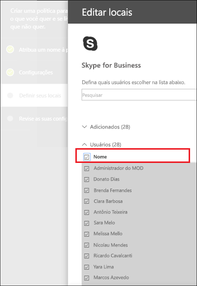
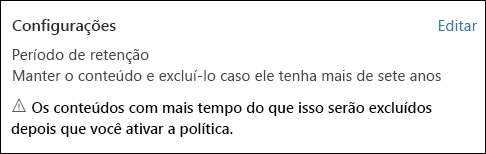
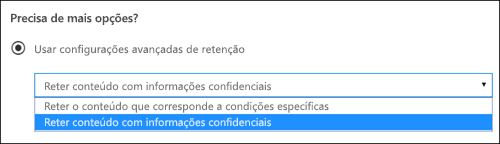
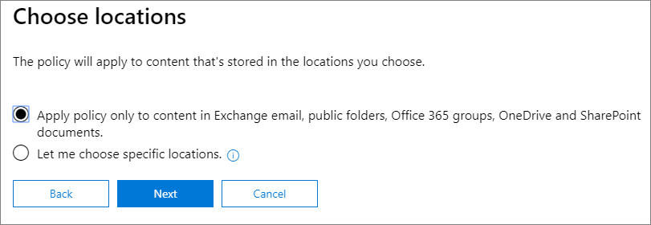
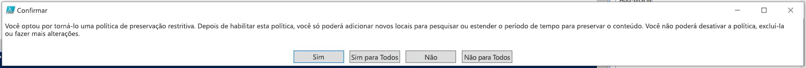

# <a name="create-and-configure-retention-policies"></a>Criar e configurar políticas de retenção

>*[Diretrizes de licenciamento do Microsoft 365 para segurança e conformidade](https://aka.ms/ComplianceSD).*

Use uma política de retenção para decidir proativamente se deseja reter o conteúdo, excluí-lo ou ambos; reter e depois excluir o conteúdo. 

Uma política de retenção permite que você faça isso com muita eficiência, atribuindo as mesmas configurações de retenção para o conteúdo por local, no nível do site ou da caixa de correio. Se você não tiver certeza se deseja usar uma política ou um rótulo de retenção, confira [Políticas de retenção e os rótulos de retenção](retention.md#retention-policies-and-retention-labels).

Para saber mais sobre o funcionamento das políticas de retenção, confira [Saiba mais sobre retenção](retention.md).

## <a name="before-you-begin"></a>Antes de começar

O administrador global da sua organização tem permissões completas para criar e editar as políticas de retenção. Se você não estiver entrando como um administrador global, confira [Permissões necessárias para criar e gerenciar políticas e rótulos	de retenção](get-started-with-retention.md#permissions-required-to-create-and-manage-retention-policies-and-retention-labels).

## <a name="create-and-configure-a-retention-policy"></a>Criar e configurar uma política de retenção

Embora uma política de retenção possa dar suporte a vários locais, você não pode criar uma única política de retenção que inclui todos os locais suportados:
- Email do Exchange
- Site do Microsoft Office SharePoint Online
- Contas do OneDrive
- Grupos do Microsoft 365
- Skype for Business
- Pastas públicas do Exchange
- Mensagens do canal do Teams
- Chats do Teams

Quando você seleciona um dos locais do Teams quando cria uma política de retenção, os outros locais são excluídos automaticamente. Portanto, as instruções a seguir dependem se você precisar incluir os locais do Teams:

- [Instruções para uma política de retenção para locais do Teams](#retention-policy-for-teams-locations)
- [Instruções para uma política de retenção para locais do Teams](#retention-policy-for-locations-other-than-teams)

Quando você tem mais de uma política de retenção, e quando você também usa rótulos de retenção, consulte [Princípios de retenção ou o que tem precedência?](retention.md#the-principles-of-retention-or-what-takes-precedence) para compreender o que acontece quando várias configurações de retenção se aplicam ao mesmo conteúdo.

### <a name="retention-policy-for-teams-locations"></a>Política de retenção para locais do Teams

1. No [Centro de Conformidade do Microsoft 365](https://compliance.microsoft.com/), selecione **Políticas** > **Retenção**.

2. Selecione **Nova política de retenção** para criar uma nova política de retenção.

3. Para **decidir se deseja reter o conteúdo, excluí-lo, ou ambos** página do assistente, especifique as opções de configuração para manter e excluir o conteúdo. 
    
    Você pode criar uma política de retenção que apenas retenha o conteúdo sem excluir, retenha e exclua após um período especificado ou apenas exclua o conteúdo após um período especificado. Para saber mais, confira [Configurações de retenção e exclusão de conteúdo](#settings-for-retaining-and-deleting-content) nesta página.
    
    Não selecionar **Usar as configurações avançadas de retenção** porque essa opção não tem suporte para os locais do Teams. 

4. Na página **Escolher locais**, clique em **Escolher locais específicos**. Em seguida, ative um ou ambos os locais para o Teams: **Mensagens de canal do Teams** e **chat do Teams**.
     
    Para as **Mensagens de canal do Teams**, estão incluídas mensagens de canais padrão, mas não de [canais privados](https://docs.microsoft.com/microsoftteams/private-channels). No momento, canais privados não são suportados pelas políticas de retenção.
    
    Por padrão, todas as equipes são selecionadas, mas você pode refiná-la especificando as equipes a serem incluídas ou a serem excluídas.

5. Conclua o assistente para salvar suas configurações.

Para mais informações sobre as políticas de retenção para o Teams, confira [Políticas de retenção no Microsoft Teams](https://docs.microsoft.com/microsoftteams/retention-policies) da documentação do Teams.

#### <a name="additional-retention-policy-needed-to-support-teams"></a>Adicionais políticas de retenção necessárias para oferecer suporte ao Teams

O Teams é muito mais que apenas chats e mensagens de canal. Se você tiver equipes criadas a partir de um grupo do Microsoft 365 (antigo Office 365 Group), deverá configurar uma política de retenção que inclui o grupo do Microsoft 365 usando o local do **grupos do Office 365**. Essa política de retenção se aplica ao conteúdo da caixa de correio do grupo, site e arquivos.

Se você tiver um site da equipe que não está conectado a um grupo do Microsoft 365, você precisará de uma política de retenção que inclui os locais dos**sites do SharePoint** ou das **contas do OneDrive** locais para manter e excluir arquivos no Teams:

- Os arquivos compartilhados no chat são armazenados na conta do OneDrive do usuário que compartilhou o arquivo. 

- Os arquivos carregados nos canais são armazenados no site do SharePoint usado pela equipe.

> [!TIP]
> Você pode aplicar uma política de retenção aos arquivos apenas para uma equipe específica quando não estiver conectado a um grupo do Microsoft 365, selecionando o site do SharePoint para a equipe e as contas de usuários do OneDrive no Teams.

É possível que uma política de retenção aplicada aos grupos do Microsoft 365, sites do SharePoint ou contas do OneDrive, exclua um arquivo referenciado em uma mensagem de bate-papo ou de um canal do Teams para que as mensagens sejam excluídas. Neste cenário, o arquivo ainda é exibido na mensagem do Teams, mas quando os usuários selecionam o arquivo, eles recebem o erro "arquivo não encontrado". Esse comportamento não é específico das políticas de retenção e também pode acontecer se um usuário exclui manualmente um arquivo do SharePoint ou do OneDrive.


### <a name="retention-policy-for-locations-other-than-teams"></a>Política de retenção para locais diferentes do Teams

1. No [Centro de Conformidade do Microsoft 365](https://compliance.microsoft.com/), selecione **Políticas** > **Retenção**.

2. Selecione **Nova política de retenção** para criar uma nova política de retenção.

3. Para **decidir se deseja reter o conteúdo, excluí-lo, ou ambos** página do assistente, especifique as opções de configuração para manter e excluir o conteúdo. 
    
    Você pode criar uma política de retenção que apenas retenha o conteúdo sem excluir, retenha e exclua após um período especificado ou apenas exclua o conteúdo após um período especificado. Para saber mais, confira [Configurações de retenção e exclusão de conteúdo](#settings-for-retaining-and-deleting-content) nesta página.
    
    Em seguida, decida se a política de retenção deve ser aplicada a todo o conteúdo ou ao conteúdo que atenda a condições específicas. Para saber mais sobre essas configurações avançadas de retenção, confira [Configurações avançadas para identificar conteúdo que atenda a condições específicas ](#advanced-settings-to-identify-content-that-meets-specific-conditions) nesta página. 

4. Na página **Escolher locais**, selecione se a política de retenção deve ser aplicada a todos os locais suportados em sua organização ou se você deseja especificar os locais. Se você optar por locais específicos, também pode especificar inclusões e exclusões. 
    
    Para obter mais informações sobre como escolher entre uma política de retenção para a organização ou para locais específicos, confira [ Aplicar uma política de retenção a uma organização inteira ou locais específicos](#applying-a-retention-policy-to-an-entire-organization-or-specific-locations) nesta página.
    
    Informações específicas para locais:
    - [Email do Exchange e pastas públicas do Exchange](#configuration-information-for-exchange-email-and-exchange-public-folders)
    - [Sites do SharePoint e contas do OneDrive](#configuration-information-for-sharepoint-sites-and-onedrive-accounts)
    - [Grupos do Office 365](#configuration-information-for-microsoft-365-groups)
    - [Skype for Business](#configuration-information-for-skype-for-business)

5. Conclua o assistente para salvar suas configurações.


#### <a name="configuration-information-for-exchange-email-and-exchange-public-folders"></a>Informações de configuração para o email do Exchange e para as pastas públicas do Exchange

O local**email do Exchange** oferece suporte à retenção de emails, calendários e outros itens de caixa de correio dos usuários, aplicando as configurações de retenção no nível de uma caixa de correio.

Os itens de email a seguir são incluídos: mensagens de email (inclui rascunhos) com todos os anexos, tarefas e itens de calendário quando eles têm uma data de término e anotações. Os contatos, as tarefas e os itens de calendário que não têm uma data de término não são incluídos. Os outros itens armazenados em uma caixa de correio, como as mensagens salvas no Skype e no Teams, não são incluídos com esse local. Esses itens têm seus próprios locais de retenção.

Mesmo que um grupo do Microsoft 365 tenha uma caixa de correio do Exchange, uma política de retenção que inclua todo o local **E-mail do Exchange** não incluirá conteúdo nas caixas de correio de grupo do Microsoft 365. Para manter o conteúdo nessas caixas de correio, selecione o local **Grupos do Office 365**.

O local **Pastas públicas do Exchange** aplica as configurações de retenção a todas as pastas públicas e não pode ser aplicado no nível de pasta ou caixa de correio.

#### <a name="configuration-information-for-sharepoint-sites-and-onedrive-accounts"></a>Informações de configuração para sites do SharePoint e contas do OneDrive

Quando você escolhe o local**sites do SharePoint**, a política de retenção pode reter e excluir documentos no conteúdo nos sites de comunicação do SharePoint, sites de equipes que não estão conectados por grupos do Office 365 e sites clássicos. Os sites de equipes conectados por grupos do Office 365 não possuem suporte com essa opção e, em vez disso, use a **Grupos do Office 365** local que se aplicam ao conteúdo na caixa de correio do grupo, sites e arquivos.

Embora a política de retenção seja aplicada no nível do site, apenas os documentos têm configurações de retenção aplicadas a eles. As configurações de retenção não se aplicam às estruturas de organização que incluem bibliotecas, listas e pastas no site. 

Ao especificar os locais para os sites do SharePoint ou contas do OneDrive, não será preciso ter permissões para acessar os sites e nenhuma validação será feita ao especificar a URL na página **Editar locais**. No entanto, os sites devem ser indexados, e, os especificados por você, serão verificados no final do assistente.

Se essa verificação falhar, uma mensagem será exibida informando que a validação falhou para a URL inserida, e o assistente não criará a política de retenção até que a verificação de validação seja aprovada. Se você vir esta mensagem, volte ao assistente para alterar a URL ou remover o site da política de retenção.

Para especificar contas individuais do OneDrive para incluir ou excluir o URL tem o seguinte formato: `https://<tenant name>-my.sharepoint.com/personal/<user_name>_<tenant name>_com`

Por exemplo, para um usuário no locatário contoso que tenha um nome de usuário "rsimone": `https://contoso-my.sharepoint.com/personal/rsimone_contoso_onmicrosoft_com`

Para verificar a sintaxe do seu locatário e identificar URLs dos usuários, confira [Obter uma lista de todas as URLs de usuário do OneDrive em sua organização](https://docs.microsoft.com/onedrive/list-onedrive-urls).

### <a name="configuration-information-for-microsoft-365-groups"></a>Informações de configuração de grupos do Microsoft 365

Para manter ou deletar o conteúdo de um grupo do Microsoft 365 (antigo grupo Office 365), use o local **grupos do Office 365**. Mesmo que um grupo do Microsoft 365 tenha uma caixa de correio do Exchange, uma política de retenção que inclua todo o local **E-mail do Exchange** não incluirá conteúdo nas caixas de correio de grupo do Microsoft 365. Além disso, embora o local **E-mail do Exchange** permita inicialmente especificar uma caixa de correio de grupo a ser incluída ou excluída, ao tentar salvar a política de retenção, você recebe um erro indicando que "RemoteGroupMailbox" não é uma seleção válida para o local do Exchange.

Uma política de retenção aplicada a um grupo do Microsoft 365 inclui a caixa de correio do grupo e o site de equipes, se um site de equipes tiver sido selecionado no momento em que o grupo foi criado ou adicionado posteriormente ao grupo. Os arquivos armazenados no site de equipes são cobertos por este local, mas não os chats do Teams ou as mensagens do canal do Teams que têm seus próprios locais de política de retenção.

### <a name="configuration-information-for-skype-for-business"></a>Informações de configuração do Skype for Business

Diferentemente de um email do Exchange, você não pode ativar ou desativar o status de local do Skype para incluir todos os usuários, mas pode ativar esse local e depois selecionar manualmente os usuários cujas conversas deseja manter:


  
Ao selecionar **escolher usuários**, você pode incluir rapidamente todos os usuários, selecionando a caixa **Nome** no cabeçalho da coluna. No entanto, é importante compreender que cada usuário é como uma inclusão específica na política. Portanto, se mais de 1.000 usuários forem incluídos, os limites indicados na seção anterior serão aplicáveis. Aqui, selecionar todos os usuários do Skype não é o mesmo como se uma política no âmbito da organização fosse capaz de incluir todos os usuários do Skype por padrão. 
  

  
Observe que o **Histórico da Conversa**, uma pasta no Outlook, é um recurso que não tem nada a ver com o arquivamento do Skype. **Histórico da Conversa** pode ser desativado pelo usuário final, mas o arquivamento para o Skype é feito armazenando-se uma cópia das conversas do Skype em uma pasta oculta que é inacessível ao usuário, mas disponível para Descoberta Eletrônica.


## <a name="settings-for-retaining-and-deleting-content"></a>Configurações de retenção e exclusão de conteúdo

Ao escolher as configurações de retenção e exclusão de conteúdo em sua política de retenção, sua política de retenção terá uma das seguintes configurações por um período especificado:

- Somente reter
- Reter e excluir
- Somente excluir

### <a name="retaining-content-for-a-specific-period-of-time"></a>Reter o conteúdo por um período específico

Ao configurar uma política de retenção, você opta por reter o conteúdo indefinidamente ou por um número específico de dias, meses ou anos. A duração para retenção do conteúdo é calculada com base na idade desse conteúdo, e não do momento em que a política de retenção foi aplicada. Você pode escolher se a idade se baseia em quando o conteúdo foi criado ou (para o OneDrive e o SharePoint) em quando ele foi modificado pela última vez.

Exemplos:
  
- SharePoint: se você quiser preservar o conteúdo em um conjunto de sites por sete anos, e se um documento nesse conjunto de sites não tiver sido modificado em seis anos, o documento será retido somente por mais um ano caso não seja modificado. Se o documento for editado novamente, a idade do documento será calculada a partir da última data de modificação, e ele ficará retido por mais sete anos.
  
- Exchange: se você deseja reter o conteúdo em uma caixa de correio por sete anos, e uma mensagem foi enviada há seis anos, esta será retida por apenas um ano. Para o conteúdo do Exchange, a idade é baseada na data de recebimento do email de entrada ou na data de envio do email de saída. O processo de reter o conteúdo com base em quando ele foi modificado pela última vez é aplicável apenas ao conteúdo de sites do OneDrive e do SharePoint.
  
No final do período de retenção, você pode escolher se deseja que o conteúdo seja excluído permanentemente:
  

  
### <a name="deleting-content-thats-older-than-a-specific-age"></a>Como excluir conteúdo mais antigo que uma idade específica

Uma política de retenção pode reter e excluir o conteúdo ou excluir o conteúdo antigo sem retê-lo.
  
Se sua política de retenção excluir conteúdo, será importante entender que o período de tempo especificado para uma política de retenção é calculado pelo tempo em que o documento foi criado ou modificado, e não a partir do momento em que a política foi atribuída.
  

  
Por exemplo, suponha que você crie uma política de retenção que exclui o conteúdo depois de três anos e, em seguida, atribui essa política a todas as contas do OneDrive, que incluem uma grande quantidade de conteúdo criado há quatro ou cinco anos. Nesse caso, uma boa parcela do conteúdo será excluída logo depois que a política de retenção for atribuída pela primeira vez. Por esse motivo, é importante compreender que uma política de retenção que exclui conteúdo pode ter um impacto considerável sobre o seu conteúdo. 
  
Portanto, quando atribuir uma política de retenção a um conjunto de sites pela primeira vez, primeiro considere a idade do conteúdo e de que modo a política poderá afetá-los. Você também poderá informar os usuários sobre a nova política antes de atribuí-la, para que eles tenham tempo de avaliar o possível impacto. Observe esse aviso que é exibido quando você revisa as configurações da política de retenção antes de criá-la.
  

  
## <a name="advanced-settings-to-identify-content-that-meets-specific-conditions"></a>Configurações avançadas para identificar conteúdo que atenda a condições específicas

Uma política de retenção pode ser aplicada a todo o conteúdo nos locais em que inclui ou você pode aplicar uma política de retenção apenas ao conteúdo que inclui palavras-chave específicas ou [tipos específicos de informações confidenciais](what-the-sensitive-information-types-look-for.md).
  

  
### <a name="identify-content-that-contains-specific-keywords"></a>Identificar conteúdo que inclui palavras-chave específicas

Você pode aplicar uma política de retenção apenas ao conteúdo que atende a condições específicas e depois realizar ações de retenção apenas nesse conteúdo. As condições disponíveis dão suporte à aplicação de uma política de retenção ao conteúdo que inclui palavras ou frases específicas. Refine a consulta usando operadores de pesquisa como AND, OR e NOT. Para saber mais sobre esses operadores, confira [Consultas de palavra-chave e critérios de pesquisa para Pesquisa de Conteúdo](keyword-queries-and-search-conditions.md).
  
O suporte à adição de propriedades pesquisáveis (por exemplo, **assunto:**) estará disponível em breve.
  
A retenção com base em consulta usa o índice de pesquisa para identificar conteúdo.
  

  
### <a name="identify-content-that-contains-sensitive-information"></a>Identificar conteúdo com informações confidenciais

Você também pode aplicar uma política de retenção apenas ao conteúdo que inclui [tipos específicos de informações confidenciais](what-the-sensitive-information-types-look-for.md). Por exemplo, você pode optar por aplicar exigências de retenção exclusivas somente ao conteúdo com informações pessoais, como números de identificação de contribuinte, números de CPF ou números de passaporte.
  

  
Observações:
  
- A retenção avançada para informações confidenciais não se aplica a pastas públicas do Exchange ou Skype for Business, pois esses locais não dão suporte a tipos de informações confidenciais.
    
- O Exchange Online usa regras de fluxo de email (também conhecidas como regras de transporte) para identificar informações confidenciais, portanto, isso funciona apenas em mensagens em trânsito, e não em todos os itens já armazenados em uma caixa de correio. Para o Exchange Online, isso significa que uma política de retenção pode identificar informações confidenciais e realizar ações de retenção apenas em mensagens recebidas **após** a aplicação da política à caixa de correio. A retenção com base em consulta descrita na seção anterior não apresenta essa limitação, pois ela usa o índice de pesquisa para identificar conteúdo. 
    
## <a name="applying-a-retention-policy-to-an-entire-organization-or-specific-locations"></a>Aplicar uma política de retenção a uma organização inteira ou locais específicos

Você pode facilmente aplicar uma política de retenção a uma organização inteira, locais inteiros ou apenas a locais ou usuários específicos.
  
### <a name="org-wide-policy"></a>Política no âmbito da organização

Um dos recursos mais avançados de política de retenção é que, por padrão, aplica-se aos locais no Microsoft 365, incluindo:
  
- Email do Exchange
    
- Conjuntos de sites do SharePoint
    
- Contas do OneDrive
    
- Grupos do Microsoft 365
    
- Pastas públicas do Exchange
    



Outros recursos importantes de uma política de retenção no âmbito da organização incluem:
  
- Não há um limite para o número de caixas de correio ou sites que essa política pode incluir.
    
- Para o Exchange, as caixas de correio criadas após a aplicação da política herdam a política automaticamente.
  
### <a name="a-policy-that-applies-to-entire-locations"></a>Uma política aplicável a locais inteiros

Ao escolher locais, você pode facilmente incluir ou excluir um local inteiro, como emails do Exchange ou contas do OneDrive. Para fazer isso, ative ou desative o **Status** desse local. 
  
Como uma política no âmbito da organização, se uma política for aplicada a qualquer combinação de locais inteiros, não haverá limite para o número de caixas de correio ou sites que ela pode incluir. 

Por exemplo, se uma política incluir todos os emails do Exchange e sites do SharePoint, todos os sites e caixas de correio serão incluídos, independentemente da quantidade. Além disso, no caso do Exchange, todas as caixas de correio criadas após a aplicação da política herdam a política automaticamente.

### <a name="a-policy-with-specific-inclusions-or-exclusions"></a>Uma política com inclusões ou exclusões específicas

Você também pode aplicar uma política de retenção a usuários específicos, grupos específicos do Microsoft 365 ou sites específicos. Para fazer isso, ative o **Status** desse local e, em seguida, use os links para incluir ou excluir usuários específicos, grupos do Microsoft 365 ou sites. 
  
No entanto, usando essa configuração, há alguns limites quando sua política de retenção inclui ou exclui mais de 1.000 locais específicos:
  
- Números máximos da política de retenção:
    - 1.000 caixas de correio
    - 1.000 grupos do Microsoft 365
    - 1.000 usuários para conversas privadas do Teams
    - 100 sites (OneDrive ou SharePoint)

Há um número máximo de políticas com suporte para um locatário: 10.000. Esses itens incluem políticas de retenção, políticas de rótulo de retenção e políticas de retenção de aplicação automática.

Se é provável que suas políticas de retenção estejam sujeitas a essas limitações, escolha as opções de configuração que se aplicam a locais inteiros ou use uma política em toda a organização.

> [!WARNING]
> Se você inclui-lo e, em seguida, remover o último, a configuração será revertida em **Todas** para o local.  Verifique se esta é a configuração que você pretende antes de salvar a política.
> 
> Por exemplo, se você especificar um site do SharePoint a ser incluído na sua política de retenção que está configurada para excluir dados e, em seguida, remover o site único, por padrão, todos os sites do SharePoint estarão sujeitos à política de retenção que exclui permanentemente os dados. O mesmo se aplica a inclusões para os destinatários do Exchange, contas do OneDrive, usuários de chat do Teams, etc.
> 
> Neste cenário, desative o local se não quiser que a configuração **Todos** para o local estejam sujeitos à política de retenção. Como alternativa, especifique exclusões a serem isentas da política.

## <a name="updating-retention-policies"></a>Atualizar políticas de retenção

Se você editar uma política de retenção e o conteúdo já estiver sujeito às configurações originais da sua política de retenção, as configurações atualizadas serão aplicadas automaticamente a esse conteúdo, além do conteúdo identificado recentemente.

Geralmente, essa atualização é bastante rápida, mas pode levar vários dias. Quando a replicação da política nos locais do Microsoft 365 estiver concluída, você verá o status da política de retenção no Centro de Conformidade do Microsoft 365 mudar de **Ativado (Pendente)** para **Ativado (Sucesso)**.

## <a name="lock-a-retention-policy-by-using-powershell"></a>Bloquear uma política de retenção usando o Windows PowerShell

Você deve usar o Windows PowerShell se precisar usar o [Bloqueio de Preservação](retention.md#use-preservation-lock-to-comply-with-regulatory-requirements) para atender aos requisitos normativos. Como os administradores não podem desabilitar ou excluir uma política de retenção após a aplicação de um bloqueio de preservação, a habilitação desse recurso não está disponível na interface do usuário para proteger contra configurações acidentais.

Todas as políticas de retenção, com qualquer configuração, oferecem suporte ao Bloqueio de Preservação. No entanto, ao usar os comandos do PowerShell a seguir, você perceberá que o parâmetro **Carga de trabalho** sempre exibirá **o Exchange, o SharePoint, o OneDriveForBusines, o Skype, o ModernGroup** em vez de refletir as cargas de trabalho reais configuradas na política. Isso é apenas um problema de exibição.

1. [Conectar ao Centro de Conformidade e Segurança do PowerShell](https://docs.microsoft.com/powershell/exchange/office-365-scc/connect-to-scc-powershell/connect-to-scc-powershell?view=exchange-ps).

2. Liste suas políticas de retenção e encontre o nome da política que quer bloquear executando [Get-RetentionCompliancePolicy](https://powershell/module/exchange/get-retentioncompliancepolicy). Por exemplo:
    
   
    
3. Para colocar um Bloqueio de Preservação em uma política de retenção, execute o cmdlet [Set-RetentionCompliancePolicy]( ) com o nome da política de retenção e o parâmetro *RestrictiveRetention* definido como verdadeiro:
    
    ```powershell
    Set-RetentionCompliancePolicy -Identity "<Name of Policy>" –RestrictiveRetention $true
    ```
    
    Por exemplo:
    
    
    
     Quando solicitado, leia e reconheça as restrições que vêm com esta configuração digitando **S**:
    
   

O Bloqueio de Preservação agora está localizado na política de retenção. Para confirmar, execute o `Get-RetentionCompliancePolicy` novamente, mas especifique o nome da política de retenção e exiba os parâmetros da política:

```powershell
Get-RetentionCompliancePolicy -Identity "<Name of Policy>" |Fl
```

Você deverá ver que o **RestrictiveRetention** está definido como **Verdadeiro**. Por exemplo:


  

