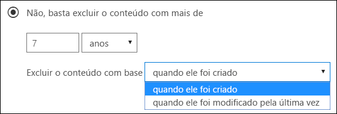

# <a name="create-and-configure-retention-policies"></a><span data-ttu-id="1a0b6-103">Criar e configurar políticas de retenção</span><span class="sxs-lookup"><span data-stu-id="1a0b6-103">Create and configure retention policies</span></span>

><span data-ttu-id="1a0b6-104">*[Diretrizes de licenciamento do Microsoft 365 para segurança e conformidade](https://aka.ms/ComplianceSD).*</span><span class="sxs-lookup"><span data-stu-id="1a0b6-104">*[Microsoft 365 licensing guidance for security & compliance](https://aka.ms/ComplianceSD).*</span></span>

<span data-ttu-id="1a0b6-105">Use uma política de retenção para decidir proativamente se deseja reter o conteúdo, excluí-lo ou ambos; reter e depois excluir o conteúdo.</span><span class="sxs-lookup"><span data-stu-id="1a0b6-105">Use a retention policy to decide proactively whether to retain content, delete content, or both - retain and then delete the content.</span></span> 

<span data-ttu-id="1a0b6-106">Uma política de retenção permite que você faça isso com muita eficiência, atribuindo as mesmas configurações de retenção para o conteúdo por local, no nível do site ou da caixa de correio.</span><span class="sxs-lookup"><span data-stu-id="1a0b6-106">A retention policy lets you do this very efficiently by assigning the same retention settings for content by location, at a site or mailbox level.</span></span> <span data-ttu-id="1a0b6-107">Se você não tiver certeza se deseja usar uma política ou um rótulo de retenção, confira [Políticas de retenção e os rótulos de retenção](retention.md#retention-policies-and-retention-labels).</span><span class="sxs-lookup"><span data-stu-id="1a0b6-107">If you're not sure whether to use a retention policy or a retention label, see [Retention policies and retention labels](retention.md#retention-policies-and-retention-labels).</span></span>

<span data-ttu-id="1a0b6-108">Para saber mais sobre o funcionamento das políticas de retenção, confira [Saiba mais sobre retenção](retention.md).</span><span class="sxs-lookup"><span data-stu-id="1a0b6-108">For more information about retention policies and how retention works, see [Learn about retention](retention.md).</span></span>

## <a name="before-you-begin"></a><span data-ttu-id="1a0b6-109">Antes de começar</span><span class="sxs-lookup"><span data-stu-id="1a0b6-109">Before you begin</span></span>

<span data-ttu-id="1a0b6-110">O administrador global da sua organização tem permissões completas para criar e editar as políticas de retenção.</span><span class="sxs-lookup"><span data-stu-id="1a0b6-110">The global admin for your organization has full permissions to create and edit retention policies.</span></span> <span data-ttu-id="1a0b6-111">Se você não estiver entrando como um administrador global, confira [Permissões necessárias para criar e gerenciar políticas e rótulos	de retenção](get-started-with-retention.md#permissions-required-to-create-and-manage-retention-policies-and-retention-labels).</span><span class="sxs-lookup"><span data-stu-id="1a0b6-111">If you aren't signing in as a global admin, see [Permissions required to create and manage retention policies and retention labels](get-started-with-retention.md#permissions-required-to-create-and-manage-retention-policies-and-retention-labels).</span></span>

## <a name="create-and-configure-a-retention-policy"></a><span data-ttu-id="1a0b6-112">Criar e configurar uma política de retenção</span><span class="sxs-lookup"><span data-stu-id="1a0b6-112">Create and configure a retention policy</span></span>

<span data-ttu-id="1a0b6-113">Embora uma política de retenção possa dar suporte a vários locais, você não pode criar uma única política de retenção que inclui todos os locais suportados:</span><span class="sxs-lookup"><span data-stu-id="1a0b6-113">Although a retention policy can support multiple locations, you can't create a single retention policy that includes all the supported locations:</span></span>
- <span data-ttu-id="1a0b6-114">Email do Exchange</span><span class="sxs-lookup"><span data-stu-id="1a0b6-114">Exchange email</span></span>
- <span data-ttu-id="1a0b6-115">Site do Microsoft Office SharePoint Online</span><span class="sxs-lookup"><span data-stu-id="1a0b6-115">SharePoint site</span></span>
- <span data-ttu-id="1a0b6-116">Contas do OneDrive</span><span class="sxs-lookup"><span data-stu-id="1a0b6-116">OneDrive accounts</span></span>
- <span data-ttu-id="1a0b6-117">Grupos do Microsoft 365</span><span class="sxs-lookup"><span data-stu-id="1a0b6-117">Microsoft 365 groups</span></span>
- <span data-ttu-id="1a0b6-118">Skype for Business</span><span class="sxs-lookup"><span data-stu-id="1a0b6-118">Skype for Business</span></span>
- <span data-ttu-id="1a0b6-119">Pastas públicas do Exchange</span><span class="sxs-lookup"><span data-stu-id="1a0b6-119">Exchange public folders</span></span>
- <span data-ttu-id="1a0b6-120">Mensagens do canal do Teams</span><span class="sxs-lookup"><span data-stu-id="1a0b6-120">Teams channel messages</span></span>
- <span data-ttu-id="1a0b6-121">Chats do Teams</span><span class="sxs-lookup"><span data-stu-id="1a0b6-121">Teams chats</span></span>

<span data-ttu-id="1a0b6-122">Quando você seleciona um dos locais do Teams quando cria uma política de retenção, os outros locais são excluídos automaticamente.</span><span class="sxs-lookup"><span data-stu-id="1a0b6-122">When you select either of the Teams locations when you create a retention policy, the other locations are automatically excluded.</span></span> <span data-ttu-id="1a0b6-123">Portanto, as instruções a seguir dependem se você precisar incluir os locais do Teams:</span><span class="sxs-lookup"><span data-stu-id="1a0b6-123">Therefore, the instructions to follow depend on whether you need to include the Teams locations:</span></span>

- [<span data-ttu-id="1a0b6-124">Instruções para uma política de retenção para locais do Teams</span><span class="sxs-lookup"><span data-stu-id="1a0b6-124">Instructions for a retention policy for Teams locations</span></span>](#retention-policy-for-teams-locations)
- [<span data-ttu-id="1a0b6-125">Instruções para uma política de retenção para locais do Teams</span><span class="sxs-lookup"><span data-stu-id="1a0b6-125">Instructions for a retention policy for locations other than Teams</span></span>](#retention-policy-for-locations-other-than-teams)

<span data-ttu-id="1a0b6-126">Quando você tem mais de uma política de retenção, e quando você também usa rótulos de retenção, consulte [Princípios de retenção ou o que tem precedência?](retention.md#the-principles-of-retention-or-what-takes-precedence) para compreender o que acontece quando várias configurações de retenção se aplicam ao mesmo conteúdo.</span><span class="sxs-lookup"><span data-stu-id="1a0b6-126">When you have more than one retention policy, and when you also use retention labels, see [The principles of retention, or what takes precedence?](retention.md#the-principles-of-retention-or-what-takes-precedence) to understand the outcome when multiple retention settings apply to the same content.</span></span>

### <a name="retention-policy-for-teams-locations"></a><span data-ttu-id="1a0b6-127">Política de retenção para locais do Teams</span><span class="sxs-lookup"><span data-stu-id="1a0b6-127">Retention policy for Teams locations</span></span>

1. <span data-ttu-id="1a0b6-128">No [Centro de Conformidade do Microsoft 365](https://compliance.microsoft.com/), selecione **Políticas** > **Retenção**.</span><span class="sxs-lookup"><span data-stu-id="1a0b6-128">From the [Microsoft 365 compliance center](https://compliance.microsoft.com/), select **Policies** > **Retention**.</span></span>

2. <span data-ttu-id="1a0b6-129">Selecione **Nova política de retenção** para criar uma nova política de retenção.</span><span class="sxs-lookup"><span data-stu-id="1a0b6-129">Select **New retention policy** to create a new retention policy.</span></span>

3. <span data-ttu-id="1a0b6-130">Para **decidir se deseja reter o conteúdo, excluí-lo, ou ambos** página do assistente, especifique as opções de configuração para manter e excluir o conteúdo.</span><span class="sxs-lookup"><span data-stu-id="1a0b6-130">For **Decide if you want to retain content, delete it, or both** page of the wizard, specify the configuration options for retaining and deleting content.</span></span> 
    
    <span data-ttu-id="1a0b6-131">Você pode criar uma política de retenção que apenas retenha o conteúdo sem excluir, retenha e exclua após um período especificado ou apenas exclua o conteúdo após um período especificado.</span><span class="sxs-lookup"><span data-stu-id="1a0b6-131">You can create a retention policy that just retains content without deleting, retains and then deletes after a specified period of time, or just deletes content after a specified period of time.</span></span> <span data-ttu-id="1a0b6-132">Para saber mais, confira [Configurações de retenção e exclusão de conteúdo](#settings-for-retaining-and-deleting-content) nesta página.</span><span class="sxs-lookup"><span data-stu-id="1a0b6-132">For more information, see [Settings for retaining and deleting content](#settings-for-retaining-and-deleting-content) on this page.</span></span>
    
    <span data-ttu-id="1a0b6-133">Não selecionar **Usar as configurações avançadas de retenção** porque essa opção não tem suporte para os locais do Teams.</span><span class="sxs-lookup"><span data-stu-id="1a0b6-133">Do not select **Use advanced retention settings** because this option isn't supported for Teams locations.</span></span> 

4. <span data-ttu-id="1a0b6-134">Na página **Escolher locais**, clique em **Escolher locais específicos**.</span><span class="sxs-lookup"><span data-stu-id="1a0b6-134">For the **Choose locations** page, select **Let me choose specific locations**.</span></span> <span data-ttu-id="1a0b6-135">Em seguida, ative um ou ambos os locais para o Teams: **Mensagens de canal do Teams** e **chat do Teams**.</span><span class="sxs-lookup"><span data-stu-id="1a0b6-135">Then toggle on one or both of the locations for Teams: **Teams channel message** and **Teams chats**.</span></span>
     
    <span data-ttu-id="1a0b6-136">Para as **Mensagens de canal do Teams**, estão incluídas mensagens de canais padrão, mas não de [canais privados](https://docs.microsoft.com/microsoftteams/private-channels).</span><span class="sxs-lookup"><span data-stu-id="1a0b6-136">For **Teams channel messages**, message from standard channels but not [private channels](https://docs.microsoft.com/microsoftteams/private-channels) are included.</span></span> <span data-ttu-id="1a0b6-137">No momento, canais privados não são suportados pelas políticas de retenção.</span><span class="sxs-lookup"><span data-stu-id="1a0b6-137">Currently, private channels aren't supported by retention policies.</span></span>
    
    <span data-ttu-id="1a0b6-138">Por padrão, todas as equipes são selecionadas, mas você pode refiná-la especificando as equipes a serem incluídas ou a serem excluídas.</span><span class="sxs-lookup"><span data-stu-id="1a0b6-138">By default, all teams are selected, but you can refine this by specifying teams to be included, or teams to be excluded.</span></span>

5. <span data-ttu-id="1a0b6-139">Conclua o assistente para salvar suas configurações.</span><span class="sxs-lookup"><span data-stu-id="1a0b6-139">Complete the wizard to save your settings.</span></span>

<span data-ttu-id="1a0b6-140">Para mais informações sobre as políticas de retenção para o Teams, confira [Políticas de retenção no Microsoft Teams](https://docs.microsoft.com/microsoftteams/retention-policies) da documentação do Teams.</span><span class="sxs-lookup"><span data-stu-id="1a0b6-140">For more information about retention policies for Teams, see [Retention policies in Microsoft Teams](https://docs.microsoft.com/microsoftteams/retention-policies) from the Teams documentation.</span></span>

#### <a name="additional-retention-policy-needed-to-support-teams"></a><span data-ttu-id="1a0b6-141">Adicionais políticas de retenção necessárias para oferecer suporte ao Teams</span><span class="sxs-lookup"><span data-stu-id="1a0b6-141">Additional retention policy needed to support Teams</span></span>

<span data-ttu-id="1a0b6-142">O Teams é muito mais que apenas chats e mensagens de canal.</span><span class="sxs-lookup"><span data-stu-id="1a0b6-142">Teams is more than just chats and channel messages.</span></span> <span data-ttu-id="1a0b6-143">Se você tiver equipes criadas a partir de um grupo do Microsoft 365 (antigo Office 365 Group), deverá configurar uma política de retenção que inclui o grupo do Microsoft 365 usando o local do **grupos do Office 365**.</span><span class="sxs-lookup"><span data-stu-id="1a0b6-143">If you have teams that were created from a Microsoft 365 group (formerly Office 365 group), you should additionally configure a retention policy that includes that Microsoft 365 group by using the **Office 365 groups** location.</span></span> <span data-ttu-id="1a0b6-144">Essa política de retenção se aplica ao conteúdo da caixa de correio do grupo, site e arquivos.</span><span class="sxs-lookup"><span data-stu-id="1a0b6-144">This retention policy applies to content in the group's mailbox, site, and files.</span></span>

<span data-ttu-id="1a0b6-145">Se você tiver um site da equipe que não está conectado a um grupo do Microsoft 365, você precisará de uma política de retenção que inclui os locais dos**sites do SharePoint** ou das **contas do OneDrive** locais para manter e excluir arquivos no Teams:</span><span class="sxs-lookup"><span data-stu-id="1a0b6-145">If you have team sites that aren't connected to a Microsoft 365 group, you need a retention policy that includes the **SharePoint sites** or **OneDrive accounts** locations to retain and delete files in Teams:</span></span>

- <span data-ttu-id="1a0b6-146">Os arquivos compartilhados no chat são armazenados na conta do OneDrive do usuário que compartilhou o arquivo.</span><span class="sxs-lookup"><span data-stu-id="1a0b6-146">Files that are shared in chat are stored in the OneDrive account of the user who shared the file.</span></span> 

- <span data-ttu-id="1a0b6-147">Os arquivos carregados nos canais são armazenados no site do SharePoint usado pela equipe.</span><span class="sxs-lookup"><span data-stu-id="1a0b6-147">Files that are uploaded to channels are stored in the SharePoint site for the team.</span></span>

> [!TIP]
> <span data-ttu-id="1a0b6-148">Você pode aplicar uma política de retenção aos arquivos apenas para uma equipe específica quando não estiver conectado a um grupo do Microsoft 365, selecionando o site do SharePoint para a equipe e as contas de usuários do OneDrive no Teams.</span><span class="sxs-lookup"><span data-stu-id="1a0b6-148">You can apply a retention policy to the files of just a specific team when it's not connected to a Microsoft 365 group by selecting the SharePoint site for the team, and the OneDrive accounts of users in the Team.</span></span>

<span data-ttu-id="1a0b6-149">É possível que uma política de retenção aplicada aos grupos do Microsoft 365, sites do SharePoint ou contas do OneDrive, exclua um arquivo referenciado em uma mensagem de bate-papo ou de um canal do Teams para que as mensagens sejam excluídas.</span><span class="sxs-lookup"><span data-stu-id="1a0b6-149">It's possible that a retention policy that's applied to Microsoft 365 groups, SharePoint sites, or OneDrive accounts could delete a file that's referenced in a Teams chat or channel message before those messages get deleted.</span></span> <span data-ttu-id="1a0b6-150">Neste cenário, o arquivo ainda é exibido na mensagem do Teams, mas quando os usuários selecionam o arquivo, eles recebem o erro "arquivo não encontrado".</span><span class="sxs-lookup"><span data-stu-id="1a0b6-150">In this scenario, the file still displays in the Teams message, but when users select the file, they get a "File not found" error.</span></span> <span data-ttu-id="1a0b6-151">Esse comportamento não é específico das políticas de retenção e também pode acontecer se um usuário exclui manualmente um arquivo do SharePoint ou do OneDrive.</span><span class="sxs-lookup"><span data-stu-id="1a0b6-151">This behavior isn't specific to retention policies and could also happen if a user manually deletes a file from SharePoint or OneDrive.</span></span>


### <a name="retention-policy-for-locations-other-than-teams"></a><span data-ttu-id="1a0b6-152">Política de retenção para locais diferentes do Teams</span><span class="sxs-lookup"><span data-stu-id="1a0b6-152">Retention policy for locations other than Teams</span></span>

1. <span data-ttu-id="1a0b6-153">No [Centro de Conformidade do Microsoft 365](https://compliance.microsoft.com/), selecione **Políticas** > **Retenção**.</span><span class="sxs-lookup"><span data-stu-id="1a0b6-153">From the [Microsoft 365 compliance center](https://compliance.microsoft.com/), select **Policies** > **Retention**.</span></span>

2. <span data-ttu-id="1a0b6-154">Selecione **Nova política de retenção** para criar uma nova política de retenção.</span><span class="sxs-lookup"><span data-stu-id="1a0b6-154">Select **New retention policy** to create a new retention policy.</span></span>

3. <span data-ttu-id="1a0b6-155">Para **decidir se deseja reter o conteúdo, excluí-lo, ou ambos** página do assistente, especifique as opções de configuração para manter e excluir o conteúdo.</span><span class="sxs-lookup"><span data-stu-id="1a0b6-155">For **Decide if you want to retain content, delete it, or both** page of the wizard, specify the configuration options for retaining and deleting content.</span></span> 
    
    <span data-ttu-id="1a0b6-156">Você pode criar uma política de retenção que apenas retenha o conteúdo sem excluir, retenha e exclua após um período especificado ou apenas exclua o conteúdo após um período especificado.</span><span class="sxs-lookup"><span data-stu-id="1a0b6-156">You can create a retention policy that just retains content without deleting, retains and then deletes after a specified period of time, or just deletes content after a specified period of time.</span></span> <span data-ttu-id="1a0b6-157">Para saber mais, confira [Configurações de retenção e exclusão de conteúdo](#settings-for-retaining-and-deleting-content) nesta página.</span><span class="sxs-lookup"><span data-stu-id="1a0b6-157">For more information, see [Settings for retaining and deleting content](#settings-for-retaining-and-deleting-content) on this page.</span></span>
    
    <span data-ttu-id="1a0b6-158">Em seguida, decida se a política de retenção deve ser aplicada a todo o conteúdo ou ao conteúdo que atenda a condições específicas.</span><span class="sxs-lookup"><span data-stu-id="1a0b6-158">Then, decide whether the retention policy should apply to all content, or content that meets specific conditions.</span></span> <span data-ttu-id="1a0b6-159">Para saber mais sobre essas configurações avançadas de retenção, confira [Configurações avançadas para identificar conteúdo que atenda a condições específicas ](#advanced-settings-to-identify-content-that-meets-specific-conditions) nesta página.</span><span class="sxs-lookup"><span data-stu-id="1a0b6-159">For more information about these advanced retention settings, see [Advanced settings to identify content that meets specific conditions](#advanced-settings-to-identify-content-that-meets-specific-conditions) on this page.</span></span> 

4. <span data-ttu-id="1a0b6-160">Na página **Escolher locais**, selecione se a política de retenção deve ser aplicada a todos os locais suportados em sua organização ou se você deseja especificar os locais.</span><span class="sxs-lookup"><span data-stu-id="1a0b6-160">For the **Choose locations** page, select whether the retention policy should apply to all supported locations across your organization, or you want to specify the locations.</span></span> <span data-ttu-id="1a0b6-161">Se você optar por locais específicos, também pode especificar inclusões e exclusões.</span><span class="sxs-lookup"><span data-stu-id="1a0b6-161">If you choose specific locations, you can also specify includes and excludes.</span></span> 
    
    <span data-ttu-id="1a0b6-162">Para obter mais informações sobre como escolher entre uma política de retenção para a organização ou para locais específicos, confira [ Aplicar uma política de retenção a uma organização inteira ou locais específicos](#applying-a-retention-policy-to-an-entire-organization-or-specific-locations) nesta página.</span><span class="sxs-lookup"><span data-stu-id="1a0b6-162">For more information about choosing between a retention policy for the organization or for specific locations, see [Applying a retention policy to an entire organization or specific locations](#applying-a-retention-policy-to-an-entire-organization-or-specific-locations) on this page.</span></span>
    
    <span data-ttu-id="1a0b6-163">Informações específicas para locais:</span><span class="sxs-lookup"><span data-stu-id="1a0b6-163">Information specific to locations:</span></span>
    - [<span data-ttu-id="1a0b6-164">Email do Exchange e pastas públicas do Exchange</span><span class="sxs-lookup"><span data-stu-id="1a0b6-164">Exchange email and Exchange public folders</span></span>](#configuration-information-for-exchange-email-and-exchange-public-folders)
    - [<span data-ttu-id="1a0b6-165">Sites do SharePoint e contas do OneDrive</span><span class="sxs-lookup"><span data-stu-id="1a0b6-165">SharePoint sites and OneDrive accounts</span></span>](#configuration-information-for-sharepoint-sites-and-onedrive-accounts)
    - [<span data-ttu-id="1a0b6-166">Grupos do Office 365</span><span class="sxs-lookup"><span data-stu-id="1a0b6-166">Office 365 groups</span></span>](#configuration-information-for-microsoft-365-groups)
    - [<span data-ttu-id="1a0b6-167">Skype for Business</span><span class="sxs-lookup"><span data-stu-id="1a0b6-167">Skype for Business</span></span>](#configuration-information-for-skype-for-business)

5. <span data-ttu-id="1a0b6-168">Conclua o assistente para salvar suas configurações.</span><span class="sxs-lookup"><span data-stu-id="1a0b6-168">Complete the wizard to save your settings.</span></span>


#### <a name="configuration-information-for-exchange-email-and-exchange-public-folders"></a><span data-ttu-id="1a0b6-169">Informações de configuração para o email do Exchange e para as pastas públicas do Exchange</span><span class="sxs-lookup"><span data-stu-id="1a0b6-169">Configuration information for Exchange email and Exchange public folders</span></span>

<span data-ttu-id="1a0b6-170">O local**email do Exchange** oferece suporte à retenção de emails, calendários e outros itens de caixa de correio dos usuários, aplicando as configurações de retenção no nível de uma caixa de correio.</span><span class="sxs-lookup"><span data-stu-id="1a0b6-170">The **Exchange email** location supports retention for users' email, calendar, and other mailbox items, by applying retention settings at the level of a mailbox.</span></span>

<span data-ttu-id="1a0b6-171">Os itens de email a seguir são incluídos: mensagens de email (inclui rascunhos) com todos os anexos, tarefas e itens de calendário quando eles têm uma data de término e anotações.</span><span class="sxs-lookup"><span data-stu-id="1a0b6-171">The following mail items are included: Mail messages (includes drafts) with any attachments, tasks and calendar items when they have an end date, and notes.</span></span> <span data-ttu-id="1a0b6-172">Os contatos, as tarefas e os itens de calendário que não têm uma data de término não são incluídos.</span><span class="sxs-lookup"><span data-stu-id="1a0b6-172">Contacts, and any tasks and calendar items that don't have an end date are not included.</span></span> <span data-ttu-id="1a0b6-173">Os outros itens armazenados em uma caixa de correio, como as mensagens salvas no Skype e no Teams, não são incluídos com esse local.</span><span class="sxs-lookup"><span data-stu-id="1a0b6-173">Other items stored in a mailbox, such as Skype and Teams saved messages, aren't included with this location.</span></span> <span data-ttu-id="1a0b6-174">Esses itens têm seus próprios locais de retenção.</span><span class="sxs-lookup"><span data-stu-id="1a0b6-174">These items have their own retention locations.</span></span>

<span data-ttu-id="1a0b6-175">Mesmo que um grupo do Microsoft 365 tenha uma caixa de correio do Exchange, uma política de retenção que inclua todo o local **E-mail do Exchange** não incluirá conteúdo nas caixas de correio de grupo do Microsoft 365.</span><span class="sxs-lookup"><span data-stu-id="1a0b6-175">Even though a Microsoft 365 group has an Exchange mailbox, a retention policy that includes the entire **Exchange email** location won't include content in Microsoft 365 group mailboxes.</span></span> <span data-ttu-id="1a0b6-176">Para manter o conteúdo nessas caixas de correio, selecione o local **Grupos do Office 365**.</span><span class="sxs-lookup"><span data-stu-id="1a0b6-176">To retain content in these mailboxes, select the **Office 365 groups** location.</span></span>

<span data-ttu-id="1a0b6-177">O local **Pastas públicas do Exchange** aplica as configurações de retenção a todas as pastas públicas e não pode ser aplicado no nível de pasta ou caixa de correio.</span><span class="sxs-lookup"><span data-stu-id="1a0b6-177">The **Exchange public folders** location applies retention settings to all public folders and can't be applied at the folder or mailbox level.</span></span>

#### <a name="configuration-information-for-sharepoint-sites-and-onedrive-accounts"></a><span data-ttu-id="1a0b6-178">Informações de configuração para sites do SharePoint e contas do OneDrive</span><span class="sxs-lookup"><span data-stu-id="1a0b6-178">Configuration information for SharePoint sites and OneDrive accounts</span></span>

<span data-ttu-id="1a0b6-179">Quando você escolhe o local**sites do SharePoint**, a política de retenção pode reter e excluir documentos no conteúdo nos sites de comunicação do SharePoint, sites de equipes que não estão conectados por grupos do Office 365 e sites clássicos.</span><span class="sxs-lookup"><span data-stu-id="1a0b6-179">When you choose the **SharePoint sites** location, the retention policy can retain and delete documents in SharePoint communication sites, team sites that aren't connected by Office 365 groups, and classic sites.</span></span> <span data-ttu-id="1a0b6-180">Os sites de equipes conectados por grupos do Office 365 não possuem suporte com essa opção e, em vez disso, use a **Grupos do Office 365** local que se aplicam ao conteúdo na caixa de correio do grupo, sites e arquivos.</span><span class="sxs-lookup"><span data-stu-id="1a0b6-180">Team sites connected by Office 365 groups aren't supported with this option and instead, use the **Office 365 groups** location that applies to content in the group's mailbox, site, and files.</span></span>

<span data-ttu-id="1a0b6-181">Embora a política de retenção seja aplicada no nível do site, apenas os documentos têm configurações de retenção aplicadas a eles.</span><span class="sxs-lookup"><span data-stu-id="1a0b6-181">Although the retention policy is applied at the site level, only documents have retention settings applied to them.</span></span> <span data-ttu-id="1a0b6-182">As configurações de retenção não se aplicam às estruturas de organização que incluem bibliotecas, listas e pastas no site.</span><span class="sxs-lookup"><span data-stu-id="1a0b6-182">Retention settings do not apply to the organizing structures that include libraries, lists, and folders within the site.</span></span> 

<span data-ttu-id="1a0b6-183">Ao especificar os locais para os sites do SharePoint ou contas do OneDrive, não será preciso ter permissões para acessar os sites e nenhuma validação será feita ao especificar a URL na página **Editar locais**.</span><span class="sxs-lookup"><span data-stu-id="1a0b6-183">When you specify your locations for SharePoint sites or OneDrive accounts, you don't need permissions to access the sites and no validation is done at the time you specify the URL on the **Edit locations** page.</span></span> <span data-ttu-id="1a0b6-184">No entanto, os sites devem ser indexados, e, os especificados por você, serão verificados no final do assistente.</span><span class="sxs-lookup"><span data-stu-id="1a0b6-184">However, the SharePoint sites must be indexed and the sites that you specify are checked that they exist at the end of the wizard.</span></span>

<span data-ttu-id="1a0b6-185">Se essa verificação falhar, uma mensagem será exibida informando que a validação falhou para a URL inserida, e o assistente não criará a política de retenção até que a verificação de validação seja aprovada.</span><span class="sxs-lookup"><span data-stu-id="1a0b6-185">If this check fails, you see a message that validation failed for the URL you entered, and the wizard won't create the retention policy until the validation check passes.</span></span> <span data-ttu-id="1a0b6-186">Se você vir esta mensagem, volte ao assistente para alterar a URL ou remover o site da política de retenção.</span><span class="sxs-lookup"><span data-stu-id="1a0b6-186">If you see this message, go back in the wizard to change the URL or remove the site from the retention policy.</span></span>

<span data-ttu-id="1a0b6-187">Para especificar contas individuais do OneDrive para incluir ou excluir o URL tem o seguinte formato: `https://<tenant name>-my.sharepoint.com/personal/<user_name>_<tenant name>_com`</span><span class="sxs-lookup"><span data-stu-id="1a0b6-187">To specify individual OneDrive accounts to include or exclude, the URL has the following format: `https://<tenant name>-my.sharepoint.com/personal/<user_name>_<tenant name>_com`</span></span>

<span data-ttu-id="1a0b6-188">Por exemplo, para um usuário no locatário contoso que tenha um nome de usuário "rsimone": `https://contoso-my.sharepoint.com/personal/rsimone_contoso_onmicrosoft_com`</span><span class="sxs-lookup"><span data-stu-id="1a0b6-188">For example, for a user in the contoso tenant that has a user name of "rsimone": `https://contoso-my.sharepoint.com/personal/rsimone_contoso_onmicrosoft_com`</span></span>

<span data-ttu-id="1a0b6-189">Para verificar a sintaxe do seu locatário e identificar URLs dos usuários, confira [Obter uma lista de todas as URLs de usuário do OneDrive em sua organização](https://docs.microsoft.com/onedrive/list-onedrive-urls).</span><span class="sxs-lookup"><span data-stu-id="1a0b6-189">To verify the syntax for your tenant and identify URLs for users, see [Get a list of all user OneDrive URLs in your organization](https://docs.microsoft.com/onedrive/list-onedrive-urls).</span></span>

### <a name="configuration-information-for-microsoft-365-groups"></a><span data-ttu-id="1a0b6-190">Informações de configuração de grupos do Microsoft 365</span><span class="sxs-lookup"><span data-stu-id="1a0b6-190">Configuration information for Microsoft 365 groups</span></span>

<span data-ttu-id="1a0b6-191">Para manter ou deletar o conteúdo de um grupo do Microsoft 365 (antigo grupo Office 365), use o local **grupos do Office 365**.</span><span class="sxs-lookup"><span data-stu-id="1a0b6-191">To retain or delete content for a Microsoft 365 group (formerly Office 365 group), use the **Office 365 groups** location.</span></span> <span data-ttu-id="1a0b6-192">Mesmo que um grupo do Microsoft 365 tenha uma caixa de correio do Exchange, uma política de retenção que inclua todo o local **E-mail do Exchange** não incluirá conteúdo nas caixas de correio de grupo do Microsoft 365.</span><span class="sxs-lookup"><span data-stu-id="1a0b6-192">Even though a Microsoft 365 group has an Exchange mailbox, a retention policy that includes the entire **Exchange email** location won't include content in Microsoft 365 group mailboxes.</span></span> <span data-ttu-id="1a0b6-193">Além disso, embora o local **E-mail do Exchange** permita inicialmente especificar uma caixa de correio de grupo a ser incluída ou excluída, ao tentar salvar a política de retenção, você recebe um erro indicando que "RemoteGroupMailbox" não é uma seleção válida para o local do Exchange.</span><span class="sxs-lookup"><span data-stu-id="1a0b6-193">In addition, although the **Exchange email** location initially allows you to specify a group mailbox to be included or excluded, when you try to save the retention policy, you receive an error that "RemoteGroupMailbox" is not a valid selection for the Exchange location.</span></span>

<span data-ttu-id="1a0b6-194">Uma política de retenção aplicada a um grupo do Microsoft 365 inclui a caixa de correio do grupo e o site de equipes, se um site de equipes tiver sido selecionado no momento em que o grupo foi criado ou adicionado posteriormente ao grupo.</span><span class="sxs-lookup"><span data-stu-id="1a0b6-194">A retention policy applied to a Microsoft 365 group includes the group mailbox and teams site, if a teams site was selected at the time the group was created or later added to the group.</span></span> <span data-ttu-id="1a0b6-195">Os arquivos armazenados no site de equipes são cobertos por este local, mas não os chats do Teams ou as mensagens do canal do Teams que têm seus próprios locais de política de retenção.</span><span class="sxs-lookup"><span data-stu-id="1a0b6-195">Files stored in the teams site are covered with this location, but not Teams chats or Teams channel messages that have their own retention policy locations.</span></span>

### <a name="configuration-information-for-skype-for-business"></a><span data-ttu-id="1a0b6-196">Informações de configuração do Skype for Business</span><span class="sxs-lookup"><span data-stu-id="1a0b6-196">Configuration information for Skype for Business</span></span>

<span data-ttu-id="1a0b6-197">Diferentemente de um email do Exchange, você não pode ativar ou desativar o status de local do Skype para incluir todos os usuários, mas pode ativar esse local e depois selecionar manualmente os usuários cujas conversas deseja manter:</span><span class="sxs-lookup"><span data-stu-id="1a0b6-197">Unlike Exchange email, you can't toggle the status of the Skype location on to include all users, but when you turn on that location, you then manually choose the users whose conversations you want to retain:</span></span>


  
<span data-ttu-id="1a0b6-199">Ao selecionar **escolher usuários**, você pode incluir rapidamente todos os usuários, selecionando a caixa **Nome** no cabeçalho da coluna.</span><span class="sxs-lookup"><span data-stu-id="1a0b6-199">When you select **Choose users**, you can quickly include all users by selecting the **Name** box in the column header.</span></span> <span data-ttu-id="1a0b6-200">No entanto, é importante compreender que cada usuário é como uma inclusão específica na política.</span><span class="sxs-lookup"><span data-stu-id="1a0b6-200">However, it's important to understand that each user counts as a specific inclusion in the policy.</span></span> <span data-ttu-id="1a0b6-201">Portanto, se mais de 1.000 usuários forem incluídos, os limites indicados na seção anterior serão aplicáveis.</span><span class="sxs-lookup"><span data-stu-id="1a0b6-201">Therefore, if you include over 1,000 users, the limits noted in the previous section apply.</span></span> <span data-ttu-id="1a0b6-202">Aqui, selecionar todos os usuários do Skype não é o mesmo como se uma política no âmbito da organização fosse capaz de incluir todos os usuários do Skype por padrão.</span><span class="sxs-lookup"><span data-stu-id="1a0b6-202">Selecting all Skype users here is not the same as if an org-wide policy were able to include all Skype users by default.</span></span> 
  

  
<span data-ttu-id="1a0b6-p121">Observe que o **Histórico da Conversa**, uma pasta no Outlook, é um recurso que não tem nada a ver com o arquivamento do Skype. **Histórico da Conversa** pode ser desativado pelo usuário final, mas o arquivamento para o Skype é feito armazenando-se uma cópia das conversas do Skype em uma pasta oculta que é inacessível ao usuário, mas disponível para Descoberta Eletrônica.</span><span class="sxs-lookup"><span data-stu-id="1a0b6-p121">Note that **Conversation History**, a folder in Outlook, is a feature that has nothing to do with Skype archiving. **Conversation History** can be turned off by the end user, but archiving for Skype is done by storing a copy of Skype conversations in a hidden folder that is inaccessible to the user but available to eDiscovery.</span></span>


## <a name="settings-for-retaining-and-deleting-content"></a><span data-ttu-id="1a0b6-206">Configurações de retenção e exclusão de conteúdo</span><span class="sxs-lookup"><span data-stu-id="1a0b6-206">Settings for retaining and deleting content</span></span>

<span data-ttu-id="1a0b6-207">Ao escolher as configurações de retenção e exclusão de conteúdo em sua política de retenção, sua política de retenção terá uma das seguintes configurações por um período especificado:</span><span class="sxs-lookup"><span data-stu-id="1a0b6-207">By choosing the settings for retaining and deleting content in your retention policy, your retention policy will have one of the following configurations for a specified period of time:</span></span>

- <span data-ttu-id="1a0b6-208">Somente reter</span><span class="sxs-lookup"><span data-stu-id="1a0b6-208">Retain-only</span></span>
- <span data-ttu-id="1a0b6-209">Reter e excluir</span><span class="sxs-lookup"><span data-stu-id="1a0b6-209">Retain and then delete</span></span>
- <span data-ttu-id="1a0b6-210">Somente excluir</span><span class="sxs-lookup"><span data-stu-id="1a0b6-210">Delete-only</span></span>

### <a name="retaining-content-for-a-specific-period-of-time"></a><span data-ttu-id="1a0b6-211">Reter o conteúdo por um período específico</span><span class="sxs-lookup"><span data-stu-id="1a0b6-211">Retaining content for a specific period of time</span></span>

<span data-ttu-id="1a0b6-212">Ao configurar uma política de retenção, você opta por reter o conteúdo indefinidamente ou por um número específico de dias, meses ou anos.</span><span class="sxs-lookup"><span data-stu-id="1a0b6-212">When you configure a retention policy, you choose to retain content indefinitely or for a specific number of days, months, or years.</span></span> <span data-ttu-id="1a0b6-213">A duração para retenção do conteúdo é calculada com base na idade desse conteúdo, e não do momento em que a política de retenção foi aplicada.</span><span class="sxs-lookup"><span data-stu-id="1a0b6-213">The duration for how long content is retained is calculated from the age of the content, not from when the retention policy is applied.</span></span> <span data-ttu-id="1a0b6-214">Você pode escolher se a idade se baseia em quando o conteúdo foi criado ou (para o OneDrive e o SharePoint) em quando ele foi modificado pela última vez.</span><span class="sxs-lookup"><span data-stu-id="1a0b6-214">You can choose whether the age is based on when the content was created or (for OneDrive and SharePoint) when it was last modified.</span></span>

<span data-ttu-id="1a0b6-215">Exemplos:</span><span class="sxs-lookup"><span data-stu-id="1a0b6-215">Examples:</span></span>
  
- <span data-ttu-id="1a0b6-216">SharePoint: se você quiser preservar o conteúdo em um conjunto de sites por sete anos, e se um documento nesse conjunto de sites não tiver sido modificado em seis anos, o documento será retido somente por mais um ano caso não seja modificado.</span><span class="sxs-lookup"><span data-stu-id="1a0b6-216">SharePoint: If you want to retain content in a site collection for seven years since it was last modified, and a document in that site collection hasn't been modified in six years, the document will be retained for only another year if it's not modified.</span></span> <span data-ttu-id="1a0b6-217">Se o documento for editado novamente, a idade do documento será calculada a partir da última data de modificação, e ele ficará retido por mais sete anos.</span><span class="sxs-lookup"><span data-stu-id="1a0b6-217">If the document is edited again, the age of the document is calculated from the new last modified date, and it will be retained for another seven years.</span></span>
  
- <span data-ttu-id="1a0b6-218">Exchange: se você deseja reter o conteúdo em uma caixa de correio por sete anos, e uma mensagem foi enviada há seis anos, esta será retida por apenas um ano.</span><span class="sxs-lookup"><span data-stu-id="1a0b6-218">Exchange: If you want to retain content in a mailbox for seven years, and a message was sent six years ago, the message will be retained for only one year.</span></span> <span data-ttu-id="1a0b6-219">Para o conteúdo do Exchange, a idade é baseada na data de recebimento do email de entrada ou na data de envio do email de saída.</span><span class="sxs-lookup"><span data-stu-id="1a0b6-219">For Exchange content, the age is based on the date received for incoming email, or the date sent for outgoing email.</span></span> <span data-ttu-id="1a0b6-220">O processo de reter o conteúdo com base em quando ele foi modificado pela última vez é aplicável apenas ao conteúdo de sites do OneDrive e do SharePoint.</span><span class="sxs-lookup"><span data-stu-id="1a0b6-220">Retaining content based on when it was last modified applies only to site content in OneDrive and SharePoint.</span></span>
  
<span data-ttu-id="1a0b6-221">No final do período de retenção, você pode escolher se deseja que o conteúdo seja excluído permanentemente:</span><span class="sxs-lookup"><span data-stu-id="1a0b6-221">At the end of the retention period, you choose whether you want the content to be permanently deleted:</span></span>
  

  
### <a name="deleting-content-thats-older-than-a-specific-age"></a><span data-ttu-id="1a0b6-223">Como excluir conteúdo mais antigo que uma idade específica</span><span class="sxs-lookup"><span data-stu-id="1a0b6-223">Deleting content that's older than a specific age</span></span>

<span data-ttu-id="1a0b6-224">Uma política de retenção pode reter e excluir o conteúdo ou excluir o conteúdo antigo sem retê-lo.</span><span class="sxs-lookup"><span data-stu-id="1a0b6-224">A retention policy can both retain and then delete content, or delete old content without retaining it.</span></span>
  
<span data-ttu-id="1a0b6-225">Se sua política de retenção excluir conteúdo, será importante entender que o período de tempo especificado para uma política de retenção é calculado pelo tempo em que o documento foi criado ou modificado, e não a partir do momento em que a política foi atribuída.</span><span class="sxs-lookup"><span data-stu-id="1a0b6-225">If your retention policy deletes content, it's important to understand that the time period specified for a retention policy is calculated from the time when the content was created or modified, not the time since the policy was assigned.</span></span>
  

  
<span data-ttu-id="1a0b6-227">Por exemplo, suponha que você crie uma política de retenção que exclui o conteúdo depois de três anos e, em seguida, atribui essa política a todas as contas do OneDrive, que incluem uma grande quantidade de conteúdo criado há quatro ou cinco anos.</span><span class="sxs-lookup"><span data-stu-id="1a0b6-227">For example, suppose that you create a retention policy that deletes content after three years, and then assign that policy to all OneDrive accounts, which contain a lot of content that was created four or five years ago.</span></span> <span data-ttu-id="1a0b6-228">Nesse caso, uma boa parcela do conteúdo será excluída logo depois que a política de retenção for atribuída pela primeira vez.</span><span class="sxs-lookup"><span data-stu-id="1a0b6-228">In this case, a lot of content will be deleted soon after assigning the retention policy for the first time.</span></span> <span data-ttu-id="1a0b6-229">Por esse motivo, é importante compreender que uma política de retenção que exclui conteúdo pode ter um impacto considerável sobre o seu conteúdo.</span><span class="sxs-lookup"><span data-stu-id="1a0b6-229">For this reason, it's important to understand that a retention policy that deletes content can have a considerable impact on your content.</span></span> 
  
<span data-ttu-id="1a0b6-p126">Portanto, quando atribuir uma política de retenção a um conjunto de sites pela primeira vez, primeiro considere a idade do conteúdo e de que modo a política poderá afetá-los. Você também poderá informar os usuários sobre a nova política antes de atribuí-la, para que eles tenham tempo de avaliar o possível impacto. Observe esse aviso que é exibido quando você revisa as configurações da política de retenção antes de criá-la.</span><span class="sxs-lookup"><span data-stu-id="1a0b6-p126">Therefore, before you assign a retention policy to a site collection for the first time, you should first consider the age of the existing content and how the policy may impact that content. You may also want to communicate the new policy to your users before assigning it, to give them time to assess the possible impact. Note this warning that appears when you review the settings for your retention policy just before creating it.</span></span>
  

  
## <a name="advanced-settings-to-identify-content-that-meets-specific-conditions"></a><span data-ttu-id="1a0b6-234">Configurações avançadas para identificar conteúdo que atenda a condições específicas</span><span class="sxs-lookup"><span data-stu-id="1a0b6-234">Advanced settings to identify content that meets specific conditions</span></span>

<span data-ttu-id="1a0b6-235">Uma política de retenção pode ser aplicada a todo o conteúdo nos locais em que inclui ou você pode aplicar uma política de retenção apenas ao conteúdo que inclui palavras-chave específicas ou [tipos específicos de informações confidenciais](what-the-sensitive-information-types-look-for.md).</span><span class="sxs-lookup"><span data-stu-id="1a0b6-235">A retention policy can apply to all content in the locations that it includes, or you can choose to apply a retention policy only to content that contains specific keywords or [specific types of sensitive information](what-the-sensitive-information-types-look-for.md).</span></span>
  

  
### <a name="identify-content-that-contains-specific-keywords"></a><span data-ttu-id="1a0b6-237">Identificar conteúdo que inclui palavras-chave específicas</span><span class="sxs-lookup"><span data-stu-id="1a0b6-237">Identify content that contains specific keywords</span></span>

<span data-ttu-id="1a0b6-238">Você pode aplicar uma política de retenção apenas ao conteúdo que atende a condições específicas e depois realizar ações de retenção apenas nesse conteúdo.</span><span class="sxs-lookup"><span data-stu-id="1a0b6-238">You can apply a retention policy only to content that meets specific conditions, and then take retention actions on just that content.</span></span> <span data-ttu-id="1a0b6-239">As condições disponíveis dão suporte à aplicação de uma política de retenção ao conteúdo que inclui palavras ou frases específicas.</span><span class="sxs-lookup"><span data-stu-id="1a0b6-239">The conditions available support applying a retention policy to content that contains specific words or phrases.</span></span> <span data-ttu-id="1a0b6-240">Refine a consulta usando operadores de pesquisa como AND, OR e NOT.</span><span class="sxs-lookup"><span data-stu-id="1a0b6-240">You can refine your query by using search operators like AND, OR, and NOT.</span></span> <span data-ttu-id="1a0b6-241">Para saber mais sobre esses operadores, confira [Consultas de palavra-chave e critérios de pesquisa para Pesquisa de Conteúdo](keyword-queries-and-search-conditions.md).</span><span class="sxs-lookup"><span data-stu-id="1a0b6-241">For more information about these operators, see [Keyword queries and search conditions for Content Search](keyword-queries-and-search-conditions.md).</span></span>

<span data-ttu-id="1a0b6-242">A retenção com base em consulta usa o índice de pesquisa para identificar conteúdo.</span><span class="sxs-lookup"><span data-stu-id="1a0b6-242">Query-based retention uses the search index to identify content.</span></span>
  

  
### <a name="identify-content-that-contains-sensitive-information"></a><span data-ttu-id="1a0b6-244">Identificar conteúdo com informações confidenciais</span><span class="sxs-lookup"><span data-stu-id="1a0b6-244">Identify content that contains sensitive information</span></span>

<span data-ttu-id="1a0b6-p128">Você também pode aplicar uma política de retenção apenas ao conteúdo que inclui [tipos específicos de informações confidenciais](what-the-sensitive-information-types-look-for.md). Por exemplo, você pode optar por aplicar exigências de retenção exclusivas somente ao conteúdo com informações pessoais, como números de identificação de contribuinte, números de CPF ou números de passaporte.</span><span class="sxs-lookup"><span data-stu-id="1a0b6-p128">You can also apply a retention policy only to content that contains [specific types of sensitive information](what-the-sensitive-information-types-look-for.md). For example, you can choose to apply unique retention requirements only to content that contains personal information, such as taxpayer identification numbers, social security numbers, or passport numbers.</span></span>
  

  
<span data-ttu-id="1a0b6-248">Observações:</span><span class="sxs-lookup"><span data-stu-id="1a0b6-248">Notes:</span></span>
  
- <span data-ttu-id="1a0b6-249">A retenção avançada para informações confidenciais não se aplica a pastas públicas do Exchange ou Skype for Business, pois esses locais não dão suporte a tipos de informações confidenciais.</span><span class="sxs-lookup"><span data-stu-id="1a0b6-249">Advanced retention for sensitive information doesn't apply to Exchange public folders or Skype for Business because those locations don't support sensitive information types.</span></span>
    
- <span data-ttu-id="1a0b6-250">O Exchange Online usa regras de fluxo de email (também conhecidas como regras de transporte) para identificar informações confidenciais, portanto, isso funciona apenas em mensagens em trânsito, e não em todos os itens já armazenados em uma caixa de correio.</span><span class="sxs-lookup"><span data-stu-id="1a0b6-250">Exchange Online uses mail flow rules (also known as transport rules) to identify sensitive information, so this works only on messages in transit—not on all items already stored in a mailbox.</span></span> <span data-ttu-id="1a0b6-251">Para o Exchange Online, isso significa que uma política de retenção pode identificar informações confidenciais e realizar ações de retenção apenas em mensagens recebidas **após** a aplicação da política à caixa de correio.</span><span class="sxs-lookup"><span data-stu-id="1a0b6-251">For Exchange Online, this means that a retention policy can identify sensitive information and take retention actions only on messages that are received **after** the policy is applied to the mailbox.</span></span> <span data-ttu-id="1a0b6-252">A retenção com base em consulta descrita na seção anterior não apresenta essa limitação, pois ela usa o índice de pesquisa para identificar conteúdo.</span><span class="sxs-lookup"><span data-stu-id="1a0b6-252">Query-based retention described in the previous section doesn't have this limitation because it uses the search index to identify content.</span></span> 
    
## <a name="applying-a-retention-policy-to-an-entire-organization-or-specific-locations"></a><span data-ttu-id="1a0b6-253">Aplicar uma política de retenção a uma organização inteira ou locais específicos</span><span class="sxs-lookup"><span data-stu-id="1a0b6-253">Applying a retention policy to an entire organization or specific locations</span></span>

<span data-ttu-id="1a0b6-254">Você pode facilmente aplicar uma política de retenção a uma organização inteira, locais inteiros ou apenas a locais ou usuários específicos.</span><span class="sxs-lookup"><span data-stu-id="1a0b6-254">You can easily apply a retention policy to an entire organization, entire locations, or only to specific locations or users.</span></span>
  
### <a name="org-wide-policy"></a><span data-ttu-id="1a0b6-255">Política no âmbito da organização</span><span class="sxs-lookup"><span data-stu-id="1a0b6-255">Org-wide policy</span></span>

<span data-ttu-id="1a0b6-256">Um dos recursos mais avançados de política de retenção é que, por padrão, aplica-se aos locais no Microsoft 365, incluindo:</span><span class="sxs-lookup"><span data-stu-id="1a0b6-256">One of the most powerful features of a retention policy is that it can apply to locations across Microsoft 365, including:</span></span>
  
- <span data-ttu-id="1a0b6-257">Email do Exchange</span><span class="sxs-lookup"><span data-stu-id="1a0b6-257">Exchange email</span></span>
    
- <span data-ttu-id="1a0b6-258">Conjuntos de sites do SharePoint</span><span class="sxs-lookup"><span data-stu-id="1a0b6-258">SharePoint site collections</span></span>
    
- <span data-ttu-id="1a0b6-259">Contas do OneDrive</span><span class="sxs-lookup"><span data-stu-id="1a0b6-259">OneDrive accounts</span></span>
    
- <span data-ttu-id="1a0b6-260">Grupos do Microsoft 365</span><span class="sxs-lookup"><span data-stu-id="1a0b6-260">Microsoft 365 groups</span></span>
    
- <span data-ttu-id="1a0b6-261">Pastas públicas do Exchange</span><span class="sxs-lookup"><span data-stu-id="1a0b6-261">Exchange public folders</span></span>
    


<span data-ttu-id="1a0b6-263">Outros recursos importantes de uma política de retenção no âmbito da organização incluem:</span><span class="sxs-lookup"><span data-stu-id="1a0b6-263">Other important features of an org-wide retention policy include:</span></span>
  
- <span data-ttu-id="1a0b6-264">Não há um limite para o número de caixas de correio ou sites que essa política pode incluir.</span><span class="sxs-lookup"><span data-stu-id="1a0b6-264">There is no limit to the number of mailboxes or sites the policy can include.</span></span>
    
- <span data-ttu-id="1a0b6-265">Para o Exchange, as caixas de correio criadas após a aplicação da política herdam a política automaticamente.</span><span class="sxs-lookup"><span data-stu-id="1a0b6-265">For Exchange, any new mailbox created after the policy is applied will automatically inherit the policy.</span></span>
  
### <a name="a-policy-that-applies-to-entire-locations"></a><span data-ttu-id="1a0b6-266">Uma política aplicável a locais inteiros</span><span class="sxs-lookup"><span data-stu-id="1a0b6-266">A policy that applies to entire locations</span></span>

<span data-ttu-id="1a0b6-267">Ao escolher locais, você pode facilmente incluir ou excluir um local inteiro, como emails do Exchange ou contas do OneDrive.</span><span class="sxs-lookup"><span data-stu-id="1a0b6-267">When you choose locations, you can easily include or exclude an entire location, such as Exchange email or OneDrive accounts.</span></span> <span data-ttu-id="1a0b6-268">Para fazer isso, ative ou desative o **Status** desse local.</span><span class="sxs-lookup"><span data-stu-id="1a0b6-268">To do so, toggle the **Status** of that location on or off.</span></span> 
  
<span data-ttu-id="1a0b6-269">Como uma política no âmbito da organização, se uma política for aplicada a qualquer combinação de locais inteiros, não haverá limite para o número de caixas de correio ou sites que ela pode incluir.</span><span class="sxs-lookup"><span data-stu-id="1a0b6-269">Like an org-wide policy, if a policy applies to any combination of entire locations, there is no limit to the number of mailboxes or sites the policy can include.</span></span> 

<span data-ttu-id="1a0b6-270">Por exemplo, se uma política incluir todos os emails do Exchange e sites do SharePoint, todos os sites e caixas de correio serão incluídos, independentemente da quantidade.</span><span class="sxs-lookup"><span data-stu-id="1a0b6-270">For example, if a policy includes all Exchange email and all SharePoint sites, all sites and mailboxes will be included, no matter how many.</span></span> <span data-ttu-id="1a0b6-271">Além disso, no caso do Exchange, todas as caixas de correio criadas após a aplicação da política herdam a política automaticamente.</span><span class="sxs-lookup"><span data-stu-id="1a0b6-271">And for Exchange, any new mailbox created after the policy is applied will automatically inherit the policy.</span></span>

### <a name="a-policy-with-specific-inclusions-or-exclusions"></a><span data-ttu-id="1a0b6-272">Uma política com inclusões ou exclusões específicas</span><span class="sxs-lookup"><span data-stu-id="1a0b6-272">A policy with specific inclusions or exclusions</span></span>

<span data-ttu-id="1a0b6-273">Você também pode aplicar uma política de retenção a usuários específicos, grupos específicos do Microsoft 365 ou sites específicos.</span><span class="sxs-lookup"><span data-stu-id="1a0b6-273">You can also apply a retention policy to specific users, specific Microsoft 365 groups, or specific sites.</span></span> <span data-ttu-id="1a0b6-274">Para fazer isso, ative o **Status** desse local e, em seguida, use os links para incluir ou excluir usuários específicos, grupos do Microsoft 365 ou sites.</span><span class="sxs-lookup"><span data-stu-id="1a0b6-274">To do so, toggle the **Status** of that location on, and then use the links to include or exclude specific users, Microsoft 365 groups, or sites.</span></span> 
  
<span data-ttu-id="1a0b6-275">No entanto, usando essa configuração, há alguns limites quando sua política de retenção inclui ou exclui mais de 1.000 locais específicos:</span><span class="sxs-lookup"><span data-stu-id="1a0b6-275">However, using this configuration, there are some limits when your retention policy includes or excludes over 1,000 specific locations:</span></span>
  
- <span data-ttu-id="1a0b6-276">Números máximos da política de retenção:</span><span class="sxs-lookup"><span data-stu-id="1a0b6-276">Maximum numbers for the retention policy:</span></span>
    - <span data-ttu-id="1a0b6-277">1.000 caixas de correio</span><span class="sxs-lookup"><span data-stu-id="1a0b6-277">1,000 mailboxes</span></span>
    - <span data-ttu-id="1a0b6-278">1.000 grupos do Microsoft 365</span><span class="sxs-lookup"><span data-stu-id="1a0b6-278">1,000 Microsoft 365 groups</span></span>
    - <span data-ttu-id="1a0b6-279">1.000 usuários para conversas privadas do Teams</span><span class="sxs-lookup"><span data-stu-id="1a0b6-279">1,000 users for Teams private chats</span></span>
    - <span data-ttu-id="1a0b6-280">100 sites (OneDrive ou SharePoint)</span><span class="sxs-lookup"><span data-stu-id="1a0b6-280">100 sites (OneDrive or SharePoint)</span></span>

<span data-ttu-id="1a0b6-281">Há um número máximo de políticas com suporte para um locatário: 10.000.</span><span class="sxs-lookup"><span data-stu-id="1a0b6-281">There is a maximum number of policies that are supported for a tenant: 10,000.</span></span> <span data-ttu-id="1a0b6-282">Esses itens incluem políticas de retenção, políticas de rótulo de retenção e políticas de retenção de aplicação automática.</span><span class="sxs-lookup"><span data-stu-id="1a0b6-282">These items include retention policies, retention label policies, and auto-apply retention policies.</span></span>

<span data-ttu-id="1a0b6-283">Se é provável que suas políticas de retenção estejam sujeitas a essas limitações, escolha as opções de configuração que se aplicam a locais inteiros ou use uma política em toda a organização.</span><span class="sxs-lookup"><span data-stu-id="1a0b6-283">If your retention policies are likely to be subject to these limitations, choose the configuration options that apply to entire locations, or use an org-wide policy.</span></span>

> [!WARNING]
> <span data-ttu-id="1a0b6-284">Se você inclui-lo e, em seguida, remover o último, a configuração será revertida em **Todas** para o local.</span><span class="sxs-lookup"><span data-stu-id="1a0b6-284">If you configure includes and then remove the last one, the configuration reverts to **All** for the location.</span></span>  <span data-ttu-id="1a0b6-285">Verifique se esta é a configuração que você pretende antes de salvar a política.</span><span class="sxs-lookup"><span data-stu-id="1a0b6-285">Make sure this is the configuration that you intend before you save the policy.</span></span>
> 
> <span data-ttu-id="1a0b6-286">Por exemplo, se você especificar um site do SharePoint a ser incluído na sua política de retenção que está configurada para excluir dados e, em seguida, remover o site único, por padrão, todos os sites do SharePoint estarão sujeitos à política de retenção que exclui permanentemente os dados.</span><span class="sxs-lookup"><span data-stu-id="1a0b6-286">For example, if you specify one SharePoint site to include in your retention policy that's configured to delete data, and then remove the single site, by default all SharePoint sites will then be subject to the retention policy that permanently deletes data.</span></span> <span data-ttu-id="1a0b6-287">O mesmo se aplica a inclusões para os destinatários do Exchange, contas do OneDrive, usuários de chat do Teams, etc.</span><span class="sxs-lookup"><span data-stu-id="1a0b6-287">The same applies to includes for Exchange recipients, OneDrive accounts, Teams chat users etc.</span></span>
> 
> <span data-ttu-id="1a0b6-288">Neste cenário, desative o local se não quiser que a configuração **Todos** para o local estejam sujeitos à política de retenção.</span><span class="sxs-lookup"><span data-stu-id="1a0b6-288">In this scenario, toggle the location off if you don't want the **All** setting for the location to be subject to the retention policy.</span></span> <span data-ttu-id="1a0b6-289">Como alternativa, especifique exclusões a serem isentas da política.</span><span class="sxs-lookup"><span data-stu-id="1a0b6-289">Alternatively, specify excludes to be exempt from the policy.</span></span>

## <a name="updating-retention-policies"></a><span data-ttu-id="1a0b6-290">Atualizar políticas de retenção</span><span class="sxs-lookup"><span data-stu-id="1a0b6-290">Updating retention policies</span></span>

<span data-ttu-id="1a0b6-291">Se você editar uma política de retenção e o conteúdo já estiver sujeito às configurações originais da sua política de retenção, as configurações atualizadas serão aplicadas automaticamente a esse conteúdo, além do conteúdo identificado recentemente.</span><span class="sxs-lookup"><span data-stu-id="1a0b6-291">If you edit a retention policy and content is already subject to the original settings in your retention policy, your updated settings will be automatically applied to this content in addition to content that's newly identified.</span></span>

<span data-ttu-id="1a0b6-292">Geralmente, essa atualização é bastante rápida, mas pode levar vários dias.</span><span class="sxs-lookup"><span data-stu-id="1a0b6-292">Usually this update is fairly quick but can take several days.</span></span> <span data-ttu-id="1a0b6-293">Quando a replicação da política nos locais do Microsoft 365 estiver concluída, você verá o status da política de retenção no Centro de Conformidade do Microsoft 365 mudar de **Ativado (Pendente)** para **Ativado (Sucesso)**.</span><span class="sxs-lookup"><span data-stu-id="1a0b6-293">When the policy replication across your Microsoft 365 locations is complete, you'll see the status of the retention policy in the Microsoft 365 compliance center change from **On (Pending)** to **On (Success)**.</span></span>

## <a name="lock-a-retention-policy-by-using-powershell"></a><span data-ttu-id="1a0b6-294">Bloquear uma política de retenção usando o Windows PowerShell</span><span class="sxs-lookup"><span data-stu-id="1a0b6-294">Lock a retention policy by using PowerShell</span></span>

<span data-ttu-id="1a0b6-295">Você deve usar o Windows PowerShell se precisar usar o [Bloqueio de Preservação](retention.md#use-preservation-lock-to-comply-with-regulatory-requirements) para atender aos requisitos normativos.</span><span class="sxs-lookup"><span data-stu-id="1a0b6-295">You must use PowerShell if you need to use [Preservation Lock](retention.md#use-preservation-lock-to-comply-with-regulatory-requirements) to comply with regulatory requirements.</span></span> <span data-ttu-id="1a0b6-296">Como os administradores não podem desabilitar ou excluir uma política de retenção após a aplicação de um bloqueio de preservação, a habilitação desse recurso não está disponível na interface do usuário para proteger contra configurações acidentais.</span><span class="sxs-lookup"><span data-stu-id="1a0b6-296">Because administrators can't disable or delete a retention policy after a preservation lock is applied, enabling this feature is not available in the UI to safeguard against accidental configuration.</span></span>

<span data-ttu-id="1a0b6-297">Todas as políticas de retenção, com qualquer configuração, oferecem suporte ao Bloqueio de Preservação.</span><span class="sxs-lookup"><span data-stu-id="1a0b6-297">All retention policies with any configuration support Preservation Lock.</span></span> <span data-ttu-id="1a0b6-298">No entanto, ao usar os comandos do PowerShell a seguir, você perceberá que o parâmetro **Carga de trabalho** sempre exibirá **o Exchange, o SharePoint, o OneDriveForBusines, o Skype, o ModernGroup** em vez de refletir as cargas de trabalho reais configuradas na política.</span><span class="sxs-lookup"><span data-stu-id="1a0b6-298">However, when you use the PowerShell commands that follow, you'll notice that the **Workload** parameter always displays **Exchange, SharePoint, OneDriveForBusines, Skype, ModernGroup** rather than reflect the actual workloads configured in the policy.</span></span> <span data-ttu-id="1a0b6-299">Isso é apenas um problema de exibição.</span><span class="sxs-lookup"><span data-stu-id="1a0b6-299">This is a display issue only.</span></span>

1. <span data-ttu-id="1a0b6-300">[Conectar ao Centro de Conformidade e Segurança do PowerShell](https://docs.microsoft.com/powershell/exchange/connect-to-scc-powershell).</span><span class="sxs-lookup"><span data-stu-id="1a0b6-300">[Connect to Security & Compliance Center PowerShell](https://docs.microsoft.com/powershell/exchange/connect-to-scc-powershell).</span></span>

2. <span data-ttu-id="1a0b6-301">Liste suas políticas de retenção e encontre o nome da política que quer bloquear executando [Get-RetentionCompliancePolicy](https://powershell/module/exchange/get-retentioncompliancepolicy).</span><span class="sxs-lookup"><span data-stu-id="1a0b6-301">List your retention policies and find the name of the policy that you want to lock by running [Get-RetentionCompliancePolicy](https://powershell/module/exchange/get-retentioncompliancepolicy).</span></span> <span data-ttu-id="1a0b6-302">Por exemplo:</span><span class="sxs-lookup"><span data-stu-id="1a0b6-302">For example:</span></span>
    
   
    
3. <span data-ttu-id="1a0b6-304">Para colocar um Bloqueio de Preservação em uma política de retenção, execute o cmdlet [Set-RetentionCompliancePolicy]( ) com o nome da política de retenção e o parâmetro *RestrictiveRetention* definido como verdadeiro:</span><span class="sxs-lookup"><span data-stu-id="1a0b6-304">To place a Preservation Lock on a retention policy, run the [Set-RetentionCompliancePolicy]( ) cmdlet with the name of the retention policy, and the *RestrictiveRetention* parameter set to true:</span></span>
    
    ```powershell
    Set-RetentionCompliancePolicy -Identity "<Name of Policy>" –RestrictiveRetention $true
    ```
    
    <span data-ttu-id="1a0b6-305">Por exemplo:</span><span class="sxs-lookup"><span data-stu-id="1a0b6-305">For example:</span></span>
    
    
    
     <span data-ttu-id="1a0b6-307">Quando solicitado, leia e reconheça as restrições que vêm com esta configuração digitando **S**:</span><span class="sxs-lookup"><span data-stu-id="1a0b6-307">When prompted, read and acknowledge the restrictions that come with this configuration by entering **Y**:</span></span>
    
   

<span data-ttu-id="1a0b6-309">O Bloqueio de Preservação agora está localizado na política de retenção.</span><span class="sxs-lookup"><span data-stu-id="1a0b6-309">A Preservation Lock is now placed on the retention policy.</span></span> <span data-ttu-id="1a0b6-310">Para confirmar, execute o `Get-RetentionCompliancePolicy` novamente, mas especifique o nome da política de retenção e exiba os parâmetros da política:</span><span class="sxs-lookup"><span data-stu-id="1a0b6-310">To confirm, run `Get-RetentionCompliancePolicy` again, but specify the retention policy name and display the policy parameters:</span></span>

```powershell
Get-RetentionCompliancePolicy -Identity "<Name of Policy>" |Fl
```

<span data-ttu-id="1a0b6-311">Você deverá ver que o **RestrictiveRetention** está definido como **Verdadeiro**.</span><span class="sxs-lookup"><span data-stu-id="1a0b6-311">You should see **RestrictiveRetention** is set to **True**.</span></span> <span data-ttu-id="1a0b6-312">Por exemplo:</span><span class="sxs-lookup"><span data-stu-id="1a0b6-312">For example:</span></span>


  

