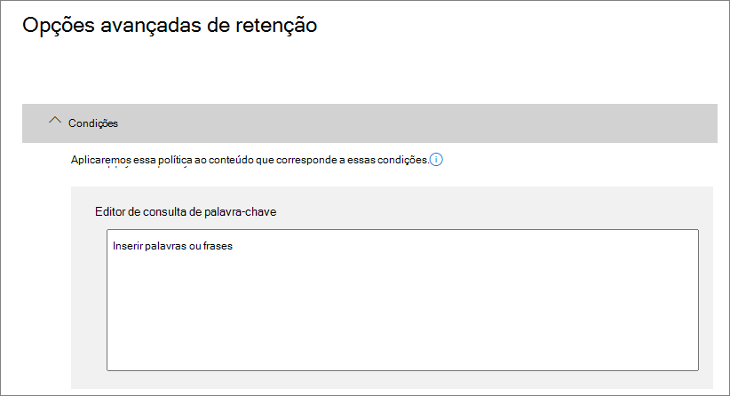
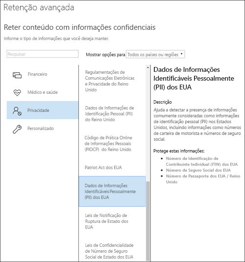

# Criar e configurar políticas de retenção

>*[Diretrizes de licenciamento do Microsoft 365 para segurança e conformidade](https://aka.ms/ComplianceSD).*

Use uma política de retenção para decidir proativamente se deseja reter o conteúdo, excluí-lo ou ambos; reter e depois excluir o conteúdo. 

Para saber mais sobre o funcionamento das políticas de retenção, confira [Saiba mais sobre políticas de retenção](retention-policies.md).

## Antes de começar

Os membros de sua equipe de conformidade que criarão e gerenciarão políticas de retenção precisam de permissões para o [Centro de Conformidade do Microsoft 365](https://compliance.microsoft.com/). Por padrão, o administrador de locatário terá acesso a esse local e pode dar acesso a outras pessoas e aos responsáveis pela conformidade, sem lhes dar todas as permissões de um administrador de locatários. Para fazer isso, recomendamos que você acesse a página **Permissões** do [Centro de Conformidade do Microsoft 365](https://compliance.microsoft.com/), edite a função **Administrador de Conformidade** e adicione membros a esse grupo de função. 

Essas permissões são necessárias somente para criar e aplicar uma política de retenção. A pessoa que configura a política de retenção não exige acesso ao conteúdo.

## Criar e configurar uma política de retenção

1. No [Centro de Conformidade do Microsoft 365](https://compliance.microsoft.com/), selecione **Políticas** > **Retenção**.

2. Selecione **Nova Política de Retenção** ou edite uma política de retenção de saída.

3. Para **Configurações**, primeiro especifique as opções de configuração para manter e excluir o conteúdo. Você pode criar uma política de retenção que apenas retenha o conteúdo sem excluir, retenha e exclua após um período especificado ou apenas exclua o conteúdo após um período especificado. Para saber mais, confira [Configurações de retenção e exclusão de conteúdo](#settings-for-retaining-and-deleting-content) nesta página:
    
    Em seguida, decida se a política de retenção deve ser aplicada a todo o conteúdo ou ao conteúdo que atenda a condições específicas. Para saber mais sobre essas configurações avançadas de retenção, confira [Configurações avançadas para identificar conteúdo que atenda a condições específicas ](#advanced-settings-to-identify-content-that-meets-specific-conditions) nesta página. 

4. Na página **Escolher locais**, selecione se a política de retenção deve ser aplicada a todos os locais suportados em sua organização ou se você deseja especificar os locais. Se você optar por locais específicos, também pode especificar inclusões e exclusões. 
    
    Para o Microsoft Teams: 
    - Você deve selecionar a opção para escolher locais específicos, se desejar excluir ou reter as mensagens do canal do Teams ou chats do Teams. Quando você seleciona uma dessas opções como locais, os outros locais são excluídos automaticamente porque uma política de retenção que inclui esses dados do Teams não pode incluir outros locais. 
    - Observe que, para **mensagens de canal do Teams**, estão incluídas mensagens de canais padrão, mas não de [canais privados](https://docs.microsoft.com/microsoftteams/private-channels). Mensagens de canais privados são incluídas para usuários como chats em grupo quando você seleciona o local dos **chats do Teams**.
    
    Para obter mais informações sobre como escolher entre uma política de retenção para a organização ou para locais específicos, confira [ Aplicar uma política de retenção a uma organização inteira ou locais específicos](#applying-a-retention-policy-to-an-entire-organization-or-specific-locations) nesta página.
    
    Para obter informações específicas para **grupos do Office 365** e **Skype for Business **, consulte as seções a seguir, [Informações de configuração de grupos do Microsoft 365 ](#configuration-information-for-microsoft-365-groups) e [Informações de configuração do Skype for Business](#configuration-information-for-skype-for-business).

5. Conclua o assistente para salvar suas configurações.

Quando você tiver mais de uma política de retenção, confira [Os princípios de retenção ou o que tem precedência?](retention-policies.md#the-principles-of-retention-or-what-takes-precedence)

### Informações de configuração de grupos do Microsoft 365

Para manter ou excluir o conteúdo de um grupo do Microsoft 365 (antigo grupo do Office 365), selecione o local **Grupos do Office 365**, ao escolher locais para sua política de retenção. Mesmo que um grupo do Microsoft 365 tenha uma caixa de correio do Exchange, uma política de retenção que inclua todo o local **E-mail do Exchange** não incluirá conteúdo nas caixas de correio de grupo do Microsoft 365. Além disso, embora o local **E-mail do Exchange** permita inicialmente especificar uma caixa de correio de grupo a ser incluída ou excluída, ao tentar salvar a política de retenção, você recebe um erro indicando que "RemoteGroupMailbox" não é uma seleção válida para o local do Exchange.

Uma política de retenção aplicada a um grupo do Microsoft 365 inclui a caixa de correio do grupo e um site. Uma política de retenção aplicada a um grupo do Microsoft 365 protege os recursos criados por um grupo do Microsoft 365, que inclui o Microsoft Teams.

### Informações de configuração do Skype for Business

Diferentemente de um email do Exchange, você não pode ativar ou desativar o status de local do Skype para incluir todos os usuários, mas pode ativar esse local e depois selecionar manualmente os usuários cujas conversas deseja manter:

  
Ao selecionar **escolher usuários**, você pode incluir rapidamente todos os usuários, selecionando a caixa **Nome** no cabeçalho da coluna. No entanto, é importante compreender que cada usuário é como uma inclusão específica na política. Portanto, se mais de 1.000 usuários forem incluídos, os limites indicados na seção anterior serão aplicáveis. Aqui, selecionar todos os usuários do Skype não é o mesmo como se uma política no âmbito da organização fosse capaz de incluir todos os usuários do Skype por padrão. 
  

  
Observe que o **Histórico da Conversa**, uma pasta no Outlook, é um recurso que não tem nada a ver com o arquivamento do Skype. **Histórico da Conversa** pode ser desativado pelo usuário final, mas o arquivamento para o Skype é feito armazenando-se uma cópia das conversas do Skype em uma pasta oculta que é inacessível ao usuário, mas disponível para Descoberta Eletrônica.

## Configurações de retenção e exclusão de conteúdo

Ao escolher as configurações de retenção e exclusão de conteúdo em sua política de retenção, sua política de retenção terá uma das seguintes configurações por um período especificado:

- Somente reter
- Reter e excluir
- Somente excluir

### Reter o conteúdo por um período específico

Ao configurar uma política de retenção, você opta por reter o conteúdo indefinidamente ou por um número específico de dias, meses ou anos. A duração para retenção do conteúdo é calculada com base na idade desse conteúdo, e não do momento em que a política de retenção foi aplicada. Você pode escolher se a idade se baseia em quando o conteúdo foi criado ou (para o OneDrive e o SharePoint) em quando ele foi modificado pela última vez.

Exemplos:
  
- SharePoint: se você quiser preservar o conteúdo em um conjunto de sites por sete anos, e se um documento nesse conjunto de sites não tiver sido modificado em seis anos, o documento será retido somente por mais um ano caso não seja modificado. Se o documento for editado novamente, a idade do documento será calculada a partir da última data de modificação, e ele ficará retido por mais sete anos.
  
- Exchange: se você deseja reter o conteúdo em uma caixa de correio por sete anos, e uma mensagem foi enviada há seis anos, esta será retida por apenas um ano. Para o conteúdo do Exchange, a idade é baseada na data de recebimento do email de entrada ou na data de envio do email de saída. O processo de reter o conteúdo com base em quando ele foi modificado pela última vez é aplicável apenas ao conteúdo de sites do OneDrive e do SharePoint.
  
No final do período de retenção, você pode escolher se deseja que o conteúdo seja excluído permanentemente:
  

  
### Como excluir conteúdo mais antigo que uma idade específica

Uma política de retenção pode reter e excluir o conteúdo ou excluir o conteúdo antigo sem retê-lo.
  
Se sua política de retenção excluir conteúdo, será importante entender que o período de tempo especificado para uma política de retenção é calculado pelo tempo em que o documento foi criado ou modificado, e não a partir do momento em que a política foi atribuída.
  

  
Por exemplo, suponha que você crie uma política de retenção que exclui o conteúdo depois de três anos e, em seguida, atribui essa política a todas as contas do OneDrive, que incluem uma grande quantidade de conteúdo criado há quatro ou cinco anos. Nesse caso, uma boa parcela do conteúdo será excluída logo depois que a política de retenção for atribuída pela primeira vez. Por esse motivo, é importante compreender que uma política de retenção que exclui conteúdo pode ter um impacto considerável sobre o seu conteúdo. 
  
Portanto, quando atribuir uma política de retenção a um conjunto de sites pela primeira vez, primeiro considere a idade do conteúdo e de que modo a política poderá afetá-los. Você também poderá informar os usuários sobre a nova política antes de atribuí-la, para que eles tenham tempo de avaliar o possível impacto. Observe esse aviso que é exibido quando você revisa as configurações da política de retenção antes de criá-la.
  

  
## Configurações avançadas para identificar conteúdo que atenda a condições específicas

Uma política de retenção pode ser aplicada a todo o conteúdo nos locais em que inclui ou você pode aplicar uma política de retenção apenas ao conteúdo que inclui palavras-chave específicas ou [tipos específicos de informações confidenciais](what-the-sensitive-information-types-look-for.md).
  

  
### Identificar conteúdo que inclui palavras-chave específicas

Você pode aplicar uma política de retenção apenas ao conteúdo que atende a condições específicas e depois realizar ações de retenção apenas nesse conteúdo. As condições disponíveis dão suporte à aplicação de uma política de retenção ao conteúdo que inclui palavras ou frases específicas. Refine a consulta usando operadores de pesquisa como AND, OR e NOT. Para saber mais sobre esses operadores, confira [Consultas de palavra-chave e critérios de pesquisa para Pesquisa de Conteúdo](keyword-queries-and-search-conditions.md).
  
O suporte à adição de propriedades pesquisáveis (por exemplo, **assunto:**) estará disponível em breve.
  
A retenção com base em consulta usa o índice de pesquisa para identificar conteúdo.
  

  
### Identificar conteúdo com informações confidenciais

Você também pode aplicar uma política de retenção apenas ao conteúdo que inclui [tipos específicos de informações confidenciais](what-the-sensitive-information-types-look-for.md). Por exemplo, você pode optar por aplicar exigências de retenção exclusivas somente ao conteúdo com informações de identificação pessoal (PII) como números de identificação de contribuinte, números de CPF ou números de passaporte.
  

  
Observações:
  
- A retenção avançada para informações confidenciais não se aplica a pastas públicas do Exchange ou Skype for Business, pois esses locais não dão suporte a tipos de informações confidenciais.
    
- O Exchange Online usa regras de fluxo de email (também conhecidas como regras de transporte) para identificar informações confidenciais, portanto, isso funciona apenas em mensagens em trânsito, e não em todos os itens já armazenados em uma caixa de correio. Para o Exchange Online, isso significa que uma política de retenção pode identificar informações confidenciais e realizar ações de retenção apenas em mensagens recebidas **após** a aplicação da política à caixa de correio. A retenção com base em consulta descrita na seção anterior não apresenta essa limitação, pois ela usa o índice de pesquisa para identificar conteúdo. 
    
## Aplicar uma política de retenção a uma organização inteira ou locais específicos

Você pode facilmente aplicar uma política de retenção a uma organização inteira, locais inteiros ou apenas a locais ou usuários específicos.
  
### Política no âmbito da organização

Um dos recursos mais avançados de política de retenção é que, por padrão, aplica-se aos locais no Microsoft 365, incluindo:
  
- Email do Exchange
    
- Conjuntos de sites do SharePoint
    
- Contas do OneDrive
    
- Grupos do Microsoft 365 (aplicável ao conteúdo da caixa de correio do grupo e ao site do SharePoint associado.)
    
- Pastas públicas do Exchange
    

Outros recursos importantes de uma política de retenção no âmbito da organização incluem:
  
- Não há um limite para o número de caixas de correio ou sites que essa política pode incluir.
    
- Para o Exchange, as caixas de correio criadas após a aplicação da política herdam a política automaticamente.
  
### Uma política aplicável a locais inteiros

Ao escolher locais, você pode facilmente incluir ou excluir um local inteiro, como emails do Exchange ou contas do OneDrive. Para fazer isso, ative ou desative o **Status** desse local. 
  
Como uma política no âmbito da organização, se uma política for aplicada a qualquer combinação de locais inteiros, não haverá limite para o número de caixas de correio ou sites que ela pode incluir. 

Por exemplo, se uma política incluir todos os emails do Exchange e sites do SharePoint, todos os sites e caixas de correio serão incluídos, independentemente da quantidade. Além disso, no caso do Exchange, todas as caixas de correio criadas após a aplicação da política herdam a política automaticamente.

### Uma política com inclusões ou exclusões específicas

Você também pode aplicar uma política de retenção a usuários específicos, grupos específicos do Microsoft 365 ou sites específicos. Para fazer isso, ative o **Status** desse local e, em seguida, use os links para incluir ou excluir usuários específicos, grupos do Microsoft 365 ou sites. 
  
No entanto, usando essa configuração, há alguns limites quando sua política de retenção inclui ou exclui mais de 1.000 locais específicos:
  
- Números máximos da política de retenção:
    - 1.000 caixas de correio
    - 1.000 grupos do Microsoft 365
    - 1.000 usuários para conversas privadas do Teams
    - 100 sites (OneDrive ou SharePoint)

Há um número máximo de políticas com suporte para um locatário: 10.000. Esses itens incluem políticas de retenção, políticas de rótulo de retenção e políticas de retenção de aplicação automática.

Se é provável que suas políticas de retenção estejam sujeitas a essas limitações, escolha as opções de configuração que se aplicam a locais inteiros ou use uma política em toda a organização.

## Atualizar políticas de retenção

Se você editar uma política de retenção e o conteúdo já estiver sujeito às configurações originais da sua política de retenção, as configurações atualizadas serão aplicadas automaticamente a esse conteúdo, além do conteúdo identificado recentemente.

Geralmente, essa atualização é bastante rápida, mas pode levar vários dias. Quando a replicação da política nos locais do Microsoft 365 estiver concluída, você verá o status da política de retenção no Centro de Conformidade do Microsoft 365 mudar de **Ativado (Pendente)** para **Ativado (Sucesso)**.

## Localizar os cmdlets do PowerShell para políticas de retenção

Para usar os cmdlets de políticas de retenção:
  
1. [Conecte-se ao PowerShell do Centro de Conformidade e Segurança do Office 365](https://docs.microsoft.com/powershell/exchange/office-365-scc/connect-to-scc-powershell/connect-to-scc-powershell)
    
2. Use esses cmdlets do Centro de Conformidade e Segurança do Office 365
    
    - [Get-RetentionCompliancePolicy](https://docs.microsoft.com/powershell/module/exchange/policy-and-compliance-retention/get-retentioncompliancepolicy)
    
    - [New-RetentionCompliancePolicy](https://docs.microsoft.com/powershell/module/exchange/policy-and-compliance-retention/new-retentioncompliancepolicy)
    
    - [Remove-RetentionCompliancePolicy](https://docs.microsoft.com/powershell/module/exchange/policy-and-compliance-retention/remove-retentioncompliancepolicy)
    
    - [Set-RetentionCompliancePolicy](https://docs.microsoft.com/powershell/module/exchange/policy-and-compliance-retention/set-retentioncompliancepolicy)
    
    - [Get-RetentionComplianceRule](https://docs.microsoft.com/powershell/module/exchange/policy-and-compliance-retention/get-retentioncompliancerule)
    
    - [New-RetentionComplianceRule](https://docs.microsoft.com/powershell/module/exchange/policy-and-compliance-retention/new-retentioncompliancerule)
    
    - [Remove-RetentionComplianceRule](https://docs.microsoft.com/powershell/module/exchange/policy-and-compliance-retention/remove-retentioncompliancerule)
    
    - [Set-RetentionComplianceRule](https://docs.microsoft.com/powershell/module/exchange/policy-and-compliance-retention/set-retentioncompliancerule)

## Bloquear uma política de retenção usando o Windows PowerShell

Você deve usar o Windows PowerShell se precisar usar o [Bloqueio de Preservação](retention-policies.md#use-preservation-lock-to-comply-with-regulatory-requirements) para atender aos requisitos regulamentares.

1. [Conecte-se ao Windows PowerShell do Centro de Segurança e Conformidade do Office 365](https://docs.microsoft.com/powershell/exchange/office-365-scc/connect-to-scc-powershell/connect-to-scc-powershell?view=exchange-ps).

2. Liste suas políticas de retenção e encontre o nome da política que você quer bloquear executando `Get-RetentionCompliancePolicy`.
    
    
    
3. Coloque um Bloqueio de Preservação em uma política de retenção, execute `Set-RetentionCompliancePolicy` com o parâmetro `RestrictiveRetention` definido como verdadeiro. Por exemplo:
    
        Set-RetentionCompliancePolicy -Identity "<Name of Policy>" – RestrictiveRetention $true
    
    
    
    Depois de executar esse cmdlet, escolha **Sim para Todos**:
    
    

O Bloqueio de Preservação agora está localizado na política de retenção. Se executar `Get-RetentionCompliancePolicy`, o parâmetro `RestrictiveRetention` é definido como verdadeiro. Por exemplo:

`Get-RetentionCompliancePolicy -Identity "<Name of Policy>" |Fl`

  

