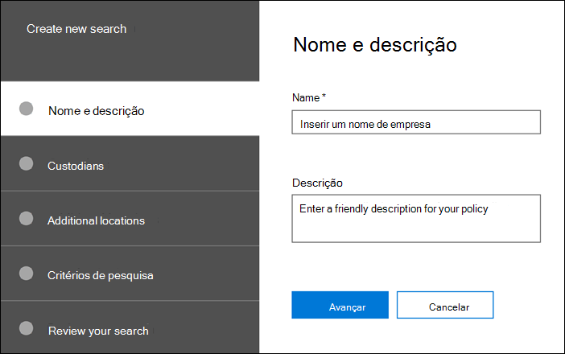

# Criar uma pesquisaCreate a search

Na guia **pesquisas** do seu caso, você pode criar uma nova pesquisa clicando em **nova pesquisa** e seguindo o assistente.On the **Searches** tab in your case, you can create a new search by clicking **New search** and following the wizard.

## Nomeie a pesquisa e dê a ela uma descriçãoName the search and give it a description

Cada pesquisa com uma ocorrência deve ter um nome exclusivo.Each search with a case should have a unique name. Opcionalmente, você pode fornecer uma descrição para sua pesquisa.You can optionally provide a description for your search. 

## Escolha os locais dos responsáveis e custodial de pesquisaChoose the custodians and custodial locations to search

Escolha os locais de conteúdo dos responsáveis pela pesquisa, especificando os responsáveis que você adicionou ao caso.Choose custodian content locations to search by specifying that custodians you have added to the case. Ao selecionar um responsáveis, você executará a pesquisa em todas as fontes de dados mapeadas para os responsáveis.By selecting a custodian, you will run the search against all data sources mapped to the custodian. Você também tem a opção de restringir a pesquisa a fontes de dados selecionadas para cada um dos responsáveis.You also have the option to narrow the search to selected data sources for each custodian. Para obter mais informações sobre como adicionar os responsáveis e gerenciar suas fontes de dados, consulte [trabalhar com os responsáveis](managing-custodians.md).For more information about how to add custodians and manage their data sources, see [Work with custodians](managing-custodians.md).

## Escolher locais não custodialChoose non-custodial locations

Em alguns casos, talvez você queira Pesquisar fontes de dados que não estão associadas a um determinado.In some cases, you may want to search data sources that are not associated with a custodian. Nesse caso, você pode especificar os locais que deseja pesquisar ou optar por pesquisar todos os locais de conteúdo de um serviço específico da Microsoft (como pesquisar todas as caixas de correio do Exchange ou todos os sites do SharePoint e contas do OneDrive).In this case, you can specify the locations you want to search, or choose to search all content locations for a specific Microsoft service (such as searching all Exchange mailboxes or all SharePoint sites and OneDrive accounts).

## Definir a consulta de pesquisa e condiçõesDefine the search query and conditions

Você pode definir a consulta de palavras-chave e quaisquer condições para a pesquisa usando os cartões de condição pré-criados ou usando o idioma de consulta de palavra-chave (KQL).You can define the keywords query and any conditions for the search by using the pre-built condition cards or using Keyword Query Language (KQL). Para obter mais informações, consulte [Build Search queries](building-search-queries.md).For more information, see [Build search queries](building-search-queries.md).
