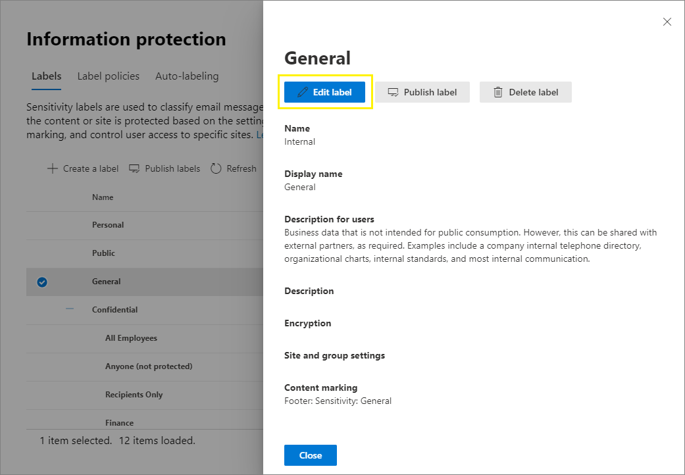
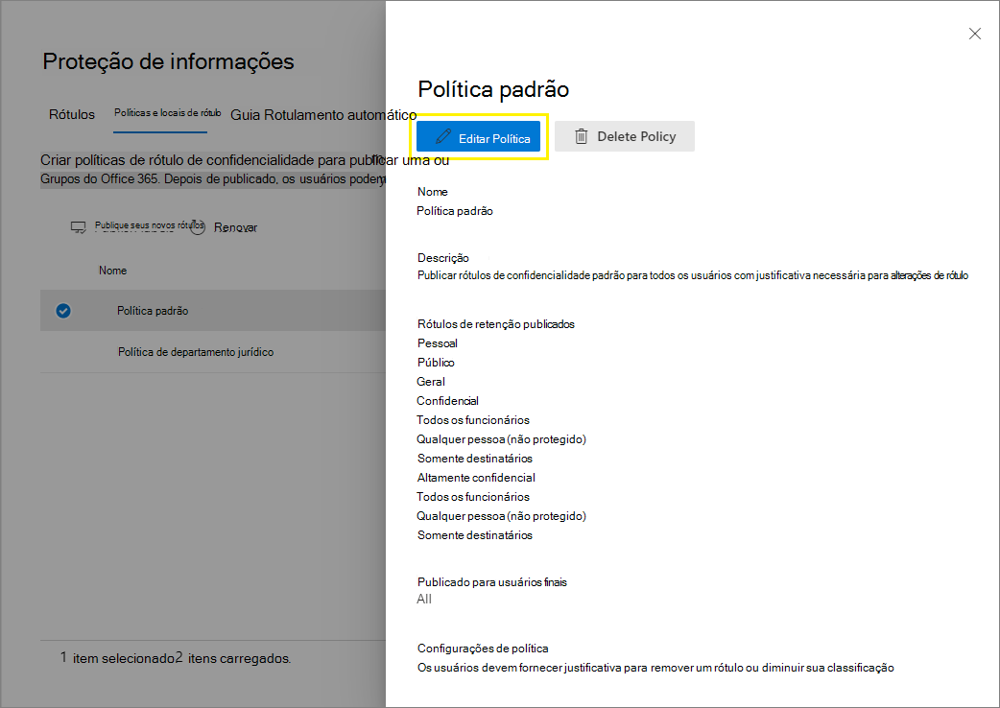

# <a name="create-and-configure-sensitivity-labels-and-their-policies"></a>Criar e configurar rótulos de confidencialidade e suas políticas

>*[Diretrizes de licenciamento do Microsoft 365 para segurança e conformidade](/office365/servicedescriptions/microsoft-365-service-descriptions/microsoft-365-tenantlevel-services-licensing-guidance/microsoft-365-security-compliance-licensing-guidance).*

Todas as soluções de proteção de informações da Microsoft (às vezes abreviadas para MIP) são implementadas usando [rótulos de sensibilidade](sensitivity-labels.md). Para criar e publicar seus rótulos de confidencialidade, vá para o centro de administração de rótulo, como o [centro de conformidade do Microsoft 365](https://compliance.microsoft.com/). Você também pode usar o centro de segurança do Microsoft 365 ou o Centro de Conformidade e Segurança.

Primeiro, crie e configure os rótulos de confidencialidade que você deseja disponibilizar nos aplicativos e outros serviços. Por exemplo, os rótulos que você deseja que os usuários vejam e se apliquem a partir dos aplicativos do Office. 

Em seguida, crie uma mais políticas de rótulos que contenham os rótulos e as configurações de política que você configurar. É a política de rótulos que publica os rótulos e as configurações dos seus usuários e locais selecionados.

## <a name="before-you-begin"></a>Antes de começar

O administrador global da sua organização tem permissões completas para criar e gerenciar todos os aspectos de rótulos de sensibilidade. Se você não estiver entrando como um administrador global do, confira [permissões necessárias para criar e gerenciar os rótulos de confidencialidade](get-started-with-sensitivity-labels.md#permissions-required-to-create-and-manage-sensitivity-labels).

## <a name="create-and-configure-sensitivity-labels"></a>Criar e configurar rótulos de confidencialidade

1. No centro de administração de rótulos, navegue até os rótulos de confidencialidade:
    
    - Centro de conformidade do Microsoft 365: 
        - **Proteção de Informações** > **de soluções**
        
        Se você não vir essa opção imediatamente, selecione primeiro **Mostrar tudo**. 
    
    - Centro de segurança do Microsoft 365: 
        - **Rótulos de confidencialidade** > **de Classificação**
    
    - Centro de Conformidade e Segurança:
        - **Rótulos de confidencialidade** > **de Classificação**

2. Na página de **Rótulos**, selecione **+ Criar um rótulo** para iniciar o assistente “Novo rótulo de confidencialidade”. 
    
    Por exemplo, no Centro de Conformidade do Microsoft 365:
    
    
    
    > [!NOTE]
    > Por padrão, os locatários não têm rótulos e você deve criá-los. Os rótulos na imagem de exemplo mostram rótulos padrão que foram [migrados do sistema de Proteção de Informações do Azure](/azure/information-protection/configure-policy-migrate-labels).

3. Na página **Definir o escopo deste rótulo**, as opções selecionadas determinam o escopo do rótulo para as configurações que você pode definir e onde eles estarão visíveis quando forem publicados:
    
    
    
    - Se **Arquivos e emails** estiver selecionado, você pode definir as configurações neste assistente que se aplicam a aplicativos que oferecem suporte a rótulos de confidencialidade, como Office Word e Outlook. Se essa opção não for selecionada, o assistente exibe a primeira página dessas configurações, mas você não pode configurá-las e os rótulos não estarão disponíveis para os usuários selecionarem nesses aplicativos.
    
    - Se **Grupos e sites** for selecionado, você pode definir as configurações neste assistente que se aplicam a grupos do Microsoft 365 e sites do Microsoft Teams e Microsoft Office SharePoint Online. Se essa opção não for selecionada, o assistente exibirá a primeira página dessas configurações, mas você não pode configurá-las e os rótulos não estarão disponíveis para os usuários selecionarem para grupos e site.
    
    Para obter informações sobre o escopo de ativos do **Azure Purview (pré-visualização)**, confira [Rotular automaticamente o conteúdo no Azure Purview](/azure/purview/create-sensitivity-label).

4. Siga as solicitações do assistente para as configurações do rótulo.
    
    Para obter mais informações sobre configurações de rótulos, confira o link [O que os rótulos de confidencialidade podem fazer](sensitivity-labels.md#what-sensitivity-labels-can-do) no resumo de informações e use a Ajuda do assistente para configurações individuais.

5. Repita essas etapas para criar mais rótulos. Entretanto, se você deseja criar um subrótulo, selecione primeiro o rótulo pai e selecione **...** para **Mais ações** e selecione **Adicionar subrótulo**.

6. Quando você tiver criado todos os rótulos necessários, examine a ordem deles e, se necessário, mova-os para cima ou para baixo. Para alterar a ordem de um rótulo, selecione **...** para **Mais ações** e depois selecione **Mover para cima** ou **Mover para baixo**. Para saber mais, confira [Prioridade de rótulo (a ordem importa)](sensitivity-labels.md#label-priority-order-matters) nas informações gerais.

Para editar um rótulo existente, selecione-o e depois selecione o botão **Editar rótulo**:



Este botão inicia o assistente **Editar rótulo de confidencialidade**, que permite alterar todas as configurações de rótulo na etapa 4.

Não exclua um rótulo se não estiver ciente do impacto dessa exclusão sobre os usuários. Para obter mais informações, confira a seção [Como remover e excluir rótulos](#removing-and-deleting-labels). 

> [!NOTE]
> Se você editar um rótulo que já foi publicado usando uma política de rótulo, etapas adicionais não serão necessárias quando você concluir o assistente. Por exemplo, não é necessário adicioná-lo a uma nova política de rótulos para que as alterações fiquem disponíveis para os mesmos usuários. No entanto, aguarde até 24 horas para que as alterações sejam replicadas em todos os aplicativos e serviços.

Até que você publique seus rótulos, eles não estarão disponíveis para seleção em aplicativos ou em serviços. Para publicar os rótulos, eles dever ser [adicionados a uma política de rótulos](#publish-sensitivity-labels-by-creating-a-label-policy).

> [!IMPORTANT]
> Na guia **Rótulos**, não selecione a guia **Publicar rótulos** (ou o botão **Publicar rótulo** ao editar um rótulo), a menos que você precise criar uma nova política de rótulo. Você precisará de várias políticas de rótulo somente se os usuários precisarem de rótulos diferentes ou configuracoes de política diferentes. Tenha como objetivo ter o menor número de rótulos possível—não é incomum ter apenas uma politica de rótulo para a organização.

### <a name="additional-label-settings-with-security--compliance-center-powershell"></a>Configurações adicionais de rótulo com o PowerShell do Centro de Conformidade e Segurança

As configurações adicionais de rótulo estão disponíveis com o cmdlet [Set-Label](/powershell/module/exchange/set-label) do [PowerShell do Centro de Conformidade e Segurança](/powershell/exchange/scc-powershell).

Por exemplo:

- Use o parâmetro *LocaleSettings* para implantações multinacionais, assim os usuários podem ver o nome do rótulo e a dica de ferramenta no idioma local. A[seguinte seção](#example-configuration-to-configure-a-sensitivity-label-for-different-languages) tem um exemplo de configuração que especifica o nome do rótulo e o texto da dica de ferramenta em francês, italiano e alemão.

- Apenas para o cliente de rotulagem unificada do Proteção de Informações do Azure, especifique [configurações avançadas](/azure/information-protection/rms-client/clientv2-admin-guide-customizations) que incluem definir uma cor de rótulo e aplicar uma propriedade personalizada quando um rótulo é aplicado. Para obter a lista completa, confira [Configurações avançadas disponíveis para rótulos](/azure/information-protection/rms-client/clientv2-admin-guide-customizations#available-advanced-settings-for-labels) da guia de administração deste cliente.

#### <a name="example-configuration-to-configure-a-sensitivity-label-for-different-languages"></a>Configuração de exemplo para configurar um rótulo de configurar em idiomas diferentes

O exemplo a seguir mostra a configuração do PowerShell para um rótulo chamado "Público" com o texto de espaço reservado para a dica de ferramenta. Neste exemplo, o nome do rótulo e o texto da dica de ferramenta estão configurados em francês, italiano e alemão.

Como resultado dessa configuração, os usuários com aplicativos do Office que usam tais idiomas de exibição verão seus nomes de etiqueta e as dicas de ferramentas no mesmo idioma. Da mesma forma, se você tiver o cliente de rotulagem unificado da Proteção de Informações do Azure instalado para rotular arquivos do Explorador de Arquivos, os usuários que tiverem essas versões de idioma do Windows verão os nomes de etiqueta e as dicas de ferramenta no idioma local deles quando usarem o clique com o botão direito do mouse para rotular.

Para os idiomas para os quais você precisa oferecer suporte, use os [identificadores de idiomas](/deployoffice/office2016/language-identifiers-and-optionstate-id-values-in-office-2016#language-identifiers) do Office (também conhecidos como marcas de idioma) e especifique a sua própria tradução para o rótulo e para a dica de ferramenta.

Antes de executar os comandos no PowerShell, você dever primeiro [conectar-se com o Centro de Segurança e Conformidade do PowerShell](/powershell/exchange/connect-to-scc-powershell).


```powershell
$Languages = @("fr-fr","it-it","de-de")
$DisplayNames=@("Publique","Publico","Oeffentlich")
$Tooltips = @("Texte Français","Testo italiano","Deutscher text")
$label = "Public"
$DisplayNameLocaleSettings = [PSCustomObject]@{LocaleKey='DisplayName';
Settings=@(
@{key=$Languages[0];Value=$DisplayNames[0];}
@{key=$Languages[1];Value=$DisplayNames[1];}
@{key=$Languages[2];Value=$DisplayNames[2];})}
$TooltipLocaleSettings = [PSCustomObject]@{LocaleKey='Tooltip';
Settings=@(
@{key=$Languages[0];Value=$Tooltips[0];}
@{key=$Languages[1];Value=$Tooltips[1];}
@{key=$Languages[2];Value=$Tooltips[2];})}
Set-Label -Identity $Label -LocaleSettings (ConvertTo-Json $DisplayNameLocaleSettings -Depth 3 -Compress),(ConvertTo-Json $TooltipLocaleSettings -Depth 3 -Compress)
```

## <a name="publish-sensitivity-labels-by-creating-a-label-policy"></a>Publicar rótulos de confidencialidade criando uma política de rótulo

1. No centro de administração de rótulos, navegue até os rótulos de confidencialidade:
    
    - Centro de conformidade do Microsoft 365: 
        - **Proteção de Informações** > **de soluções**
        
        Se você não vir essa opção imediatamente, selecione primeiro **Mostrar tudo**. 
    
    - Centro de segurança do Microsoft 365: 
        - **Rótulos de confidencialidade** > **de Classificação**
    
    - Centro de Conformidade e Segurança:
        - **Rótulos de confidencialidade** > **de Classificação**

2. Selecione a guia **Políticas de rótulos** e, a seguir, **Publicar rótulos** para iniciar o assistente de criação de políticas:
    
    Por exemplo, no Centro de Conformidade do Microsoft 365:
        
    
    
    > [!NOTE]
    > Por padrão, os locatários não têm nenhuma política de rótulo e você deve criá-los. 

3. No assistente, selecione **Escolha os rótulos de confidencialidade que deseja publicar**. Selecione os rótulos que você deseja disponibilizar nos aplicativos e serviços, e selecione **Adicionar**.
    
    > [!IMPORTANT]
    > Se você selecionar um subrótulo, certifique-se de também selecionar seu rótulo pai.
    
4. Examine os rótulos selecionados, e para fazer alterações, selecione **Editar**. Caso contrário, selecione **Próximo**.

5. Siga as notificações para definir as configurações de política.
    
    As configurações de política que você vê correspondem ao escopo dos rótulos que você selecionou. Por exemplo, se você selecionou rótulos que têm apenas o escopo **Arquivos e emails**, não verá as configurações de política **Aplicar este rótulo por padrão a grupos e sites** e **Exigir que os usuários apliquem um rótulo a seus grupos e sites**.
    
    Para obter mais informações sobre essas configurações, confira o link [O que as políticas de rótulos podem fazer](sensitivity-labels.md#what-label-policies-can-do) no resumo de informações e use a Ajuda do assistente para configurações individuais.
    
    Para rótulos configurados para ativos do **Azure Purview (pré-visualização)**: esses rótulos não têm nenhuma configuração de política associada.

7. Repita essas etapas se precisar de configurações de política diferentes para usuários ou escopos diferentes. Por exemplo, você deseja rótulos adicionais para um grupo de usuários ou um rótulo padrão diferente para um subconjunto de usuários. Ou, se você configurou rótulos para diferentes escopos.

8. Se você criar mais de uma política de rótulo que possa resultar em conflito para um usuário, revise a ordem da política e, se necessário, mova-a para cima ou para baixo. Para alterar a ordem de uma política de rótulo, selecione **...** para **Mais ações** e depois selecione **Mover para cima** ou **Mover para baixo**. Para saber mais, confira [Prioridade das políticas de rótulo (a ordem é importante)](sensitivity-labels.md#label-policy-priority-order-matters) nas informações gerais.

Concluir o assistente publica automaticamente a política de rótulo. Para fazer alterações em uma política publicada, basta editá-la. Não há uma ação específica de publicação ou republicação para selecionar.

Para editar uma política de rótulo existente, selecione-a e, em seguida, selecione o botão **Editar Política**: 



Esse botão dá início ao assistente **Criar política**, que permite editar quais rótulos estão incluídos e as configurações de rótulo. Quando você concluir o assistente, todas as alterações serão replicadas automaticamente para os usuários e serviços selecionados.

Quando você usa rótulos integrados para aplicativos do Office no Windows, macOS, iOS e Android, os usuários veem os novos rótulos em quatro horas e em uma hora para Word, Excel e PowerPoint na web quando você atualiza o navegador. No entanto, aguarde até 24 horas para que as alterações sejam replicadas em todos os aplicativos e serviços.

### <a name="additional-label-policy-settings-with-security--compliance-center-powershell"></a>Configurações adicionais de políticas de rótulo com o PowerShell do Centro de Conformidade e Segurança

As configurações adicionais de políticas de rótulo estão disponíveis com o cmdlet [Set-LabelPolicy](/powershell/module/exchange/set-labelpolicy) do [Centro de Conformidade e Segurança do PowerShell](/powershell/exchange/scc-powershell).

Somente para o cliente com rótulo unificado de Proteção de Informações do Microsoft Azure, você pode especificar [configurações avançadas](/azure/information-protection/rms-client/clientv2-admin-guide-customizations) que incluem a configuração de um rótulo padrão diferente para o Outlook, e implementar mensagens pop-up no Outlook que avisam, justificam ou bloqueiam os emails a serem enviados. Para obter a lista completa, confira [Configurações avançadas disponíveis para políticas de rótulos](/azure/information-protection/rms-client/clientv2-admin-guide-customizations#available-advanced-settings-for-label-policies) da guia de administração deste cliente.

## <a name="use-powershell-for-sensitivity-labels-and-their-policies"></a>Usar o PowerShell para rótulos de confidencialidade e suas políticas

Agora você pode usar o [Centro de Conformidade e Segurança do PowerShell](/powershell/exchange/scc-powershell) para criar e configurar todas as configurações que você vê no seu centro de administração de rótulos. Isso significa que, além de usar o PowerShell para configurações que não estão disponíveis nos centros de administração de rótulos, agora você pode criar scripts para a criação e a manutenção de rótulos de confidencialidade e políticas de rótulo de confidencialidade. 

Confira a seguinte documentação para os parâmetros e valores com suporte:

- [New-Label](/powershell/module/exchange/new-label)
- [New-LabelPolicy](/powershell/module/exchange/new-labelpolicy)
- [Set-Label](/powershell/module/exchange/set-label)
- [Set-LabelPolicy](/powershell/module/exchange/set-labelpolicy)

Você também pode usar [Remove-Label](/powershell/module/exchange/remove-label) e [Remove-LabelPolicy](/powershell/module/exchange/remove-labelpolicy) se precisar criar scripts para a exclusão de rótulos de rótulos de confidencialidade ou políticas de rótulo de confidencialidade. No entanto, antes de você excluir os rótulos de confidencialidade, certifique-se de ler a seguinte.

## <a name="removing-and-deleting-labels"></a>Remover e excluir rótulos

Em um ambiente de produção, é improvável que você precise remover ou excluir rótulos de confidencialidade de uma política de rótulo. É mais provável que você precise fazer uma dessas ações durante uma fase de testes inicial. Certifique-se de entender o que acontece ao fazer qualquer uma dessas ações.

É menos arriscado remover um rótulo de uma política de rótulo do que eliminá-lo, e sempre será possível adicioná-lo novamente, se necessário:

- Ao remover um rótulo de uma política de rótulo para que ele não seja mais publicado para os usuários especificados originalmente, da próxima vez que a política for atualizada, os usuários não o verão mais no aplicativo do Office. No entanto, se o rótulo foi aplicado a documentos ou emails, ele não é removido desse conteúdo. Qualquer criptografia aplicada pelo rótulo permanecerá e o modelo de proteção subjacente permanecerá publicado. 

- Para rótulos removidos mas que foram previamente aplicados ao conteúdo, os usuários que usam rótulos internos para Word, Excel e PowerPoint, ainda verão o nome do rótulo aplicado na barra de status. Da mesma forma, os rótulos removidos que foram aplicados aos sites do SharePoint ainda exibem o nome do rótulo na coluna **Confidencialidade**.

Em comparação, ao excluir um rótulo:

- Se uma criptografia foi aplicada pelo rótulo, o modelo de proteção subjacente é arquivado para que o conteúdo previamente protegido ainda possa ser aberto. Devido a esse modelo de proteção arquivado, não será possível criar uma novo rótulo com o mesmo nome. Embora seja possível excluir um modelo de proteção usando o [PowerShell](/powershell/module/aipservice/remove-aipservicetemplate), não faça isso, a menos que tenha certeza de que não precisará abrir conteúdos criptografados com o modelo arquivado.

- Para aplicativos da área de trabalho: as informações do rótulo nos metadados permanecem, mas como não será mais possível usar uma ID de rótulo para mapeamento de nomes, os usuários não verão o nome do rótulo aplicado (por exemplo, na barra de status), então os usuários assumirão que o conteúdo não foi rotulado. Se uma criptografia foi aplicada pelo rótulo, a criptografia permanecerá e quando o conteúdo for aberto, os usuários ainda verão o nome e a descrição do modelo de proteção agora arquivado.

- Para o Office na Web: os usuários não verão o nome do rótulo na barra de status ou na coluna **Confidencialidade**. As informações do rótulo nos metadados permanecem somente se o ele não tiver aplicado criptografia. Se uma criptografia foi aplicada pelo rótulo e você habilitou [rótulos de confidencialidade para o SharePoint e o Onedrive](sensitivity-labels-sharepoint-onedrive-files.md), as informações do rótulo nos metadados serão removidas e a criptografia será removida. 

Quando você remove um rótulo de confidencialidade de uma política de rótulo ou exclui um rótulo de confidencialidade, essas alterações podem levar até uma hora para serem replicadas para todos os usuários e serviços.

## <a name="next-steps"></a>Próximas etapas

Para configurar e usar seus rótulos de confidencialidade em cenários específicos, use os seguintes artigos:

- [Restringir o acesso ao conteúdo usando criptografia nos rótulos de confidencialidade](encryption-sensitivity-labels.md)

- [Aplicar um rótulo de confidencialidade automaticamente ao conteúdo](apply-sensitivity-label-automatically.md)

- [Usar rótulos de confidencialidade para equipes, grupos e sites](sensitivity-labels-teams-groups-sites.md)

- [Habilitar rótulos de confidencialidade para arquivos do Office no SharePoint e no OneDrive](sensitivity-labels-sharepoint-onedrive-files.md)

Para monitorar como os rótulos estão sendo usados, confira [Introdução à classificação de dados](data-classification-overview.md).