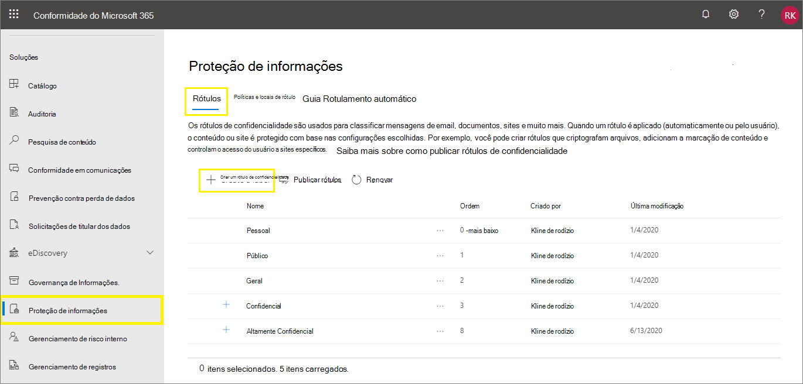

# <a name="create-and-configure-sensitivity-labels-and-their-policies"></a><span data-ttu-id="d8842-103">Criar e configurar rótulos de confidencialidade e suas políticas</span><span class="sxs-lookup"><span data-stu-id="d8842-103">Create and configure sensitivity labels and their policies</span></span>

><span data-ttu-id="d8842-104">*[Diretrizes de licenciamento do Microsoft 365 para segurança e conformidade](https://aka.ms/ComplianceSD).*</span><span class="sxs-lookup"><span data-stu-id="d8842-104">*[Microsoft 365 licensing guidance for security & compliance](https://aka.ms/ComplianceSD).*</span></span>

<span data-ttu-id="d8842-105">Todas as soluções de proteção de informações da Microsoft (às vezes abreviadas para MIP) são implementadas usando [rótulos de sensibilidade](sensitivity-labels.md).</span><span class="sxs-lookup"><span data-stu-id="d8842-105">All Microsoft Information Protection solutions (sometimes abbreviated to MIP) are implemented by using [sensitivity labels](sensitivity-labels.md).</span></span> <span data-ttu-id="d8842-106">Para criar e publicar seus rótulos de confidencialidade, vá para o centro de administração de rótulo, como o [centro de conformidade do Microsoft 365](https://compliance.microsoft.com/).</span><span class="sxs-lookup"><span data-stu-id="d8842-106">To create and publish these labels, go to your labeling admin center, such as the [Microsoft 365 compliance center](https://compliance.microsoft.com/).</span></span> <span data-ttu-id="d8842-107">Você também pode usar o centro de segurança do Microsoft 365 ou o Centro de Conformidade e Segurança.</span><span class="sxs-lookup"><span data-stu-id="d8842-107">You can also use the Microsoft 365 security center, or the Security & Compliance Center.</span></span>

<span data-ttu-id="d8842-108">Primeiro, crie e configure os rótulos de confidencialidade que você deseja disponibilizar nos aplicativos e outros serviços.</span><span class="sxs-lookup"><span data-stu-id="d8842-108">First, create and configure the sensitivity labels that you want to make available for apps and other services.</span></span> <span data-ttu-id="d8842-109">Por exemplo, os rótulos que você deseja que os usuários vejam e se apliquem a partir dos aplicativos do Office.</span><span class="sxs-lookup"><span data-stu-id="d8842-109">For example, the labels you want users to see and apply from Office apps.</span></span> 

<span data-ttu-id="d8842-110">Em seguida, crie uma mais políticas de rótulos que contenham os rótulos e as configurações de política que você configurar.</span><span class="sxs-lookup"><span data-stu-id="d8842-110">Then, create one or more label policies that contain the labels and policy settings that you configure.</span></span> <span data-ttu-id="d8842-111">É a política de rótulos que publica os rótulos e as configurações dos seus usuários e locais selecionados.</span><span class="sxs-lookup"><span data-stu-id="d8842-111">It's the label policy that publishes the labels and settings for your chosen users and locations.</span></span>

## <a name="before-you-begin"></a><span data-ttu-id="d8842-112">Antes de começar</span><span class="sxs-lookup"><span data-stu-id="d8842-112">Before you begin</span></span>

<span data-ttu-id="d8842-113">O administrador global da sua organização tem permissões completas para criar e gerenciar todos os aspectos de rótulos de sensibilidade.</span><span class="sxs-lookup"><span data-stu-id="d8842-113">The global admin for your organization has full permissions to create and manage all aspects of sensitivity labels.</span></span> <span data-ttu-id="d8842-114">Se você não estiver entrando como um administrador global do, confira [permissões necessárias para criar e gerenciar os rótulos de confidencialidade](get-started-with-sensitivity-labels.md#permissions-required-to-create-and-manage-sensitivity-labels).</span><span class="sxs-lookup"><span data-stu-id="d8842-114">If you aren't signing in as a global admin, see [Permissions required to create and manage sensitivity labels](get-started-with-sensitivity-labels.md#permissions-required-to-create-and-manage-sensitivity-labels).</span></span>

## <a name="create-and-configure-sensitivity-labels"></a><span data-ttu-id="d8842-115">Criar e configurar rótulos de confidencialidade</span><span class="sxs-lookup"><span data-stu-id="d8842-115">Create and configure sensitivity labels</span></span>

1. <span data-ttu-id="d8842-116">No centro de administração de rótulos, navegue até os rótulos de confidencialidade:</span><span class="sxs-lookup"><span data-stu-id="d8842-116">In your labeling admin center, navigate to sensitivity labels:</span></span>
    
    - <span data-ttu-id="d8842-117">Centro de conformidade do Microsoft 365:</span><span class="sxs-lookup"><span data-stu-id="d8842-117">Microsoft 365 compliance center:</span></span> 
        - <span data-ttu-id="d8842-118">**Proteção de Informações** > \*\* de soluções \*\*</span><span class="sxs-lookup"><span data-stu-id="d8842-118">**Solutions** > **Information protection**</span></span>
        
        <span data-ttu-id="d8842-119">Se você não vir essa opção imediatamente, selecione primeiro **Mostrar tudo**.</span><span class="sxs-lookup"><span data-stu-id="d8842-119">If you don't immediately see this option, first select **Show all**.</span></span> 
    
    - <span data-ttu-id="d8842-120">Centro de segurança do Microsoft 365:</span><span class="sxs-lookup"><span data-stu-id="d8842-120">Microsoft 365 security center:</span></span> 
        - <span data-ttu-id="d8842-121">**Rótulos de confidencialidade** > \*\* de Classificação\*\*</span><span class="sxs-lookup"><span data-stu-id="d8842-121">**Classification** > **Sensitivity labels**</span></span>
    
    - <span data-ttu-id="d8842-122">Centro de Conformidade e Segurança:</span><span class="sxs-lookup"><span data-stu-id="d8842-122">Security & Compliance Center:</span></span>
        - <span data-ttu-id="d8842-123">**Rótulos de confidencialidade** > \*\* de Classificação\*\*</span><span class="sxs-lookup"><span data-stu-id="d8842-123">**Classification** > **Sensitivity labels**</span></span>

2. <span data-ttu-id="d8842-124">Na página de **Rótulos**, selecione **+ Criar um rótulo** para iniciar o assistente “Novo rótulo de confidencialidade”.</span><span class="sxs-lookup"><span data-stu-id="d8842-124">On the **Labels** page, select **+ Create a label** to start the New sensitivity label wizard.</span></span> 
    
    <span data-ttu-id="d8842-125">Por exemplo, no Centro de Conformidade do Microsoft 365:</span><span class="sxs-lookup"><span data-stu-id="d8842-125">For example, from the Microsoft 365 compliance center:</span></span>
    
    
    
    <span data-ttu-id="d8842-127">Observação: por padrão, os locatários não têm nenhum rótulo e é preciso criá-los.</span><span class="sxs-lookup"><span data-stu-id="d8842-127">Note: By default, tenants don't have any labels and you must create them.</span></span> <span data-ttu-id="d8842-128">Os rótulos na imagem de exemplo mostram rótulos padrão que foram [migrados do sistema de Proteção de Informações do Azure](https://docs.microsoft.com/azure/information-protection/configure-policy-migrate-labels).</span><span class="sxs-lookup"><span data-stu-id="d8842-128">The labels in the example picture show default labels that were [migrated from Azure Information Protection](https://docs.microsoft.com/azure/information-protection/configure-policy-migrate-labels).</span></span>

3. <span data-ttu-id="d8842-129">Siga as solicitações do assistente para as configurações do rótulo.</span><span class="sxs-lookup"><span data-stu-id="d8842-129">Follow the prompts in the wizard for the label settings.</span></span>
    
    <span data-ttu-id="d8842-130">Para obter mais informações sobre configurações de rótulos, confira o link [O que os rótulos de confidencialidade podem fazer](sensitivity-labels.md#what-sensitivity-labels-can-do) no resumo de informações e use a Ajuda do assistente para configurações individuais.</span><span class="sxs-lookup"><span data-stu-id="d8842-130">For more information about the label settings, see [What sensitivity labels can do](sensitivity-labels.md#what-sensitivity-labels-can-do) from the overview information and use the help in the wizard for individual settings.</span></span>

4. <span data-ttu-id="d8842-131">Repita essas etapas para criar mais rótulos.</span><span class="sxs-lookup"><span data-stu-id="d8842-131">Repeat these steps to create more labels.</span></span> <span data-ttu-id="d8842-132">Entretanto, se você deseja criar um subrótulo, selecione primeiro o rótulo pai e selecione **...** para **Mais ações** e selecione **Adicionar subrótulo**.</span><span class="sxs-lookup"><span data-stu-id="d8842-132">However, if you want to create a sublabel, first select the parent label and select **...** for **More actions**, and then select **Add sub label**.</span></span>

5. <span data-ttu-id="d8842-133">Quando você tiver criado todos os rótulos necessários, examine a ordem deles e, se necessário, mova-os para cima ou para baixo.</span><span class="sxs-lookup"><span data-stu-id="d8842-133">When you have created all the labels you need, review their order and if necessary, move them up or down.</span></span> <span data-ttu-id="d8842-134">Para alterar a ordem de um rótulo, selecione **...** para **Mais ações** e depois selecione **Mover para cima** ou **Mover para baixo**.</span><span class="sxs-lookup"><span data-stu-id="d8842-134">To change the order of a label, select **...** for **More actions**, and then select **Move up** or **Move down**.</span></span> <span data-ttu-id="d8842-135">Para saber mais, confira [Prioridade de rótulo (a ordem importa)](sensitivity-labels.md#label-priority-order-matters) nas informações gerais.</span><span class="sxs-lookup"><span data-stu-id="d8842-135">For more information, see [Label priority (order matters)](sensitivity-labels.md#label-priority-order-matters) from the overview information.</span></span>

<span data-ttu-id="d8842-136">Para editar um rótulo existente, selecione-o e depois selecione o botão **Editar rótulo**:</span><span class="sxs-lookup"><span data-stu-id="d8842-136">To edit an existing label, select it, and then select the **Edit label** button:</span></span>


<span data-ttu-id="d8842-138">Esse botão dá início ao assistente **Editar rótulo de confidencialidade**, que lhe permite alterar todas as configurações do rótulo na etapa 3.</span><span class="sxs-lookup"><span data-stu-id="d8842-138">This button starts the **Edit sensitivity label** wizard, which lets you change all the label settings in step 3.</span></span>

<span data-ttu-id="d8842-139">Não exclua um rótulo se não estiver ciente do impacto dessa exclusão sobre os usuários.</span><span class="sxs-lookup"><span data-stu-id="d8842-139">Don't delete a label unless you understand the impact for users.</span></span> <span data-ttu-id="d8842-140">Para obter mais informações, confira a seção [Como remover e excluir rótulos](#removing-and-deleting-labels).</span><span class="sxs-lookup"><span data-stu-id="d8842-140">For more information, see the [Removing and deleting labels](#removing-and-deleting-labels) section.</span></span> 

> [!NOTE]
> <span data-ttu-id="d8842-141">Se você editar um rótulo que já foi publicado usando uma política de rótulo, etapas adicionais não serão necessárias quando você concluir o assistente.</span><span class="sxs-lookup"><span data-stu-id="d8842-141">If you edit a label that's already published by using a label policy, no extra steps are needed when you finish the wizard.</span></span> <span data-ttu-id="d8842-142">Por exemplo, não é necessário adicioná-lo a uma nova política de rótulos para que as alterações fiquem disponíveis para os mesmos usuários.</span><span class="sxs-lookup"><span data-stu-id="d8842-142">For example, you don't need to add it to a new label policy for the changes to become available to the same users.</span></span> <span data-ttu-id="d8842-143">No entanto, aguarde 24 horas para que as alterações sejam replicadas para usuários e serviços.</span><span class="sxs-lookup"><span data-stu-id="d8842-143">However, allow up to 24 hours for the changes to replicate to users and services.</span></span>

<span data-ttu-id="d8842-144">Até que você publique seus rótulos, eles não estarão disponíveis para seleção em aplicativos ou em serviços.</span><span class="sxs-lookup"><span data-stu-id="d8842-144">Until you publish your labels, they won't be available to select in apps or for services.</span></span> <span data-ttu-id="d8842-145">Para publicar os rótulos, eles dever ser [adicionados a uma política de rótulos](#publish-sensitivity-labels-by-creating-a-label-policy).</span><span class="sxs-lookup"><span data-stu-id="d8842-145">To publish the labels, they must be [added to a label policy](#publish-sensitivity-labels-by-creating-a-label-policy).</span></span>

> [!IMPORTANT]
> <span data-ttu-id="d8842-146">Na guia **Rótulos**, não selecione a guia **Publicar rótulos** (ou o botão **Publicar rótulo** ao editar um rótulo), a menos que você precise criar uma nova política de rótulo.</span><span class="sxs-lookup"><span data-stu-id="d8842-146">On this **Labels** tab, do not select the **Publish labels** tab (or the **Publish label** button when you edit a label) unless you need to create a new label policy.</span></span> <span data-ttu-id="d8842-147">Você precisará de várias políticas de rótulo somente se os usuários precisarem de rótulos diferentes ou configuracoes de política diferentes.</span><span class="sxs-lookup"><span data-stu-id="d8842-147">You need multiple label policies only if users need different labels or different policy settings.</span></span> <span data-ttu-id="d8842-148">Tenha como objetivo ter o menor número de rótulos possível—não é incomum ter apenas uma politica de rótulo para a organização.</span><span class="sxs-lookup"><span data-stu-id="d8842-148">Aim to have as few label policies as possible—it's not uncommon to have just one label policy for the organization.</span></span>

### <a name="additional-label-settings-with-security--compliance-center-powershell"></a><span data-ttu-id="d8842-149">Configurações adicionais de rótulo com o PowerShell do Centro de Conformidade e Segurança</span><span class="sxs-lookup"><span data-stu-id="d8842-149">Additional label settings with Security & Compliance Center PowerShell</span></span>

<span data-ttu-id="d8842-150">As configurações adicionais de rótulo estão disponíveis com o cmdlet [Set-Label](https://docs.microsoft.com/powershell/module/exchange/set-label) do [PowerShell do Centro de Conformidade e Segurança](https://docs.microsoft.com/powershell/exchange/scc-powershell).</span><span class="sxs-lookup"><span data-stu-id="d8842-150">Additional label settings are available with the [Set-Label](https://docs.microsoft.com/powershell/module/exchange/set-label) cmdlet from [Security & Compliance Center PowerShell](https://docs.microsoft.com/powershell/exchange/scc-powershell).</span></span>

<span data-ttu-id="d8842-151">Por exemplo:</span><span class="sxs-lookup"><span data-stu-id="d8842-151">For example:</span></span>

- <span data-ttu-id="d8842-152">Use o parâmetro *LocaleSettings* para implantações multinacionais, assim os usuários podem ver o nome do rótulo e a dica de ferramenta no idioma local.</span><span class="sxs-lookup"><span data-stu-id="d8842-152">Use the *LocaleSettings* parameter for multinational deployments so that users see the label name and tooltip in their local language.</span></span> <span data-ttu-id="d8842-153">A [seguinte seção](#example-configuration-to-configure-a-sensitivity-label-for-different-languages) tem um exemplo de configuração que especifica o nome do rótulo e o texto da dica de ferramenta em francês, italiano e alemão.</span><span class="sxs-lookup"><span data-stu-id="d8842-153">The [following section](#example-configuration-to-configure-a-sensitivity-label-for-different-languages) has an example configuration that specifies the label name and tooltip text for French, Italian, and German.</span></span>

- <span data-ttu-id="d8842-154">Use o parâmetro *ApplyContentMarkingFooterFontName* para especificar a escolha da fonte para seu rodapé especificado.</span><span class="sxs-lookup"><span data-stu-id="d8842-154">Use the *ApplyContentMarkingFooterFontName* parameter to specify your choice of font for your specified footer.</span></span> <span data-ttu-id="d8842-155">Calibri é a fonte padrão para cabeçalhos, rodapés e texto de marca-d'água.</span><span class="sxs-lookup"><span data-stu-id="d8842-155">Calibri is the default font for headers, footers, and watermark text.</span></span> <span data-ttu-id="d8842-156">Se o nome da fonte alternativa não estiver disponível para o serviço ou dispositivo que exibe os rótulos, a fonte volta para Calibri.</span><span class="sxs-lookup"><span data-stu-id="d8842-156">If your alternative font name is not available to the service or device that displays the labels, the font falls back to Calibri.</span></span>

- <span data-ttu-id="d8842-157">Use o parâmetro *ApplyContentMarkingHeaderFontColor* para especificar sua escolha de cor personalizada para o cabeçalho especificado, usando um código hexadecimal triplo para os componentes vermelho, verde e azul (RGB).</span><span class="sxs-lookup"><span data-stu-id="d8842-157">Use the *ApplyContentMarkingHeaderFontColor* parameter to specify your custom color choice for your specified header, using a hex triplet code for the red, green, and blue (RGB) components.</span></span> <span data-ttu-id="d8842-158">Por exemplo, #40e0d0 é o valor hexadecimal RGB para turquesa.</span><span class="sxs-lookup"><span data-stu-id="d8842-158">For example, #40e0d0 is the RGB hex value for turquoise.</span></span> <span data-ttu-id="d8842-159">Você encontrará esses códigos em muitos aplicativos que lhe permitem editar imagens.</span><span class="sxs-lookup"><span data-stu-id="d8842-159">You'll find these codes in many applications that let you edit pictures.</span></span> <span data-ttu-id="d8842-160">Por exemplo, o Microsoft Paint permite que você escolha uma cor personalizada de uma paleta e os valores RGB são exibidos automaticamente, os quais você pode então copiar.</span><span class="sxs-lookup"><span data-stu-id="d8842-160">For example, Microsoft Paint lets you choose a custom color from a palette and the RGB values are automatically displayed, which you can then copy.</span></span>

<span data-ttu-id="d8842-161">Só para o cliente com rótulo unificado da Proteção de Informações do Microsoft Azure, é que você também pode especificar [configurações avançadas](https://docs.microsoft.com/azure/information-protection/rms-client/clientv2-admin-guide-customizations) que incluem a definição de uma cor de rótulo e a aplicação de uma propriedade personalizada quando um rótulo é aplicado.</span><span class="sxs-lookup"><span data-stu-id="d8842-161">For the Azure Information Protection unified labeling client only, you can also specify [advanced settings](https://docs.microsoft.com/azure/information-protection/rms-client/clientv2-admin-guide-customizations) that include setting a label color, and applying a custom property when a label is applied.</span></span> <span data-ttu-id="d8842-162">Para obter a lista completa, confira [Configurações avançadas disponíveis para rótulos](https://docs.microsoft.com/azure/information-protection/rms-client/clientv2-admin-guide-customizations#available-advanced-settings-for-labels) da guia de administração deste cliente.</span><span class="sxs-lookup"><span data-stu-id="d8842-162">For the full list, see [Available advanced settings for labels](https://docs.microsoft.com/azure/information-protection/rms-client/clientv2-admin-guide-customizations#available-advanced-settings-for-labels) from this client's admin guide.</span></span>

#### <a name="example-configuration-to-configure-a-sensitivity-label-for-different-languages"></a><span data-ttu-id="d8842-163">Configuração de exemplo para configurar um rótulo de configurar em idiomas diferentes</span><span class="sxs-lookup"><span data-stu-id="d8842-163">Example configuration to configure a sensitivity label for different languages</span></span>

<span data-ttu-id="d8842-164">O exemplo a seguir mostra a configuração do PowerShell para um rótulo chamado "Público" com o texto de espaço reservado para a dica de ferramenta.</span><span class="sxs-lookup"><span data-stu-id="d8842-164">The following example shows the PowerShell configuration for a label named "Public" with placeholder text for the tooltip.</span></span> <span data-ttu-id="d8842-165">Neste exemplo, o nome do rótulo e o texto da dica de ferramenta estão configurados em francês, italiano e alemão.</span><span class="sxs-lookup"><span data-stu-id="d8842-165">In this example, the label name and tooltip text are configured for French, Italian, and German.</span></span>

<span data-ttu-id="d8842-166">Como resultado dessa configuração, os usuários com aplicativos do Office que usam tais idiomas de exibição verão seus nomes de etiqueta e as dicas de ferramentas no mesmo idioma.</span><span class="sxs-lookup"><span data-stu-id="d8842-166">As a result of this configuration, users who have Office apps that use those display languages see their label names and tooltips in the same language.</span></span> <span data-ttu-id="d8842-167">Da mesma forma, se você tiver o cliente de rotulagem unificado da Proteção de Informações do Azure instalado para rotular arquivos do Explorador de Arquivos, os usuários que tiverem essas versões de idioma do Windows verão os nomes de etiqueta e as dicas de ferramenta no idioma local deles quando usarem o clique com o botão direito do mouse para rotular.</span><span class="sxs-lookup"><span data-stu-id="d8842-167">Similarly, if you have the Azure Information Protection unified labeling client installed to label files from File Explorer, users who have those language versions of Windows see their label names and tooltips in their local language when they use the right-click actions for labeling.</span></span>

<span data-ttu-id="d8842-168">Para os idiomas para os quais você precisa oferecer suporte, use os [identificadores de idiomas](https://docs.microsoft.com/deployoffice/office2016/language-identifiers-and-optionstate-id-values-in-office-2016#language-identifiers) do Office (também conhecidos como marcas de idioma) e especifique a sua própria tradução para o rótulo e para a dica de ferramenta.</span><span class="sxs-lookup"><span data-stu-id="d8842-168">For the languages that you need to support, use the Office [language identifiers](https://docs.microsoft.com/deployoffice/office2016/language-identifiers-and-optionstate-id-values-in-office-2016#language-identifiers) (also known as language tags), and specify your own translation for the label name and tooltip.</span></span>

<span data-ttu-id="d8842-169">Antes de executar os comandos no PowerShell, você dever primeiro [conectar-se com o Centro de Segurança e Conformidade do PowerShell](https://docs.microsoft.com/powershell/exchange/connect-to-scc-powershell).</span><span class="sxs-lookup"><span data-stu-id="d8842-169">Before you run the commands in PowerShell, you must first [connect to Security & Compliance Center PowerShell](https://docs.microsoft.com/powershell/exchange/connect-to-scc-powershell).</span></span>


```powershell
$Languages = @("fr-fr","it-it","de-de")
$DisplayNames=@("Publique","Publico","Oeffentlich")
$Tooltips = @("Texte Français","Testo italiano","Deutscher text")
$label = "Public"
$DisplayNameLocaleSettings = [PSCustomObject]@{LocaleKey='DisplayName';
Settings=@(
@{key=$Languages[0];Value=$DisplayNames[0];}
@{key=$Languages[1];Value=$DisplayNames[1];}
@{key=$Languages[2];Value=$DisplayNames[2];})}
$TooltipLocaleSettings = [PSCustomObject]@{LocaleKey='Tooltip';
Settings=@(
@{key=$Languages[0];Value=$Tooltips[0];}
@{key=$Languages[1];Value=$Tooltips[1];}
@{key=$Languages[2];Value=$Tooltips[2];})}
Set-Label -Identity $Label -LocaleSettings (ConvertTo-Json $DisplayNameLocaleSettings -Depth 3 -Compress),(ConvertTo-Json $TooltipLocaleSettings -Depth 3 -Compress)
```

## <a name="publish-sensitivity-labels-by-creating-a-label-policy"></a><span data-ttu-id="d8842-170">Publicar rótulos de confidencialidade criando uma política de rótulo</span><span class="sxs-lookup"><span data-stu-id="d8842-170">Publish sensitivity labels by creating a label policy</span></span>

1. <span data-ttu-id="d8842-171">No centro de administração de rótulos, navegue até os rótulos de confidencialidade:</span><span class="sxs-lookup"><span data-stu-id="d8842-171">In your labeling admin center, navigate to sensitivity labels:</span></span>
    
    - <span data-ttu-id="d8842-172">Centro de conformidade do Microsoft 365:</span><span class="sxs-lookup"><span data-stu-id="d8842-172">Microsoft 365 compliance center:</span></span> 
        - <span data-ttu-id="d8842-173">**Proteção de Informações** > \*\* de soluções \*\*</span><span class="sxs-lookup"><span data-stu-id="d8842-173">**Solutions** > **Information protection**</span></span>
        
        <span data-ttu-id="d8842-174">Se você não vir essa opção imediatamente, selecione primeiro **Mostrar tudo**.</span><span class="sxs-lookup"><span data-stu-id="d8842-174">If you don't immediately see this option, first select **Show all**.</span></span> 
    
    - <span data-ttu-id="d8842-175">Centro de segurança do Microsoft 365:</span><span class="sxs-lookup"><span data-stu-id="d8842-175">Microsoft 365 security center:</span></span> 
        - <span data-ttu-id="d8842-176">**Rótulos de confidencialidade** > \*\* de Classificação\*\*</span><span class="sxs-lookup"><span data-stu-id="d8842-176">**Classification** > **Sensitivity labels**</span></span>
    
    - <span data-ttu-id="d8842-177">Centro de Conformidade e Segurança:</span><span class="sxs-lookup"><span data-stu-id="d8842-177">Security & Compliance Center:</span></span>
        - <span data-ttu-id="d8842-178">**Rótulos de confidencialidade** > \*\* de Classificação\*\*</span><span class="sxs-lookup"><span data-stu-id="d8842-178">**Classification** > **Sensitivity labels**</span></span>

2. <span data-ttu-id="d8842-179">Selecione a guia **Políticas de rótulos** e, a seguir, **Publicar rótulos** para iniciar o assistente de criação de políticas:</span><span class="sxs-lookup"><span data-stu-id="d8842-179">Select the **Label policies** tab, and then **Publish labels** to start the Create policy wizard:</span></span>
    
    <span data-ttu-id="d8842-180">Por exemplo, no Centro de Conformidade do Microsoft 365:</span><span class="sxs-lookup"><span data-stu-id="d8842-180">For example, from the Microsoft 365 compliance center:</span></span>
        
    
    
    <span data-ttu-id="d8842-182">Observação: por padrão, os locatários não têm nenhuma política de rótulos e é preciso criá-las.</span><span class="sxs-lookup"><span data-stu-id="d8842-182">Note: By default, tenants don't have any label policies and you must create them.</span></span> 

3. <span data-ttu-id="d8842-183">No assistente, selecione **Escolha os rótulos de confidencialidade que deseja publicar**.</span><span class="sxs-lookup"><span data-stu-id="d8842-183">In the wizard, select **Choose sensitivity labels to publish**.</span></span> <span data-ttu-id="d8842-184">Selecione os rótulos que você deseja disponibilizar nos aplicativos e serviços, e selecione **Adicionar**.</span><span class="sxs-lookup"><span data-stu-id="d8842-184">Select the labels that you want to make available in apps and to services, and then select **Add**.</span></span>
    
    > [!IMPORTANT]
    > <span data-ttu-id="d8842-185">Se você selecionar um subrótulo, certifique-se de também selecionar seu rótulo pai.</span><span class="sxs-lookup"><span data-stu-id="d8842-185">If you select a sublabel, make sure you also select its parent label.</span></span>
    
4. <span data-ttu-id="d8842-186">Examine os rótulos selecionados, e para fazer alterações, selecione **Editar**.</span><span class="sxs-lookup"><span data-stu-id="d8842-186">Review the selected labels and to make any changes, select **Edit**.</span></span> <span data-ttu-id="d8842-187">Caso contrário, selecione **Próximo**.</span><span class="sxs-lookup"><span data-stu-id="d8842-187">Otherwise, select **Next**.</span></span>

5. <span data-ttu-id="d8842-188">Siga as notificações para definir as configurações de política.</span><span class="sxs-lookup"><span data-stu-id="d8842-188">Follow the prompts to configure the policy settings.</span></span>
    
    <span data-ttu-id="d8842-189">Para obter mais informações sobre essas configurações, confira o link [O que as políticas de rótulos podem fazer](sensitivity-labels.md#what-label-policies-can-do) no resumo de informações e use a Ajuda do assistente para configurações individuais.</span><span class="sxs-lookup"><span data-stu-id="d8842-189">For more information about these settings, see [What label policies can do](sensitivity-labels.md#what-label-policies-can-do) from the overview information and use the help in the wizard for individual settings.</span></span>

7. <span data-ttu-id="d8842-190">Repita essas etapas se você precisar de configurações de política para usuários ou locais diferentes.</span><span class="sxs-lookup"><span data-stu-id="d8842-190">Repeat these steps if you need different policy settings for different users or locations.</span></span> <span data-ttu-id="d8842-191">Por exemplo, você deseja rótulos adicionais para um grupo de usuários ou um rótulo padrão diferente para um subconjunto de usuários.</span><span class="sxs-lookup"><span data-stu-id="d8842-191">For example, you want additional labels for a group of users, or a different default label for a subset of users.</span></span>

8. <span data-ttu-id="d8842-192">Se você criar mais de uma política de rótulo que pode resultar em um conflito para um usuário ou local, examine a ordem das políticas e, se necessário, mova-as para cima ou para baixo.</span><span class="sxs-lookup"><span data-stu-id="d8842-192">If you create more than one label policy that might result in a conflict for a user or location, review the policy order and if necessary, move them up or down.</span></span> <span data-ttu-id="d8842-193">Para alterar a ordem de uma política de rótulo, selecione **...** para **Mais ações** e depois selecione **Mover para cima** ou **Mover para baixo**.</span><span class="sxs-lookup"><span data-stu-id="d8842-193">To change the order of a label policy, select **...** for **More actions**, and then select **Move up** or **Move down**.</span></span> <span data-ttu-id="d8842-194">Para saber mais, confira [Prioridade das políticas de rótulo (a ordem é importante)](sensitivity-labels.md#label-policy-priority-order-matters) nas informações gerais.</span><span class="sxs-lookup"><span data-stu-id="d8842-194">For more information, see [Label policy priority (order matters)](sensitivity-labels.md#label-policy-priority-order-matters) from the overview information.</span></span>

<span data-ttu-id="d8842-195">Concluir o assistente publica automaticamente a política de rótulo.</span><span class="sxs-lookup"><span data-stu-id="d8842-195">Completing the wizard automatically publishes the label policy.</span></span> <span data-ttu-id="d8842-196">Para fazer alterações em uma política publicada, basta editá-la.</span><span class="sxs-lookup"><span data-stu-id="d8842-196">To make changes to a published policy, simply edit it.</span></span> <span data-ttu-id="d8842-197">Não há uma ação específica de publicação ou republicação para selecionar.</span><span class="sxs-lookup"><span data-stu-id="d8842-197">There is no specific publish or republish action for you to select.</span></span>

<span data-ttu-id="d8842-198">Para editar uma política de rótulo existente, selecione-a e, em seguida, selecione o botão **Editar Política**:</span><span class="sxs-lookup"><span data-stu-id="d8842-198">To edit an existing label policy, select it, and then select the **Edit Policy** button:</span></span> 


<span data-ttu-id="d8842-200">Esse botão dá início ao assistente **Criar política**, que permite editar quais rótulos estão incluídos e as configurações de rótulo.</span><span class="sxs-lookup"><span data-stu-id="d8842-200">This button starts the **Create policy** wizard, which lets you edit which labels are included and the label settings.</span></span> <span data-ttu-id="d8842-201">Quando você concluir o assistente, todas as alterações serão replicadas automaticamente para os usuários e serviços selecionados.</span><span class="sxs-lookup"><span data-stu-id="d8842-201">When you complete the wizard, any changes are automatically replicated to the selected users and services.</span></span>

<span data-ttu-id="d8842-202">Os usuários conseguem ver os novos rótulos em seus aplicativos do Office dentro de uma hora.</span><span class="sxs-lookup"><span data-stu-id="d8842-202">Users see new labels in their Office apps within one hour.</span></span> <span data-ttu-id="d8842-203">No entanto, é preciso aguardar 24 horas para que as alterações de rótulos existentes sejam replicadas para todos os usuários e serviços.</span><span class="sxs-lookup"><span data-stu-id="d8842-203">However, allow up to 24 hours for changes to existing labels to replicate to all users and services.</span></span>

### <a name="additional-label-policy-settings-with-security--compliance-center-powershell"></a><span data-ttu-id="d8842-204">Configurações adicionais de políticas de rótulo com o PowerShell do Centro de Conformidade e Segurança</span><span class="sxs-lookup"><span data-stu-id="d8842-204">Additional label policy settings with Security & Compliance Center PowerShell</span></span>

<span data-ttu-id="d8842-205">As configurações adicionais de políticas de rótulo estão disponíveis com o cmdlet [Set-LabelPolicy](https://docs.microsoft.com/powershell/module/exchange/set-labelpolicy) do [Centro de Conformidade e Segurança do PowerShell](https://docs.microsoft.com/powershell/exchange/scc-powershell).</span><span class="sxs-lookup"><span data-stu-id="d8842-205">Additional label policy settings are available with the [Set-LabelPolicy](https://docs.microsoft.com/powershell/module/exchange/set-labelpolicy) cmdlet from [Security & Compliance Center PowerShell](https://docs.microsoft.com/powershell/exchange/scc-powershell).</span></span>

<span data-ttu-id="d8842-206">Somente para o cliente com rótulo unificado de Proteção de Informações do Microsoft Azure, você pode especificar [configurações avançadas](https://docs.microsoft.com/azure/information-protection/rms-client/clientv2-admin-guide-customizations) que incluem a configuração de um rótulo padrão diferente para o Outlook, e implementar mensagens pop-up no Outlook que avisam, justificam ou bloqueiam os emails a serem enviados.</span><span class="sxs-lookup"><span data-stu-id="d8842-206">For the Azure Information Protection unified labeling client only, you can specify [advanced settings](https://docs.microsoft.com/azure/information-protection/rms-client/clientv2-admin-guide-customizations) that include setting a different default label for Outlook, and implement pop-up messages in Outlook that warn, justify, or block emails being sent.</span></span> <span data-ttu-id="d8842-207">Para obter a lista completa, confira [Configurações avançadas disponíveis para políticas de rótulos](https://docs.microsoft.com/azure/information-protection/rms-client/clientv2-admin-guide-customizations#available-advanced-settings-for-label-policies) da guia de administração deste cliente.</span><span class="sxs-lookup"><span data-stu-id="d8842-207">For the full list, see [Available advanced settings for label policies](https://docs.microsoft.com/azure/information-protection/rms-client/clientv2-admin-guide-customizations#available-advanced-settings-for-label-policies) from this client's admin guide.</span></span>

## <a name="use-powershell-for-sensitivity-labels-and-their-policies"></a><span data-ttu-id="d8842-208">Usar o PowerShell para rótulos de confidencialidade e suas políticas</span><span class="sxs-lookup"><span data-stu-id="d8842-208">Use PowerShell for sensitivity labels and their policies</span></span>

<span data-ttu-id="d8842-209">Agora você pode usar o [Centro de Conformidade e Segurança do PowerShell](https://docs.microsoft.com/powershell/exchange/scc-powershell) para criar e configurar todas as configurações que você vê no seu centro de administração de rótulos.</span><span class="sxs-lookup"><span data-stu-id="d8842-209">You can now use [Security & Compliance Center PowerShell](https://docs.microsoft.com/powershell/exchange/scc-powershell) to create and configure all the settings you see in your labeling admin center.</span></span> <span data-ttu-id="d8842-210">Isso significa que, além de usar o PowerShell para configurações que não estão disponíveis nos centros de administração de rótulos, agora você pode criar scripts para a criação e a manutenção de rótulos de confidencialidade e políticas de rótulo de confidencialidade.</span><span class="sxs-lookup"><span data-stu-id="d8842-210">This means that in addition to using PowerShell for settings that aren't available in the labeling admin centers, you can now fully script the creation and maintenance of sensitivity labels and sensitivity label policies.</span></span> 

<span data-ttu-id="d8842-211">Confira a seguinte documentação para os parâmetros e valores com suporte:</span><span class="sxs-lookup"><span data-stu-id="d8842-211">See the following documentation for supported parameters and values:</span></span>

- [<span data-ttu-id="d8842-212">New-Label</span><span class="sxs-lookup"><span data-stu-id="d8842-212">New-Label</span></span>](https://docs.microsoft.com/powershell/module/exchange/new-label)
- [<span data-ttu-id="d8842-213">New-LabelPolicy</span><span class="sxs-lookup"><span data-stu-id="d8842-213">New-LabelPolicy</span></span>](https://docs.microsoft.com/powershell/module/exchange/new-labelpolicy)
- [<span data-ttu-id="d8842-214">Set-Label</span><span class="sxs-lookup"><span data-stu-id="d8842-214">Set-Label</span></span>](https://docs.microsoft.com/powershell/module/exchange/set-label)
- [<span data-ttu-id="d8842-215">Set-LabelPolicy</span><span class="sxs-lookup"><span data-stu-id="d8842-215">Set-LabelPolicy</span></span>](https://docs.microsoft.com/powershell/module/exchange/set-labelpolicy)

<span data-ttu-id="d8842-216">Você também pode usar [Remove-Label](https://docs.microsoft.com/powershell/module/exchange/remove-label) e [Remove-LabelPolicy](https://docs.microsoft.com/powershell/module/exchange/remove-labelpolicy) se precisar criar scripts para a exclusão de rótulos de rótulos de confidencialidade ou políticas de rótulo de confidencialidade.</span><span class="sxs-lookup"><span data-stu-id="d8842-216">You can also use [Remove-Label](https://docs.microsoft.com/powershell/module/exchange/remove-label) and [Remove-LabelPolicy](https://docs.microsoft.com/powershell/module/exchange/remove-labelpolicy) if you need to script the deletion of sensitivity labels or sensitivity label policies.</span></span> <span data-ttu-id="d8842-217">No entanto, antes de você excluir os rótulos de confidencialidade, certifique-se de ler a seguinte.</span><span class="sxs-lookup"><span data-stu-id="d8842-217">However, before you delete sensitivity labels, make sure you read the following section.</span></span>

## <a name="removing-and-deleting-labels"></a><span data-ttu-id="d8842-218">Remover e excluir rótulos</span><span class="sxs-lookup"><span data-stu-id="d8842-218">Removing and deleting labels</span></span>

<span data-ttu-id="d8842-219">Em um ambiente de produção, é improvável que você precise remover ou excluir rótulos de confidencialidade de uma política de rótulo.</span><span class="sxs-lookup"><span data-stu-id="d8842-219">In a production environment, it's unlikely that you will need to remove sensitivity labels from a label policy, or delete sensitivity labels.</span></span> <span data-ttu-id="d8842-220">É mais provável que você precise fazer uma dessas ações durante uma fase de testes inicial.</span><span class="sxs-lookup"><span data-stu-id="d8842-220">It's more likely that you might need to do one or either of these actions during an initial testing phase.</span></span> <span data-ttu-id="d8842-221">Certifique-se de entender o que acontece ao fazer qualquer uma dessas ações.</span><span class="sxs-lookup"><span data-stu-id="d8842-221">Make sure you understand what happens when you do either of these actions.</span></span>

<span data-ttu-id="d8842-222">É menos arriscado remover um rótulo de uma política de rótulo do que eliminá-lo, e sempre será possível adicioná-lo novamente, se necessário:</span><span class="sxs-lookup"><span data-stu-id="d8842-222">Removing a label from a label policy is less risky than deleting it, and you can always add it back to a label policy later if needed:</span></span>

- <span data-ttu-id="d8842-223">Ao remover um rótulo de uma política de rótulo para que ele não seja mais publicado para os usuários especificados originalmente, da próxima vez que a política for atualizada, os usuários não o verão mais no aplicativo do Office.</span><span class="sxs-lookup"><span data-stu-id="d8842-223">When you remove a label from a label policy so that the label is no longer published to the originally specified users, the next time the label policy is refreshed, users no longer see that label to select in their Office app.</span></span> <span data-ttu-id="d8842-224">No entanto, se o rótulo foi aplicado a documentos ou emails, ele não é removido desse conteúdo.</span><span class="sxs-lookup"><span data-stu-id="d8842-224">However, if the label has been applied to documents or emails, the label isn't removed from that content.</span></span> <span data-ttu-id="d8842-225">Qualquer criptografia aplicada pelo rótulo permanecerá e o modelo de proteção subjacente permanecerá publicado.</span><span class="sxs-lookup"><span data-stu-id="d8842-225">Any encryption that was applied by the label remains and the underlying protection template remains published.</span></span> 

- <span data-ttu-id="d8842-226">Para rótulos removidos mas que foram previamente aplicados ao conteúdo, os usuários que usam rótulos internos para Word, Excel e PowerPoint, ainda verão o nome do rótulo aplicado na barra de status.</span><span class="sxs-lookup"><span data-stu-id="d8842-226">For labels that are removed but have previously been applied to content, users who are using built-in labeling for Word, Excel, and PowerPoint, still see the applied label name on the status bar.</span></span> <span data-ttu-id="d8842-227">Da mesma forma, os rótulos removidos que foram aplicados aos sites do SharePoint ainda exibem o nome do rótulo na coluna **Confidencialidade**.</span><span class="sxs-lookup"><span data-stu-id="d8842-227">Similarly, labels that are removed that were applied to SharePoint sites still display the label name in the **Sensitivity** column.</span></span>

<span data-ttu-id="d8842-228">Em comparação, ao excluir um rótulo:</span><span class="sxs-lookup"><span data-stu-id="d8842-228">In comparison, when you delete a label:</span></span>

- <span data-ttu-id="d8842-229">Se uma criptografia foi aplicada pelo rótulo, o modelo de proteção subjacente é arquivado para que o conteúdo previamente protegido ainda possa ser aberto.</span><span class="sxs-lookup"><span data-stu-id="d8842-229">If the label applied encryption, the underlying protection template is archived so that previously protected content can still be opened.</span></span> <span data-ttu-id="d8842-230">Devido a esse modelo de proteção arquivado, não será possível criar uma novo rótulo com o mesmo nome.</span><span class="sxs-lookup"><span data-stu-id="d8842-230">Because of this archived protection template, you won't be able to create a new label with the same name.</span></span> <span data-ttu-id="d8842-231">Embora seja possível excluir um modelo de proteção usando o [PowerShell](https://docs.microsoft.com/powershell/module/aipservice/remove-aipservicetemplate), não faça isso, a menos que tenha certeza de que não precisará abrir conteúdos criptografados com o modelo arquivado.</span><span class="sxs-lookup"><span data-stu-id="d8842-231">Although it's possible to delete a protection template by using [PowerShell](https://docs.microsoft.com/powershell/module/aipservice/remove-aipservicetemplate), don't do this unless you're sure you don't need to open content that was encrypted with the archived template.</span></span>

- <span data-ttu-id="d8842-232">Para aplicativos da área de trabalho: as informações do rótulo nos metadados permanecem, mas como não será mais possível usar uma ID de rótulo para mapeamento de nomes, os usuários não verão o nome do rótulo aplicado (por exemplo, na barra de status), então os usuários assumirão que o conteúdo não foi rotulado.</span><span class="sxs-lookup"><span data-stu-id="d8842-232">For desktop apps: The label information in the metadata remains, but because a label ID to name mapping is no longer possible, users don't see the applied label name displayed (for example, on the status bar) so users will assume the content isn't labeled.</span></span> <span data-ttu-id="d8842-233">Se uma criptografia foi aplicada pelo rótulo, a criptografia permanecerá e quando o conteúdo for aberto, os usuários ainda verão o nome e a descrição do modelo de proteção agora arquivado.</span><span class="sxs-lookup"><span data-stu-id="d8842-233">If the label applied encryption, the encryption remains and when the content is opened, uses still see the name and description of the now archived protection template.</span></span>

- <span data-ttu-id="d8842-234">Para o Office na Web: os usuários não verão o nome do rótulo na barra de status ou na coluna **Confidencialidade**.</span><span class="sxs-lookup"><span data-stu-id="d8842-234">For Office on the web: Users don't see the label name on status bar or in the **Sensitivity** column.</span></span> <span data-ttu-id="d8842-235">As informações do rótulo nos metadados permanecem somente se o ele não tiver aplicado criptografia.</span><span class="sxs-lookup"><span data-stu-id="d8842-235">The label information in the metadata remains only if the label didn't apply encryption.</span></span> <span data-ttu-id="d8842-236">Se uma criptografia foi aplicada pelo rótulo e você habilitou [rótulos de confidencialidade para o SharePoint e o Onedrive](sensitivity-labels-sharepoint-onedrive-files.md), as informações do rótulo nos metadados serão removidas e a criptografia será removida.</span><span class="sxs-lookup"><span data-stu-id="d8842-236">If the label applied encryption, and you've enabled [sensitivity labels for SharePoint and OneDrive](sensitivity-labels-sharepoint-onedrive-files.md), the label information in the metadata is removed and the encryption is removed.</span></span> 

<span data-ttu-id="d8842-237">Quando você remove um rótulo de confidencialidade de uma política de rótulo ou exclui um rótulo de confidencialidade, essas alterações podem levar até uma hora para serem replicadas para todos os usuários e serviços.</span><span class="sxs-lookup"><span data-stu-id="d8842-237">When you remove a sensitivity label from a label policy, or delete a sensitivity label, these changes can take up to one hour to replicate to all users and services.</span></span>

## <a name="next-steps"></a><span data-ttu-id="d8842-238">Próximas etapas</span><span class="sxs-lookup"><span data-stu-id="d8842-238">Next steps</span></span>

<span data-ttu-id="d8842-239">Para configurar e usar seus rótulos de confidencialidade em cenários específicos, use os seguintes artigos:</span><span class="sxs-lookup"><span data-stu-id="d8842-239">To configure and use your sensitivity labels for specific scenarios, use the following articles:</span></span>

- [<span data-ttu-id="d8842-240">Restringir o acesso ao conteúdo usando criptografia nos rótulos de confidencialidade</span><span class="sxs-lookup"><span data-stu-id="d8842-240">Restrict access to content by using encryption in sensitivity labels</span></span>](encryption-sensitivity-labels.md)

- [<span data-ttu-id="d8842-241">Aplicar um rótulo de confidencialidade automaticamente ao conteúdo</span><span class="sxs-lookup"><span data-stu-id="d8842-241">Apply a sensitivity label to content automatically</span></span>](apply-sensitivity-label-automatically.md)

- [<span data-ttu-id="d8842-242">Usar rótulos de confidencialidade para equipes, grupos e sites</span><span class="sxs-lookup"><span data-stu-id="d8842-242">Use sensitivity labels with teams, groups, and sites</span></span>](sensitivity-labels-teams-groups-sites.md)

- [<span data-ttu-id="d8842-243">Habilitar rótulos de confidencialidade para arquivos do Office no SharePoint e no OneDrive</span><span class="sxs-lookup"><span data-stu-id="d8842-243">Enable sensitivity labels for Office files in SharePoint and OneDrive</span></span>](sensitivity-labels-sharepoint-onedrive-files.md)

<span data-ttu-id="d8842-244">Para monitorar como os rótulos estão sendo usados, confira [Exibir uso do rótulo com análise de rótulo](label-analytics.md).</span><span class="sxs-lookup"><span data-stu-id="d8842-244">To monitor how your labels are being used, see [View label usage with label analytics](label-analytics.md).</span></span>
