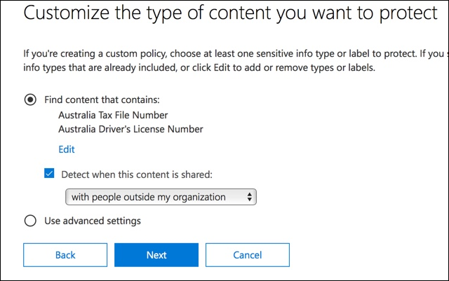
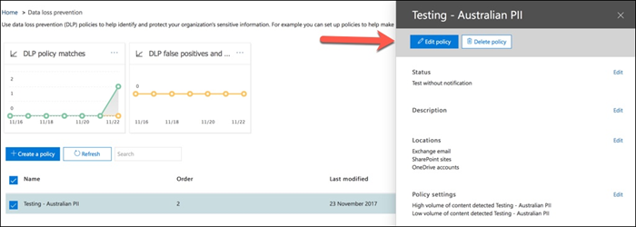

# Criar, testar e ajustar uma política DLPCreate, test, and tune a DLP policy

A prevenção contra perda de dados (DLP) ajuda a evitar o compartilhamento acidental ou não intencional de informações confidenciais.Data loss prevention (DLP) helps you prevent the unintentional or accidental sharing of sensitive information.

A DLP examina mensagens de email e arquivos para obter informações confidenciais, como um número de cartão de crédito.DLP examines email messages and files for sensitive information, like a credit card number. Usando a DLP, você pode detectar informações confidenciais e tomar medidas como:Using DLP you can detect sensitive information, and take action such as:

- Registrar o evento para fins de auditoriaLog the event for auditing purposes
- Exibir um aviso para o usuário final que está enviando o email ou compartilhando o arquivoDisplay a warning to the end user who is sending the email or sharing the file
- Impedir ativamente que o email ou o compartilhamento de arquivos seja realizadoActively block the email or file sharing from taking place

## PermissionsPermissions

Os membros da sua equipe de conformidade que irão criar políticas de DLP precisam de permissões ao Centro de Conformidade.Members of your compliance team who will create DLP policies need permissions to the Compliance Center. Por padrão, o administrador de locatários terá acesso para dar acesso aos responsáveis pela conformidade e a outras pessoas.By default, your tenant admin will have access can give compliance officers and other people access. Siga estas etapas:Follow these steps:
  
1. Crie um grupo no Microsoft 365 e adicione os responsáveis pela conformidade.Create a group in Microsoft 365 and add compliance officers to it.
    
2. Criar um grupo de funções na página **Permissões** do Centro de Conformidade &amp; Segurança.Create a role group on the **Permissions** page of the Security &amp; Compliance Center. 

3. Ao criar o grupo de funções, use a **seção** Escolher Funções para adicionar a seguinte função ao grupo de funções: **DLP Compliance Management**.While creating the role group, use the **Choose Roles** section to add the following role to the role group: **DLP Compliance Management**.
    
4. Use a seção **Escolher membros** para adicionar o grupo Microsoft 365 que você criou anteriormente ao grupo de função.Use the **Choose Members** section to add the Microsoft 365 group you created before to the role group.

Use a função gerenciamento de **conformidade DLP** somente exibição para criar um grupo de função com privilégios somente de exibição para as políticas DLP e relatórios DLP.Use the **View-Only DLP Compliance Management** role to create role group with view-only privileges to the DLP policies and DLP reports.

Para saber mais, consulte [Conceder aos usuários acesso ao Centro de Conformidade e Segurança do Office 365](../security/office-365-security/grant-access-to-the-security-and-compliance-center.md).For more information, see [Give users access to the Office 365 Compliance Center](../security/office-365-security/grant-access-to-the-security-and-compliance-center.md).
  
Essas permissões são necessárias para criar e aplicar uma política de DLP para não impor políticas.These permissions are required to create and apply a DLP policy not to enforce policies.

## Como as informações confidenciais são detectadas pela DLPHow sensitive information is detected by DLP

A DLP localiza informações confidenciais por correspondência de padrões de expressão regular (RegEx), em combinação com outros indicadores, como a proximidade de determinadas palavras-chave com os padrões correspondentes.DLP finds sensitive information by regular expression (RegEx) pattern matching, in combination with other indicators such as the proximity of certain keywords to the matching patterns. Por exemplo, um número de cartão de crédito VISA tem 16 dígitos.For example, a VISA credit card number has 16 digits. Porém, esses dígitos podem ser escritos de maneiras diferentes, como 1111-1111-1111-1111, 1111 1111 1111 1111 ou 111111111111111111.But, those digits can be written in different ways, such as 1111-1111-1111-1111, 1111 1111 1111 1111, or 1111111111111111.

Qualquer cadeia de caracteres de 16 dígitos não é necessariamente um número de cartão de crédito, pode ser um número de tíquete de um sistema de help desk ou um número de série de um hardware.Any 16-digit string is not necessarily a credit card number, it could be a ticket number from a help desk system, or a serial number of a piece of hardware. Para saber a diferença entre um número de cartão de crédito e uma cadeia de 16 dígitos insunte, é realizado um cálculo (checksum) para confirmar que os números corresponderão a um padrão conhecido das várias marcas de cartão de crédito.To tell the difference between a credit card number and a harmless 16-digit string, a calculation is performed (checksum) to confirm that the numbers match a known pattern from the various credit card brands.

Se a DLP encontrar palavras-chave como "VISA" ou "AMEX", valores de data próxima que podem ser a data de vencimento do cartão de crédito, a DLP também usará esses dados para ajudá-lo a decidir se a cadeia de caracteres é um número de cartão de crédito ou não.If DLP finds keywords such as "VISA" or "AMEX", near date values that might be the credit card expiry date, DLP also uses that data to help it decide whether the string is a credit card number or not.

Em outras palavras, a DLP é inteligente o suficiente para reconhecer a diferença entre essas duas cadeias de caracteres de texto em um email:In other words, DLP is smart enough to recognize the difference between these two strings of text in an email:

- "Você pode solicitar um novo laptop."Can you order me a new laptop. Use meu número VISA 1111-1111-1111-1111, expira em 22/11 e envie-me a data de entrega estimada quando você a tiver."Use my VISA number 1111-1111-1111-1111, expiry 11/22, and send me the estimated delivery date when you have it."
- "O número de série do meu laptop é 2222-2222-2222-2222 e foi comprado em 11/2010."My laptop serial number is 2222-2222-2222-2222 and it was purchased on 11/2010. A propósito, meu visto de viagem já foi aprovado?"By the way, is my travel visa approved yet?"

Consulte [Definições de entidade de tipo de informações](sensitive-information-type-entity-definitions.md) confidenciais que explicam como cada tipo de informação é detectado.See [Sensitive information type entity definitions](sensitive-information-type-entity-definitions.md) that explains how each information type is detected.

## Por onde começar com a prevenção contra perda de dadosWhere to start with data loss prevention

Quando os riscos de vazamento de dados não são totalmente óbvios, é difícil descobrir onde exatamente você deve começar com a implementação da DLP.When the risks of data leakage aren't entirely obvious, it's difficult to work out where exactly you should start with implementing DLP. Felizmente, as políticas de DLP podem ser executados no "modo de teste", permitindo medir sua eficácia e precisão antes de a ativar.Fortunately, DLP policies can be run in "test mode", allowing you to gauge their effectiveness and accuracy before you turn them on.

As políticas de DLP para o Exchange Online podem ser gerenciadas por meio do Centro de administração do Exchange.DLP policies for Exchange Online can be managed through the Exchange admin center. Mas você pode configurar políticas DLP para todas as carga & s de trabalho por meio do Centro de Conformidade e Segurança, portanto, é isso que eu vou usar para demonstrações neste artigo.But you can configure DLP policies for all workloads through the Security & Compliance Center, so that's what I'll use for demonstrations in this article. No Centro de conformidade & segurança, você encontrará as políticas DLP em Política **de prevenção contra perda de**  >  **dados.**In the Security & Compliance Center, you'll find the DLP policies under **Data loss prevention** > **Policy**. Escolha **Criar uma política** para iniciar.Choose **Create a policy** to start.

O Microsoft 365 fornece uma variedade de modelos de política [de DLP](what-the-dlp-policy-templates-include.md) que você pode usar para criar políticas.Microsoft 365 provides a range of [DLP policy templates](what-the-dlp-policy-templates-include.md) you can use to create policies. Digamos que você seja uma empresa australiana.Let's say that you're an Australian business. Você pode filtrar os modelos na Austrália e escolher Finanças, Saúde e Saúde e Privacidade.You can filter the templates on Australia, and choose Financial, Medical and Health, and Privacy.

Para esta demonstração, escolherei os Dados de Informações de Identificação Pessoal (PII) da Austrália, que inclui os tipos de informações do número de arquivo fiscal australiano (TFN) e o número de carteira de motorista.For this demonstration I'll choose Australian Personally Identifiable Information (PII) Data, which includes the information types of Australian Tax File Number (TFN) and Driver's License Number.

Dê um nome à nova política DLP.Give your new DLP policy a name. O nome padrão corresponderá ao modelo de política de DLP, mas você deve escolher um nome mais descritivo, pois várias políticas podem ser criadas a partir do mesmo modelo.The default name will match the DLP policy template, but you should choose a more descriptive name of your own, because multiple policies can be created from the same template.

Escolha os locais aos quais a política será aplicada.Choose the locations that the policy will apply to. As políticas de DLP podem se aplicar ao Exchange Online, Ao SharePoint Online e ao OneDrive for Business.DLP policies can apply to Exchange Online, SharePoint Online, and OneDrive for Business. Vou deixar essa política configurada para aplicar a todos os locais.I am going to leave this policy configured to apply to all locations.

Na primeira etapa **de Configurações de** Política, basta aceitar os padrões por enquanto.At the first **Policy Settings** step, just accept the defaults for now. Você pode personalizar políticas de DLP, mas os padrões são um bom lugar para começar.You can customize DLP policies, but the defaults are a fine place to start.

Depois de clicar em Next,\*\* você  verá uma página de Configurações de Política adicional com mais opções de personalização.After clicking Next,\*\* you'll be presented with an additional **Policy Settings** page with more customization options. Para uma política que você está apenas testando, aqui é onde você pode começar a fazer alguns ajustes.For a policy that you are just testing, here's where you can start to make some adjustments.

- Eu tenho desligado dicas de política por enquanto, que é uma etapa razoável a ser feito se você estiver apenas testando tudo e ainda não quiser exibir nada para os usuários.I've turned off policy tips for now, which is a reasonable step to take if you're just testing things out and don't want to display anything to users yet. As dicas de política exibem avisos aos usuários de que eles estão prestes a violar uma política de DLP.Policy tips display warnings to users that they're about to violate a DLP policy. Por exemplo, um usuário do Outlook verá um aviso de que o arquivo anexado contém números de cartão de crédito e fará com que seus emails sejam rejeitados.For example, an Outlook user will see a warning that the file they've attached contains credit card numbers and will cause their email to be rejected. O objetivo das dicas de política é parar o comportamento não compatível antes que isso aconteça.The goal of policy tips is to stop the non-compliant behaviour before it happens.
- Também diminuí o número de instâncias de 10 para 1, para que essa política detecte qualquer compartilhamento de dados de PII australiana, não apenas o compartilhamento em massa dos dados.I've also decreased the number of instances from 10 to 1, so that this policy will detect any sharing of Australian PII data, not just bulk sharing of the data.
- Também adicionei outro destinatário ao email do relatório de incidentes.I've also added another recipient to the incident report email.

Por fim, configurei essa política para ser executado inicialmente no modo de teste.Finally, I've configured this policy to run in test mode initially. Observe que também há uma opção aqui para desabilitar as dicas de política no modo de teste.Notice there's also an option here to disable policy tips while in test mode. Isso dá a você a flexibilidade de ter dicas de política habilitadas na política, mas, em seguida, decidir se deve exibi-las ou suprimi-las durante o teste.This gives you the flexibility to have policy tips enabled in the policy, but then decide whether to show or suppress them during your testing.

Na tela de revisão final, clique **em Criar** para concluir a criação da política.On the final review screen click **Create** to finish creating the policy.

## Testar uma política de DLPTest a DLP policy

Sua nova política de DLP começará a ter efeito dentro de cerca de 1 hora.Your new DLP policy will begin to take effect within about 1 hour. Você pode esperar que ele seja acionado pela atividade normal do usuário ou pode tentar acioná-lo por conta própria.You can sit and wait for it to be triggered by normal user activity, or you can try to trigger it yourself. Anteriormente, eu me vinculava [a definições](sensitive-information-type-entity-definitions.md)de entidade de tipo de informação confidenciais, que fornece informações sobre como disparar as combinações de DLP.Earlier I linked to [Sensitive information type entity definitions](sensitive-information-type-entity-definitions.md), which provides you with information about how to trigger DLP matches.

Por exemplo, a política de DLP que eu criei para este artigo detectará números de arquivo fiscal (TFN) da Austrália.As an example, the DLP policy I created for this article will detect Australian tax file numbers (TFN). De acordo com a documentação, a combinação se baseia nos critérios a seguir.According to the documentation, the match is based on the following criteria.

 
Para demonstrar a detecção de TFN de maneira bastante irregular, um email com as palavras "Número de arquivo fiscal" e uma cadeia de caracteres de 9 dígitos bem próximas serão abordados sem problemas.To demonstrate TFN detection in a rather blunt manner, an email with the words "Tax file number" and a 9 digit string in close proximity will sail through without any issues. O motivo pelo qual ela não dispara a política de DLP é que a cadeia de caracteres de 9 dígitos deve passar a verificação que indica que é um TFN válido e não apenas uma cadeia de caracteres de números vazia.The reason it does not trigger the DLP policy is that the 9-digit string must pass the checksum that indicates it is a valid TFN and not just a harmless string of numbers.

Em comparação, um email com as palavras "Número de arquivo fiscal" e um TFN válido que passa na verificação acionará a política.In comparison, an email with the words "Tax file number" and a valid TFN that passes the checksum will trigger the policy. Para o registro aqui, o TFN que estou usando foi retirado de um site que gera TFNs válidos, mas não originais.For the record here, the TFN I'm using was taken from a website that generates valid, but not genuine, TFNs. Esses sites são muito úteis porque um dos erros mais comuns ao testar uma política de DLP é usar um número falso que não é válido e não passará na verificação (e, portanto, não disparará a política).Such sites are very useful because one of the most common mistakes when testing a DLP policy is using a fake number that's not valid and won't pass the checksum (and therefore won't trigger the policy).

O email do relatório de incidentes inclui o tipo de informações confidenciais que foram detectadas, quantas instâncias foram detectadas e o nível de confiança da detecção.The incident report email includes the type of sensitive information that was detected, how many instances were detected, and the confidence level of the detection.

Se você deixar sua política de DLP no modo de teste e analisar os emails do relatório de incidentes, poderá começar a ter uma opinião sobre a precisão da política de DLP e como ela será eficaz quando for imposta.If you leave your DLP policy in test mode and analyze the incident report emails, you can start to get a feel for the accuracy of the DLP policy and how effective it will be when it is enforced. Além dos relatórios de incidentes, você pode usar os relatórios [de DLP](view-the-dlp-reports.md) para ver uma exibição agregada das políticas em seu locatário.In addition to the incident reports, you can [use the DLP reports](view-the-dlp-reports.md) to see an aggregated view of policy matches across your tenant.

## Ajustar uma política de DLPTune a DLP policy

À medida que você analisa seus acertos de política, talvez você queira fazer alguns ajustes no comportamento das políticas.As you analyze your policy hits you might want to make some adjustments to how the policies behave. Como exemplo simples, você pode determinar que um TFN no email não é um problema (eu ainda o vejo, mas vamos com ele para demonstração), mas duas ou mais instâncias são um problema.As a simple example, you might determine that one TFN in email is not a problem (I think it still is, but let's go with it for the sake of demonstration), but two or more instances is a problem. Várias instâncias podem ser um cenário arriscado, como um funcionário que envia um email de uma exportação CSV do banco de dados de RH para uma parte externa, por exemplo, um serviço de contabilidade externa.Multiple instances could be a risky scenario such as an employee emailing a CSV export from the HR database to an external party, for example an external accounting service. Definitivamente, algo que você prefira detectar e bloquear.Definitely something you would prefer to detect and block.

No Centro de Conformidade & segurança, você pode editar uma política existente para ajustar o comportamento.In the Security & Compliance Center you can edit an existing policy to adjust the behaviour.

 
Você pode ajustar as configurações de local para que a política seja aplicada somente a cargas de trabalho específicas ou a sites e contas específicos.You can adjust the location settings so that the policy is applied only to specific workloads, or to specific sites and accounts.

Você também pode ajustar as configurações de política e editar as regras para atender melhor às suas necessidades.You can also adjust the policy settings and edit the rules to better suit your needs.

Ao editar uma regra em uma política DLP, você pode alterar:When editing a rule within a DLP policy you can change:

- As condições, incluindo o tipo e o número de instâncias de dados confidenciais que acionarão a regra.The conditions, including the type and number of instances of sensitive data that will trigger the rule.
- As ações que são tomadas, como restringir o acesso ao conteúdo.The actions that are taken, such as restricting access to the content.
- Notificações do usuário, que são dicas de política que são exibidas para o usuário em seu cliente de email ou navegador da Web.User notifications, which are policy tips that are displayed to the user in their email client or web browser.
- O usuário substitui, que determina se os usuários podem optar por continuar com seu email ou compartilhamento de arquivos mesmo assim.User overrides, which determines whether users can choose to proceed with their email or file sharing anyway.
- Relatórios de incidentes, para notificar os administradores.Incident reports, to notify administrators.

Para esta demonstração, adicionei notificações de usuário à política (tenha cuidado para fazer isso sem treinamento adequado para o reconhecimento do usuário) e permiti que os usuários substituam a política por uma justificativa comercial ou sinalização como falso positivo.For this demonstration I've added user notifications to the policy (be careful of doing this without adequate user awareness training), and allowed users to override the policy with a business justification or by flagging it as a false positive. Observe que você também pode personalizar o texto da dica de política e email se quiser incluir informações adicionais sobre as políticas da sua organização ou solicitar que os usuários contatem o suporte se eles tiver dúvidas.Note that you can also customize the email and policy tip text if you want to include any additional information about your organization's policies, or prompt users to contact support if they have questions.

A política contém duas regras para manipulação de alto volume e baixo volume, portanto, certifique-se de editar as duas com as ações que você deseja.The policy contains two rules for handling of high volume and low volume, so be sure to edit both with the actions that you want. Essa é uma oportunidade para tratar os casos de maneira diferente, dependendo de suas características.This is an opportunity to treat cases differently depending on their characteristics. Por exemplo, você pode permitir substituições para violações de baixo volume, mas não permitir substituições para violações de alto volume.For example, you might allow overrides for low volume violations, but not allow overrides for high volume violations.

Além disso, se você quiser realmente bloquear ou restringir o acesso ao conteúdo que está violando a política, será necessário configurar uma ação na regra para fazer isso.Also, if you want to actually block or restrict access to content that is in violation of policy, you need to configure an action on the rule to do so.

Depois de salvar essas alterações nas configurações de política, também preciso retornar à página de configurações principais da política e habilitar a opção para mostrar dicas de política aos usuários enquanto a política estiver no modo de teste.After saving those changes to the policy settings, I also need to return to the main settings page for the policy and enable the option to show policy tips to users while the policy is in test mode. Essa é uma maneira eficaz de introduzir políticas de DLP para seus usuários finais e fazer treinamento de conscientização dos usuários, sem levar em conta muitos falsos positivos que acarrem sua produtividade.This is an effective way to introduce DLP policies to your end users, and do user awareness training, without risking too many false positives that impact their productivity.

No lado do servidor (ou no lado da nuvem, se preferir), a alteração pode não ter efeito imediato, devido a vários intervalos de processamento.On the server side (or cloud side if you prefer), the change may not take effect immediately, due to various processing intervals. Se você estiver fazendo uma alteração de política de DLP que exibirá novas dicas de política para um usuário, o usuário pode não ver as alterações entrarem em vigor imediatamente no cliente do Outlook, que verifica se há alterações de política a cada 24 horas.If you're making a DLP policy change that will display new policy tips to a user, the user may not see the changes take effect immediately in their Outlook client, which checks for policy changes every 24 hours. Se quiser acelerar o teste, você pode usar essa correção do Registro para limpar o último carimbo de data/hora de download da chave [PolicyNudges](https://support.microsoft.com/en-au/help/2823261/changes-to-a-data-loss-prevention-policy-don-t-take-effect-in-outlook?__hstc=18650278.46377037dc0a82baa8a30f0ef07a7b2f.1538687978676.1538693509953.1540315763430.3&__hssc=18650278.1.1540315763430&__hsfp=3446956451).If you want to speed things up for testing, you can use this registry fix to [clear the last download time stamp from the PolicyNudges key](https://support.microsoft.com/en-au/help/2823261/changes-to-a-data-loss-prevention-policy-don-t-take-effect-in-outlook?__hstc=18650278.46377037dc0a82baa8a30f0ef07a7b2f.1538687978676.1538693509953.1540315763430.3&__hssc=18650278.1.1540315763430&__hsfp=3446956451). O Outlook baixará as informações de política mais recentes na próxima vez que você reiniciá-la e começar a compor uma mensagem de email.Outlook will download the latest policy information the next time you restart it and begin composing an email message.

Se você tiver dicas de política habilitadas, o usuário começará a ver as dicas no Outlook e poderá relatar falsos positivos para você quando elas ocorrerem.If you have policy tips enabled, the user will begin to see the tips in Outlook, and can report false positives to you when they occur.

## Investigar falsos positivosInvestigate false positives

Os modelos de política de DLP não são perfeitos.DLP policy templates are not perfect straight out of the box. É provável que você descubra que alguns falsos positivos ocorrem em seu ambiente, e é por isso que é tão importante facilitar o caminho para uma implantação de DLP, aproveitando o tempo para testar e ajustar adequadamente suas políticas.It's likely that you'll find some false positives occurring in your environment, which is why it's so important to ease your way into a DLP deployment, taking the time to adequately test and tune your policies.

Veja um exemplo de falso positivo.Here's an example of a false positive. Esse email é muito ofensivo.This email is quite harmless. O usuário está fornecendo seu número de telefone celular a alguém e incluindo sua assinatura de email.The user is providing their mobile phone number to someone, and including their email signature.

 
Mas o usuário vê uma dica de política avisando que o email contém informações confidenciais, especificamente, um número de carteira de motorista australiana.But the user sees a policy tip warning them that the email contains sensitive information, specifically, an Australian driver's license number.

O usuário pode relatar o falso positivo, e o administrador pode procurar por que ele ocorreu.The user can report the false positive, and the administrator can look into why it has occurred. No email do relatório de incidentes, o email é sinalizado como falso positivo.In the incident report email, the email is flagged as a false positive.

Esse caso de carteira de motorista é um bom exemplo para se investigar.This driver's license case is a good example to dig into. O motivo pelo qual esse falso positivo ocorreu é que o tipo "Australian Driver's License" será acionado por qualquer cadeia de caracteres de 9 dígitos (mesmo uma que faz parte de uma cadeia de 10 dígitos), dentro de 300 caracteres de proximidade com as palavras-chave "sidney nsw" (não faz parte de letras minúsculas).The reason this false positive has occurred is that the "Australian Driver's License" type will be triggered by any 9-digit string (even one that is part of a 10-digit string), within 300 characters proximity to the keywords "sydney nsw" (not case sensitive). Portanto, ele é acionado pelo número de telefone e assinatura de email, somente porque o usuário está em Sidney.So it's triggered by the phone number and email signature, only because the user happens to be in Sydney.

Uma opção é remover o tipo de informação de carteira de motorista australiana da política.One option is to remove the Australian driver's license information type from the policy. Ele está lá porque faz parte do modelo de política de DLP, mas não precisamos usá-lo.It's in there because it's part of the DLP policy template, but we're not forced to use it. Se você estiver interessado apenas em Números de Arquivo Fiscal e não em carteiras de motorista, basta removê-lo.If you're only interested in Tax File Numbers and not driver's licenses, you can just remove it. Por exemplo, você pode removê-la da regra de baixo volume na política, mas deixá-la na regra de alto volume para que as listas de várias licenças de drivers ainda sejam detectadas.For example, you can remove it from the low volume rule in the policy, but leave it in the high volume rule so that lists of multiple drivers licenses are still detected.

 
Outra opção é simplesmente aumentar a contagem de instâncias, para que um baixo volume de licenças de driver só seja detectado quando houver várias instâncias.Another option is to simply increase the instance count, so that a low volume of driver's licenses is only detected when there are multiple instances.

Além de alterar a contagem de instâncias, você também pode ajustar a precisão da combinação (ou o nível de confiança).In addition to changing the instance count, you can also adjust the match accuracy (or confidence level). Se o tipo de informação sensível tiver vários padrões, você poderá ajustar a precisão da combinação em sua regra, para que sua regra corresponde somente a padrões específicos.If your sensitive information type has multiple patterns, you can adjust the match accuracy in your rule, so that your rule matches only specific patterns. Por exemplo, para ajudar a reduzir falsos positivos, você pode definir a precisão da sua regra para que ela corresponde somente ao padrão com o nível de confiança mais alto.For example, to help reduce false positives, you can set the match accuracy of your rule so that it matches only the pattern with the highest confidence level. Entender como o nível de confiança é calculado é um pouco complicado (e além do escopo desta postagem), mas aqui está uma boa explicação sobre como usar o nível de confiança para ajustar suas [regras.](data-loss-prevention-policies.md#match-accuracy)Understanding how confidence level is calculated is a bit tricky (and beyond the scope of this post), but here's a good explanation of [how to use confidence level to tune your rules](data-loss-prevention-policies.md#match-accuracy).

Por fim, se você quiser obter um pouco mais de avançado, poderá personalizar qualquer tipo de informação sensível – por exemplo, você pode remover "Sidney NSW" da lista de palavras-chave para o número de carteira de motorista da [Austrália,](sensitive-information-type-entity-definitions.md#australia-drivers-license-number)para eliminar o falso positivo disparado acima.Finally, if you want to get even a bit more advanced, you can customize any sensitive information type -- for example, you can remove "Sydney NSW" from the list of keywords for [Australia driver's license number](sensitive-information-type-entity-definitions.md#australia-drivers-license-number), to eliminate the false positive triggered above. Para saber como fazer isso usando XML e PowerShell, confira personalizar um [tipo de informação confidenciais interna.](customize-a-built-in-sensitive-information-type.md)To learn how to do this by using XML and PowerShell, see [customizing a built-in sensitive information type](customize-a-built-in-sensitive-information-type.md).

## Ativar uma política de DLPTurn on a DLP policy

Quando você estiver satisfeito com o fato de sua política de DLP estar detectando com precisão e eficácia tipos de informações confidenciais e que os usuários finais estão prontos para lidar com as políticas em uso, você pode habilitar a política.When you're happy that your DLP policy is accurately and effectively detecting sensitive information types, and that your end users are ready to deal with the policies being in place, then you can enable the policy.

 
Se você estiver aguardando para ver quando a política terá efeito &, conecte-se ao [PowerShell](https://docs.microsoft.com/powershell/exchange/connect-to-scc-powershell) do Centro de Conformidade e Segurança e execute o [cmdlet Get-DlpCompliancePolicy](https://docs.microsoft.com/powershell/module/exchange/get-dlpcompliancepolicy) para ver o DistributionStatus.If you're waiting to see when the policy will take effect, [Connect to Security & Compliance Center PowerShell](https://docs.microsoft.com/powershell/exchange/connect-to-scc-powershell) and run the [Get-DlpCompliancePolicy cmdlet](https://docs.microsoft.com/powershell/module/exchange/get-dlpcompliancepolicy) to see the DistributionStatus.

Depois de ligar a política de DLP, você deve executar alguns testes finais para garantir que as ações de política esperadas estão ocorrendo.After turning on the DLP policy, you should run some final tests of your own to make sure that the expected policy actions are occurring. Se você estiver tentando testar coisas como dados de cartão de crédito, há sites online com informações sobre como gerar cartão de crédito de exemplo ou outras informações pessoais que passarão as verificações e dispararão suas políticas.If you're trying to test things like credit card data, there are websites online with information on how to generate sample credit card or other personal information that will pass checksums and trigger your policies.

As políticas que permitem substituições de usuário apresentarão essa opção ao usuário como parte da dica de política.Policies that allow user overrides will present that option to the user as part of the policy tip.

Políticas que restringem conteúdo apresentarão o aviso ao usuário como parte da dica de política e impedirão que ele envie o email.Policies that restrict content will present the warning to the user as part of the policy tip, and prevent them from sending the email.

## ResumoSummary

As políticas de prevenção contra perda de dados são úteis para organizações de todos os tipos.Data loss prevention policies are useful for organizations of all types. Testar algumas políticas DLP é um exercício de baixo risco devido ao controle que você tem sobre coisas como dicas de política, substituições de usuário final e relatórios de incidentes.Testing some DLP policies is a low risk exercise due to the control you have over things like policy tips, end user overrides, and incident reports. Você pode testar silenciosamente algumas políticas de DLP para ver que tipo de violações já estão ocorrendo em sua organização e, em seguida, criar políticas com taxas de falsos positivos baixos, instruir seus usuários sobre o que é permitido e não permitido e, em seguida, lançar suas políticas de DLP para a organização.You can quietly test some DLP policies to see what type of violations are already occurring in your organization, and then craft policies with low false positive rates, educate your users on what is allowed and not allowed, and then roll out your DLP policies to the organization.
