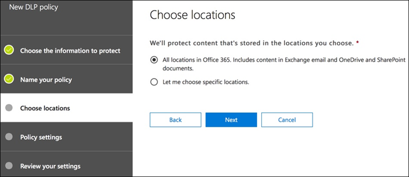
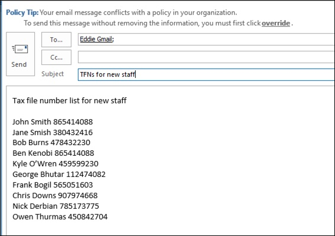

# Criar, testar e ajustar uma política DLP

A prevenção contra perda de dados (DLP) ajuda a evitar o compartilhamento acidental ou não intencional de informações confidenciais.

A DLP examina mensagens de email e arquivos para obter informações confidenciais, como um número de cartão de crédito. Usando a DLP, você pode detectar informações confidenciais e tomar medidas como:

- Registrar o evento para fins de auditoria
- Exibir um aviso para o usuário final que está enviando o email ou compartilhando o arquivo
- Impedir ativamente que o email ou o compartilhamento de arquivos seja realizado

## Permissions

Os membros da sua equipe de conformidade que irão criar políticas de DLP precisam de permissões ao Centro de Conformidade. Por padrão, o administrador de locatários terá acesso para dar acesso aos responsáveis pela conformidade e a outras pessoas. Siga estas etapas:
  
1. Crie um grupo no Microsoft 365 e adicione os responsáveis pela conformidade.
    
2. Criar um grupo de funções na página **Permissões** do Centro de Conformidade &amp; Segurança. 

3. Ao criar o grupo de funções, use a **seção** Escolher Funções para adicionar a seguinte função ao grupo de funções: **DLP Compliance Management**.
    
4. Use a seção **Escolher membros** para adicionar o grupo Microsoft 365 que você criou anteriormente ao grupo de função.

Use a função gerenciamento de **conformidade DLP** somente exibição para criar um grupo de função com privilégios somente de exibição para as políticas DLP e relatórios DLP.

Para saber mais, consulte [Conceder aos usuários acesso ao Centro de Conformidade e Segurança do Office 365](../security/office-365-security/grant-access-to-the-security-and-compliance-center.md).
  
Essas permissões são necessárias para criar e aplicar uma política de DLP para não impor políticas.

## Como as informações confidenciais são detectadas pela DLP

A DLP localiza informações confidenciais por correspondência de padrões de expressão regular (RegEx), em combinação com outros indicadores, como a proximidade de determinadas palavras-chave com os padrões correspondentes. Por exemplo, um número de cartão de crédito VISA tem 16 dígitos. Porém, esses dígitos podem ser escritos de maneiras diferentes, como 1111-1111-1111-1111, 1111 1111 1111 1111 ou 111111111111111111.

Qualquer cadeia de caracteres de 16 dígitos não é necessariamente um número de cartão de crédito, pode ser um número de tíquete de um sistema de help desk ou um número de série de um hardware. Para saber a diferença entre um número de cartão de crédito e uma cadeia de 16 dígitos insunte, é realizado um cálculo (checksum) para confirmar que os números corresponderão a um padrão conhecido das várias marcas de cartão de crédito.

Se a DLP encontrar palavras-chave como "VISA" ou "AMEX", valores de data próxima que podem ser a data de vencimento do cartão de crédito, a DLP também usará esses dados para ajudá-lo a decidir se a cadeia de caracteres é um número de cartão de crédito ou não.

Em outras palavras, a DLP é inteligente o suficiente para reconhecer a diferença entre essas duas cadeias de caracteres de texto em um email:

- "Você pode solicitar um novo laptop. Use meu número VISA 1111-1111-1111-1111, expira em 22/11 e envie-me a data de entrega estimada quando você a tiver."
- "O número de série do meu laptop é 2222-2222-2222-2222 e foi comprado em 11/2010. A propósito, meu visto de viagem já foi aprovado?"

Consulte [Definições de entidade de tipo de informações](sensitive-information-type-entity-definitions.md) confidenciais que explicam como cada tipo de informação é detectado.

## Por onde começar com a prevenção contra perda de dados

Quando os riscos de vazamento de dados não são totalmente óbvios, é difícil descobrir onde exatamente você deve começar com a implementação da DLP. Felizmente, as políticas de DLP podem ser executados no "modo de teste", permitindo medir sua eficácia e precisão antes de a ativar.

As políticas de DLP para o Exchange Online podem ser gerenciadas por meio do Centro de administração do Exchange. Mas você pode configurar políticas DLP para todas as carga & s de trabalho por meio do Centro de Conformidade e Segurança, portanto, é isso que eu vou usar para demonstrações neste artigo. No Centro de conformidade & segurança, você encontrará as políticas DLP em Política **de prevenção contra perda de**  >  **dados.** Escolha **Criar uma política** para iniciar.

O Microsoft 365 fornece uma variedade de modelos de política [de DLP](what-the-dlp-policy-templates-include.md) que você pode usar para criar políticas. Digamos que você seja uma empresa australiana. Você pode filtrar os modelos na Austrália e escolher Finanças, Saúde e Saúde e Privacidade.

Para esta demonstração, escolherei os Dados de Informações de Identificação Pessoal (PII) da Austrália, que inclui os tipos de informações do número de arquivo fiscal australiano (TFN) e o número de carteira de motorista.

Dê um nome à nova política DLP. O nome padrão corresponderá ao modelo de política de DLP, mas você deve escolher um nome mais descritivo, pois várias políticas podem ser criadas a partir do mesmo modelo.

Escolha os locais aos quais a política será aplicada. As políticas de DLP podem se aplicar ao Exchange Online, Ao SharePoint Online e ao OneDrive for Business. Vou deixar essa política configurada para aplicar a todos os locais.

Na primeira etapa **de Configurações de** Política, basta aceitar os padrões por enquanto. Você pode personalizar políticas de DLP, mas os padrões são um bom lugar para começar.

Depois de clicar em Next,** você  verá uma página de Configurações de Política adicional com mais opções de personalização. Para uma política que você está apenas testando, aqui é onde você pode começar a fazer alguns ajustes.

- Eu tenho desligado dicas de política por enquanto, que é uma etapa razoável a ser feito se você estiver apenas testando tudo e ainda não quiser exibir nada para os usuários. As dicas de política exibem avisos aos usuários de que eles estão prestes a violar uma política de DLP. Por exemplo, um usuário do Outlook verá um aviso de que o arquivo anexado contém números de cartão de crédito e fará com que seus emails sejam rejeitados. O objetivo das dicas de política é parar o comportamento não compatível antes que isso aconteça.
- Também diminuí o número de instâncias de 10 para 1, para que essa política detecte qualquer compartilhamento de dados de PII australiana, não apenas o compartilhamento em massa dos dados.
- Também adicionei outro destinatário ao email do relatório de incidentes.

Por fim, configurei essa política para ser executado inicialmente no modo de teste. Observe que também há uma opção aqui para desabilitar as dicas de política no modo de teste. Isso dá a você a flexibilidade de ter dicas de política habilitadas na política, mas, em seguida, decidir se deve exibi-las ou suprimi-las durante o teste.

Na tela de revisão final, clique **em Criar** para concluir a criação da política.

## Testar uma política de DLP

Sua nova política de DLP começará a ter efeito dentro de cerca de 1 hora. Você pode esperar que ele seja acionado pela atividade normal do usuário ou pode tentar acioná-lo por conta própria. Anteriormente, eu me vinculava [a definições](sensitive-information-type-entity-definitions.md)de entidade de tipo de informação confidenciais, que fornece informações sobre como disparar as combinações de DLP.

Por exemplo, a política de DLP que eu criei para este artigo detectará números de arquivo fiscal (TFN) da Austrália. De acordo com a documentação, a combinação se baseia nos critérios a seguir.

 
Para demonstrar a detecção de TFN de maneira bastante irregular, um email com as palavras "Número de arquivo fiscal" e uma cadeia de caracteres de 9 dígitos bem próximas serão abordados sem problemas. O motivo pelo qual ela não dispara a política de DLP é que a cadeia de caracteres de 9 dígitos deve passar a verificação que indica que é um TFN válido e não apenas uma cadeia de caracteres de números vazia.

Em comparação, um email com as palavras "Número de arquivo fiscal" e um TFN válido que passa na verificação acionará a política. Para o registro aqui, o TFN que estou usando foi retirado de um site que gera TFNs válidos, mas não originais. Esses sites são muito úteis porque um dos erros mais comuns ao testar uma política de DLP é usar um número falso que não é válido e não passará na verificação (e, portanto, não disparará a política).

O email do relatório de incidentes inclui o tipo de informações confidenciais que foram detectadas, quantas instâncias foram detectadas e o nível de confiança da detecção.

Se você deixar sua política de DLP no modo de teste e analisar os emails do relatório de incidentes, poderá começar a ter uma opinião sobre a precisão da política de DLP e como ela será eficaz quando for imposta. Além dos relatórios de incidentes, você pode usar os relatórios [de DLP](view-the-dlp-reports.md) para ver uma exibição agregada das políticas em seu locatário.

## Ajustar uma política de DLP

À medida que você analisa seus acertos de política, talvez você queira fazer alguns ajustes no comportamento das políticas. Como exemplo simples, você pode determinar que um TFN no email não é um problema (eu ainda o vejo, mas vamos com ele para demonstração), mas duas ou mais instâncias são um problema. Várias instâncias podem ser um cenário arriscado, como um funcionário que envia um email de uma exportação CSV do banco de dados de RH para uma parte externa, por exemplo, um serviço de contabilidade externa. Definitivamente, algo que você prefira detectar e bloquear.

No Centro de Conformidade & segurança, você pode editar uma política existente para ajustar o comportamento.

 
Você pode ajustar as configurações de local para que a política seja aplicada somente a cargas de trabalho específicas ou a sites e contas específicos.

Você também pode ajustar as configurações de política e editar as regras para atender melhor às suas necessidades.

Ao editar uma regra em uma política DLP, você pode alterar:

- As condições, incluindo o tipo e o número de instâncias de dados confidenciais que acionarão a regra.
- As ações que são tomadas, como restringir o acesso ao conteúdo.
- Notificações do usuário, que são dicas de política que são exibidas para o usuário em seu cliente de email ou navegador da Web.
- O usuário substitui, que determina se os usuários podem optar por continuar com seu email ou compartilhamento de arquivos mesmo assim.
- Relatórios de incidentes, para notificar os administradores.

Para esta demonstração, adicionei notificações de usuário à política (tenha cuidado para fazer isso sem treinamento adequado para o reconhecimento do usuário) e permiti que os usuários substituam a política por uma justificativa comercial ou sinalização como falso positivo. Observe que você também pode personalizar o texto da dica de política e email se quiser incluir informações adicionais sobre as políticas da sua organização ou solicitar que os usuários contatem o suporte se eles tiver dúvidas.

A política contém duas regras para manipulação de alto volume e baixo volume, portanto, certifique-se de editar as duas com as ações que você deseja. Essa é uma oportunidade para tratar os casos de maneira diferente, dependendo de suas características. Por exemplo, você pode permitir substituições para violações de baixo volume, mas não permitir substituições para violações de alto volume.

Além disso, se você quiser realmente bloquear ou restringir o acesso ao conteúdo que está violando a política, será necessário configurar uma ação na regra para fazer isso.

Depois de salvar essas alterações nas configurações de política, também preciso retornar à página de configurações principais da política e habilitar a opção para mostrar dicas de política aos usuários enquanto a política estiver no modo de teste. Essa é uma maneira eficaz de introduzir políticas de DLP para seus usuários finais e fazer treinamento de conscientização dos usuários, sem levar em conta muitos falsos positivos que acarrem sua produtividade.

No lado do servidor (ou no lado da nuvem, se preferir), a alteração pode não ter efeito imediato, devido a vários intervalos de processamento. Se você estiver fazendo uma alteração de política de DLP que exibirá novas dicas de política para um usuário, o usuário pode não ver as alterações entrarem em vigor imediatamente no cliente do Outlook, que verifica se há alterações de política a cada 24 horas. Se quiser acelerar o teste, você pode usar essa correção do Registro para limpar o último carimbo de data/hora de download da chave [PolicyNudges](https://support.microsoft.com/en-au/help/2823261/changes-to-a-data-loss-prevention-policy-don-t-take-effect-in-outlook?__hstc=18650278.46377037dc0a82baa8a30f0ef07a7b2f.1538687978676.1538693509953.1540315763430.3&__hssc=18650278.1.1540315763430&__hsfp=3446956451). O Outlook baixará as informações de política mais recentes na próxima vez que você reiniciá-la e começar a compor uma mensagem de email.

Se você tiver dicas de política habilitadas, o usuário começará a ver as dicas no Outlook e poderá relatar falsos positivos para você quando elas ocorrerem.

## Investigar falsos positivos

Os modelos de política de DLP não são perfeitos. É provável que você descubra que alguns falsos positivos ocorrem em seu ambiente, e é por isso que é tão importante facilitar o caminho para uma implantação de DLP, aproveitando o tempo para testar e ajustar adequadamente suas políticas.

Veja um exemplo de falso positivo. Esse email é muito ofensivo. O usuário está fornecendo seu número de telefone celular a alguém e incluindo sua assinatura de email.

 
Mas o usuário vê uma dica de política avisando que o email contém informações confidenciais, especificamente, um número de carteira de motorista australiana.

O usuário pode relatar o falso positivo, e o administrador pode procurar por que ele ocorreu. No email do relatório de incidentes, o email é sinalizado como falso positivo.

Esse caso de carteira de motorista é um bom exemplo para se investigar. O motivo pelo qual esse falso positivo ocorreu é que o tipo "Australian Driver's License" será acionado por qualquer cadeia de caracteres de 9 dígitos (mesmo uma que faz parte de uma cadeia de 10 dígitos), dentro de 300 caracteres de proximidade com as palavras-chave "sidney nsw" (não faz parte de letras minúsculas). Portanto, ele é acionado pelo número de telefone e assinatura de email, somente porque o usuário está em Sidney.

Uma opção é remover o tipo de informação de carteira de motorista australiana da política. Ele está lá porque faz parte do modelo de política de DLP, mas não precisamos usá-lo. Se você estiver interessado apenas em Números de Arquivo Fiscal e não em carteiras de motorista, basta removê-lo. Por exemplo, você pode removê-la da regra de baixo volume na política, mas deixá-la na regra de alto volume para que as listas de várias licenças de drivers ainda sejam detectadas.

 
Outra opção é simplesmente aumentar a contagem de instâncias, para que um baixo volume de licenças de driver só seja detectado quando houver várias instâncias.

Além de alterar a contagem de instâncias, você também pode ajustar a precisão da combinação (ou o nível de confiança). Se o tipo de informação sensível tiver vários padrões, você poderá ajustar a precisão da combinação em sua regra, para que sua regra corresponde somente a padrões específicos. Por exemplo, para ajudar a reduzir falsos positivos, você pode definir a precisão da sua regra para que ela corresponde somente ao padrão com o nível de confiança mais alto. Entender como o nível de confiança é calculado é um pouco complicado (e além do escopo desta postagem), mas aqui está uma boa explicação sobre como usar o nível de confiança para ajustar suas [regras.](data-loss-prevention-policies.md#match-accuracy)

Por fim, se você quiser obter um pouco mais de avançado, poderá personalizar qualquer tipo de informação sensível – por exemplo, você pode remover "Sidney NSW" da lista de palavras-chave para o número de carteira de motorista da [Austrália,](sensitive-information-type-entity-definitions.md#australia-drivers-license-number)para eliminar o falso positivo disparado acima. Para saber como fazer isso usando XML e PowerShell, confira personalizar um [tipo de informação confidenciais interna.](customize-a-built-in-sensitive-information-type.md)

## Ativar uma política de DLP

Quando você estiver satisfeito com o fato de sua política de DLP estar detectando com precisão e eficácia tipos de informações confidenciais e que os usuários finais estão prontos para lidar com as políticas em uso, você pode habilitar a política.

 
Se você estiver aguardando para ver quando a política terá efeito &, conecte-se ao [PowerShell](https://docs.microsoft.com/powershell/exchange/connect-to-scc-powershell) do Centro de Conformidade e Segurança e execute o [cmdlet Get-DlpCompliancePolicy](https://docs.microsoft.com/powershell/module/exchange/get-dlpcompliancepolicy) para ver o DistributionStatus.

Depois de ligar a política de DLP, você deve executar alguns testes finais para garantir que as ações de política esperadas estão ocorrendo. Se você estiver tentando testar coisas como dados de cartão de crédito, há sites online com informações sobre como gerar cartão de crédito de exemplo ou outras informações pessoais que passarão as verificações e dispararão suas políticas.

As políticas que permitem substituições de usuário apresentarão essa opção ao usuário como parte da dica de política.

Políticas que restringem conteúdo apresentarão o aviso ao usuário como parte da dica de política e impedirão que ele envie o email.

## Resumo

As políticas de prevenção contra perda de dados são úteis para organizações de todos os tipos. Testar algumas políticas DLP é um exercício de baixo risco devido ao controle que você tem sobre coisas como dicas de política, substituições de usuário final e relatórios de incidentes. Você pode testar silenciosamente algumas políticas de DLP para ver que tipo de violações já estão ocorrendo em sua organização e, em seguida, criar políticas com taxas de falsos positivos baixos, instruir seus usuários sobre o que é permitido e não permitido e, em seguida, lançar suas políticas de DLP para a organização.
