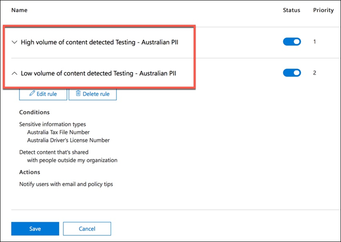
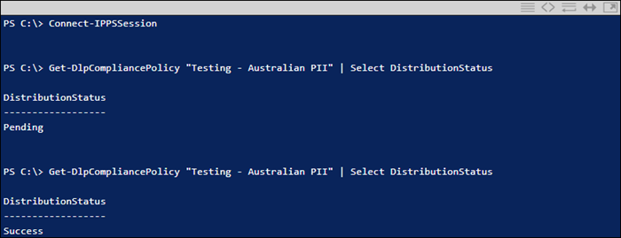

# Criar, testar e ajustar uma política DLPCreate, test, and tune a DLP policy

A prevenção de perda de dados (DLP) ajuda a evitar o compartilhamento não intencional ou acidental de informações confidenciais.Data loss prevention (DLP) helps you prevent the unintentional or accidental sharing of sensitive information.

O DLP examina mensagens de e-mail e arquivos para obter informações confidenciais, como um número de cartão de crédito.DLP examines email messages and files for sensitive information, like a credit card number. Usando dLP, você pode detectar informações confidenciais e tomar medidas como:Using DLP you can detect sensitive information, and take action such as:

- Registre o evento para fins de auditoriaLog the event for auditing purposes
- Exiba um aviso para o usuário final que está enviando o e-mail ou compartilhando o arquivoDisplay a warning to the end user who is sending the email or sharing the file
- Bloqueie ativamente o compartilhamento de e-mails ou arquivos de ocorrerActively block the email or file sharing from taking place

## PermissõesPermissions

Os membros da sua equipe de conformidade que irão criar políticas de DLP precisam de permissões ao Centro de Conformidade.Members of your compliance team who will create DLP policies need permissions to the Compliance Center. Por padrão, seu administrador inquilino terá acesso pode dar aos oficiais de conformidade e outras pessoas acesso.By default, your tenant admin will have access can give compliance officers and other people access. Siga estas etapas:Follow these steps:
  
1. Crie um grupo no Microsoft 365 e adicione os responsáveis pela conformidade.Create a group in Microsoft 365 and add compliance officers to it.
    
2. Criar um grupo de funções na página **Permissões** do Centro de Conformidade &amp; Segurança.Create a role group on the **Permissions** page of the Security &amp; Compliance Center. 

3. Ao criar o grupo de funções, use a seção **Escolher funções** para adicionar a seguinte função ao grupo de funções: **DLP Compliance Management**.While creating the role group, use the **Choose Roles** section to add the following role to the role group: **DLP Compliance Management**.
    
4. Use a seção **Escolher membros** para adicionar o grupo Microsoft 365 que você criou anteriormente ao grupo de função.Use the **Choose Members** section to add the Microsoft 365 group you created before to the role group.

Use a função **De gerenciamento de conformidade DLP somente para** criar grupo de papéis com privilégios somente de visualização para as políticas DLP e relatórios DLP.Use the **View-Only DLP Compliance Management** role to create role group with view-only privileges to the DLP policies and DLP reports.

Para saber mais, consulte [Conceder aos usuários acesso ao Centro de Conformidade e Segurança do Office 365](../security/office-365-security/grant-access-to-the-security-and-compliance-center.md).For more information, see [Give users access to the Office 365 Compliance Center](../security/office-365-security/grant-access-to-the-security-and-compliance-center.md).
  
Essas permissões são necessárias para criar e aplicar uma política DLP para não aplicar políticas.These permissions are required to create and apply a DLP policy not to enforce policies.

## Como as informações confidenciais são detectadas pela DLPHow sensitive information is detected by DLP

O DLP encontra informações confidenciais por correspondência de padrões de expressão regular (RegEx), em combinação com outros indicadores, como a proximidade de certas palavras-chave aos padrões correspondentes.DLP finds sensitive information by regular expression (RegEx) pattern matching, in combination with other indicators such as the proximity of certain keywords to the matching patterns. Por exemplo, um número de cartão de crédito VISA tem 16 dígitos.For example, a VISA credit card number has 16 digits. Mas, esses dígitos podem ser escritos de diferentes maneiras, como 1111-1111-1111, 1111 1111 1111 1111, ou 11111111111.But, those digits can be written in different ways, such as 1111-1111-1111-1111, 1111 1111 1111 1111, or 1111111111111111.

Qualquer string de 16 dígitos não é necessariamente um número de cartão de crédito, pode ser um número de bilhete de um sistema de help desk, ou um número de série de um pedaço de hardware.Any 16-digit string is not necessarily a credit card number, it could be a ticket number from a help desk system, or a serial number of a piece of hardware. Para dizer a diferença entre um número de cartão de crédito e uma sequência inofensiva de 16 dígitos, um cálculo é realizado (checksum) para confirmar que os números correspondem a um padrão conhecido das várias marcas de cartão de crédito.To tell the difference between a credit card number and a harmless 16-digit string, a calculation is performed (checksum) to confirm that the numbers match a known pattern from the various credit card brands.

Se a DLP encontrar palavras-chave como "VISA" ou "AMEX", valores de data próximas que podem ser a data de validade do cartão de crédito, a DLP também usa esses dados para ajudá-lo a decidir se a string é um número de cartão de crédito ou não.If DLP finds keywords such as "VISA" or "AMEX", near date values that might be the credit card expiry date, DLP also uses that data to help it decide whether the string is a credit card number or not.

Em outras palavras, o DLP é inteligente o suficiente para reconhecer a diferença entre essas duas sequências de texto em um e-mail:In other words, DLP is smart enough to recognize the difference between these two strings of text in an email:

- "Você pode me pedir um laptop novo."Can you order me a new laptop. Use meu visa número 1111-1111-1111-1111, expirado 22/11, e me envie a data estimada de entrega quando você tiver."Use my VISA number 1111-1111-1111-1111, expiry 11/22, and send me the estimated delivery date when you have it."
- "Meu número de série do laptop é 2222-2222-2222-2222 e foi comprado em 11/2010."My laptop serial number is 2222-2222-2222-2222 and it was purchased on 11/2010. A propósito, meu visto de viagem já foi aprovado?By the way, is my travel visa approved yet?"

Consulte [definições de entidades de tipo](sensitive-information-type-entity-definitions.md) de informações confidenciais que explicam como cada tipo de informação é detectado.See [Sensitive information type entity definitions](sensitive-information-type-entity-definitions.md) that explains how each information type is detected.

## Por onde começar com a prevenção de perda de dadosWhere to start with data loss prevention

Quando os riscos de vazamento de dados não são totalmente óbvios, é difícil descobrir onde exatamente você deve começar com a implementação de DLP.When the risks of data leakage aren't entirely obvious, it's difficult to work out where exactly you should start with implementing DLP. Felizmente, as políticas DLP podem ser executadas no "modo de teste", permitindo que você avalie sua eficácia e precisão antes de atuá-las.Fortunately, DLP policies can be run in "test mode", allowing you to gauge their effectiveness and accuracy before you turn them on.

As políticas de DLP para Exchange Online podem ser gerenciadas através do centro administrativo Exchange.DLP policies for Exchange Online can be managed through the Exchange admin center. Mas você pode configurar políticas DLP para todas as cargas de trabalho através do Security & Compliance Center, de modo que é isso que eu vou usar para demonstrações neste artigo.But you can configure DLP policies for all workloads through the Security & Compliance Center, so that's what I'll use for demonstrations in this article. No Centro de Conformidade de segurança &, você encontrará as políticas de DLP sob a Política **de Prevenção de Perdas de**  >  **Dados**.In the Security & Compliance Center, you'll find the DLP policies under **Data loss prevention** > **Policy**. Escolha **Criar uma política** para começar.Choose **Create a policy** to start.

Microsoft 365 fornece uma série de modelos de [políticas DLP](what-the-dlp-policy-templates-include.md) que você pode usar para criar políticas.Microsoft 365 provides a range of [DLP policy templates](what-the-dlp-policy-templates-include.md) you can use to create policies. Digamos que você é um negócio australiano.Let's say that you're an Australian business. Você pode filtrar os modelos na Austrália e escolher Finanças, Médica e Saúde e Privacidade.You can filter the templates on Australia, and choose Financial, Medical and Health, and Privacy.

Para esta demonstração, escolherei dados pii (Informações Pessoais Identificáveis) australianos, que incluem os tipos de informações do Australian Tax File Number (TFN) e do Número da Carteira de Motorista.For this demonstration I'll choose Australian Personally Identifiable Information (PII) Data, which includes the information types of Australian Tax File Number (TFN) and Driver's License Number.

Dê um nome à sua nova política DLP.Give your new DLP policy a name. O nome padrão corresponderá ao modelo de diretiva DLP, mas você deve escolher um nome mais descritivo do seu próprio, porque várias políticas podem ser criadas a partir do mesmo modelo.The default name will match the DLP policy template, but you should choose a more descriptive name of your own, because multiple policies can be created from the same template.

Escolha os locais a que a política se aplicará.Choose the locations that the policy will apply to. As políticas de DLP podem se aplicar a Exchange Online, SharePoint Online e OneDrive for Business.DLP policies can apply to Exchange Online, SharePoint Online, and OneDrive for Business. Vou deixar esta política configurada para aplicar a todos os locais.I am going to leave this policy configured to apply to all locations.

Na primeira Configurações de **Política,** basta aceitar os padrões por enquanto.At the first **Policy Settings** step, just accept the defaults for now. Você pode personalizar as políticas DLP, mas os padrões são um bom lugar para começar.You can customize DLP policies, but the defaults are a fine place to start.

Depois de clicar em Next\*\* você será presenteado com uma página mais **Configurações de Política** com mais opções de personalização.After clicking Next,\*\* you'll be presented with an more **Policy Settings** page with more customization options. Para uma política que você está apenas testando, aqui é onde você pode começar a fazer alguns ajustes.For a policy that you are just testing, here's where you can start to make some adjustments.

- Desliguei as dicas de política por enquanto, o que é um passo razoável a ser dados se você está apenas testando as coisas e não quer exibir nada para os usuários ainda.I've turned off policy tips for now, which is a reasonable step to take if you're just testing things out and don't want to display anything to users yet. As dicas de política exibem avisos aos usuários de que eles estão prestes a violar uma política de DLP.Policy tips display warnings to users that they're about to violate a DLP policy. Por exemplo, um usuário Outlook verá um aviso de que o arquivo que anexou contém números de cartão de crédito e fará com que seu e-mail seja rejeitado.For example, an Outlook user will see a warning that the file they've attached contains credit card numbers and will cause their email to be rejected. O objetivo das dicas políticas é parar o comportamento não compatível antes que isso aconteça.The goal of policy tips is to stop the non-compliant behavior before it happens.
- Eu também diminuí o número de instâncias de 10 para 1, de modo que esta política detectará qualquer compartilhamento de dados pii australianos, não apenas compartilhamento em massa dos dados.I've also decreased the number of instances from 10 to 1, so that this policy will detect any sharing of Australian PII data, not just bulk sharing of the data.
- Eu também adicionei outro destinatário ao e-mail do relatório de incidentes.I've also added another recipient to the incident report email.

Finalmente, eu configurei esta política para ser executada no modo de teste inicialmente.Finally, I've configured this policy to run in test mode initially. Observe que também há uma opção aqui para desativar dicas de política enquanto estiver no modo de teste.Notice there's also an option here to disable policy tips while in test mode. Isso lhe dá a flexibilidade de ter dicas de política habilitadas na política, mas depois decide se as mostra ou as suprime durante o teste.This gives you the flexibility to have policy tips enabled in the policy, but then decide whether to show or suppress them during your testing.

Na tela de revisão final, clique em **Criar** para concluir a criação da política.On the final review screen, click **Create** to finish creating the policy.

## Teste uma política DLPTest a DLP policy

Sua nova política de DLP começará a entrar em vigor em cerca de 1 hora.Your new DLP policy will begin to take effect within about 1 hour. Você pode sentar e esperar que ele seja acionado pela atividade normal do usuário, ou você mesmo pode tentar acioná-lo.You can sit and wait for it to be triggered by normal user activity, or you can try to trigger it yourself. Mais cedo, vinculei-me a [definições de entidades do tipo de informações confidenciais,](sensitive-information-type-entity-definitions.md)que fornecem informações sobre como acionar partidas DLP.Earlier I linked to [Sensitive information type entity definitions](sensitive-information-type-entity-definitions.md), which provides you with information about how to trigger DLP matches.

Como exemplo, a política DLP que criei para este artigo detectará números de arquivos fiscais australianos (TFN).As an example, the DLP policy I created for this article will detect Australian tax file numbers (TFN). De acordo com a documentação, a partida é baseada nos seguintes critérios.According to the documentation, the match is based on the following criteria.

 
Para demonstrar a detecção de TFN de forma bastante contundente, um e-mail com as palavras "Número de arquivo fiscal" e uma sequência de nove dígitos nas proximidades navegará sem problemas.To demonstrate TFN detection in a rather blunt manner, an email with the words "Tax file number" and a nine digit string in close proximity will sail through without any issues. A razão pela qual ele não aciona a política DLP é que a sequência de nove dígitos deve passar o cheque que indica que é um TFN válido e não apenas uma sequência inofensiva de números.The reason it does not trigger the DLP policy is that the nine digit string must pass the checksum that indicates it is a valid TFN and not just a harmless string of numbers.

Em comparação, um e-mail com as palavras "Número de arquivo fiscal" e um TFN válido que passa o checkum acionará a política.In comparison, an email with the words "Tax file number" and a valid TFN that passes the checksum will trigger the policy. Para registro aqui, a TFN que estou usando foi tirada de um site que gera TFNs válidos, mas não genuínos.For the record here, the TFN I'm using was taken from a website that generates valid, but not genuine, TFNs. Esses sites são úteis porque um dos erros mais comuns ao testar uma política de DLP é usar um número falso que não é válido e não passará no checkum (e, portanto, não acionará a política).Such sites are useful because one of the most common mistakes when testing a DLP policy is using a fake number that's not valid and won't pass the checksum (and therefore won't trigger the policy).

O e-mail do relatório de incidentes inclui o tipo de informação sensível detectada, quantas instâncias foram detectadas e o nível de confiança da detecção.The incident report email includes the type of sensitive information that was detected, how many instances were detected, and the confidence level of the detection.

Se você deixar sua política DLP no modo de teste e analisar os e-mails do relatório de incidentes, você pode começar a ter uma noção da precisão da política DLP e quão eficaz ela será quando for aplicada.If you leave your DLP policy in test mode and analyze the incident report emails, you can start to get a feel for the accuracy of the DLP policy and how effective it will be when it is enforced. Além dos relatórios de incidentes, você pode [usar os relatórios DLP](view-the-dlp-reports.md) para ver uma visão agregada das correspondências de políticas em seu inquilino.In addition to the incident reports, you can [use the DLP reports](view-the-dlp-reports.md) to see an aggregated view of policy matches across your tenant.

## Ajustar uma política DLPTune a DLP policy

À medida que você analisa seus hits de política, você pode querer fazer alguns ajustes na forma como as políticas se comportam.As you analyze your policy hits, you might want to make some adjustments to how the policies behave. Como um exemplo simples, você pode determinar que um TFN em um e-mail não é um problema (eu acho que ainda é, mas vamos com ele por causa da demonstração), mas duas ou mais instâncias são um problema.As a simple example, you might determine that one TFN in an email is not a problem (I think it still is, but let's go with it for the sake of demonstration), but two or more instances are a problem. Várias instâncias podem ser um cenário arriscado, como um funcionário enviar um e-mail para uma exportação de CSV do banco de dados de RH para uma parte externa, por exemplo, um serviço de contabilidade externo.Multiple instances could be a risky scenario such as an employee emailing a CSV export from the HR database to an external party, for example an external accounting service. Definitivamente algo que você prefere detectar e bloquear.Definitely something you would prefer to detect and block.

No Compliance Center você pode editar uma política existente para ajustar o comportamento.In the Compliance Center you can edit an existing policy to adjust the behavior.

 
Você pode ajustar as configurações de localização para que a política seja aplicada apenas a cargas de trabalho específicas ou a sites e contas específicos.You can adjust the location settings so that the policy is applied only to specific workloads, or to specific sites and accounts.

Você também pode ajustar as configurações da política e editar as regras para melhor atender às suas necessidades.You can also adjust the policy settings and edit the rules to better suit your needs.

Ao editar uma regra dentro de uma política DLP, você pode alterar:When editing a rule within a DLP policy, you can change:

- As condições, incluindo o tipo e o número de instâncias de dados confidenciais que acionarão a regra.The conditions, including the type and number of instances of sensitive data that will trigger the rule.
- As ações que são tomadas, como restringir o acesso ao conteúdo.The actions that are taken, such as restricting access to the content.
- Notificações do usuário, que são dicas de política que são exibidas ao usuário em seu cliente de e-mail ou navegador da Web.User notifications, which are policy tips that are displayed to the user in their email client or web browser.
- As substituições do usuário determinam se os usuários podem optar por prosseguir com seu e-mail ou compartilhamento de arquivos de qualquer maneira.User overrides determines whether users can choose to proceed with their email or file sharing anyway.
- Relatórios de incidentes, para notificar os administradores.Incident reports, to notify administrators.

Para esta demonstração, adicionei notificações de usuários à política (tenha cuidado ao fazer isso sem treinamento adequado de conscientização do usuário) e permiti que os usuários anulassem a política com uma justificativa de negócio ou sinalizando-a como um falso positivo.For this demonstration I've added user notifications to the policy (be careful of doing this without adequate user awareness training), and allowed users to override the policy with a business justification or by flagging it as a false positive. Você também pode personalizar o texto de dica de e-mail e política se quiser incluir qualquer informação adicional sobre as políticas da sua organização ou solicitar que os usuários entrem em contato com o suporte se eles tiverem dúvidas.You can also customize the email and policy tip text if you want to include any additional information about your organization's policies, or prompt users to contact support if they have questions.

A política contém duas regras para manuseio de alto volume e baixo volume, por isso não deixe de editar ambas com as ações que você deseja.The policy contains two rules for handling of high volume and low volume, so be sure to edit both with the actions that you want. Esta é uma oportunidade de tratar os casos de forma diferente, dependendo de suas características.This is an opportunity to treat cases differently depending on their characteristics. Por exemplo, você pode permitir substituições por violações de baixo volume, mas não permitir substituições por violações de alto volume.For example, you might allow overrides for low volume violations, but not allow overrides for high volume violations.

Além disso, se você quiser realmente bloquear ou restringir o acesso ao conteúdo que está violando a política, você precisa configurar uma ação sobre a regra para fazê-lo.Also, if you want to actually block or restrict access to content that is in violation of policy, you need to configure an action on the rule to do so.

Depois de salvar essas alterações nas configurações da política, também preciso retornar à página de configurações principais da política e habilitar a opção de mostrar dicas de política aos usuários enquanto a política estiver no modo de teste.After saving those changes to the policy settings, I also need to return to the main settings page for the policy and enable the option to show policy tips to users while the policy is in test mode. Esta é uma maneira eficaz de introduzir políticas DLP para seus usuários finais, e fazer treinamento de conscientização do usuário, sem arriscar muitos falsos positivos que impactam sua produtividade.This is an effective way to introduce DLP policies to your end users, and do user awareness training, without risking too many false positives that impact their productivity.

No lado do servidor (ou lado da nuvem, se preferir), a alteração pode não ter efeito imediatamente, devido a vários intervalos de processamento.On the server side (or cloud side if you prefer), the change may not take effect immediately, due to various processing intervals. Se você está fazendo uma mudança de política DLP que exibirá novas dicas de política para um usuário, o usuário pode não ver as alterações entrar em vigor imediatamente em seu Outlook cliente, que verifica mudanças de política a cada 24 horas.If you're making a DLP policy change that will display new policy tips to a user, the user may not see the changes take effect immediately in their Outlook client, which checks for policy changes every 24 hours. Se você quiser acelerar as coisas para testes, você pode usar esta correção de registro para [limpar o último carimbo de tempo de download da chave PolicyNudges](https://support.microsoft.com/en-au/help/2823261/changes-to-a-data-loss-prevention-policy-don-t-take-effect-in-outlook?__hstc=18650278.46377037dc0a82baa8a30f0ef07a7b2f.1538687978676.1538693509953.1540315763430.3&__hssc=18650278.1.1540315763430&__hsfp=3446956451).If you want to speed things up for testing, you can use this registry fix to [clear the last download time stamp from the PolicyNudges key](https://support.microsoft.com/en-au/help/2823261/changes-to-a-data-loss-prevention-policy-don-t-take-effect-in-outlook?__hstc=18650278.46377037dc0a82baa8a30f0ef07a7b2f.1538687978676.1538693509953.1540315763430.3&__hssc=18650278.1.1540315763430&__hsfp=3446956451). Outlook baixará as informações mais recentes da política da próxima vez que reiniciar e começar a compor uma mensagem de e-mail.Outlook will download the latest policy information the next time you restart it and begin composing an email message.

Se você tiver dicas de política habilitadas, o usuário começará a ver as dicas em Outlook, e poderá relatar falsos positivos para você quando eles ocorrem.If you have policy tips enabled, the user will begin to see the tips in Outlook, and can report false positives to you when they occur.

## Investigue falsos positivosInvestigate false positives

Os modelos de diretiva DLP não são perfeitos diretamente para fora da caixa.DLP policy templates are not perfect straight out of the box. É provável que você encontre alguns falsos positivos ocorrendo em seu ambiente, e é por isso que é tão importante facilitar seu caminho para uma implantação de DLP, tendo tempo para testar e ajustar adequadamente suas políticas.It's likely that you'll find some false positives occurring in your environment, which is why it's so important to ease your way into a DLP deployment, taking the time to adequately test and tune your policies.

Aqui está um exemplo de falso positivo.Here's an example of a false positive. Este e-mail é inofensivo.This email is quite harmless. O usuário está fornecendo seu número de telefone celular para alguém, e incluindo sua assinatura de e-mail.The user is providing their mobile phone number to someone, and including their email signature.

 
Mas o usuário vê uma dica de política avisando que o e-mail contém informações confidenciais, especificamente, um número de carteira de motorista australiano.But the user sees a policy tip warning them that the email contains sensitive information, specifically, an Australian driver's license number.

O usuário pode denunciar o falso positivo, e o administrador pode investigar por que ocorreu.The user can report the false positive, and the administrator can look into why it has occurred. No e-mail do relatório do incidente, o e-mail é sinalizado como um falso positivo.In the incident report email, the email is flagged as a false positive.

Este caso de carteira de motorista é um bom exemplo para investigar.This driver's license case is a good example to dig into. A razão pela qual esse falso positivo ocorreu é que o tipo "Australian Driver's License" será acionado por qualquer string de 9 dígitos (mesmo uma que faz parte de uma sequência de 10 dígitos), dentro de 300 caracteres perto das palavras-chave "Sydney nsw" (não sensível ao caso).The reason this false positive has occurred is that the "Australian Driver's License" type will be triggered by any 9-digit string (even one that is part of a 10-digit string), within 300 characters proximity to the keywords "Sydney nsw" (not case sensitive). Então é acionado pelo número de telefone e assinatura de e-mail, só porque o usuário está em Sydney.So it's triggered by the phone number and email signature, only because the user happens to be in Sydney.

Uma opção é remover o tipo de informações da carteira de motorista australiana da apólice.One option is to remove the Australian driver's license information type from the policy. Está lá porque faz parte do modelo de política da DLP, mas não somos forçados a usá-lo.It's in there because it's part of the DLP policy template, but we're not forced to use it. Se você só está interessado em números de arquivos fiscais e não em carteiras de motorista, você pode simplesmente removê-lo.If you're only interested in Tax File Numbers and not driver's licenses, you can just remove it. Por exemplo, você pode removê-lo da regra de baixo volume na apólice, mas deixá-lo na regra de alto volume para que as listas de várias carteiras de motorista ainda sejam detectadas.For example, you can remove it from the low volume rule in the policy, but leave it in the high volume rule so that lists of multiple drivers licenses are still detected.
 
Outra opção é aumentar a contagem de ocorrências, de modo que um baixo volume de carteiras de motorista só seja detectado quando houver várias instâncias.Another option is to increase the instance count, so that a low volume of driver's licenses is only detected when there are multiple instances.

Além de alterar a contagem de instâncias, você também pode ajustar a precisão da partida (ou nível de confiança).In addition to changing the instance count, you can also adjust the match accuracy (or confidence level). Se o seu tipo de informação sensível tiver vários padrões, você pode ajustar a precisão da correspondência em sua regra, de modo que sua regra corresponda apenas a padrões específicos.If your sensitive information type has multiple patterns, you can adjust the match accuracy in your rule, so that your rule matches only specific patterns. Por exemplo, para ajudar a reduzir os falsos positivos, você pode definir a precisão da correspondência de sua regra para que ela corresponda apenas ao padrão com o nível mais alto de confiança.For example, to help reduce false positives, you can set the match accuracy of your rule so that it matches only the pattern with the highest confidence level. Para obter mais informações sobre os níveis de confiança, consulte [Como usar o nível de confiança para ajustar suas regras](data-loss-prevention-policies.md#match-accuracy).For more information on confidence levels, see [How to use confidence level to tune your rules](data-loss-prevention-policies.md#match-accuracy).

Finalmente, se você quiser ficar ainda mais avançado, você pode personalizar qualquer tipo de informação sensível - por exemplo, você pode remover "Sydney NSW" da lista de palavras-chave para o [número da carteira de motorista da Austrália](sensitive-information-type-entity-definitions.md#australia-drivers-license-number), para eliminar o falso positivo acionado acima.Finally, if you want to get even a bit more advanced, you can customize any sensitive information type -- for example, you can remove "Sydney NSW" from the list of keywords for [Australia driver's license number](sensitive-information-type-entity-definitions.md#australia-drivers-license-number), to eliminate the false positive triggered above. Para aprender a fazer isso usando XML e PowerShell, consulte [personalizando um tipo de informação sensível incorporada](customize-a-built-in-sensitive-information-type.md).To learn how to do this by using XML and PowerShell, see [customizing a built-in sensitive information type](customize-a-built-in-sensitive-information-type.md).

## Ligue uma política DLPTurn on a DLP policy

Quando você está feliz que sua política de DLP está detectando com precisão e eficácia tipos de informações confidenciais, e que seus usuários finais estão prontos para lidar com as políticas que estão em vigor, então você pode habilitar a política.When you're happy that your DLP policy is accurately and effectively detecting sensitive information types, and that your end users are ready to deal with the policies being in place, then you can enable the policy.

 
Se você estiver esperando para ver quando a política entrará em vigor, [Conexão ao PowerShell do Centro de Conformidade de Segurança &](/powershell/exchange/connect-to-scc-powershell) e execute o [cmdlet Get-DlpCompliancePolicy](/powershell/module/exchange/get-dlpcompliancepolicy) para ver o DistributionStatus.If you're waiting to see when the policy will take effect, [Connect to Security & Compliance Center PowerShell](/powershell/exchange/connect-to-scc-powershell) and run the [Get-DlpCompliancePolicy cmdlet](/powershell/module/exchange/get-dlpcompliancepolicy) to see the DistributionStatus.

Depois de ligar a política do DLP, você deve executar alguns testes finais por conta própria para garantir que as ações políticas esperadas estejam ocorrendo.After turning on the DLP policy, you should run some final tests of your own to make sure that the expected policy actions are occurring. Se você está tentando testar coisas como dados de cartão de crédito, existem sites on-line com informações sobre como gerar cartão de crédito de amostra ou outras informações pessoais que passarão cheques e acionarão suas apólices.If you're trying to test things like credit card data, there are websites online with information on how to generate sample credit card or other personal information that will pass checksums and trigger your policies.

As políticas que permitem substituições de usuários apresentarão essa opção ao usuário como parte da dica da política.Policies that allow user overrides will present that option to the user as part of the policy tip.

As políticas que restringem o conteúdo apresentarão o aviso ao usuário como parte da dica da política e os impedirão de enviar o e-mail.Policies that restrict content will present the warning to the user as part of the policy tip, and prevent them from sending the email.

## ResumoSummary

As políticas de prevenção de perda de dados são úteis para organizações de todos os tipos.Data loss prevention policies are useful for organizations of all types. Testar algumas políticas de DLP é um exercício de baixo risco devido ao controle que você tem sobre coisas como dicas de política, substituições de usuários finais e relatórios de incidentes.Testing some DLP policies is a low risk exercise due to the control you have over things like policy tips, end-user overrides, and incident reports. Você pode testar silenciosamente algumas políticas de DLP para ver que tipo de violações já estão ocorrendo em sua organização e, em seguida, criar políticas com baixas taxas falsas positivas, educar seus usuários sobre o que é permitido e não permitido e, em seguida, implementar suas políticas de DLP para a organização.You can quietly test some DLP policies to see what type of violations are already occurring in your organization, and then craft policies with low false positive rates, educate your users on what is allowed and not allowed, and then roll out your DLP policies to the organization.