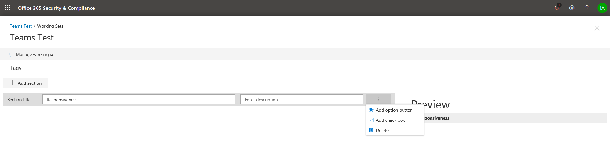

## Criar grupos de marcas

Antes que você ou outras pessoas possam marcar documentos em um conjunto de revisão, as marcas devem ser criadas. Você pode fazer isso criando grupos de marcas que contenham marcas filhas. As marcas são exibidas no painel de marcação ao revisar documentos em um conjunto de revisão.

Para criar um grupo de marcas:

1.  No conjunto de trabalho, selecione Gerenciar conjunto de trabalho.

> 

2.  Em seguida, selecione o link Gerenciar marcas.

> 

Uma vez dentro do gerenciamento de marca, as marcas podem ser criadas para atender aos requisitos de seu caso.

> Comece criando uma seção de marca

1.  Clique no botão "Adicionar seção"

> 

|                                                                                                                             |                                                                                                                                                                 |
| --------------------------------------------------------------------------------------------------------------------------- | --------------------------------------------------------------------------------------------------------------------------------------------------------------- |
| Tip | A tela de visualização será atualizada quando você salvar para que possa visualizar o painel de marcas sem ter que fechar a tela de gerenciamento de marca e voltar para o conjunto de trabalho. |

2.  Insira um título e uma descrição opcional. Para criar uma marca dentro dessa seção, clique nas reticências da seção nova marca para criar marcas nessa nova seção.
    
    

|                                                                                                                             |                                                                                                                                         |
| --------------------------------------------------------------------------------------------------------------------------- | --------------------------------------------------------------------------------------------------------------------------------------- |
| Tip | Marcas de opção forçarão os usuários a selecionar uma marca de um grupo de marcas. As marcas de caixa de seleção permitirão que os usuários selecionem qualquer combinação de marcas. |

## Marcas aninhadas

1.  Para aninhar marcas, clique nas reticências de uma **marca** e selecione uma nova marca para adicionar.
    
    

