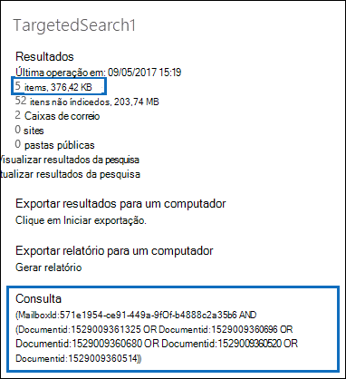

# Preparar um arquivo CSV para uma lista de IDs de Pesquisa de ConteúdoPrepare a CSV file for an ID list Content Search

Você pode pesquisar mensagens de email de caixa de correio específicas e outros itens de caixa de correio usando uma lista de IDs do Exchange.You can search for specific mailbox email messages and other mailbox items using a list of Exchange IDs. Para criar uma pesquisa de lista de IDs (chamada formalmente de pesquisa direcionada), envie um arquivo de valores separados por vírgula (CSV) que identifique os itens de caixa de correio específicos a ser pesquisado.To create an ID list search (formally called a targeted search), you submit a comma separated value (CSV) file that identifies the specific mailbox items to search for. Para esse arquivo CSV, você usa o arquivo **Results.csv** ou o arquivo **Items.csv** não Items.csvque são incluídos quando você exporta os resultados da Pesquisa de Conteúdo ou exporta um relatório de Pesquisa de Conteúdo da Pesquisa de Conteúdo e da Pesquisa de Conteúdo existente.For this CSV file you use the **Results.csv** file or the **Unindexed Items.csv** file that are included when you export the Content Search results or export a Content Search report from and existing Content Search. Em seguida, edite um desses arquivos para indicar os itens específicos a ser pesquisado e, em seguida, crie uma nova pesquisa de lista de IDs e envie o arquivo CSV.Then you edit one of these files to indicate the specific items to search for, and then create a new ID list search and submit the CSV file.

Aqui está uma rápida visão geral do processo de criação de uma pesquisa de lista de IDs.Here's a quick overview of the process for creating an ID list search.

1. Crie e execute uma Pesquisa de Conteúdo nova ou guiada no Centro de Conformidade & Segurança.Create and run a new or guided Content Search in the Security & Compliance Center.

2. Exporte os resultados da pesquisa de conteúdo ou exporte o relatório de pesquisa de conteúdo.Export the content search results or export the content search report. Para saber mais, confira:For more information, see:

    - [Exportar resultados de Pesquisa de ConteúdoExport Content Search results](export-search-results.md)

    - [Exportar um relatório da Pesquisa de ConteúdoExport a Content Search report](export-a-content-search-report.md)

3. Edite **oResults.csv** ou  o arquivo Items.csve identifique os itens de caixa de correio específicos que você deseja incluir na pesquisa de lista de IDs.Edit the **Results.csv** file or the **Unindexed Items.csv** and identify the specific mailbox items that you want to include in the ID list search. Consulte as [instruções](#prepare-the-csv-file-for-an-id-list-search) para preparar um arquivo CSV para uma pesquisa de lista de IDs.See the [instructions](#prepare-the-csv-file-for-an-id-list-search) for preparing a CSV file for an ID list search.

4. Crie uma nova pesquisa de lista de IDs (veja as [instruções)](#create-an-id-list-search)e envie o arquivo CSV que você preparou.Create a new ID list search (see the [instructions](#create-an-id-list-search)) and submit the CSV file that you prepared. A consulta de pesquisa criada pesquisa apenas os itens selecionados no arquivo CSV.The search query that's created will only search for the items selected in the CSV file.

> [!NOTE]
> As pesquisas de lista de IDs só têm suporte para itens de caixa de correio.ID list searches are only supported for mailbox items. Você não pode pesquisar documentos do SharePoint e do OneDrive em uma pesquisa de lista de IDs.You can't search for SharePoint and OneDrive documents in an ID list search.

 **Por que criar uma pesquisa de lista de IDs?****Why create an ID list search?** Se você não puder determinar se um item está respondendo a uma solicitação de Descoberta eDiscovery com base nos metadados nos arquivos **Results.csv** ou **não** Items.csv, você pode usar uma pesquisa de lista de IDs para encontrar, visualizar e exportar esse item para determinar se ele responde ao caso que você está investigando.If you're unable to determine if an item is responsive to an eDiscovery request based on the metadata in the **Results.csv** or **Unindexed Items.csv** files, you can use an ID list search to find, preview, and then export that item to determine if it's responsive to the case you're investigating. As pesquisas de lista de IDs são normalmente usadas para pesquisar e retornar um conjunto específico de itens não índicedos.ID list searches are typically used to search for and return a specific set of unindexed items.

## Preparar o arquivo CSV para uma pesquisa de lista de IDsPrepare the CSV file for an ID list search

Depois de exportar os resultados da pesquisa ou o relatório para uma pesquisa de conteúdo, você pode executar as seguintes etapas para preparar o arquivo CSV para uma pesquisa de lista de IDs.After you export the search results or report for a content search, you can perform the following steps to prepare the CSV file for an ID list search. Esse arquivo CSV identificará cada item na pesquisa da lista de IDs.This CSV file will identify every item in the ID list search.

Observe que você pode usar um arquivo CSV de uma pesquisa que incluiu  sites do SharePoint e contas do OneDrive, mas pode selecionar apenas itens de caixa de correio para uma pesquisa de lista de IDs.Note that you can use a CSV file from a search that included SharePoint sites and OneDrive accounts, but you can select  *only*  mailbox items for an ID list search. Se você selecionar um documento no SharePoint ou no OneDrive, o arquivo CSV falhará na validação ao criar uma pesquisa de lista de IDs.If you select a document in SharePoint or OneDrive, the CSV file will fail validation when you create an ID list search.

1. Abra o **Results.csv** arquivo de Items.csv **não Items.csv** no Excel.Open the **Results.csv** or **Unindexed Items.csv** file in Excel.

2. Na coluna **Selecionado,** digite **Sim** na célula que corresponde ao item que você deseja pesquisar.In the **Selected** column, type **Yes** in the cell that corresponds to the item that you want to search for. Repita essa etapa para cada item que você deseja pesquisar.Repeat this step for every item that you want to search for.

    > [!IMPORTANT]
    > Quando você abre o arquivo CSV no Excel, o formato de dados para a coluna **ID do** Documento é alterado para **Geral.**When you open the CSV file in Excel, the data format for the **Document ID** column is changed to **General**. Isso resulta na exibição da ID do documento de um item em notação científica.This results in displaying the document ID for an item in scientific notation. Por exemplo, a ID do documento "481037338205" é exibida como "4.81037E+11". Você precisa executar as  próximas etapas para alterar o formato de dados da coluna **ID** do Documento para Número para restaurar o formato correto para a ID do documento.For example, the document ID of "481037338205" is displayed as "4.81037E+11" You have to perform the next steps to change the data format of the **Document ID** column to **Number** to restore the correct format for the document ID. Se você não fizer isso, a pesquisa da lista de IDs que usa o arquivo CSV falhará.If you don't do this, the ID list search that uses the CSV file will fail.

3. Clique com o botão direito do mouse na coluna **ID do** Documento inteira e selecione **Formatar Células.**Right-click the entire **Document ID** column and select **Format Cells**.

4. Na caixa **Categoria,** clique em **Número.**In the **Category** box, click **Number**.

5. Altere o número de casas decimais para **0** e clique em **OK** para salvar suas alterações.Change the number of decimal places to **0**, and then click **OK** to save your changes. Observe que os valores na coluna ID do Documento são alterados para números.Notice that the values in the Document ID column are changed to numbers.

    Veja um exemplo de um arquivo CSV que está pronto para ser enviado para uma pesquisa de conteúdo de lista de IDs.Here's an example of the a CSV file that's ready to be submitted for a ID list content search.

    

6. Salve o arquivo CSV ou use **Salvar como** para salvar o arquivo com um nome de arquivo diferente.Save the CSV file or use **Save As** to the save the file with different file name. Em ambos os casos, certifique-se de salvar o arquivo com o formato CSV.In both cases, be sure to save the file with the CSV format.

## Criar uma pesquisa de lista de IDsCreate an ID list search

A próxima etapa é criar uma nova Lista de IDs de Pesquisa de Conteúdo e enviar o arquivo CSV que você preparou na etapa anterior.The next step is to create a new ID list Content Search and submit the CSV file that you prepared in the previous step.

> [!IMPORTANT]
> Você deve criar uma pesquisa de lista de IDs no mais de 2 dias após exportar os resultados ou relatório de uma Pesquisa de Conteúdo.You should create an ID list search no more than 2 days after exporting the results or report from a Content Search. Se os resultados da pesquisa ou relatório onde foi exportado há mais de 2 dias, exporte os resultados da pesquisa ou relatório para gerar arquivos CSV atualizados.If the search results or report where exported more than 2 days ago, you should re-export the search results or report to generate updated CSV files. Em seguida, você pode preparar um dos arquivos CSV atualizados e usá-lo para criar uma pesquisa de lista de IDs.Then you can prepare one of the updated CSV files and use it to create an ID list search.

1. No Centro de Conformidade & segurança, vá **para** Pesquisa \> **de Conteúdo de Pesquisa.**In the Security & Compliance Center, go to **Search** \> **Content search**.

2. Na página **Pesquisar,** clique na seta ao lado do ícone Adicionar Nova pesquisa e clique em   **IDs.**On the **Search** page, click the arrow next to  **New search**, and then click **Search by ID List**.

    

3. No flyout Pesquisar por **Lista de IDs,** nomee a  pesquisa (e, opcionalmente, descreva-a) e clique em Procurar e selecione o arquivo CSV preparado na etapa anterior.On the **Search by ID List** flyout, name the search (and optionally describe it) and then click **Browse** and select the CSV file that you prepared in the previous step.

    O Microsoft 365 tenta validar o arquivo CSV.Microsoft 365 attempts to validate the CSV file. Se a validação não for bem-sucedida, será exibida uma mensagem de erro que pode ajudá-lo a solucionar os erros de validação.If the validation is unsuccessful, an error message is displayed that might help you troubleshoot the validation errors. O arquivo CSV deve ser validado com êxito para criar uma pesquisa de lista de IDs.The CSV file has to be successfully validated to create an ID list search.

4. Depois que o arquivo CSV for validado com êxito, clique em **Pesquisar** para criar a pesquisa da lista de IDs.After the CSV file is successfully validated, click **Search** to create the ID list search.

    Veja um exemplo dos resultados estimados da pesquisa e da consulta gerada para uma pesquisa de lista de IDs.Here's an example of the estimated search results and the query that's generated for an ID list search.

    

    Observe que o número de itens estimados exibidos nas estatísticas da pesquisa de ID deve corresponder ao número de itens selecionados no arquivo CSV.Note that the number of estimated items displayed in statistics for the ID search should match the number of items that you selected in the CSV file.

5. Visualize ou exporte os itens retornados pela pesquisa de lista de IDs.Preview or export the items returned by the ID list search.

> [!NOTE]
> Se você mover uma caixa de correio após criar uma pesquisa de lista de IDs, a consulta para a pesquisa não retornará os itens especificados.If you move a mailbox after creating an ID list search, the query for the search won't return the specified items. Isso acontece porque a propriedade **DocumentId** dos itens da caixa de correio é alterada quando uma caixa de correio é movida.That's because the **DocumentId** property for mailbox items are changed when a mailbox is moved. Na rara instância em que uma caixa de correio é movida depois de criar uma pesquisa de lista de IDs, você deve criar uma nova pesquisa de conteúdo (ou atualizar os resultados da pesquisa para a pesquisa de conteúdo existente) e exportar os resultados da pesquisa ou relatório para gerar arquivos CSV atualizados que podem ser usados para criar uma nova pesquisa de lista de IDs.In the rare instance when a mailbox is moved after you create an ID list search, you should create a new content search (or update the search results for the existing content search) and then export the search results or report to generate updated CSV files that can be used to create a new ID list search.
