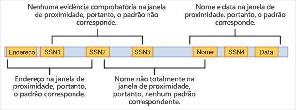
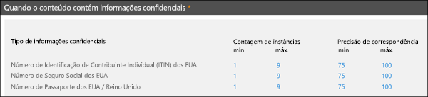

# Tipos de informações confidenciais personalizadas

O Microsoft 365 inclui muitos tipos de informações confidenciais integrados que estão prontos para usar em sua organização, como para a [DLP (prevenção de perda de dados)](data-loss-prevention-policies.md) ou com o [Microsoft Cloud App Security](https://docs.microsoft.com/cloud-app-security). Os tipos de informações confidenciais integrados podem ajudar a identificar e proteger números de cartão de crédito, números de contas bancárias, números de passaporte e muito mais, com base em padrões definidos por uma expressão regular (regex) ou por uma função. Para saber mais, consulte [O que os tipos de informações confidenciais procuram](what-the-sensitive-information-types-look-for.md).

Mas e se você precisar identificar e proteger um tipo diferente de informações confidenciais, como IDs de funcionários ou números de projetos, usando um formato específico para sua organização? Para fazer isso, você pode criar um tipo de informação confidencial personalizado.

As partes fundamentais de um tipo personalizado de informações confidenciais são:

- **Padrão principal**: números de ID de funcionário, números de projeto etc. Isso geralmente é identificado por uma expressão regular (RegEx), mas também pode ser uma lista de palavras-chave.

- **Additional evidence**: Suppose you're looking for a nine-digit employee ID number. Not all nine-digit numbers are employee ID numbers, so you can look for additional text: keywords like "employee", "badge", "ID", or other text patterns based on additional regular expressions. This supporting evidence (also known as _supporting_ or _corroborative_ evidence) increases the likelihood that nine-digit number found in content is really an employee ID number.

- **Character proximity**: It makes sense that the closer the primary pattern and the supporting evidence are to each other, the more likely the detected content is going to be what you're looking for. You can specify the character distance between the primary pattern and the supporting evidence (also known as the _proximity window_) as shown in the following diagram:

    

- **Confidence level**: The more supporting evidence you have, the higher the likelihood that a match contains the sensitive information you're looking for. You can assign higher levels of confidence for matches that are detected by using more evidence.

  When satisfied, a pattern returns a count and confidence level, which you can use in the conditions in your DLP policies. When you add a condition for detecting a sensitive information type to a DLP policy, you can edit the count and confidence level as shown in the following diagram:

    

## Criando tipos de informações confidenciais personalizadas

Para criar tipos de informações confidenciais personalizadas no Centro de Conformidade e Segurança, você pode escolher entre várias opções:

- **Use EDM** (NOVO!) Você pode configurar tipos de informações confidenciais personalizadas usando a classificação baseada em Exact Data Match (EDM). Esse método permite criar um tipo de informações confidenciais dinâmico usando um banco de dados seguro que você pode atualizar periodicamente. Confira [Criar um tipo de informações confidenciais personalizadas com classificação baseada em Exact Data Match](create-custom-sensitive-information-types-with-exact-data-match-based-classification.md).

- **Use o PowerShell** Você pode configurar tipos de informações confidenciais personalizadas usando o PowerShell. Embora esse método seja mais complexo do que usar a interface do usuário, você tem mais opções de configuração. Consulte [Criar um tipo de informações confidenciais personalizadas no Centro de Conformidade e Segurança do PowerShell](create-a-custom-sensitive-information-type-in-scc-powershell.md).

- **Usar a interface do usuário** Você pode configurar um tipo de informações confidenciais personalizadas usando o a interface do usuário do Centro de Conformidade e Segurança. Com esse método, você pode usar expressões comuns, palavras-chave e dicionários de palavras-chave. Para saber mais, confira [Criar um tipo de informações confidenciais personalizadas](create-a-custom-sensitive-information-type.md).

