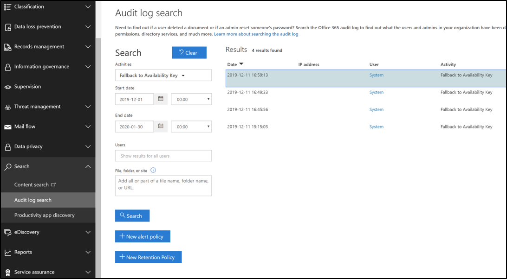

# Saiba mais sobre a chave disponibilidade da Chave de ClienteLearn about the availability key for Customer Key

A chave de disponibilidade é uma chave raiz gerada e provisionada automaticamente quando você cria uma política de criptografia de dados.The availability key is a root key automatically generated and provisioned when you create a data encryption policy. O Microsoft 365 armazena e protege a chave de disponibilidade.Microsoft 365 stores and protects the availability key. A chave de disponibilidade é funcionalmente como as duas chaves raiz que você fornece para criptografia de serviço com a Chave do Cliente.The availability key is functionally like the two root keys that you supply for service encryption with Customer Key. A chave de disponibilidade envolve as chaves uma camada inferior na hierarquia de chaves.The availability key wraps the keys one tier lower in the key hierarchy. Ao contrário das chaves que você fornece e gerencia no Azure Key Vault, não é possível acessar diretamente a chave de disponibilidade.Unlike the keys that you provide and manage in Azure Key Vault, you can't directly access the availability key. Os serviços automatizados do Microsoft 365 gerenciam a chave de disponibilidade programaticamente.Microsoft 365 automated services manage the availability key programatically. Esses serviços iniciam operações automatizadas que nunca envolvem acesso direto à chave de disponibilidade.These services initiate automated operations that never involve direct access to the availability key.

O principal objetivo da chave de disponibilidade é fornecer a capacidade de recuperação da perda inesperada de chaves raiz que você gerencia.The primary purpose of the availability key is to provide recovery capability from the unanticipated loss of root keys that you manage. A perda pode ser um resultado de um erro de gestão ou ação mal-intencionada.Loss could be a result of mismanagement or malicious action. Se você perder o controle das chaves raiz, entre em contato com o Suporte da Microsoft e a Microsoft o ajudará durante o processo de recuperação usando a chave de disponibilidade.If you lose control of your root keys, contact Microsoft Support and Microsoft will assist you through the process of recovery using the availability key. Você usará a chave de disponibilidade para migrar para uma nova Política de Criptografia de Dados com as novas chaves raiz provisionadas.You'll use the availability key to migrate to a new Data Encryption Policy with new root keys you provision.

O armazenamento e o controle da chave de disponibilidade são deliberadamente diferentes das chaves do Azure Key Vault por três motivos:Storage and control of the availability key are deliberately different from Azure Key Vault keys for three reasons:

- A chave de disponibilidade oferece uma recuperação, recurso de "quebra de vidro" se o controle sobre ambas as chaves do Azure Key Vault for perdido.The availability key provides a recovery, "break-glass" capability if control over both Azure Key Vault keys is lost.
- A separação de controles lógicos e locais de armazenamento seguro oferece defesa abrangente e protege contra a perda de todas as chaves e seus dados de um único ataque ou ponto de falha.The separation of logical controls and secure storage locations provides defense-in-depth and protects against the loss of all keys, and your data, from a single attack or point of failure.
- A chave de disponibilidade oferece um recurso de alta disponibilidade se os serviços do Microsoft 365 não puderem alcançar chaves hospedadas no Azure Key Vault devido a erros transitórios.The availability key provides a high-availability capability if Microsoft 365 services are unable to reach keys hosted in Azure Key Vault due to transient errors. Essa regra só se aplica à criptografia de serviço do Exchange Online e do Skype for Business.This rule only applies to Exchange Online and Skype for Business service encryption. Os arquivos do SharePoint Online, do OneDrive for Business e do Teams nunca usam a chave de disponibilidade, a menos que você instrua explicitamente a Microsoft a iniciar o processo de recuperação.SharePoint Online, OneDrive for Business, and Teams files never use the availability key unless you explicitly instruct Microsoft to initiate the recovery process.

Compartilhar a responsabilidade de proteger seus dados, usando uma variedade de proteções e processos para gerenciamento de chaves, acaba reduzindo o risco de que todas as chaves (e, portanto, seus dados) sejam permanentemente perdidas ou destruídas.Sharing the responsibility to protect your data, using a variety of protections and processes for key management, ultimately reduces the risk that all keys (and therefore your data) will be permanently lost or destroyed. A Microsoft fornece autoridade exclusiva sobre a desabilitação ou destruição da chave de disponibilidade quando você sai do serviço.Microsoft provides you with sole authority over the disablement or destruction of the availability key when you leave the service. Por design, ninguém da Microsoft tem acesso à chave de disponibilidade: ela só pode ser acessada pelo código de serviço do Microsoft 365.By design, no one at Microsoft has access to the availability key: it is only accessible by Microsoft 365 service code.

Consulte a [Central de Confiações da Microsoft](https://www.microsoft.com/trustcenter/Privacy/govt-requests-for-data) para obter mais informações sobre como podemos proteger as chaves.See the [Microsoft Trust Center](https://www.microsoft.com/trustcenter/Privacy/govt-requests-for-data) for more information about how we secure keys.
  
## Usos da chave de disponibilidadeAvailability key uses

A chave de disponibilidade oferece capacidade de recuperação para cenários em que um invasor mal-intencionado ou mal-intencionado externo roubará o controle do seu cofre de chaves ou quando um erro inadvertido resulta na perda de chaves raiz.The availability key provides recovery capability for scenarios in which an external malefactor or malicious insider steals control of your key vault, or when inadvertent mismanagement results in loss of root keys. Esse recurso de recuperação se aplica a todos os serviços do Microsoft 365 compatíveis com a Chave do Cliente.This recovery capability applies to all Microsoft 365 services compatible with Customer Key. Serviços individuais usam a chave de disponibilidade de maneira diferente.Individual services use the availability key differently. O Microsoft 365 só usa a chave de disponibilidade das maneiras descritas abaixo.Microsoft 365 only uses the availability key in the ways described below.

### Usos do Exchange Online e do Skype for BusinessExchange Online and Skype for Business uses

Além do recurso de recuperação, o Exchange Online e o Skype for Business usam a chave de disponibilidade para garantir a disponibilidade dos dados durante problemas operacionais transitórios ou intermitentes, relacionados ao serviço que acessa as chaves raiz.In addition to the recovery capability, Exchange Online and Skype for Business use the availability key to ensure data availability during transient, or intermittent operational issues, related to the service accessing root keys. Quando o serviço não consegue alcançar nenhuma das chaves do cliente no Azure Key Vault devido a erros transitórios, o serviço usa automaticamente a chave de disponibilidade.When the service cannot reach either of your Customer Keys in Azure Key Vault due to transient errors, the service automatically uses the availability key. O serviço NUNCA vai diretamente para a chave de disponibilidade.The service NEVER goes directly to the availability key.

Sistemas automatizados no Exchange Online e no Skype for Business podem usar a chave de disponibilidade durante erros transitórios para dar suporte a serviços de back-end automatizados, como antivírus, descoberta automática, prevenção contra perda de dados, movimentações de caixa de correio e indexação de dados.Automated systems in Exchange Online and Skype for Business may use the availability key during transient errors to support automated back-end services such as anti-virus, e-discovery, data loss prevention, mailbox moves, and data indexing.

### Os arquivos do SharePoint Online, do OneDrive for Business e do Teams sãoSharePoint Online, OneDrive for Business, and Teams files uses

Para arquivos do SharePoint Online, OneDrive for Business e Teams, a chave de disponibilidade NUNCA é usada fora do recurso de recuperação e os clientes devem instruir explicitamente a Microsoft a iniciar o uso da chave de disponibilidade durante um cenário de recuperação.For SharePoint Online, OneDrive for Business, and Teams files, the availability key is NEVER used outside of the recovery capability and customers must explicitly instruct Microsoft to initiate use of the availability key during a recovery scenario. As operações de serviço automatizadas dependem exclusivamente das chaves do cliente no Azure Key Vault.Automated service operations solely rely on your Customer Keys in Azure Key vault. Para obter informações detalhadas sobre como a hierarquia de chaves funciona para esses serviços, confira como os arquivos do [SharePoint Online, do OneDrive for Business](#how-sharepoint-online-onedrive-for-business-and-teams-files-use-the-availability-key)e do Teams usam a chave de disponibilidade.For in-depth information about how the key hierarchy works for these services, see [How SharePoint Online, OneDrive for Business, and Teams files use the availability key](#how-sharepoint-online-onedrive-for-business-and-teams-files-use-the-availability-key).

## Segurança da chave de disponibilidadeAvailability key security

A Microsoft compartilha a responsabilidade de proteção de dados com você, instando a chave de disponibilidade e tomando medidas abrangentes para protegê-la.Microsoft shares the responsibility of data protection with you by instantiating the availability key and taking extensive measures to protect it. A Microsoft não expõe o controle direto da chave de disponibilidade para os clientes.Microsoft does not expose direct control of the availability key to customers. Por exemplo, você só pode rolar (girar) as teclas que possui no Azure Key Vault.For example, you can only roll (rotate) the keys that you own in Azure Key Vault. Para obter mais informações, [consulte Rolar ou girar uma chave do cliente ou uma chave de disponibilidade.](customer-key-availability-key-roll.md)For more information, see [Roll or rotate a customer key or an availability key](customer-key-availability-key-roll.md).

### Armazenamentos secretos da chave de disponibilidadeAvailability key secret stores

A Microsoft protege as chaves de disponibilidade em armazenamentos secretos internos controlados por acesso, como o Azure Key Vault voltado para o cliente.Microsoft protects availability keys in access-controlled, internal secret stores like the customer-facing Azure Key Vault. Implementamos controles de acesso para impedir que os administradores da Microsoft acessem diretamente os segredos contidos.We implement access controls to prevent Microsoft administrators from directly accessing the secrets contained within. Operações do Armazenamento Secreto, incluindo rotação e exclusão de chaves, ocorrem por meio de comandos automatizados que nunca envolvem acesso direto à chave de disponibilidade.Secret Store operations, including key rotation and deletion, occur through automated commands that never involve direct access to the availability key. As operações de gerenciamento de armazenamento secreto são limitadas a engenheiros específicos e exigem escalonamento de privilégios por meio de uma ferramenta interna, o Lockbox.Secret store management operations are limited to specific engineers and require privilege escalation through an internal tool, Lockbox. O escalonamento de privilégios requer aprovação do gerente e justificativa antes de ser concedido.Privilege escalation requires manager approval and justification prior to being granted. O Lockbox garante que o acesso esteja vinculado ao tempo com revogação automática de acesso após a expiração do tempo ou logoff do engenheiro.Lockbox ensures access is time bound with automatic access revocation upon time expiration or engineer log out.

**As chaves de disponibilidade do Exchange Online e do Skype for Business** são armazenadas em um armazenamento secreto do Active Directory do Exchange Online.**Exchange Online and Skype for Business** availability keys are stored in an Exchange Online Active Directory secret store. As chaves de disponibilidade são armazenadas com segurança dentro de contêineres específicos do locatário no Controlador de Domínio do Active Directory.Availability keys are securely stored inside tenant specific containers within the Active Directory Domain Controller. Esse local de armazenamento seguro é separado e isolado do armazenamento secreto de arquivos do SharePoint Online, do OneDrive for Business e do Teams.This secure storage location is separate and isolated from the SharePoint Online, OneDrive for Business, and Teams files secret store.

As chaves de disponibilidade de arquivos do **SharePoint Online, do OneDrive for Business** e do Teams são armazenadas em um armazenamento secreto interno gerenciado pela equipe de serviço.**SharePoint Online, OneDrive for Business, and Teams files** availability keys are stored in an internal secret store managed by the service team. Esse serviço protegido de armazenamento de segredos tem servidores front-end com pontos de extremidade de aplicativo e um banco de dados SQL como back-end.This secured, secrets storage service has front-end servers with application endpoints and a SQL Database as the back end. As chaves de disponibilidade são armazenadas no Banco de Dados SQL e são envolvidas (criptografadas) por chaves de criptografia de armazenamento secreto que usam uma combinação de AES-256 e HMAC para criptografar a chave de disponibilidade em repouso.Availability keys are stored in the SQL Database and are wrapped (encrypted) by secret store encryption keys that use a combination of AES-256 and HMAC to encrypt the availability key at rest. As chaves de criptografia de armazenamento secreto são armazenadas em um componente logicamente isolado do mesmo banco de dados SQL e são criptografadas ainda mais com chaves RSA-2048 contidas em certificados gerenciados pela autoridade de certificação (CA) da Microsoft.The secret store encryption keys are stored in a logically isolated component of the same SQL Database and are further encrypted with RSA-2048 keys contained in certificates managed by the Microsoft certificate authority (CA). Esses certificados são armazenados nos servidores front-end do armazenamento secreto que executam operações no banco de dados.These certificates are stored in the secret store front-end servers that perform operations against the database.

### Defesa abrangenteDefense-in-depth

A Microsoft emprega uma estratégia de defesa abrangente para impedir que atores mal-intencionados a impactem na confidencialidade, integridade ou disponibilidade dos dados do cliente armazenados no Microsoft Cloud.Microsoft employs a defense-in-depth strategy to prevent malicious actors from impacting the confidentiality, integrity, or availability of customer data stored in the Microsoft Cloud. Controles preventivos e de desdocamento específicos são implementados para proteger o armazenamento secreto e a chave de disponibilidade como parte da estratégia de segurança abrangente.Specific preventive and detective controls are implemented to protect the secret store and the availability key as part of the overarching security strategy.

O Microsoft 365 foi criado para evitar o uso indevido da chave de disponibilidade.Microsoft 365 is built to prevent misuse of the availability key. A camada do aplicativo é o único método por meio do qual as chaves, incluindo a chave de disponibilidade, podem ser usadas para criptografar e descriptografar dados.The application layer is the only method through which keys, including the availability key, can be used to encrypt and decrypt data. Somente o código de serviço do Microsoft 365 tem a capacidade de interpretar e percorrer a hierarquia de chaves para atividades de criptografia e descriptografia.Only Microsoft 365 service code has the ability to interpret and traverse the key hierarchy for encryption and decryption activities. O isolamento lógico existe entre os locais de armazenamento das Chaves do Cliente, chaves de disponibilidade, outras chaves hierárquicas e dados do cliente.Logical isolation exists between the storage locations of Customer Keys, availability keys, other hierarchical keys, and customer data. Esse isolamento reduz o risco de exposição de dados caso um ou mais locais sejam comprometidos.This isolation mitigates the risk of data exposure in the event one or more locations are compromised. Cada camada na hierarquia criou recursos de detecção de invasão de 24 x 7 para proteger dados e segredos armazenados.Each layer in the hierarchy has built in 24x7 intrusion detection capabilities to protect data and secrets stored.

Os controles de acesso são implementados para impedir o acesso não autorizado a sistemas internos, incluindo armazenamentos secretos da chave de disponibilidade.Access controls are implemented to prevent unauthorized access to internal systems, including availability key secret stores. Os engenheiros da Microsoft não têm acesso direto aos principais armazenamentos secretos de disponibilidade.Microsoft engineers don't have direct access to the availability key secret stores. Para obter detalhes adicionais sobre controles de acesso, revise [os Controles de Acesso Administrativo no Microsoft 365.](https://docs.microsoft.com/Office365/securitycompliance/office-365-administrative-access-controls-overview)For additional detail on access controls, review [Administrative Access Controls in Microsoft 365](https://docs.microsoft.com/Office365/securitycompliance/office-365-administrative-access-controls-overview).

Os controles técnicos impedem que os funcionários da Microsoft se desdoem de contas de serviço altamente privilegiadas, que podem ser usadas por invasores para representar os serviços Microsoft.Technical controls prevent Microsoft personnel from logging into highly-privileged service accounts, which might otherwise be used by attackers to impersonate Microsoft services. Por exemplo, esses controles impedem o logon interativo.For example, these controls prevent interactive logon.

Os controles de monitoramento e registro em log de segurança são outra proteção de defesa abrangente implementada que reduz o risco para os serviços Microsoft e seus dados.Security logging and monitoring controls are another defense-in-depth safeguard implemented that mitigate risk to Microsoft services and your data. As equipes de serviço da Microsoft implantaram soluções de monitoramento ativas que geram alertas e logs de auditoria.Microsoft service teams have deployed active monitoring solutions that generate alerts and audit logs. Todas as equipes de serviço carregam seus logs em um repositório central onde os logs são agregados e processados.All service teams upload their logs to a central repository where the logs are aggregated and processed. As ferramentas internas examinam automaticamente os registros para confirmar que os serviços estão funcionando em um estado ideal, resiliente e seguro.Internal tools automatically examine records to confirm that services are functioning in an optimal, resilient, and secure state. Atividade incomum sinalizada para revisão posterior.Unusual activity is flagged for further review.

Qualquer evento de log que indique uma possível violação da Política de Segurança da Microsoft é imediatamente levado à atenção das equipes de segurança da Microsoft.Any log event that indicates a potential violation of the Microsoft Security Policy is immediately brought to the attention of Microsoft security teams. A segurança do Microsoft 365 configurou alertas para detectar tentativas de acesso a armazenamentos secretos da chave de disponibilidade.Microsoft 365 security has configured alerts to detect attempted access to availability key secret stores. Os alertas também são gerados se a equipe da Microsoft tentar fazer logon interativo em contas de serviço, o que é proibido e protegido por controles de acesso.Alerts are also generated if Microsoft personnel attempt interactive logon to service accounts, which is prohibited and protected by access controls. A segurança do Microsoft 365 também detecta e alerta nos desvios do serviço microsoft 365 das operações normais de linha de base.Microsoft 365 security also detects and alerts upon deviations of the Microsoft 365 service from normal baseline operations. A tentativa de usar indevidamente os serviços do Microsoft 365 acionaria alertas que resultam na reação dos participantes do ambiente de nuvem da Microsoft.Malefactors attempting to misuse Microsoft 365 services would trigger alerts resulting in the offender's eviction from the Microsoft cloud environment.

## Usar a chave de disponibilidade para se recuperar da perda de chaveUse the availability key to recover from key loss

Se você perder o controle de suas Chaves do Cliente, a chave de disponibilidade lhe oferece a capacidade de recuperar e criptografar seus dados.If you lose control of your Customer Keys, the availability key provides you the ability to recover and re-encrypt your data.

### Procedimento de recuperação para o Exchange Online e o Skype for BusinessRecovery procedure for Exchange Online and Skype for Business

Se você perder o controle de suas Chaves do Cliente, a chave de disponibilidade lhe dará a capacidade de recuperar seus dados e colocar seus recursos afetados do Microsoft 365 novamente online.If you lose control of your Customer Keys, the availability key gives you the capability to recover your data and bring your impacted Microsoft 365 resources back online. A chave de disponibilidade continua a proteger seus dados enquanto você se recupera. Em um nível alto, para se recuperar totalmente da perda de chave, você precisará criar uma nova DEP e mover os recursos afetados para a nova política.The availability key continues to protect your data while you recover.At a high level, to fully recover from key loss, you'll need to create a new DEP and move impacted resources to the new policy.

Para criptografar seus dados com novas Chaves do Cliente, crie novas chaves no Azure Key Vault, crie uma nova DEP usando as novas Chaves do Cliente e atribua a nova DEP às caixas de correio atualmente criptografadas com a DEP anterior para a qual as chaves foram perdidas ou comprometidas.To encrypt your data with new Customer Keys, create new keys in Azure Key Vault, create a new DEP using the new Customer Keys, then assign the new DEP to the mailboxes currently encrypted with the previous DEP for which the keys were lost or compromised.

Esse processo de recriptação pode levar até 72 horas.This re-encryption process can take up to 72 hours. Essa é a duração padrão quando você altera uma DEP.This is the standard duration when you change a DEP.
  
### Procedimento de recuperação para arquivos do SharePoint Online, OneDrive for Business e TeamsRecovery procedure for SharePoint Online, OneDrive for Business, and Teams files

Para arquivos do SharePoint Online, OneDrive for Business e Teams, a chave de disponibilidade NUNCA é usada fora do recurso de recuperação.For SharePoint Online, OneDrive for Business, and Teams files, the availability key is NEVER used outside of the recovery capability. Você deve instruir explicitamente a Microsoft a iniciar o uso da chave de disponibilidade durante um cenário de recuperação.You must explicitly instruct Microsoft to initiate use of the availability key during a recovery scenario. Para iniciar o processo de recuperação, entre em contato com a Microsoft para ativar a chave de disponibilidade.To initiate the recovery process, contact Microsoft to activate the availability key. Depois de ativada, a chave de disponibilidade é usada automaticamente para descriptografar seus dados, permitindo criptografar os dados com uma DEP recém-criada associada às novas Chaves do Cliente.Once activated, the availability key is automatically used to decrypt your data allowing you to encrypt the data with a newly-created DEP associated to new Customer Keys.  

Essa operação é proporcional ao número de sites em sua organização.This operation is proportional to the number of sites in your organization. Depois de chamar a Microsoft para usar a chave de disponibilidade, você deverá estar totalmente online em cerca de quatro horas.Once you call Microsoft to use the availability key, you should be fully online within about four hours.

## Como o Exchange Online e o Skype for Business usam a chave de disponibilidadeHow Exchange Online and Skype for Business use the availability key

Quando você cria uma DEP com a Chave do Cliente, o Microsoft 365 gera uma Chave de Política de Criptografia de Dados (CHAVE DEP) associada a essa DEP.When you create a DEP with Customer Key, Microsoft 365 generates a Data Encryption Policy Key (DEP Key) associated with that DEP. O serviço criptografa a chave DEP três vezes: uma com cada uma das chaves do cliente e uma com a chave de disponibilidade.The service encrypts the DEP Key three times: once with each of the customer keys and once with the availability key. Somente as versões criptografadas da Chave DEP são armazenadas, e uma chave DEP só pode ser descriptografada com as chaves do cliente ou a chave de disponibilidade.Only the encrypted versions of the DEP Key are stored, and a DEP Key can only be decrypted with the customer keys or the availability key. A chave DEP é usada para criptografar chaves de caixa de correio, que criptografam caixas de correio individuais.The DEP Key is then used to encrypt Mailbox Keys, which encrypt individual mailboxes.
  
O Microsoft 365 segue esse processo para descriptografar e fornecer dados quando os clientes estão usando o serviço:Microsoft 365 follows this process to decrypt and provide data when customers are using the service:
  
1. Descriptografar a chave DEP usando a Chave do Cliente.Decrypt the DEP Key using the Customer Key.

2. Use a chave DEP descriptografada para descriptografar uma chave de caixa de correio.Use the decrypted DEP Key to decrypt a Mailbox Key.

3. Use a Chave de Caixa de Correio descriptografada para descriptografar a própria caixa de correio, permitindo que você acesse os dados dentro da caixa de correio.Use the decrypted Mailbox Key to decrypt the mailbox itself, allowing you to access the data within the mailbox.

## Como os arquivos do SharePoint Online, do OneDrive for Business e do Teams usam a chave de disponibilidadeHow SharePoint Online, OneDrive for Business, and Teams files use the availability key

A arquitetura e a implementação do SharePoint Online e do OneDrive for Business para a Chave do Cliente e a chave de disponibilidade são diferentes do Exchange Online e do Skype for Business.The SharePoint Online and OneDrive for Business architecture and implementation for Customer Key and availability key are different from Exchange Online and Skype for Business.
  
Quando uma organização passa para chaves gerenciadas pelo cliente, o Microsoft 365 cria uma chave intermediária (TIK) específica da organização.When an organization moves to customer-managed keys, Microsoft 365 creates an organization-specific intermediate key (TIK). O Microsoft 365 criptografa o TIK duas vezes, uma vez com cada uma das chaves do cliente, e armazena as duas versões criptografadas do TIK.Microsoft 365 encrypts the TIK twice, once with each of the customer keys, and stores the two encrypted versions of the TIK. Somente as versões criptografadas do TIK são armazenadas, e um TIK só pode ser descriptografado com as chaves do cliente.Only the encrypted versions of the TIK are stored, and a TIK can only be decrypted with the customer keys. Em seguida, o TIK é usado para criptografar chaves do site, que são usadas para criptografar chaves de blob (também chamadas de chaves de bloco de arquivo).The TIK is then used to encrypt site keys, which are then used to encrypt blob keys (also called file chunk keys). Dependendo do tamanho do arquivo, o serviço pode dividir um arquivo em vários blocos de arquivos cada um com uma chave exclusiva.Depending on file size, the service may split a file into multiple file chunks each with a unique key. Os blobs (blocos de arquivos) são criptografados com as chaves de blob e armazenados no serviço de armazenamento de Blobs do Microsoft Azure.The blobs (file chunks) themselves are encrypted with the blob keys and stored in the Microsoft Azure Blob storage service.
  
O Microsoft 365 segue esse processo para descriptografar e fornecer arquivos de cliente quando os clientes estão usando o serviço:Microsoft 365 follows this process to decrypt and provide customer files when customers are using the service:

1. Descriptografe o TIK usando a Chave do Cliente.Decrypt the TIK using the Customer Key.

2. Use o TIK descriptografado para descriptografar uma chave de site.Use the decrypted TIK to decrypt a site key.

3. Use a chave de site descriptografada para descriptografar uma chave de blob.Use the decrypted site key to decrypt a blob key.

4. Use a chave de blob descriptografada para descriptografar o blob.Use the decrypted blob key to decrypt the blob.

O Microsoft 365 descriptografa um TIK em meio à emissão de duas solicitações de descriptografia para o Azure Key Vault com um pequeno deslocamento.Microsoft 365 decrypts a TIK by issuing two decryption requests to Azure Key Vault with a slight offset. O primeiro a concluir fornece o resultado, cancelando a outra solicitação.The first one to finish furnishes the result, canceling the other request.
  
Caso você perca o acesso às chaves do cliente, o Microsoft 365 também criptografa o TIK com uma chave de disponibilidade e armazena isso junto com os TIKs criptografados com cada chave do cliente.In case you lose access to your customer keys, Microsoft 365 also encrypts the TIK with an availability key and stores this along with the TIKs encrypted with each customer key. O TIK criptografado com a chave de disponibilidade é usado somente quando o cliente chama a Microsoft para incluir o caminho de recuperação quando perderam o acesso às chaves, maliciosamente ou acidentalmente.The TIK encrypted with the availability key is used only when the customer calls Microsoft to enlist the recovery path when they have lost access to their keys, maliciously or accidentally.
  
Por motivos de disponibilidade e escala, os TIKs descriptografados são armazenados em cache em um cache de memória com tempo limitado.For availability and scale reasons, decrypted TIKs are cached in a time-limited memory cache. Duas horas antes de um cache TIK ser definido para expirar, o Microsoft 365 tenta descriptografar cada TIK.Two hours before a TIK cache is set to expire, Microsoft 365 attempts to decrypt each TIK. Descriptografar os TIKs estende o tempo de vida do cache.Decrypting the TIKs extends the lifetime of the cache. Se a descriptografia TIK falhar por um período de tempo significativo, o Microsoft 365 gerará um alerta para notificar a engenharia antes da expiração do cache.If TIK decryption fails for a significant amount of time, Microsoft 365 generates an alert to notify engineering prior to the cache expiration. Somente se o cliente chamar a Microsoft, o Microsoft 365 iniciará a operação de recuperação, que envolve a descriptografia do TIK com a chave de disponibilidade armazenada no armazenamento secreto da Microsoft e a integração do locatário novamente usando o TIK descriptografado e um novo conjunto de chaves do Azure Key Vault fornecida pelo cliente.Only if the customer calls Microsoft will Microsoft 365 initiate the recovery operation, which involves decrypting the TIK with the availability key stored in Microsoft's secret store and onboarding the tenant again using the decrypted TIK and a new set of customer-supplied Azure Key Vault keys.
  
A partir de hoje, a Chave do Cliente está envolvida na cadeia de criptografia e descriptografia dos dados de arquivo do SharePoint Online armazenados no armazenamento de blob do Azure, mas não nos itens de lista ou metadados do SharePoint Online armazenados no Banco de Dados SQL.As of today, Customer Key is involved in the encryption and decryption chain of SharePoint Online file data stored in the Azure blob store, but not SharePoint Online list items or metadata stored in the SQL Database. O Microsoft 365 não usa a chave de disponibilidade para arquivos do Exchange Online, Skype for Business, SharePoint Online, OneDrive for Business e Teams diferentes do caso descrito acima, que é iniciado pelo cliente.Microsoft 365 does not use the availability key for Exchange Online, Skype for Business, SharePoint Online, OneDrive for Business, and Teams files other than the case described above, which is customer-initiated. O acesso humano aos dados do cliente é protegido pelo Sistema de Proteção de Dados do Cliente.Human access to customer data is protected by Customer Lockbox.

## Gatilhos da chave de disponibilidadeAvailability key triggers

O Microsoft 365 aciona a chave de disponibilidade somente em circunstâncias específicas.Microsoft 365 triggers the availability key only in specific circumstances. Essas circunstâncias diferem por serviço.These circumstances differ by service.

### Gatilhos para o Exchange Online e o Skype for BusinessTriggers for Exchange Online and Skype for Business
  
1. O Microsoft 365 lê a DEP à qual a caixa de correio é atribuída para determinar o local das duas Chaves do Cliente no Azure Key Vault.Microsoft 365 reads the DEP to which the mailbox is assigned in order to determine the location of the two Customer Keys in Azure Key Vault.

2. O Microsoft 365 escolhe aleatoriamente uma das duas Chaves do Cliente da DEP e envia uma solicitação ao Azure Key Vault para desempacodar a chave DEP usando a Chave do Cliente.Microsoft 365 randomly chooses one of the two Customer Keys from the DEP and sends a request to Azure Key Vault to unwrap the DEP key using the Customer Key.

3. Se a solicitação para desempacolhar a chave DEP usando a Chave do Cliente falhar, o Microsoft 365 enviará uma segunda solicitação para o Azure Key Vault, desta vez instruindo-a a usar a Chave de Cliente alternativa (segunda).If the request to unwrap the DEP key using the Customer Key fails, Microsoft 365 sends a second request to Azure Key Vault, this time instructing it to use the alternate (second) Customer Key.

4. Se a segunda solicitação para desempacar a chave DEP usando a Chave do Cliente falhar, o Microsoft 365 examinará os resultados das duas solicitações.If the second request to unwrap the DEP key using the Customer Key fails, Microsoft 365 examines the results of both requests.

    - Se o exame determinar que as solicitações falharam ao retornar um ERRO do sistema:If the examination determines that the requests failed returning a system ERROR:

       - O Microsoft 365 dispara a chave de disponibilidade para descriptografar a chave DEP.Microsoft 365 triggers the availability key to decrypt the DEP key.

       - Em seguida, o Microsoft 365 usa a chave DEP para descriptografar a chave da caixa de correio e concluir a solicitação do usuário.Microsoft 365 then uses the DEP key to decrypt the mailbox key and complete the user request. 

       - Nesse caso, o Azure Key Vault não pode responder ou ficar inacessível devido a um ERRO transitório.In this case, Azure Key Vault is either unable to respond or unreachable due to a transient ERROR.

    - Se o exame determinar que as solicitações falharam ao retornar ACESSO NEGADO:If the examination determines that the requests failed returning ACCESS DENIED:

       - Isso significa que uma ação deliberada, inadvertida ou mal-intencionada foi tomada para tornar as chaves do cliente indisponíveis (por exemplo, durante o processo de limpeza de dados como parte da saída do serviço).This means deliberate, inadvertent, or malicious action has been taken to render the customer keys unavailable (for example, during the data purge process as part of leaving the service).

       - Nesse caso, a chave de disponibilidade será usada somente para ações do sistema e não para ações do usuário, a solicitação do usuário falhará e o usuário receberá uma mensagem de erro.In this case, the availability key will be used only for system actions and not for user actions, the user request fails, and the user receives an error message.

>[!IMPORTANT]
>O código de serviço do Microsoft 365 sempre tem um token de logon válido para o raciocínio dos dados do cliente para fornecer serviços de nuvem que agregam valor.Microsoft 365 service code always has a valid login token for reasoning over customer data to provide value-adding cloud services. Portanto, até que a chave de disponibilidade seja excluída, ela pode ser usada como um fallback para ações iniciadas pelo Exchange Online e pelo Skype for Business, como a criação de índice de pesquisa ou a movimentação de caixas de correio.Therefore, until the availability key has been deleted, it can be used as a fallback for actions initiated by, or internal to, Exchange Online and Skype for Business such as search index creation or moving mailboxes. Isso se aplica a solicitações transitórias DE ERROS e ACESSO NEGADO ao Azure Key Vault.This applies to both transient ERRORS and ACCESS DENIED requests to Azure Key Vault.

### Gatilhos para arquivos do SharePoint Online, OneDrive for Business e TeamsTriggers for SharePoint Online, OneDrive for Business, and Teams files

Para arquivos do SharePoint Online, OneDrive for Business e Teams, a chave de disponibilidade NUNCA é usada fora do recurso de recuperação e os clientes devem instruir explicitamente a Microsoft a iniciar o uso da chave de disponibilidade durante um cenário de recuperação.For SharePoint Online, OneDrive for Business, and Teams files, the availability key is NEVER used outside of the recovery capability and customers must explicitly instruct Microsoft to initiate use of the availability key during a recovery scenario.

## Logs de auditoria e a chave de disponibilidadeAudit logs and the availability key

Os sistemas automatizados no Microsoft 365 processam todos os dados à medida que fluem pelo sistema para fornecer serviços de nuvem, por exemplo, antivírus, descoberta automática, prevenção contra perda de dados e indexação de dados.Automated systems in Microsoft 365 process all data as it flows through the system to provide cloud services, for example, anti-virus, e-discovery, data loss prevention, and data indexing. O Microsoft 365 não gera logs visíveis do cliente para essa atividade.Microsoft 365 does not generate customer-visible logs for this activity. Além disso, a equipe da Microsoft não acessa seus dados como parte dessas operações normais do sistema.In addition, Microsoft personnel do not access your data as part of these normal system operations.

### Log de chaves de disponibilidade do Exchange Online e do Skype for BusinessExchange Online and Skype for Business availability key logging

Quando o Exchange Online e o Skype for Business acessam a chave de disponibilidade para fornecer o serviço, o Microsoft 365 publica logs visíveis para o cliente acessíveis no Centro de Conformidade e Segurança.When Exchange Online and Skype for Business accesses availability key to provide service, Microsoft 365 publishes customer-visible logs accessible from the Security and Compliance Center. Um registro de log de auditoria para a operação da chave de disponibilidade é gerado sempre que o serviço usa a chave de disponibilidade.An audit log record for the availability key operation is generated each time the service uses the availability key. Um novo tipo de registro chamado "Criptografia de Serviço de Chave de Cliente" com o tipo de atividade "Fallback to Availability Key" permite que os administradores filtrem os resultados da pesquisa do [Log](https://docs.microsoft.com/microsoft-365/compliance/search-the-audit-log-in-security-and-compliance) de Auditoria Unificada para exibir os registros das chaves de disponibilidade.A new record type called "Customer Key Service Encryption" with activity type "Fallback to Availability Key" allows admins to filter [Unified Audit Log](https://docs.microsoft.com/microsoft-365/compliance/search-the-audit-log-in-security-and-compliance) search results to view availability key records.

Os registros de log incluem atributos como data, hora, atividade, ID da organização e ID da política de criptografia de dados.Log records include attributes such as date, time, activity, organization ID, and data encryption policy ID. O registro está disponível como parte dos Logs de Auditoria Unificados e pode ser acessado na guia Pesquisa de Log de Auditoria do Centro de Conformidade & Segurança.The record is available as part of Unified Audit Logs and is accessible from the Security & Compliance Center Audit Log Search tab.

Os registros de chave de disponibilidade do Exchange Online  e do Skype for Business usam o esquema comum da Atividade de Gerenciamento do Office 365 com parâmetros personalizados adicionados: ID da Política, ID da Versão da Chave de Escopo e ID da Solicitação.Exchange Online and Skype for Business availability key records use the Office 365 Management Activity [common schema](https://docs.microsoft.com/office/office-365-management-api/office-365-management-activity-api-schema#common-schema) with added custom parameters: Policy Id, Scope Key Version Id, and Request Id.

### Log de chaves de disponibilidade de arquivos do SharePoint Online, OneDrive for Business e TeamsSharePoint Online, OneDrive for Business, and Teams files availability key logging

O log da chave de disponibilidade ainda não está disponível para esses serviços.Availability key logging isn't available yet for these services. Para arquivos do SharePoint Online, OneDrive for Business e Teams, a chave de disponibilidade só é ativada pela Microsoft, quando instruído por você, para fins de recuperação.For SharePoint Online, OneDrive for Business, and Teams files, the availability key is only activated by Microsoft, when instructed by you, for recovery purposes. Como resultado, você já sabe todos os eventos nos quais a chave de disponibilidade é usada para esses serviços.As a result, you already know every event in which the availability key is used for these services.

## Chave de disponibilidade na hierarquia da Chave do ClienteAvailability key in the Customer Key hierarchy
  
O Microsoft 365 usa a chave de disponibilidade para quebrar a camada de chaves inferior na hierarquia de chaves estabelecida para a criptografia de serviço de Chave de Cliente.Microsoft 365 uses the availability key to wrap the tier of keys lower in the key hierarchy established for Customer Key service encryption. Hierarquias-chave diferentes existem entre os serviços.Different key hierarchies exist between services. Os algoritmos de chave também diferem entre as chaves de disponibilidade e outras chaves na hierarquia de cada serviço aplicável.Key algorithms also differ between availability keys and other keys in the hierarchy of each applicable service. Os algoritmos de chave de disponibilidade usados pelos diferentes serviços são os seguinte:The availability key algorithms used by the different services are as follows:

- As chaves de disponibilidade do Exchange Online e do Skype for Business usam o AES-256.The Exchange Online and Skype for Business availability keys use AES-256.

- As chaves de disponibilidade de arquivos do SharePoint Online, do OneDrive for Business e do Teams usam RSA-2048.The SharePoint Online, OneDrive for Business, and Teams files availability keys use RSA-2048.

### Codificações de criptografia usadas para criptografar chaves para o Exchange Online e o Skype for BusinessEncryption ciphers used to encrypt keys for Exchange Online and Skype for Business

### Codificações de criptografia usadas para criptografar chaves para o SharePoint Online e o OneDrive for BusinessEncryption ciphers used to encrypt keys for SharePoint Online and OneDrive for Business

## Artigos relacionadosRelated articles

- [Criptografia do serviço com a Chave de ClienteService encryption with Customer Key](customer-key-overview.md)

- [Configurar a Chave do ClienteSet up Customer Key](customer-key-set-up.md)

- [Gerenciar Chave do ClienteManage Customer Key](customer-key-manage.md)

- [Rolar ou girar uma Chave de Cliente ou uma chave de disponibilidadeRoll or rotate a Customer Key or an availability key](customer-key-availability-key-roll.md)
