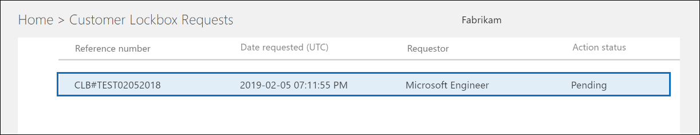

# Customer Lockbox in Office 365Customer Lockbox in Office 365

Este artigo fornece diretrizes de implantação e configuração para o Customer Lockbox.This article provides deployment and configuration guidance for Customer Lockbox. O Sistema de Proteção de Dados do Cliente dá suporte a solicitações de dados de acesso nos aplicativos Exchange Online, SharePoint Online e OneDrive for Business. Customer Lockbox supports requests to access data in Exchange Online, SharePoint Online, and OneDrive for Business. Para recomendar suporte para outros serviços, envie uma solicitação em Office 365 [UserVoice](https://office365.uservoice.com/).To recommend support for other services, please submit a request at [Office 365 UserVoice](https://office365.uservoice.com/).

Para ver as opções de licenciamento de seus usuários para se beneficiarem de ofertas de conformidade Microsoft 365, incluindo esta, a partir de 1º de abril de 2020, consulte as diretrizes de licenciamento Microsoft 365 para conformidade & [segurança.](/office365/servicedescriptions/microsoft-365-service-descriptions/microsoft-365-tenantlevel-services-licensing-guidance/microsoft-365-security-compliance-licensing-guidance)To see the options for licensing your users to benefit from Microsoft 365 compliance offerings, including this one, as of April 1, 2020, see the [Microsoft 365 licensing guidance for security & compliance](/office365/servicedescriptions/microsoft-365-service-descriptions/microsoft-365-tenantlevel-services-licensing-guidance/microsoft-365-security-compliance-licensing-guidance).

O Customer Lockbox garante que a Microsoft não possa acessar seu conteúdo para executar uma operação de serviço sem sua aprovação explícita.Customer Lockbox ensures that Microsoft cannot access your content to perform a service operation without your explicit approval. O Sistema de Proteção de Dados do Cliente leva você para o fluxo de trabalho de aprovação para solicitações de acesso ao seu conteúdo.Customer Lockbox brings you into the approval workflow for requests to access your content.

Ocasionalmente, os engenheiros da Microsoft ajudam a solucionar e corrigir problemas relatados por clientes no processo de suporte.Occasionally, Microsoft engineers help troubleshoot and fix customer reported issues in the support process. Normalmente, os problemas são corrigidos por meio de ferramentas de depuração e telemetria abrangentes que a Microsoft possui para seus serviços.Usually, issues are fixed through extensive telemetry and debugging tools Microsoft has in place for its services. No entanto, alguns casos exigem que um engenheiro da Microsoft acesse o conteúdo do cliente para determinar a causa raiz e corrigir o problema.However, some cases require a Microsoft engineer to access customer content to determine the root cause and fix the issue. O Sistema de Proteção de Dados do Cliente exige que o engenheiro solicite acesso do cliente como uma etapa final no fluxo de trabalho de aprovação.Customer Lockbox requires the engineer to request access from the customer as a final step in the approval workflow. Isso oferece às organizações a opção de aprovar ou negar essas solicitações e fornecer controle de acesso direto ao cliente.This gives organizations the option to approve or deny these requests, and provide direct-access control to the customer.

### Vídeo de visão geral do Customer LockboxCustomer Lockbox overview video

> [!VIDEO https://www.microsoft.com/videoplayer/embed/8fecf10b-1f03-4849-8b67-76d3d2a43f26?autoplay=false]

## Fluxo de trabalho do Sistema de Proteção de Dados do ClienteCustomer Lockbox workflow

As seguintes etapas descrevem o fluxo de trabalho típico quando um engenheiro da Microsoft inicia uma solicitação do Sistema de Proteção de Dados do Cliente:The following steps outline the typical workflow when a Microsoft engineer initiates a Customer Lockbox request:

1. Uma pessoa de uma organização tem um problema com a caixa de correio do Microsoft 365.Someone at an organization experiences an issue with their Microsoft 365 mailbox.

2. Depois de tentar solucionar o problema, mas não conseguir, será aberta uma solicitação de suporte junto à Microsoft.After the user troubleshoots the issue, but can't fix it, they open a support request with Microsoft Support.

3. Um engenheiro de Suporte da Microsoft analisa a solicitação de serviço e determina a necessidade de acessar o locatário da organização para reparar o problema no Exchange Online.A Microsoft support engineer reviews the service request and determines a need to access the organization's tenant to repair the issue in Exchange Online.

4. O engenheiro de Suporte da Microsoft entra na ferramenta de solicitação do Sistema de Proteção de Dados do Cliente e faz uma solicitação de acesso aos dados que inclui o nome do locatário da organização, o número da solicitação de serviço e o tempo estimado que o engenheiro precisará para acessar os dados.The Microsoft support engineer logs into the Customer Lockbox request tool and makes a data access request that includes the organization's tenant name, service request number, and the estimated time the engineer needs access to the data.

5. Depois que um gerente de Suporte da Microsoft aprovar a solicitação, o Sistema de Proteção de Dados do Cliente enviará ao aprovador designado na organização uma notificação por email sobre a solicitação de acesso pendente da Microsoft.After a Microsoft Support manager approves the request, Customer Lockbox sends the designated approver at the organization an email notification about the pending access request from Microsoft.

    

   Qualquer pessoa que tenha a função de administrador [aprovador](/office365/admin/add-users/about-admin-roles) de acesso ao Cofre de Cliente no centro de administração Microsoft 365 pode aprovar solicitações de Caixa de Bloqueio do Cliente.Anyone who is assigned the [Customer Lockbox access approver](/office365/admin/add-users/about-admin-roles) admin role in Microsoft 365 admin center can approve Customer Lockbox requests.

6. O aprovador entrará no centro de administração Microsoft 365 e aprovará a solicitação.The approver signs in to the Microsoft 365 admin center and approves the request. Esta etapa aciona a criação de um registro de auditoria disponível pesquisando o log de auditoria.This step triggers the creation of an audit record available by searching the audit log. Para obter mais informações, consulte [Auditing Customer Lockbox requests](#auditing-customer-lockbox-requests).For more information, see [Auditing Customer Lockbox requests](#auditing-customer-lockbox-requests).

   Se o cliente rejeitar a solicitação ou não aprovar a solicitação dentro de 12 horas, a solicitação expirará e nenhum acesso será concedido ao engenheiro da Microsoft.If the customer rejects the request or doesn't approve the request within 12 hours, the request expires and no access is granted to the Microsoft engineer.

   > [!IMPORTANT]
   > A Microsoft não inclui links em notificações de email do Customer Lockbox exigindo que você entre Office 365.Microsoft does not include any links in Customer Lockbox email notifications requiring you to sign in to Office 365.

7. Depois que o aprovador da organização aprovar a solicitação, o engenheiro da Microsoft receberá a mensagem de aprovação, fará o logon do locatário no Exchange Online e corrigirá o problema do cliente.After the approver from the organization approves the request, the Microsoft engineer receives the approval message, logs into the tenant in Exchange Online, and fixes the customer's issue. Os engenheiros da Microsoft têm o tempo solicitado para corrigir o problema, após o qual o acesso será revogado automaticamente.Microsoft engineers have the requested duration to fix the issue after which the access is automatically revoked.

> [!NOTE]
> Todas as ações realizadas por um engenheiro da Microsoft são registradas no log de auditoria.All actions performed by a Microsoft engineer are logged in the audit log. Você pode pesquisar e analisar esses registros de auditoria.You can search for and review these audit records.

## Ativar ou desativar solicitações de Caixa de Bloqueio do ClienteTurn Customer Lockbox requests on or off

Você pode ativar os controles do Sistema de Proteção de Dados do Cliente no Centro de administração do Microsoft 365.You can turn on Customer Lockbox controls in the Microsoft 365 admin center. Ao ativar o Customer Lockbox, a Microsoft deve obter a aprovação da sua organização antes de acessar qualquer conteúdo do locatário.When you turn on Customer Lockbox, Microsoft must obtain your organization's approval before accessing any of your tenant's content.

1. Usando uma conta de trabalho ou de estudante que tenha o administrador global ou a função de aprovador de acesso ao **Customer Lockbox** atribuída, acesse [https://admin.microsoft.com](https://admin.microsoft.com) e entre.Using a work or school account that has either the global administrator or the **Customer Lockbox access approver** role assigned, go to [https://admin.microsoft.com](https://admin.microsoft.com) and sign in.

2. Escolha **Configurações > Org Configurações**.Choose **Settings > Org Settings**.

3. Selecione **Segurança & Edição** do Cofre de Privacidade do Cliente e, em seguida, mova a alternância para Ativar ou Desativar para ativar ou desativar o  >    >  recurso.  Select **Security & Privacy** > **Customer Lockbox** > **Edit**, and then move the toggle to **On** or **Off** to turn the feature on or off.

    

## Aprovar ou negar uma solicitação de Proteção de Dados do ClienteApprove or deny a Customer Lockbox request

1. Usando uma conta de trabalho ou de estudante que tenha o administrador global ou a função de aprovador de acesso ao **Customer Lockbox** atribuída, acesse [https://admin.microsoft.com](https://admin.microsoft.com) e entre.Using a work or school account that has either the global administrator or the **Customer Lockbox access approver** role assigned, go to [https://admin.microsoft.com](https://admin.microsoft.com) and sign in.

2. Escolha **Suporte > Solicitações de Caixa de Bloqueio do Cliente.**Choose **Support > Customer Lockbox Requests**.

    

    Uma lista de solicitações de Caixa de Bloqueio do Cliente é exibida.A list of Customer Lockbox requests displays.

    

3. Selecione uma solicitação de Caixa de Bloqueio do Cliente e escolha **Aprovar ou** **Negar**.Select a Customer Lockbox request, and then choose **Approve** or **Deny**.

    

    Uma mensagem de confirmação sobre a aprovação da solicitação de Caixa de Bloqueio do Cliente é exibida.A confirmation message about the approval of the Customer Lockbox request displays.

    

> [!NOTE]
> Use o cmdlet Set-AccessToCustomerDataRequest para aprovar, negar ou cancelar solicitações de sistema de proteção de dados do cliente do Microsoft 365 que controlam o acesso aos seus dados por engenheiros de suporte da Microsoft.Use the Set-AccessToCustomerDataRequest cmdlet to approve, deny, or cancel Microsoft 365 customer lockbox requests that control access to your data by Microsoft support engineers. Para obter mais informações, [consulte Set-AccessToCustomerDataRequest](/powershell/module/exchange/set-accesstocustomerdatarequest).For more information, see [Set-AccessToCustomerDataRequest](/powershell/module/exchange/set-accesstocustomerdatarequest).

## Auditoria de solicitações de Proteção de Dados do ClienteAuditing Customer Lockbox requests

Os registros de auditoria que correspondem às solicitações do Customer Lockbox são registrados no log de auditoria.Audit records that correspond to the Customer Lockbox requests are logged in the audit log. Você pode acessar esses logs usando a ferramenta de pesquisa [de log](search-the-audit-log-in-security-and-compliance.md) de auditoria no Centro de Conformidade & Segurança.You can access these logs by using the [audit log search tool](search-the-audit-log-in-security-and-compliance.md) in the Security & Compliance Center. Ações relacionadas a aceitar ou negar uma solicitação de Caixa de Bloqueio de Clientes e ações executadas pelos engenheiros da Microsoft (quando as solicitações de acesso são aprovadas) também são registradas no log de auditoria.Actions related to accepting or denying a Customer Lockbox request and actions performed by Microsoft engineers (when access requests are approved) are also logged in the audit log. Você pode pesquisar e analisar esses registros de auditoria.You can search for and review these audit records.

### Pesquisar no log de auditoria atividades relacionadas a solicitações do Customer LockboxSearch the audit log for activity related to Customer Lockbox requests

Antes de poder usar o log de auditoria para controlar as solicitações do Sistema de Proteção de Dados do Cliente, há algumas etapas que você precisa tomar para configurar o log de auditoria.Before you can use the audit log to track requests for Customer Lockbox, there are some steps you need to take to set up audit logging. Para obter mais informações, [consulte Pesquisar o log de auditoria no Centro de Conformidade & Segurança.](/office365/securitycompliance/search-the-audit-log-in-security-and-compliance#before-you-begin)For more information, see [Search the audit log in the Security & Compliance Center](/office365/securitycompliance/search-the-audit-log-in-security-and-compliance#before-you-begin). Depois de concluir a instalação, use estas etapas para criar uma consulta de pesquisa de log de auditoria para retornar registros de auditoria relacionados ao Customer Lockbox:Once you've completed setup, use these steps to create an audit log search query to return audit records related to Customer Lockbox:

1. Acesse [https://protection.office.com](https://protection.office.com).Go to [https://protection.office.com](https://protection.office.com).
  
2. Entre usando sua conta de trabalho ou da escola.Sign in using your work or school account.

3. No painel esquerdo do Centro de Conformidade & segurança, escolha **Pesquisar**&  >  **pesquisa de log de auditoria de investigação.**In the left pane of the Security & Compliance Center, choose **Search & investigation** > **Audit log search**.

    A **página de pesquisa de log** de auditoria é exibida.The **Audit log search** page displays.

    
  
4. Configure os seguintes critérios de pesquisa: Configure the following search criteria:

    1. **Atividades** - Deixe esse campo em branco para que a pesquisa retorne registros de auditoria para todas as atividades.**Activities** - Leave this field blank so that the search returns audit records for all activities. Isso é necessário para retornar quaisquer registros de auditoria relacionados a solicitações de Customer Lockbox e atividades correspondentes executadas pelos engenheiros da Microsoft.This is necessary to return any audit records related to Customer Lockbox requests and corresponding activity performed by Microsoft engineers.

    1. **Data de** início **e data de** término - Selecione uma data e intervalo de tempo para exibir os eventos que ocorreram nesse período.**Start date** and **End date** - Select a date and time range to display the events that occurred within that period.

    1. **Usuários** - Deixe esse campo em branco.**Users** - Leave this field blank.

    1. **Arquivo, pasta ou site** - Deixe este campo em branco.**File, folder, or site** - Leave this field blank.

5. Clique em **Pesquisar** para executar a pesquisa usando seus critérios de pesquisa. Click **Search** to run the search using your search criteria.

    Os resultados da pesquisa são carregados e, após alguns instantes, eles são exibidos em **Resultados** na página de pesquisa **de log de** auditoria.The search results are loaded, and after a few moments they are displayed under **Results** on the **Audit log search** page.

6. Clique **em Filtrar** resultados na página de resultados da pesquisa e faça uma das seguintes coisas:Click **Filter results** on the search results page, and do one of the following things:

   - Para exibir registros de auditoria relacionados a um aprovador em sua organização aprovando  ou negando uma solicitação de Caixa de Bloqueio do Cliente: Na caixa na coluna Atividade, digite **Set-AccessToCustomerDataRequest**.To display audit records related to an approver in your organization approving or denying a Customer Lockbox request: In the box under the **Activity** column, type **Set-AccessToCustomerDataRequest**.

   - Para exibir registros de auditoria relacionados a um engenheiro da Microsoft executando ações  em resposta a uma solicitação de Caixa de Bloqueio do Cliente aprovada: na caixa na coluna Usuário, digite **Operador microsoft**.To display audit records related to a Microsoft engineer performing actions in response to an approved Customer Lockbox request: In the box under the **User** column, type **Microsoft Operator**. A **coluna Atividade** exibe a ação executada pelo engenheiro.The **Activity** column displays the action performed by the engineer.

      

7. Na lista de resultados, clique em um registro de auditoria para exibi-lo.In the list of results, click an audit record to display it.

### Registro de auditoria de uma solicitação de acesso do Sistema de Proteção de Dados do ClienteAudit record for a Customer Lockbox access request

Quando uma pessoa em sua organização aprova ou nega uma solicitação de Caixa de Bloqueio do Cliente, um registro de auditoria é registrado no log de auditoria.When a person in your organization approves or denies a Customer Lockbox request, an audit record is logged in the audit log. Esse registro contém as seguintes informações.This record contains the following information.

| Propriedade de registro de auditoriaAudit record property| DescriçãoDescription|
|:---------- |:----------|
| DateDate       | A data e a hora em que a solicitação de Proteção de Dados do Cliente foi aprovada ou negada.The date and time when the Customer Lockbox request was approved or denied.
| Endereço IPIP address | O endereço IP do computador usado pelo aprovador para aprovar ou recusar uma solicitação.The IP address of the machine the approver used to approve or deny a request. |
| UsuárioUser       | A conta de serviço BOXServiceAccount@ \[ customerforest \] .prod.outlook.com.The service account BOXServiceAccount@\[customerforest\].prod.outlook.com.            |
| AtividadeActivity   | Set-AccessToCustomerDataRequest: esta é a atividade de auditoria registrada quando você aprova ou nega uma solicitação de Proteção de Dados do Cliente.Set-AccessToCustomerDataRequest; this is the auditing activity that is logged when you approve or deny a Customer Lockbox request.                                |
| ItemItem       | O Guid da solicitação de Caixa de Bloqueio do ClienteThe Guid of the Customer Lockbox request                             |

A captura de tela a seguir mostra um exemplo de um registro de log de auditoria que corresponde a uma solicitação de Caixa de Bloqueio de Cliente aprovada.The following screenshot shows an example of an audit log record that corresponds to an approved Customer Lockbox request. Se uma solicitação de Caixa de Bloqueio de Cliente foi negada, o valor do parâmetro **ApprovalDecision** seria **Deny**.If a Customer Lockbox request was denied, then the value of **ApprovalDecision** parameter would be **Deny**.

> [!TIP]
> Para exibir informações mais detalhadas em um registro de auditoria, clique **em Mais informações.**To display more detailed information in an audit record, click **More information**.

### Registro de auditoria para uma ação executada por um engenheiro da MicrosoftAudit record for an action performed by a Microsoft engineer

As ações executadas por um engenheiro da Microsoft após uma solicitação de Proteção de Dados do Cliente ser aprovada (e que podem resultar em acessar o conteúdo do cliente) são registradas no log de auditoria. Esses registros contêm as seguintes informações.The actions performed by a Microsoft engineer after a Customer Lockbox request is approved (and that may result in accessing customer content) are logged in the audit log. These records contain the following information.

| Propriedade de registro de auditoriaAudit record property| DescriçãoDescription|
|:---------- |:----------|
| DateDate       | Data em que a ação foi executada.Date time when the action was performed. Observe que o tempo em que essa ação foi realizada será de até quatro horas após a solicitação de Proteção de Dados do Cliente ter sido aprovada.Note that the time that this action was performed will be within 4 hours of when the Customer Lockbox request was approved.              |
| Endereço IPIP address | O Endereço IP da máquina da Microsoft usada pelo engenheiro.The IP Address of the machine Microsoft engineer used. |
| UsuárioUser       | Microsoft Operator: esse valor indica que esse registro está relacionado a uma solicitação de Proteção de Dados do Cliente.Microsoft Operator; this value indicates that this record is related to a Customer Lockbox request.                                  |
| AtividadeActivity   | Nome da atividade realizada pelo engenheiro da Microsoft.Name of the activity performed by the Microsoft engineer.|
| ItemItem       | \<empty\>                                             |

## Perguntas frequentesFrequently asked questions

#### A quais Microsoft 365 serviços se aplicam ao Customer Lockbox?Which Microsoft 365 services does Customer Lockbox apply to?

O Customer Lockbox atualmente tem suporte no Exchange Online, SharePoint Online e OneDrive for Business.Customer Lockbox is currently supported in Exchange Online, SharePoint Online, and OneDrive for Business.

#### O Customer Lockbox está disponível para todos os clientes?Is Customer Lockbox available to all customers?

O Customer Lockbox está incluído nas assinaturas Microsoft 365 ou Office 365 E5 e pode ser adicionado a outros planos com uma Proteção de Informações e Conformidade ou uma assinatura de complemento de Conformidade Avançada.Customer Lockbox is included with the Microsoft 365 or Office 365 E5 subscriptions and can be added to other plans with an Information Protection and Compliance or an Advanced Compliance add-on subscription. Confira [Planos e preços para](https://products.office.com/business/office-365-enterprise-e5-business-software) obter mais informações.Please see [Plans and pricing](https://products.office.com/business/office-365-enterprise-e5-business-software) for more information.

#### O que é conteúdo do cliente?What is customer content?

O conteúdo do cliente são os dados criados pelos usuários de serviços Microsoft 365 aplicativos.Customer content is the data created by users of Microsoft 365 services and applications. Exemplos de conteúdo do cliente incluem:Examples of customer content include:

- Corpo do e-mail ou anexos de e-mailEmail body or email attachments

- Conteúdo do site do Microsoft Office SharePoint OnlineSharePoint site contents

- Informações no corpo de um arquivo do Microsoft Office SharePoint OnlineInformation in the body of a SharePoint file

- Skype for Business corpo do arquivo de apresentaçãoSkype for Business presentation file body

- Mensagens instantâneas (IM) ou conversas de vozInstant messages (IM) or voice conversations

- Dados de blob gerados pelo cliente ou armazenamento estruturado (por exemplo, Contêiners SQL)Customer-generated blob or structured storage data (for example, SQL Containers)

- Informações de segurança de propriedade do cliente (por exemplo, certificados, chaves de criptografia e senhas)Customer-owned security information (for example, certificates, encryption keys, and passwords)

- Inferências e todas as inferências subsequentes, se o conteúdo do cliente permanecerInferences, and all subsequent inferences, if customer content remains

Para obter informações adicionais sobre o conteúdo do cliente Office 365, consulte o [Office 365 Central de Confiações](https://products.office.com/business/office-365-trust-center-privacy/).For additional information about customer content in Office 365, see the [Office 365 Trust Center](https://products.office.com/business/office-365-trust-center-privacy/).

#### Who é notificado quando há uma solicitação para acessar meu conteúdo?Who is notified when there is a request to access my content?

Os administradores globais e qualquer pessoa atribuída à função de administrador aprovador de acesso ao Customer Lockbox são notificados.Global administrators and anyone assigned the Customer Lockbox access approver admin role are notified. Esses também são os mesmos usuários que podem aprovar as solicitações do Customer Lockbox.These are also the same users who can approve for Customer Lockbox requests.

#### Who pode aprovar ou rejeitar essas solicitações na minha organização?Who can approve or reject these requests in my organization?

Os administradores globais e qualquer pessoa atribuída à função de administrador aprovador de acesso ao Cofre de Cliente pode aprovar solicitações de Caixa de Bloqueio do Cliente.Global administrators and anyone assigned the Customer Lockbox access approver admin role can approve Customer Lockbox requests. Os clientes controlam essas atribuições de função em suas organizações.Customers control these role assignments in their organizations.

#### Como faço para entrar no Cofre do Cliente?How do I opt in to Customer Lockbox?

Um administrador global pode habilitar e configurar o Customer Lockbox no Microsoft 365 ou Microsoft 365 de administração.A global administrator can enable and configure Customer Lockbox in the Microsoft 365 or Microsoft 365 admin center.

#### Se eu aprovar uma solicitação de Caixa de Bloqueio do Cliente, o que o engenheiro pode fazer e como saberei o que o engenheiro da Microsoft fez?If I approve a Customer Lockbox request, what can the engineer do and how will I know what the Microsoft engineer did?

Depois de aprovar uma solicitação de Cofre do Cliente, o engenheiro da Microsoft concedeu esses privilégios necessários para acessar o conteúdo do cliente usando cmdlets pré-aprovados.After you approve a Customer Lockbox request, the Microsoft engineer granted these necessary privileges to access customer content by using pre-approved cmdlets. As ações realizadas pelos engenheiros da Microsoft em resposta às solicitações do Customer Lockbox são registradas e acessíveis no log de auditoria no Centro de Conformidade & Segurança.Actions taken by Microsoft engineers in response to Customer Lockbox requests are logged and accessible in the audit log in the Security & Compliance Center.

#### Como saber se a Microsoft segue o processo de aprovação?How do I know that Microsoft follows the approval process?

Você pode fazer referência cruzada às notificações de aprovação de email enviadas aos administradores e aprovadores em sua organização com o histórico de solicitações de Caixa de Bloqueio do Cliente no centro de administração Microsoft 365 cliente.You can cross-reference the email approval notifications sent to admins and approvers in your organization with the Customer Lockbox request history in the Microsoft 365 admin center.

O Customer Lockbox está incluído no relatório de auditoria [mais recente do SOC 1 SSAE 16.](https://servicetrust.microsoft.com/ViewPage/MSComplianceGuide?command=Download&downloadType=Document&downloadId=91592749-e86a-43ac-801e-121382614681&docTab=4ce99610-c9c0-11e7-8c2c-f908a777fa4d_SOC%20%2F%20SSAE%2016%20Reports)Customer Lockbox is included in the latest [SOC 1 SSAE 16 audit report](https://servicetrust.microsoft.com/ViewPage/MSComplianceGuide?command=Download&downloadType=Document&downloadId=91592749-e86a-43ac-801e-121382614681&docTab=4ce99610-c9c0-11e7-8c2c-f908a777fa4d_SOC%20%2F%20SSAE%2016%20Reports). Para obter mais detalhes, você pode encontrar os relatórios mais recentes no [Microsoft Service Trust Portal](https://servicetrust.microsoft.com/ViewPage/MSComplianceGuide?command=Download&downloadType=Document&downloadId=91592749-e86a-43ac-801e-121382614681&docTab=4ce99610-c9c0-11e7-8c2c-f908a777fa4d_SOC%20%2F%20SSAE%2016%20Reports).For more details, you can find the latest reports in the [Microsoft Service Trust Portal](https://servicetrust.microsoft.com/ViewPage/MSComplianceGuide?command=Download&downloadType=Document&downloadId=91592749-e86a-43ac-801e-121382614681&docTab=4ce99610-c9c0-11e7-8c2c-f908a777fa4d_SOC%20%2F%20SSAE%2016%20Reports).

#### A Microsoft pode modificar a lista de aprovadores do meu locatário?Can Microsoft modify the list of approvers for my tenant? Caso não seja, como isso é impedido?If not, how is it prevented?

Somente um administrador global em sua organização pode especificar quem pode aprovar solicitações de Caixa de Bloqueio do Cliente.Only a global administrator in your organization can specify who can approve Customer Lockbox requests. Isso significa que apenas os membros do grupo administrador global no Azure Active Directory podem especificar quem pode aprovar a solicitação.That means only the members of the Global administrator group in Azure Active Directory can specify who can approve request. A associação ao grupo de administradores global no Azure Active Directory é gerenciada somente pela sua organização.Membership of the Global administrator group in Azure Active Directory is managed only by your organization.

#### E se eu precisar de mais informações sobre uma solicitação de acesso ao conteúdo para aprove-la?What if I need more information about a content access request to approve it?

Cada solicitação do Customer Lockbox contém um Microsoft 365 de solicitação de serviço.Each Customer Lockbox request contains a Microsoft 365 service request number. Você pode entrar em contato com o Suporte da Microsoft e fazer referência a esse número de serviço para obter mais informações sobre a solicitação.You can contact Microsoft Support and reference this service number to get more information about the request.

#### Quando uma solicitação de Cofre de Cliente é aprovada, por quanto tempo as permissões são válidas?When a Customer Lockbox request is approved, how long are the permissions valid?

Atualmente, o período máximo para as permissões de acesso concedidas ao engenheiro da Microsoft é de 4 horas.Currently, the maximum period for the access permissions granted to the Microsoft engineer is 4 hours. O engenheiro da Microsoft também pode solicitar um período mais curto.The Microsoft engineer can also request a shorter period.

#### Como posso obter um histórico de todas as solicitações do Customer Lockbox?How can I get a history of all Customer Lockbox requests?

Todas as solicitações do Customer Lockbox são exibidas no Microsoft 365 de administração.All Customer Lockbox requests are viewed in the Microsoft 365 admin center.

#### Como correlacionar as solicitações de acesso ao conteúdo com os logs de auditoria relacionados?How do I correlate the content access requests with the related audit logs?

O Feed de Atividades do Centro de Conformidade contém atividades de log do Customer Lockbox.The Compliance Center Activity Feed contains log activities of Customer Lockbox. Os clientes podem fazer referência cruzada às atividades de log de Caixa de Bloqueio do Cliente a partir do feed de atividade em relação à solicitação de email que recebem.Customers can cross-reference the Customer Lockbox log activities from the activity feed against the email request they receive.

#### O que acontece quando um cliente não responde a uma solicitação de Caixa de Bloqueio do Cliente?What happens when a customer doesn't respond to a Customer Lockbox request?

As solicitações de Sistema de Proteção de Dados do Cliente têm uma duração padrão de 12 horas.Customer Lockbox requests have a default duration of 12 hours. Se você não responder a uma solicitação dentro de 12 horas, a solicitação expirará.If you don't respond to a request within 12 hour, the request expires.

#### O que a Microsoft faz quando um cliente rejeita uma solicitação de Caixa de Bloqueio do Cliente?What does Microsoft do when a customer rejects a Customer Lockbox request?

Se um cliente rejeitar uma solicitação do Customer Lockbox, não ocorrerá acesso ao conteúdo do cliente.If a customer rejects a Customer Lockbox request, no access to customer content occurs. Se um usuário em sua organização continuar a experimentar um problema de serviço exigindo que a Microsoft acesse o conteúdo do cliente para resolver o problema, o problema de serviço poderá persistir e a Microsoft informará o usuário sobre isso.If a user in your organization continues to experience a service issue requiring Microsoft to access customer content to resolve the issue, then the service issue might persist and Microsoft will inform the user about this.

#### O Customer Lockbox protege contra solicitações de dados de agências de aplicação da lei ou de terceiros?Does Customer Lockbox protect against data requests from law enforcement agencies or other third parties?

Não.No. A Microsoft leva a sério as solicitações de terceiros para dados do cliente.Microsoft takes third-party requests for customer data seriously. Como provedor de serviços de nuvem, a Microsoft sempre defende a privacidade dos dados do cliente.As a cloud service provider, Microsoft always advocates for the privacy of customer data. Caso obtenhamos uma intimação, a Microsoft sempre tenta redirecionar o terceiro para o cliente para obter as informações.In the event we get a subpoena, Microsoft always attempts to redirect the third party to the customer to obtain the information. (Leia o blog de Brad Smith: [Protegendo os dados do cliente contra o snooping do governo](https://blogs.microsoft.com/blog/2013/12/04/protecting-customer-data-from-government-snooping/)).(Read Brad Smith's blog: [Protecting customer data from government snooping](https://blogs.microsoft.com/blog/2013/12/04/protecting-customer-data-from-government-snooping/)). Publicamos periodicamente [informações detalhadas sobre](https://www.microsoft.com/corporate-responsibility/lerr) as solicitações de aplicação da lei que a Microsoft recebe.We periodically publish [detailed information](https://www.microsoft.com/corporate-responsibility/lerr) about the law enforcement requests that Microsoft receives.

Consulte o [Centro de Confiança da Microsoft em](https://www.microsoft.com/trustcenter/default.aspx) relação a solicitações de dados de terceiros e a seção "Divulgação de Dados do Cliente" nos Termos de Serviços [Online](https://www.microsoft.com/Licensing/product-licensing/products.aspx) para obter mais informações.See the [Microsoft Trust Center](https://www.microsoft.com/trustcenter/default.aspx) regarding third-party data requests and the "Disclosure of Customer Data" section in the [Online Services Terms](https://www.microsoft.com/Licensing/product-licensing/products.aspx) for more information.

#### Como a Microsoft garante que um membro de sua equipe não tenha acesso permanente ao conteúdo do cliente em Office 365 aplicativos?How does Microsoft ensure that a member of its staff doesn't have standing access to customer content in Office 365 applications?

A Microsoft implementa medidas preventivas abrangentes por meio de sistemas de controle de acesso e medidas de detetive para identificar e resolver tentativas de contornar esses sistemas de controle de acesso.Microsoft implements extensive preventive measures through access control systems, and detective measures to identify and address attempts to circumvent these access control systems. Microsoft 365 opera com os princípios de menor privilégio e acesso just-in-time.Microsoft 365 operates with the principles of least privilege and just-in-time access. Portanto, nenhuma equipe da Microsoft tem permissão para acessar o conteúdo do cliente de forma contínua.Therefore, no Microsoft personnel have permission to access customer content on an ongoing basis. Se a permissão for concedida, será por uma duração limitada.If permission is granted, it is for a limited duration. 

Microsoft 365 usa um sistema de controle de acesso chamado *Lockbox* para processar solicitações de permissões que concedam a capacidade de executar funções operacionais e administrativas dentro do serviço.Microsoft 365 uses an access control system called *Lockbox* to process requests for permissions that grant the ability to perform operational and administrative functions within the service. Um operador deve solicitar acesso ao conteúdo do cliente usando o Lockbox, o que exige que uma segunda pessoa tome medidas sobre a solicitação (por exemplo, aprove-a) antes que o acesso seja concedido.An operator must request access to customer content using Lockbox, which then requires a second person to take action on the request (e.g., approve it) before access is granted. Essa segunda pessoa não pode ser o solicitante e deve ser designada para aprovar o acesso ao conteúdo do cliente.That second person can't be the requestor and must be designated to approve access to customer content. Somente se a solicitação for aprovada o operador adquirirá acesso temporário ao conteúdo do cliente.Only if the request is approved does the operator acquire temporary access to customer content. Após o período de elevação expirar, o Lockbox revoga o acesso.After the elevation period expires, Lockbox revokes access.

Consulte os Termos de [Serviços Online para](https://www.microsoft.com/licensing/product-licensing/products) obter mais detalhes sobre as práticas gerais de segurança da Microsoft.Please refer to the [Online Services Terms](https://www.microsoft.com/licensing/product-licensing/products) for more details about Microsoft general security practices.

#### Em que circunstâncias os engenheiros da Microsoft precisam de acesso ao meu conteúdo?Under what circumstances do Microsoft engineers need access to my content?

O cenário mais comum em que os engenheiros da Microsoft precisam acessar o conteúdo do cliente é quando o cliente faz uma solicitação de suporte que exige acesso para solução de problemas.The most common scenario where Microsoft engineers need access customer content is when the customer makes a support request requiring access for troubleshooting. Um princípio básico da Microsoft 365 é que o serviço opera sem o acesso da Microsoft ao conteúdo do cliente.A foundational principle of Microsoft 365 is that the service operates without Microsoft access to customer content. Quase todas as operações de serviço executadas pela Microsoft são totalmente automatizadas e o envolvimento humano é altamente controlado e abstraído do conteúdo do cliente.Nearly all service operations performed by Microsoft are fully automated and human involvement is highly controlled and abstracted away from customer content. O objetivo Microsoft 365 acesso ao conteúdo do cliente para dar suporte ao serviço não é necessário até que o cliente aprove uma solicitação específica para o acesso da Microsoft.The goal for Microsoft 365 is access to customer content to support the service isn't needed until the customer approves a specific request for Microsoft access.

#### Eu já achei que meus dados estavam seguros com a nuvem da Microsoft, então por que preciso de Caixa de Bloqueio do Cliente?I already thought my data was secure with the Microsoft cloud, so why do I need Customer Lockbox?

O Customer Lockbox fornece uma camada extra de controle, oferecendo aos clientes a capacidade de dar autorização de acesso explícito para operações de serviço.Customer Lockbox provides an extra layer of control by offering customers the ability to give explicit access authorization for service operations. Ao demonstrar que existem procedimentos para autorização explícita de acesso a dados, o Customer Lockbox também ajuda os clientes a cumprir determinadas obrigações de conformidade, como HIPAA e FEDRAMP.By demonstrating that procedures are in place for explicit data access authorization, Customer Lockbox also helps customers meet certain compliance obligations such as HIPAA and FEDRAMP.