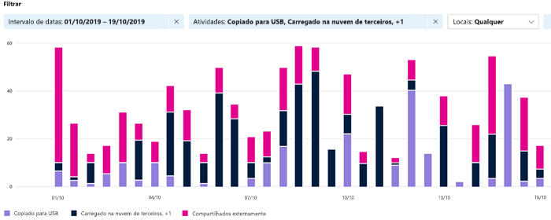

# Começar a usar o gerenciador de atividades

As guias visão geral de classificação de dados e explorador de conteúdo dão visibilidade ao conteúdo que foi descoberto e rotulado e mostra onde está esse conteúdo. O explorador de atividade arremata esse pacote de funcionalidade permitindo monitorar o que está sendo feito com o conteúdo rotulado. O explorador de atividades fornece um modo de exibição histórica.

Há mais de 30 filtros diferentes disponíveis para uso, alguns são:

- intervalo de datas
- tipo de atividade
- localização
- usuário
- rótulo de confidencialidade
- rótulo de retenção
- caminho do arquivo
- Política de DLP

## Pré-requisitos

Toda conta que acessa e usa a classificação de dados deve ter uma licença atribuída a partir de uma destas assinaturas:

- Microsoft 365 (E5)
- Office 365 (E5)
- Complemento de Conformidade Avançada (E5)
- Complemento Avançado de Inteligência contra Ameaças (E5)

### Permissões

 Para obter acesso à guia do explorador de atividades, é necessário atribuir uma conta à participação em qualquer uma dessas funções ou grupos de funções.

**Grupos de funções do Microsoft 365**

- Administrador global
- Administrador de conformidade
- Administrador de segurança
- Administrador de dados de conformidade

## Tipo de atividade

O Microsoft 365 monitora e relata os tipos de atividades em todo o SharePoint Online e OneDrive como:

- rótulo foi aplicado
- rótulo alterado (atualizado, regredido ou removido)
- simulação de rotulação automática

O vantagem de ficar sabendo que ações estão sendo tomadas com o conteúdo rotulado como confidencial é que você pode verificar se os controles que você já colocou em ação, tais como as [políticas de prevenção de perda de dados](data-loss-prevention-policies.md) estão sendo eficazes ou não. Se elas não estiverem funcionando, ou se você descobrir algo inesperado, como um grande número de itens que foram rotulados `highly confidential` e regredidos `general`, você pode gerenciar suas diversas políticas e executar novas ações para restringir o comportamento indesejado.

> [!NOTE]
> O explorador de atividades não monitora atualmente as atividades de retenção do Exchange Online.

## Confira também
- [Saiba mais sobre rótulos de confidencialidade](sensitivity-labels.md)
- [Saiba mais sobre as políticas de retenção e os rótulos de retenção](retention.md)
- [Definições da entidade do tipo de informações confidenciais](sensitive-information-type-entity-definitions.md)

