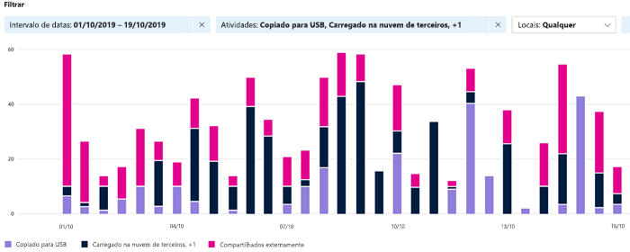
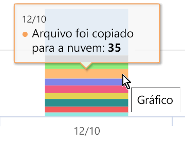
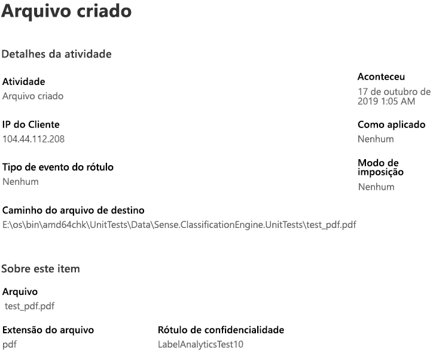

# Exibir atividade do seu conteúdo rotulado (visualização)View activity on your labeled content (preview)

As guias visão geral de classificação de dados e explorador de conteúdo dão visibilidade ao conteúdo que foi descoberto e rotulado e mostra onde está esse conteúdo.The data classification overview and content explorer tabs give you visibility into what content has been discovered and labeled, and where that content is. O explorador de atividade arremata esse pacote de funcionalidade permitindo monitorar o que está sendo feito com o conteúdo rotulado.Activity explorer rounds out this suite of functionality by allowing you to monitor what's being done with your labeled content. O explorador de atividades fornece um modo de exibição histórica.Activity explorer provides a historical view.

Você pode filtrar os dados de acordo com:You can filter the data by:

- intervalo de datasDate range
- tipo de atividadeActivity type
- localizaçãolocation
- usuáriouser
- rótulo de confidencialidadeFor sensitivity label usage:
- rótulo de retençãoRetention Label

Você pode exibir os dados como uma lista ou como um gráfico de barras.You can view the data either as a list or a bar graph.

## Tipo de atividadeActivity type

O Microsoft 365 monitora e relata 12 tipos de atividades em todo o SharePoint Online, OneDrive e pontos de extremidade.Microsoft 365 monitors and reports on 12 types of activities across SharePoint Online, OneDrive and endpoints. Os pontos de extremidade são dispositivos de usuário que executam o Windows 10.Endpoints are user devices running Windows 10.

- Arquivo foi criadoFile created
- Arquivo foi modificadoFile modified
- Arquivo foi renomeadoFile renamed
- Arquivo foi copiado para a nuvemFile copied to cloud
- Arquivo foi acessado por aplicativo que não tem permissão de acessoFile accessed by unallowed app
- Arquivo foi impressoFile printed
- Arquivo foi copiado para mídia removívelFile copied to removable media
- Arquivo copiado ser compartilhado na redeFile copied to network share
- Arquivo foi lidoFile read
- Arquivo foi copiado para a área de transferênciafile copied to clipboard
- Rótulo foi aplicadoLabel protection is applied
- Rótulo foi alterado (atualizado, regredido ou removido)Label changed (upgraded, downgraded, or removed)

O vantagem de ficar sabendo que ações estão sendo tomadas com o conteúdo rotulado como confidencial é que você pode verificar se os controles que você já colocou em ação, tais como as [políticas de prevenção de perda de dados](data-loss-prevention-policies.md) estão sendo eficazes ou não.The value of understanding what actions are being taken with your sensitive labeled content is that you can see if the controls that you have already put into place, such as [data loss prevention policies](data-loss-prevention-policies.md) are effective or not. Se elas não estiverem funcionando, ou se você descobrir algo inesperado, como um grande número de itens que foram rotulados `highly confidential` e regredidos `general`, você pode gerenciar suas diversas políticas e executar novas ações para restringir o comportamento indesejado.If not, or if you discover something unexpected, such as a large number of items that are labeled `highly confidential` and are downgraded `general`, you can manage your various policies and take new actions to restrict the undesired behavior.

Depois de definir os filtros, você poderá:Once your filters are set, you can:

- Passe o mouse sobre um segmento do gráfico de barras para ver o número de itens que se encontram nessa categoria hover over a segment of the bar chart to see the number of items that fall into that category 
- exportar os dadosThe variable to export  the data to.
- selecione um determinado item na lista e exiba os detalhes da ação no submenuselect any given item from the list and view the details of the action in the fly-out

## Confira tambémSee also
- [Rótulos de confidencialidadeSensitivity labels](sensitivity-labels.md)
- [Rótulos de retençãoRetention labels](labels.md)
- [O que os tipos de informação confidencial procuramWhat the sensitive information types look for](what-the-sensitive-information-types-look-for.md)
- [Visão geral de políticas de retençãoOverview of retention policies](retention-policies.md)