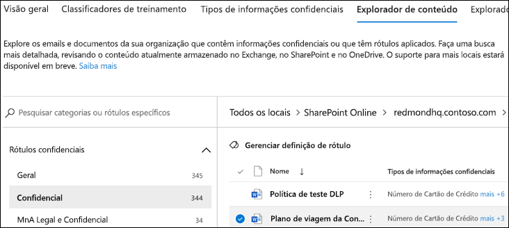

# Usando o explorador de conteúdo de classificação de dados (visualização)

O explorador de conteúdo de classificação de dados permite que os itens que foram resumidos na página visão geral sejam exibidos nativamente.

## Explorador de conteúdo

O Explorador de conteúdo mostra uma imagem instantânea atual dos itens que têm um rótulo de confidencialidade, um rótulo de retenção ou foram classificados como um tipo de informação confidencial em sua organização.

### Tipos de informações confidenciais

Uma **política DLP** ajuda a proteger informações confidenciais, que são definidas como um [tipo de informações confidenciais](data-loss-prevention-policies.md). O Microsoft 365 inclui [definições para vários tipos de informações confidenciais comuns](what-the-sensitive-information-types-look-for.md) em diferentes regiões, prontas para você usar. Por exemplo, um número de cartão de crédito, números de contas bancárias, números de ID nacionais e números de serviço Windows Live ID.

### Rótulos de confidencialidade

Um [rótulo de confidencialidade](sensitivity-labels.md) é simplesmente uma marca que indica o valor do item para a sua organização. Ele pode ser aplicado manualmente ou automaticamente. Uma vez aplicado, ele é incorporado ao documento e o acompanhará em todos os lugares. Um rótulo de confidencialidade habilita vários comportamentos de proteção, como uma marca d' água obrigatória ou a criptografia. Com a proteção de ponto de extremidade habilitada, você pode até mesmo impedir que um item saia de seu controle organizacional.

Os rótulos de confidencialidade devem ser habilitados para arquivos que estão no SharePoint e no OneDrive para que os dados correspondentes apareçam na página de classificação de dados. Para saber mais, confira [Habilitar rótulos de confidencialidade para arquivos do Office no SharePoint e no OneDrive (visualização pública)](sensitivity-labels-sharepoint-onedrive-files.md)

### Rótulos de retenção

Um [rótulo de retenção](labels.md) permite definir por quanto tempo um item rotulado será mantido e as etapas a serem seguidas antes de excluí-lo. Ele pode ser aplicado manualmente ou automaticamente através de políticas. Eles podem ajudar a sua organização a se manter em conformidade com as determinações regulamentares e legais.

### Permissões

Há duas funções que concedem acesso ao Explorador de conteúdo:

- **Visualizador de Listas do Explorador de Conteúdo**: a associação neste grupo de função permite que você veja cada item e seu local. A função `data classification list viewer` foi predefinida para esse grupo de função.

- **Visualizador de Conteúdos do Explorador de Conteúdo**: a associação neste grupo de função permite exibir o conteúdo de cada item na lista. A função `data classification content viewer` foi predefinida para esse grupo de função.

A conta que você usa para acessar o Explorador de conteúdo deve estar em uma ou em ambas os grupos de funções. Esses são grupos de funções independentes e não são cumulativos. Por exemplo, se você deseja conceder a uma conta a capacidade de exibir apenas os itens e seus locais, conceda direitos ao visualizador de Listas do Explorador de Conteúdo. Se você deseja que a mesma conta também possa exibir o conteúdo dos itens da lista, conceda também direitos ao visualizador de Conteúdos do Explorador de Conteúdo.

Você também pode atribuir uma ou ambas as funções a um grupo de funções personalizada para ajustar o acesso ao Gerenciador de conteúdo.

### Como usar o explorador de conteúdo

1. Abra o **centro de conformidade do Microsoft 365**  > **Classificação de dados** > ** Explorador de conteúdo**.
2. Se souber o nome do rótulo ou o tipo de informação confidencial, digite-o na caixa Pesquisar.
3. Como alternativa, você pode procurar o item expandindo o tipo de rótulo e selecionando o rótulo da lista; um dos itens da parte de rótulo de retenção da lista é mostrado abaixo.
4. Selecione um local em **Todas as localizações** e faça uma busca detalhada na estrutura de pastas para o item.
5. Clique duas vezes para abrir o item nativamente no explorador de conteúdo.

## Confira também

- [Rótulos de confidencialidade](sensitivity-labels.md)
- [Rótulos de retenção](labels.md)
- [O que os tipos de informação confidencial procuram](what-the-sensitive-information-types-look-for.md)
- [Visão geral de políticas de retenção](retention-policies.md)
- [Visão geral da prevenção contra perda de dados](data-loss-prevention-policies.md)
