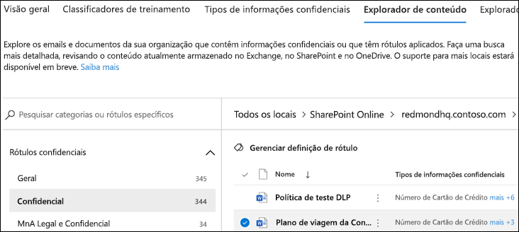

# Usando o explorador de conteúdo de classificação de dados (visualização)Using data classification content explorer (preview)

O explorador de conteúdo de classificação de dados permite que os itens que foram resumidos na página visão geral sejam exibidos nativamente.The data classification content explorer allows you to natively view the items that were summarized on the overview page.

## Explorador de conteúdoContent explorer

O Explorador de conteúdo mostra uma imagem instantânea atual dos itens que têm um rótulo de confidencialidade, um rótulo de retenção ou foram classificados como um tipo de informação confidencial em sua organização.Content explorer shows a current snapshot of the items that have a sensitivity label, a retention label or have been classified as a sensitive information type in your organization.

### Tipos de informações confidenciaisSensitive information types

Uma **política DLP** ajuda a proteger informações confidenciais, que são definidas como um [tipo de informações confidenciais](data-loss-prevention-policies.md).A [DLP policy](data-loss-prevention-policies.md) can help protect sensitive information, which is defined as a **sensitive information type**. O Microsoft 365 inclui [definições para vários tipos de informações confidenciais comuns](what-the-sensitive-information-types-look-for.md) em diferentes regiões, prontas para você usar.Microsoft 365 includes [definitions for many common sensitive information types](what-the-sensitive-information-types-look-for.md) across many different regions that are ready for you to use. Por exemplo, um número de cartão de crédito, números de contas bancárias, números de ID nacionais e números de serviço Windows Live ID.For example, a credit card number, bank account numbers, national ID numbers, and Windows Live ID service numbers.

### Rótulos de confidencialidadeSensitivity labels

Um [rótulo de confidencialidade](sensitivity-labels.md) é simplesmente uma marca que indica o valor do item para a sua organização.A [sensitivity label](sensitivity-labels.md) is simply a tag that indicates the value of the item to your organization. Ele pode ser aplicado manualmente ou automaticamente.It can be applied manually, or automatically. Uma vez aplicado, ele é incorporado ao documento e o acompanhará em todos os lugares.Once applied it gets embedded in the document and will follow it everywhere it goes. Um rótulo de confidencialidade habilita vários comportamentos de proteção, como uma marca d' água obrigatória ou a criptografia.A sensitivity label enables various protective behaviors, such as mandatory watermarking or encryption. Com a proteção de ponto de extremidade habilitada, você pode até mesmo impedir que um item saia de seu controle organizacional.With end point protection enabled you can even prevent an item from leaving your organizational control.

Os rótulos de confidencialidade devem ser habilitados para arquivos que estão no SharePoint e no OneDrive para que os dados correspondentes apareçam na página de classificação de dados.Sensitivity labels must be enabled for files that are in SharePoint and OneDrive in order for the corresponding data to surface in the data classification page. Para saber mais, confira [Habilitar rótulos de confidencialidade para arquivos do Office no SharePoint e no OneDrive (visualização pública)](sensitivity-labels-sharepoint-onedrive-files.md)For more information, see [Enable sensitivity labels for Office files in SharePoint and OneDrive (public preview)](sensitivity-labels-sharepoint-onedrive-files.md).

### Rótulos de retençãoRetention labels

Um [rótulo de retenção](labels.md) permite definir por quanto tempo um item rotulado será mantido e as etapas a serem seguidas antes de excluí-lo.A [retention label](labels.md) allows you to define how long a labeled item is kept and the steps to be taken prior to deleting it. Ele pode ser aplicado manualmente ou automaticamente através de políticas.They are applied manually or automatically via policies. Eles podem ajudar a sua organização a se manter em conformidade com as determinações regulamentares e legais.They can play a role in helping your organization stay in compliance with legal and regulatory requirements.

### PermissõesPermissions

Há duas funções que concedem acesso ao Explorador de conteúdo:There are two roles that grant access to content explorer:

- **Visualizador de Listas do Explorador de Conteúdo**: a associação neste grupo de função permite que você veja cada item e seu local.**Content Explorer List viewer**: Membership in this role group allows you to see each item and its location.

- **Visualizador de Conteúdos do Explorador de Conteúdo**: a associação neste grupo de função permite exibir o conteúdo de cada item na lista.**Content Explorer Content viewer**: Membership in this role group allows you to view the contents of each item in the list.

A conta que você usa para acessar o Explorador de conteúdo deve estar em uma ou em ambas os grupos de funções.The account you use to access content explorer must be in one or both of the role groups. Esses são grupos de funções independentes e não são cumulativos.These are independent role groups and are not cumulative. Por exemplo, se você deseja conceder a uma conta a capacidade de exibir apenas os itens e seus locais, conceda direitos ao visualizador de Listas do Explorador de Conteúdo.For example, if you want to grant an account the ability to view the items and their locations only, grant Content Explorer List viewer rights. Se você deseja que a mesma conta também possa exibir o conteúdo dos itens da lista, conceda também direitos ao visualizador de Conteúdos do Explorador de Conteúdo.If you want that same account to also be able to view the contents of the items in the list, grant Content Explorer Content viewer rights as well.

### Como usar o explorador de conteúdoHow to use content explorer

1. Abra o **centro de conformidade do Microsoft 365**  > **Classificação de dados** > \*\* Explorador de conteúdo\*\*.Open **Microsoft 365 compliance center**  > **Data classification** > **Content explorer**.
2. Se souber o nome do rótulo ou o tipo de informação confidencial, digite-o na caixa Pesquisar.If you know the name of the label, or the sensitive information type, you can type that into the search box.
3. Como alternativa, você pode procurar o item expandindo o tipo de rótulo e selecionando o rótulo da lista; um dos itens da parte de rótulo de retenção da lista é mostrado abaixo.Alternately, you can browse for the item by expanding the label type and selecting the label from the list, an item from the retention label portion of the list is show below.
4. Selecione um local em **Todas as localizações** e faça uma busca detalhada na estrutura de pastas para o item.Select a location under **All locations** and drill down the folder structure to the item.
5. Clique duas vezes para abrir o item nativamente no explorador de conteúdo.Double-click to open the item natively in content explorer.

## Confira tambémSee also

- [Rótulos de confidencialidadeSensitivity labels](sensitivity-labels.md)
- [Rótulos de retençãoRetention labels](labels.md)
- [O que os tipos de informação confidencial procuramWhat the sensitive information types look for](what-the-sensitive-information-types-look-for.md)
- [Visão geral de políticas de retençãoOverview of retention policies](retention-policies.md)
- [Visão geral da prevenção contra perda de dadosOverview of data loss prevention](data-loss-prevention-policies.md)
