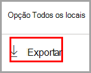
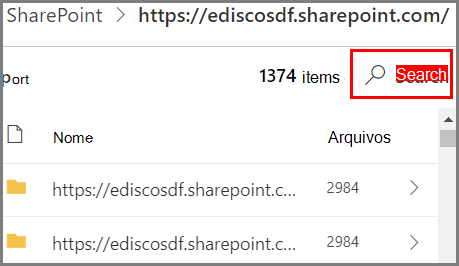

# Introdução ao gerenciador de conteúdo

O explorador de conteúdo de classificação de dados permite que os itens que foram resumidos na página visão geral sejam exibidos nativamente.

## Pré-requisitos

Toda conta que acessa e usa a classificação de dados deve ter uma licença atribuída a partir de uma destas assinaturas:

- Microsoft 365 (E5)
- Office 365 (E5)
- Complemento de Conformidade Avançada (E5)
- Complemento Avançado de Inteligência contra Ameaças (E5)

### Permissões

Para obter acesso à guia do Gerenciador de conteúdo, uma conta deve ter associação em qualquer uma dessas funções ou grupos de funções. 

Uma **política DLP** ajuda a proteger informações confidenciais, que são definidas como um [tipo de informações confidenciais](data-loss-prevention-policies.md). O Microsoft 365 inclui [definições para vários tipos de informações confidenciais comuns](sensitive-information-type-entity-definitions.md) em diferentes regiões, prontas para você usar. Por exemplo, um número de cartão de crédito, números de contas bancárias, números de ID nacionais e números de serviço Windows Live ID.

**Grupos de funções do Microsoft 365**

- Administrador global
- Administrador de conformidade
- Administrador de segurança
- Administrador de dados de conformidade

> [!IMPORTANT]
> A associação nesses grupos de função não permite que você veja a lista de itens ou exiba o conteúdo dos itens no Gerenciador de conteúdo.

### Permissões necessárias para acessar itens no Gerenciador de conteúdo

O acesso ao Gerenciador de conteúdo é altamente restrito porque permite ler o conteúdo dos arquivos digitalizados.

> [!IMPORTANT]
> Essas permissões substituem as permissões que são atribuídas localmente aos itens, permitindo a visualização do conteúdo. 

Há duas funções que concedem acesso ao Explorador de conteúdo:

- **Visualizador de Listas do Explorador de Conteúdo**: a associação neste grupo de função permite que você veja cada item e seu local na exibição da lista. A função `data classification list viewer` foi predefinida para esse grupo de função.

- **Visualizador de Conteúdos do Explorador de Conteúdo**: a associação neste grupo de função permite exibir o conteúdo de cada item na lista. A função `data classification content viewer` foi predefinida para esse grupo de função.

A conta que você usa para acessar o Explorador de conteúdo deve estar em uma ou em ambas os grupos de funções. Esses são grupos de funções independentes e não são cumulativos. Por exemplo, se você deseja conceder a uma conta a capacidade de exibir apenas os itens e seus locais, conceda direitos ao visualizador de Listas do Explorador de Conteúdo. Se você deseja que a mesma conta também possa exibir o conteúdo dos itens da lista, conceda também direitos ao visualizador de Conteúdos do Explorador de Conteúdo.

Você também pode atribuir uma ou ambas as funções a um grupo de funções personalizada para ajustar o acesso ao Gerenciador de conteúdo.

Um administrador global, um administrador de conformidade ou um administrador de dados pode atribuir o Visualizador de lista do Gerenciador de conteúdo  necessário e Visualizador de conteúdo do Gerenciador de conteúdo a associação do grupo de função.

## Explorador de conteúdo

O Explorador de conteúdo mostra uma imagem instantânea atual dos itens que têm um rótulo de confidencialidade, um rótulo de retenção ou foram classificados como um tipo de informação confidencial em sua organização.

### Tipos de informações confidenciais

Uma **política DLP** ajuda a proteger informações confidenciais, que são definidas como um [tipo de informações confidenciais](data-loss-prevention-policies.md). O Microsoft 365 inclui [definições para vários tipos de informações confidenciais comuns](sensitive-information-type-entity-definitions.md) de diferentes regiões, prontas para você usar. Por exemplo, um número de cartão de crédito, números de contas bancárias, números de identificação nacional e números de serviço do Windows Live ID.

> [!NOTE]
> O Gerenciador de conteúdo atualmente não examina os tipos de informações confidenciais no Exchange Online.

### Rótulos de confidencialidade

Um [rótulo de confidencialidade](sensitivity-labels.md) é simplesmente uma marca que indica o valor do item para a sua organização. Ele pode ser aplicado manualmente ou automaticamente. Uma vez aplicado, ele é incorporado ao documento e o acompanhará em todos os lugares. Um rótulo de confidencialidade habilita vários comportamentos de proteção, como uma marca d' água obrigatória ou a criptografia.

Os rótulos de confidencialidade devem ser habilitados para arquivos que estão no SharePoint e no OneDrive para que os dados correspondentes apareçam na página de classificação de dados. Para obter mais informações, confira [Habilitar rótulos de confidencialidade para arquivos do Office no Microsoft Office SharePoint Online e OneDrive](sensitivity-labels-sharepoint-onedrive-files.md).

### Rótulos de retenção

Um [rótulo de retenção](labels.md) permite definir por quanto tempo um item rotulado será mantido e as etapas a serem seguidas antes de excluí-lo. Ele pode ser aplicado manualmente ou automaticamente através de políticas. Eles podem ajudar a sua organização a se manter em conformidade com as determinações regulamentares e legais.

### Como usar o explorador de conteúdo

1. Abra o **centro de conformidade do Microsoft 365**  > **Classificação de dados** > ** Explorador de conteúdo**.
2. Se souber o nome do rótulo ou o tipo de informação confidencial, digite-o na caixa de filtro.
3. Como alternativa, você pode procurar o item expandindo o tipo de rótulo e selecionando o rótulo da lista.
4. Selecione um local em **Todas as localizações** e faça uma busca detalhada na estrutura de pastas para o item.
5. Clique duas vezes para abrir o item nativamente no explorador de conteúdo.

### Exportar
O controle **exportar** criará um arquivo .csv que contém uma lista do que está sendo exibido no painel **Todos os locais**.

### Pesquisar

Quando você faz uma busca detalhada em um local, como uma pasta do Exchange ou um site do SharePoint ou do OneDrive, a ferramenta **Pesquisar** é exibida.

O escopo da ferramenta de pesquisa é o que é exibido no painel **Todos os locais** e o que você pode pesquisar varia dependendo do local selecionado. 

Quando **Exchange** é o local selecionado, você pode pesquisar o endereço de email completo da caixa de correio, por exemplo `user@domainname.com`.

Quando **SharePoint** ou **OneDrive** são selecionados, a ferramenta de pesquisa será exibida ao fazer a busca detalhada para nomes de site, pastas e arquivos. 

> [!NOTE]
> **OneDrive** Ouvimos seus comentários sobre a integração do OneDrive durante nosso programa de versão prévia. Com base nesses comentários, a funcionalidade do OneDrive permanecerá em versão prévia até que todas as correções estejam instaladas. Dependendo do locatário, alguns clientes podem não ver o OneDrive como um local. Agradecemos o seu apoio contínuo neste tema.

Você pode pesquisar em:

|valor|exemplo  |
|---------|---------|
|nome completo do site    |`https://contoso.onmicrosoft.com/sites/sitename`    |
|nome da pasta raiz: obtém todas as subpastas    | `/sites`        |
|nome do arquivo    |    `RES_Resume_1234.txt`     |
|texto no início do nome do arquivo| `RES`|
|texto após um caractere de sublinhado (_) no nome do arquivo|`Resume` ou `1234`| 
|extensão do arquivo|`txt`|

## Confira também

- [Rótulos de confidencialidade](sensitivity-labels.md)
- [Rótulos de retenção](labels.md)
- [Tipo de entidade de informações confidenciais definitions.md](sensitive-information-type-entity-definitions.md)
- [Visão geral de políticas de retenção](retention-policies.md)
- [Visão geral da prevenção contra perda de dados](data-loss-prevention-policies.md)
