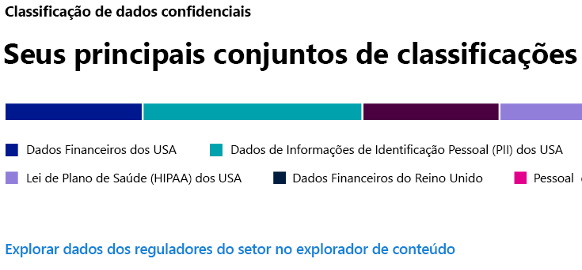
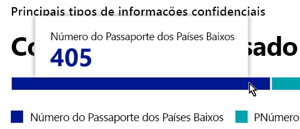
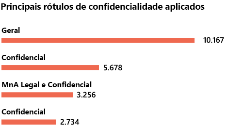

# Conheça seus dados - visão geral da classificação de dados

Como administrador de conformidade ou administrador do Microsoft 365, você pode avaliar e marcar o conteúdo da sua organização para controlar o seu destino, protegê-lo independentemente de onde ele estiver e garantir que ele seja preservado e excluído de acordo com as necessidades da sua organização. Isso é feito através da aplicação de [rótulos de confidencialidade](sensitivity-labels.md), [rótoulos de retenção](retention.md#retention-labels) classificação de tipos de informações confidenciais. Há várias maneiras de fazer a descoberta, a avaliação e a marcação, mas o resultado final é que você pode acabar tendo um número muito grande de documentos e emails marcados e classificados com um ou ambos os rótulos. Depois de criar seus rótulos de retenção e rótulos de confidencialidade, você vai querer saber como eles estão sendo usados em seu locatário e o que está sendo feito com esses itens. A página classificação de dados dá visibilidade ao corpo do conteúdo, especificamente:

- o número de itens que foram classificados como um tipo de informação confidencial e quais são essas classificações
- os principais rótulos de confidencialidade aplicados tanto no Microsoft 365 quanto na Proteção de Informações do Azure
- os principais rótulos de retenção aplicados
- um resumo das atividades que os usuários estão executando no conteúdo confidencial
- os locais onde estão os seus dados confidenciais e retidos

Você também gerencia esses recursos na página de classificação de dados:
- [classificadores treináveis](classifier-learn-about.md)
- [tipos de informações confidenciais](what-the-sensitive-information-types-look-for.md)

Você pode encontrar a classificação de dados no **Centro de conformidade do Microsoft 365** ou no **Centro de segurança do Microsoft 365** > **Classificação**  >  **Classificação de Dados**.

Faça um tour em vídeo de nossos recursos de classificação de dados.

> [!VIDEO https://www.microsoft.com/videoplayer/embed/RE4vx8x]

A classificação de dados verificará seu conteúdo confidencial e conteúdo rotulado antes de criar quaisquer políticas. Isso se chama **gerenciamento de alterações zero**. Isso permite que você veja o impacto de que todos os rótulos de retenção e sensibilidade estão tendo no ambiente e capacitam você a começar a avaliar a proteção e as necessidades de políticas de governança.

## Pré-requisitos

Várias assinaturas diferentes oferecem suporte ao Ponto de extremidade da DLP. Para ver as opções de licenciamento para o Ponto de extremidade da DLP, confira [Licenciamento de Proteção de Informações para orientação](https://docs.microsoft.com/office365/servicedescriptions/microsoft-365-service-descriptions/microsoft-365-tenantlevel-services-licensing-guidance/microsoft-365-security-compliance-licensing-guidance#information-protection). 

### Permissões

 Para obter acesso à página de classificação de dados, é necessário atribuir uma associação a uma conta para uma dessas funções ou grupos de funções.

**Grupos de funções do Microsoft 365**

- Administrador global
- Administrador de conformidade
- Administrador de segurança
- Administrador de dados de conformidade

## Tipos de informações confidenciais mais usados no seu conteúdo

O Microsoft 365 vem com várias definições de tipos de informações confidenciais, tal como um item contendo um número de seguridade social ou um número de cartão de crédito. Para obter mais informações sobre os tipos de informações confidenciais, confira [Definições da entidade de tipo de informações confidenciais](sensitive-information-type-entity-definitions.md).

O cartão do tipo de informações confidenciais mostra os principais tipos de informações confidenciais que foram encontrados e rotulados em toda a organização.

Para saber quantos itens estão em uma determinada categoria de classificação, passe o mouse sobre a barra para determinar a categoria.

> [!NOTE]
> Se o cartão exibir a mensagem «não foram encontrados dados com informações confidenciais». Isso significa que não há nenhum item em sua organização que tenha sido classificado como sendo um tipo de informação confidencial ou nenhum item que tenha sido rastreado. Para começar a usar os rótulos, confira:
>- [Introdução ao rótulos de confidencialidade](get-started-with-sensitivity-labels.md)
>- [Introdução às políticas de retenção e rótulos de retenção](get-started-with-retention.md)
>- [Definições da entidade do tipo de informações confidenciais](sensitive-information-type-entity-definitions.md)

## Principais rótulos de confidencialidade aplicados ao conteúdo

Quando você aplica um rótulo de confidencialidade a um item ou através do Microsoft 365 ou da proteção de informações do Azure (AIP), ocorrem duas coisas:

- uma marca que indica o valor do item para a sua organização, inserida no documento, e o acompanhará onde quer que esse item vá
- a presença da marca ativa vários comportamentos de proteção, como uma marca d' água obrigatória ou a criptografia. Com a proteção de ponto de extremidade habilitada, você pode até mesmo impedir que um item saia de seu controle organizacional.

Para obter mais informações sobre rótulos de confidencialidade, confira: [Saiba mais sobre rótulos de confidencialidade](sensitivity-labels.md)

Os rótulos de confidencialidade devem ser habilitados para arquivos que estão no SharePoint e no OneDrive para que os dados correspondentes apareçam na página de classificação de dados. Para obter mais informações, confira [Habilitar rótulos de confidencialidade para arquivos do Office no Microsoft Office SharePoint Online e OneDrive](sensitivity-labels-sharepoint-onedrive-files.md).

O cartão de identificação de confidencialidade mostra o número de itens (email ou documento) por nível de confidencialidade.

> [!NOTE]
> Se você ainda não criou ou publicou qualquer rótulo de confidencialidade ou se nenhum conteúdo tiver um rótulo de confidencialidade aplicado, esse cartão exibirá a mensagem "nenhum rótulo de confidencialidade detectado". Para começar a usar os rótulos de confidencialidade, confira:
>- [Introdução aos rótulos de confidencialidade](get-started-with-sensitivity-labels.md) ou para AIP [Configurar a política de proteção de informações do Azure](https://docs.microsoft.com/azure/information-protection/configure-policy)

## Principais rótulos de retenção aplicados ao conteúdo

Os rótulos de retenção são usados para manejar a retenção e disposição do conteúdo de sua organização. Quando aplicados, eles podem ser usados para controlar como um documento será mantido antes da exclusão, se ele deve ser revisado antes da exclusão, quando o período de retenção expira e se ele deve ser marcado como um registro. Para obter mais informações, consulte [saiba mais sobre políticas e rótulos de retenção](retention.md).

O cartão dos principais rótulos de retenção aplicados mostra quantos itens têm um determinado rótulo de retenção.

> [!NOTE]
> Se este cartão exibir a mensagem "Nenhum rótulo de retenção detectado", isso significa que você não criou ou publicou qualquer rótulo de retenção ou que nenhum conteúdo teve qualquer rótulo de retenção aplicado.   Para começar a usar os rótulos de retenção, confira:
>- [Introdução às políticas de retenção e rótulos de retenção](get-started-with-retention.md)

## Atividades detectadas mais comuns

Este cartão fornece um resumo rápido das ações mais comuns que os usuários realizam com os itens rotulados como confidenciais. Você pode usar o [Explorador de atividades](data-classification-activity-explorer.md) para detalhar as oito diferentes atividades que o Microsoft 365 acompanha no conteúdo rotulado e o conteúdo localizado em pontos de extremidade do Windows 10.

> [!NOTE]
> Se esse cartão exibir a mensagem "Nenhuma atividade detectada", isso significa que não há nenhuma atividade nos arquivos ou que a auditoria de usuário e administradores não foi ativada. Para ativar os logs de auditoria, confira:
>- [Pesquisar o log de auditoria no centro de conformidade e Segurança](search-the-audit-log-in-security-and-compliance.md) 

## Dados com rótulos de confidencialidade e retenção por local

O objetivo do relatório de classificação de dados é fornecer visibilidade sobre o número de itens que têm o rótulo, bem como a sua localização. Esses cartões permitem saber quantos itens rotulados estão no Exchange, no SharePoint, OneDrive, etc.

> [!NOTE]
> Se este cartão exibir a mensagem "Nenhum local detectado", isso significa que você não criou ou publicou qualquer rótulo de confidencialidade ou que nenhum conteúdo teve qualquer rótulo de retenção aplicado.   Para começar a usar os rótulos de confidencialidade, confira:
>- [Rótulos de confidencialidade ](sensitivity-labels.md)

## Confira também

- [Exibir atividade do rótulo](data-classification-activity-explorer.md)
- [Exibir conteúdo rotulado](data-classification-content-explorer.md)
- [Saiba mais sobre rótulos de confidencialidade](sensitivity-labels.md)
- [Saiba mais sobre as políticas de retenção e os rótulos de retenção](retention.md)
- [Definições da entidade do tipo de informações confidenciais](sensitive-information-type-entity-definitions.md)
- [Saiba mais sobre classificadores treináveis (visualização)](classifier-learn-about.md)