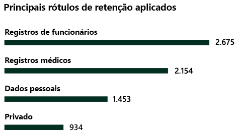

# Conheça seus dados - visão geral da classificação de dadosKnow your data - data classification overview

Como administrador de conformidade ou administrador do Microsoft 365, você pode avaliar e marcar o conteúdo da sua organização para controlar o seu destino, protegê-lo independentemente de onde ele estiver e garantir que ele seja preservado e excluído de acordo com as necessidades da sua organização.As a Microsoft 365 administrator or compliance administrator, you can evaluate and then tag content in your organization in order to control where it goes, protect it no matter where it is and to ensure that it is preserved and deleted according your your organizations needs. Isso é feito através da aplicação de [rótulos de confidencialidade](sensitivity-labels.md), [rótoulos de retenção](labels.md) classificação de tipos de informações confidenciais.You do this through the application of [sensitivity labels](sensitivity-labels.md), [retention labels](labels.md), and sensitive information type classification. Há várias maneiras de fazer a descoberta, a avaliação e a marcação, mas o resultado final é que você pode acabar tendo um número muito grande de documentos e emails marcados e classificados com um ou ambos os rótulos.There are various ways to do the discovery, evaluation and tagging, but the end result is that you may have very large number of documents and emails that are tagged and classified with one or both of these labels. Depois de criar seus rótulos de retenção e rótulos de confidencialidade, você vai querer saber como eles estão sendo usados em seu locatário e o que está sendo feito com esses itens.After you apply your retention labels and sensitivity labels, you'll want to see how the labels are being used across your tenant and what is being done with those items. A página classificação de dados dá visibilidade ao corpo do conteúdo, especificamente:The data classification page provides visibility into that body of content, specifically:

- o número de itens que foram classificados como um tipo de informação confidencial e quais são essas classificaçõesthe number items that have been classified as a sensitive information type and what those classifications are
- os principais rótulos de confidencialidade aplicados tanto no Microsoft 365 quanto na Proteção de Informações do Azurethe top applied sensitivity labels in both Microsoft 365 and Azure Information Protection
- os principais rótulos de retenção aplicadosthe top applied retention labels
- um resumo das atividades que os usuários estão executando no conteúdo confidenciala summary of activities that users are taking on your sensitive content
- os locais onde estão os seus dados confidenciais e retidosthe locations of your sensitive and retained data

Você também gerencia esses recursos na página de classificação de dados:You also manage these features on the data classification page:
- [classificadores treináveistrainable classifiers](classifier-getting-started-with.md)
- [tipos de informações confidenciaissensitive information types](what-the-sensitive-information-types-look-for.md)

Você pode encontrar a classificação de dados no **Centro de conformidade do Microsoft 365** ou no **Centro de segurança do Microsoft 365** > **Classificação**  >  \*\* Classificação de Dados\*\*.You can find data classification in the **Microsoft 365 compliance center** or **Microsoft 365 security center** > **Classification** > **Data Classification**.

Faça um tour em vídeo de nossos recursos de classificação de dados.Take a video tour of our data classification features.

> [!VIDEO https://www.microsoft.com/videoplayer/embed/RE4vx8x]

A classificação de dados verificará seu conteúdo confidencial e conteúdo rotulado antes de criar quaisquer políticas.Data classification will scan your sensitive content and labeled content before you create any policies. Isso se chama **gerenciamento de alterações zero**.This is called **zero change management**. Isso permite que você veja o impacto de que todos os rótulos de retenção e sensibilidade estão tendo no ambiente e capacitam você a começar a avaliar a proteção e as necessidades de políticas de governança.This lets you see the impact that all the retention and sensitivity labels are having in your environment and empower you to start assessing your protection and governance policy needs.

## Pré-requisitosPrerequisites

Toda conta que acessa e usa a classificação de dados deve ter uma licença atribuída a partir de uma destas assinaturas:Every account that accesses and uses data classification must have a license assigned to it from one of these subscriptions:

- Microsoft 365 (E5)Microsoft 365 (E5)
- Office 365 (E5)Office 365 (E5)
- Complemento de Conformidade Avançada (E5)Advanced Compliance (E5) add-on
- Complemento Avançado de Inteligência contra Ameaças (E5)Advanced Threat Intelligence (E5) add-on

### PermissõesPermissions

 Para obter acesso à página de classificação de dados, é necessário atribuir uma associação a uma conta para uma dessas funções ou grupos de funções.In order to get access to the data classification page, an account must be assigned membership in any one of these roles or role groups.

**Grupos de funções do Microsoft 365****Microsoft 365 role groups**

- Administrador globalGlobal administrator
- Administrador de conformidadeCompliance administrator
- Administrador de segurançaSecurity administrator
- Administrador de dados de conformidadeCompliance data administrator

## Tipos de informações confidenciais mais usados no seu conteúdoSensitive information types used most in your content

O Microsoft 365 vem com várias definições de tipos de informações confidenciais, tal como um item contendo um número de seguridade social ou um número de cartão de crédito.Microsoft 365 comes with many definitions of sensitive information types, such as an item containing a social security number or a credit card number. Para obter mais informações sobre os tipos de informações confidenciais, confira [Definições da entidade de tipo de informações confidenciais](sensitive-information-type-entity-definitions.md).For more information on sensitive information types, see [Sensitive information type entity definitions](sensitive-information-type-entity-definitions.md).

O cartão do tipo de informações confidenciais mostra os principais tipos de informações confidenciais que foram encontrados e rotulados em toda a organização.The sensitive information type card shows the top sensitive information types that have been found and labeled across your organization.

Para saber quantos itens estão em uma determinada categoria de classificação, passe o mouse sobre a barra para determinar a categoria.To find out how many items are in any given classification category, hover over the bar for the category.

> [!NOTE]
> Se o cartão exibir a mensagem «não foram encontrados dados com informações confidenciais».If the card displays the message "No data found with sensitive information". Isso significa que não há nenhum item em sua organização que tenha sido classificado como sendo um tipo de informação confidencial ou nenhum item que tenha sido rastreado.It means that there are no items in your organization that have been classified as being a sensitive information type or no items that have been crawled. Para começar a usar os rótulos, confira:To get started with labels, see:
>- [Rótulos de confidencialidade Sensitivity labels](sensitivity-labels.md)
>- [Rótulos de retençãoRetention labels](labels.md)
>- [Definições da entidade por tipo de informações confidenciaisSensitive information type entity definitions](sensitive-information-type-entity-definitions.md)

## Principais rótulos de confidencialidade aplicados ao conteúdoTop sensitivity labels applied to content

Quando você aplica um rótulo de confidencialidade a um item ou através do Microsoft 365 ou da proteção de informações do Azure (AIP), ocorrem duas coisas:When you apply a sensitivity label to an item either through Microsoft 365 or Azure Information Protection (AIP), two things happen:

- uma marca que indica o valor do item para a sua organização, inserida no documento, e o acompanhará onde quer que esse item váa tag that indicates the value of the item to your org is embedded in the document and will follow it everywhere it goes
- a presença da marca ativa vários comportamentos de proteção, como uma marca d' água obrigatória ou a criptografia.the presence of the tag enables various protective behaviors, such as mandatory watermarking or encryption. Com a proteção de ponto de extremidade habilitada, você pode até mesmo impedir que um item saia de seu controle organizacional.With end point protection enabled you can even prevent an item from leaving your organizational control.

Para obter mais informações sobre rótulos de confidencialidade, confira: [Saiba mais sobre rótulos de confidencialidade](sensitivity-labels.md)For more information on sensitivity labels, see: [Learn about sensitivity labels](sensitivity-labels.md)

Os rótulos de confidencialidade devem ser habilitados para arquivos que estão no SharePoint e no OneDrive para que os dados correspondentes apareçam na página de classificação de dados.Sensitivity labels must be enabled for files that are in SharePoint and OneDrive in order for the corresponding data to surface in the data classification page. Para obter mais informações, confira [Habilitar rótulos de confidencialidade para arquivos do Office no Microsoft Office SharePoint Online e OneDrive](sensitivity-labels-sharepoint-onedrive-files.md).For more information, see [Enable sensitivity labels for Office files in SharePoint and OneDrive](sensitivity-labels-sharepoint-onedrive-files.md).

O cartão de identificação de confidencialidade mostra o número de itens (email ou documento) por nível de confidencialidade.The sensitivity label card shows the number of items (email or document) by sensitivity level.

> [!NOTE]
> Se você ainda não criou ou publicou qualquer rótulo de confidencialidade ou se nenhum conteúdo tiver um rótulo de confidencialidade aplicado, esse cartão exibirá a mensagem "nenhum rótulo de confidencialidade detectado".If you haven't created or published any sensitivity labels or no content has had a sensitivity label applied, this card will display the message "No sensitivity labels detected". Para começar a usar os rótulos, confira:To get started with labels, see:
>- [rótulos de confidencialidade](sensitivity-labels.md) ou para AIP [Configurar a política de proteção de informações do Azure](https://docs.microsoft.com/azure/information-protection/configure-policy) [sensitivity labels](sensitivity-labels.md) or for AIP [Configure the Azure information protection policy](https://docs.microsoft.com/azure/information-protection/configure-policy)

## Principais rótulos de retenção aplicados ao conteúdoTop retention labels applied to content

Os rótulos de retenção são usados para manejar a disposição do conteúdo de sua organização.Retention labels are used to manage the disposition of content in your organization. Quando aplicados, eles podem ser usados para controlar quanto tempo um documento será mantido antes da exclusão, se ele deve ser revisado antes da exclusão, quando o período de retenção expira ou se ele deve ser marcado como um registro que nunca pode ser excluído.When applied, they can be used to control how long a document will be kept before deletion, whether it should be reviewed prior to deletion, when it's retention period expires, or whether it should be marked as a record which can never be deleted. Para mais informações, confira a [Visão geral dos rótulos de retenção](labels.md).For more information see, [Overview of retention labels](labels.md).

O cartão dos principais rótulos de retenção aplicados mostra quantos itens têm um determinado rótulo de retenção.The top applied retention labels card shows you how many items have a given retention label.

> [!NOTE]
> Se este cartão exibir a mensagem "Nenhum rótulo de retenção detectado", isso significa que você não criou ou publicou qualquer rótulo de retenção ou que nenhum conteúdo teve qualquer rótulo de retenção aplicado.  If this card displays the message, "No retention labels detected, it means you haven't created or published any retention  labels or no content has had a retention label applied. Para começar a usar os rótulos de retenção, confira:To get started with retention labels, see:
>- [Visão geral de rótulos de retençãoOverview of retention labels](labels.md)

## Atividades detectadas mais comunsTop activities detected

Este cartão fornece um resumo rápido das ações mais comuns que os usuários realizam com os itens rotulados como confidenciais.This card provides a quick summary of the most common actions that users are taking on the sensitivity labeled items. Você pode usar o [Explorador de atividades](data-classification-activity-explorer.md) para detalhar as oito diferentes atividades que o Microsoft 365 acompanha no conteúdo rotulado e o conteúdo localizado em pontos de extremidade do Windows 10.You can use the [Activity explorer](data-classification-activity-explorer.md) to drill deep down on eight different activities that Microsoft 365 tracks on labeled content and content that is located on Windows 10 endpoints.

> [!NOTE]
> Se esse cartão exibir a mensagem "Nenhuma atividade detectada", isso significa que não há nenhuma atividade nos arquivos ou que a auditoria de usuário e administradores não foi ativada.If this card displays the message, "No activity detected" it means that there's been no activity on the files or that user and admin auditing isn't turned on. Para ativar os logs de auditoria, confira:To turn the audit logs on , see:
>- [Pesquisar o log de auditoria no centro de conformidade e Segurança](search-the-audit-log-in-security-and-compliance.md) [Search the audit log in security & compliance center](search-the-audit-log-in-security-and-compliance.md)

## Dados com rótulos de confidencialidade e retenção por localSensitivity and retention labeled data by location

O objetivo do relatório de classificação de dados é fornecer visibilidade sobre o número de itens que têm o rótulo, bem como a sua localização.The point of the data classification reporting is to provide visibility into the number of items that have which label as well as their location. Esses cartões permitem saber quantos itens rotulados estão no Exchange, no SharePoint, OneDrive, etc.These cards let you know how many labeled items the are in Exchange, SharePoint, and OneDrive etc.

> [!NOTE]
> Se este cartão exibir a mensagem "Nenhum local detectado", isso significa que você não criou ou publicou qualquer rótulo de confidencialidade ou que nenhum conteúdo teve qualquer rótulo de retenção aplicado.  If this card displays the message, "No locations detected, it means you haven't created or published any sensitivity labels or no content has had a retention label applied. Para começar a usar os rótulos de confidencialidade, confira:To get started with sensitivity labels, see:
>- [Rótulos de confidencialidade Sensitivity labels](sensitivity-labels.md)

## Confira tambémSee also

- [Exibir atividade do rótulo (visualização)View label activity (preview)](data-classification-activity-explorer.md)
- [Exibir conteúdo rotulado (visualização)View labeled content (preview)](data-classification-content-explorer.md)
- [Rótulos de confidencialidade Sensitivity labels](sensitivity-labels.md)
- [Rótulos de retençãoRetention labels](labels.md)
- [Definições da entidade por tipo de informações confidenciaisSensitive information type entity definitions](sensitive-information-type-entity-definitions.md)
- [Visão geral de políticas de retençãoOverview of retention policies](retention-policies.md)
- [Introdução aos classificadores treináveis (visualização)Getting started with trainable classifiers (preview)](classifier-getting-started-with.md)
