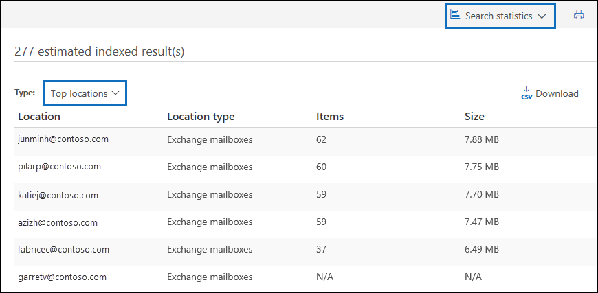

# Série de soluções de Descoberta eDiscovery: Cenário de derramamento de dados - Pesquisa e limpezaeDiscovery solution series: Data spillage scenario - Search and purge

 **O que é vazamento de dados e por que você deve se preocupar?****What is data spillage and why should you care?** O vazamento de dados é quando um documento confidencial é liberado em um ambiente não seguro.Data spillage is when a confidential document is released into an untrusted environment. Quando um incidente de derramamento de dados é detectado, é importante avaliar rapidamente o tamanho e os locais do derramamento, examinar as atividades do usuário em torno dele e, em seguida, limpar permanentemente os dados eliminados do sistema.When a data spillage incident is detected, it's important to quickly assess the size and locations of the spillage, examine user activities around it,  and then permanently purge the spilled data from the system. 
  
## Cenário de derramamento de dadosData spillage scenario

Você é um líder de segurança de informações da Contoso.You're a lead information security officer at Contoso. Você é informado de uma situação de vazamento de dados em que um funcionário compartilhou, sem saber, um documento altamente confidencial com várias pessoas por email.You are informed of a data spillage situation where an employee unknowingly shared a highly confidential document with multiple people through email. Você deseja avaliar rapidamente quem recebeu este documento interna e externamente.You want to quickly assess who received this document internally and externally. Uma vez identificado, você gostaria de compartilhar as descobertas de caso com outros investigadores para revisar e, em seguida, remover permanentemente os dados do Office 365.Once identified, you would like to share case findings with other investigators to review, and then permanently remove the data from Office 365. Após a conclusão da investigação, você deseja gerar um relatório com a evidência de remoção permanente e outros detalhes do caso para qualquer referência futura.After the investigation is complete, you want to generate a report with the evidence of permanent removal and other case details for any future reference.
  
### Escopo deste artigoScope of this article

Este documento fornece uma lista de instruções sobre como remover permanentemente uma mensagem do Microsoft 365 para que não seja acessível ou recuperável.This document provides a list of instructions on how to permanently remove a message from Microsoft 365 so that it's not accessible or recoverable. Para excluir uma mensagem e torná-la recuperável até que o período de retenção do item excluído expire, consulte Pesquisar e excluir mensagens [de email em sua organização.](search-for-and-delete-messages-in-your-organization.md)To delete a message and make it recoverable until the deleted item retention period expires, see [Search for and delete email messages in your organization](search-for-and-delete-messages-in-your-organization.md).
  
## Fluxo de trabalho para gerenciar incidentes de vazamento de dadosWorkflow for managing data spillage incidents

Veja aqui um como gerenciar um incidente de derramamento de dados:Here's a how to manage a data spillage incident:

  
[(Opcional) Etapa 1: Gerenciar quem pode acessar o caso e definir limites de conformidade(Optional) Step 1: Manage who can access the case and set compliance boundaries](#optional-step-1-manage-who-can-access-the-case-and-set-compliance-boundaries) 
[Etapa 2: Criar um caso de Descoberta eDiscoveryStep 2: Create an eDiscovery case](#step-2-create-an-ediscovery-case) 
[Etapa 3: procurar os dados de insupoçãoStep 3: Search for the spilled data](#step-3-search-for-the-spilled-data) 
[Etapa 4: Revisar e validar descobertas de casoStep 4: Review and validate case findings](#step-4-review-and-validate-case-findings) 
[Etapa 5: Usar o log de rastreamento de mensagens para verificar como os dados foram compartilhadosStep 5: Use message trace log to check how spilled data was shared](#step-5-use-message-trace-log-to-check-how-spilled-data-was-shared) 
[Etapa 6: Preparar as caixas de correioStep 6: Prepare the mailboxes](#step-6-prepare-the-mailboxes) 
[Etapa 7: excluir permanentemente os dados de exclusãoStep 7: Permanently delete the spilled data](#step-7-permanently-delete-the-spilled-data) 
[Etapa 8: Verificar, fornecer uma prova de exclusão e auditoriaStep 8: Verify, provide a proof of deletion, and audit](#step-8-verify-provide-a-proof-of-deletion-and-audit) 

## Coisas a saber antes de começarThings to know before you start

- Quando uma caixa de correio está em espera, uma mensagem excluída permanece na pasta Itens Recuperáveis até que o período de retenção expire ou a retenção seja liberada.When a mailbox is on hold, a deleted message remains in the Recoverable Items folder until the retention period expires or the hold is released. [A Etapa 6](#step-6-prepare-the-mailboxes) descreve como remover a espera das caixas de correio.[Step 6](#step-6-prepare-the-mailboxes) describes how to remove hold from the mailboxes. Consulte o gerenciamento de registros ou os departamentos jurídicos antes de remover a espera.Check with your records management or legal departments before removing the hold. Sua organização pode ter uma política que define se uma caixa de correio em espera ou um incidente de vazamento de dados tem prioridade.Your organization might have a policy that defines whether a mailbox on hold or a data spillage incident takes priority. 
    
- Para controlar quais caixas de correio de usuário um investigador de vazamento de dados pode pesquisar e gerenciar quem pode acessar o caso, você pode configurar limites de conformidade e criar um grupo de função personalizado, descrito na Etapa [1.](#optional-step-1-manage-who-can-access-the-case-and-set-compliance-boundaries)To control which user mailboxes an data spillage investigator can search and manage who can access the case, you can set up compliance boundaries and create a custom role group, which is described in [Step 1](#optional-step-1-manage-who-can-access-the-case-and-set-compliance-boundaries). Para fazer isso, você precisa ser membro do grupo de função Gerenciamento da Organização ou ter a função de gerenciamento de função atribuída.To do this, you have to be a member of the Organization Management role group or be assigned the role management role. Se você ou o administrador em sua organização já tiver definido limites de conformidade, ignore a Etapa 1.If you or in administrator in your organization has already set compliance boundaries, you can skip Step 1.
    
- Para criar uma ocorrência, você deve ser membro do grupo de funções Gerente de Descobertas e Ou ser membro de um grupo de função personalizado que tenha a função de Gerenciamento de Ocorrências atribuída.To create a case, you must be a member of the eDiscovery Manager role group or be a member of a custom role group that's assigned the Case Management role. Se você não for um membro, peça a um administrador do Microsoft 365 para adicioná-lo ao grupo de funções do gerente [de Descobertas.](assign-ediscovery-permissions.md)If you're not a member, ask a Microsoft 365 administrator to [add you to the eDiscovery manager role group](assign-ediscovery-permissions.md).
    
- Para criar e executar uma pesquisa de conteúdo, você precisa ser membro do grupo de funções Gerente de Descoberta Eletrônica ou receber a função de gerenciamento de Pesquisa de Conformidade.To create and run a Content Search, you have to be a member of the eDiscovery Manager role group or be assigned the Compliance Search management role. Para excluir mensagens, você precisa ser membro do grupo de funções Gerenciamento da Organização ou receber a função de gerenciamento Pesquisa e Limpar.To delete messages, you have to be a member of the Organization Management role group or be assigned the Search And Purge management role. Para saber mais sobre como adicionar usuários a um grupo de função, confira [Atribuir permissões de Descoberta Eletrônica no Centro de Segurança e Conformidade](https://docs.microsoft.com/microsoft-365/compliance/assign-ediscovery-permissions).For information about adding users to a role group, see [Assign eDiscovery permissions in the Security & Compliance Center](https://docs.microsoft.com/microsoft-365/compliance/assign-ediscovery-permissions).
    
- Para pesquisar as atividades de Descoberta eDiscovery do log de auditoria na Etapa 8, a auditoria deve estar responsabilidade em sua organização.To search the audit log eDiscovery activities in Step 8, auditing must be turned on for your organization. Você pode pesquisar atividades que foram executadas nos últimos 90 dias.You can search for activities that were performed within the last 90 days. Para saber mais sobre como habilitar e usar a auditoria, consulte a seção [Auditoria](#auditing-the-data-spillage-investigation-process) do processo de investigação de vazamento de dados na Etapa 8.To learn more about how to enable and use auditing, see the [Auditing the data spillage investigation process](#auditing-the-data-spillage-investigation-process) section in Step 8. 
    
## (Opcional) Etapa 1: Gerenciar quem pode acessar o caso e definir limites de conformidade(Optional) Step 1: Manage who can access the case and set compliance boundaries

Dependendo da prática organizacional, você precisa controlar quem pode acessar o caso de Descoberta eDiscovery usado para investigar um incidente de vazamento de dados e configurar limites de conformidade.Depending on your organizational practice, you need to control who can access the eDiscovery case used to investigate a data spillage incident and set up compliance boundaries. A & maneira mais fácil de fazer isso é adicionar investigadores como membros de um grupo de função existente no Centro de Conformidade e Segurança e, em seguida, adicionar o grupo de função como membro do caso de Descoberta eDiscovery.The easiest way to do this is to add investigators as members of an existing role group in the Security & Compliance Center and then add the role group as a member of the eDiscovery case. Para obter informações sobre os grupos de função de Descoberta eDiscovery integrados e como adicionar membros a um caso de Descoberta [eDiscovery, consulte Assign eDiscovery permissions](assign-ediscovery-permissions.md).For information about the built-in eDiscovery role groups and how to add members to an eDiscovery case, see [Assign eDiscovery permissions](assign-ediscovery-permissions.md).
  
Você também pode criar um novo grupo de funções que se alinhe às suas necessidades organizacionais.You can also create a new role group that aligns with your organizational needs. Por exemplo, você pode querer que um grupo de investigadores de vazamento de dados na organização acesse e colabore em todos os casos de vazamento de dados.For example, you might want a group of data spillage investigators in the organization to access and collaborate on all data spillage cases. Você pode fazer isso criando um grupo de funções "Investigador de Vazamento de Dados", atribuindo as funções apropriadas (Exportar, Descriptografar RMS, Revisão, Visualização, Pesquisa de Conformidade e Gerenciamento de Caso), adicionando os investigadores de vazamento de dados ao grupo de funções e, em seguida, adicionando o grupo de função como um membro do caso de vazamento de dados eDiscovery.You can do this by creating a "Data Spillage Investigator" role group, assigning the appropriate roles (Export, RMS Decrypt, Review, Preview, Compliance Search, and Case Management), adding the data spillage investigators to the role group, and then adding the role group as a member of the data spillage eDiscovery case. Confira Configurar limites de conformidade para investigações de [Descobertas No Office 365](tagging-and-assessment-in-advanced-ediscovery.md) para obter instruções detalhadas sobre como fazer isso.See [Set up compliance boundaries for eDiscovery investigations in Office 365](tagging-and-assessment-in-advanced-ediscovery.md) for detailed instructions on how to do this. 
  
## Etapa 2: Criar um caso de Descoberta eDiscoveryStep 2: Create an eDiscovery case

Um caso de Descoberta e fornece uma maneira eficaz de gerenciar a investigação de vazamento de dados.An eDiscovery case provides an effective way to manage your data spillage investigation. Você pode adicionar membros ao grupo de funções criado na Etapa 1, adicionar o grupo de função como membro de um novo caso de Descoberta eDiscovery, realizar pesquisas iterativas para localizar os dados de vazamento, exportar um relatório para compartilhar, controlar o status da ocorrência e, em seguida, consultar novamente os detalhes do caso, se necessário.You can add members to the role group that you created in Step 1, add the role group as a member of new a eDiscovery case, perform iterative searches to find the spilled data, export a report to share, track the status of the case, and then refer back to the details of the case if needed. Considere estabelecer uma convenção de nomen por ocorrências de Descobertas e Descobertas Usadas para incidentes de vazamento de dados e forneça o máximo de informações possível no nome e na descrição do caso, para que você possa localizar e consultar no futuro, se necessário.Consider establishing a naming convention for eDiscovery cases used for data spillage incidents, and provide as much information as you can in the case name and description so you can locate and refer to in the future if necessary.
  
Para criar um novo caso, você pode usar o eDiscovery no centro de conformidade e segurança.To create a new case, you can use eDiscovery in the security and compliance center. Consulte "Criar um novo caso" em [casos de Descoberta e.](ediscovery-cases.md#step-2-create-a-new-case)See "Create a new case" in [eDiscovery cases](ediscovery-cases.md#step-2-create-a-new-case).
  
## Etapa 3: procurar os dados de insupoçãoStep 3: Search for the spilled data

Agora que você criou uma ocorrência e acesso gerenciado, pode usar o caso para pesquisar iterativamente para encontrar os dados que estão sendo procurados e identificar as caixas de correio que contêm os dados de inativos.Now that you've created a case and managed access, you can use the case to iteratively search to find the spilled data and identify the mailboxes that contain the spilled data. Você usará a mesma consulta de pesquisa que usou para encontrar as mensagens de email para excluir essas mesmas mensagens na [Etapa 7.](#step-7-permanently-delete-the-spilled-data)You will use the same search query that you used to find the email messages to delete those same messages in [Step 7](#step-7-permanently-delete-the-spilled-data).
  
Para criar uma pesquisa de conteúdo associada a uma ocorrência de Descoberta eDiscovery, consulte "Criar e executar uma Pesquisa de Conteúdo associada a uma ocorrência" em casos de Descoberta [e.](ediscovery-cases.md#step-5-create-and-run-a-content-search-associated-with-a-case)To create a content search associated with an eDiscovery case, see "Create and run a Content Search associated with a case" in [eDiscovery cases](ediscovery-cases.md#step-5-create-and-run-a-content-search-associated-with-a-case).
  
 **Importante:** As palavras-chave que você usa na consulta de pesquisa podem conter os dados reais que você está procurando.**Important:** The keywords that you use in the search query may contain the actual spilled data that you're searching for. Por exemplo, se você pesquisar documentos que contenham um número de seguro social e usá-lo como palavra-chave de pesquisa, deverá excluir a consulta posteriormente para evitar mais vazamentos.For example, if you searching for documents containing a social security number and you use the it as search keyword, you must delete the query afterwards to avoid further spillage. Consulte [Excluir a consulta de pesquisa](#deleting-the-search-query) na Etapa 8.See [Deleting the search query](#deleting-the-search-query) in Step 8. 
  
## Etapa 4: Revisar e validar descobertas de casoStep 4: Review and validate case findings

Depois de criar uma pesquisa de conteúdo, você precisa revisar e validar os resultados da pesquisa e verificar se eles consistem apenas nas mensagens de email que devem ser excluídas.After you create a content search, you need to review and validate that the search results and verify that they consist only of the email messages that must be deleted. Em uma pesquisa de conteúdo, você pode visualizar uma amostragem aleatória de 1.000 mensagens de email sem exportar os resultados da pesquisa para evitar mais vazamento de dados.In a content search, you can preview a random sampling of 1,000 email messages without exporting the search results to avoid further data spillage. Você pode ler mais sobre as limitações de visualização em [Limites para Pesquisa de Conteúdo.](limits-for-content-search.md)You can read more about the preview limitations at [Limits for Content Search](limits-for-content-search.md).
  
Se você tiver mais de 1.000 caixas de correio ou mais de 100 mensagens de email por caixa de correio para revisar, poderá dividir a pesquisa inicial em várias pesquisas usando palavras-chave ou condições adicionais, como intervalo de datas ou remetente/destinatário, e analisar os resultados de cada pesquisa individualmente.If you have more than 1,000 mailboxes or more than 100 email messages per mailbox to review, you can divide the initial search into multiple searches by using additional keywords or conditions such as date range or sender/recipient and review the results of each search individually. Certifique-se de anotar todas as consultas de pesquisa a ser usadas ao excluir mensagens na [Etapa 7.](#step-7-permanently-delete-the-spilled-data)Make sure to note down all search queries to use when you delete messages in [Step 7](#step-7-permanently-delete-the-spilled-data).

Se um custodiante ou usuário final recebe uma licença do Office 365 E5, você pode examinar até 10.000 resultados de pesquisa de uma só vez usando a Descoberta Avançada.If a custodian or end user is assigned an Office 365 E5 license, you can examine up to 10,000 search results at once using Advanced eDiscovery. Se houver mais de 10.000 mensagens de email para revisar, você poderá dividir a consulta de pesquisa por intervalo de datas e revisar cada resultado individualmente à medida que os resultados da pesquisa são organizados por data.If there are more than 10,000 email messages to review, you can divide the search query by date range and review each result individually as search results are sorted by date. Na Descoberta Avançada, você pode marcar os  resultados da pesquisa usando o Rótulo como recurso no painel de visualização e filtrar o resultado da pesquisa pela marca que você rotulou.In Advanced eDiscovery, you can tag search results using the **Label as** feature in the preview panel and filter the search result by the tag you labeled. Isso é útil quando você colabora com um revistor secundário.This is helpful when you collaborate with a secondary reviewer. Usando ferramentas de análise adicionais na Descoberta Eletrônico Avançada, como reconhecimento óptico de caracteres, threading de email e codificação preditiva, você pode processar e analisar rapidamente milhares de mensagens e marca-las para revisão adicional.By using additional analytics tools in Advanced eDiscovery, such as optical character recognition, email threading, and predictive coding, you can quickly process and review thousands of messages and tag them for further review. Consulte [Configuração rápida para Descoberta Avançada de eDiscovery](quick-setup-for-advanced-ediscovery.md).See [Quick setup for Advanced eDiscovery](quick-setup-for-advanced-ediscovery.md).

Quando você encontrar uma mensagem de email que contenha dados de recipiente, verifique os destinatários da mensagem para determinar se ela foi compartilhada externamente.When you find an email message that contains spilled data, check the recipients of the message to determine if it was shared externally. Para rastrear ainda mais uma mensagem, você pode coletar informações do remetente e intervalo de datas para poder usar os logs de rastreamento de mensagens, descritos na [Etapa 5.](#step-5-use-message-trace-log-to-check-how-spilled-data-was-shared)To further trace an message, you can collect sender information and date range so you can use the message trace logs, which is described in [Step 5](#step-5-use-message-trace-log-to-check-how-spilled-data-was-shared).

Depois de verificar os resultados da pesquisa, talvez você queira compartilhar suas descobertas com outras pessoas para uma análise secundária.After you verified the search results, you may want to share your findings with others for a secondary review. As pessoas que você atribuiu ao caso na Etapa 1 podem revisar o conteúdo da ocorrência na Descoberta e na Descoberta Avançada e aprovar descobertas de caso.People who you assigned to the case in Step 1 can review the case content in both eDiscovery and Advanced eDiscovery and approve case findings. Você também pode gerar um relatório sem exportar o conteúdo real.You can also generate a report without exporting the actual content. Você também pode usar esse mesmo relatório como prova de exclusão, descrito na [Etapa 8.](#step-8-verify-provide-a-proof-of-deletion-and-audit)You can also use this same report as a proof of deletion, which is described in [Step 8](#step-8-verify-provide-a-proof-of-deletion-and-audit).
  
 **Para gerar um relatório estatístico:****To generate a statistical report:**
  
1. Vá para a **página pesquisa** no caso de Descoberta e clique na pesquisa para a que você deseja gerar um relatório.Go to the **Search** page in the eDiscovery case, and click the search that you want to generate a report for. 
    
2. Na página do flyout, clique em **Mais > Exportar relatório.**On the flyout page, click **More > Export report**.
 
      A página Exportar relatório é exibida.The Export report page is displayed.

    
    
3. Selecione **Todos os itens, incluindo** aqueles que não têm formato não reconhecedo, são criptografados ou não foram indexados por outros motivos e clique em Gerar **relatório.**Select **All items, including ones that have unrecognized format, are encrypted, or weren't indexed for other reasons** and then click **Generate report**.

4. No caso de Descoberta eDiscovery, clique **em Exportar** para exibir a lista de trabalhos de exportação.In the eDiscovery case, click **Export** to display the list of export jobs. Talvez seja preciso clicar em **Atualizar** para atualizar a lista para exibir o trabalho de exportação que você acabou de criar.You may have to click **Refresh** to update the list to display the export job you just created.

5. Clique no trabalho de exportação e clique em **Baixar** relatório na página do flyout.Click the export job, and then click **Download** report on the flyout page.
 
    

O **relatório Resumo de** Exportação contém o número de locais encontrados com os resultados e o tamanho dos resultados da pesquisa.The **Export Summary** report contains the number of locations found with results and the size of the search results. Você pode usar isso para comparar com o relatório gerado após a exclusão e fornecer como prova de exclusão.You can use this to compare with the report generated after deletion and provide as a proof of deletion. O **relatório** de resultados contém um resumo mais detalhado dos resultados da pesquisa, incluindo o assunto, remetente, destinatários, se o email foi lido, datas e tamanho de cada mensagem.The **Results** report contains a more detailed summary of the search results, including the subject, sender, recipients, if the email was read, dates, and size of each message. Se qualquer um dos detalhes neste relatório contiver os dados desastdos reais, certifique-se de excluir permanentemente o arquivo Results.csv de dados quando a investigação for concluída.If any of the details in this report contains that actual spilled data, be sure to permanently delete the Results.csv file when the investigation is complete.

Para obter mais informações sobre como exportar relatórios, consulte [Exportar um relatório de Pesquisa de Conteúdo.](export-a-content-search-report.md)For more information about exporting reports, see [Export a Content Search report](export-a-content-search-report.md).
    
## Etapa 5: Usar o log de rastreamento de mensagens para verificar como os dados foram compartilhadosStep 5: Use message trace log to check how spilled data was shared

Para investigar ainda mais se os emails com dados de reação foram compartilhados, opcionalmente, você pode consultar os logs de rastreamento de mensagens com as informações do remetente e as informações do intervalo de datas coletadas na Etapa 4.To further investigate if email with spilled data was shared, you can optionally query the message trace logs with the sender information and the date range information that you gathered in Step 4. Observe que o período de retenção para rastreamento de mensagens é de 30 dias para dados em tempo real e de 90 dias para dados históricos.Note that the retention period for message trace is 30 days for real time data and 90 days for historical data.
  
Você pode usar o rastreamento de mensagens no centro de conformidade e segurança ou usar os cmdlets correspondentes no PowerShell do Exchange Online.You can use Message trace in the security and compliance center or use the corresponding cmdlets in Exchange Online PowerShell. É importante observar que o rastreamento de mensagens não oferece garantias completas sobre a conclusão dos dados retornados.It's important to note that message tracing doesn't offer full guarantees on the completeness of data returned. Para obter mais informações sobre como usar o rastreamento de mensagens, consulte:For more information about using Message trace, see: 
  
- [Rastreamento de mensagens no Centro de Conformidade e SegurançaMessage trace in the Security & Compliance Center](https://docs.microsoft.com/microsoft-365/security/office-365-security/message-trace-scc)
    
- [Novo rastreamento de mensagens no Centro de Conformidade & segurançaNew Message Trace in Security & Compliance Center](https://blogs.technet.microsoft.com/exchange/2018/05/02/new-message-trace-in-office-365-security-compliance-center/)
    
## Etapa 6: Preparar as caixas de correioStep 6: Prepare the mailboxes

Depois de analisar e validar se os resultados da pesquisa contêm apenas as mensagens que devem ser excluídas, você precisará coletar uma lista dos endereços de email das caixas de correio impactadas para usar na Etapa 7, quando excluir os dados excluídos.After you review and validate that the search results contains only the messages that must be deleted, you need to collect a list of the email addresses of the impacted mailboxes to use in Step 7 when you delete the spilled data. Você também pode ter que preparar as caixas de correio antes de excluir permanentemente as mensagens de email, dependendo se a recuperação de item individual está habilitada nas caixas de correio que contêm os dados pendentes ou se qualquer uma dessas caixas de correio está em espera.You may also have to prepare the mailboxes before you can permanently delete email messages depending on whether single item recovery is enabled on the mailboxes that contain the spilled data or if any of those mailboxes are on hold.
  
### Obter uma lista de endereços de caixas de correio com dados de vazamentoGet a list of addresses of mailboxes with spilled data

Há duas maneiras de coletar uma lista de endereços de email de caixas de correio com dados de envio.There are two ways to collect a list of email addresses of mailboxes with spilled data.

**Opção 1: Obter uma lista de endereços de caixas de correio com dados de indados****Option 1: Get a list of addresses of mailboxes with spilled data**

1. Abra a ocorrência de Descoberta e, em seguida, vá para a página **Pesquisa** e selecione a pesquisa de conteúdo apropriada.Open the eDiscovery case, go to the **Search** page and select the appropriate content search. 
    
2. Na página do flyout, clique em **Exibir resultados.**On the flyout page, click **View results**.
    
3. Na lista suspensa **Resultados individuais**, clique em **Estatísticas de pesquisa**.In the **Individual results** drop down list, click **Search statistics**.
    
4. Na lista **lista de** tipos, clique em **Locais principais.**In the **Type** drop down list, click **Top locations**.
    
    

    Uma lista de caixas de correio que contêm resultados de pesquisa é exibida.A list of mailboxes that contain search results is displayed. O número de itens em cada caixa de correio que corresponderem à consulta de pesquisa também é exibido.The number of items in each mailbox that match the search query is also displayed.
    
5. Copie as informações na lista e salve-as em um arquivo ou clique em **Baixar** para baixar as informações para um arquivo CSV.Copy the information in the list and save it to a file or click **Download** to download the information to a CSV file. 
    
**Opção 2: Obter locais de caixa de correio do relatório de exportação****Option 2: Get mailbox locations from the export report**

Abra o relatório de Resumo de Exportação que você baixou na [Etapa 4.](#step-4-review-and-validate-case-findings)Open the Export Summary report that you downloaded in [Step 4](#step-4-review-and-validate-case-findings). Na primeira coluna do relatório, o endereço de email de cada caixa de correio é listado em **Locais.**In the first column in the report, the email address of each mailbox is listed under **Locations**.
  
### Preparar as caixas de correio para que você possa excluir os dados excluídosPrepare the mailboxes so you can delete the spilled data

Se a recuperação de item único estiver habilitada ou se uma caixa de correio for colocada em espera, uma mensagem excluída permanentemente (eliminada) será mantida na pasta Itens Recuperáveis.If single item recovery is enabled or if a mailbox is placed on hold, a permanently deleted (purged) message will be retained in Recoverable Items folder. Portanto, antes de limpar os dados removidos, você precisa verificar as configurações de caixa de correio existentes e desabilitar a recuperação de item único e remover qualquer política de retenção ou retenção.So before you can purge spilled data, you need to check the existing mailbox configurations and disable single item recovery and remove any hold or retention policy. Lembre-se de que você pode preparar uma caixa de correio por vez e, em seguida, executar o mesmo comando em caixas de correio diferentes ou criar um script do PowerShell para preparar várias caixas de correio ao mesmo tempo.Keep in mind that you can prepare one mailbox at a time, and then run the same command on different mailboxes or create a PowerShell script to prepare multiple mailboxes at the same time.

- Consulte "Etapa 1: Coletar informações  sobre a caixa de correio" em Excluir itens na pasta Itens Recuperáveis de caixas de correio baseadas em nuvem em espera para obter instruções sobre como verificar se a recuperação de item único está habilitada ou se a caixa de correio é colocada em espera ou está atribuída a uma política de retenção.See "Step 1: Collect information about the mailbox" in [Delete items in the Recoverable Items folder of cloud-based mailboxes on hold](delete-items-in-the-recoverable-items-folder-of-mailboxes-on-hold.md#step-1-collect-information-about-the-mailbox) for instructions about how to check if single item recovery is enabled or if the mailbox is placed on hold or it's assigned to a retention policy. 

- Consulte "Etapa 2: Preparar  a caixa de correio" em Excluir itens na pasta Itens Recuperáveis de caixas de correio baseadas em nuvem em espera para obter instruções sobre como desabilitar a recuperação de item único.See "Step 2: Prepare the mailbox" in [Delete items in the Recoverable Items folder of cloud-based mailboxes on hold](delete-items-in-the-recoverable-items-folder-of-mailboxes-on-hold.md#step-2-prepare-the-mailbox) for instructions about disabling single item recovery. 

- Consulte a "Etapa 3: Remover todas  as retenções da caixa de correio" em Excluir itens na pasta Itens Recuperáveis de caixas de correio em espera baseadas em nuvem para obter instruções sobre como remover uma política de retenção ou retenção de uma caixa de correio.See "Step 3: Remove all holds from the mailbox" in [Delete items in the Recoverable Items folder of cloud-based mailboxes on hold](delete-items-in-the-recoverable-items-folder-of-mailboxes-on-hold.md#step-3-remove-all-holds-from-the-mailbox) for instructions about how to remove a hold or retention policy from a mailbox. 

- Consulte "Etapa 4: Remover o atraso  de espera da caixa de correio" em Excluir itens na pasta Itens Recuperáveis de caixas de correio baseadas em nuvem em espera para obter instruções sobre como remover o atraso que é colocado na caixa de correio após qualquer tipo de espera ser removido.See "Step 4: Remove the delay hold from the mailbox" in [Delete items in the Recoverable Items folder of cloud-based mailboxes on hold](delete-items-in-the-recoverable-items-folder-of-mailboxes-on-hold.md#step-4-remove-the-delay-hold-from-the-mailbox) for instructions about removing the delay hold that is placed on the mailbox after any type of hold is removed.

> [!IMPORTANT]
> Consulte o gerenciamento de registros ou os departamentos jurídicos antes de remover uma política de retenção ou retenção.Check with your records management or legal departments before removing a hold or retention policy. Sua organização pode ter uma política que define se uma caixa de correio em espera ou um incidente de vazamento de dados tem prioridade.Your organization may have a policy that defines whether a mailbox on hold or a data spillage incident takes priority. 
  
Certifique-se de reverter a caixa de correio para as configurações anteriores depois de verificar se os dados excluídos foram permanentemente excluídos.Be sure to revert the mailbox to previous configurations after you verify that the spilled data has been permanently deleted. Veja os detalhes na [Etapa 7.](#step-7-permanently-delete-the-spilled-data)See the details in [Step 7](#step-7-permanently-delete-the-spilled-data).

## Etapa 7: excluir permanentemente os dados de exclusãoStep 7: Permanently delete the spilled data

Usando os locais de caixa de correio coletados e preparados na Etapa 6 e a consulta de pesquisa que foi criada e refinada na Etapa 3 para encontrar mensagens de email que contenham os dados excluídos, agora você pode excluir permanentemente os dados excluídos.Using the mailbox locations that you collected and prepared in Step 6 and the search query that was created and refined in Step 3 to find email messages that contain the spilled data, you can now permanently delete the spilled data.  Conforme explicado anteriormente, para excluir mensagens, você precisa ser membro do grupo de função Gerenciamento da Organização ou receber a função de gerenciamento Pesquisar e Limpar.As previously explained, to delete messages, you have to be a member of the Organization Management role group or be assigned the Search And Purge management role. Para saber mais sobre como adicionar usuários a um grupo de função, confira [Atribuir permissões de Descoberta Eletrônica no Centro de Segurança e Conformidade](https://docs.microsoft.com/microsoft-365/compliance/assign-ediscovery-permissions).For information about adding users to a role group, see [Assign eDiscovery permissions in the Security & Compliance Center](https://docs.microsoft.com/microsoft-365/compliance/assign-ediscovery-permissions).

Para excluir as mensagens enviadas, consulte as etapas 2 & 3 na Pesquisa [e excluir mensagens de email](https://docs.microsoft.com/microsoft-365/compliance/search-for-and-delete-messages-in-your-organization)To delete the spilled messages, see steps 2 & 3 in [Search for and delete email messages](https://docs.microsoft.com/microsoft-365/compliance/search-for-and-delete-messages-in-your-organization)

> [!IMPORTANT]
> Os itens de e-mail em um conjunto de revisões em um caso de Descoberta eletrônica avançada não podem ser excluídos usando os procedimentos deste artigo.Email items in a review set in an Advanced eDiscovery case can't be deleted by using the procedures in this article. Isso porque os itens em um conjunto de revisão são cópias de itens no serviço ao vivo que são copiados e armazenados em um local de armazenamento do Azure.That's because items in a review set are copies of items in the live service that are copied and stored in an Azure Storage location. Isso significa que eles não serão retornados por uma pesquisa de conteúdo que você criar na Etapa 3.This means they won't be returned by a content search that you create in Step 3. Para excluir itens em um conjunto de revisões, é necessário excluir o caso de Descoberta eletrônica avançada que contém o conjunto de revisões.To delete items in a review set, you have to delete the Advanced eDiscovery case that contains the review set. Para obter mais informações, consulte [Fechar ou excluir um caso de descoberta eletrônica avançado](close-or-delete-case.md).For more information, see [Close or delete an Advanced eDiscovery case](close-or-delete-case.md).
  
## Etapa 8: Verificar, fornecer uma prova de exclusão e auditoriaStep 8: Verify, provide a proof of deletion, and audit

A etapa final no fluxo de trabalho para gerenciar um incidente de vazamento de dados é verificar se os dados de vazamento foram removidos permanentemente da caixa de correio indo para o caso de Descoberta e executando a mesma consulta de pesquisa que foi usada para excluir esses dados e confirmar se nenhum resultado foi retornado.The final step in the workflow to manage a data spillage incident is to verify that the spilled data was permanently removed from the mailbox by going to the eDiscovery case and re-running the same search query that was used to delete that data to confirm that no results are returned. Depois de confirmar que os dados foram removidos permanentemente, você pode exportar um relatório e incluí-lo (juntamente com o relatório original) como prova de exclusão.After you confirm the spilled data has been permanently removed, you can export a report and include it (along with the original report) as a proof of deletion. Em [seguida, você pode fechar o caso,](ediscovery-cases.md#optional-step-9-close-a-case)o que permitirá rea abri-lo se você tiver se referir a ele no futuro.Then you can [close the case](ediscovery-cases.md#optional-step-9-close-a-case), which will allow you to re-open it if you have refer to it in the future. Além disso, você também pode reverter as caixas de correio para seu estado anterior, excluir a consulta de pesquisa usada para encontrar os dados isolados e procurar registros de auditoria de tarefas executadas ao gerenciar o incidente de vazamento de dados.Additionally, you can also revert mailboxes to their previous state, delete the search query used to find the spilled data, and search for auditing records of tasks performed when managing the data spillage incident. 
  
### Revertendo as caixas de correio para seu estado anteriorReverting the mailboxes to their previous state

Se você alterou qualquer configuração de caixa de correio na Etapa 6 para preparar as caixas de correio antes que os dados de exclusão foram excluídos, você precisará reverte-los para seu estado anterior.If you changed any mailbox configuration in Step 6 to prepare the mailboxes before the spilled data was deleted, you will need to revert them to their previous state. Consulte "Etapa 6: Reverter a caixa de correio para seu estado anterior" em Excluir itens na pasta Itens Recuperáveis de caixas de correio baseadas em nuvem [em espera.](delete-items-in-the-recoverable-items-folder-of-mailboxes-on-hold.md#step-6-revert-the-mailbox-to-its-previous-state)See "Step 6: Revert the mailbox to its previous state" in [Delete items in the Recoverable Items folder of cloud-based mailboxes on hold](delete-items-in-the-recoverable-items-folder-of-mailboxes-on-hold.md#step-6-revert-the-mailbox-to-its-previous-state).
  
### Excluir a consulta de pesquisaDeleting the search query

Se as palavras-chave na consulta de pesquisa que você criou e usou na Etapa 3 contiver alguns de todos os dados gerados, exclua a consulta de pesquisa para evitar mais vazamento de dados.If the keywords in the search query that you created and used in Step 3 contains some of all of the actual spilled data, you should delete the search query to prevent further data spillage.
  
1. No centro de conformidade e segurança, abra o caso  de Descoberta e, em seguida, vá para a página Pesquisa e selecione a pesquisa de conteúdo apropriada.In the security and compliance center, open the eDiscovery case, go to the **Search** page, and select the appropriate content search.
    
2. Na página do flyout, clique em **Excluir**.On the flyout page, click **Delete**.

    
    
### Auditoria do processo de investigação de vazamento de dadosAuditing the data spillage investigation process

Você pode pesquisar o log de auditoria para as atividades de Descoberta eDiscovery que foram executadas durante a investigação.You can search the audit log for the eDiscovery activities that were performed during the investigation. Você também pode pesquisar o log de auditoria para retornar os registros de auditoria para o comando **New-ComplianceSearchAction -Purge** que você realizou na Etapa 7 para excluir os dados excluídos.You can also search the audit log to return the audit records for the **New-ComplianceSearchAction -Purge** command that you ran in Step 7 to delete the spilled data. Para saber mais, confira:For more information, see:

- [Pesquisas o log de auditoriaSearch the audit log](search-the-audit-log-in-security-and-compliance.md)

- [Procurar atividades de Descoberta Eletrônica no log de auditoriaSearch for eDiscovery activities in the audit log](search-for-ediscovery-activities-in-the-audit-log.md)
  
