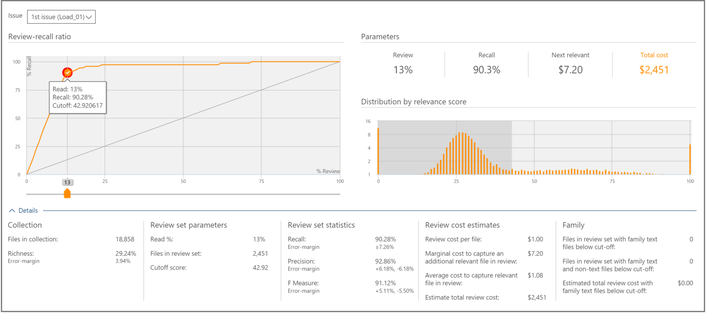

# Decisões com base nos resultados de relevância na descoberta eletrônica avançada
  
No módulo de relevância na descoberta eletrônica avançada, a guia decidir fornece informações adicionais para exibir e usar estatísticas de suporte à decisão para determinar o tamanho do conjunto de análise de arquivos de caso.
  
## Usando a guia decidir

  
Esta guia inclui os seguintes componentes:
  
- **Problema**: aqui, você pode selecionar o problema de interesse na lista.

- **Taxa de recuperação de revisão**: comparações de análise de descoberta eletrônica avançada de acordo com as pontuações de relevância. O ponto de corte no gráfico representa a porcentagem de arquivos a serem revisados, mapeados para uma pontuação de relevância. Isso é usado na fase de teste de relevância e como um limite de exportação para a seleção. O ponto de corte padrão, para o número de arquivos a serem revisados, é o ponto no qual o equilíbrio entre recall e Precision é ideal. O ponto de corte real deve ser determinado pelo usuário dependendo dos objetivos e da troca de custo (% revisão) e risco (% recall). Usando o controle deslizante, você pode ajustar o ponto de corte e ver o efeito no gráfico e nos parâmetros, ao ajustar a porcentagem de arquivos relevantes a serem recuperados e antes de validar uma decisão.

- **Parâmetros**: revisar, renovar, os parâmetros de custo total relevantes e totais são estatísticas calculadas cumulativas referentes ao conjunto de revisão em relação à coleção para o caso inteiro. As definições desses parâmetros são as seguintes:

  - **Revisão**: porcentagem de arquivos a serem revisados com base nesse corte.

  - **Recall**: porcentagem de arquivos relevantes no conjunto de revisão.

  - **Próximo relevante**: o custo para revisar e identificar outro arquivo relevante que não esteja no conjunto de revisão.

  - **Custo total**: custo para a revisão desse percentual dos arquivos de caso. As configurações de parâmetros de custo podem ser definidas pelo gerente de caso.

  - **Distribuição por Pontuação de relevância**: os arquivos na exibição cinza escuro à esquerda estão abaixo da Pontuação de corte. Uma dica de ferramenta exibe a pontuação de relevância e a porcentagem relacionada de arquivos no conjunto de arquivos de revisão em relação ao total de arquivos.

O painel de **detalhes** expandido exibe mais detalhes. Os arquivos nas figuras de coleção não incluem arquivos vazios ou nebulous. Os números de arquivos da família representam arquivos que não são carregados em relevância, ainda que sejam contados como parte da família.
